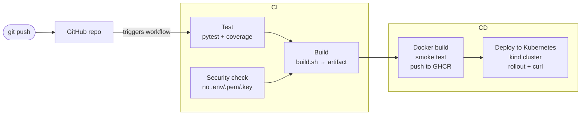
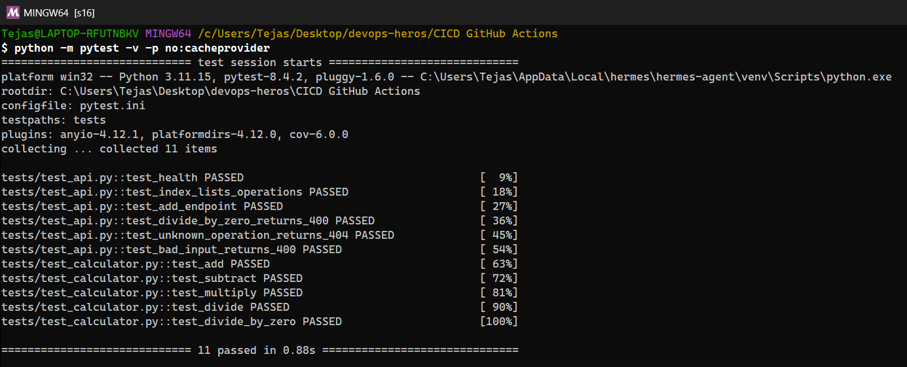
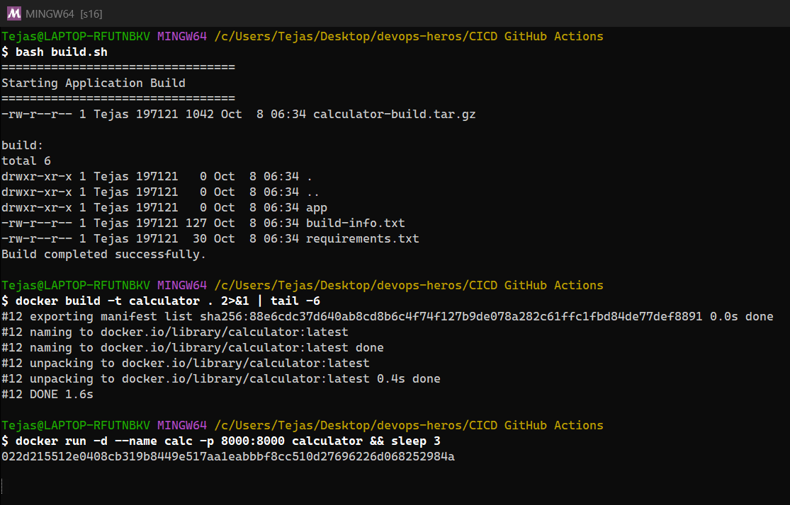
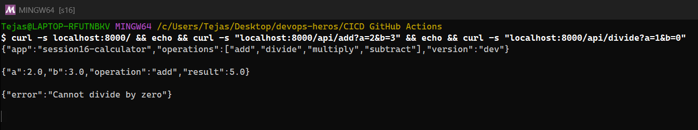
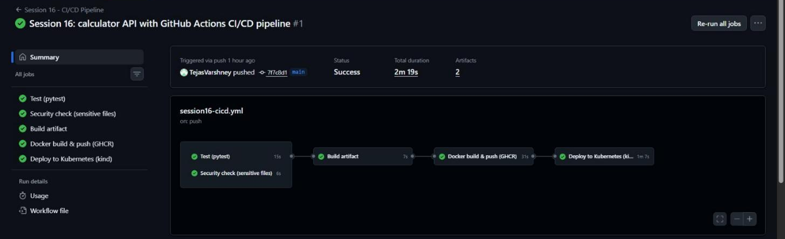
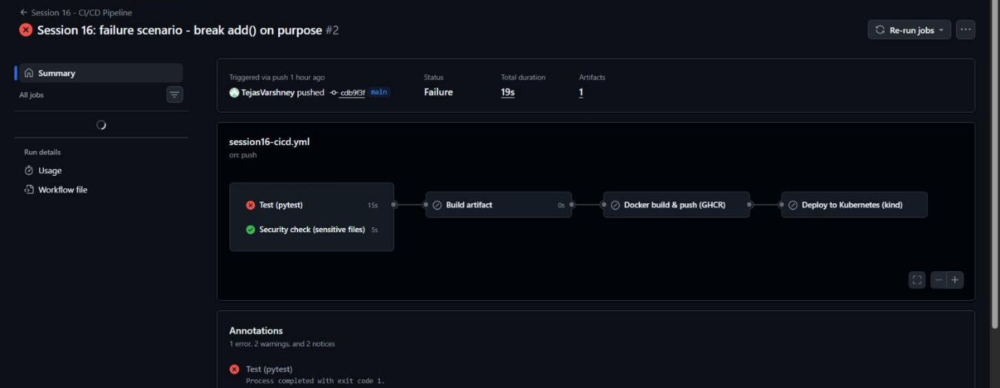
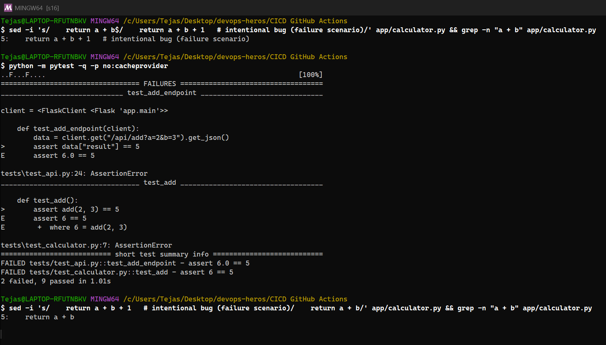
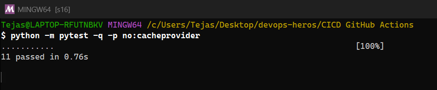
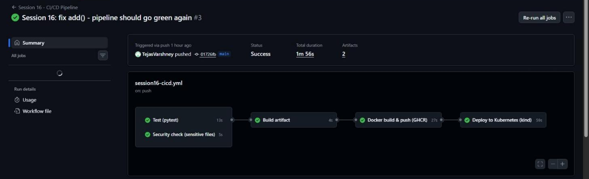
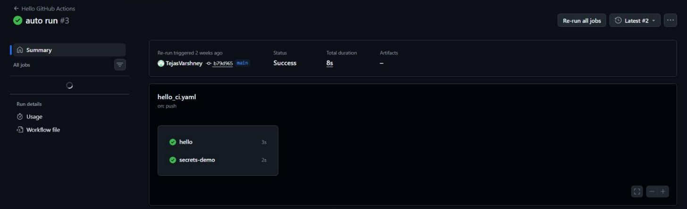

# Session 16: CI/CD & GitHub Actions

> 📸 **Screenshots:** the terminal images are **real screenshots of my terminal window** (Git Bash on Windows 11) taken while I re-ran every command on my minikube cluster. Pod names, IPs and ages therefore differ slightly from the *Text output (original run)* sections, which keep the output from my first run. The GitHub Actions images are real browser screenshots of the run pages.

**Name:** Tejas Varshney

A complete CI/CD demo project: a small **Calculator REST API** (Python/Flask) that is tested, packaged, containerised, pushed to a registry and deployed to Kubernetes, all by **GitHub Actions** on every push. Based on the course's `10-final-cicd-pipeline` (test → security check → build → artifact), extended with the CD half.

| Deliverable | Where |
|---|---|
| Application source code | [app/calculator.py](app/calculator.py) (logic), [app/main.py](app/main.py) (API) |
| Tests | [tests/](tests): 11 unit + API tests |
| Dockerfile | [Dockerfile](Dockerfile) (non-root, gunicorn) |
| GitHub Actions workflow (CI + CD) | [.github/workflows/session16-cicd.yml](../.github/workflows/session16-cicd.yml) |
| Kubernetes manifest (CD target) | [k8s/deployment.yaml](k8s/deployment.yaml) |
| Pipeline executions | [Actions runs](https://github.com/TejasVarshney/devops-heros/actions/workflows/session16-cicd.yml) · evidence in [outputs/](outputs) |

---

## 1. CI vs CD

| | **Continuous Integration (CI)** | **Continuous Delivery / Deployment (CD)** |
|---|---|---|
| Goal | Every change is merged often and **verified automatically** | Every verified change is **releasable** (Delivery) or **released automatically** (Deployment) |
| Typical steps | Checkout → install → lint → **test** → security checks → **build** artifact | Package (Docker image) → push to registry → **deploy** → smoke test |
| Answers | "Does this commit work?" | "Can users get it, safely and repeatably?" |
| In this project | Jobs `test`, `security-check`, `build` | Jobs `docker`, `deploy` |

## 2. The CI/CD pipeline



`test` and `security-check` run **in parallel**. `build` has `needs: [test, security-check]`, so it only runs if **both** pass, and each CD job `needs` the previous one. A failure anywhere stops everything after it, which I demonstrate below.

## 3. GitHub Actions concepts, mapped to my workflow

| Concept | What it is | In [session16-cicd.yml](../.github/workflows/session16-cicd.yml) |
|---|---|---|
| **Workflow** | A YAML file in `.github/workflows/` describing automation | `name: Session 16 - CI/CD Pipeline` |
| **Events / triggers** | What starts it | `push` to `main` (only when `CICD GitHub Actions/**` changes, via `paths`), `pull_request`, and `workflow_dispatch` (manual button) |
| **Jobs** | Groups of steps; run in parallel unless `needs:` orders them | `test`, `security-check`, `build`, `docker`, `deploy` |
| **Steps** | Individual commands (`run:`) or reusable actions (`uses:`) inside a job; run sequentially on the same machine | e.g. `actions/checkout@v4` → `actions/setup-python@v5` → `pip install` → `pytest` |
| **Runners** | The machine that executes a job | `runs-on: ubuntu-latest`, a fresh **GitHub-hosted** VM per job (the run evidence shows a different runner ID per job). Self-hosted runners are the alternative |
| **Secrets** | Encrypted values injected at runtime and masked in logs | `secrets.GITHUB_TOKEN` logs in to GHCR (`docker/login-action`). The `permissions: packages: write` block lets that token push images. Custom secrets (`Settings → Secrets and variables → Actions`) work the same way; my earlier [devops-new](https://github.com/TejasVarshney/devops-new) repo used `secrets.DEMO_SECRET` |
| **Artifacts** | Files saved from a job, downloadable after the run | `test-report` (JUnit XML + coverage.xml) and `calculator-build` (the tar.gz from `build.sh`), via `actions/upload-artifact@v4` |
| **Build** | Produce the deliverable | `build.sh` (packaged app + build-info) and the Docker image tagged with the commit SHA |
| **Test** | Automated verification | `pytest -v --cov=app` (11 tests), plus a container smoke test (`curl /health`, `/api/multiply`) and a post-deploy test |
| **Outputs between jobs** | Pass data from job to job | `docker` exports `outputs.image`, and `deploy` uses `needs.docker.outputs.image` so it deploys the exact image just built |
| **Caching** | Speed up dependency installs | `setup-python` with `cache: pip` |

## 4. Running it locally

```bash
cd "CICD GitHub Actions"
pip install -r requirements-dev.txt
pytest -v                                  # 11 passed
python -m app.main                         # http://localhost:8000/api/add?a=2&b=3
docker build -t calculator . && docker run -p 8000:8000 calculator
bash build.sh                              # creates calculator-build.tar.gz
```





<details><summary>Text output (original run)</summary>

```text
$ pytest -v   (locally, after the fix)
plugins: anyio-4.12.1, platformdirs-4.12.0, cov-6.0.0
collecting ... collected 11 items

tests/test_api.py::test_health PASSED                                    [  9%]
tests/test_api.py::test_index_lists_operations PASSED                    [ 18%]
tests/test_api.py::test_add_endpoint PASSED                              [ 27%]
tests/test_api.py::test_divide_by_zero_returns_400 PASSED                [ 36%]
tests/test_api.py::test_unknown_operation_returns_404 PASSED             [ 45%]
tests/test_api.py::test_bad_input_returns_400 PASSED                     [ 54%]
tests/test_calculator.py::test_add PASSED                                [ 63%]
tests/test_calculator.py::test_subtract PASSED                           [ 72%]
tests/test_calculator.py::test_multiply PASSED                           [ 81%]
tests/test_calculator.py::test_divide PASSED                             [ 90%]
tests/test_calculator.py::test_divide_by_zero PASSED                     [100%]

============================= 11 passed in 0.35s ==============================
```

</details>

---

## 5. Pipeline execution (real runs on GitHub)

### Run 1: first push, every job green



[Run #1](https://github.com/TejasVarshney/devops-heros/actions/runs/37675972002): CI → CD all the way to the deployment on Kubernetes, with both artifacts uploaded.

```text
Workflow: Session 16 - CI/CD Pipeline
Run #1  event=push  commit=7f7c8d1  "Session 16: calculator API with GitHub Actions CI/CD pipeline"
Status: completed / success
Started 2026-10-07T19:38:07Z  updated 2026-10-07T19:40:26Z
URL: https://github.com/TejasVarshney/devops-heros/actions/runs/37675972002

JOB  Test (pytest)                                           success   runner: GitHub Actions 1000000027 (ubuntu-latest)
      1. Set up job                                              success
      2. Run actions/checkout@v4                                 success
      3. Run actions/setup-python@v5                             success
      4. Install dependencies                                    success
      5. Run unit tests with coverage                            success
      6. Upload test report                                      success
     11. Post Run actions/setup-python@v5                        success
     12. Post Run actions/checkout@v4                            success
     13. Complete job                                            success
JOB  Security check (sensitive files)                        success   runner: GitHub Actions 1000000026 (ubuntu-latest)
      1. Set up job                                              success
      2. Run actions/checkout@v4                                 success
      3. Fail if private keys / .env files are committed         success
      6. Post Run actions/checkout@v4                            success
      7. Complete job                                            success
JOB  Build artifact                                          success   runner: GitHub Actions 1000000028 (ubuntu-latest)
      1. Set up job                                              success
      2. Run actions/checkout@v4                                 success
      3. Run build script                                        success
      4. Upload build artifact                                   success
      8. Post Run actions/checkout@v4                            success
      9. Complete job                                            success
JOB  Docker build & push (GHCR)                              success   runner: GitHub Actions 1000000029 (ubuntu-latest)
      1. Set up job                                              success
      2. Run actions/checkout@v4                                 success
      3. Run echo "image=${IMAGE_NAME}:${GITHUB_SHA::7}" >> "$GITHUB_OUTPUT" success
      4. Build image                                             success
      5. Smoke-test the container                                success
      6. Log in to GHCR (secret = GITHUB_TOKEN)                  success
      7. Push image                                              success
     13. Post Log in to GHCR (secret = GITHUB_TOKEN)             success
     14. Post Run actions/checkout@v4                            success
     15. Complete job                                            success
JOB  Deploy to Kubernetes (kind)                             success   runner: GitHub Actions 1000000030 (ubuntu-latest)
      1. Set up job                                              success
      2. Run actions/checkout@v4                                 success
      3. Create kind cluster                                     success
      4. Deploy                                                  success
      5. Verify the deployed app                                 success
      9. Post Create kind cluster                                success
     10. Post Run actions/checkout@v4                            success
     11. Complete job                                            success

Artifacts:
  - test-report  (1124 bytes)
  - calculator-build  (1222 bytes)
```

### Run 2: failure scenario (from the course README)



I broke `add()` on purpose (`return a + b + 1`) and pushed it.




<details><summary>Text output (original run)</summary>

```text
$ pytest -q   (locally, with the bug)
E       assert 6.0 == 5

tests\test_api.py:24: AssertionError
__________________________________ test_add ___________________________________

    def test_add():
>       assert add(2, 3) == 5
E       assert 6 == 5
E        +  where 6 = add(2, 3)

tests\test_calculator.py:7: AssertionError
=========================== short test summary info ===========================
FAILED tests/test_api.py::test_add_endpoint - assert 6.0 == 5
FAILED tests/test_calculator.py::test_add - assert 6 == 5
2 failed, 9 passed in 0.72s
```

</details>

[Run #2](https://github.com/TejasVarshney/devops-heros/actions/runs/37677624867): **Test failed → Build, Docker and Deploy were skipped** (`needs:` doing its job). The `test-report` artifact was still uploaded thanks to `if: always()`, so the failure can be inspected.

```text
Workflow: Session 16 - CI/CD Pipeline
Run #2  event=push  commit=cdb9f3f  "Session 16: failure scenario - break add() on purpose"
Status: completed / failure
Started 2026-10-07T19:51:16Z  updated 2026-10-07T19:51:35Z
URL: https://github.com/TejasVarshney/devops-heros/actions/runs/37677624867

JOB  Test (pytest)                                           failure   runner: GitHub Actions 1000000053 (ubuntu-latest)
      1. Set up job                                              success
      2. Run actions/checkout@v4                                 success
      3. Run actions/setup-python@v5                             success
      4. Install dependencies                                    success
      5. Run unit tests with coverage                            failure
      6. Upload test report                                      success
     11. Post Run actions/setup-python@v5                        skipped
     12. Post Run actions/checkout@v4                            success
     13. Complete job                                            success
JOB  Security check (sensitive files)                        success   runner: GitHub Actions 1000000052 (ubuntu-latest)
      1. Set up job                                              success
      2. Run actions/checkout@v4                                 success
      3. Fail if private keys / .env files are committed         success
      6. Post Run actions/checkout@v4                            success
      7. Complete job                                            success
JOB  Build artifact                                          skipped   runner: None (ubuntu-latest)
JOB  Deploy to Kubernetes (kind)                             skipped   runner: None (ubuntu-latest)
JOB  Docker build & push (GHCR)                              skipped   runner: None (ubuntu-latest)

Artifacts:
  - test-report  (1354 bytes)
```

### Run 3: fix pushed, back to green



[Run #3](https://github.com/TejasVarshney/devops-heros/actions/runs/37677819623):

```text
Workflow: Session 16 - CI/CD Pipeline
Run #3  event=push  commit=01726fb  "Session 16: fix add() - pipeline should go green again"
Status: completed / success
Started 2026-10-07T19:52:49Z  updated 2026-10-07T19:54:45Z
URL: https://github.com/TejasVarshney/devops-heros/actions/runs/37677819623

JOB  Security check (sensitive files)                        success   runner: GitHub Actions 1000000055 (ubuntu-latest)
      1. Set up job                                              success
      2. Run actions/checkout@v4                                 success
      3. Fail if private keys / .env files are committed         success
      6. Post Run actions/checkout@v4                            success
      7. Complete job                                            success
JOB  Test (pytest)                                           success   runner: GitHub Actions 1000000056 (ubuntu-latest)
      1. Set up job                                              success
      2. Run actions/checkout@v4                                 success
      3. Run actions/setup-python@v5                             success
      4. Install dependencies                                    success
      5. Run unit tests with coverage                            success
      6. Upload test report                                      success
     11. Post Run actions/setup-python@v5                        success
     12. Post Run actions/checkout@v4                            success
     13. Complete job                                            success
JOB  Build artifact                                          success   runner: GitHub Actions 1000000057 (ubuntu-latest)
      1. Set up job                                              success
      2. Run actions/checkout@v4                                 success
      3. Run build script                                        success
      4. Upload build artifact                                   success
      8. Post Run actions/checkout@v4                            success
      9. Complete job                                            success
JOB  Docker build & push (GHCR)                              success   runner: GitHub Actions 1000000058 (ubuntu-latest)
      1. Set up job                                              success
      2. Run actions/checkout@v4                                 success
      3. Run echo "image=${IMAGE_NAME}:${GITHUB_SHA::7}" >> "$GITHUB_OUTPUT" success
      4. Build image                                             success
      5. Smoke-test the container                                success
      6. Log in to GHCR (secret = GITHUB_TOKEN)                  success
      7. Push image                                              success
     13. Post Log in to GHCR (secret = GITHUB_TOKEN)             success
     14. Post Run actions/checkout@v4                            success
     15. Complete job                                            success
JOB  Deploy to Kubernetes (kind)                             success   runner: GitHub Actions 1000000059 (ubuntu-latest)
      1. Set up job                                              success
      2. Run actions/checkout@v4                                 success
      3. Create kind cluster                                     success
      4. Deploy                                                  success
      5. Verify the deployed app                                 success
      9. Post Create kind cluster                                success
     10. Post Run actions/checkout@v4                            success
     11. Complete job                                            success

Artifacts:
  - test-report  (1123 bytes)
  - calculator-build  (1222 bytes)
```

### Earlier practice: my `devops-new` repo



Before this project I practised the basics (jobs, steps, runner OS info, secrets) in [TejasVarshney/devops-new](https://github.com/TejasVarshney/devops-new). Its workflow has two jobs, `hello` and `secrets-demo` (the latter fails if `DEMO_SECRET` isn't configured), and all three runs succeeded:

```text
Repository: https://github.com/TejasVarshney/devops-new  (my earlier GitHub Actions practice repo)

Run #3  Hello GitHub Actions  "auto run"  -> success  (2026-09-24T07:50:39Z)  https://github.com/TejasVarshney/devops-new/actions/runs/35971832651
Run #2  Hello GitHub Actions  "added echo command in .yaml file"  -> success  (2026-09-24T07:29:42Z)  https://github.com/TejasVarshney/devops-new/actions/runs/35969909309
Run #1  Hello GitHub Actions  "workflow ❌ workflows ✅"  -> success  (2026-09-24T07:27:18Z)  https://github.com/TejasVarshney/devops-new/actions/runs/35969694637

Jobs of run #3:
JOB secrets-demo: success
   1. Set up job                success
   2. Check secret              success
   3. Complete job              success
JOB hello: success
   1. Set up job                success
   2. Print message             success
   3. Show date                 success
   4. Show operating system     success
   5. Echo my name              success
   6. Complete job              success
```

---

## 6. What I learned
- `needs:` turns independent jobs into a pipeline with **quality gates**. A red test means nothing is built or deployed.
- `paths:` filters keep this monorepo efficient: this workflow only runs when the Session 16 folder changes.
- `GITHUB_TOKEN` + `permissions:` let me push to GHCR with **zero stored secrets**. Least privilege: only this job gets `packages: write`.
- Artifacts are for humans and later jobs (reports, packages). Registries are for deployable images.
- Every job runs on a **clean VM**, so each job must check out code and install what it needs (or share via artifacts/outputs).
- Deploying to a throwaway **kind** cluster inside the runner is a cheap way to test the Kubernetes manifests on every push, before pointing CD at a real cluster.
