# Session 19: Cloud & Terraform in Action

> 📸 **Screenshots:** the terminal images on this page are rendered from the exact command output captured during my runs (full text is under each *Text output* section). The GitHub Actions images are real browser screenshots of the run pages.

**Name:** Tejas Varshney

An end-to-end AWS infrastructure project with Terraform: **VPC → public subnet → Internet Gateway → route table → security group → EC2 web server**, plus an **S3 bucket**. All code is in [terraform/](terraform).

| Deliverable | Where |
|---|---|
| Terraform project | [terraform/](terraform) |
| Architecture diagram | below (and the real Terraform dependency graph) |
| Commands + outputs | below / [terraform/outputs/](terraform/outputs) |
| Pipeline that ran it | [.github/workflows/terraform-sessions-18-19.yml](../.github/workflows/terraform-sessions-18-19.yml) |

---

## Architecture

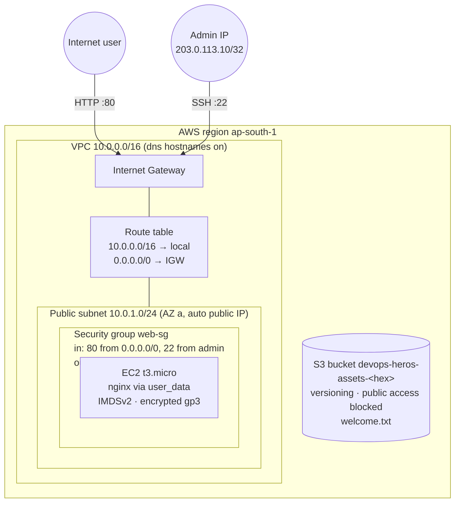
```mermaid
flowchart TB
    user((Internet user)) -->|HTTP :80| igw
    admin((Admin IP<br/>203.0.113.10/32)) -->|SSH :22| igw
    subgraph aws["AWS region ap-south-1"]
      subgraph vpc["VPC 10.0.0.0/16 (dns hostnames on)"]
        igw[Internet Gateway]
        rt["Route table<br/>10.0.0.0/16 → local<br/>0.0.0.0/0 → IGW"]
        subgraph subnet["Public subnet 10.0.1.0/24 (AZ a, auto public IP)"]
          subgraph sg["Security group web-sg<br/>in: 80 from 0.0.0.0/0, 22 from admin<br/>out: all"]
            ec2["EC2 t3.micro<br/>nginx via user_data<br/>IMDSv2 · encrypted gp3"]
          end
        end
      end
      s3[("S3 bucket devops-heros-assets-&lt;hex&gt;<br/>versioning · public access blocked<br/>welcome.txt")]
    end
    igw --- rt --- subnet
```

### Terraform dependency graph (generated by `terraform graph` in the pipeline)

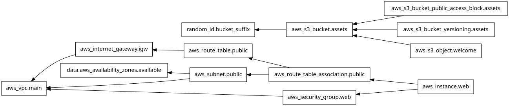

Arrows point from a resource to what it **depends on**. Terraform builds this DAG and creates independent branches **in parallel** (the S3 branch and the network branch run at the same time). It destroys them in **reverse** order.

---

## How the project demonstrates each concept

| Concept | Where in the code |
|---|---|
| **Providers** | [versions.tf](terraform/versions.tf) pins `hashicorp/aws ~> 5.0` + `hashicorp/random ~> 3.6`. [provider.tf](terraform/provider.tf) configures the region and `default_tags` that every resource inherits |
| **Variables** | [variables.tf](terraform/variables.tf): region, project, environment, CIDRs, instance type, AMI, SSH CIDR (typed, with defaults and descriptions). Values in [terraform.tfvars](terraform/terraform.tfvars). In CI, `TF_VAR_ami_id` overrides the AMI |
| **Resources** | 12 in total: [network.tf](terraform/network.tf) (VPC, subnet, IGW, route table, association, SG), [compute.tf](terraform/compute.tf) (EC2), [storage.tf](terraform/storage.tf) (random_id, bucket, versioning, public-access block, object) |
| **Data source** | `data.aws_availability_zones.available` picks the first AZ instead of hard-coding it |
| **Outputs** | [outputs.tf](terraform/outputs.tf): VPC/subnet/SG/instance IDs, public IP, URL, bucket |
| **Implicit dependencies** | Any reference, e.g. `vpc_id = aws_vpc.main.id`, `subnet_id = aws_subnet.public.id` |
| **Explicit dependency** | `depends_on = [aws_route_table_association.public]` on the EC2 instance: user_data runs `dnf install nginx` at boot, so the internet route must exist first even though nothing in the instance references it |
| **State** | `terraform state list` after apply (12 addresses) and empty after destroy; `plan` re-reads state + reality |
| **plan / apply / destroy** | Full run below |

Security choices: SSH only from one `/32`, IMDSv2 required (`http_tokens = "required"`), encrypted root volume, S3 public access blocked, versioning on.

---

## Where it ran (honest note)

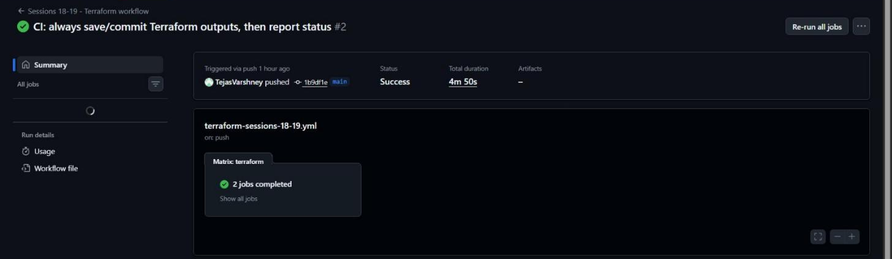


No AWS credentials are configured for this repo, so the GitHub Actions pipeline runs Terraform against **Moto**, an open-source AWS API emulator running as a service container. A CI-only `ci_moto_override.tf` points the provider's endpoints at it. The code itself is plain AWS Terraform and runs unchanged against a real account with `aws configure && terraform apply`. The CI picks an AMI ID from Moto's catalogue because the real Amazon Linux AMI ID doesn't exist in the emulator.

```text
runner: Linux / ubuntu24
Terraform v1.13.3
on linux_amd64
+ provider registry.terraform.io/hashicorp/aws v5.100.0
+ provider registry.terraform.io/hashicorp/random v3.9.1

Your version of Terraform is out of date! The latest version
is 1.16.5. You can update by downloading from https://developer.hashicorp.com/terraform/install
AWS API: Moto 200 (motoserver/moto:5.1.4)
Wed Oct  7 19:55:17 UTC 2026
```

## Terraform commands and output

### init
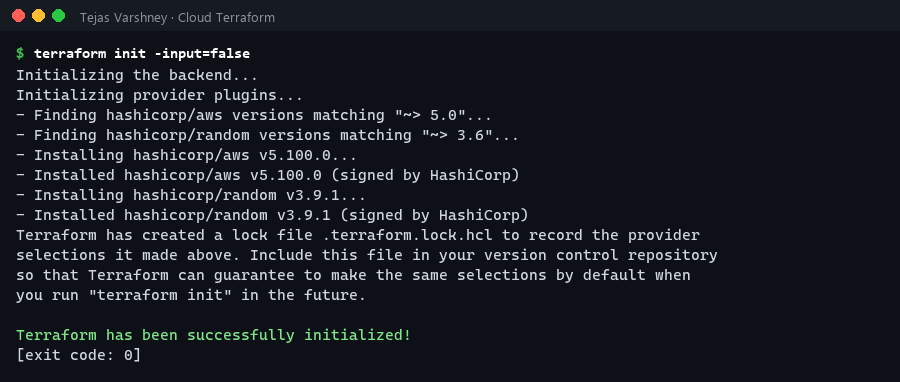

<details><summary>Text output</summary>

```text
$ terraform init -input=false
Initializing the backend...
Initializing provider plugins...
- Finding hashicorp/aws versions matching "~> 5.0"...
- Finding hashicorp/random versions matching "~> 3.6"...
- Installing hashicorp/aws v5.100.0...
- Installed hashicorp/aws v5.100.0 (signed by HashiCorp)
- Installing hashicorp/random v3.9.1...
- Installed hashicorp/random v3.9.1 (signed by HashiCorp)
Terraform has created a lock file .terraform.lock.hcl to record the provider
selections it made above. Include this file in your version control repository
so that Terraform can guarantee to make the same selections by default when
you run "terraform init" in the future.

Terraform has been successfully initialized!
[exit code: 0]
```

</details>

### fmt + validate
```text
$ terraform fmt -check -diff -recursive
[exit code: 0]
```
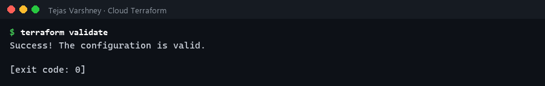

<details><summary>Text output</summary>

```text
$ terraform validate
Success! The configuration is valid.

[exit code: 0]
```

</details>

### plan
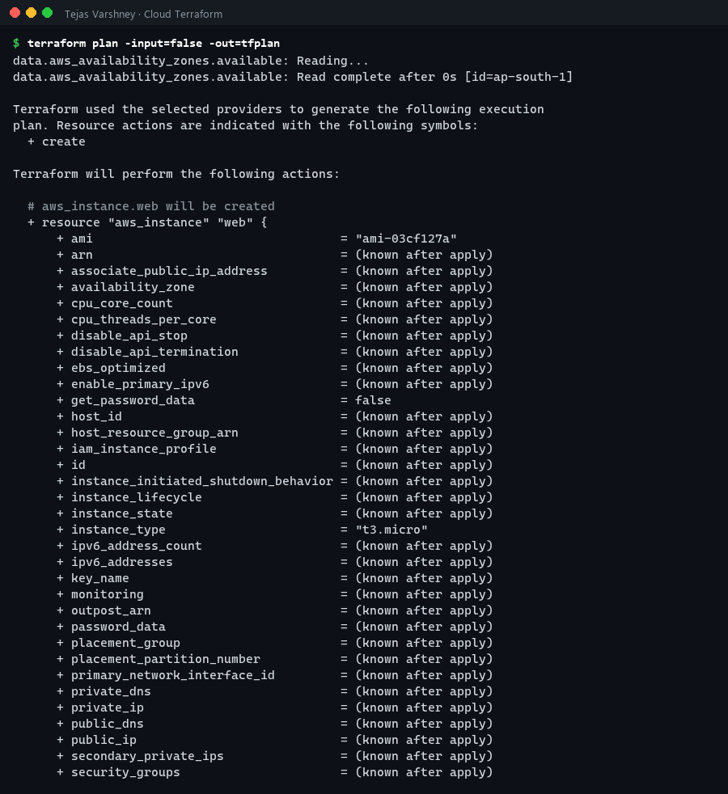
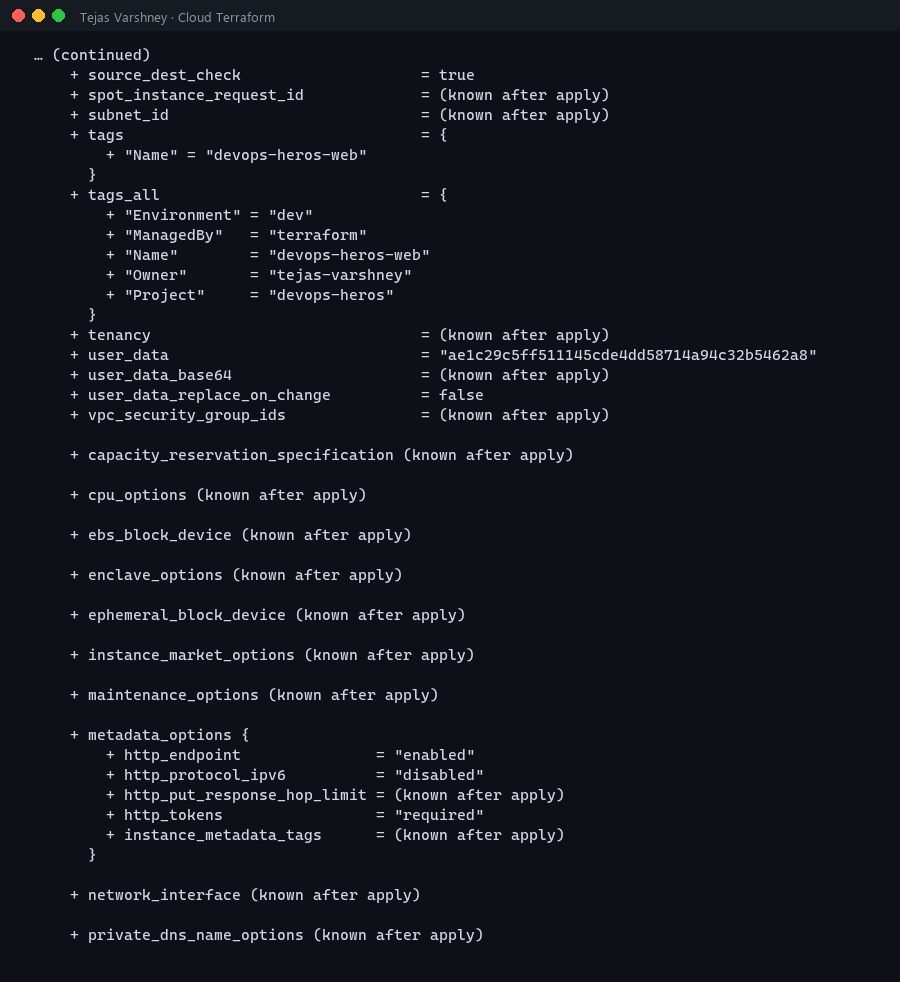
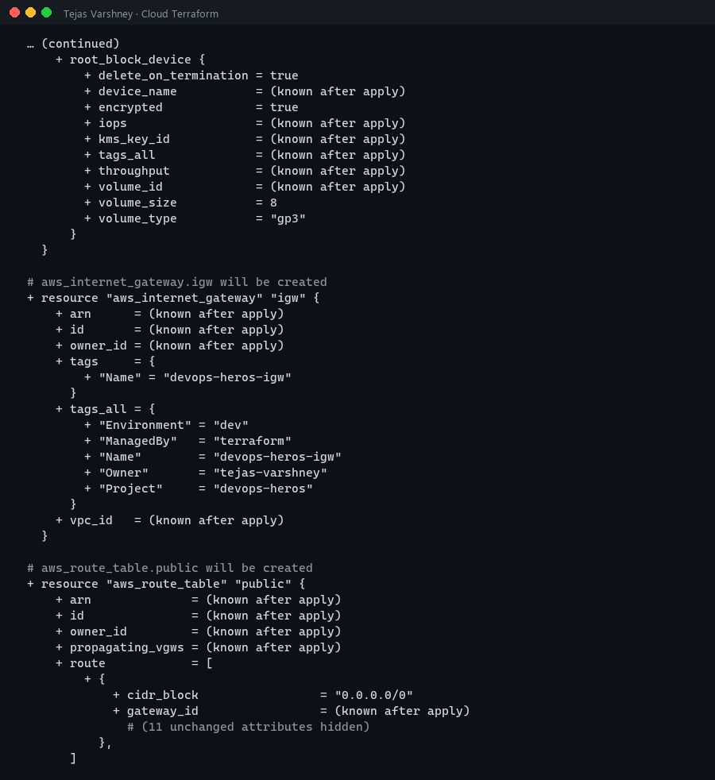
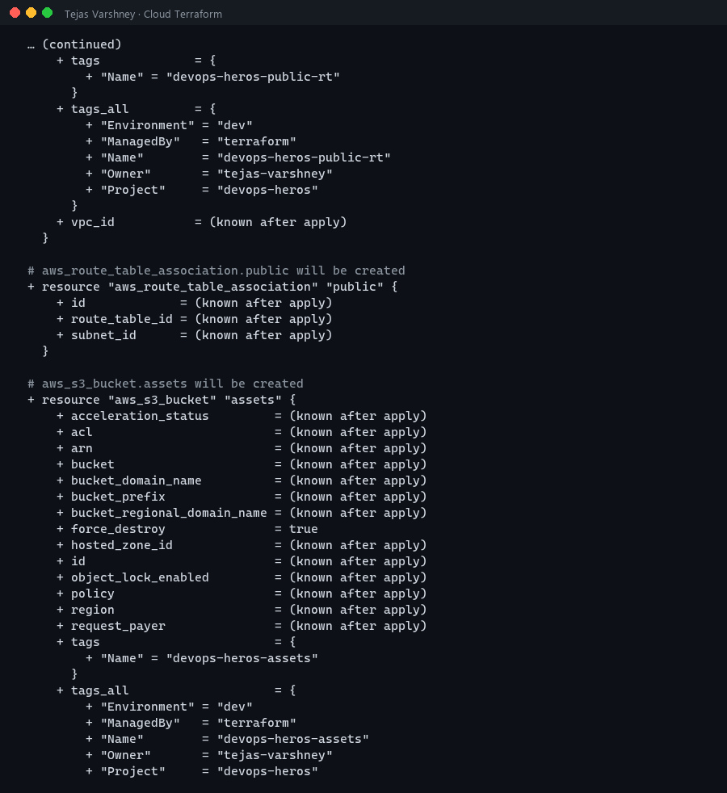
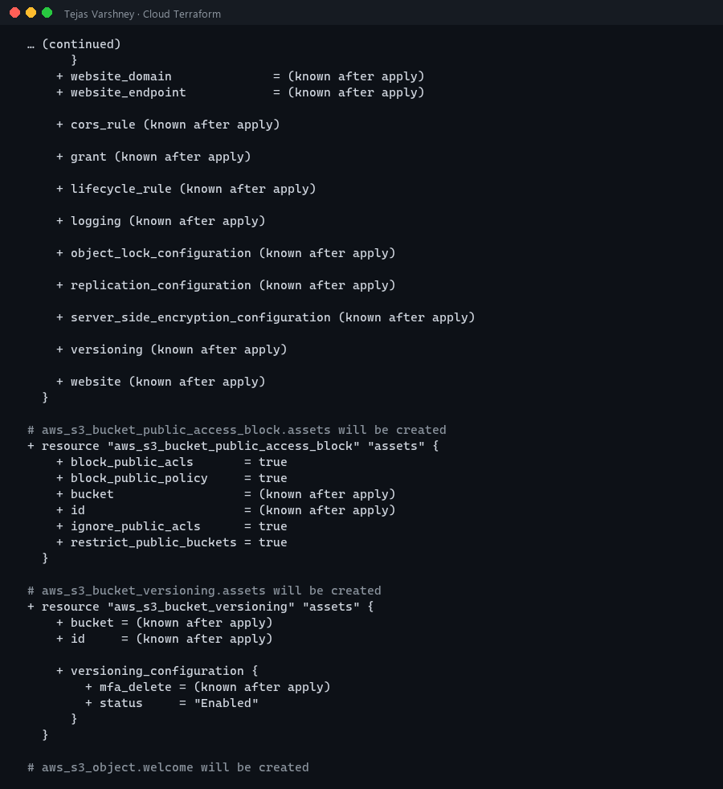
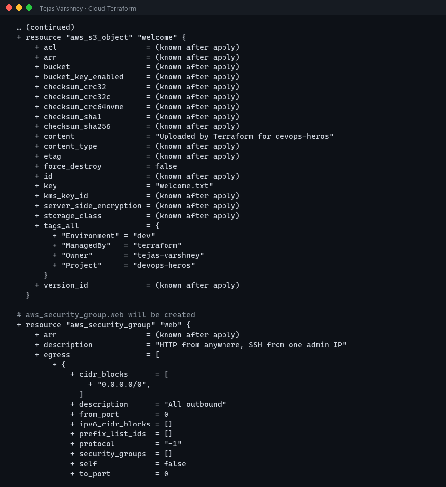
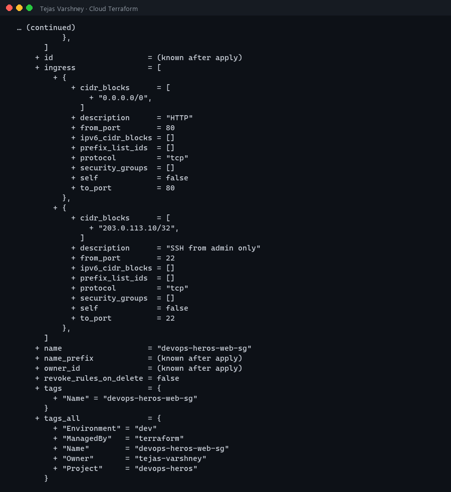
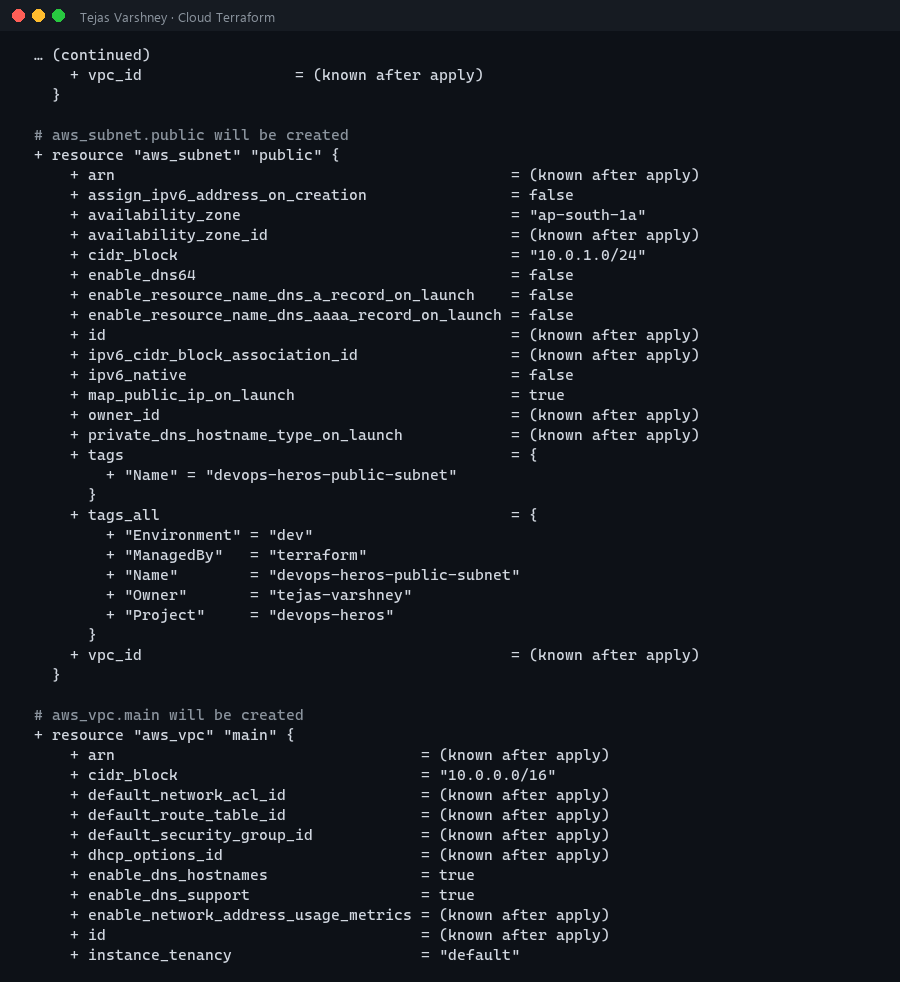
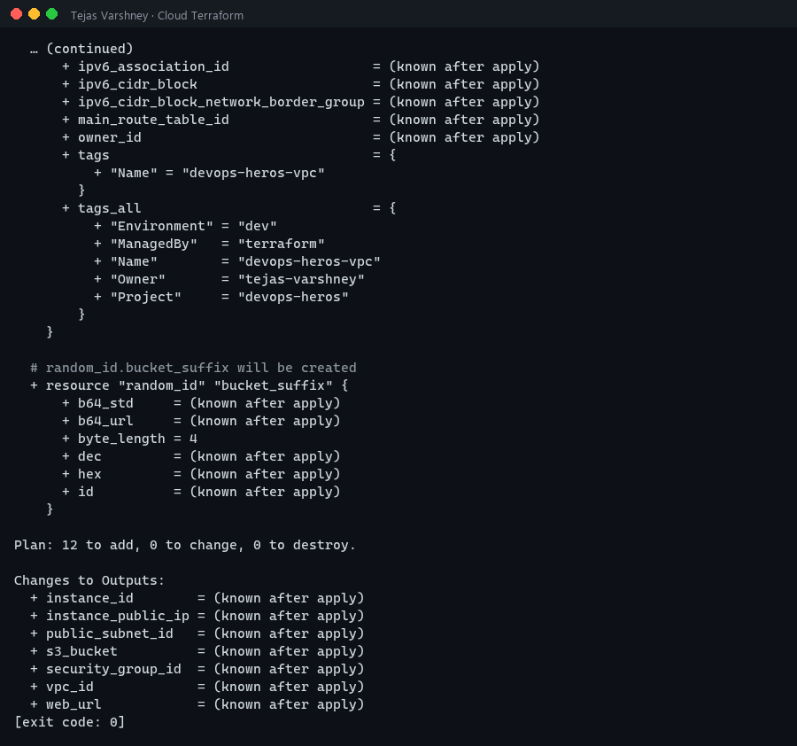

<details><summary>Text output</summary>

```text
$ terraform plan -input=false -out=tfplan
data.aws_availability_zones.available: Reading...
data.aws_availability_zones.available: Read complete after 0s [id=ap-south-1]

Terraform used the selected providers to generate the following execution
plan. Resource actions are indicated with the following symbols:
  + create

Terraform will perform the following actions:

  # aws_instance.web will be created
  + resource "aws_instance" "web" {
      + ami                                  = "ami-03cf127a"
      + arn                                  = (known after apply)
      + associate_public_ip_address          = (known after apply)
      + availability_zone                    = (known after apply)
      + cpu_core_count                       = (known after apply)
      + cpu_threads_per_core                 = (known after apply)
      + disable_api_stop                     = (known after apply)
      + disable_api_termination              = (known after apply)
      + ebs_optimized                        = (known after apply)
      + enable_primary_ipv6                  = (known after apply)
      + get_password_data                    = false
      + host_id                              = (known after apply)
      + host_resource_group_arn              = (known after apply)
      + iam_instance_profile                 = (known after apply)
      + id                                   = (known after apply)
      + instance_initiated_shutdown_behavior = (known after apply)
      + instance_lifecycle                   = (known after apply)
      + instance_state                       = (known after apply)
      + instance_type                        = "t3.micro"
      + ipv6_address_count                   = (known after apply)
      + ipv6_addresses                       = (known after apply)
      + key_name                             = (known after apply)
      + monitoring                           = (known after apply)
      + outpost_arn                          = (known after apply)
      + password_data                        = (known after apply)
      + placement_group                      = (known after apply)
      + placement_partition_number           = (known after apply)
      + primary_network_interface_id         = (known after apply)
      + private_dns                          = (known after apply)
      + private_ip                           = (known after apply)
      + public_dns                           = (known after apply)
      + public_ip                            = (known after apply)
      + secondary_private_ips                = (known after apply)
      + security_groups                      = (known after apply)
      + source_dest_check                    = true
      + spot_instance_request_id             = (known after apply)
      + subnet_id                            = (known after apply)
      + tags                                 = {
          + "Name" = "devops-heros-web"
        }
      + tags_all                             = {
          + "Environment" = "dev"
          + "ManagedBy"   = "terraform"
          + "Name"        = "devops-heros-web"
          + "Owner"       = "tejas-varshney"
          + "Project"     = "devops-heros"
        }
      + tenancy                              = (known after apply)
      + user_data                            = "ae1c29c5ff511145cde4dd58714a94c32b5462a8"
      + user_data_base64                     = (known after apply)
      + user_data_replace_on_change          = false
      + vpc_security_group_ids               = (known after apply)

      + capacity_reservation_specification (known after apply)

      + cpu_options (known after apply)

      + ebs_block_device (known after apply)

      + enclave_options (known after apply)

      + ephemeral_block_device (known after apply)

      + instance_market_options (known after apply)

      + maintenance_options (known after apply)

      + metadata_options {
          + http_endpoint               = "enabled"
          + http_protocol_ipv6          = "disabled"
          + http_put_response_hop_limit = (known after apply)
          + http_tokens                 = "required"
          + instance_metadata_tags      = (known after apply)
        }

      + network_interface (known after apply)

      + private_dns_name_options (known after apply)

      + root_block_device {
          + delete_on_termination = true
          + device_name           = (known after apply)
          + encrypted             = true
          + iops                  = (known after apply)
          + kms_key_id            = (known after apply)
          + tags_all              = (known after apply)
          + throughput            = (known after apply)
          + volume_id             = (known after apply)
          + volume_size           = 8
          + volume_type           = "gp3"
        }
    }

  # aws_internet_gateway.igw will be created
  + resource "aws_internet_gateway" "igw" {
      + arn      = (known after apply)
      + id       = (known after apply)
      + owner_id = (known after apply)
      + tags     = {
          + "Name" = "devops-heros-igw"
        }
      + tags_all = {
          + "Environment" = "dev"
          + "ManagedBy"   = "terraform"
          + "Name"        = "devops-heros-igw"
          + "Owner"       = "tejas-varshney"
          + "Project"     = "devops-heros"
        }
      + vpc_id   = (known after apply)
    }

  # aws_route_table.public will be created
  + resource "aws_route_table" "public" {
      + arn              = (known after apply)
      + id               = (known after apply)
      + owner_id         = (known after apply)
      + propagating_vgws = (known after apply)
      + route            = [
          + {
              + cidr_block                 = "0.0.0.0/0"
              + gateway_id                 = (known after apply)
                # (11 unchanged attributes hidden)
            },
        ]
      + tags             = {
          + "Name" = "devops-heros-public-rt"
        }
      + tags_all         = {
          + "Environment" = "dev"
          + "ManagedBy"   = "terraform"
          + "Name"        = "devops-heros-public-rt"
          + "Owner"       = "tejas-varshney"
          + "Project"     = "devops-heros"
        }
      + vpc_id           = (known after apply)
    }

  # aws_route_table_association.public will be created
  + resource "aws_route_table_association" "public" {
      + id             = (known after apply)
      + route_table_id = (known after apply)
      + subnet_id      = (known after apply)
    }

  # aws_s3_bucket.assets will be created
  + resource "aws_s3_bucket" "assets" {
      + acceleration_status         = (known after apply)
      + acl                         = (known after apply)
      + arn                         = (known after apply)
      + bucket                      = (known after apply)
      + bucket_domain_name          = (known after apply)
      + bucket_prefix               = (known after apply)
      + bucket_regional_domain_name = (known after apply)
      + force_destroy               = true
      + hosted_zone_id              = (known after apply)
      + id                          = (known after apply)
      + object_lock_enabled         = (known after apply)
      + policy                      = (known after apply)
      + region                      = (known after apply)
      + request_payer               = (known after apply)
      + tags                        = {
          + "Name" = "devops-heros-assets"
        }
      + tags_all                    = {
          + "Environment" = "dev"
          + "ManagedBy"   = "terraform"
          + "Name"        = "devops-heros-assets"
          + "Owner"       = "tejas-varshney"
          + "Project"     = "devops-heros"
        }
      + website_domain              = (known after apply)
      + website_endpoint            = (known after apply)

      + cors_rule (known after apply)

      + grant (known after apply)

      + lifecycle_rule (known after apply)

      + logging (known after apply)

      + object_lock_configuration (known after apply)

      + replication_configuration (known after apply)

      + server_side_encryption_configuration (known after apply)

      + versioning (known after apply)

      + website (known after apply)
    }

  # aws_s3_bucket_public_access_block.assets will be created
  + resource "aws_s3_bucket_public_access_block" "assets" {
      + block_public_acls       = true
      + block_public_policy     = true
      + bucket                  = (known after apply)
      + id                      = (known after apply)
      + ignore_public_acls      = true
      + restrict_public_buckets = true
    }

  # aws_s3_bucket_versioning.assets will be created
  + resource "aws_s3_bucket_versioning" "assets" {
      + bucket = (known after apply)
      + id     = (known after apply)

      + versioning_configuration {
          + mfa_delete = (known after apply)
          + status     = "Enabled"
        }
    }

  # aws_s3_object.welcome will be created
  + resource "aws_s3_object" "welcome" {
      + acl                    = (known after apply)
      + arn                    = (known after apply)
      + bucket                 = (known after apply)
      + bucket_key_enabled     = (known after apply)
      + checksum_crc32         = (known after apply)
      + checksum_crc32c        = (known after apply)
      + checksum_crc64nvme     = (known after apply)
      + checksum_sha1          = (known after apply)
      + checksum_sha256        = (known after apply)
      + content                = "Uploaded by Terraform for devops-heros"
      + content_type           = (known after apply)
      + etag                   = (known after apply)
      + force_destroy          = false
      + id                     = (known after apply)
      + key                    = "welcome.txt"
      + kms_key_id             = (known after apply)
      + server_side_encryption = (known after apply)
      + storage_class          = (known after apply)
      + tags_all               = {
          + "Environment" = "dev"
          + "ManagedBy"   = "terraform"
          + "Owner"       = "tejas-varshney"
          + "Project"     = "devops-heros"
        }
      + version_id             = (known after apply)
    }

  # aws_security_group.web will be created
  + resource "aws_security_group" "web" {
      + arn                    = (known after apply)
      + description            = "HTTP from anywhere, SSH from one admin IP"
      + egress                 = [
          + {
              + cidr_blocks      = [
                  + "0.0.0.0/0",
                ]
              + description      = "All outbound"
              + from_port        = 0
              + ipv6_cidr_blocks = []
              + prefix_list_ids  = []
              + protocol         = "-1"
              + security_groups  = []
              + self             = false
              + to_port          = 0
            },
        ]
      + id                     = (known after apply)
      + ingress                = [
          + {
              + cidr_blocks      = [
                  + "0.0.0.0/0",
                ]
              + description      = "HTTP"
              + from_port        = 80
              + ipv6_cidr_blocks = []
              + prefix_list_ids  = []
              + protocol         = "tcp"
              + security_groups  = []
              + self             = false
              + to_port          = 80
            },
          + {
              + cidr_blocks      = [
                  + "203.0.113.10/32",
                ]
              + description      = "SSH from admin only"
              + from_port        = 22
              + ipv6_cidr_blocks = []
              + prefix_list_ids  = []
              + protocol         = "tcp"
              + security_groups  = []
              + self             = false
              + to_port          = 22
            },
        ]
      + name                   = "devops-heros-web-sg"
      + name_prefix            = (known after apply)
      + owner_id               = (known after apply)
      + revoke_rules_on_delete = false
      + tags                   = {
          + "Name" = "devops-heros-web-sg"
        }
      + tags_all               = {
          + "Environment" = "dev"
          + "ManagedBy"   = "terraform"
          + "Name"        = "devops-heros-web-sg"
          + "Owner"       = "tejas-varshney"
          + "Project"     = "devops-heros"
        }
      + vpc_id                 = (known after apply)
    }

  # aws_subnet.public will be created
  + resource "aws_subnet" "public" {
      + arn                                            = (known after apply)
      + assign_ipv6_address_on_creation                = false
      + availability_zone                              = "ap-south-1a"
      + availability_zone_id                           = (known after apply)
      + cidr_block                                     = "10.0.1.0/24"
      + enable_dns64                                   = false
      + enable_resource_name_dns_a_record_on_launch    = false
      + enable_resource_name_dns_aaaa_record_on_launch = false
      + id                                             = (known after apply)
      + ipv6_cidr_block_association_id                 = (known after apply)
      + ipv6_native                                    = false
      + map_public_ip_on_launch                        = true
      + owner_id                                       = (known after apply)
      + private_dns_hostname_type_on_launch            = (known after apply)
      + tags                                           = {
          + "Name" = "devops-heros-public-subnet"
        }
      + tags_all                                       = {
          + "Environment" = "dev"
          + "ManagedBy"   = "terraform"
          + "Name"        = "devops-heros-public-subnet"
          + "Owner"       = "tejas-varshney"
          + "Project"     = "devops-heros"
        }
      + vpc_id                                         = (known after apply)
    }

  # aws_vpc.main will be created
  + resource "aws_vpc" "main" {
      + arn                                  = (known after apply)
      + cidr_block                           = "10.0.0.0/16"
      + default_network_acl_id               = (known after apply)
      + default_route_table_id               = (known after apply)
      + default_security_group_id            = (known after apply)
      + dhcp_options_id                      = (known after apply)
      + enable_dns_hostnames                 = true
      + enable_dns_support                   = true
      + enable_network_address_usage_metrics = (known after apply)
      + id                                   = (known after apply)
      + instance_tenancy                     = "default"
      + ipv6_association_id                  = (known after apply)
      + ipv6_cidr_block                      = (known after apply)
      + ipv6_cidr_block_network_border_group = (known after apply)
      + main_route_table_id                  = (known after apply)
      + owner_id                             = (known after apply)
      + tags                                 = {
          + "Name" = "devops-heros-vpc"
        }
      + tags_all                             = {
          + "Environment" = "dev"
          + "ManagedBy"   = "terraform"
          + "Name"        = "devops-heros-vpc"
          + "Owner"       = "tejas-varshney"
          + "Project"     = "devops-heros"
        }
    }

  # random_id.bucket_suffix will be created
  + resource "random_id" "bucket_suffix" {
      + b64_std     = (known after apply)
      + b64_url     = (known after apply)
      + byte_length = 4
      + dec         = (known after apply)
      + hex         = (known after apply)
      + id          = (known after apply)
    }

Plan: 12 to add, 0 to change, 0 to destroy.

Changes to Outputs:
  + instance_id        = (known after apply)
  + instance_public_ip = (known after apply)
  + public_subnet_id   = (known after apply)
  + s3_bucket          = (known after apply)
  + security_group_id  = (known after apply)
  + vpc_id             = (known after apply)
  + web_url            = (known after apply)
[exit code: 0]
```

</details>

### apply
Notice the order in the log. The **whole S3 branch** (random_id → bucket → versioning/public-access/object) finished **while the VPC was still being created**, because the two branches run in parallel. After the VPC: IGW, subnet and SG in parallel, then the route table, the association, and **only then** the EC2 instance. That's the dependency graph in action.
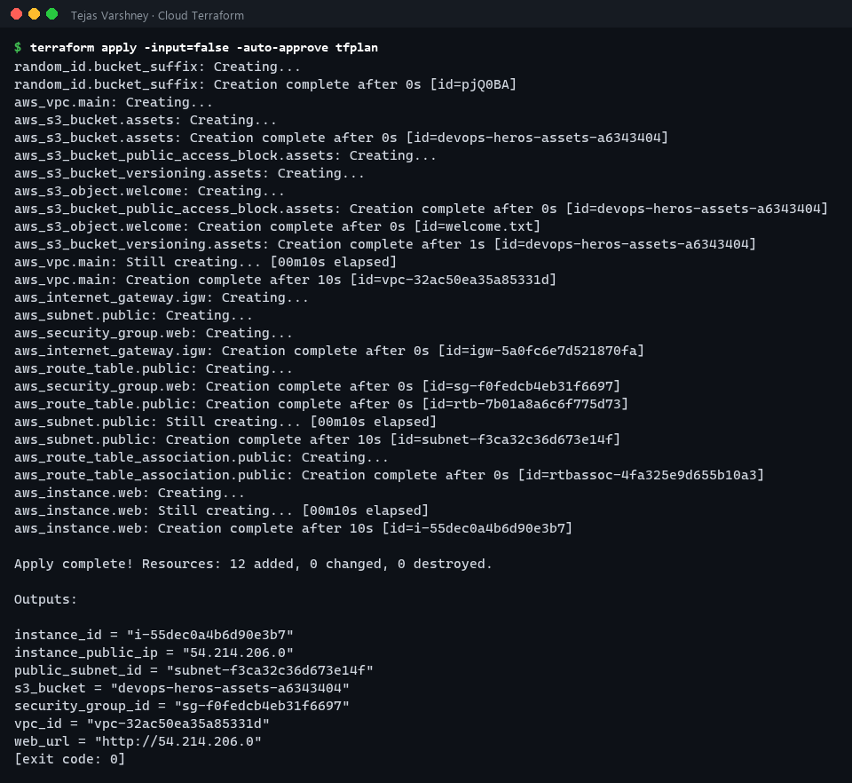

<details><summary>Text output</summary>

```text
$ terraform apply -input=false -auto-approve tfplan
random_id.bucket_suffix: Creating...
random_id.bucket_suffix: Creation complete after 0s [id=pjQ0BA]
aws_vpc.main: Creating...
aws_s3_bucket.assets: Creating...
aws_s3_bucket.assets: Creation complete after 0s [id=devops-heros-assets-a6343404]
aws_s3_bucket_public_access_block.assets: Creating...
aws_s3_bucket_versioning.assets: Creating...
aws_s3_object.welcome: Creating...
aws_s3_bucket_public_access_block.assets: Creation complete after 0s [id=devops-heros-assets-a6343404]
aws_s3_object.welcome: Creation complete after 0s [id=welcome.txt]
aws_s3_bucket_versioning.assets: Creation complete after 1s [id=devops-heros-assets-a6343404]
aws_vpc.main: Still creating... [00m10s elapsed]
aws_vpc.main: Creation complete after 10s [id=vpc-32ac50ea35a85331d]
aws_internet_gateway.igw: Creating...
aws_subnet.public: Creating...
aws_security_group.web: Creating...
aws_internet_gateway.igw: Creation complete after 0s [id=igw-5a0fc6e7d521870fa]
aws_route_table.public: Creating...
aws_security_group.web: Creation complete after 0s [id=sg-f0fedcb4eb31f6697]
aws_route_table.public: Creation complete after 0s [id=rtb-7b01a8a6c6f775d73]
aws_subnet.public: Still creating... [00m10s elapsed]
aws_subnet.public: Creation complete after 10s [id=subnet-f3ca32c36d673e14f]
aws_route_table_association.public: Creating...
aws_route_table_association.public: Creation complete after 0s [id=rtbassoc-4fa325e9d655b10a3]
aws_instance.web: Creating...
aws_instance.web: Still creating... [00m10s elapsed]
aws_instance.web: Creation complete after 10s [id=i-55dec0a4b6d90e3b7]

Apply complete! Resources: 12 added, 0 changed, 0 destroyed.

Outputs:

instance_id = "i-55dec0a4b6d90e3b7"
instance_public_ip = "54.214.206.0"
public_subnet_id = "subnet-f3ca32c36d673e14f"
s3_bucket = "devops-heros-assets-a6343404"
security_group_id = "sg-f0fedcb4eb31f6697"
vpc_id = "vpc-32ac50ea35a85331d"
web_url = "http://54.214.206.0"
[exit code: 0]
```

</details>

### output
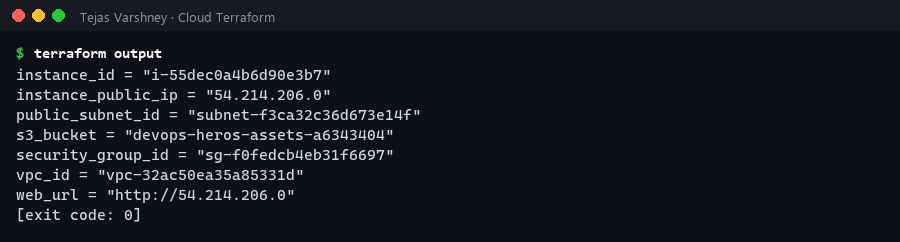

<details><summary>Text output</summary>

```text
$ terraform output
instance_id = "i-55dec0a4b6d90e3b7"
instance_public_ip = "54.214.206.0"
public_subnet_id = "subnet-f3ca32c36d673e14f"
s3_bucket = "devops-heros-assets-a6343404"
security_group_id = "sg-f0fedcb4eb31f6697"
vpc_id = "vpc-32ac50ea35a85331d"
web_url = "http://54.214.206.0"
[exit code: 0]
```

</details>

### state
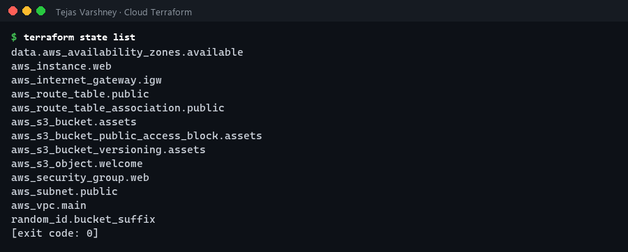

<details><summary>Text output</summary>

```text
$ terraform state list
data.aws_availability_zones.available
aws_instance.web
aws_internet_gateway.igw
aws_route_table.public
aws_route_table_association.public
aws_s3_bucket.assets
aws_s3_bucket_public_access_block.assets
aws_s3_bucket_versioning.assets
aws_s3_object.welcome
aws_security_group.web
aws_subnet.public
aws_vpc.main
random_id.bucket_suffix
[exit code: 0]
```

</details>

### plan again (drift check)
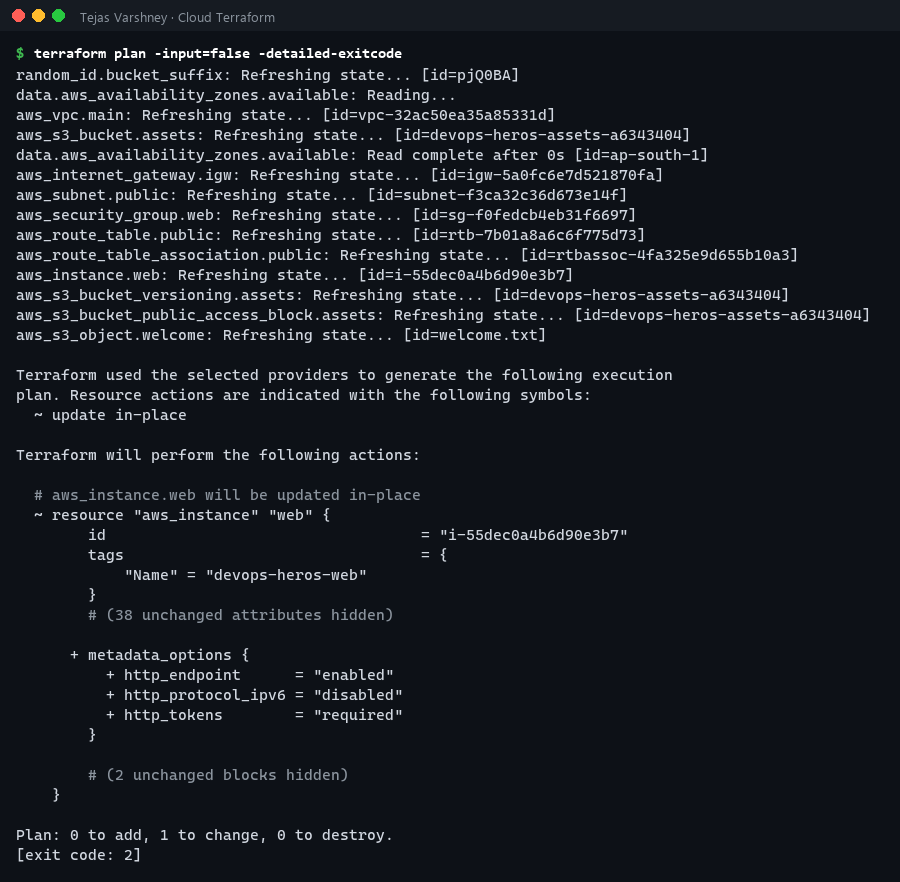

<details><summary>Text output</summary>

```text
$ terraform plan -input=false -detailed-exitcode
random_id.bucket_suffix: Refreshing state... [id=pjQ0BA]
data.aws_availability_zones.available: Reading...
aws_vpc.main: Refreshing state... [id=vpc-32ac50ea35a85331d]
aws_s3_bucket.assets: Refreshing state... [id=devops-heros-assets-a6343404]
data.aws_availability_zones.available: Read complete after 0s [id=ap-south-1]
aws_internet_gateway.igw: Refreshing state... [id=igw-5a0fc6e7d521870fa]
aws_subnet.public: Refreshing state... [id=subnet-f3ca32c36d673e14f]
aws_security_group.web: Refreshing state... [id=sg-f0fedcb4eb31f6697]
aws_route_table.public: Refreshing state... [id=rtb-7b01a8a6c6f775d73]
aws_route_table_association.public: Refreshing state... [id=rtbassoc-4fa325e9d655b10a3]
aws_instance.web: Refreshing state... [id=i-55dec0a4b6d90e3b7]
aws_s3_bucket_versioning.assets: Refreshing state... [id=devops-heros-assets-a6343404]
aws_s3_bucket_public_access_block.assets: Refreshing state... [id=devops-heros-assets-a6343404]
aws_s3_object.welcome: Refreshing state... [id=welcome.txt]

Terraform used the selected providers to generate the following execution
plan. Resource actions are indicated with the following symbols:
  ~ update in-place

Terraform will perform the following actions:

  # aws_instance.web will be updated in-place
  ~ resource "aws_instance" "web" {
        id                                   = "i-55dec0a4b6d90e3b7"
        tags                                 = {
            "Name" = "devops-heros-web"
        }
        # (38 unchanged attributes hidden)

      + metadata_options {
          + http_endpoint      = "enabled"
          + http_protocol_ipv6 = "disabled"
          + http_tokens        = "required"
        }

        # (2 unchanged blocks hidden)
    }

Plan: 0 to add, 1 to change, 0 to destroy.
[exit code: 2]
```

</details>

**What happened here:** `-detailed-exitcode` returned **2** ("changes present") with a diff on `metadata_options` of the EC2 instance. Moto doesn't store the instance's IMDS `metadata_options`, so on refresh Terraform reads them back as empty and wants to set `http_tokens = "required"` again. On real AWS the setting is stored and this plan returns 0. It's a limitation of the emulator, not of the code, and it's a good example of how `plan` detects **drift** between state/code and the real API.

### show (full state after apply)
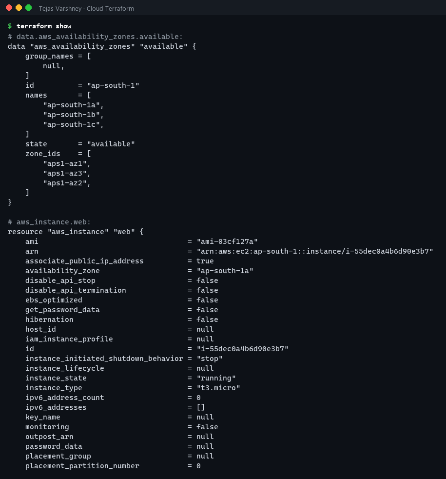
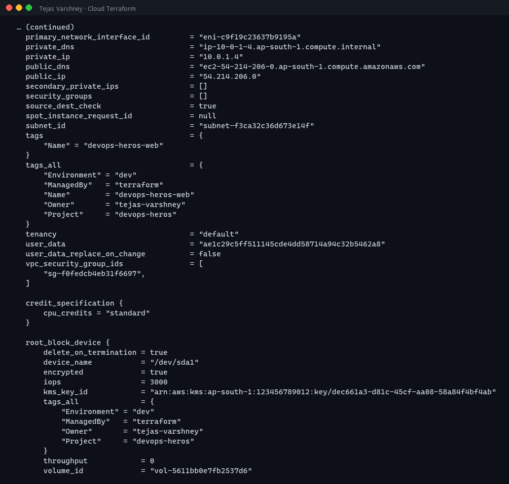
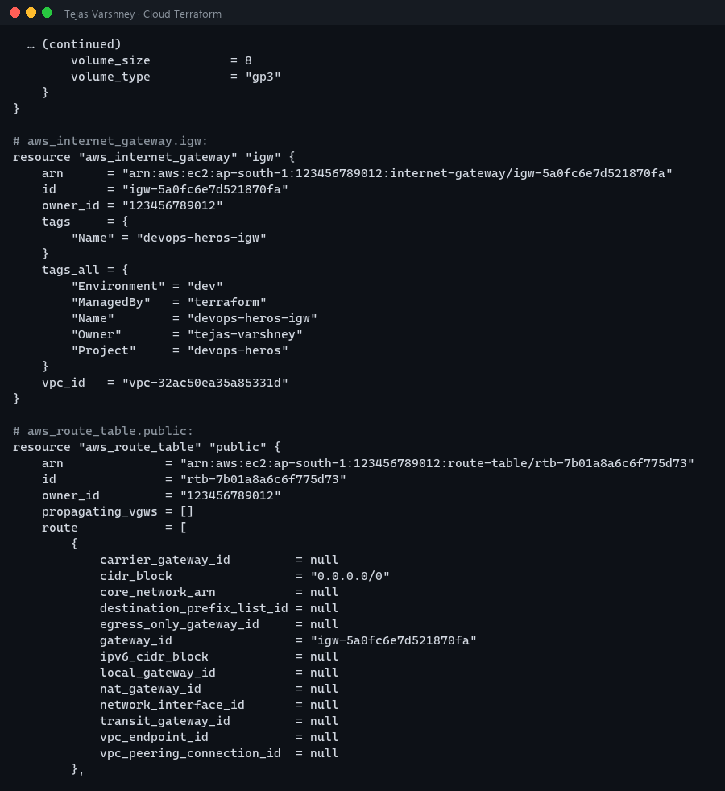
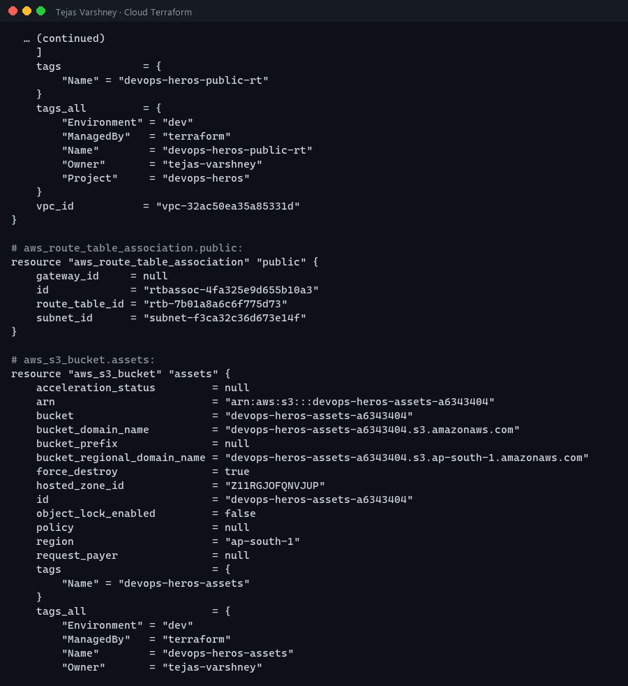
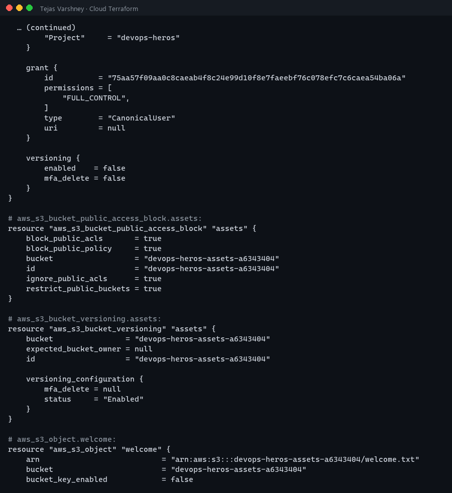
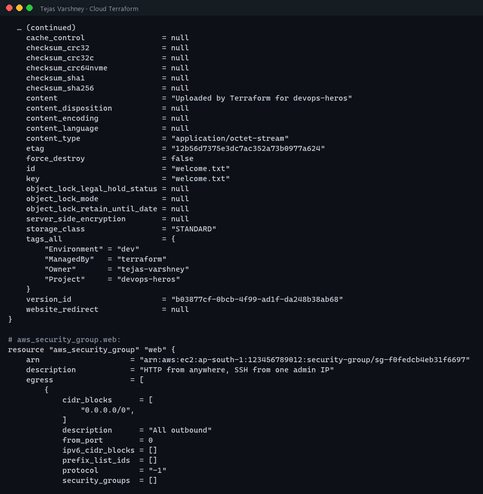
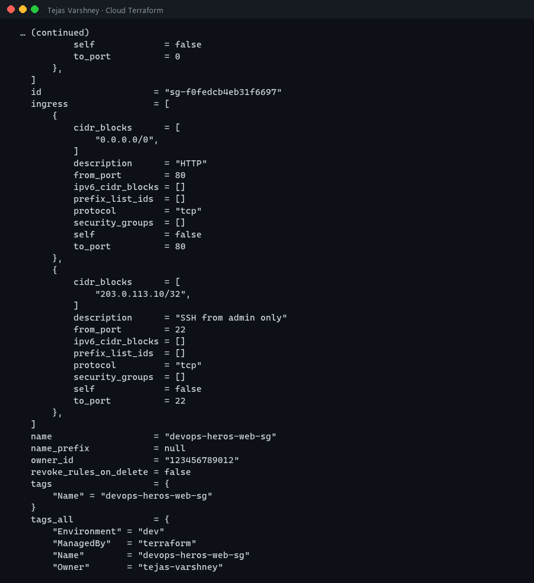
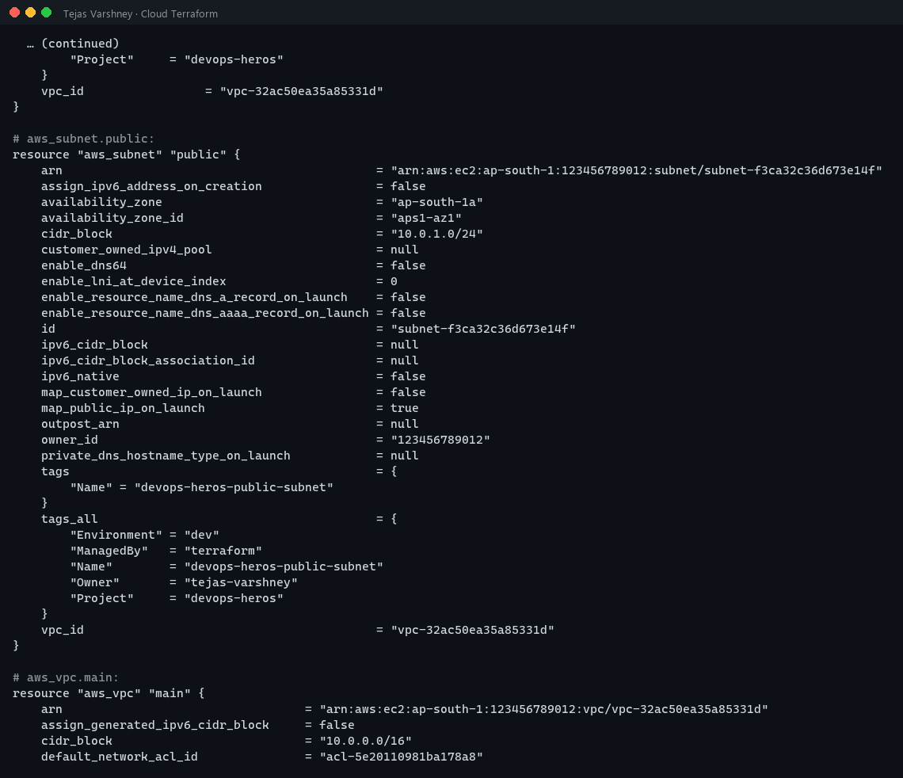
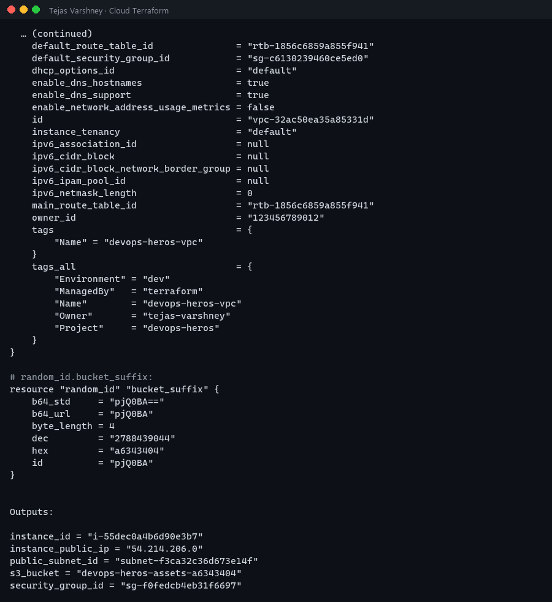
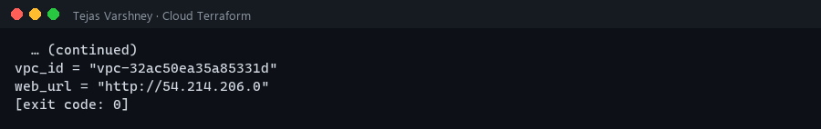

<details><summary>Text output</summary>

```text
$ terraform show
# data.aws_availability_zones.available:
data "aws_availability_zones" "available" {
    group_names = [
        null,
    ]
    id          = "ap-south-1"
    names       = [
        "ap-south-1a",
        "ap-south-1b",
        "ap-south-1c",
    ]
    state       = "available"
    zone_ids    = [
        "aps1-az1",
        "aps1-az3",
        "aps1-az2",
    ]
}

# aws_instance.web:
resource "aws_instance" "web" {
    ami                                  = "ami-03cf127a"
    arn                                  = "arn:aws:ec2:ap-south-1::instance/i-55dec0a4b6d90e3b7"
    associate_public_ip_address          = true
    availability_zone                    = "ap-south-1a"
    disable_api_stop                     = false
    disable_api_termination              = false
    ebs_optimized                        = false
    get_password_data                    = false
    hibernation                          = false
    host_id                              = null
    iam_instance_profile                 = null
    id                                   = "i-55dec0a4b6d90e3b7"
    instance_initiated_shutdown_behavior = "stop"
    instance_lifecycle                   = null
    instance_state                       = "running"
    instance_type                        = "t3.micro"
    ipv6_address_count                   = 0
    ipv6_addresses                       = []
    key_name                             = null
    monitoring                           = false
    outpost_arn                          = null
    password_data                        = null
    placement_group                      = null
    placement_partition_number           = 0
    primary_network_interface_id         = "eni-c9f19c23637b9195a"
    private_dns                          = "ip-10-0-1-4.ap-south-1.compute.internal"
    private_ip                           = "10.0.1.4"
    public_dns                           = "ec2-54-214-206-0.ap-south-1.compute.amazonaws.com"
    public_ip                            = "54.214.206.0"
    secondary_private_ips                = []
    security_groups                      = []
    source_dest_check                    = true
    spot_instance_request_id             = null
    subnet_id                            = "subnet-f3ca32c36d673e14f"
    tags                                 = {
        "Name" = "devops-heros-web"
    }
    tags_all                             = {
        "Environment" = "dev"
        "ManagedBy"   = "terraform"
        "Name"        = "devops-heros-web"
        "Owner"       = "tejas-varshney"
        "Project"     = "devops-heros"
    }
    tenancy                              = "default"
    user_data                            = "ae1c29c5ff511145cde4dd58714a94c32b5462a8"
    user_data_replace_on_change          = false
    vpc_security_group_ids               = [
        "sg-f0fedcb4eb31f6697",
    ]

    credit_specification {
        cpu_credits = "standard"
    }

    root_block_device {
        delete_on_termination = true
        device_name           = "/dev/sda1"
        encrypted             = true
        iops                  = 3000
        kms_key_id            = "arn:aws:kms:ap-south-1:123456789012:key/dec661a3-d81c-45cf-aa08-58a84f4bf4ab"
        tags_all              = {
            "Environment" = "dev"
            "ManagedBy"   = "terraform"
            "Owner"       = "tejas-varshney"
            "Project"     = "devops-heros"
        }
        throughput            = 0
        volume_id             = "vol-5611bb0e7fb2537d6"
        volume_size           = 8
        volume_type           = "gp3"
    }
}

# aws_internet_gateway.igw:
resource "aws_internet_gateway" "igw" {
    arn      = "arn:aws:ec2:ap-south-1:123456789012:internet-gateway/igw-5a0fc6e7d521870fa"
    id       = "igw-5a0fc6e7d521870fa"
    owner_id = "123456789012"
    tags     = {
        "Name" = "devops-heros-igw"
    }
    tags_all = {
        "Environment" = "dev"
        "ManagedBy"   = "terraform"
        "Name"        = "devops-heros-igw"
        "Owner"       = "tejas-varshney"
        "Project"     = "devops-heros"
    }
    vpc_id   = "vpc-32ac50ea35a85331d"
}

# aws_route_table.public:
resource "aws_route_table" "public" {
    arn              = "arn:aws:ec2:ap-south-1:123456789012:route-table/rtb-7b01a8a6c6f775d73"
    id               = "rtb-7b01a8a6c6f775d73"
    owner_id         = "123456789012"
    propagating_vgws = []
    route            = [
        {
            carrier_gateway_id         = null
            cidr_block                 = "0.0.0.0/0"
            core_network_arn           = null
            destination_prefix_list_id = null
            egress_only_gateway_id     = null
            gateway_id                 = "igw-5a0fc6e7d521870fa"
            ipv6_cidr_block            = null
            local_gateway_id           = null
            nat_gateway_id             = null
            network_interface_id       = null
            transit_gateway_id         = null
            vpc_endpoint_id            = null
            vpc_peering_connection_id  = null
        },
    ]
    tags             = {
        "Name" = "devops-heros-public-rt"
    }
    tags_all         = {
        "Environment" = "dev"
        "ManagedBy"   = "terraform"
        "Name"        = "devops-heros-public-rt"
        "Owner"       = "tejas-varshney"
        "Project"     = "devops-heros"
    }
    vpc_id           = "vpc-32ac50ea35a85331d"
}

# aws_route_table_association.public:
resource "aws_route_table_association" "public" {
    gateway_id     = null
    id             = "rtbassoc-4fa325e9d655b10a3"
    route_table_id = "rtb-7b01a8a6c6f775d73"
    subnet_id      = "subnet-f3ca32c36d673e14f"
}

# aws_s3_bucket.assets:
resource "aws_s3_bucket" "assets" {
    acceleration_status         = null
    arn                         = "arn:aws:s3:::devops-heros-assets-a6343404"
    bucket                      = "devops-heros-assets-a6343404"
    bucket_domain_name          = "devops-heros-assets-a6343404.s3.amazonaws.com"
    bucket_prefix               = null
    bucket_regional_domain_name = "devops-heros-assets-a6343404.s3.ap-south-1.amazonaws.com"
    force_destroy               = true
    hosted_zone_id              = "Z11RGJOFQNVJUP"
    id                          = "devops-heros-assets-a6343404"
    object_lock_enabled         = false
    policy                      = null
    region                      = "ap-south-1"
    request_payer               = null
    tags                        = {
        "Name" = "devops-heros-assets"
    }
    tags_all                    = {
        "Environment" = "dev"
        "ManagedBy"   = "terraform"
        "Name"        = "devops-heros-assets"
        "Owner"       = "tejas-varshney"
        "Project"     = "devops-heros"
    }

    grant {
        id          = "75aa57f09aa0c8caeab4f8c24e99d10f8e7faeebf76c078efc7c6caea54ba06a"
        permissions = [
            "FULL_CONTROL",
        ]
        type        = "CanonicalUser"
        uri         = null
    }

    versioning {
        enabled    = false
        mfa_delete = false
    }
}

# aws_s3_bucket_public_access_block.assets:
resource "aws_s3_bucket_public_access_block" "assets" {
    block_public_acls       = true
    block_public_policy     = true
    bucket                  = "devops-heros-assets-a6343404"
    id                      = "devops-heros-assets-a6343404"
    ignore_public_acls      = true
    restrict_public_buckets = true
}

# aws_s3_bucket_versioning.assets:
resource "aws_s3_bucket_versioning" "assets" {
    bucket                = "devops-heros-assets-a6343404"
    expected_bucket_owner = null
    id                    = "devops-heros-assets-a6343404"

    versioning_configuration {
        mfa_delete = null
        status     = "Enabled"
    }
}

# aws_s3_object.welcome:
resource "aws_s3_object" "welcome" {
    arn                           = "arn:aws:s3:::devops-heros-assets-a6343404/welcome.txt"
    bucket                        = "devops-heros-assets-a6343404"
    bucket_key_enabled            = false
    cache_control                 = null
    checksum_crc32                = null
    checksum_crc32c               = null
    checksum_crc64nvme            = null
    checksum_sha1                 = null
    checksum_sha256               = null
    content                       = "Uploaded by Terraform for devops-heros"
    content_disposition           = null
    content_encoding              = null
    content_language              = null
    content_type                  = "application/octet-stream"
    etag                          = "12b56d7375e3dc7ac352a73b0977a624"
    force_destroy                 = false
    id                            = "welcome.txt"
    key                           = "welcome.txt"
    object_lock_legal_hold_status = null
    object_lock_mode              = null
    object_lock_retain_until_date = null
    server_side_encryption        = null
    storage_class                 = "STANDARD"
    tags_all                      = {
        "Environment" = "dev"
        "ManagedBy"   = "terraform"
        "Owner"       = "tejas-varshney"
        "Project"     = "devops-heros"
    }
    version_id                    = "b03877cf-0bcb-4f99-ad1f-da248b38ab68"
    website_redirect              = null
}

# aws_security_group.web:
resource "aws_security_group" "web" {
    arn                    = "arn:aws:ec2:ap-south-1:123456789012:security-group/sg-f0fedcb4eb31f6697"
    description            = "HTTP from anywhere, SSH from one admin IP"
    egress                 = [
        {
            cidr_blocks      = [
                "0.0.0.0/0",
            ]
            description      = "All outbound"
            from_port        = 0
            ipv6_cidr_blocks = []
            prefix_list_ids  = []
            protocol         = "-1"
            security_groups  = []
            self             = false
            to_port          = 0
        },
    ]
    id                     = "sg-f0fedcb4eb31f6697"
    ingress                = [
        {
            cidr_blocks      = [
                "0.0.0.0/0",
            ]
            description      = "HTTP"
            from_port        = 80
            ipv6_cidr_blocks = []
            prefix_list_ids  = []
            protocol         = "tcp"
            security_groups  = []
            self             = false
            to_port          = 80
        },
        {
            cidr_blocks      = [
                "203.0.113.10/32",
            ]
            description      = "SSH from admin only"
            from_port        = 22
            ipv6_cidr_blocks = []
            prefix_list_ids  = []
            protocol         = "tcp"
            security_groups  = []
            self             = false
            to_port          = 22
        },
    ]
    name                   = "devops-heros-web-sg"
    name_prefix            = null
    owner_id               = "123456789012"
    revoke_rules_on_delete = false
    tags                   = {
        "Name" = "devops-heros-web-sg"
    }
    tags_all               = {
        "Environment" = "dev"
        "ManagedBy"   = "terraform"
        "Name"        = "devops-heros-web-sg"
        "Owner"       = "tejas-varshney"
        "Project"     = "devops-heros"
    }
    vpc_id                 = "vpc-32ac50ea35a85331d"
}

# aws_subnet.public:
resource "aws_subnet" "public" {
    arn                                            = "arn:aws:ec2:ap-south-1:123456789012:subnet/subnet-f3ca32c36d673e14f"
    assign_ipv6_address_on_creation                = false
    availability_zone                              = "ap-south-1a"
    availability_zone_id                           = "aps1-az1"
    cidr_block                                     = "10.0.1.0/24"
    customer_owned_ipv4_pool                       = null
    enable_dns64                                   = false
    enable_lni_at_device_index                     = 0
    enable_resource_name_dns_a_record_on_launch    = false
    enable_resource_name_dns_aaaa_record_on_launch = false
    id                                             = "subnet-f3ca32c36d673e14f"
    ipv6_cidr_block                                = null
    ipv6_cidr_block_association_id                 = null
    ipv6_native                                    = false
    map_customer_owned_ip_on_launch                = false
    map_public_ip_on_launch                        = true
    outpost_arn                                    = null
    owner_id                                       = "123456789012"
    private_dns_hostname_type_on_launch            = null
    tags                                           = {
        "Name" = "devops-heros-public-subnet"
    }
    tags_all                                       = {
        "Environment" = "dev"
        "ManagedBy"   = "terraform"
        "Name"        = "devops-heros-public-subnet"
        "Owner"       = "tejas-varshney"
        "Project"     = "devops-heros"
    }
    vpc_id                                         = "vpc-32ac50ea35a85331d"
}

# aws_vpc.main:
resource "aws_vpc" "main" {
    arn                                  = "arn:aws:ec2:ap-south-1:123456789012:vpc/vpc-32ac50ea35a85331d"
    assign_generated_ipv6_cidr_block     = false
    cidr_block                           = "10.0.0.0/16"
    default_network_acl_id               = "acl-5e20110981ba178a8"
    default_route_table_id               = "rtb-1856c6859a855f941"
    default_security_group_id            = "sg-c6130239460ce5ed0"
    dhcp_options_id                      = "default"
    enable_dns_hostnames                 = true
    enable_dns_support                   = true
    enable_network_address_usage_metrics = false
    id                                   = "vpc-32ac50ea35a85331d"
    instance_tenancy                     = "default"
    ipv6_association_id                  = null
    ipv6_cidr_block                      = null
    ipv6_cidr_block_network_border_group = null
    ipv6_ipam_pool_id                    = null
    ipv6_netmask_length                  = 0
    main_route_table_id                  = "rtb-1856c6859a855f941"
    owner_id                             = "123456789012"
    tags                                 = {
        "Name" = "devops-heros-vpc"
    }
    tags_all                             = {
        "Environment" = "dev"
        "ManagedBy"   = "terraform"
        "Name"        = "devops-heros-vpc"
        "Owner"       = "tejas-varshney"
        "Project"     = "devops-heros"
    }
}

# random_id.bucket_suffix:
resource "random_id" "bucket_suffix" {
    b64_std     = "pjQ0BA=="
    b64_url     = "pjQ0BA"
    byte_length = 4
    dec         = "2788439044"
    hex         = "a6343404"
    id          = "pjQ0BA"
}


Outputs:

instance_id = "i-55dec0a4b6d90e3b7"
instance_public_ip = "54.214.206.0"
public_subnet_id = "subnet-f3ca32c36d673e14f"
s3_bucket = "devops-heros-assets-a6343404"
security_group_id = "sg-f0fedcb4eb31f6697"
vpc_id = "vpc-32ac50ea35a85331d"
web_url = "http://54.214.206.0"
[exit code: 0]
```

</details>

### destroy
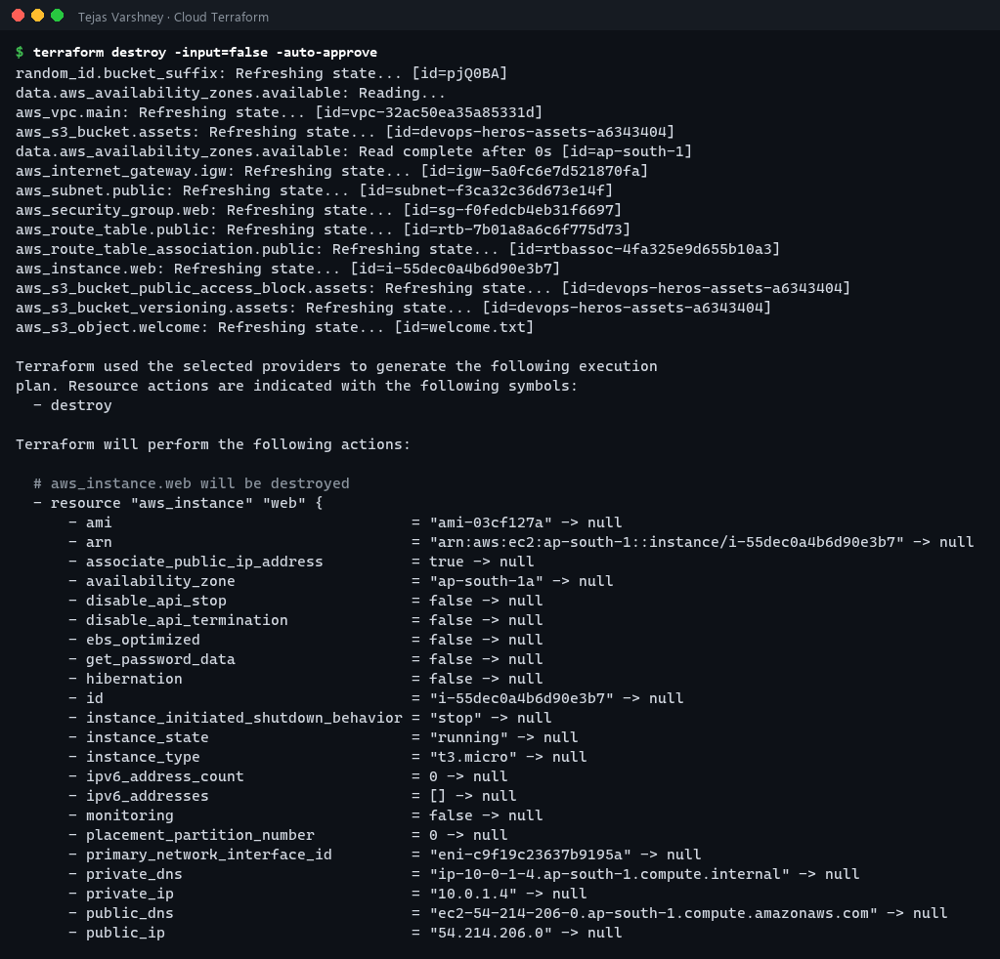
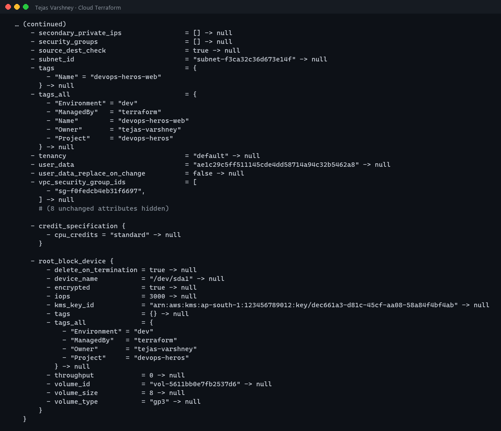
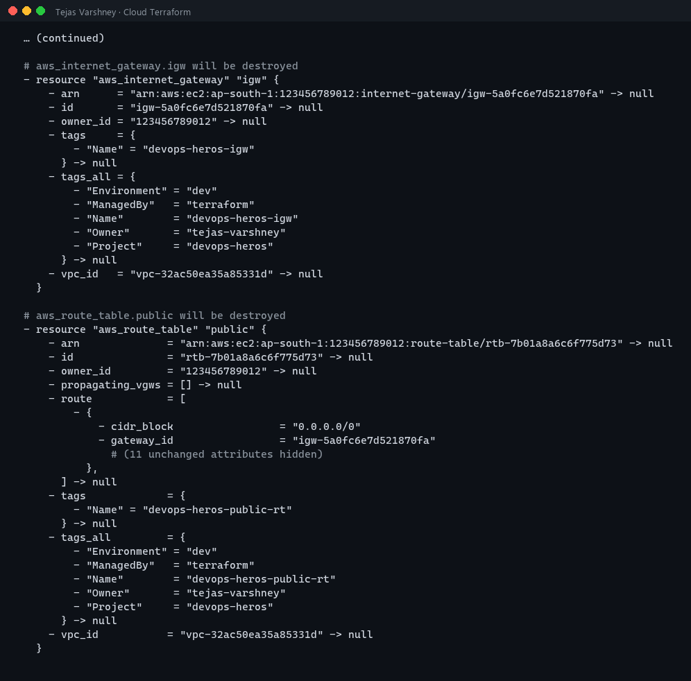
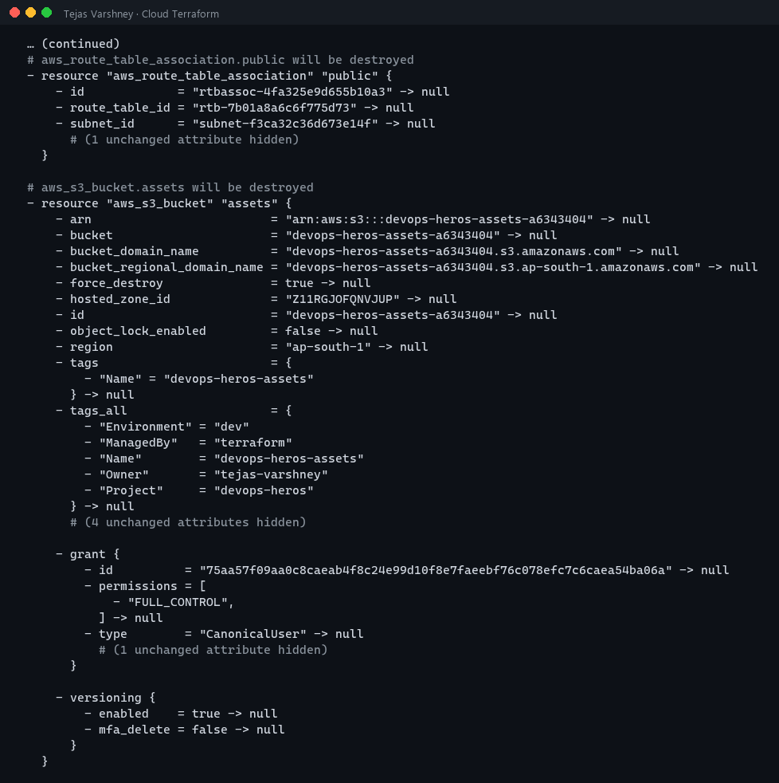
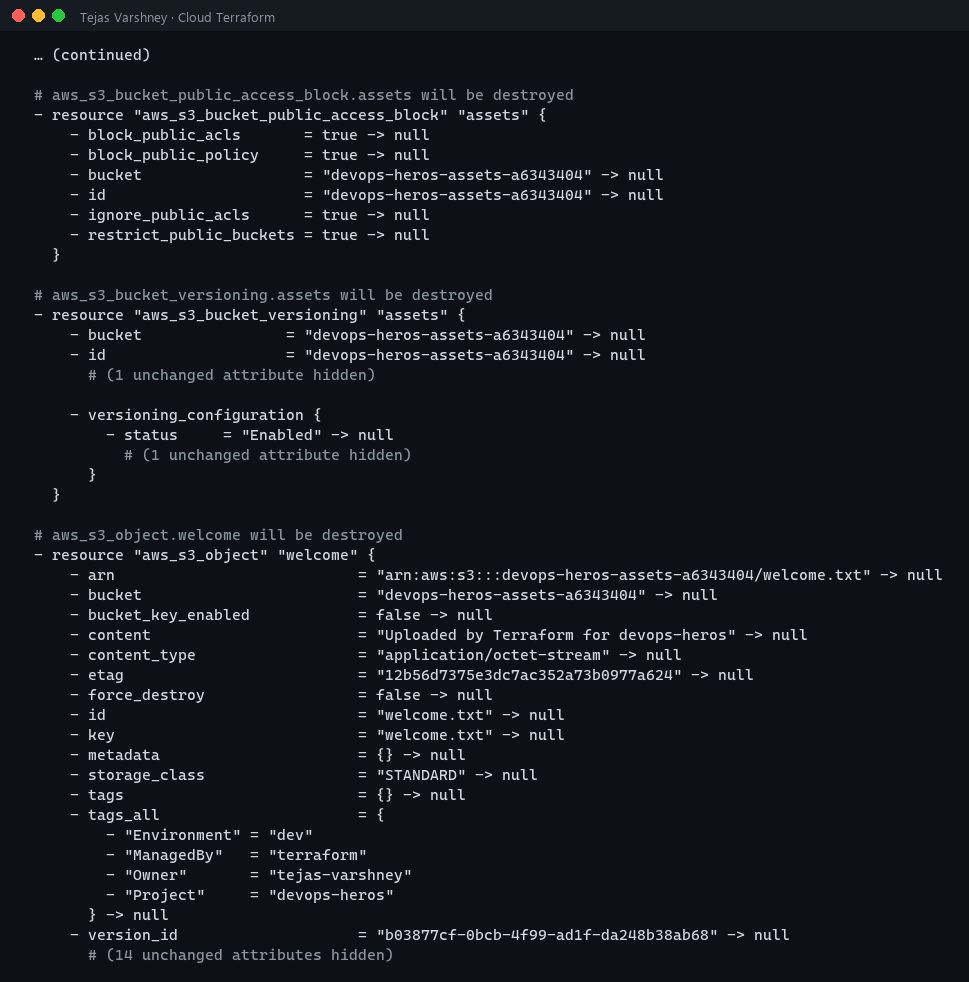
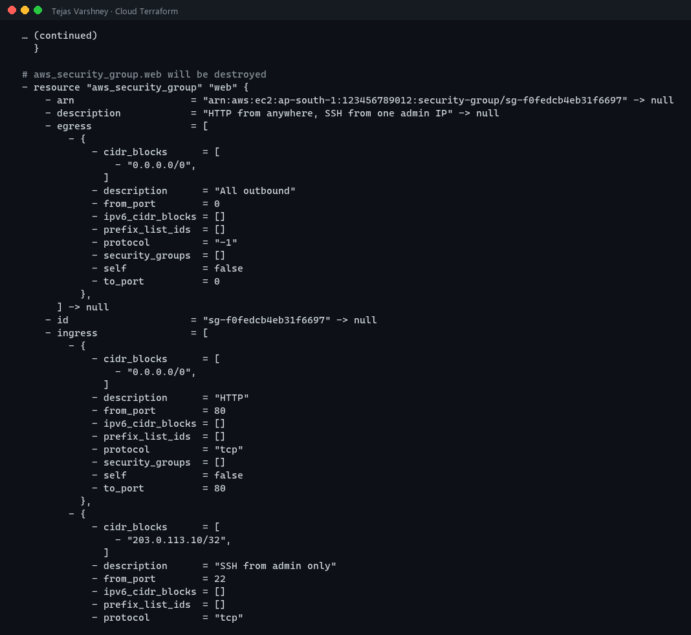
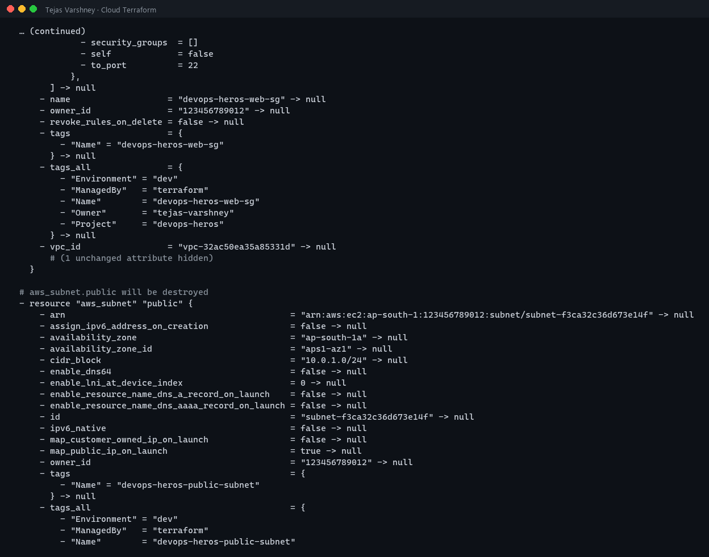
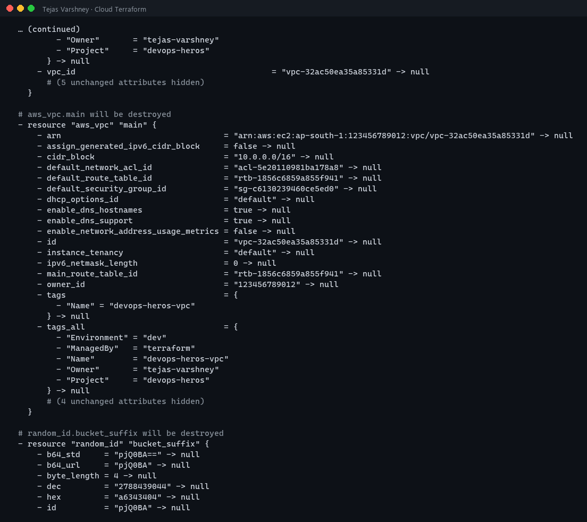
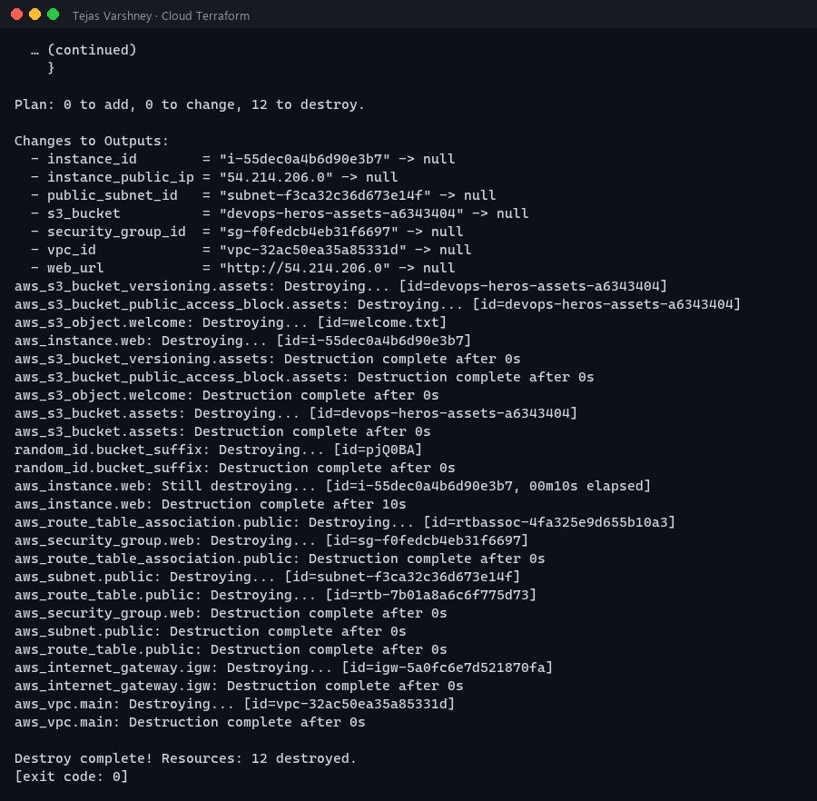

<details><summary>Text output</summary>

```text
$ terraform destroy -input=false -auto-approve
random_id.bucket_suffix: Refreshing state... [id=pjQ0BA]
data.aws_availability_zones.available: Reading...
aws_vpc.main: Refreshing state... [id=vpc-32ac50ea35a85331d]
aws_s3_bucket.assets: Refreshing state... [id=devops-heros-assets-a6343404]
data.aws_availability_zones.available: Read complete after 0s [id=ap-south-1]
aws_internet_gateway.igw: Refreshing state... [id=igw-5a0fc6e7d521870fa]
aws_subnet.public: Refreshing state... [id=subnet-f3ca32c36d673e14f]
aws_security_group.web: Refreshing state... [id=sg-f0fedcb4eb31f6697]
aws_route_table.public: Refreshing state... [id=rtb-7b01a8a6c6f775d73]
aws_route_table_association.public: Refreshing state... [id=rtbassoc-4fa325e9d655b10a3]
aws_instance.web: Refreshing state... [id=i-55dec0a4b6d90e3b7]
aws_s3_bucket_public_access_block.assets: Refreshing state... [id=devops-heros-assets-a6343404]
aws_s3_bucket_versioning.assets: Refreshing state... [id=devops-heros-assets-a6343404]
aws_s3_object.welcome: Refreshing state... [id=welcome.txt]

Terraform used the selected providers to generate the following execution
plan. Resource actions are indicated with the following symbols:
  - destroy

Terraform will perform the following actions:

  # aws_instance.web will be destroyed
  - resource "aws_instance" "web" {
      - ami                                  = "ami-03cf127a" -> null
      - arn                                  = "arn:aws:ec2:ap-south-1::instance/i-55dec0a4b6d90e3b7" -> null
      - associate_public_ip_address          = true -> null
      - availability_zone                    = "ap-south-1a" -> null
      - disable_api_stop                     = false -> null
      - disable_api_termination              = false -> null
      - ebs_optimized                        = false -> null
      - get_password_data                    = false -> null
      - hibernation                          = false -> null
      - id                                   = "i-55dec0a4b6d90e3b7" -> null
      - instance_initiated_shutdown_behavior = "stop" -> null
      - instance_state                       = "running" -> null
      - instance_type                        = "t3.micro" -> null
      - ipv6_address_count                   = 0 -> null
      - ipv6_addresses                       = [] -> null
      - monitoring                           = false -> null
      - placement_partition_number           = 0 -> null
      - primary_network_interface_id         = "eni-c9f19c23637b9195a" -> null
      - private_dns                          = "ip-10-0-1-4.ap-south-1.compute.internal" -> null
      - private_ip                           = "10.0.1.4" -> null
      - public_dns                           = "ec2-54-214-206-0.ap-south-1.compute.amazonaws.com" -> null
      - public_ip                            = "54.214.206.0" -> null
      - secondary_private_ips                = [] -> null
      - security_groups                      = [] -> null
      - source_dest_check                    = true -> null
      - subnet_id                            = "subnet-f3ca32c36d673e14f" -> null
      - tags                                 = {
          - "Name" = "devops-heros-web"
        } -> null
      - tags_all                             = {
          - "Environment" = "dev"
          - "ManagedBy"   = "terraform"
          - "Name"        = "devops-heros-web"
          - "Owner"       = "tejas-varshney"
          - "Project"     = "devops-heros"
        } -> null
      - tenancy                              = "default" -> null
      - user_data                            = "ae1c29c5ff511145cde4dd58714a94c32b5462a8" -> null
      - user_data_replace_on_change          = false -> null
      - vpc_security_group_ids               = [
          - "sg-f0fedcb4eb31f6697",
        ] -> null
        # (8 unchanged attributes hidden)

      - credit_specification {
          - cpu_credits = "standard" -> null
        }

      - root_block_device {
          - delete_on_termination = true -> null
          - device_name           = "/dev/sda1" -> null
          - encrypted             = true -> null
          - iops                  = 3000 -> null
          - kms_key_id            = "arn:aws:kms:ap-south-1:123456789012:key/dec661a3-d81c-45cf-aa08-58a84f4bf4ab" -> null
          - tags                  = {} -> null
          - tags_all              = {
              - "Environment" = "dev"
              - "ManagedBy"   = "terraform"
              - "Owner"       = "tejas-varshney"
              - "Project"     = "devops-heros"
            } -> null
          - throughput            = 0 -> null
          - volume_id             = "vol-5611bb0e7fb2537d6" -> null
          - volume_size           = 8 -> null
          - volume_type           = "gp3" -> null
        }
    }

  # aws_internet_gateway.igw will be destroyed
  - resource "aws_internet_gateway" "igw" {
      - arn      = "arn:aws:ec2:ap-south-1:123456789012:internet-gateway/igw-5a0fc6e7d521870fa" -> null
      - id       = "igw-5a0fc6e7d521870fa" -> null
      - owner_id = "123456789012" -> null
      - tags     = {
          - "Name" = "devops-heros-igw"
        } -> null
      - tags_all = {
          - "Environment" = "dev"
          - "ManagedBy"   = "terraform"
          - "Name"        = "devops-heros-igw"
          - "Owner"       = "tejas-varshney"
          - "Project"     = "devops-heros"
        } -> null
      - vpc_id   = "vpc-32ac50ea35a85331d" -> null
    }

  # aws_route_table.public will be destroyed
  - resource "aws_route_table" "public" {
      - arn              = "arn:aws:ec2:ap-south-1:123456789012:route-table/rtb-7b01a8a6c6f775d73" -> null
      - id               = "rtb-7b01a8a6c6f775d73" -> null
      - owner_id         = "123456789012" -> null
      - propagating_vgws = [] -> null
      - route            = [
          - {
              - cidr_block                 = "0.0.0.0/0"
              - gateway_id                 = "igw-5a0fc6e7d521870fa"
                # (11 unchanged attributes hidden)
            },
        ] -> null
      - tags             = {
          - "Name" = "devops-heros-public-rt"
        } -> null
      - tags_all         = {
          - "Environment" = "dev"
          - "ManagedBy"   = "terraform"
          - "Name"        = "devops-heros-public-rt"
          - "Owner"       = "tejas-varshney"
          - "Project"     = "devops-heros"
        } -> null
      - vpc_id           = "vpc-32ac50ea35a85331d" -> null
    }

  # aws_route_table_association.public will be destroyed
  - resource "aws_route_table_association" "public" {
      - id             = "rtbassoc-4fa325e9d655b10a3" -> null
      - route_table_id = "rtb-7b01a8a6c6f775d73" -> null
      - subnet_id      = "subnet-f3ca32c36d673e14f" -> null
        # (1 unchanged attribute hidden)
    }

  # aws_s3_bucket.assets will be destroyed
  - resource "aws_s3_bucket" "assets" {
      - arn                         = "arn:aws:s3:::devops-heros-assets-a6343404" -> null
      - bucket                      = "devops-heros-assets-a6343404" -> null
      - bucket_domain_name          = "devops-heros-assets-a6343404.s3.amazonaws.com" -> null
      - bucket_regional_domain_name = "devops-heros-assets-a6343404.s3.ap-south-1.amazonaws.com" -> null
      - force_destroy               = true -> null
      - hosted_zone_id              = "Z11RGJOFQNVJUP" -> null
      - id                          = "devops-heros-assets-a6343404" -> null
      - object_lock_enabled         = false -> null
      - region                      = "ap-south-1" -> null
      - tags                        = {
          - "Name" = "devops-heros-assets"
        } -> null
      - tags_all                    = {
          - "Environment" = "dev"
          - "ManagedBy"   = "terraform"
          - "Name"        = "devops-heros-assets"
          - "Owner"       = "tejas-varshney"
          - "Project"     = "devops-heros"
        } -> null
        # (4 unchanged attributes hidden)

      - grant {
          - id          = "75aa57f09aa0c8caeab4f8c24e99d10f8e7faeebf76c078efc7c6caea54ba06a" -> null
          - permissions = [
              - "FULL_CONTROL",
            ] -> null
          - type        = "CanonicalUser" -> null
            # (1 unchanged attribute hidden)
        }

      - versioning {
          - enabled    = true -> null
          - mfa_delete = false -> null
        }
    }

  # aws_s3_bucket_public_access_block.assets will be destroyed
  - resource "aws_s3_bucket_public_access_block" "assets" {
      - block_public_acls       = true -> null
      - block_public_policy     = true -> null
      - bucket                  = "devops-heros-assets-a6343404" -> null
      - id                      = "devops-heros-assets-a6343404" -> null
      - ignore_public_acls      = true -> null
      - restrict_public_buckets = true -> null
    }

  # aws_s3_bucket_versioning.assets will be destroyed
  - resource "aws_s3_bucket_versioning" "assets" {
      - bucket                = "devops-heros-assets-a6343404" -> null
      - id                    = "devops-heros-assets-a6343404" -> null
        # (1 unchanged attribute hidden)

      - versioning_configuration {
          - status     = "Enabled" -> null
            # (1 unchanged attribute hidden)
        }
    }

  # aws_s3_object.welcome will be destroyed
  - resource "aws_s3_object" "welcome" {
      - arn                           = "arn:aws:s3:::devops-heros-assets-a6343404/welcome.txt" -> null
      - bucket                        = "devops-heros-assets-a6343404" -> null
      - bucket_key_enabled            = false -> null
      - content                       = "Uploaded by Terraform for devops-heros" -> null
      - content_type                  = "application/octet-stream" -> null
      - etag                          = "12b56d7375e3dc7ac352a73b0977a624" -> null
      - force_destroy                 = false -> null
      - id                            = "welcome.txt" -> null
      - key                           = "welcome.txt" -> null
      - metadata                      = {} -> null
      - storage_class                 = "STANDARD" -> null
      - tags                          = {} -> null
      - tags_all                      = {
          - "Environment" = "dev"
          - "ManagedBy"   = "terraform"
          - "Owner"       = "tejas-varshney"
          - "Project"     = "devops-heros"
        } -> null
      - version_id                    = "b03877cf-0bcb-4f99-ad1f-da248b38ab68" -> null
        # (14 unchanged attributes hidden)
    }

  # aws_security_group.web will be destroyed
  - resource "aws_security_group" "web" {
      - arn                    = "arn:aws:ec2:ap-south-1:123456789012:security-group/sg-f0fedcb4eb31f6697" -> null
      - description            = "HTTP from anywhere, SSH from one admin IP" -> null
      - egress                 = [
          - {
              - cidr_blocks      = [
                  - "0.0.0.0/0",
                ]
              - description      = "All outbound"
              - from_port        = 0
              - ipv6_cidr_blocks = []
              - prefix_list_ids  = []
              - protocol         = "-1"
              - security_groups  = []
              - self             = false
              - to_port          = 0
            },
        ] -> null
      - id                     = "sg-f0fedcb4eb31f6697" -> null
      - ingress                = [
          - {
              - cidr_blocks      = [
                  - "0.0.0.0/0",
                ]
              - description      = "HTTP"
              - from_port        = 80
              - ipv6_cidr_blocks = []
              - prefix_list_ids  = []
              - protocol         = "tcp"
              - security_groups  = []
              - self             = false
              - to_port          = 80
            },
          - {
              - cidr_blocks      = [
                  - "203.0.113.10/32",
                ]
              - description      = "SSH from admin only"
              - from_port        = 22
              - ipv6_cidr_blocks = []
              - prefix_list_ids  = []
              - protocol         = "tcp"
              - security_groups  = []
              - self             = false
              - to_port          = 22
            },
        ] -> null
      - name                   = "devops-heros-web-sg" -> null
      - owner_id               = "123456789012" -> null
      - revoke_rules_on_delete = false -> null
      - tags                   = {
          - "Name" = "devops-heros-web-sg"
        } -> null
      - tags_all               = {
          - "Environment" = "dev"
          - "ManagedBy"   = "terraform"
          - "Name"        = "devops-heros-web-sg"
          - "Owner"       = "tejas-varshney"
          - "Project"     = "devops-heros"
        } -> null
      - vpc_id                 = "vpc-32ac50ea35a85331d" -> null
        # (1 unchanged attribute hidden)
    }

  # aws_subnet.public will be destroyed
  - resource "aws_subnet" "public" {
      - arn                                            = "arn:aws:ec2:ap-south-1:123456789012:subnet/subnet-f3ca32c36d673e14f" -> null
      - assign_ipv6_address_on_creation                = false -> null
      - availability_zone                              = "ap-south-1a" -> null
      - availability_zone_id                           = "aps1-az1" -> null
      - cidr_block                                     = "10.0.1.0/24" -> null
      - enable_dns64                                   = false -> null
      - enable_lni_at_device_index                     = 0 -> null
      - enable_resource_name_dns_a_record_on_launch    = false -> null
      - enable_resource_name_dns_aaaa_record_on_launch = false -> null
      - id                                             = "subnet-f3ca32c36d673e14f" -> null
      - ipv6_native                                    = false -> null
      - map_customer_owned_ip_on_launch                = false -> null
      - map_public_ip_on_launch                        = true -> null
      - owner_id                                       = "123456789012" -> null
      - tags                                           = {
          - "Name" = "devops-heros-public-subnet"
        } -> null
      - tags_all                                       = {
          - "Environment" = "dev"
          - "ManagedBy"   = "terraform"
          - "Name"        = "devops-heros-public-subnet"
          - "Owner"       = "tejas-varshney"
          - "Project"     = "devops-heros"
        } -> null
      - vpc_id                                         = "vpc-32ac50ea35a85331d" -> null
        # (5 unchanged attributes hidden)
    }

  # aws_vpc.main will be destroyed
  - resource "aws_vpc" "main" {
      - arn                                  = "arn:aws:ec2:ap-south-1:123456789012:vpc/vpc-32ac50ea35a85331d" -> null
      - assign_generated_ipv6_cidr_block     = false -> null
      - cidr_block                           = "10.0.0.0/16" -> null
      - default_network_acl_id               = "acl-5e20110981ba178a8" -> null
      - default_route_table_id               = "rtb-1856c6859a855f941" -> null
      - default_security_group_id            = "sg-c6130239460ce5ed0" -> null
      - dhcp_options_id                      = "default" -> null
      - enable_dns_hostnames                 = true -> null
      - enable_dns_support                   = true -> null
      - enable_network_address_usage_metrics = false -> null
      - id                                   = "vpc-32ac50ea35a85331d" -> null
      - instance_tenancy                     = "default" -> null
      - ipv6_netmask_length                  = 0 -> null
      - main_route_table_id                  = "rtb-1856c6859a855f941" -> null
      - owner_id                             = "123456789012" -> null
      - tags                                 = {
          - "Name" = "devops-heros-vpc"
        } -> null
      - tags_all                             = {
          - "Environment" = "dev"
          - "ManagedBy"   = "terraform"
          - "Name"        = "devops-heros-vpc"
          - "Owner"       = "tejas-varshney"
          - "Project"     = "devops-heros"
        } -> null
        # (4 unchanged attributes hidden)
    }

  # random_id.bucket_suffix will be destroyed
  - resource "random_id" "bucket_suffix" {
      - b64_std     = "pjQ0BA==" -> null
      - b64_url     = "pjQ0BA" -> null
      - byte_length = 4 -> null
      - dec         = "2788439044" -> null
      - hex         = "a6343404" -> null
      - id          = "pjQ0BA" -> null
    }

Plan: 0 to add, 0 to change, 12 to destroy.

Changes to Outputs:
  - instance_id        = "i-55dec0a4b6d90e3b7" -> null
  - instance_public_ip = "54.214.206.0" -> null
  - public_subnet_id   = "subnet-f3ca32c36d673e14f" -> null
  - s3_bucket          = "devops-heros-assets-a6343404" -> null
  - security_group_id  = "sg-f0fedcb4eb31f6697" -> null
  - vpc_id             = "vpc-32ac50ea35a85331d" -> null
  - web_url            = "http://54.214.206.0" -> null
aws_s3_bucket_versioning.assets: Destroying... [id=devops-heros-assets-a6343404]
aws_s3_bucket_public_access_block.assets: Destroying... [id=devops-heros-assets-a6343404]
aws_s3_object.welcome: Destroying... [id=welcome.txt]
aws_instance.web: Destroying... [id=i-55dec0a4b6d90e3b7]
aws_s3_bucket_versioning.assets: Destruction complete after 0s
aws_s3_bucket_public_access_block.assets: Destruction complete after 0s
aws_s3_object.welcome: Destruction complete after 0s
aws_s3_bucket.assets: Destroying... [id=devops-heros-assets-a6343404]
aws_s3_bucket.assets: Destruction complete after 0s
random_id.bucket_suffix: Destroying... [id=pjQ0BA]
random_id.bucket_suffix: Destruction complete after 0s
aws_instance.web: Still destroying... [id=i-55dec0a4b6d90e3b7, 00m10s elapsed]
aws_instance.web: Destruction complete after 10s
aws_route_table_association.public: Destroying... [id=rtbassoc-4fa325e9d655b10a3]
aws_security_group.web: Destroying... [id=sg-f0fedcb4eb31f6697]
aws_route_table_association.public: Destruction complete after 0s
aws_subnet.public: Destroying... [id=subnet-f3ca32c36d673e14f]
aws_route_table.public: Destroying... [id=rtb-7b01a8a6c6f775d73]
aws_security_group.web: Destruction complete after 0s
aws_subnet.public: Destruction complete after 0s
aws_route_table.public: Destruction complete after 0s
aws_internet_gateway.igw: Destroying... [id=igw-5a0fc6e7d521870fa]
aws_internet_gateway.igw: Destruction complete after 0s
aws_vpc.main: Destroying... [id=vpc-32ac50ea35a85331d]
aws_vpc.main: Destruction complete after 0s

Destroy complete! Resources: 12 destroyed.
[exit code: 0]
```

</details>
```text
$ terraform state list
[exit code: 0]
```

---

## Run it yourself against real AWS

```bash
cd "Cloud Terraform/terraform"
aws configure                              # an IAM user/role with VPC, EC2, S3 permissions
terraform init
terraform plan -var="allowed_ssh_cidr=$(curl -s ifconfig.me)/32" -out tfplan
terraform apply tfplan
curl "$(terraform output -raw web_url)"     # -> <h1>Hello from devops-heros (Terraform)</h1>
terraform destroy                          # avoid charges
```

## Lessons learned
- Split files by concern (network/compute/storage) and keep values in `tfvars`. The same code can then serve dev and prod with different var files or workspaces.
- `plan` before every `apply`, and save the plan in CI so the apply is exactly what was reviewed.
- Most dependencies come for free from references. Use `depends_on` only for hidden ones (like user_data needing internet).
- State is precious: remote backend + locking in teams, never in Git.
- Emulators like Moto/LocalStack are great for CI and learning, but not 100% faithful (the IMDS drift above). Final validation belongs in a real sandbox account.
