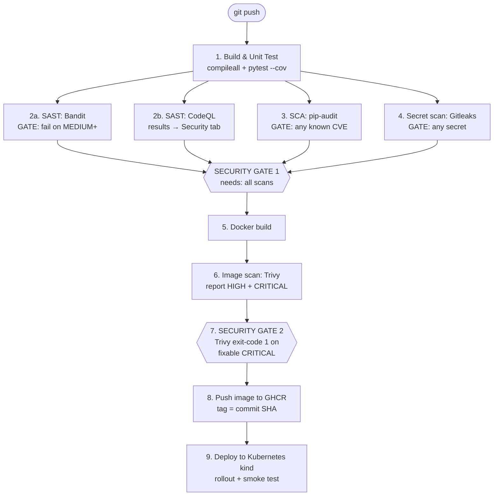
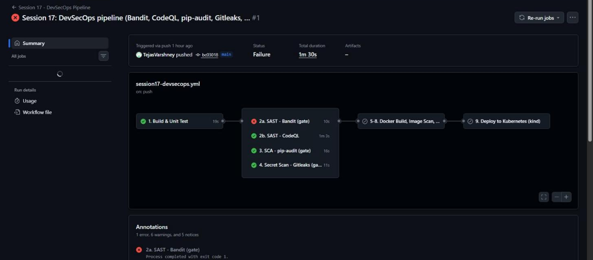
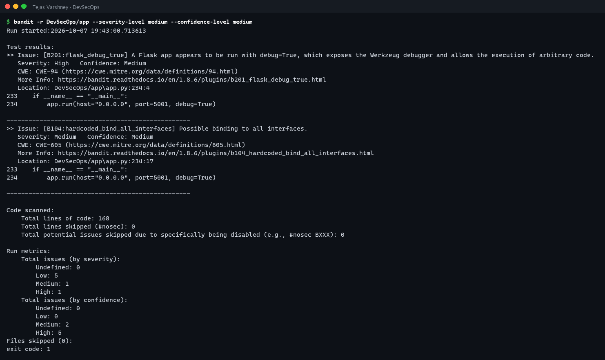
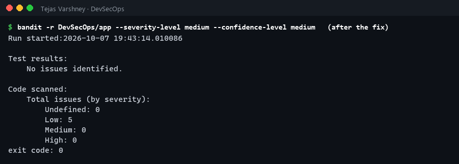
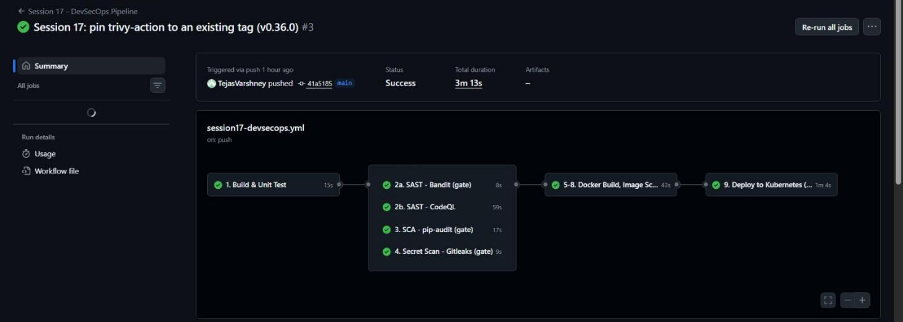
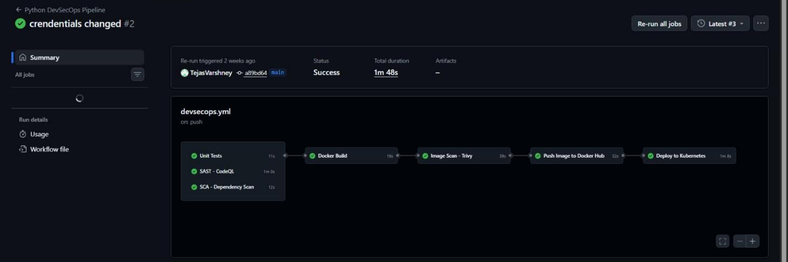

# Session 17: Complete CI/CD & DevSecOps

> 📸 **Screenshots:** the terminal images on this page are rendered from the exact command output captured during my runs (full text is under each *Text output* section). The GitHub Actions images are real browser screenshots of the run pages.

**Name:** Tejas Varshney

A complete **CI/CD + DevSecOps pipeline** for my Flask "DevSecOps Dashboard" app. I originally built it in [TejasVarshney/devsecops_demo](https://github.com/TejasVarshney/devsecops_demo) and brought it into this repo. Here I improved the pipeline: added the missing **secret scanning**, a second SAST tool, real **security gates**, a deploy that uses the exact scanned image, and container hardening.

| Deliverable | Where |
|---|---|
| Application | [app/app.py](app/app.py) + [templates](app/templates) + [static](app/static) |
| Unit tests | [tests/test_app.py](tests/test_app.py) |
| Dockerfile | [Dockerfile](Dockerfile) |
| GitHub Actions workflow | [.github/workflows/session17-devsecops.yml](../.github/workflows/session17-devsecops.yml) |
| Security tool config | [.gitleaks.toml](.gitleaks.toml), Bandit/pip-audit/Trivy flags in the workflow, [SECURITY.md](SECURITY.md) |
| Kubernetes manifests | [k8s/deployment.yaml](k8s/deployment.yaml), [k8s/service.yaml](k8s/service.yaml) |
| Successful pipeline output | [Run #3 ✅](https://github.com/TejasVarshney/devops-heros/actions/runs/37677104307) · [outputs/](outputs) |
| My original pipeline (for comparison) | [original-pipeline/devsecops.yml](original-pipeline/devsecops.yml) |

---

## Expected flow → my implementation



| Stage | Tool | What it catches | Gate behaviour |
|---|---|---|---|
| **Build** | `pip install`, `python -m compileall` | Broken dependencies, syntax errors | Job fails → nothing downstream runs |
| **Unit test** | `pytest` + `pytest-cov` (8 tests) | Functional regressions | Job fails → nothing downstream runs |
| **SAST** | **Bandit** (Python-specific) and **GitHub CodeQL** (semantic data-flow analysis) | Insecure code: debug mode, injection, weak crypto, hard-coded secrets | Bandit fails the job at severity ≥ MEDIUM and confidence ≥ MEDIUM. CodeQL publishes alerts to the repo's Security tab |
| **SCA** | **pip-audit** (PyPI Advisory DB / OSV) | Dependencies with known CVEs | `--strict` → any vulnerable package fails |
| **Secret scanning** | **Gitleaks** (Docker image `zricethezav/gitleaks`) | AWS keys, tokens, private keys, passwords in the code | `--exit-code 1` on any finding (values redacted in the log) |
| **Docker build** | `docker build` | Image build problems | Built once and reused by the scans |
| **Container image scan** | **Trivy** (`aquasecurity/trivy-action`) | OS-package and library CVEs inside the image | Step 6 only reports HIGH/CRITICAL; step 7 is the gate |
| **Security gate** | `needs:` + exit codes | Anything above | Gate 1: the image job `needs` all four scan jobs. Gate 2: Trivy fails on CRITICAL vulnerabilities with an available fix (`ignore-unfixed`) |
| **Push image** | GHCR via `GITHUB_TOKEN` | — | Only on `push` to main, never for PRs |
| **Deploy** | kind + `kubectl apply` | Broken manifests or app start-up | `rollout status` + `curl /health` and `/api/status` must succeed |

---

## The pipeline in action: a security gate blocking a real vulnerability

### Run #1: ❌ blocked by SAST



[Run #1](https://github.com/TejasVarshney/devops-heros/actions/runs/37676161061) ran my original app code. Tests, CodeQL, pip-audit and Gitleaks passed, but **Bandit failed**. Because the image job `needs` every scan, **Docker build, image scan, push and deploy were all skipped**. A vulnerable build never reached the registry or the cluster.

```text
Workflow: Session 17 - DevSecOps Pipeline
Run #1  event=push  commit=bc03018  "Session 17: DevSecOps pipeline (Bandit, CodeQL, pip-audit, Gitleaks, Trivy gate, GHCR, kind)"
Status: completed / failure
Started 2026-10-07T19:39:39Z  updated 2026-10-07T19:41:09Z
URL: https://github.com/TejasVarshney/devops-heros/actions/runs/37676161061

JOB  1. Build & Unit Test                                    success   runner: GitHub Actions 1000000031 (ubuntu-latest)
      1. Set up job                                              success
      2. Run actions/checkout@v4                                 success
      3. Run actions/setup-python@v5                             success
      4. Install dependencies (build)                            success
      5. Byte-compile (catch syntax errors)                      success
      6. Unit tests + coverage                                   success
     11. Post Run actions/setup-python@v5                        success
     12. Post Run actions/checkout@v4                            success
     13. Complete job                                            success
JOB  2a. SAST - Bandit (gate)                                failure   runner: GitHub Actions 1000000035 (ubuntu-latest)
      1. Set up job                                              success
      2. Run actions/checkout@v4                                 success
      3. Run actions/setup-python@v5                             success
      4. Run pip install bandit==1.8.6                           success
      5. Bandit - fail on MEDIUM+ severity / MEDIUM+ confidence  failure
      9. Post Run actions/setup-python@v5                        skipped
     10. Post Run actions/checkout@v4                            success
     11. Complete job                                            success
JOB  2b. SAST - CodeQL                                       success   runner: GitHub Actions 1000000032 (ubuntu-latest)
      1. Set up job                                              success
      2. Run actions/checkout@v4                                 success
      3. Run github/codeql-action/init@v3                        success
      4. Run github/codeql-action/analyze@v3                     success
      6. Post Run github/codeql-action/analyze@v3                success
      7. Post Run github/codeql-action/init@v3                   success
      8. Post Run actions/checkout@v4                            success
      9. Complete job                                            success
JOB  3. SCA - pip-audit (gate)                               success   runner: GitHub Actions 1000000034 (ubuntu-latest)
      1. Set up job                                              success
      2. Run actions/checkout@v4                                 success
      3. Run actions/setup-python@v5                             success
      4. Run pip install pip-audit==2.9.0                        success
      5. Audit dependencies for known CVEs                       success
      9. Post Run actions/setup-python@v5                        success
     10. Post Run actions/checkout@v4                            success
     11. Complete job                                            success
JOB  4. Secret Scan - Gitleaks (gate)                        success   runner: GitHub Actions 1000000033 (ubuntu-latest)
      1. Set up job                                              success
      2. Run actions/checkout@v4                                 success
      3. Gitleaks                                                success
      6. Post Run actions/checkout@v4                            success
      7. Complete job                                            success
JOB  5-8. Docker Build, Image Scan, Security Gate, Push      skipped   runner: None (ubuntu-latest)
JOB  9. Deploy to Kubernetes (kind)                          skipped   runner: None (ubuntu-latest)
```

Same Bandit command run locally to read the findings:



<details><summary>Text output</summary>

```text
$ bandit -r DevSecOps/app --severity-level medium --confidence-level medium
Run started:2026-10-07 19:43:00.713613

Test results:
>> Issue: [B201:flask_debug_true] A Flask app appears to be run with debug=True, which exposes the Werkzeug debugger and allows the execution of arbitrary code.
   Severity: High   Confidence: Medium
   CWE: CWE-94 (https://cwe.mitre.org/data/definitions/94.html)
   More Info: https://bandit.readthedocs.io/en/1.8.6/plugins/b201_flask_debug_true.html
   Location: DevSecOps/app\app.py:234:4
233	if __name__ == "__main__":
234	    app.run(host="0.0.0.0", port=5001, debug=True)

--------------------------------------------------
>> Issue: [B104:hardcoded_bind_all_interfaces] Possible binding to all interfaces.
   Severity: Medium   Confidence: Medium
   CWE: CWE-605 (https://cwe.mitre.org/data/definitions/605.html)
   More Info: https://bandit.readthedocs.io/en/1.8.6/plugins/b104_hardcoded_bind_all_interfaces.html
   Location: DevSecOps/app\app.py:234:17
233	if __name__ == "__main__":
234	    app.run(host="0.0.0.0", port=5001, debug=True)

--------------------------------------------------

Code scanned:
	Total lines of code: 168
	Total lines skipped (#nosec): 0
	Total potential issues skipped due to specifically being disabled (e.g., #nosec BXXX): 0

Run metrics:
	Total issues (by severity):
		Undefined: 0
		Low: 5
		Medium: 1
		High: 1
	Total issues (by confidence):
		Undefined: 0
		Low: 0
		Medium: 2
		High: 5
Files skipped (0):
exit code: 1
```

</details>

- **B201 (HIGH): `debug=True`.** The Werkzeug interactive debugger lets anyone who can reach the app execute arbitrary Python on the server (CWE-94). It must never run in production.
- **B104 (MEDIUM):** hard-coded bind to all interfaces.

**Fix** ([app.py](app/app.py)): debug is **opt-in** (`FLASK_DEBUG=1`, off by default), and the bind address comes from `HOST` (default `127.0.0.1`). Only the container sets `ENV HOST=0.0.0.0`, where binding to all interfaces is intended.



<details><summary>Text output</summary>

```text
$ bandit -r DevSecOps/app --severity-level medium --confidence-level medium   (after the fix)
Run started:2026-10-07 19:43:14.010086

Test results:
	No issues identified.

Code scanned:
	Total issues (by severity):
		Undefined: 0
		Low: 5
		Medium: 0
		High: 0
exit code: 0
```

</details>

### Run #2: ❌ pipeline configuration error
[Run #2](https://github.com/TejasVarshney/devops-heros/actions/runs/37676646717): Bandit now **passed** ✅, but the image job failed at *Set up job*. The annotation said `Unable to resolve action aquasecurity/trivy-action@0.33.1, unable to find version`. The action's tags use a `v` prefix, so I listed the tags through the GitHub API and pinned `@v0.36.0`.

```text
Workflow: Session 17 - DevSecOps Pipeline
Run #2  event=push  commit=c70f811  "Session 17: fix Bandit B201/B104 (Flask debug=True, bind-all) found by the SAST gate"
Status: completed / failure
Started 2026-10-07T19:43:30Z  updated 2026-10-07T19:45:01Z
URL: https://github.com/TejasVarshney/devops-heros/actions/runs/37676646717

JOB  1. Build & Unit Test                                    success   runner: GitHub Actions 1000000036 (ubuntu-latest)
      1. Set up job                                              success
      2. Run actions/checkout@v4                                 success
      3. Run actions/setup-python@v5                             success
      4. Install dependencies (build)                            success
      5. Byte-compile (catch syntax errors)                      success
      6. Unit tests + coverage                                   success
     11. Post Run actions/setup-python@v5                        success
     12. Post Run actions/checkout@v4                            success
     13. Complete job                                            success
JOB  3. SCA - pip-audit (gate)                               success   runner: GitHub Actions 1000000037 (ubuntu-latest)
      1. Set up job                                              success
      2. Run actions/checkout@v4                                 success
      3. Run actions/setup-python@v5                             success
      4. Run pip install pip-audit==2.9.0                        success
      5. Audit dependencies for known CVEs                       success
      9. Post Run actions/setup-python@v5                        success
     10. Post Run actions/checkout@v4                            success
     11. Complete job                                            success
JOB  4. Secret Scan - Gitleaks (gate)                        success   runner: GitHub Actions 1000000038 (ubuntu-latest)
      1. Set up job                                              success
      2. Run actions/checkout@v4                                 success
      3. Gitleaks                                                success
      6. Post Run actions/checkout@v4                            success
      7. Complete job                                            success
JOB  2b. SAST - CodeQL                                       success   runner: GitHub Actions 1000000039 (ubuntu-latest)
      1. Set up job                                              success
      2. Run actions/checkout@v4                                 success
      3. Run github/codeql-action/init@v3                        success
      4. Run github/codeql-action/analyze@v3                     success
      6. Post Run github/codeql-action/analyze@v3                success
      7. Post Run github/codeql-action/init@v3                   success
      8. Post Run actions/checkout@v4                            success
      9. Complete job                                            success
JOB  2a. SAST - Bandit (gate)                                success   runner: GitHub Actions 1000000040 (ubuntu-latest)
      1. Set up job                                              success
      2. Run actions/checkout@v4                                 success
      3. Run actions/setup-python@v5                             success
      4. Run pip install bandit==1.8.6                           success
      5. Bandit - fail on MEDIUM+ severity / MEDIUM+ confidence  success
      9. Post Run actions/setup-python@v5                        success
     10. Post Run actions/checkout@v4                            success
     11. Complete job                                            success
JOB  5-8. Docker Build, Image Scan, Security Gate, Push      failure   runner: GitHub Actions 1000000042 (ubuntu-latest)
      1. Set up job                                              failure
JOB  9. Deploy to Kubernetes (kind)                          skipped   runner: None (ubuntu-latest)
```

### Run #3: ✅ all stages green, deployed to Kubernetes



[Run #3](https://github.com/TejasVarshney/devops-heros/actions/runs/37677104307): build → test → SAST ×2 → SCA → secret scan → Docker build → Trivy scan → Trivy gate → push to `ghcr.io/tejasvarshney/session17-devsecops:<sha>` → deploy to kind → smoke test.

```text
Workflow: Session 17 - DevSecOps Pipeline
Run #3  event=push  commit=41a5185  "Session 17: pin trivy-action to an existing tag (v0.36.0)"
Status: completed / success
Started 2026-10-07T19:47:09Z  updated 2026-10-07T19:50:22Z
URL: https://github.com/TejasVarshney/devops-heros/actions/runs/37677104307

JOB  1. Build & Unit Test                                    success   runner: GitHub Actions 1000000044 (ubuntu-latest)
      1. Set up job                                              success
      2. Run actions/checkout@v4                                 success
      3. Run actions/setup-python@v5                             success
      4. Install dependencies (build)                            success
      5. Byte-compile (catch syntax errors)                      success
      6. Unit tests + coverage                                   success
     11. Post Run actions/setup-python@v5                        success
     12. Post Run actions/checkout@v4                            success
     13. Complete job                                            success
JOB  2b. SAST - CodeQL                                       success   runner: GitHub Actions 1000000046 (ubuntu-latest)
      1. Set up job                                              success
      2. Run actions/checkout@v4                                 success
      3. Run github/codeql-action/init@v3                        success
      4. Run github/codeql-action/analyze@v3                     success
      6. Post Run github/codeql-action/analyze@v3                success
      7. Post Run github/codeql-action/init@v3                   success
      8. Post Run actions/checkout@v4                            success
      9. Complete job                                            success
JOB  2a. SAST - Bandit (gate)                                success   runner: GitHub Actions 1000000047 (ubuntu-latest)
      1. Set up job                                              success
      2. Run actions/checkout@v4                                 success
      3. Run actions/setup-python@v5                             success
      4. Run pip install bandit==1.8.6                           success
      5. Bandit - fail on MEDIUM+ severity / MEDIUM+ confidence  success
      9. Post Run actions/setup-python@v5                        success
     10. Post Run actions/checkout@v4                            success
     11. Complete job                                            success
JOB  4. Secret Scan - Gitleaks (gate)                        success   runner: GitHub Actions 1000000048 (ubuntu-latest)
      1. Set up job                                              success
      2. Run actions/checkout@v4                                 success
      3. Gitleaks                                                success
      6. Post Run actions/checkout@v4                            success
      7. Complete job                                            success
JOB  3. SCA - pip-audit (gate)                               success   runner: GitHub Actions 1000000045 (ubuntu-latest)
      1. Set up job                                              success
      2. Run actions/checkout@v4                                 success
      3. Run actions/setup-python@v5                             success
      4. Run pip install pip-audit==2.9.0                        success
      5. Audit dependencies for known CVEs                       success
      9. Post Run actions/setup-python@v5                        success
     10. Post Run actions/checkout@v4                            success
     11. Complete job                                            success
JOB  5-8. Docker Build, Image Scan, Security Gate, Push      success   runner: GitHub Actions 1000000049 (ubuntu-latest)
      1. Set up job                                              success
      2. Run actions/checkout@v4                                 success
      3. Run echo "image=${IMAGE}:${GITHUB_SHA::7}" >> "$GITHUB_OUTPUT" success
      4. 5. Docker build                                         success
      5. 6. Container image scan - Trivy (report all HIGH/CRITICAL) success
      6. 7. Security gate - block CRITICAL vulnerabilities that have a fix success
      7. 8. Push image to GHCR                                   success
     12. Post 7. Security gate - block CRITICAL vulnerabilities that have a fix success
     13. Post 6. Container image scan - Trivy (report all HIGH/CRITICAL) success
     14. Post Run actions/checkout@v4                            success
     15. Complete job                                            success
JOB  9. Deploy to Kubernetes (kind)                          success   runner: GitHub Actions 1000000050 (ubuntu-latest)
      1. Set up job                                              success
      2. Run actions/checkout@v4                                 success
      3. Run helm/kind-action@v1.10.0                            success
      4. Deploy the exact image that passed the gates            success
      5. Smoke test                                              success
      9. Post Run helm/kind-action@v1.10.0                       success
     10. Post Run actions/checkout@v4                            success
     11. Complete job                                            success
```

---

## What I changed compared with my original pipeline

My first version ([original-pipeline/devsecops.yml](original-pipeline/devsecops.yml)) already had tests, CodeQL, pip-audit, Trivy, a Docker Hub push and a kind deploy. Its runs:




```text
Repository: https://github.com/TejasVarshney/devsecops_demo   workflow: Python DevSecOps Pipeline

Run 1 - commit "first commit"  (2026-09-26)  -> failure
https://github.com/TejasVarshney/devsecops_demo/actions/runs/36235458560
  JOB SCA - Dependency Scan            success
      - Checkout code                                      success
      - Setup Python                                       success
      - Install dependencies                               success
      - Run dependency scan                                success
  JOB SAST - CodeQL                    success
      - Checkout code                                      success
      - Initialize CodeQL                                  success
      - Analyze code                                       success
  JOB Unit Tests                       success
      - Checkout code                                      success
      - Setup Python                                       success
      - Install dependencies                               success
      - Run tests                                          success
  JOB Docker Build                     success
      - Checkout code                                      success
      - Build Docker image                                 success
  JOB Image Scan - Trivy               success
      - Checkout code                                      success
      - Build Docker image                                 success
      - Install Trivy                                      success
      - Scan image                                         success
  JOB Push Image to Docker Hub         failure
      - Checkout code                                      success
      - Login to Docker Hub                                failure
      - Build and tag image                                skipped
      - Push image                                         skipped
  JOB Deploy to Kubernetes             skipped

Run 2 - commit "crendentials changed"  (2026-09-26)  -> success
https://github.com/TejasVarshney/devsecops_demo/actions/runs/36235832202
  JOB Unit Tests                       success
      - Checkout code                                      success
      - Setup Python                                       success
      - Install dependencies                               success
      - Run tests                                          success
  JOB SCA - Dependency Scan            success
      - Checkout code                                      success
      - Setup Python                                       success
      - Install dependencies                               success
      - Run dependency scan                                success
  JOB SAST - CodeQL                    success
      - Checkout code                                      success
      - Initialize CodeQL                                  success
      - Analyze code                                       success
  JOB Docker Build                     success
      - Checkout code                                      success
      - Build Docker image                                 success
  JOB Image Scan - Trivy               success
      - Checkout code                                      success
      - Build Docker image                                 success
      - Install Trivy                                      success
      - Scan image                                         success
  JOB Push Image to Docker Hub         success
      - Checkout code                                      success
      - Login to Docker Hub                                success
      - Build and tag image                                success
      - Push image                                         success
  JOB Deploy to Kubernetes             success
      - Checkout code                                      success
      - Create k8s Kind Cluster (For testing deployment)   success
      - Update deployment with new image tag               success
      - Deploy to Kubernetes                               success
      - Check rollout status                               success
      - Test running website in CI (Curl)                  success
```

Run 1 there failed at **Login to Docker Hub** (missing/incorrect `DOCKERHUB_TOKEN` secret), so push and deploy were skipped. After I fixed the credential, run 2 passed. Reviewing it for this session, I found and fixed these gaps:

| Gap in the original | Fix in this version |
|---|---|
| No **secret scanning** | Gitleaks job (gate) |
| Trivy only *reported*; it never failed the build, so **no real image gate** | Separate gate step: `exit-code 1` on fixable CRITICAL CVEs |
| Image scanned in one job but **rebuilt** in the push job, so the pushed image wasn't the scanned one | Build once, scan, gate and push **the same image** in one job, tagged with the commit SHA |
| Deploy step ran `sed` on `__IMAGE_TAG__`, but `deployment.yaml` had a hard-coded `hero05/python-web-app`, so **it always deployed an old image** | Manifest uses an `__IMAGE__` placeholder that the pipeline fills with the exact gated image |
| Only one SAST tool, which didn't flag `debug=True` as a blocking issue | Added Bandit as a blocking gate (CodeQL kept for deeper analysis) |
| Docker Hub needed a stored token, and a wrong token broke the run | GHCR with the built-in short-lived `GITHUB_TOKEN` (`permissions: packages: write` only on that job) |
| Container ran as **root**, with no probes or limits | `USER 10001`, `runAsNonRoot`, `readOnlyRootFilesystem`, `drop: [ALL]`, no privilege escalation, liveness/readiness probes, CPU/memory limits |

## DevSecOps concepts (my notes)
- **Shift left:** find security problems at commit time, when they are cheapest to fix (one line in Run #1), not after deployment.
- **SAST vs SCA vs DAST:** SAST reads *my* code without running it. SCA checks *third-party* packages against vulnerability databases. DAST (e.g. OWASP ZAP) attacks the *running* app. A next step for this pipeline would be a ZAP baseline scan against the kind deployment.
- **Security gates must be able to fail the build.** Otherwise it's only reporting, as my original Trivy step was. Gates also need tuning: blocking on *every* HIGH CVE in a base image would make the pipeline permanently red, so I block on fixable CRITICAL and report the rest.
- **Supply chain:** pin action versions (and ideally SHAs), deploy by immutable tag (commit SHA), use short-lived tokens, give least privilege to `permissions:`.
