# Docker Fundamentals Guide

This directory contains core Docker concepts, engine architecture inspection commands, container lifecycle operations, logging, and system cleanup workflows.

---

## Table of Contents

1. [Engine Architecture & Verification](#1-engine-architecture--verification)
2. [Container Execution & Lifecycle](#2-container-execution--lifecycle)
3. [Inspecting & Monitoring Containers](#3-inspecting--monitoring-containers)
4. [Container Shell Access & Execution](#4-container-shell-access--execution)
5. [Container Cleanup Operations](#5-container-cleanup-operations)

---

## 1. Engine Architecture & Verification

Verify Docker daemon status, version information, and host system resource limits.

```bash
docker version
docker info
```

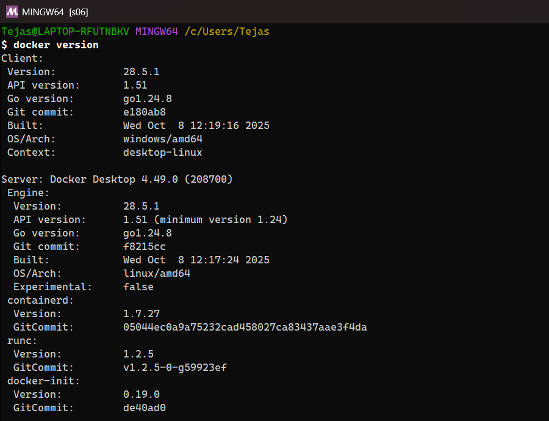
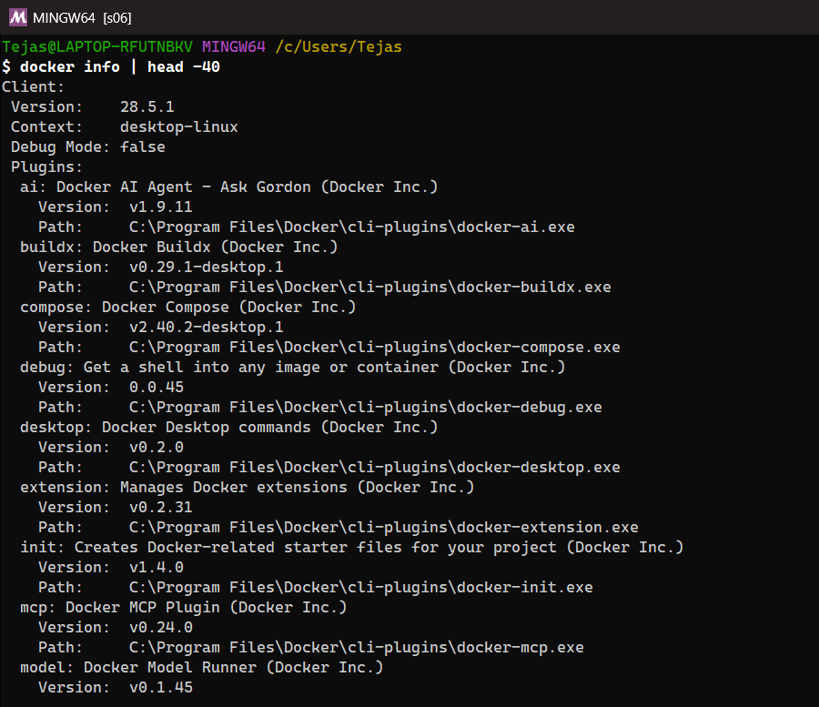
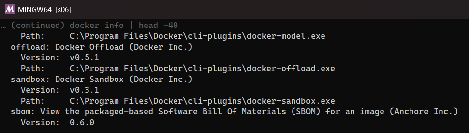


---

## 2. Container Execution & Lifecycle

Run, stop, start, restart, and pause container instances from images.

```bash
docker run hello-world
docker run -d --name web-server -p 8080:80 nginx
docker stop web-server
docker start web-server
docker restart web-server
docker pause web-server
docker unpause web-server
```

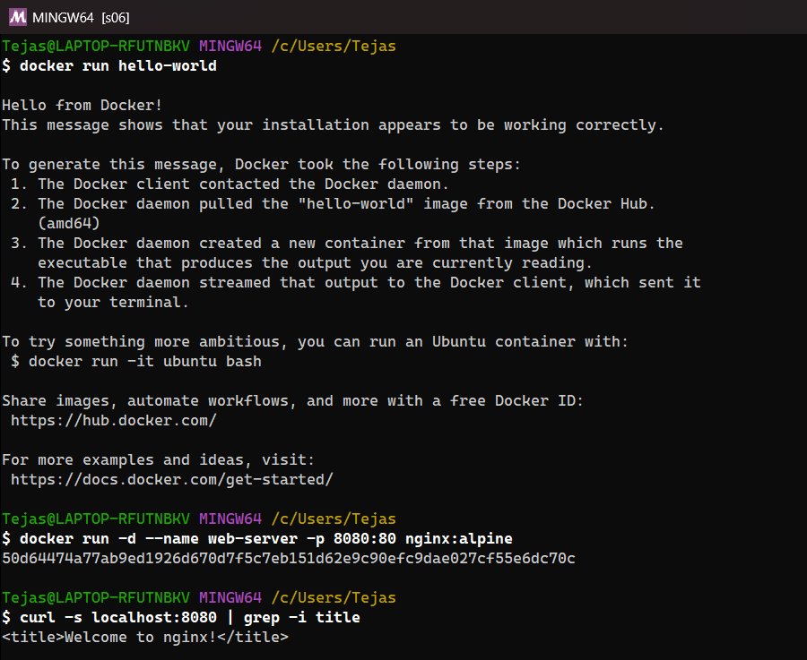
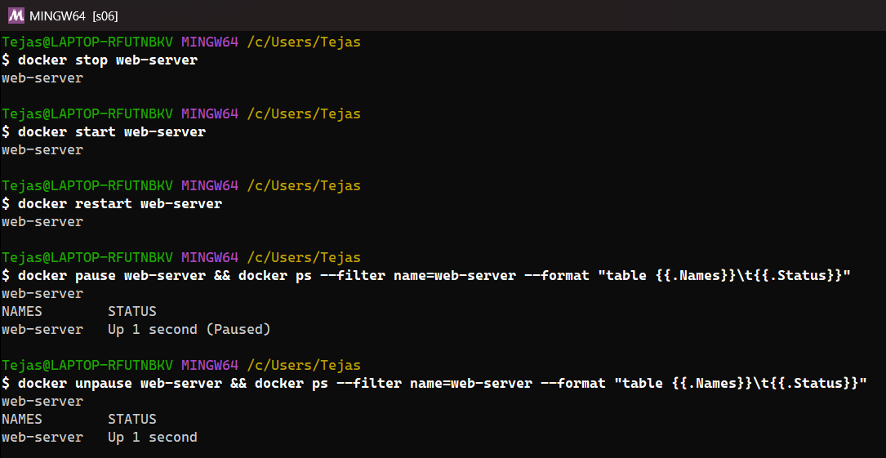


---

## 3. Inspecting & Monitoring Containers

View running containers, stream real-time logs, inspect configurations, and track resource utilization.

```bash
docker ps
docker ps -a
docker ps -q
docker logs web-server
docker logs -f --tail 100 web-server
docker inspect web-server
docker stats web-server
docker top web-server
```

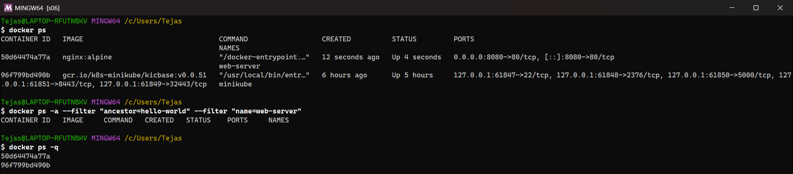
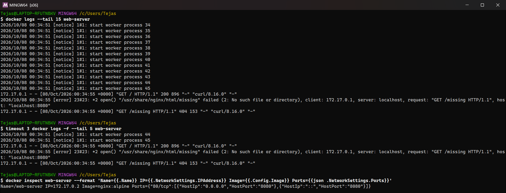
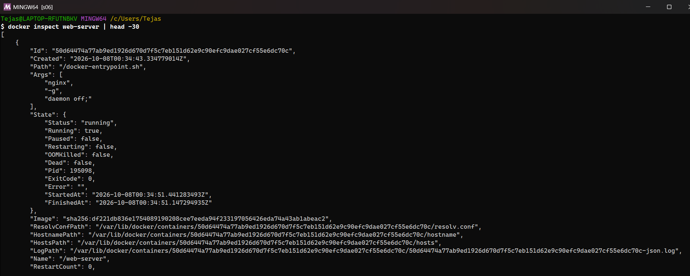
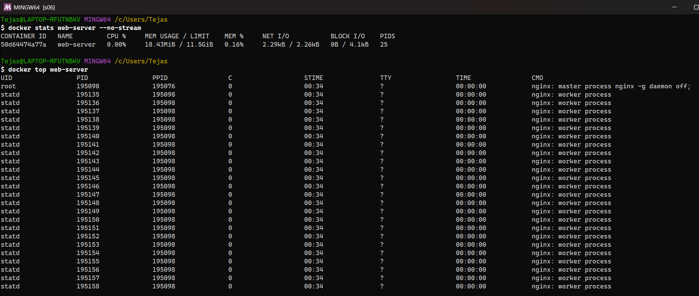


---

## 4. Container Shell Access & Execution

Run interactive commands or attach a bash shell inside a running container.

```bash
docker exec -it web-server /bin/bash
docker exec -it web-server /bin/sh
docker exec web-server cat /etc/nginx/nginx.conf
docker attach web-server
```

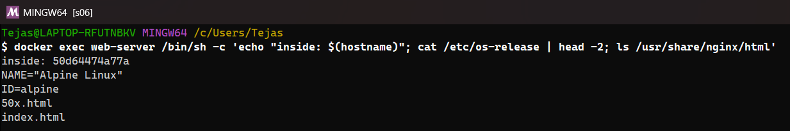
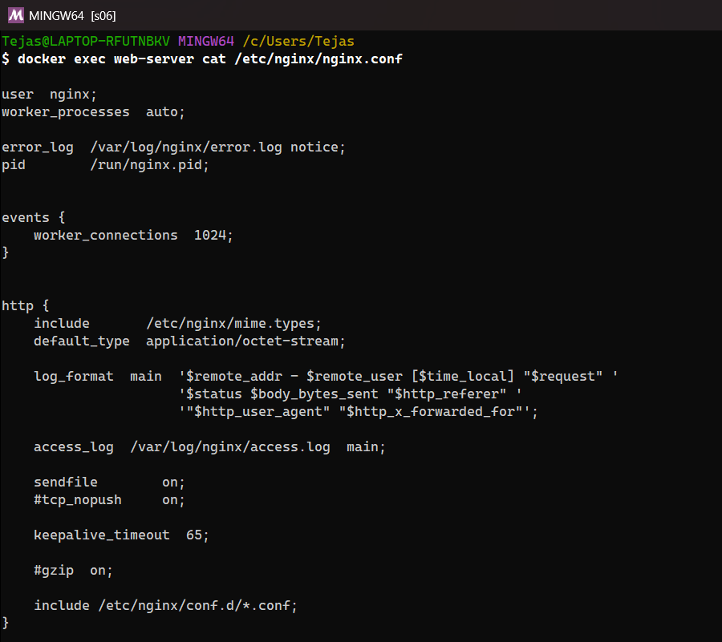
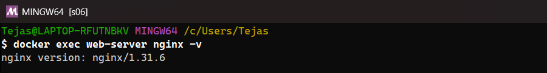


---

## 5. Container Cleanup Operations

Remove stopped or running containers and perform complete Docker system prunes.

```bash
docker rm web-server
docker rm -f web-server
docker rm $(docker ps -aq)
docker rm -f $(docker ps -aq)
docker system prune -a --volumes
```

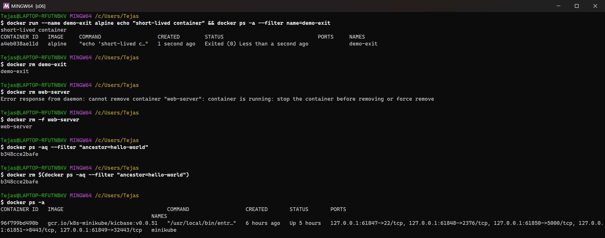
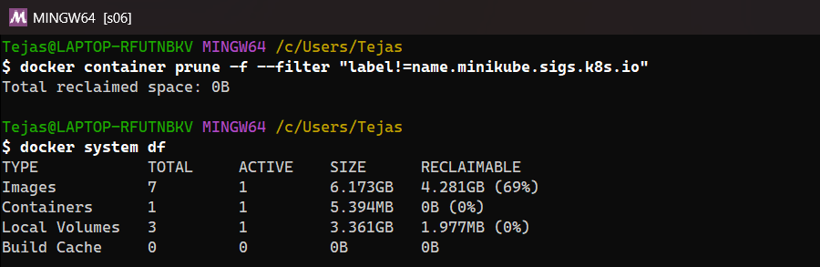


> **Note on the screenshots:** on my machine Docker also runs my minikube Kubernetes cluster (and other images I use), so I ran the cleanup commands **scoped** to the demo containers (`--filter`, `docker container prune` on stopped containers only) instead of the global `docker rm -f $(docker ps -aq)` / `docker system prune -a --volumes`, which would have deleted the cluster too. `docker system df` shows what a prune would reclaim.
