# Docker Networking & Volumes Guide

This directory contains Docker networking drivers, container port publishing, custom network creation, persistent volume storage, and multi-container orchestration with Docker Compose.

---

## Table of Contents

1. [Docker Network Drivers](#1-docker-network-drivers)
2. [Port Forwarding & Publishing](#2-port-forwarding--publishing)
3. [Docker Network Management](#3-docker-network-management)
4. [Docker Volumes & Persistent Storage](#4-docker-volumes--persistent-storage)
5. [Docker Compose Orchestration](#5-docker-compose-orchestration)

---

## 1. Docker Network Drivers

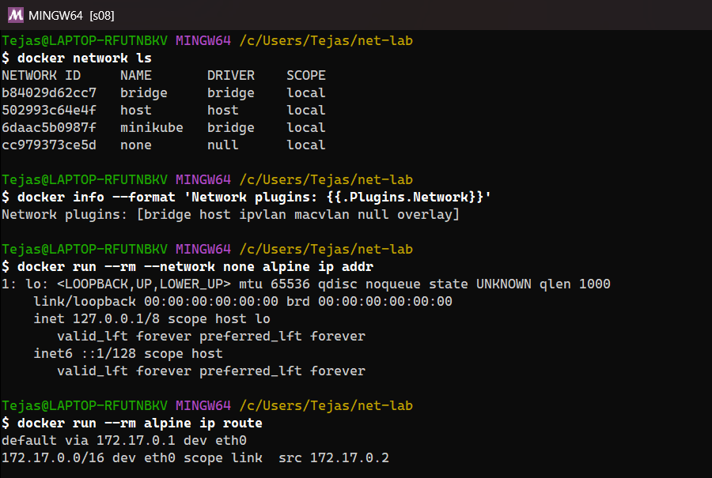


Docker provides multiple network drivers to handle container-to-container and container-to-host communications:

- **bridge**: Default network driver for isolated container communication on the same host.
- **host**: Removes network isolation between the container and the Docker host.
- **none**: Disables all networking for the container.
- **overlay**: Connects multiple Docker daemons across Swarm cluster nodes.

---

## 2. Port Forwarding & Publishing

Expose container internal ports to the host interface for external accessibility.

```bash
docker run -d --name webapp -p 8080:80 nginx
docker run -d --name api -p 127.0.0.1:3000:3000 my-api
docker run -d --name random-web -P nginx
docker port webapp
```

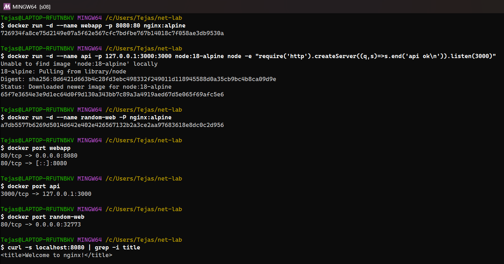
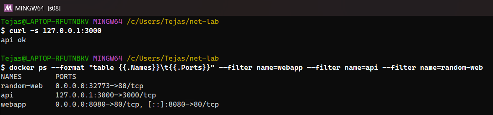


---

## 3. Docker Network Management

Create, list, inspect, connect, and delete user-defined Docker networks.

```bash
docker network ls
docker network create --driver bridge my-custom-network
docker network inspect my-custom-network
docker run -d --name db --network my-custom-network postgres
docker network connect my-custom-network webapp
docker network disconnect my-custom-network webapp
docker network rm my-custom-network
docker network prune
```

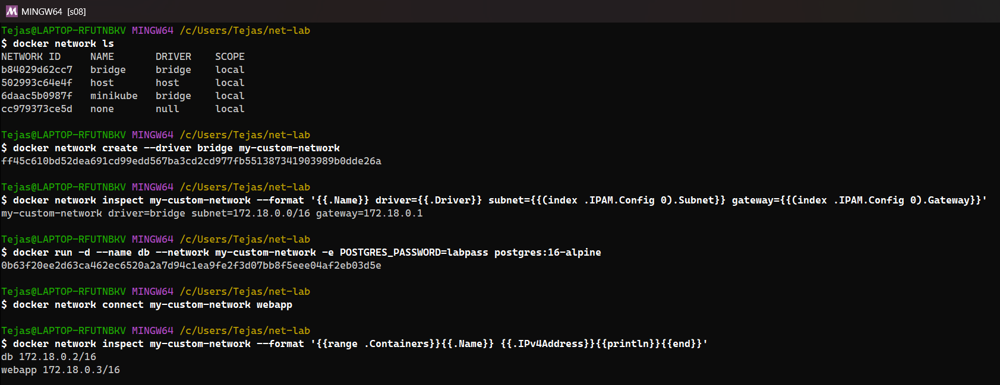
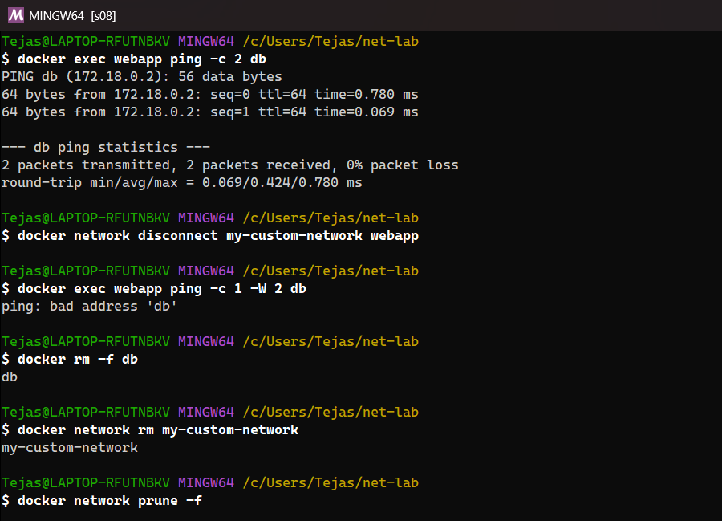


---

## 4. Docker Volumes & Persistent Storage

Persist data beyond container lifecycle using named volumes and host bind mounts.

```bash
docker volume create my-data
docker volume ls
docker volume inspect my-data
docker run -d --name db-server -v my-data:/var/lib/postgresql/data postgres
docker run -d --name dev-app -v $(pwd):/app node:18-alpine
docker volume rm my-data
docker volume prune
```

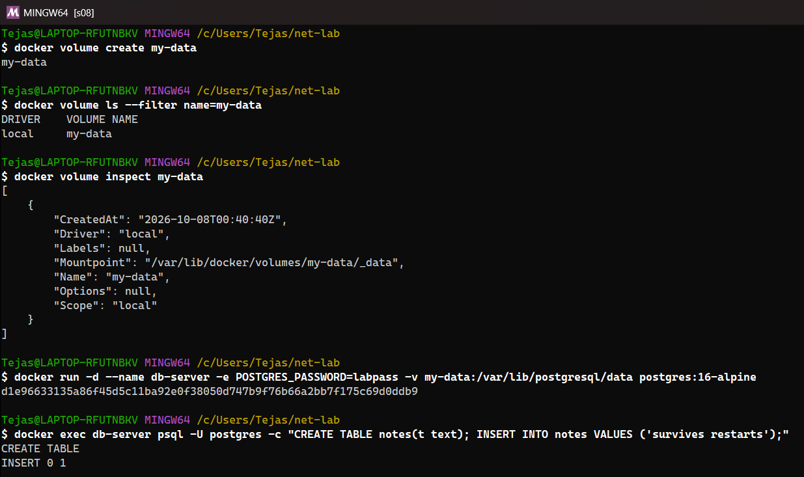
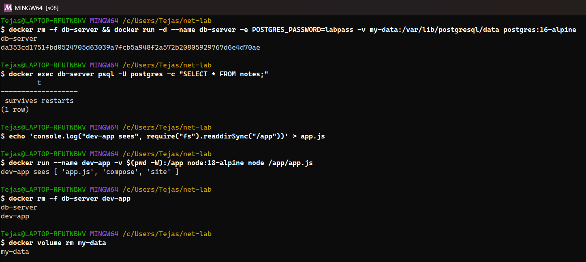
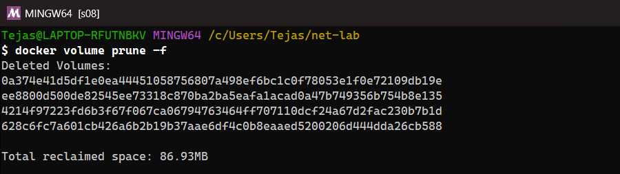


---

## 5. Docker Compose Orchestration

Define and run multi-container applications using a `docker-compose.yml` specification.

### Example `docker-compose.yml`

```yaml
version: '3.8'
services:
  web:
    build: .
    ports:
      - "8000:8000"
    networks:
      - app-net
    depends_on:
      - redis
  redis:
    image: redis:alpine
    networks:
      - app-net

networks:
  app-net:
    driver: bridge
```

### Docker Compose Commands

```bash
docker-compose up -d
docker-compose ps
docker-compose logs -f
docker-compose exec web sh
docker-compose down
docker-compose down -v
```

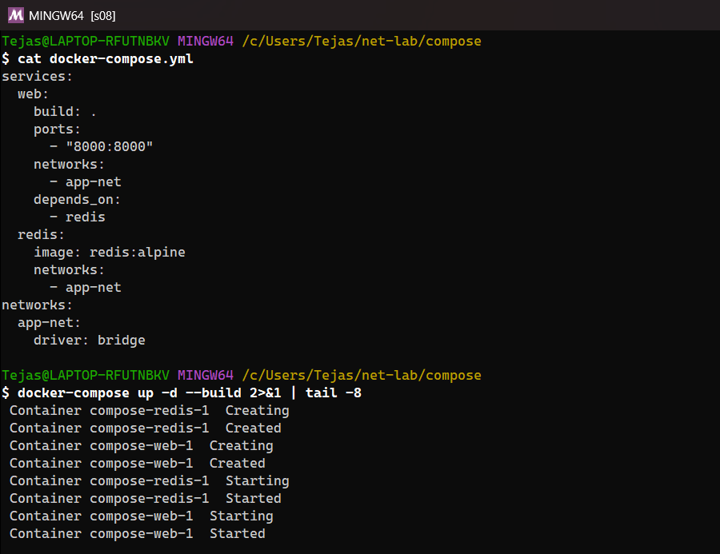
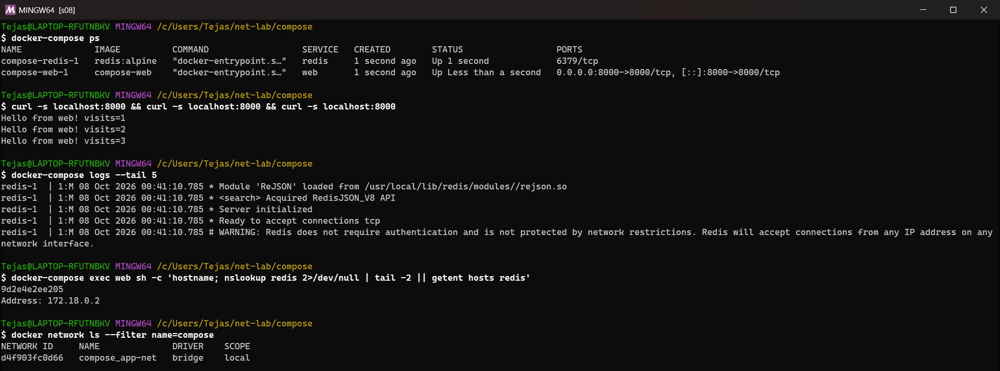
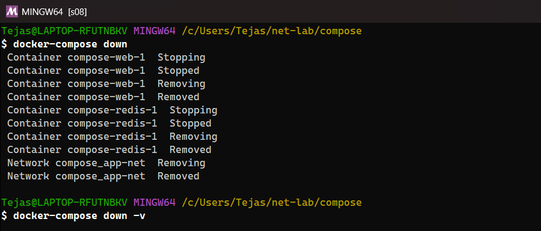


---

## 6. Homework Tasks

### Task 1: Container networking (frontend / backend / database)

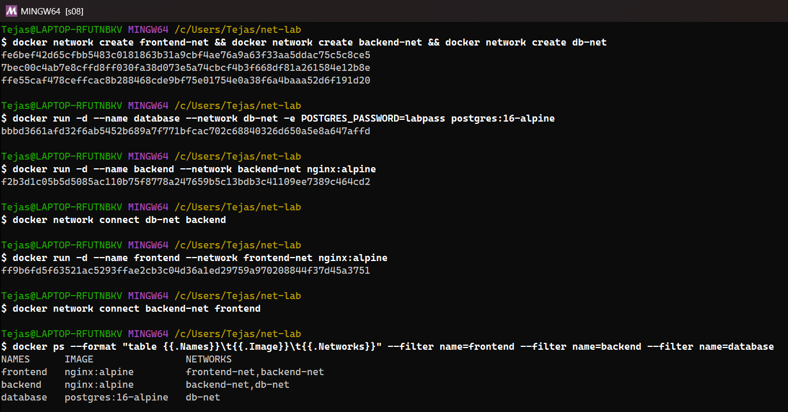
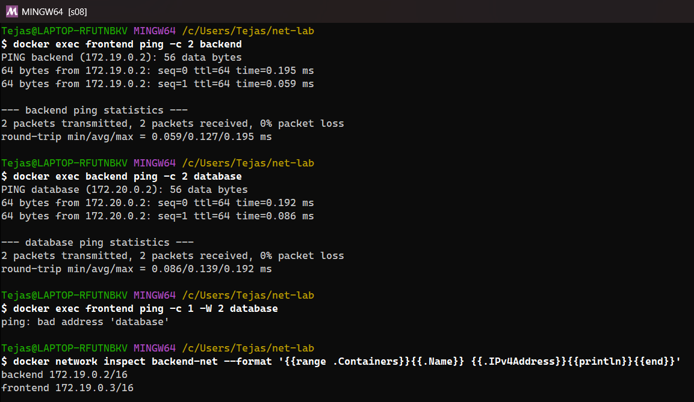


Three networks, `frontend-net`, `backend-net` and `db-net`:
- `frontend` (nginx) is on `frontend-net` + `backend-net`
- `backend` (nginx) is on `backend-net` + `db-net` (**the container on 2 networks** that joins the tiers)
- `database` is on `db-net` only. I used `postgres:16-alpine` instead of the MySQL image to save disk space (about 100 MB vs 600 MB); the networking behaviour is identical.

Results: frontend → backend ✅ and backend → database ✅ (Docker's embedded DNS resolves container names on user-defined networks). **frontend → database ❌ `bad address 'database'`**, because they share no network. That's network isolation between tiers.

### Task 2: Host network

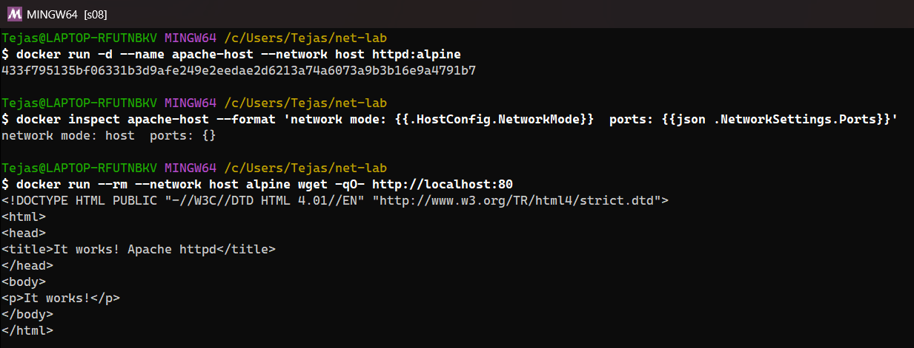


`docker run -d --name apache-host --network host httpd:alpine` has **no port mapping** (`ports: {}`), because the container uses the host's network stack directly. Another host-network container reached Apache on `localhost:80` → "It works!". On Docker Desktop, "host" means the Docker VM's network (host networking for Windows apps is a Docker Desktop setting); on Linux it is the machine itself.

### Task 3: Bind mount

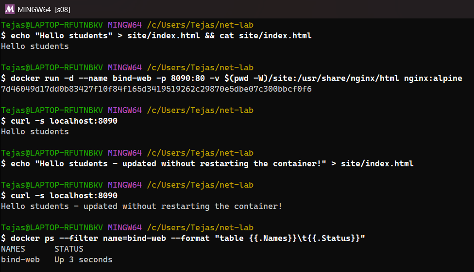


`site/index.html` ("Hello students") was bind-mounted into nginx with `-v $(pwd -W)/site:/usr/share/nginx/html`. After I edited the file **on my machine**, the next `curl` showed the new text immediately, without restarting the container (`Up 3 seconds`, same container).

### Task 4: Overlay networks (research)

- An **overlay** network spans **multiple Docker hosts**. Containers on different machines get IPs on one virtual L2 network and talk as if they were on the same host.
- It's built on **VXLAN**: container traffic is encapsulated in UDP (port 4789) between hosts. A distributed key-value store (Swarm's Raft) holds the network state, using ports 2377 (management) and 7946 (gossip).
- Created with `docker swarm init` then `docker network create -d overlay --attachable my-overlay`. Services are load-balanced through a routing mesh/VIP, and traffic can be encrypted with `--opt encrypted` (IPsec).
- **Use cases:** Docker Swarm services across nodes, multi-host microservices, and connecting standalone containers on different hosts (`--attachable`). Kubernetes solves the same problem with CNI plugins (Flannel and Calico VXLAN are overlays too).
