# Session 10: Kubernetes Pods, ReplicaSets & Deployments

> 📸 **Screenshots:** the terminal images on this page are rendered from the exact command output captured during my runs (full text is under each *Text output* section).

**Name:** Tejas Varshney  
**Cluster:** minikube v1.39.0 (Kubernetes v1.37.0, docker driver) on Windows 11

All YAML files are in this folder, and every output below was captured from my own cluster. For traffic tests I used a long-running client Pod:

```bash
kubectl run curl --image=curlimages/curl:8.10.1 --command -- sleep infinity
```

The demo app is `hashicorp/http-echo`, which returns a fixed text such as `web-rolling v1`, so you can see which version answered.

| Folder | What it shows |
|---|---|
| [01-rolling-update](01-rolling-update) | `RollingUpdate` with `maxSurge: 1`, `maxUnavailable: 1`, plus rollback |
| [02-blue-green](02-blue-green) | Two full Deployments; the Service selector decides which one is live |
| [03-canary](03-canary) | Stable and canary Deployments behind one Service; traffic share = replica ratio |
| [04-recreate](04-recreate) | `Recreate` strategy: all old Pods die before new ones start |
| [05-pod-lifecycle](05-pod-lifecycle) | 12 Pods that each demonstrate one lifecycle phase/state |

---

# Task 1 – Deployment strategies

## 01. Rolling Update

```bash
kubectl apply -f 01-rolling-update/deployment-v1.yaml
kubectl apply -f 01-rolling-update/deployment-v2.yaml     # change text v1 -> v2
kubectl rollout status deployment/web-rolling
kubectl rollout history deployment/web-rolling
kubectl rollout undo deployment/web-rolling --to-revision=1
```

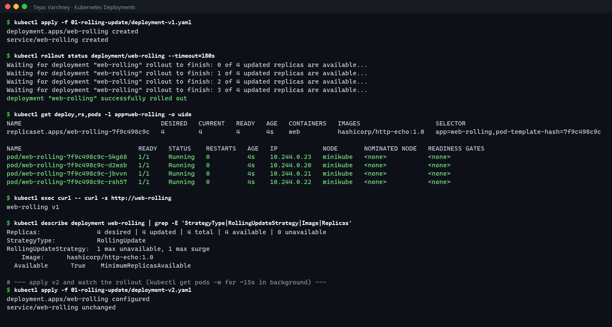
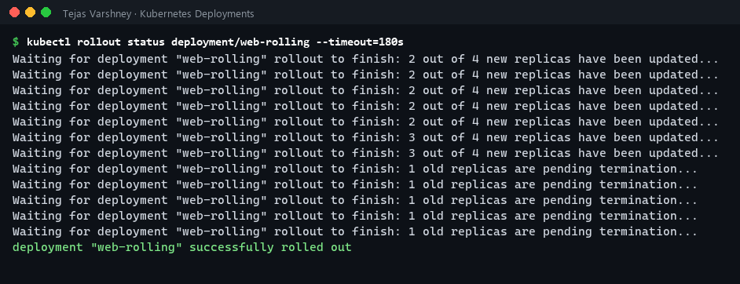
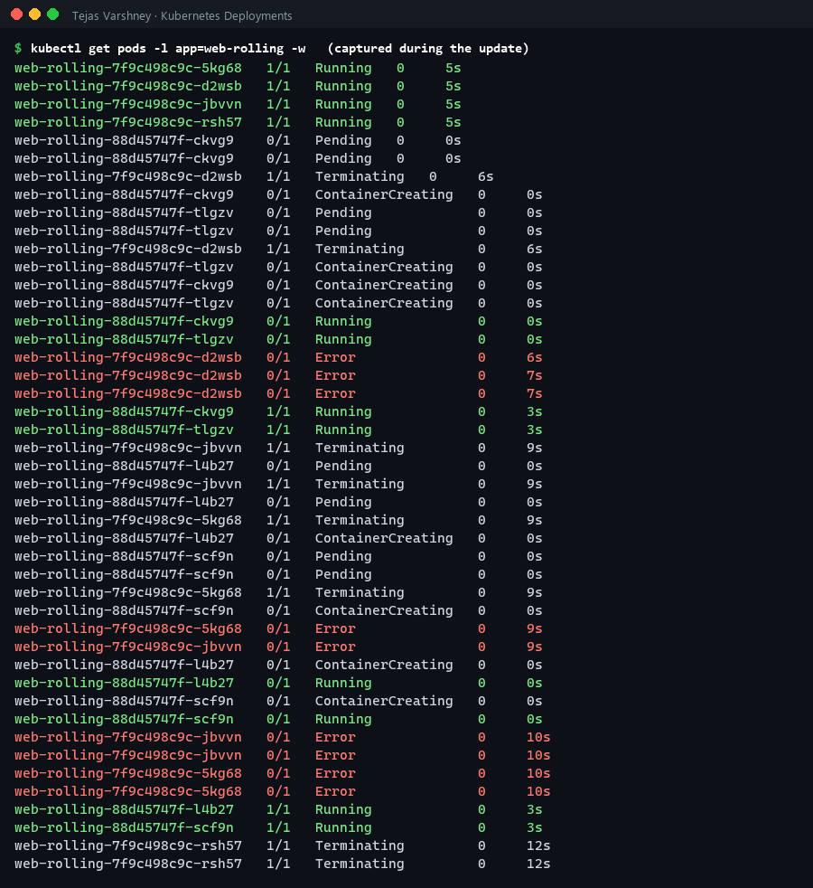
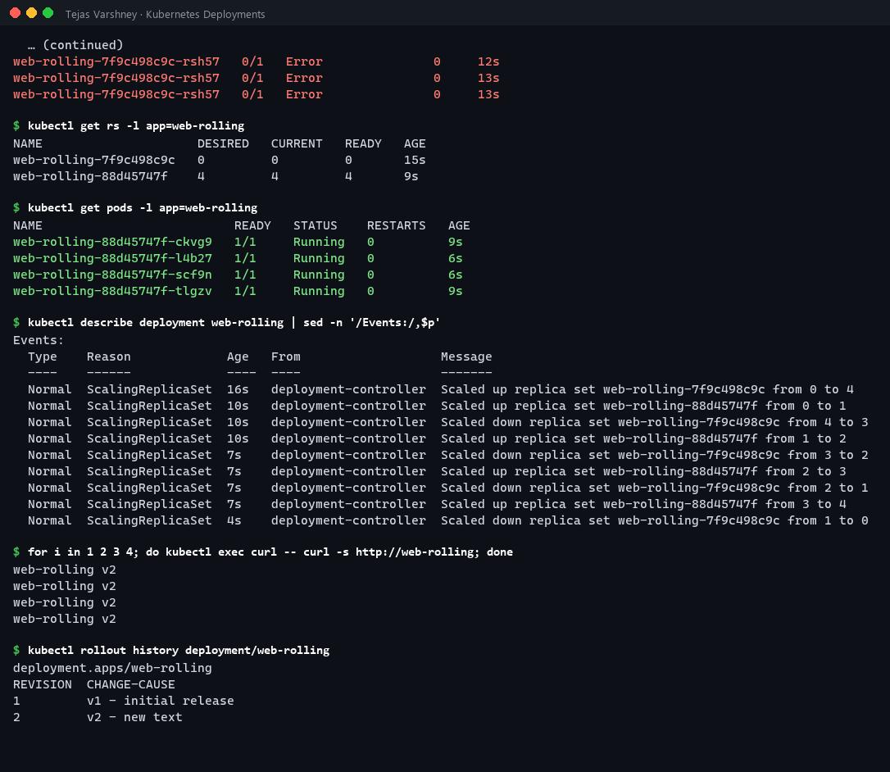
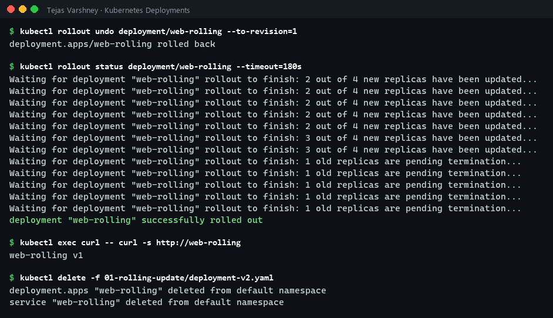

<details><summary>Text output</summary>

```text
$ kubectl apply -f 01-rolling-update/deployment-v1.yaml
deployment.apps/web-rolling created
service/web-rolling created

$ kubectl rollout status deployment/web-rolling --timeout=180s
Waiting for deployment "web-rolling" rollout to finish: 0 of 4 updated replicas are available...
Waiting for deployment "web-rolling" rollout to finish: 1 of 4 updated replicas are available...
Waiting for deployment "web-rolling" rollout to finish: 2 of 4 updated replicas are available...
Waiting for deployment "web-rolling" rollout to finish: 3 of 4 updated replicas are available...
deployment "web-rolling" successfully rolled out

$ kubectl get deploy,rs,pods -l app=web-rolling -o wide
NAME                                     DESIRED   CURRENT   READY   AGE   CONTAINERS   IMAGES                    SELECTOR
replicaset.apps/web-rolling-7f9c498c9c   4         4         4       4s    web          hashicorp/http-echo:1.0   app=web-rolling,pod-template-hash=7f9c498c9c

NAME                               READY   STATUS    RESTARTS   AGE   IP            NODE       NOMINATED NODE   READINESS GATES
pod/web-rolling-7f9c498c9c-5kg68   1/1     Running   0          4s    10.244.0.23   minikube   <none>           <none>
pod/web-rolling-7f9c498c9c-d2wsb   1/1     Running   0          4s    10.244.0.20   minikube   <none>           <none>
pod/web-rolling-7f9c498c9c-jbvvn   1/1     Running   0          4s    10.244.0.21   minikube   <none>           <none>
pod/web-rolling-7f9c498c9c-rsh57   1/1     Running   0          4s    10.244.0.22   minikube   <none>           <none>

$ kubectl exec curl -- curl -s http://web-rolling
web-rolling v1

$ kubectl describe deployment web-rolling | grep -E 'StrategyType|RollingUpdateStrategy|Image|Replicas'
Replicas:               4 desired | 4 updated | 4 total | 4 available | 0 unavailable
StrategyType:           RollingUpdate
RollingUpdateStrategy:  1 max unavailable, 1 max surge
    Image:      hashicorp/http-echo:1.0
  Available      True    MinimumReplicasAvailable

# --- apply v2 and watch the rollout (kubectl get pods -w for ~15s in background) ---
$ kubectl apply -f 01-rolling-update/deployment-v2.yaml
deployment.apps/web-rolling configured
service/web-rolling unchanged

$ kubectl rollout status deployment/web-rolling --timeout=180s
Waiting for deployment "web-rolling" rollout to finish: 2 out of 4 new replicas have been updated...
Waiting for deployment "web-rolling" rollout to finish: 2 out of 4 new replicas have been updated...
Waiting for deployment "web-rolling" rollout to finish: 2 out of 4 new replicas have been updated...
Waiting for deployment "web-rolling" rollout to finish: 2 out of 4 new replicas have been updated...
Waiting for deployment "web-rolling" rollout to finish: 2 out of 4 new replicas have been updated...
Waiting for deployment "web-rolling" rollout to finish: 3 out of 4 new replicas have been updated...
Waiting for deployment "web-rolling" rollout to finish: 3 out of 4 new replicas have been updated...
Waiting for deployment "web-rolling" rollout to finish: 1 old replicas are pending termination...
Waiting for deployment "web-rolling" rollout to finish: 1 old replicas are pending termination...
Waiting for deployment "web-rolling" rollout to finish: 1 old replicas are pending termination...
Waiting for deployment "web-rolling" rollout to finish: 1 old replicas are pending termination...
Waiting for deployment "web-rolling" rollout to finish: 1 old replicas are pending termination...
deployment "web-rolling" successfully rolled out

$ kubectl get pods -l app=web-rolling -w   (captured during the update)
web-rolling-7f9c498c9c-5kg68   1/1   Running   0     5s
web-rolling-7f9c498c9c-d2wsb   1/1   Running   0     5s
web-rolling-7f9c498c9c-jbvvn   1/1   Running   0     5s
web-rolling-7f9c498c9c-rsh57   1/1   Running   0     5s
web-rolling-88d45747f-ckvg9    0/1   Pending   0     0s
web-rolling-88d45747f-ckvg9    0/1   Pending   0     0s
web-rolling-7f9c498c9c-d2wsb   1/1   Terminating   0     6s
web-rolling-88d45747f-ckvg9    0/1   ContainerCreating   0     0s
web-rolling-88d45747f-tlgzv    0/1   Pending             0     0s
web-rolling-88d45747f-tlgzv    0/1   Pending             0     0s
web-rolling-7f9c498c9c-d2wsb   1/1   Terminating         0     6s
web-rolling-88d45747f-tlgzv    0/1   ContainerCreating   0     0s
web-rolling-88d45747f-ckvg9    0/1   ContainerCreating   0     0s
web-rolling-88d45747f-tlgzv    0/1   ContainerCreating   0     0s
web-rolling-88d45747f-ckvg9    0/1   Running             0     0s
web-rolling-88d45747f-tlgzv    0/1   Running             0     0s
web-rolling-7f9c498c9c-d2wsb   0/1   Error               0     6s
web-rolling-7f9c498c9c-d2wsb   0/1   Error               0     7s
web-rolling-7f9c498c9c-d2wsb   0/1   Error               0     7s
web-rolling-88d45747f-ckvg9    1/1   Running             0     3s
web-rolling-88d45747f-tlgzv    1/1   Running             0     3s
web-rolling-7f9c498c9c-jbvvn   1/1   Terminating         0     9s
web-rolling-88d45747f-l4b27    0/1   Pending             0     0s
web-rolling-7f9c498c9c-jbvvn   1/1   Terminating         0     9s
web-rolling-88d45747f-l4b27    0/1   Pending             0     0s
web-rolling-7f9c498c9c-5kg68   1/1   Terminating         0     9s
web-rolling-88d45747f-l4b27    0/1   ContainerCreating   0     0s
web-rolling-88d45747f-scf9n    0/1   Pending             0     0s
web-rolling-88d45747f-scf9n    0/1   Pending             0     0s
web-rolling-7f9c498c9c-5kg68   1/1   Terminating         0     9s
web-rolling-88d45747f-scf9n    0/1   ContainerCreating   0     0s
web-rolling-7f9c498c9c-5kg68   0/1   Error               0     9s
web-rolling-7f9c498c9c-jbvvn   0/1   Error               0     9s
web-rolling-88d45747f-l4b27    0/1   ContainerCreating   0     0s
web-rolling-88d45747f-l4b27    0/1   Running             0     0s
web-rolling-88d45747f-scf9n    0/1   ContainerCreating   0     0s
web-rolling-88d45747f-scf9n    0/1   Running             0     0s
web-rolling-7f9c498c9c-jbvvn   0/1   Error               0     10s
web-rolling-7f9c498c9c-jbvvn   0/1   Error               0     10s
web-rolling-7f9c498c9c-5kg68   0/1   Error               0     10s
web-rolling-7f9c498c9c-5kg68   0/1   Error               0     10s
web-rolling-88d45747f-l4b27    1/1   Running             0     3s
web-rolling-88d45747f-scf9n    1/1   Running             0     3s
web-rolling-7f9c498c9c-rsh57   1/1   Terminating         0     12s
web-rolling-7f9c498c9c-rsh57   1/1   Terminating         0     12s
web-rolling-7f9c498c9c-rsh57   0/1   Error               0     12s
web-rolling-7f9c498c9c-rsh57   0/1   Error               0     13s
web-rolling-7f9c498c9c-rsh57   0/1   Error               0     13s

$ kubectl get rs -l app=web-rolling
NAME                     DESIRED   CURRENT   READY   AGE
web-rolling-7f9c498c9c   0         0         0       15s
web-rolling-88d45747f    4         4         4       9s

$ kubectl get pods -l app=web-rolling
NAME                          READY   STATUS    RESTARTS   AGE
web-rolling-88d45747f-ckvg9   1/1     Running   0          9s
web-rolling-88d45747f-l4b27   1/1     Running   0          6s
web-rolling-88d45747f-scf9n   1/1     Running   0          6s
web-rolling-88d45747f-tlgzv   1/1     Running   0          9s

$ kubectl describe deployment web-rolling | sed -n '/Events:/,$p'
Events:
  Type    Reason             Age   From                   Message
  ----    ------             ----  ----                   -------
  Normal  ScalingReplicaSet  16s   deployment-controller  Scaled up replica set web-rolling-7f9c498c9c from 0 to 4
  Normal  ScalingReplicaSet  10s   deployment-controller  Scaled up replica set web-rolling-88d45747f from 0 to 1
  Normal  ScalingReplicaSet  10s   deployment-controller  Scaled down replica set web-rolling-7f9c498c9c from 4 to 3
  Normal  ScalingReplicaSet  10s   deployment-controller  Scaled up replica set web-rolling-88d45747f from 1 to 2
  Normal  ScalingReplicaSet  7s    deployment-controller  Scaled down replica set web-rolling-7f9c498c9c from 3 to 2
  Normal  ScalingReplicaSet  7s    deployment-controller  Scaled up replica set web-rolling-88d45747f from 2 to 3
  Normal  ScalingReplicaSet  7s    deployment-controller  Scaled down replica set web-rolling-7f9c498c9c from 2 to 1
  Normal  ScalingReplicaSet  7s    deployment-controller  Scaled up replica set web-rolling-88d45747f from 3 to 4
  Normal  ScalingReplicaSet  4s    deployment-controller  Scaled down replica set web-rolling-7f9c498c9c from 1 to 0

$ for i in 1 2 3 4; do kubectl exec curl -- curl -s http://web-rolling; done
web-rolling v2
web-rolling v2
web-rolling v2
web-rolling v2

$ kubectl rollout history deployment/web-rolling
deployment.apps/web-rolling 
REVISION  CHANGE-CAUSE
1         v1 - initial release
2         v2 - new text


$ kubectl rollout undo deployment/web-rolling --to-revision=1
deployment.apps/web-rolling rolled back

$ kubectl rollout status deployment/web-rolling --timeout=180s
Waiting for deployment "web-rolling" rollout to finish: 2 out of 4 new replicas have been updated...
Waiting for deployment "web-rolling" rollout to finish: 2 out of 4 new replicas have been updated...
Waiting for deployment "web-rolling" rollout to finish: 2 out of 4 new replicas have been updated...
Waiting for deployment "web-rolling" rollout to finish: 2 out of 4 new replicas have been updated...
Waiting for deployment "web-rolling" rollout to finish: 2 out of 4 new replicas have been updated...
Waiting for deployment "web-rolling" rollout to finish: 3 out of 4 new replicas have been updated...
Waiting for deployment "web-rolling" rollout to finish: 3 out of 4 new replicas have been updated...
Waiting for deployment "web-rolling" rollout to finish: 1 old replicas are pending termination...
Waiting for deployment "web-rolling" rollout to finish: 1 old replicas are pending termination...
Waiting for deployment "web-rolling" rollout to finish: 1 old replicas are pending termination...
Waiting for deployment "web-rolling" rollout to finish: 1 old replicas are pending termination...
Waiting for deployment "web-rolling" rollout to finish: 1 old replicas are pending termination...
deployment "web-rolling" successfully rolled out

$ kubectl exec curl -- curl -s http://web-rolling
web-rolling v1

$ kubectl delete -f 01-rolling-update/deployment-v2.yaml
deployment.apps "web-rolling" deleted from default namespace
service "web-rolling" deleted from default namespace
```

</details>

**Observations**
- The Deployment created ReplicaSet `7f9c498c9c` (v1). Applying v2 created a **second ReplicaSet** `88d45747f`. The controller then scaled the new one up and the old one down **one Pod at a time** (`maxSurge: 1` / `maxUnavailable: 1`), as the `ScalingReplicaSet` events show.
- In the watch output, new Pods become `1/1 Running` (readiness probe passed) before the next old Pods are terminated, so there are always at least 3 Pods serving.
- After the update, the old ReplicaSet stays at `DESIRED 0`. It is kept so `kubectl rollout undo` can scale it back up, and the rollback to revision 1 returned `web-rolling v1` again.
- Old Pods show `Error` while terminating because `http-echo` exits with a non-zero code on SIGTERM. That's normal for this image, not a failure of the rollout.

## 02. Blue-Green Deployment

```bash
kubectl apply -f 02-blue-green/blue.yaml -f 02-blue-green/service.yaml   # live = blue
kubectl apply -f 02-blue-green/green.yaml                                # green idle
kubectl patch service web-bg -p '{"spec":{"selector":{"app":"web-bg","version":"green"}}}'
```

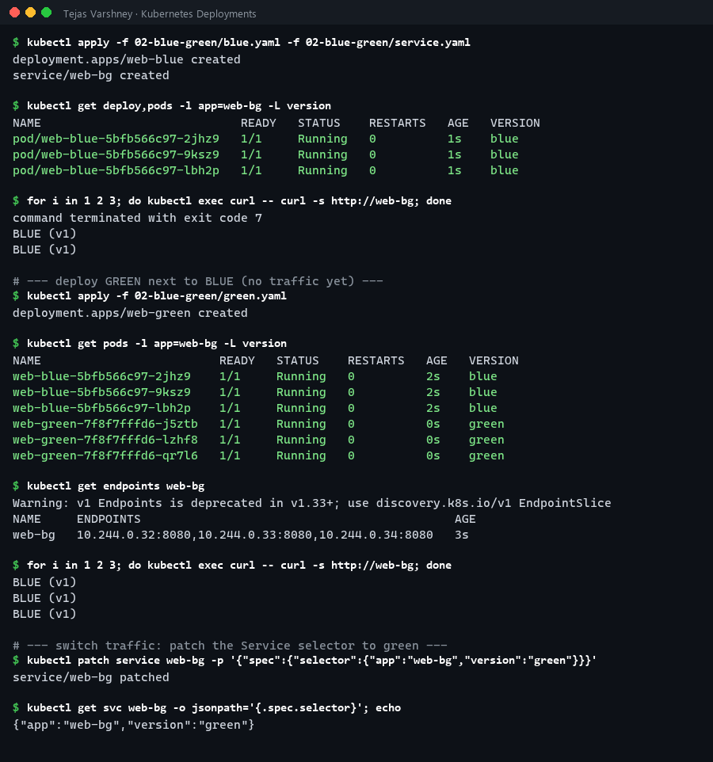
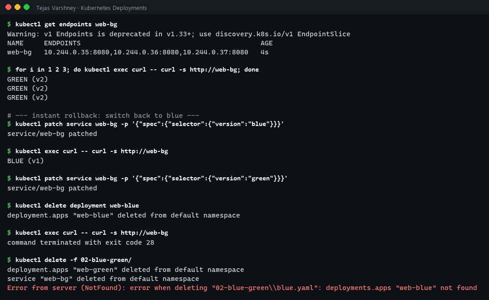

<details><summary>Text output</summary>

```text
$ kubectl apply -f 02-blue-green/blue.yaml -f 02-blue-green/service.yaml
deployment.apps/web-blue created
service/web-bg created

$ kubectl get deploy,pods -l app=web-bg -L version
NAME                            READY   STATUS    RESTARTS   AGE   VERSION
pod/web-blue-5bfb566c97-2jhz9   1/1     Running   0          1s    blue
pod/web-blue-5bfb566c97-9ksz9   1/1     Running   0          1s    blue
pod/web-blue-5bfb566c97-lbh2p   1/1     Running   0          1s    blue

$ for i in 1 2 3; do kubectl exec curl -- curl -s http://web-bg; done
command terminated with exit code 7
BLUE (v1)
BLUE (v1)

# --- deploy GREEN next to BLUE (no traffic yet) ---
$ kubectl apply -f 02-blue-green/green.yaml
deployment.apps/web-green created

$ kubectl get pods -l app=web-bg -L version
NAME                         READY   STATUS    RESTARTS   AGE   VERSION
web-blue-5bfb566c97-2jhz9    1/1     Running   0          2s    blue
web-blue-5bfb566c97-9ksz9    1/1     Running   0          2s    blue
web-blue-5bfb566c97-lbh2p    1/1     Running   0          2s    blue
web-green-7f8f7fffd6-j5ztb   1/1     Running   0          0s    green
web-green-7f8f7fffd6-lzhf8   1/1     Running   0          0s    green
web-green-7f8f7fffd6-qr7l6   1/1     Running   0          0s    green

$ kubectl get endpoints web-bg
Warning: v1 Endpoints is deprecated in v1.33+; use discovery.k8s.io/v1 EndpointSlice
NAME     ENDPOINTS                                            AGE
web-bg   10.244.0.32:8080,10.244.0.33:8080,10.244.0.34:8080   3s

$ for i in 1 2 3; do kubectl exec curl -- curl -s http://web-bg; done
BLUE (v1)
BLUE (v1)
BLUE (v1)

# --- switch traffic: patch the Service selector to green ---
$ kubectl patch service web-bg -p '{"spec":{"selector":{"app":"web-bg","version":"green"}}}'
service/web-bg patched

$ kubectl get svc web-bg -o jsonpath='{.spec.selector}'; echo
{"app":"web-bg","version":"green"}

$ kubectl get endpoints web-bg
Warning: v1 Endpoints is deprecated in v1.33+; use discovery.k8s.io/v1 EndpointSlice
NAME     ENDPOINTS                                            AGE
web-bg   10.244.0.35:8080,10.244.0.36:8080,10.244.0.37:8080   4s

$ for i in 1 2 3; do kubectl exec curl -- curl -s http://web-bg; done
GREEN (v2)
GREEN (v2)
GREEN (v2)

# --- instant rollback: switch back to blue ---
$ kubectl patch service web-bg -p '{"spec":{"selector":{"version":"blue"}}}'
service/web-bg patched

$ kubectl exec curl -- curl -s http://web-bg
BLUE (v1)

$ kubectl patch service web-bg -p '{"spec":{"selector":{"version":"green"}}}'
service/web-bg patched

$ kubectl delete deployment web-blue
deployment.apps "web-blue" deleted from default namespace

$ kubectl exec curl -- curl -s http://web-bg
command terminated with exit code 28

$ kubectl delete -f 02-blue-green/
deployment.apps "web-green" deleted from default namespace
service "web-bg" deleted from default namespace
Error from server (NotFound): error when deleting "02-blue-green\\blue.yaml": deployments.apps "web-blue" not found
```

</details>

**Observations**
- Blue and green run **at the same time** as two complete Deployments (3 + 3 Pods). The Service selector `version: blue|green` is the only thing that decides which set receives traffic.
- After the patch, the Service endpoints changed to the green Pod IPs and **100% of requests** returned `GREEN (v2)` immediately. There was no mixed-version period.
- Rollback is the same one-line patch back to `blue`, and it is instant because the blue Pods are still running.
- Trade-off: you need double the resources during the switch.

## 03. Canary Deployment

```bash
kubectl apply -f 03-canary/stable.yaml -f 03-canary/service.yaml   # 9 stable replicas
kubectl apply -f 03-canary/canary.yaml                             # 1 canary replica
```

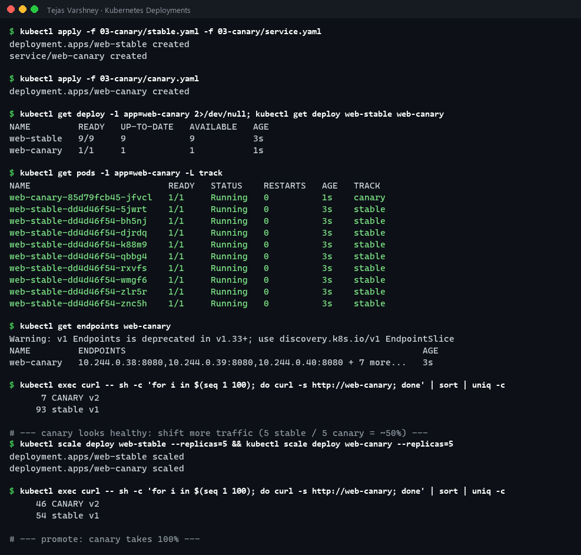
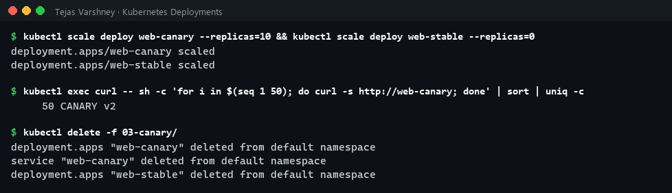

<details><summary>Text output</summary>

```text
$ kubectl apply -f 03-canary/stable.yaml -f 03-canary/service.yaml
deployment.apps/web-stable created
service/web-canary created

$ kubectl apply -f 03-canary/canary.yaml
deployment.apps/web-canary created

$ kubectl get deploy -l app=web-canary 2>/dev/null; kubectl get deploy web-stable web-canary
NAME         READY   UP-TO-DATE   AVAILABLE   AGE
web-stable   9/9     9            9           3s
web-canary   1/1     1            1           1s

$ kubectl get pods -l app=web-canary -L track
NAME                          READY   STATUS    RESTARTS   AGE   TRACK
web-canary-85d79fcb45-jfvcl   1/1     Running   0          1s    canary
web-stable-dd4d46f54-5jwrt    1/1     Running   0          3s    stable
web-stable-dd4d46f54-bh5nj    1/1     Running   0          3s    stable
web-stable-dd4d46f54-djrdq    1/1     Running   0          3s    stable
web-stable-dd4d46f54-k88m9    1/1     Running   0          3s    stable
web-stable-dd4d46f54-qbbg4    1/1     Running   0          3s    stable
web-stable-dd4d46f54-rxvfs    1/1     Running   0          3s    stable
web-stable-dd4d46f54-wmgf6    1/1     Running   0          3s    stable
web-stable-dd4d46f54-zlr5r    1/1     Running   0          3s    stable
web-stable-dd4d46f54-znc5h    1/1     Running   0          3s    stable

$ kubectl get endpoints web-canary
Warning: v1 Endpoints is deprecated in v1.33+; use discovery.k8s.io/v1 EndpointSlice
NAME         ENDPOINTS                                                        AGE
web-canary   10.244.0.38:8080,10.244.0.39:8080,10.244.0.40:8080 + 7 more...   3s

$ kubectl exec curl -- sh -c 'for i in $(seq 1 100); do curl -s http://web-canary; done' | sort | uniq -c
      7 CANARY v2
     93 stable v1

# --- canary looks healthy: shift more traffic (5 stable / 5 canary = ~50%) ---
$ kubectl scale deploy web-stable --replicas=5 && kubectl scale deploy web-canary --replicas=5
deployment.apps/web-stable scaled
deployment.apps/web-canary scaled

$ kubectl exec curl -- sh -c 'for i in $(seq 1 100); do curl -s http://web-canary; done' | sort | uniq -c
     46 CANARY v2
     54 stable v1

# --- promote: canary takes 100% ---
$ kubectl scale deploy web-canary --replicas=10 && kubectl scale deploy web-stable --replicas=0
deployment.apps/web-canary scaled
deployment.apps/web-stable scaled

$ kubectl exec curl -- sh -c 'for i in $(seq 1 50); do curl -s http://web-canary; done' | sort | uniq -c
     50 CANARY v2

$ kubectl delete -f 03-canary/
deployment.apps "web-canary" deleted from default namespace
service "web-canary" deleted from default namespace
deployment.apps "web-stable" deleted from default namespace
```

</details>

**Observations**
- The Service selects only `app: web-canary`, so it load-balances across **all 10 Pods** of both Deployments. With 9 stable + 1 canary, **7 of 100** requests reached the canary (about 10%, as expected from the replica ratio).
- Scaling to 5/5 shifted traffic to about 50% (46 canary / 54 stable). Scaling stable to 0 promoted the canary to 100%.
- Plain Kubernetes Services can only split traffic by Pod count. For exact percentages (e.g. 1%) or header-based routing, you'd use an ingress-nginx canary annotation, Argo Rollouts, or a service mesh such as Istio.

## 04. Recreate Deployment

```bash
kubectl apply -f 04-recreate/deployment-v1.yaml
kubectl apply -f 04-recreate/deployment-v2.yaml
```

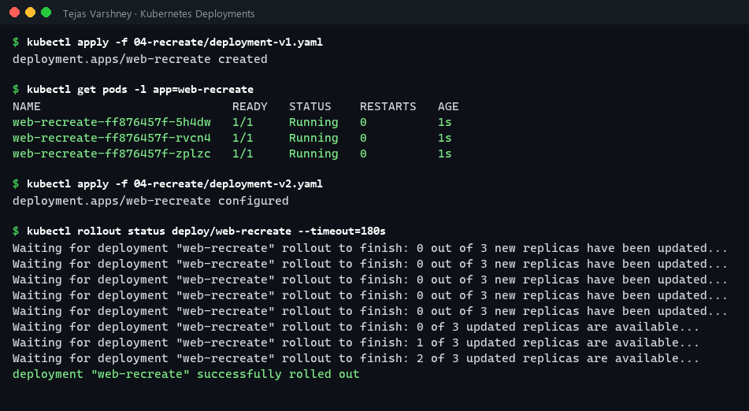
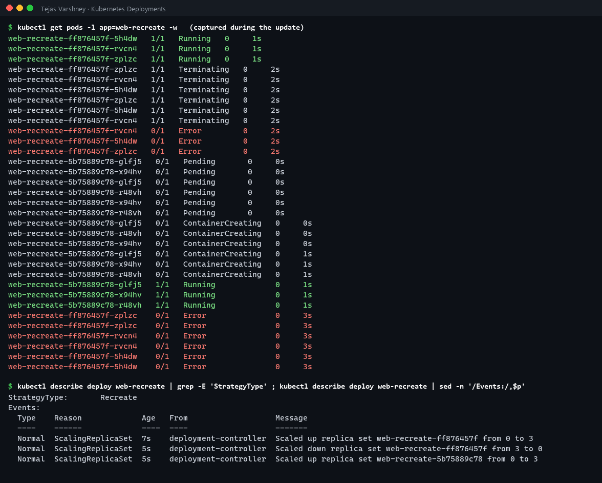
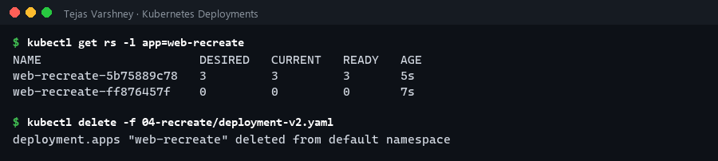

<details><summary>Text output</summary>

```text
$ kubectl apply -f 04-recreate/deployment-v1.yaml
deployment.apps/web-recreate created

$ kubectl get pods -l app=web-recreate
NAME                           READY   STATUS    RESTARTS   AGE
web-recreate-ff876457f-5h4dw   1/1     Running   0          1s
web-recreate-ff876457f-rvcn4   1/1     Running   0          1s
web-recreate-ff876457f-zplzc   1/1     Running   0          1s

$ kubectl apply -f 04-recreate/deployment-v2.yaml
deployment.apps/web-recreate configured

$ kubectl rollout status deploy/web-recreate --timeout=180s
Waiting for deployment "web-recreate" rollout to finish: 0 out of 3 new replicas have been updated...
Waiting for deployment "web-recreate" rollout to finish: 0 out of 3 new replicas have been updated...
Waiting for deployment "web-recreate" rollout to finish: 0 out of 3 new replicas have been updated...
Waiting for deployment "web-recreate" rollout to finish: 0 out of 3 new replicas have been updated...
Waiting for deployment "web-recreate" rollout to finish: 0 out of 3 new replicas have been updated...
Waiting for deployment "web-recreate" rollout to finish: 0 of 3 updated replicas are available...
Waiting for deployment "web-recreate" rollout to finish: 1 of 3 updated replicas are available...
Waiting for deployment "web-recreate" rollout to finish: 2 of 3 updated replicas are available...
deployment "web-recreate" successfully rolled out

$ kubectl get pods -l app=web-recreate -w   (captured during the update)
web-recreate-ff876457f-5h4dw   1/1   Running   0     1s
web-recreate-ff876457f-rvcn4   1/1   Running   0     1s
web-recreate-ff876457f-zplzc   1/1   Running   0     1s
web-recreate-ff876457f-zplzc   1/1   Terminating   0     2s
web-recreate-ff876457f-rvcn4   1/1   Terminating   0     2s
web-recreate-ff876457f-5h4dw   1/1   Terminating   0     2s
web-recreate-ff876457f-zplzc   1/1   Terminating   0     2s
web-recreate-ff876457f-5h4dw   1/1   Terminating   0     2s
web-recreate-ff876457f-rvcn4   1/1   Terminating   0     2s
web-recreate-ff876457f-rvcn4   0/1   Error         0     2s
web-recreate-ff876457f-5h4dw   0/1   Error         0     2s
web-recreate-ff876457f-zplzc   0/1   Error         0     2s
web-recreate-5b75889c78-glfj5   0/1   Pending       0     0s
web-recreate-5b75889c78-x94hv   0/1   Pending       0     0s
web-recreate-5b75889c78-glfj5   0/1   Pending       0     0s
web-recreate-5b75889c78-r48vh   0/1   Pending       0     0s
web-recreate-5b75889c78-x94hv   0/1   Pending       0     0s
web-recreate-5b75889c78-r48vh   0/1   Pending       0     0s
web-recreate-5b75889c78-glfj5   0/1   ContainerCreating   0     0s
web-recreate-5b75889c78-r48vh   0/1   ContainerCreating   0     0s
web-recreate-5b75889c78-x94hv   0/1   ContainerCreating   0     0s
web-recreate-5b75889c78-glfj5   0/1   ContainerCreating   0     1s
web-recreate-5b75889c78-x94hv   0/1   ContainerCreating   0     1s
web-recreate-5b75889c78-r48vh   0/1   ContainerCreating   0     1s
web-recreate-5b75889c78-glfj5   1/1   Running             0     1s
web-recreate-5b75889c78-x94hv   1/1   Running             0     1s
web-recreate-5b75889c78-r48vh   1/1   Running             0     1s
web-recreate-ff876457f-zplzc    0/1   Error               0     3s
web-recreate-ff876457f-zplzc    0/1   Error               0     3s
web-recreate-ff876457f-rvcn4    0/1   Error               0     3s
web-recreate-ff876457f-rvcn4    0/1   Error               0     3s
web-recreate-ff876457f-5h4dw    0/1   Error               0     3s
web-recreate-ff876457f-5h4dw    0/1   Error               0     3s

$ kubectl describe deploy web-recreate | grep -E 'StrategyType' ; kubectl describe deploy web-recreate | sed -n '/Events:/,$p'
StrategyType:       Recreate
Events:
  Type    Reason             Age   From                   Message
  ----    ------             ----  ----                   -------
  Normal  ScalingReplicaSet  7s    deployment-controller  Scaled up replica set web-recreate-ff876457f from 0 to 3
  Normal  ScalingReplicaSet  5s    deployment-controller  Scaled down replica set web-recreate-ff876457f from 3 to 0
  Normal  ScalingReplicaSet  5s    deployment-controller  Scaled up replica set web-recreate-5b75889c78 from 0 to 3

$ kubectl get rs -l app=web-recreate
NAME                      DESIRED   CURRENT   READY   AGE
web-recreate-5b75889c78   3         3         3       5s
web-recreate-ff876457f    0         0         0       7s

$ kubectl delete -f 04-recreate/deployment-v2.yaml
deployment.apps "web-recreate" deleted from default namespace
```

</details>

**Observations**
- With `strategy.type: Recreate`, the events show the old ReplicaSet scaled **3 → 0 first**, then the new ReplicaSet scaled **0 → 3**.
- In the watch output, **all three** old Pods are `Terminating` before any new Pod appears as `Pending`. During that gap the application had zero Pods, so it was **down**.
- This is useful when two versions must never run together (e.g. an incompatible database schema, or a single-writer volume). Otherwise, prefer RollingUpdate.

### Strategy comparison

| Strategy | Downtime | Extra resources | Rollback speed | Mixed versions live? |
|---|---|---|---|---|
| Rolling Update | None | +maxSurge Pods | Medium (`rollout undo`) | Yes, briefly |
| Blue-Green | None | 2× during switch | Instant (selector switch) | No |
| Canary | None | Small (canary Pods) | Fast (scale canary to 0) | Yes, on purpose |
| Recreate | **Yes** | None | Slow (redeploy) | No |

---

# Task 2 – Pod lifecycle

The 12 YAML files are in [05-pod-lifecycle](05-pod-lifecycle). I applied them all at once and inspected each Pod after about a minute. My earlier screenshots of the same exercise are in [../pod-lifecycle](../pod-lifecycle/README.md).

```bash
kubectl apply -f 05-pod-lifecycle/
kubectl get pods -o wide
kubectl describe pod <name>
kubectl logs <name>
```

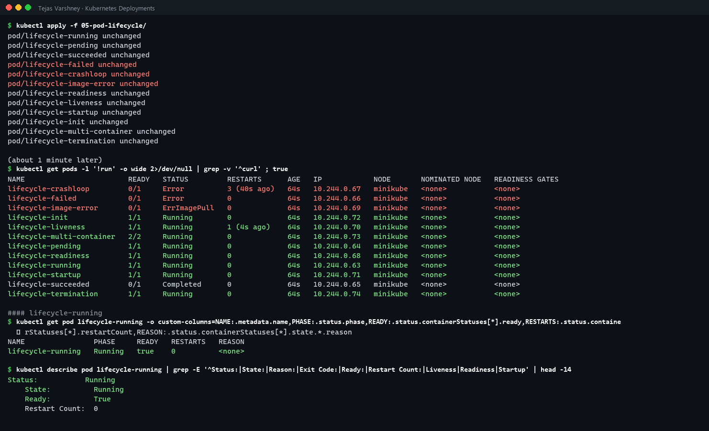
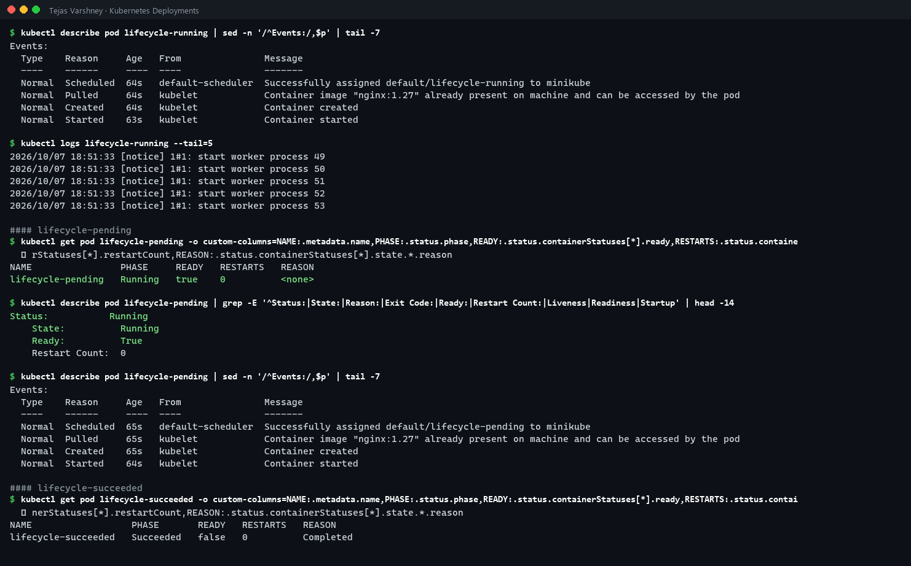
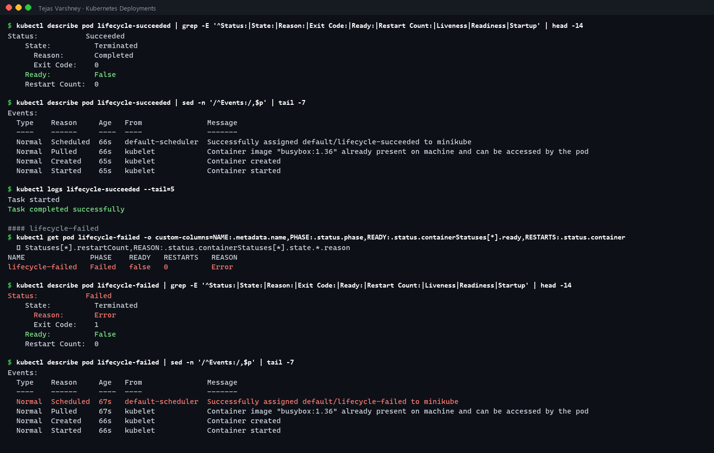
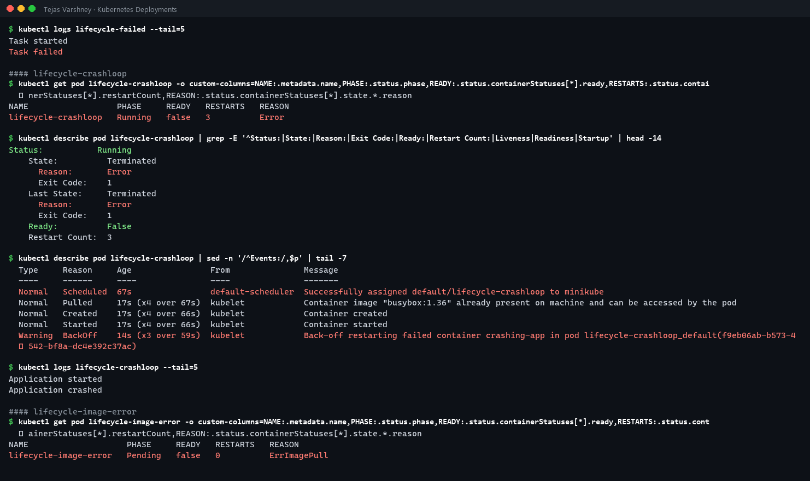
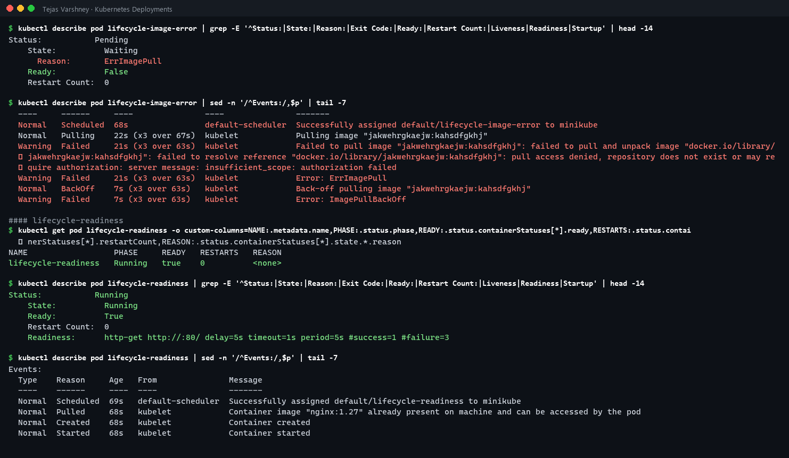
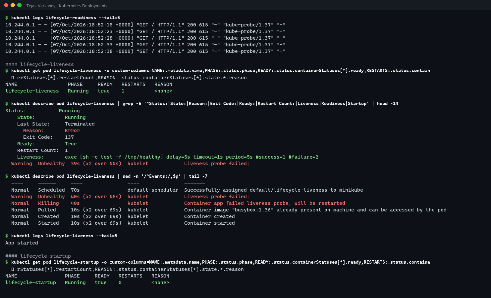
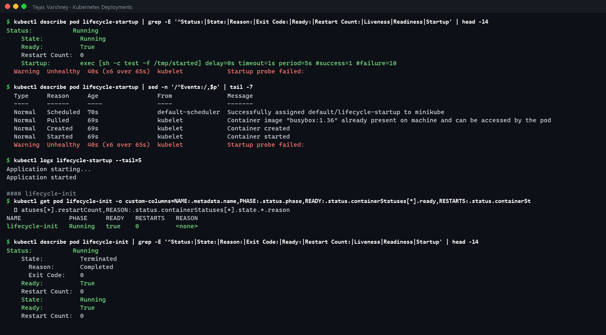
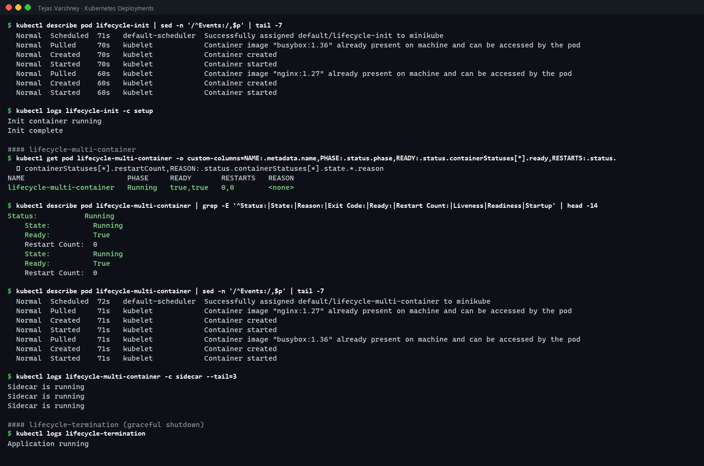
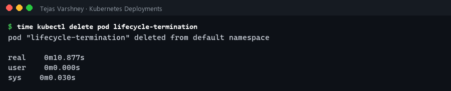

<details><summary>Text output</summary>

```text
$ kubectl apply -f 05-pod-lifecycle/
pod/lifecycle-running unchanged
pod/lifecycle-pending unchanged
pod/lifecycle-succeeded unchanged
pod/lifecycle-failed unchanged
pod/lifecycle-crashloop unchanged
pod/lifecycle-image-error unchanged
pod/lifecycle-readiness unchanged
pod/lifecycle-liveness unchanged
pod/lifecycle-startup unchanged
pod/lifecycle-init unchanged
pod/lifecycle-multi-container unchanged
pod/lifecycle-termination unchanged

(about 1 minute later)
$ kubectl get pods -l '!run' -o wide 2>/dev/null | grep -v '^curl' ; true
NAME                        READY   STATUS         RESTARTS      AGE   IP            NODE       NOMINATED NODE   READINESS GATES
lifecycle-crashloop         0/1     Error          3 (40s ago)   64s   10.244.0.67   minikube   <none>           <none>
lifecycle-failed            0/1     Error          0             64s   10.244.0.66   minikube   <none>           <none>
lifecycle-image-error       0/1     ErrImagePull   0             64s   10.244.0.69   minikube   <none>           <none>
lifecycle-init              1/1     Running        0             64s   10.244.0.72   minikube   <none>           <none>
lifecycle-liveness          1/1     Running        1 (4s ago)    64s   10.244.0.70   minikube   <none>           <none>
lifecycle-multi-container   2/2     Running        0             64s   10.244.0.73   minikube   <none>           <none>
lifecycle-pending           1/1     Running        0             64s   10.244.0.64   minikube   <none>           <none>
lifecycle-readiness         1/1     Running        0             64s   10.244.0.68   minikube   <none>           <none>
lifecycle-running           1/1     Running        0             64s   10.244.0.63   minikube   <none>           <none>
lifecycle-startup           1/1     Running        0             64s   10.244.0.71   minikube   <none>           <none>
lifecycle-succeeded         0/1     Completed      0             64s   10.244.0.65   minikube   <none>           <none>
lifecycle-termination       1/1     Running        0             64s   10.244.0.74   minikube   <none>           <none>

#### lifecycle-running
$ kubectl get pod lifecycle-running -o custom-columns=NAME:.metadata.name,PHASE:.status.phase,READY:.status.containerStatuses[*].ready,RESTARTS:.status.containerStatuses[*].restartCount,REASON:.status.containerStatuses[*].state.*.reason
NAME                PHASE     READY   RESTARTS   REASON
lifecycle-running   Running   true    0          <none>

$ kubectl describe pod lifecycle-running | grep -E '^Status:|State:|Reason:|Exit Code:|Ready:|Restart Count:|Liveness|Readiness|Startup' | head -14
Status:           Running
    State:          Running
    Ready:          True
    Restart Count:  0

$ kubectl describe pod lifecycle-running | sed -n '/^Events:/,$p' | tail -7
Events:
  Type    Reason     Age   From               Message
  ----    ------     ----  ----               -------
  Normal  Scheduled  64s   default-scheduler  Successfully assigned default/lifecycle-running to minikube
  Normal  Pulled     64s   kubelet            Container image "nginx:1.27" already present on machine and can be accessed by the pod
  Normal  Created    64s   kubelet            Container created
  Normal  Started    63s   kubelet            Container started

$ kubectl logs lifecycle-running --tail=5
2026/10/07 18:51:33 [notice] 1#1: start worker process 49
2026/10/07 18:51:33 [notice] 1#1: start worker process 50
2026/10/07 18:51:33 [notice] 1#1: start worker process 51
2026/10/07 18:51:33 [notice] 1#1: start worker process 52
2026/10/07 18:51:33 [notice] 1#1: start worker process 53

#### lifecycle-pending
$ kubectl get pod lifecycle-pending -o custom-columns=NAME:.metadata.name,PHASE:.status.phase,READY:.status.containerStatuses[*].ready,RESTARTS:.status.containerStatuses[*].restartCount,REASON:.status.containerStatuses[*].state.*.reason
NAME                PHASE     READY   RESTARTS   REASON
lifecycle-pending   Running   true    0          <none>

$ kubectl describe pod lifecycle-pending | grep -E '^Status:|State:|Reason:|Exit Code:|Ready:|Restart Count:|Liveness|Readiness|Startup' | head -14
Status:           Running
    State:          Running
    Ready:          True
    Restart Count:  0

$ kubectl describe pod lifecycle-pending | sed -n '/^Events:/,$p' | tail -7
Events:
  Type    Reason     Age   From               Message
  ----    ------     ----  ----               -------
  Normal  Scheduled  65s   default-scheduler  Successfully assigned default/lifecycle-pending to minikube
  Normal  Pulled     65s   kubelet            Container image "nginx:1.27" already present on machine and can be accessed by the pod
  Normal  Created    65s   kubelet            Container created
  Normal  Started    64s   kubelet            Container started

#### lifecycle-succeeded
$ kubectl get pod lifecycle-succeeded -o custom-columns=NAME:.metadata.name,PHASE:.status.phase,READY:.status.containerStatuses[*].ready,RESTARTS:.status.containerStatuses[*].restartCount,REASON:.status.containerStatuses[*].state.*.reason
NAME                  PHASE       READY   RESTARTS   REASON
lifecycle-succeeded   Succeeded   false   0          Completed

$ kubectl describe pod lifecycle-succeeded | grep -E '^Status:|State:|Reason:|Exit Code:|Ready:|Restart Count:|Liveness|Readiness|Startup' | head -14
Status:           Succeeded
    State:          Terminated
      Reason:       Completed
      Exit Code:    0
    Ready:          False
    Restart Count:  0

$ kubectl describe pod lifecycle-succeeded | sed -n '/^Events:/,$p' | tail -7
Events:
  Type    Reason     Age   From               Message
  ----    ------     ----  ----               -------
  Normal  Scheduled  66s   default-scheduler  Successfully assigned default/lifecycle-succeeded to minikube
  Normal  Pulled     66s   kubelet            Container image "busybox:1.36" already present on machine and can be accessed by the pod
  Normal  Created    65s   kubelet            Container created
  Normal  Started    65s   kubelet            Container started

$ kubectl logs lifecycle-succeeded --tail=5
Task started
Task completed successfully

#### lifecycle-failed
$ kubectl get pod lifecycle-failed -o custom-columns=NAME:.metadata.name,PHASE:.status.phase,READY:.status.containerStatuses[*].ready,RESTARTS:.status.containerStatuses[*].restartCount,REASON:.status.containerStatuses[*].state.*.reason
NAME               PHASE    READY   RESTARTS   REASON
lifecycle-failed   Failed   false   0          Error

$ kubectl describe pod lifecycle-failed | grep -E '^Status:|State:|Reason:|Exit Code:|Ready:|Restart Count:|Liveness|Readiness|Startup' | head -14
Status:           Failed
    State:          Terminated
      Reason:       Error
      Exit Code:    1
    Ready:          False
    Restart Count:  0

$ kubectl describe pod lifecycle-failed | sed -n '/^Events:/,$p' | tail -7
Events:
  Type    Reason     Age   From               Message
  ----    ------     ----  ----               -------
  Normal  Scheduled  67s   default-scheduler  Successfully assigned default/lifecycle-failed to minikube
  Normal  Pulled     67s   kubelet            Container image "busybox:1.36" already present on machine and can be accessed by the pod
  Normal  Created    66s   kubelet            Container created
  Normal  Started    66s   kubelet            Container started

$ kubectl logs lifecycle-failed --tail=5
Task started
Task failed

#### lifecycle-crashloop
$ kubectl get pod lifecycle-crashloop -o custom-columns=NAME:.metadata.name,PHASE:.status.phase,READY:.status.containerStatuses[*].ready,RESTARTS:.status.containerStatuses[*].restartCount,REASON:.status.containerStatuses[*].state.*.reason
NAME                  PHASE     READY   RESTARTS   REASON
lifecycle-crashloop   Running   false   3          Error

$ kubectl describe pod lifecycle-crashloop | grep -E '^Status:|State:|Reason:|Exit Code:|Ready:|Restart Count:|Liveness|Readiness|Startup' | head -14
Status:           Running
    State:          Terminated
      Reason:       Error
      Exit Code:    1
    Last State:     Terminated
      Reason:       Error
      Exit Code:    1
    Ready:          False
    Restart Count:  3

$ kubectl describe pod lifecycle-crashloop | sed -n '/^Events:/,$p' | tail -7
  Type     Reason     Age                From               Message
  ----     ------     ----               ----               -------
  Normal   Scheduled  67s                default-scheduler  Successfully assigned default/lifecycle-crashloop to minikube
  Normal   Pulled     17s (x4 over 67s)  kubelet            Container image "busybox:1.36" already present on machine and can be accessed by the pod
  Normal   Created    17s (x4 over 66s)  kubelet            Container created
  Normal   Started    17s (x4 over 66s)  kubelet            Container started
  Warning  BackOff    14s (x3 over 59s)  kubelet            Back-off restarting failed container crashing-app in pod lifecycle-crashloop_default(f9eb06ab-b573-4542-bf8a-dc4e392c37ac)

$ kubectl logs lifecycle-crashloop --tail=5
Application started
Application crashed

#### lifecycle-image-error
$ kubectl get pod lifecycle-image-error -o custom-columns=NAME:.metadata.name,PHASE:.status.phase,READY:.status.containerStatuses[*].ready,RESTARTS:.status.containerStatuses[*].restartCount,REASON:.status.containerStatuses[*].state.*.reason
NAME                    PHASE     READY   RESTARTS   REASON
lifecycle-image-error   Pending   false   0          ErrImagePull

$ kubectl describe pod lifecycle-image-error | grep -E '^Status:|State:|Reason:|Exit Code:|Ready:|Restart Count:|Liveness|Readiness|Startup' | head -14
Status:           Pending
    State:          Waiting
      Reason:       ErrImagePull
    Ready:          False
    Restart Count:  0

$ kubectl describe pod lifecycle-image-error | sed -n '/^Events:/,$p' | tail -7
  ----     ------     ----               ----               -------
  Normal   Scheduled  68s                default-scheduler  Successfully assigned default/lifecycle-image-error to minikube
  Normal   Pulling    22s (x3 over 67s)  kubelet            Pulling image "jakwehrgkaejw:kahsdfgkhj"
  Warning  Failed     21s (x3 over 63s)  kubelet            Failed to pull image "jakwehrgkaejw:kahsdfgkhj": failed to pull and unpack image "docker.io/library/jakwehrgkaejw:kahsdfgkhj": failed to resolve reference "docker.io/library/jakwehrgkaejw:kahsdfgkhj": pull access denied, repository does not exist or may require authorization: server message: insufficient_scope: authorization failed
  Warning  Failed     21s (x3 over 63s)  kubelet            Error: ErrImagePull
  Normal   BackOff    7s (x3 over 63s)   kubelet            Back-off pulling image "jakwehrgkaejw:kahsdfgkhj"
  Warning  Failed     7s (x3 over 63s)   kubelet            Error: ImagePullBackOff

#### lifecycle-readiness
$ kubectl get pod lifecycle-readiness -o custom-columns=NAME:.metadata.name,PHASE:.status.phase,READY:.status.containerStatuses[*].ready,RESTARTS:.status.containerStatuses[*].restartCount,REASON:.status.containerStatuses[*].state.*.reason
NAME                  PHASE     READY   RESTARTS   REASON
lifecycle-readiness   Running   true    0          <none>

$ kubectl describe pod lifecycle-readiness | grep -E '^Status:|State:|Reason:|Exit Code:|Ready:|Restart Count:|Liveness|Readiness|Startup' | head -14
Status:           Running
    State:          Running
    Ready:          True
    Restart Count:  0
    Readiness:      http-get http://:80/ delay=5s timeout=1s period=5s #success=1 #failure=3

$ kubectl describe pod lifecycle-readiness | sed -n '/^Events:/,$p' | tail -7
Events:
  Type    Reason     Age   From               Message
  ----    ------     ----  ----               -------
  Normal  Scheduled  69s   default-scheduler  Successfully assigned default/lifecycle-readiness to minikube
  Normal  Pulled     68s   kubelet            Container image "nginx:1.27" already present on machine and can be accessed by the pod
  Normal  Created    68s   kubelet            Container created
  Normal  Started    68s   kubelet            Container started

$ kubectl logs lifecycle-readiness --tail=5
10.244.0.1 - - [07/Oct/2026:18:52:18 +0000] "GET / HTTP/1.1" 200 615 "-" "kube-probe/1.37" "-"
10.244.0.1 - - [07/Oct/2026:18:52:23 +0000] "GET / HTTP/1.1" 200 615 "-" "kube-probe/1.37" "-"
10.244.0.1 - - [07/Oct/2026:18:52:28 +0000] "GET / HTTP/1.1" 200 615 "-" "kube-probe/1.37" "-"
10.244.0.1 - - [07/Oct/2026:18:52:33 +0000] "GET / HTTP/1.1" 200 615 "-" "kube-probe/1.37" "-"
10.244.0.1 - - [07/Oct/2026:18:52:38 +0000] "GET / HTTP/1.1" 200 615 "-" "kube-probe/1.37" "-"

#### lifecycle-liveness
$ kubectl get pod lifecycle-liveness -o custom-columns=NAME:.metadata.name,PHASE:.status.phase,READY:.status.containerStatuses[*].ready,RESTARTS:.status.containerStatuses[*].restartCount,REASON:.status.containerStatuses[*].state.*.reason
NAME                 PHASE     READY   RESTARTS   REASON
lifecycle-liveness   Running   true    1          <none>

$ kubectl describe pod lifecycle-liveness | grep -E '^Status:|State:|Reason:|Exit Code:|Ready:|Restart Count:|Liveness|Readiness|Startup' | head -14
Status:           Running
    State:          Running
    Last State:     Terminated
      Reason:       Error
      Exit Code:    137
    Ready:          True
    Restart Count:  1
    Liveness:       exec [sh -c test -f /tmp/healthy] delay=5s timeout=1s period=5s #success=1 #failure=2
  Warning  Unhealthy  39s (x2 over 44s)  kubelet            Liveness probe failed:

$ kubectl describe pod lifecycle-liveness | sed -n '/^Events:/,$p' | tail -7
  ----     ------     ----               ----               -------
  Normal   Scheduled  70s                default-scheduler  Successfully assigned default/lifecycle-liveness to minikube
  Warning  Unhealthy  40s (x2 over 45s)  kubelet            Liveness probe failed:
  Normal   Killing    40s                kubelet            Container app failed liveness probe, will be restarted
  Normal   Pulled     10s (x2 over 69s)  kubelet            Container image "busybox:1.36" already present on machine and can be accessed by the pod
  Normal   Created    10s (x2 over 69s)  kubelet            Container created
  Normal   Started    10s (x2 over 69s)  kubelet            Container started

$ kubectl logs lifecycle-liveness --tail=5
App started

#### lifecycle-startup
$ kubectl get pod lifecycle-startup -o custom-columns=NAME:.metadata.name,PHASE:.status.phase,READY:.status.containerStatuses[*].ready,RESTARTS:.status.containerStatuses[*].restartCount,REASON:.status.containerStatuses[*].state.*.reason
NAME                PHASE     READY   RESTARTS   REASON
lifecycle-startup   Running   true    0          <none>

$ kubectl describe pod lifecycle-startup | grep -E '^Status:|State:|Reason:|Exit Code:|Ready:|Restart Count:|Liveness|Readiness|Startup' | head -14
Status:           Running
    State:          Running
    Ready:          True
    Restart Count:  0
    Startup:        exec [sh -c test -f /tmp/started] delay=0s timeout=1s period=5s #success=1 #failure=10
  Warning  Unhealthy  40s (x6 over 65s)  kubelet            Startup probe failed:

$ kubectl describe pod lifecycle-startup | sed -n '/^Events:/,$p' | tail -7
  Type     Reason     Age                From               Message
  ----     ------     ----               ----               -------
  Normal   Scheduled  70s                default-scheduler  Successfully assigned default/lifecycle-startup to minikube
  Normal   Pulled     69s                kubelet            Container image "busybox:1.36" already present on machine and can be accessed by the pod
  Normal   Created    69s                kubelet            Container created
  Normal   Started    69s                kubelet            Container started
  Warning  Unhealthy  40s (x6 over 65s)  kubelet            Startup probe failed:

$ kubectl logs lifecycle-startup --tail=5
Application starting...
Application started

#### lifecycle-init
$ kubectl get pod lifecycle-init -o custom-columns=NAME:.metadata.name,PHASE:.status.phase,READY:.status.containerStatuses[*].ready,RESTARTS:.status.containerStatuses[*].restartCount,REASON:.status.containerStatuses[*].state.*.reason
NAME             PHASE     READY   RESTARTS   REASON
lifecycle-init   Running   true    0          <none>

$ kubectl describe pod lifecycle-init | grep -E '^Status:|State:|Reason:|Exit Code:|Ready:|Restart Count:|Liveness|Readiness|Startup' | head -14
Status:           Running
    State:          Terminated
      Reason:       Completed
      Exit Code:    0
    Ready:          True
    Restart Count:  0
    State:          Running
    Ready:          True
    Restart Count:  0

$ kubectl describe pod lifecycle-init | sed -n '/^Events:/,$p' | tail -7
  Normal  Scheduled  71s   default-scheduler  Successfully assigned default/lifecycle-init to minikube
  Normal  Pulled     70s   kubelet            Container image "busybox:1.36" already present on machine and can be accessed by the pod
  Normal  Created    70s   kubelet            Container created
  Normal  Started    70s   kubelet            Container started
  Normal  Pulled     60s   kubelet            Container image "nginx:1.27" already present on machine and can be accessed by the pod
  Normal  Created    60s   kubelet            Container created
  Normal  Started    60s   kubelet            Container started

$ kubectl logs lifecycle-init -c setup
Init container running
Init complete

#### lifecycle-multi-container
$ kubectl get pod lifecycle-multi-container -o custom-columns=NAME:.metadata.name,PHASE:.status.phase,READY:.status.containerStatuses[*].ready,RESTARTS:.status.containerStatuses[*].restartCount,REASON:.status.containerStatuses[*].state.*.reason
NAME                        PHASE     READY       RESTARTS   REASON
lifecycle-multi-container   Running   true,true   0,0        <none>

$ kubectl describe pod lifecycle-multi-container | grep -E '^Status:|State:|Reason:|Exit Code:|Ready:|Restart Count:|Liveness|Readiness|Startup' | head -14
Status:           Running
    State:          Running
    Ready:          True
    Restart Count:  0
    State:          Running
    Ready:          True
    Restart Count:  0

$ kubectl describe pod lifecycle-multi-container | sed -n '/^Events:/,$p' | tail -7
  Normal  Scheduled  72s   default-scheduler  Successfully assigned default/lifecycle-multi-container to minikube
  Normal  Pulled     71s   kubelet            Container image "nginx:1.27" already present on machine and can be accessed by the pod
  Normal  Created    71s   kubelet            Container created
  Normal  Started    71s   kubelet            Container started
  Normal  Pulled     71s   kubelet            Container image "busybox:1.36" already present on machine and can be accessed by the pod
  Normal  Created    71s   kubelet            Container created
  Normal  Started    71s   kubelet            Container started

$ kubectl logs lifecycle-multi-container -c sidecar --tail=3
Sidecar is running
Sidecar is running
Sidecar is running

#### lifecycle-termination (graceful shutdown)
$ kubectl logs lifecycle-termination
Application running

$ time kubectl delete pod lifecycle-termination
pod "lifecycle-termination" deleted from default namespace

real	0m10.877s
user	0m0.000s
sys	0m0.030s
```

</details>

**Note on `lifecycle-pending`:** on my first run this Pod was **Running**. My minikube node has 24 CPUs and about 11.5 GiB of allocatable memory, so the original `9Gi` request fit. I raised the request to `64Gi` and re-applied it. I also re-ran `lifecycle-termination` while streaming its logs, so the SIGTERM handling is visible:

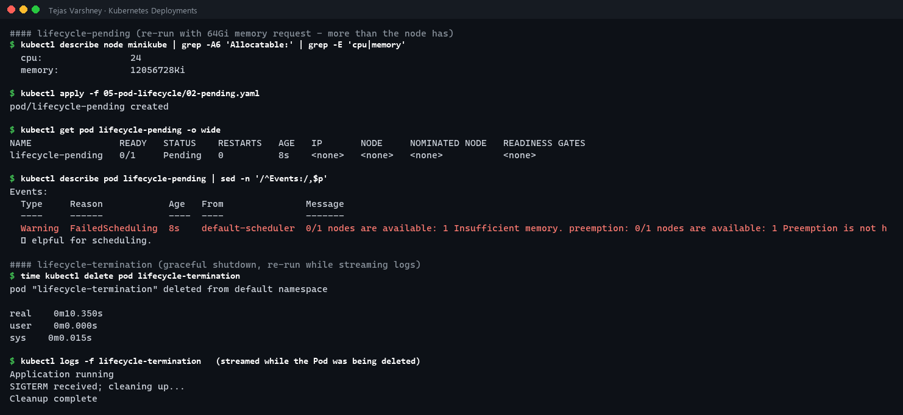

<details><summary>Text output</summary>

```text
#### lifecycle-pending (re-run with 64Gi memory request - more than the node has)
$ kubectl describe node minikube | grep -A6 'Allocatable:' | grep -E 'cpu|memory'
  cpu:                24
  memory:             12056728Ki

$ kubectl apply -f 05-pod-lifecycle/02-pending.yaml
pod/lifecycle-pending created

$ kubectl get pod lifecycle-pending -o wide
NAME                READY   STATUS    RESTARTS   AGE   IP       NODE     NOMINATED NODE   READINESS GATES
lifecycle-pending   0/1     Pending   0          8s    <none>   <none>   <none>           <none>

$ kubectl describe pod lifecycle-pending | sed -n '/^Events:/,$p'
Events:
  Type     Reason            Age   From               Message
  ----     ------            ----  ----               -------
  Warning  FailedScheduling  8s    default-scheduler  0/1 nodes are available: 1 Insufficient memory. preemption: 0/1 nodes are available: 1 Preemption is not helpful for scheduling.

#### lifecycle-termination (graceful shutdown, re-run while streaming logs)
$ time kubectl delete pod lifecycle-termination
pod "lifecycle-termination" deleted from default namespace

real	0m10.350s
user	0m0.000s
sys	0m0.015s

$ kubectl logs -f lifecycle-termination   (streamed while the Pod was being deleted)
Application running
SIGTERM received; cleaning up...
Cleanup complete
```

</details>

### What I observed for each Pod

| Pod | Phase / Status | Why |
|---|---|---|
| `lifecycle-running` | **Running**, 1/1 | nginx starts and keeps running. Scheduled → Pulled → Created → Started events. |
| `lifecycle-pending` | **Pending** | Requests 64Gi memory. The scheduler reports `FailedScheduling: 1 Insufficient memory` and the Pod never gets a node or an IP. |
| `lifecycle-succeeded` | **Succeeded** / `Completed`, exit code 0 | `restartPolicy: Never` + command exits 0 → terminal success phase. |
| `lifecycle-failed` | **Failed** / `Error`, exit code 1 | `restartPolicy: Never` + exit 1 → terminal failure phase. No restarts. |
| `lifecycle-crashloop` | Running phase, status `Error` → **CrashLoopBackOff**, restarts 3+ | Default `restartPolicy: Always`: kubelet keeps restarting the container, waiting longer each time (10s, 20s, 40s… up to 5 min). `BackOff` events show it. |
| `lifecycle-image-error` | **Pending**, `ErrImagePull` → `ImagePullBackOff` | Repository `jakwehrgkaejw` doesn't exist: `pull access denied, repository does not exist`. The Pod is scheduled but its container is stuck `Waiting`. |
| `lifecycle-readiness` | Running, **Ready 1/1** after ~5s | HTTP readiness probe on `/` (kube-probe requests are visible in the nginx logs). The Pod only gets Service traffic once the probe passes. |
| `lifecycle-liveness` | Running, **Restart Count 1**, last exit code **137** | After 20s the app deletes `/tmp/healthy`. The liveness probe fails twice → `Killing … will be restarted`. 137 = SIGKILL. |
| `lifecycle-startup` | Running, Ready only after ~30s | The startup probe failed 6 times (`Unhealthy x6`) while the app "booted". `failureThreshold: 10` × 5s gave it 50s, so it was **not** killed. Liveness/readiness checks are held off until the startup probe passes. |
| `lifecycle-init` | **Init:0/1 → Running** | The `setup` init container ran for 10s and exited 0 (`Completed`). Only then did the `app` container start. |
| `lifecycle-multi-container` | Running, **2/2** | nginx + a busybox sidecar share the Pod. Read logs per container with `-c sidecar`. |
| `lifecycle-termination` | Terminating → gone in ~10s | `kubectl delete` sends **SIGTERM**. The trap printed `SIGTERM received; cleaning up...`, slept 10s, printed `Cleanup complete` and exited before `terminationGracePeriodSeconds: 20` ran out (after which kubelet sends SIGKILL). |

### Pod phases summary
`Pending` (accepted but not running: scheduling or image pull) → `Running` (at least one container running) → `Succeeded` (all containers exited 0, no restart) / `Failed` (a container exited non-zero, no restart). `Unknown` means the node can't be reached. `CrashLoopBackOff`, `ImagePullBackOff`, `ContainerCreating` and `Completed` are **container state reasons** shown in the STATUS column, not phases.
