# Session 12: Kubernetes Ingress, ConfigMaps & Secrets

> 📸 **Screenshots:** the terminal images on this page are rendered from the exact command output captured during my runs (full text is under each *Text output* section).

**Name:** Tejas Varshney  
**Cluster:** minikube v1.39.0 (Kubernetes v1.37.0) on Windows 11, with the `ingress` add-on (ingress-nginx)

| Task | Files |
|---|---|
| 1. ConfigMap | [01-configmap/configmap.yaml](01-configmap/configmap.yaml), [01-configmap/pod.yaml](01-configmap/pod.yaml) |
| 2. Secret | [02-secret/secret.example.yaml](02-secret/secret.example.yaml), [02-secret/pod.yaml](02-secret/pod.yaml) |
| 3. Ingress | [03-ingress/apps.yaml](03-ingress/apps.yaml), [03-ingress/ingress.yaml](03-ingress/ingress.yaml) |
| 4. Ingress vs Ingress Controller | [04-ingress-vs-ingress-controller/README.md](04-ingress-vs-ingress-controller/README.md) |
| 5. Troubleshooting | [05-troubleshooting/](05-troubleshooting) (3 broken → fixed scenarios) |
| Raw outputs | [outputs/](outputs) |

---

## Task 1 – ConfigMap

The ConfigMap holds three plain keys plus a whole `app.properties` file. The Pod consumes it **three ways**:
1. `configMapKeyRef`: one key → env var `COLOR`
2. `envFrom`: every key → env vars with the same names
3. a `configMap` volume: `app.properties` → file `/etc/app/app.properties`

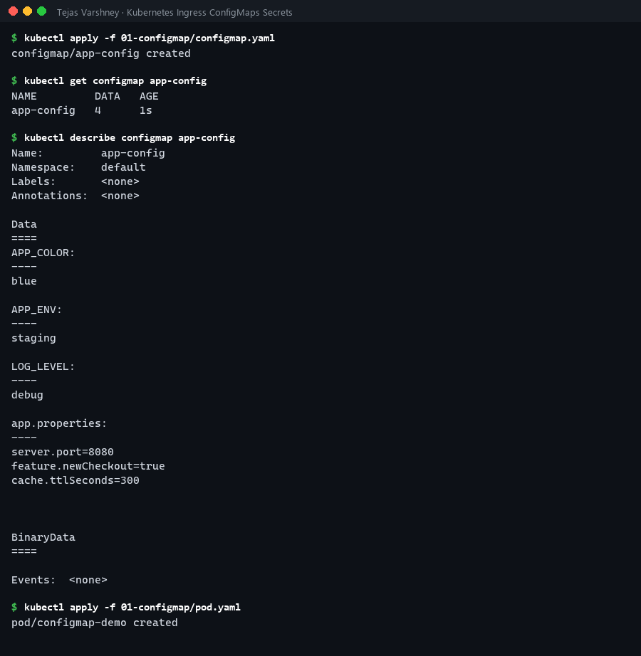
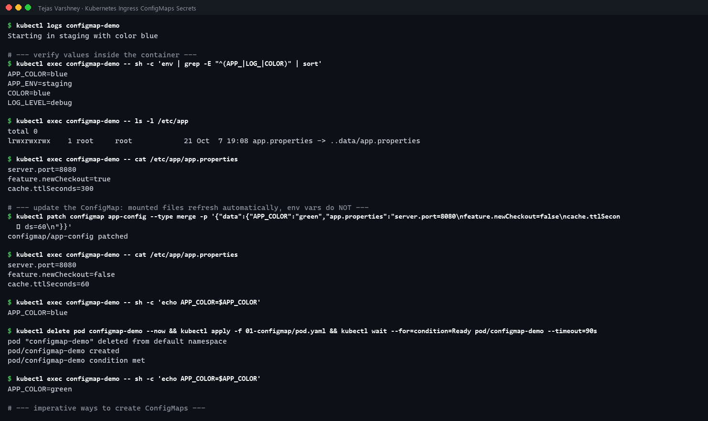
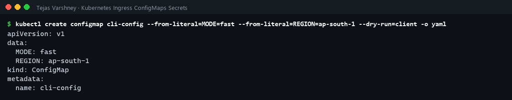

<details><summary>Text output</summary>

```text
$ kubectl apply -f 01-configmap/configmap.yaml
configmap/app-config created

$ kubectl get configmap app-config
NAME         DATA   AGE
app-config   4      1s

$ kubectl describe configmap app-config
Name:         app-config
Namespace:    default
Labels:       <none>
Annotations:  <none>

Data
====
APP_COLOR:
----
blue

APP_ENV:
----
staging

LOG_LEVEL:
----
debug

app.properties:
----
server.port=8080
feature.newCheckout=true
cache.ttlSeconds=300


BinaryData
====

Events:  <none>

$ kubectl apply -f 01-configmap/pod.yaml
pod/configmap-demo created

$ kubectl logs configmap-demo
Starting in staging with color blue

# --- verify values inside the container ---
$ kubectl exec configmap-demo -- sh -c 'env | grep -E "^(APP_|LOG_|COLOR)" | sort'
APP_COLOR=blue
APP_ENV=staging
COLOR=blue
LOG_LEVEL=debug

$ kubectl exec configmap-demo -- ls -l /etc/app
total 0
lrwxrwxrwx    1 root     root            21 Oct  7 19:08 app.properties -> ..data/app.properties

$ kubectl exec configmap-demo -- cat /etc/app/app.properties
server.port=8080
feature.newCheckout=true
cache.ttlSeconds=300

# --- update the ConfigMap: mounted files refresh automatically, env vars do NOT ---
$ kubectl patch configmap app-config --type merge -p '{"data":{"APP_COLOR":"green","app.properties":"server.port=8080\nfeature.newCheckout=false\ncache.ttlSeconds=60\n"}}'
configmap/app-config patched

$ kubectl exec configmap-demo -- cat /etc/app/app.properties
server.port=8080
feature.newCheckout=false
cache.ttlSeconds=60

$ kubectl exec configmap-demo -- sh -c 'echo APP_COLOR=$APP_COLOR'
APP_COLOR=blue

$ kubectl delete pod configmap-demo --now && kubectl apply -f 01-configmap/pod.yaml && kubectl wait --for=condition=Ready pod/configmap-demo --timeout=90s
pod "configmap-demo" deleted from default namespace
pod/configmap-demo created
pod/configmap-demo condition met

$ kubectl exec configmap-demo -- sh -c 'echo APP_COLOR=$APP_COLOR'
APP_COLOR=green

# --- imperative ways to create ConfigMaps ---
$ kubectl create configmap cli-config --from-literal=MODE=fast --from-literal=REGION=ap-south-1 --dry-run=client -o yaml
apiVersion: v1
data:
  MODE: fast
  REGION: ap-south-1
kind: ConfigMap
metadata:
  name: cli-config
```

</details>

**What I learned**
- All three injection methods worked: `APP_ENV=staging`, `COLOR=blue`, and the file contents under `/etc/app`.
- The mounted file is a **symlink into `..data/`**. When I patched the ConfigMap, kubelet atomically swapped the directory and the file showed `newCheckout=false` **without restarting the Pod** (after the kubelet sync period, under a minute).
- **Environment variables do not update.** `APP_COLOR` stayed `blue` until I recreated the Pod, then it was `green`. In real apps, roll the Deployment after a config change (`kubectl rollout restart`), or use a checksum annotation as Helm does.
- ConfigMaps are for **non-sensitive** config only. Values are stored in plain text.

## Task 2 – Secret

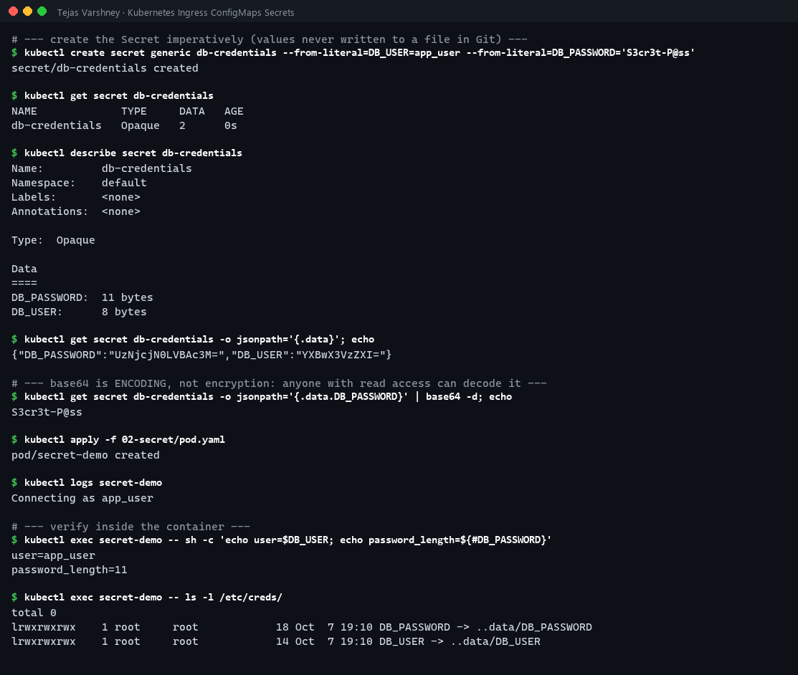
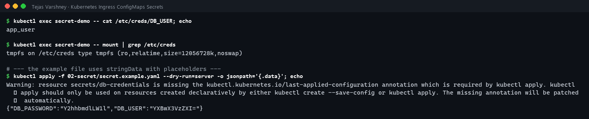

<details><summary>Text output</summary>

```text
# --- create the Secret imperatively (values never written to a file in Git) ---
$ kubectl create secret generic db-credentials --from-literal=DB_USER=app_user --from-literal=DB_PASSWORD='S3cr3t-P@ss'
secret/db-credentials created

$ kubectl get secret db-credentials
NAME             TYPE     DATA   AGE
db-credentials   Opaque   2      0s

$ kubectl describe secret db-credentials
Name:         db-credentials
Namespace:    default
Labels:       <none>
Annotations:  <none>

Type:  Opaque

Data
====
DB_PASSWORD:  11 bytes
DB_USER:      8 bytes

$ kubectl get secret db-credentials -o jsonpath='{.data}'; echo
{"DB_PASSWORD":"UzNjcjN0LVBAc3M=","DB_USER":"YXBwX3VzZXI="}

# --- base64 is ENCODING, not encryption: anyone with read access can decode it ---
$ kubectl get secret db-credentials -o jsonpath='{.data.DB_PASSWORD}' | base64 -d; echo
S3cr3t-P@ss

$ kubectl apply -f 02-secret/pod.yaml
pod/secret-demo created

$ kubectl logs secret-demo
Connecting as app_user

# --- verify inside the container ---
$ kubectl exec secret-demo -- sh -c 'echo user=$DB_USER; echo password_length=${#DB_PASSWORD}'
user=app_user
password_length=11

$ kubectl exec secret-demo -- ls -l /etc/creds/
total 0
lrwxrwxrwx    1 root     root            18 Oct  7 19:10 DB_PASSWORD -> ..data/DB_PASSWORD
lrwxrwxrwx    1 root     root            14 Oct  7 19:10 DB_USER -> ..data/DB_USER

$ kubectl exec secret-demo -- cat /etc/creds/DB_USER; echo
app_user

$ kubectl exec secret-demo -- mount | grep /etc/creds
tmpfs on /etc/creds type tmpfs (ro,relatime,size=12056728k,noswap)

# --- the example file uses stringData with placeholders ---
$ kubectl apply -f 02-secret/secret.example.yaml --dry-run=server -o jsonpath='{.data}'; echo
Warning: resource secrets/db-credentials is missing the kubectl.kubernetes.io/last-applied-configuration annotation which is required by kubectl apply. kubectl apply should only be used on resources created declaratively by either kubectl create --save-config or kubectl apply. The missing annotation will be patched automatically.
{"DB_PASSWORD":"Y2hhbmdlLW1l","DB_USER":"YXBwX3VzZXI="}
```

</details>

**What I learned**
- `kubectl describe secret` hides the values (shows only byte counts), but `-o jsonpath='{.data}'` shows **base64**, and `base64 -d` gives back the plain password. **Base64 is encoding, not encryption.**
- The Pod received `DB_USER` / `DB_PASSWORD` as env vars and as files in `/etc/creds`. Secret volumes are mounted on **tmpfs** (RAM, never written to the node's disk), read-only, with mode `0400`.
- `stringData` lets you write plain text in YAML. The API server converts it to base64 `data` (`change-me` → `Y2hhbmdlLW1l`).

### Why Secrets should not be committed directly to Git
1. **Base64 is reversible.** Anyone who can read the repo (teammates, forks, CI logs, a leaked laptop) gets the real credentials.
2. **Git never forgets.** Deleting the file in a later commit leaves it in history. You would have to rewrite history *and* rotate the credential.
3. **Public repos are scanned by bots** within minutes for keys and passwords.
4. Secrets in Git usually mean the same value in every environment and no audit trail of who used it.

**What to do instead:** create Secrets at deploy time (`kubectl create secret ... --from-literal` / `--from-file`, as I did, or from CI secrets), or keep only **encrypted** secrets in Git with **Sealed Secrets** or **SOPS**, or sync from a vault with the **External Secrets Operator** (AWS Secrets Manager, HashiCorp Vault). Commit only a placeholder example like [secret.example.yaml](02-secret/secret.example.yaml). Inside the cluster: enable **encryption at rest** for etcd and restrict `get secrets` with RBAC.

## Task 3 – Ingress

Two apps (`shop`, `blog`, 2 replicas each) behind ClusterIP Services, plus two Ingresses:
- `demo-ingress`: **path-based** on `demo.local` (`/shop`, `/blog`), with `rewrite-target` so the backend receives `/`
- `host-ingress`: **host-based** (`shop.demo.local`, `blog.demo.local`)

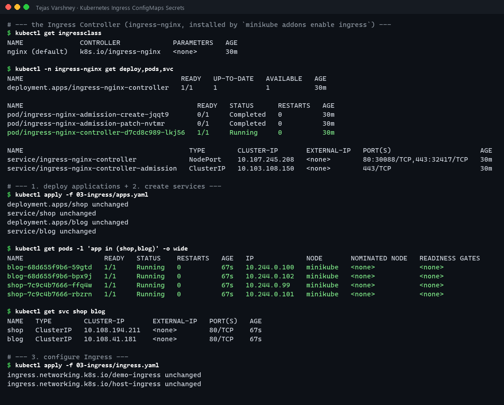
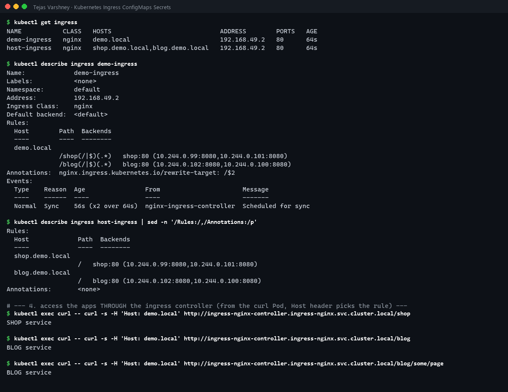
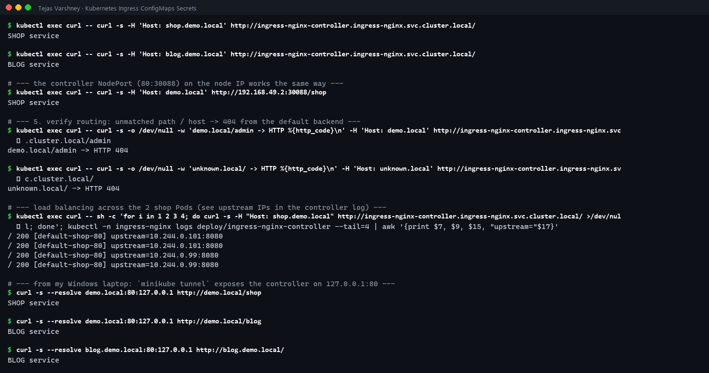

<details><summary>Text output</summary>

```text
# --- the Ingress Controller (ingress-nginx, installed by `minikube addons enable ingress`) ---
$ kubectl get ingressclass
NAME              CONTROLLER             PARAMETERS   AGE
nginx (default)   k8s.io/ingress-nginx   <none>       30m

$ kubectl -n ingress-nginx get deploy,pods,svc
NAME                                       READY   UP-TO-DATE   AVAILABLE   AGE
deployment.apps/ingress-nginx-controller   1/1     1            1           30m

NAME                                           READY   STATUS      RESTARTS   AGE
pod/ingress-nginx-admission-create-jqqt9       0/1     Completed   0          30m
pod/ingress-nginx-admission-patch-nvtmr        0/1     Completed   0          30m
pod/ingress-nginx-controller-d7cd8c989-lkj56   1/1     Running     0          30m

NAME                                         TYPE        CLUSTER-IP       EXTERNAL-IP   PORT(S)                      AGE
service/ingress-nginx-controller             NodePort    10.107.245.208   <none>        80:30088/TCP,443:32417/TCP   30m
service/ingress-nginx-controller-admission   ClusterIP   10.103.108.150   <none>        443/TCP                      30m

# --- 1. deploy applications + 2. create services ---
$ kubectl apply -f 03-ingress/apps.yaml
deployment.apps/shop unchanged
service/shop unchanged
deployment.apps/blog unchanged
service/blog unchanged

$ kubectl get pods -l 'app in (shop,blog)' -o wide
NAME                    READY   STATUS    RESTARTS   AGE   IP             NODE       NOMINATED NODE   READINESS GATES
blog-68d655f9b6-59gtd   1/1     Running   0          67s   10.244.0.100   minikube   <none>           <none>
blog-68d655f9b6-bpx9j   1/1     Running   0          67s   10.244.0.102   minikube   <none>           <none>
shop-7c9c4b7666-ffq4w   1/1     Running   0          67s   10.244.0.99    minikube   <none>           <none>
shop-7c9c4b7666-rbzrn   1/1     Running   0          67s   10.244.0.101   minikube   <none>           <none>

$ kubectl get svc shop blog
NAME   TYPE        CLUSTER-IP       EXTERNAL-IP   PORT(S)   AGE
shop   ClusterIP   10.108.194.211   <none>        80/TCP    67s
blog   ClusterIP   10.108.41.181    <none>        80/TCP    67s

# --- 3. configure Ingress ---
$ kubectl apply -f 03-ingress/ingress.yaml
ingress.networking.k8s.io/demo-ingress unchanged
ingress.networking.k8s.io/host-ingress unchanged

$ kubectl get ingress
NAME           CLASS   HOSTS                             ADDRESS        PORTS   AGE
demo-ingress   nginx   demo.local                        192.168.49.2   80      64s
host-ingress   nginx   shop.demo.local,blog.demo.local   192.168.49.2   80      64s

$ kubectl describe ingress demo-ingress
Name:             demo-ingress
Labels:           <none>
Namespace:        default
Address:          192.168.49.2
Ingress Class:    nginx
Default backend:  <default>
Rules:
  Host        Path  Backends
  ----        ----  --------
  demo.local  
              /shop(/|$)(.*)   shop:80 (10.244.0.99:8080,10.244.0.101:8080)
              /blog(/|$)(.*)   blog:80 (10.244.0.102:8080,10.244.0.100:8080)
Annotations:  nginx.ingress.kubernetes.io/rewrite-target: /$2
Events:
  Type    Reason  Age                From                      Message
  ----    ------  ----               ----                      -------
  Normal  Sync    56s (x2 over 64s)  nginx-ingress-controller  Scheduled for sync

$ kubectl describe ingress host-ingress | sed -n '/Rules:/,/Annotations:/p'
Rules:
  Host             Path  Backends
  ----             ----  --------
  shop.demo.local  
                   /   shop:80 (10.244.0.99:8080,10.244.0.101:8080)
  blog.demo.local  
                   /   blog:80 (10.244.0.102:8080,10.244.0.100:8080)
Annotations:       <none>

# --- 4. access the apps THROUGH the ingress controller (from the curl Pod, Host header picks the rule) ---
$ kubectl exec curl -- curl -s -H 'Host: demo.local' http://ingress-nginx-controller.ingress-nginx.svc.cluster.local/shop
SHOP service

$ kubectl exec curl -- curl -s -H 'Host: demo.local' http://ingress-nginx-controller.ingress-nginx.svc.cluster.local/blog
BLOG service

$ kubectl exec curl -- curl -s -H 'Host: demo.local' http://ingress-nginx-controller.ingress-nginx.svc.cluster.local/blog/some/page
BLOG service

$ kubectl exec curl -- curl -s -H 'Host: shop.demo.local' http://ingress-nginx-controller.ingress-nginx.svc.cluster.local/
SHOP service

$ kubectl exec curl -- curl -s -H 'Host: blog.demo.local' http://ingress-nginx-controller.ingress-nginx.svc.cluster.local/
BLOG service

# --- the controller NodePort (80:30088) on the node IP works the same way ---
$ kubectl exec curl -- curl -s -H 'Host: demo.local' http://192.168.49.2:30088/shop
SHOP service

# --- 5. verify routing: unmatched path / host -> 404 from the default backend ---
$ kubectl exec curl -- curl -s -o /dev/null -w 'demo.local/admin -> HTTP %{http_code}\n' -H 'Host: demo.local' http://ingress-nginx-controller.ingress-nginx.svc.cluster.local/admin
demo.local/admin -> HTTP 404

$ kubectl exec curl -- curl -s -o /dev/null -w 'unknown.local/ -> HTTP %{http_code}\n' -H 'Host: unknown.local' http://ingress-nginx-controller.ingress-nginx.svc.cluster.local/
unknown.local/ -> HTTP 404

# --- load balancing across the 2 shop Pods (see upstream IPs in the controller log) ---
$ kubectl exec curl -- sh -c 'for i in 1 2 3 4; do curl -s -H "Host: shop.demo.local" http://ingress-nginx-controller.ingress-nginx.svc.cluster.local/ >/dev/null; done'; kubectl -n ingress-nginx logs deploy/ingress-nginx-controller --tail=4 | awk '{print $7, $9, $15, "upstream="$17}'
/ 200 [default-shop-80] upstream=10.244.0.101:8080
/ 200 [default-shop-80] upstream=10.244.0.101:8080
/ 200 [default-shop-80] upstream=10.244.0.99:8080
/ 200 [default-shop-80] upstream=10.244.0.99:8080

# --- from my Windows laptop: `minikube tunnel` exposes the controller on 127.0.0.1:80 ---
$ curl -s --resolve demo.local:80:127.0.0.1 http://demo.local/shop
SHOP service

$ curl -s --resolve demo.local:80:127.0.0.1 http://demo.local/blog
BLOG service

$ curl -s --resolve blog.demo.local:80:127.0.0.1 http://blog.demo.local/
BLOG service
```

</details>

**What I observed / verified**
- Both Ingresses got ADDRESS `192.168.49.2` (the node) once the controller picked them up. `describe ingress` lists the resolved Pod endpoints for each backend.
- Path routing: `/shop` → `SHOP service`, `/blog` and `/blog/some/page` → `BLOG service`. Host routing: `shop.demo.local` / `blog.demo.local` went to the right app.
- An unknown path (`/admin`) or unknown host returned **404** from the controller's default backend.
- The controller log shows the upstream Pod IPs alternating (`10.244.0.101`, `10.244.0.99`), so it load-balances across the shop Pods.
- From Windows, with `minikube tunnel` running, `curl --resolve demo.local:80:127.0.0.1 http://demo.local/shop` reached the app. (The same thing works with a hosts-file entry `127.0.0.1 demo.local`.)

## Task 4 – Ingress vs Ingress Controller

See [04-ingress-vs-ingress-controller/README.md](04-ingress-vs-ingress-controller/README.md).

## Task 5 – Troubleshooting

For each issue: **identify → run troubleshooting commands → find the root cause → fix → capture before/after.**

### 5.1 PostgreSQL rejects the app: the "trailing newline" Secret bug
Scenario from the course's `troubleshooting/secret-base64-gotcha.md`, reproduced with a real PostgreSQL 16. Files: [05-troubleshooting/01-secret-newline](05-troubleshooting/01-secret-newline)

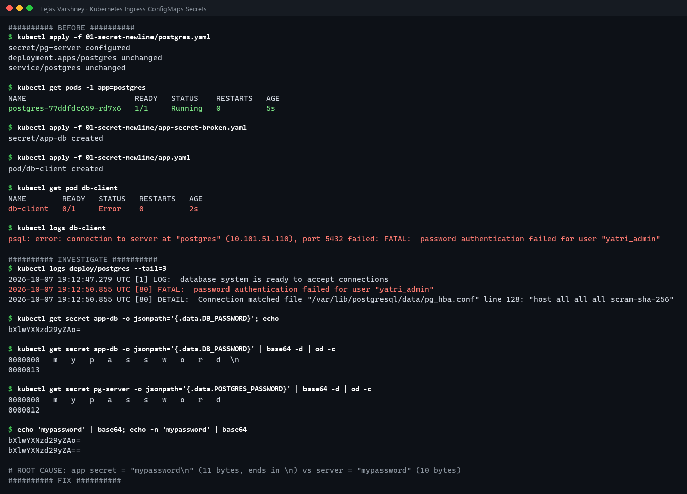
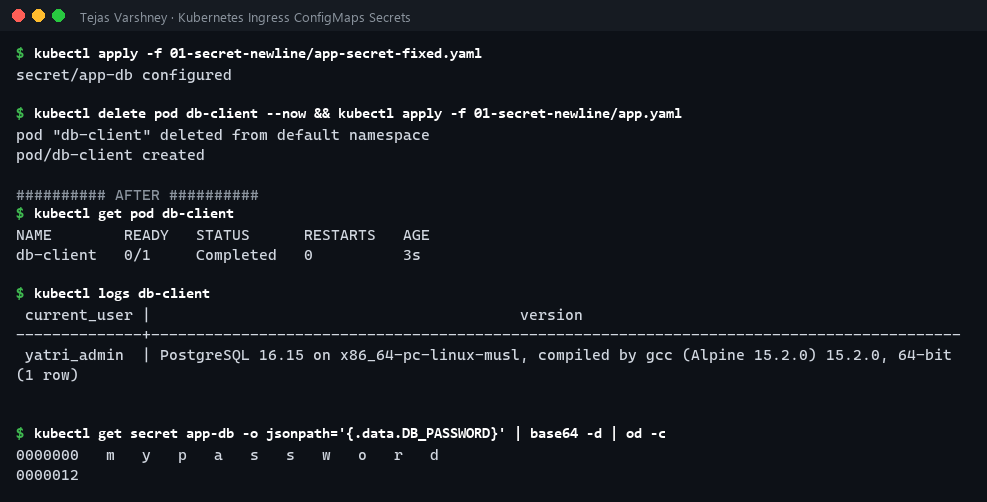

<details><summary>Text output</summary>

```text
########## BEFORE ##########
$ kubectl apply -f 01-secret-newline/postgres.yaml
secret/pg-server configured
deployment.apps/postgres unchanged
service/postgres unchanged

$ kubectl get pods -l app=postgres
NAME                        READY   STATUS    RESTARTS   AGE
postgres-77ddfdc659-rd7x6   1/1     Running   0          5s

$ kubectl apply -f 01-secret-newline/app-secret-broken.yaml
secret/app-db created

$ kubectl apply -f 01-secret-newline/app.yaml
pod/db-client created

$ kubectl get pod db-client
NAME        READY   STATUS   RESTARTS   AGE
db-client   0/1     Error    0          2s

$ kubectl logs db-client
psql: error: connection to server at "postgres" (10.101.51.110), port 5432 failed: FATAL:  password authentication failed for user "yatri_admin"

########## INVESTIGATE ##########
$ kubectl logs deploy/postgres --tail=3
2026-10-07 19:12:47.279 UTC [1] LOG:  database system is ready to accept connections
2026-10-07 19:12:50.855 UTC [80] FATAL:  password authentication failed for user "yatri_admin"
2026-10-07 19:12:50.855 UTC [80] DETAIL:  Connection matched file "/var/lib/postgresql/data/pg_hba.conf" line 128: "host all all all scram-sha-256"

$ kubectl get secret app-db -o jsonpath='{.data.DB_PASSWORD}'; echo
bXlwYXNzd29yZAo=

$ kubectl get secret app-db -o jsonpath='{.data.DB_PASSWORD}' | base64 -d | od -c
0000000   m   y   p   a   s   s   w   o   r   d  \n
0000013

$ kubectl get secret pg-server -o jsonpath='{.data.POSTGRES_PASSWORD}' | base64 -d | od -c
0000000   m   y   p   a   s   s   w   o   r   d
0000012

$ echo 'mypassword' | base64; echo -n 'mypassword' | base64
bXlwYXNzd29yZAo=
bXlwYXNzd29yZA==

# ROOT CAUSE: app secret = "mypassword\n" (11 bytes, ends in \n) vs server = "mypassword" (10 bytes)
########## FIX ##########
$ kubectl apply -f 01-secret-newline/app-secret-fixed.yaml
secret/app-db configured

$ kubectl delete pod db-client --now && kubectl apply -f 01-secret-newline/app.yaml
pod "db-client" deleted from default namespace
pod/db-client created

########## AFTER ##########
$ kubectl get pod db-client
NAME        READY   STATUS      RESTARTS   AGE
db-client   0/1     Completed   0          3s

$ kubectl logs db-client
 current_user |                                         version                                          
--------------+------------------------------------------------------------------------------------------
 yatri_admin  | PostgreSQL 16.15 on x86_64-pc-linux-musl, compiled by gcc (Alpine 15.2.0) 15.2.0, 64-bit
(1 row)


$ kubectl get secret app-db -o jsonpath='{.data.DB_PASSWORD}' | base64 -d | od -c
0000000   m   y   p   a   s   s   w   o   r   d
0000012
```

</details>

- **Problem:** `FATAL: password authentication failed for user "yatri_admin"`, even though "the password is correct".
- **Investigation:** the Postgres logs confirm the auth failure. Decoding both Secrets with `od -c` shows the app's value is `m y p a s s w o r d \n` (**11 bytes**) while the server's is 10 bytes.
- **Root cause:** the base64 value was generated with `echo "mypassword" | base64`, and `echo` appends `\n` (`...ZAo=`).
- **Fix:** `echo -n "mypassword" | base64` → `bXlwYXNzd29yZA==` (or use `stringData` / `kubectl create secret --from-literal`, which never add a newline).
- **After:** `psql` connected and returned `current_user = yatri_admin`.

### 5.2 Pod stuck in `CreateContainerConfigError`: wrong ConfigMap key
Files: [05-troubleshooting/02-missing-configmap-key](05-troubleshooting/02-missing-configmap-key)

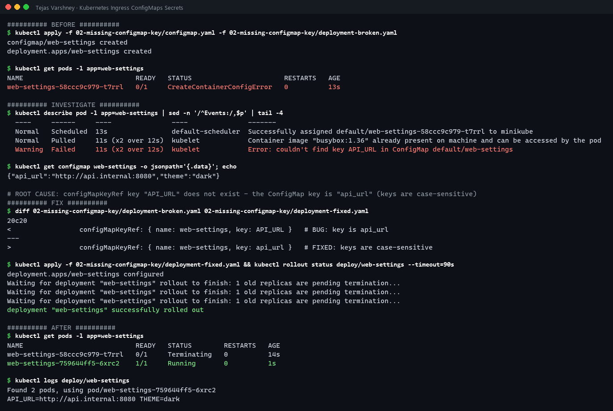

<details><summary>Text output</summary>

```text
########## BEFORE ##########
$ kubectl apply -f 02-missing-configmap-key/configmap.yaml -f 02-missing-configmap-key/deployment-broken.yaml
configmap/web-settings created
deployment.apps/web-settings created

$ kubectl get pods -l app=web-settings
NAME                            READY   STATUS                       RESTARTS   AGE
web-settings-58ccc9c979-t7rrl   0/1     CreateContainerConfigError   0          13s

########## INVESTIGATE ##########
$ kubectl describe pod -l app=web-settings | sed -n '/^Events:/,$p' | tail -4
  ----     ------     ----               ----               -------
  Normal   Scheduled  13s                default-scheduler  Successfully assigned default/web-settings-58ccc9c979-t7rrl to minikube
  Normal   Pulled     11s (x2 over 12s)  kubelet            Container image "busybox:1.36" already present on machine and can be accessed by the pod
  Warning  Failed     11s (x2 over 12s)  kubelet            Error: couldn't find key API_URL in ConfigMap default/web-settings

$ kubectl get configmap web-settings -o jsonpath='{.data}'; echo
{"api_url":"http://api.internal:8080","theme":"dark"}

# ROOT CAUSE: configMapKeyRef key "API_URL" does not exist - the ConfigMap key is "api_url" (keys are case-sensitive)
########## FIX ##########
$ diff 02-missing-configmap-key/deployment-broken.yaml 02-missing-configmap-key/deployment-fixed.yaml
20c20
<                 configMapKeyRef: { name: web-settings, key: API_URL }   # BUG: key is api_url
---
>                 configMapKeyRef: { name: web-settings, key: api_url }   # FIXED: keys are case-sensitive

$ kubectl apply -f 02-missing-configmap-key/deployment-fixed.yaml && kubectl rollout status deploy/web-settings --timeout=90s
deployment.apps/web-settings configured
Waiting for deployment "web-settings" rollout to finish: 1 old replicas are pending termination...
Waiting for deployment "web-settings" rollout to finish: 1 old replicas are pending termination...
Waiting for deployment "web-settings" rollout to finish: 1 old replicas are pending termination...
deployment "web-settings" successfully rolled out

########## AFTER ##########
$ kubectl get pods -l app=web-settings
NAME                            READY   STATUS        RESTARTS   AGE
web-settings-58ccc9c979-t7rrl   0/1     Terminating   0          14s
web-settings-759644ff5-6xrc2    1/1     Running       0          1s

$ kubectl logs deploy/web-settings
Found 2 pods, using pod/web-settings-759644ff5-6xrc2
API_URL=http://api.internal:8080 THEME=dark
```

</details>

- **Problem:** the Pod never starts; status `CreateContainerConfigError`.
- **Investigation:** the event says `couldn't find key API_URL in ConfigMap default/web-settings`, and the ConfigMap data shows the key is `api_url`.
- **Root cause:** ConfigMap keys are **case-sensitive**.
- **Fix:** reference `key: api_url` (or mark the ref `optional: true` if the value may be absent).
- **After:** the Pod is Running and logs `API_URL=http://api.internal:8080 THEME=dark`.

### 5.3 Ingress returns 503: two backend misconfigurations
Files: [05-troubleshooting/03-ingress-backend](05-troubleshooting/03-ingress-backend)

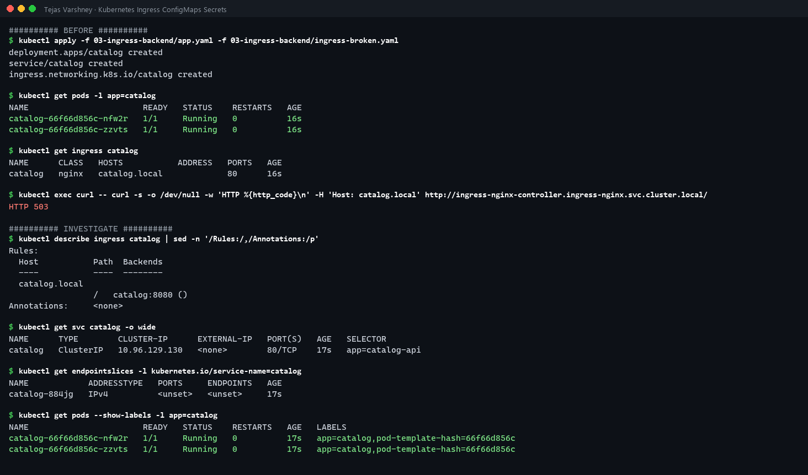
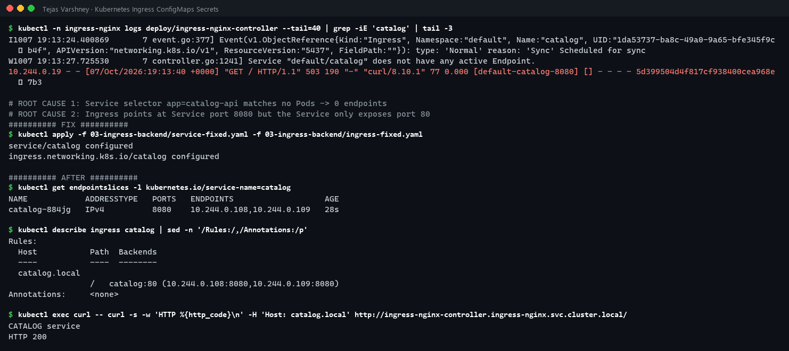

<details><summary>Text output</summary>

```text
########## BEFORE ##########
$ kubectl apply -f 03-ingress-backend/app.yaml -f 03-ingress-backend/ingress-broken.yaml
deployment.apps/catalog created
service/catalog created
ingress.networking.k8s.io/catalog created

$ kubectl get pods -l app=catalog
NAME                       READY   STATUS    RESTARTS   AGE
catalog-66f66d856c-nfw2r   1/1     Running   0          16s
catalog-66f66d856c-zzvts   1/1     Running   0          16s

$ kubectl get ingress catalog
NAME      CLASS   HOSTS           ADDRESS   PORTS   AGE
catalog   nginx   catalog.local             80      16s

$ kubectl exec curl -- curl -s -o /dev/null -w 'HTTP %{http_code}\n' -H 'Host: catalog.local' http://ingress-nginx-controller.ingress-nginx.svc.cluster.local/
HTTP 503

########## INVESTIGATE ##########
$ kubectl describe ingress catalog | sed -n '/Rules:/,/Annotations:/p'
Rules:
  Host           Path  Backends
  ----           ----  --------
  catalog.local  
                 /   catalog:8080 ()
Annotations:     <none>

$ kubectl get svc catalog -o wide
NAME      TYPE        CLUSTER-IP      EXTERNAL-IP   PORT(S)   AGE   SELECTOR
catalog   ClusterIP   10.96.129.130   <none>        80/TCP    17s   app=catalog-api

$ kubectl get endpointslices -l kubernetes.io/service-name=catalog
NAME            ADDRESSTYPE   PORTS     ENDPOINTS   AGE
catalog-884jg   IPv4          <unset>   <unset>     17s

$ kubectl get pods --show-labels -l app=catalog
NAME                       READY   STATUS    RESTARTS   AGE   LABELS
catalog-66f66d856c-nfw2r   1/1     Running   0          17s   app=catalog,pod-template-hash=66f66d856c
catalog-66f66d856c-zzvts   1/1     Running   0          17s   app=catalog,pod-template-hash=66f66d856c

$ kubectl -n ingress-nginx logs deploy/ingress-nginx-controller --tail=40 | grep -iE 'catalog' | tail -3
I1007 19:13:24.400869       7 event.go:377] Event(v1.ObjectReference{Kind:"Ingress", Namespace:"default", Name:"catalog", UID:"1da53737-ba8c-49a0-9a65-bfe345f9cb4f", APIVersion:"networking.k8s.io/v1", ResourceVersion:"5437", FieldPath:""}): type: 'Normal' reason: 'Sync' Scheduled for sync
W1007 19:13:27.725530       7 controller.go:1241] Service "default/catalog" does not have any active Endpoint.
10.244.0.19 - - [07/Oct/2026:19:13:40 +0000] "GET / HTTP/1.1" 503 190 "-" "curl/8.10.1" 77 0.000 [default-catalog-8080] [] - - - - 5d399504d4f817cf938400cea968e7b3

# ROOT CAUSE 1: Service selector app=catalog-api matches no Pods -> 0 endpoints
# ROOT CAUSE 2: Ingress points at Service port 8080 but the Service only exposes port 80
########## FIX ##########
$ kubectl apply -f 03-ingress-backend/service-fixed.yaml -f 03-ingress-backend/ingress-fixed.yaml
service/catalog configured
ingress.networking.k8s.io/catalog configured

########## AFTER ##########
$ kubectl get endpointslices -l kubernetes.io/service-name=catalog
NAME            ADDRESSTYPE   PORTS   ENDPOINTS                   AGE
catalog-884jg   IPv4          8080    10.244.0.108,10.244.0.109   28s

$ kubectl describe ingress catalog | sed -n '/Rules:/,/Annotations:/p'
Rules:
  Host           Path  Backends
  ----           ----  --------
  catalog.local  
                 /   catalog:80 (10.244.0.108:8080,10.244.0.109:8080)
Annotations:     <none>

$ kubectl exec curl -- curl -s -w 'HTTP %{http_code}\n' -H 'Host: catalog.local' http://ingress-nginx-controller.ingress-nginx.svc.cluster.local/
CATALOG service
HTTP 200
```

</details>

- **Problem:** `curl -H 'Host: catalog.local'` → **HTTP 503**, even though both Pods are Running.
- **Investigation:**
  - `describe ingress` shows backend `catalog:8080 ()`. The empty parentheses mean no endpoints.
  - `get svc` shows selector `app=catalog-api`, but the Pods are labelled `app=catalog`. The EndpointSlice is `<unset>`.
  - The controller log says it directly: `Service "default/catalog" does not have any active Endpoint`.
- **Root causes:** (1) the Service selector doesn't match the Pod labels; (2) the Ingress uses port `8080`, but the Service port is `80` (8080 is the *targetPort*).
- **Fix:** [service-fixed.yaml](05-troubleshooting/03-ingress-backend/service-fixed.yaml) + [ingress-fixed.yaml](05-troubleshooting/03-ingress-backend/ingress-fixed.yaml).
- **After:** the EndpointSlice lists both Pod IPs, the backend shows `catalog:80 (10.244.0.108:8080,10.244.0.109:8080)`, and the response is `CATALOG service` / **HTTP 200**.

### Troubleshooting cheat-sheet I used

| Symptom | First commands |
|---|---|
| `CreateContainerConfigError` | `kubectl describe pod` (events name the missing ConfigMap/Secret/key) |
| App auth errors with a Secret | `kubectl get secret X -o jsonpath='{.data.K}' \| base64 -d \| od -c` (look for `\n`, spaces) |
| Ingress 503 | `kubectl describe ingress` → `kubectl get endpointslices -l kubernetes.io/service-name=X` → compare `svc` selector with `pod --show-labels` |
| Ingress 404 | Host header / path / `ingressClassName` don't match any rule |
| Ingress has no ADDRESS | No controller installed, or wrong `ingressClassName` |
