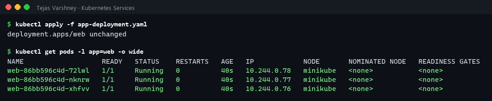
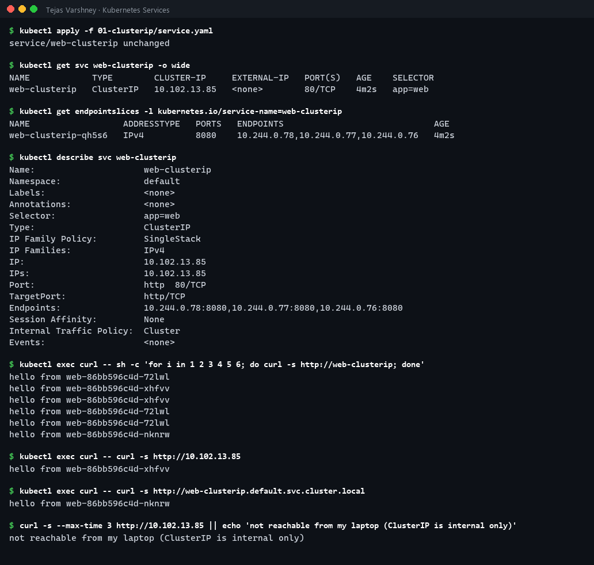
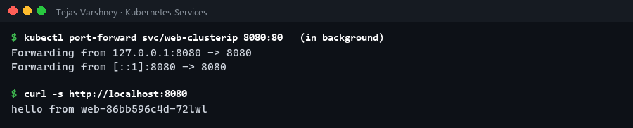
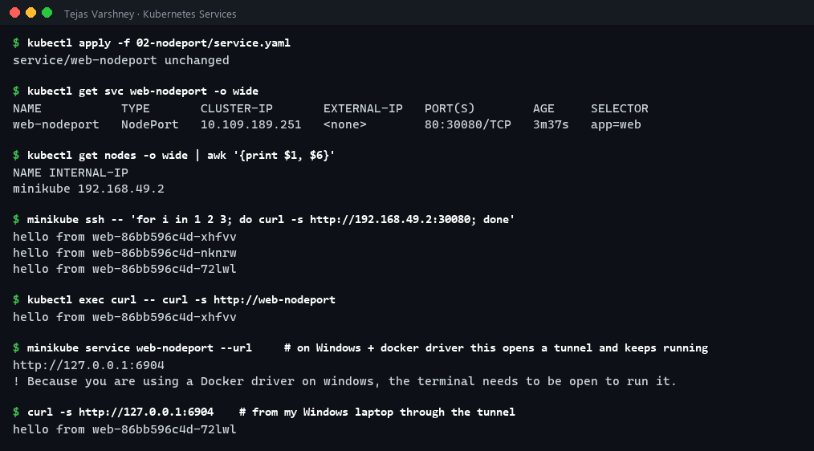
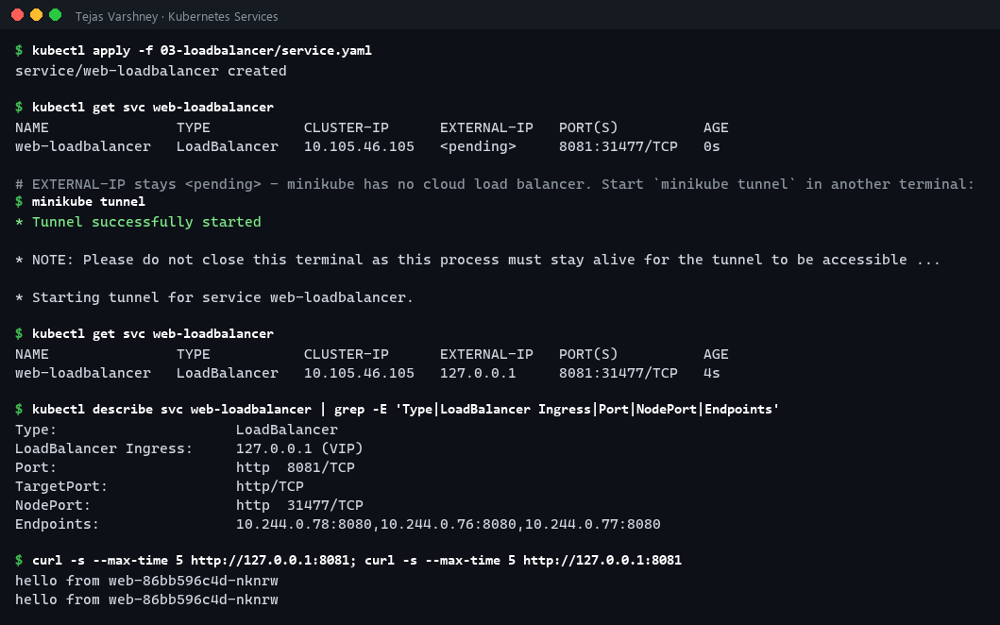
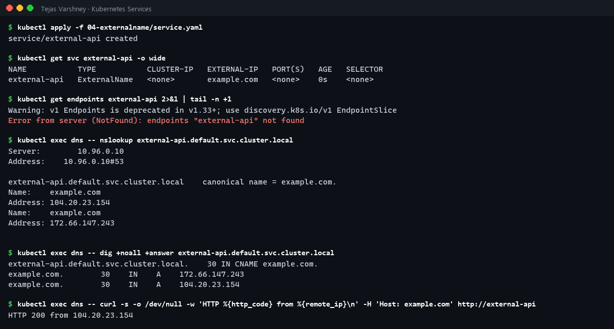
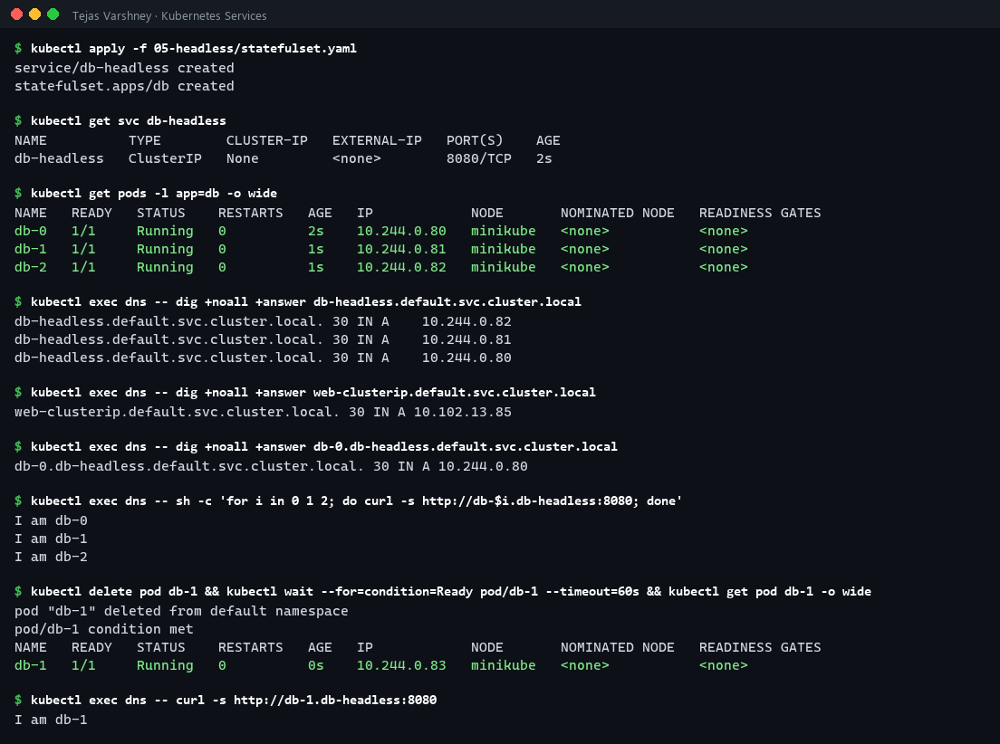

# Session 11: Kubernetes Networking & Services

> 📸 **Screenshots:** the terminal images on this page are rendered from the exact command output captured during my runs (full text is under each *Text output* section).

**Name:** Tejas Varshney  
**Cluster:** minikube v1.39.0 (Kubernetes v1.37.0, docker driver, kube-proxy in iptables mode) on Windows 11

| Deliverable | Where |
|---|---|
| Service YAMLs (all 5 types) | [01-clusterip](01-clusterip) · [02-nodeport](02-nodeport) · [03-loadbalancer](03-loadbalancer) · [04-externalname](04-externalname) · [05-headless](05-headless) |
| Object comparison | [comparison/README.md](comparison/README.md) |
| FQDN | [fqdn/README.md](fqdn/README.md) |
| CoreDNS | [coredns/README.md](coredns/README.md) |
| Raw command output | [outputs/](outputs) |

My earlier screenshot-based attempts are in [../clusterip](../clusterip/README.md), [../nodeport](../nodeport/README.md), [../loadbalancer](../loadbalancer/README.md) and [../externalname](../externalname/README.md). This README redoes all five types with full text output.

---

## Setup

One backend Deployment ([app-deployment.yaml](app-deployment.yaml)) with 3 replicas of `http-echo`, each replying `hello from <pod-name>`, so load-balancing is visible. Test clients: a `curl` Pod (`curlimages/curl`) and a `dns` Pod (`agnhost`, which has `dig`/`nslookup`).



<details><summary>Text output</summary>

```text
$ kubectl apply -f app-deployment.yaml
deployment.apps/web unchanged

$ kubectl get pods -l app=web -o wide
NAME                   READY   STATUS    RESTARTS   AGE   IP            NODE       NOMINATED NODE   READINESS GATES
web-86bb596c4d-72lwl   1/1     Running   0          40s   10.244.0.78   minikube   <none>           <none>
web-86bb596c4d-nknrw   1/1     Running   0          40s   10.244.0.77   minikube   <none>           <none>
web-86bb596c4d-xhfvv   1/1     Running   0          40s   10.244.0.76   minikube   <none>           <none>
```

</details>

```
                    ┌──────────── cluster ────────────┐
  laptop ──tunnel──▶│ LoadBalancer :8081 ─┐           │
  node:30080 ──────▶│ NodePort     :80  ──┼─▶ ClusterIP ──▶ kube-proxy (iptables) ──▶ Pod / Pod / Pod
                    │ ClusterIP    :80  ──┘           │
                    │ ExternalName → CNAME example.com│
                    │ Headless (None) → Pod IPs in DNS│
                    └─────────────────────────────────┘
```

---

## 1. ClusterIP (default)

[01-clusterip/service.yaml](01-clusterip/service.yaml): a stable virtual IP that is reachable **only inside the cluster**.




<details><summary>Text output</summary>

```text
$ kubectl apply -f 01-clusterip/service.yaml
service/web-clusterip unchanged

$ kubectl get svc web-clusterip -o wide
NAME            TYPE        CLUSTER-IP     EXTERNAL-IP   PORT(S)   AGE    SELECTOR
web-clusterip   ClusterIP   10.102.13.85   <none>        80/TCP    4m2s   app=web

$ kubectl get endpointslices -l kubernetes.io/service-name=web-clusterip
NAME                  ADDRESSTYPE   PORTS   ENDPOINTS                             AGE
web-clusterip-qh5s6   IPv4          8080    10.244.0.78,10.244.0.77,10.244.0.76   4m2s

$ kubectl describe svc web-clusterip
Name:                     web-clusterip
Namespace:                default
Labels:                   <none>
Annotations:              <none>
Selector:                 app=web
Type:                     ClusterIP
IP Family Policy:         SingleStack
IP Families:              IPv4
IP:                       10.102.13.85
IPs:                      10.102.13.85
Port:                     http  80/TCP
TargetPort:               http/TCP
Endpoints:                10.244.0.78:8080,10.244.0.77:8080,10.244.0.76:8080
Session Affinity:         None
Internal Traffic Policy:  Cluster
Events:                   <none>

$ kubectl exec curl -- sh -c 'for i in 1 2 3 4 5 6; do curl -s http://web-clusterip; done'
hello from web-86bb596c4d-72lwl
hello from web-86bb596c4d-xhfvv
hello from web-86bb596c4d-xhfvv
hello from web-86bb596c4d-72lwl
hello from web-86bb596c4d-72lwl
hello from web-86bb596c4d-nknrw

$ kubectl exec curl -- curl -s http://10.102.13.85
hello from web-86bb596c4d-xhfvv

$ kubectl exec curl -- curl -s http://web-clusterip.default.svc.cluster.local
hello from web-86bb596c4d-nknrw

$ curl -s --max-time 3 http://10.102.13.85 || echo 'not reachable from my laptop (ClusterIP is internal only)'
not reachable from my laptop (ClusterIP is internal only)

$ kubectl port-forward svc/web-clusterip 8080:80   (in background)
Forwarding from 127.0.0.1:8080 -> 8080
Forwarding from [::1]:8080 -> 8080

$ curl -s http://localhost:8080
hello from web-86bb596c4d-72lwl
```

</details>

**Observed:** ClusterIP `10.102.13.85`, with the three Pod IPs listed as endpoints. Six requests were spread across all 3 Pods. The ClusterIP and the DNS name both work from inside a Pod, but curling the ClusterIP **from my laptop fails** because it only exists in the cluster's iptables rules. `kubectl port-forward` is the debugging workaround.

## 2. NodePort

[02-nodeport/service.yaml](02-nodeport/service.yaml): a ClusterIP **plus** port `30080` opened on every node.



<details><summary>Text output</summary>

```text
$ kubectl apply -f 02-nodeport/service.yaml
service/web-nodeport unchanged

$ kubectl get svc web-nodeport -o wide
NAME           TYPE       CLUSTER-IP       EXTERNAL-IP   PORT(S)        AGE     SELECTOR
web-nodeport   NodePort   10.109.189.251   <none>        80:30080/TCP   3m37s   app=web

$ kubectl get nodes -o wide | awk '{print $1, $6}'
NAME INTERNAL-IP
minikube 192.168.49.2

$ minikube ssh -- 'for i in 1 2 3; do curl -s http://192.168.49.2:30080; done'
hello from web-86bb596c4d-xhfvv
hello from web-86bb596c4d-nknrw
hello from web-86bb596c4d-72lwl

$ kubectl exec curl -- curl -s http://web-nodeport
hello from web-86bb596c4d-xhfvv

$ minikube service web-nodeport --url     # on Windows + docker driver this opens a tunnel and keeps running
http://127.0.0.1:6904
! Because you are using a Docker driver on windows, the terminal needs to be open to run it.

$ curl -s http://127.0.0.1:6904    # from my Windows laptop through the tunnel
hello from web-86bb596c4d-72lwl
```

</details>

**Observed:** `PORT(S) 80:30080/TCP`. From inside the node, `192.168.49.2:30080` load-balances across Pods. With the docker driver on Windows, the node IP isn't routable from the host, so `minikube service --url` opens a local tunnel (`127.0.0.1:6904`) that forwards to the NodePort.

## 3. LoadBalancer

[03-loadbalancer/service.yaml](03-loadbalancer/service.yaml): a NodePort **plus** an external load balancer. In the cloud, the cloud-controller-manager provisions an AWS ELB / GCP LB. On minikube, `minikube tunnel` plays that role.



<details><summary>Text output</summary>

```text
$ kubectl apply -f 03-loadbalancer/service.yaml
service/web-loadbalancer created

$ kubectl get svc web-loadbalancer
NAME               TYPE           CLUSTER-IP      EXTERNAL-IP   PORT(S)          AGE
web-loadbalancer   LoadBalancer   10.105.46.105   <pending>     8081:31477/TCP   0s

# EXTERNAL-IP stays <pending> - minikube has no cloud load balancer. Start `minikube tunnel` in another terminal:
$ minikube tunnel
* Tunnel successfully started

* NOTE: Please do not close this terminal as this process must stay alive for the tunnel to be accessible ...

* Starting tunnel for service web-loadbalancer.

$ kubectl get svc web-loadbalancer
NAME               TYPE           CLUSTER-IP      EXTERNAL-IP   PORT(S)          AGE
web-loadbalancer   LoadBalancer   10.105.46.105   127.0.0.1     8081:31477/TCP   4s

$ kubectl describe svc web-loadbalancer | grep -E 'Type|LoadBalancer Ingress|Port|NodePort|Endpoints'
Type:                     LoadBalancer
LoadBalancer Ingress:     127.0.0.1 (VIP)
Port:                     http  8081/TCP
TargetPort:               http/TCP
NodePort:                 http  31477/TCP
Endpoints:                10.244.0.78:8080,10.244.0.76:8080,10.244.0.77:8080

$ curl -s --max-time 5 http://127.0.0.1:8081; curl -s --max-time 5 http://127.0.0.1:8081
hello from web-86bb596c4d-nknrw
hello from web-86bb596c4d-nknrw
```

</details>

**Observed:** EXTERNAL-IP is `<pending>` until `minikube tunnel` runs, then becomes `127.0.0.1`. The Service automatically got a NodePort (`31477`) and a ClusterIP too, because each type builds on the previous one. `curl 127.0.0.1:8081` from Windows reached the Pods.

## 4. ExternalName

[04-externalname/service.yaml](04-externalname/service.yaml): **no selector, no ClusterIP, no endpoints.** CoreDNS just returns a **CNAME**.



<details><summary>Text output</summary>

```text
$ kubectl apply -f 04-externalname/service.yaml
service/external-api created

$ kubectl get svc external-api -o wide
NAME           TYPE           CLUSTER-IP   EXTERNAL-IP   PORT(S)   AGE   SELECTOR
external-api   ExternalName   <none>       example.com   <none>    0s    <none>

$ kubectl get endpoints external-api 2>&1 | tail -n +1
Warning: v1 Endpoints is deprecated in v1.33+; use discovery.k8s.io/v1 EndpointSlice
Error from server (NotFound): endpoints "external-api" not found

$ kubectl exec dns -- nslookup external-api.default.svc.cluster.local
Server:		10.96.0.10
Address:	10.96.0.10#53

external-api.default.svc.cluster.local	canonical name = example.com.
Name:	example.com
Address: 104.20.23.154
Name:	example.com
Address: 172.66.147.243


$ kubectl exec dns -- dig +noall +answer external-api.default.svc.cluster.local
external-api.default.svc.cluster.local.	30 IN CNAME example.com.
example.com.		30	IN	A	172.66.147.243
example.com.		30	IN	A	104.20.23.154

$ kubectl exec dns -- curl -s -o /dev/null -w 'HTTP %{http_code} from %{remote_ip}\n' -H 'Host: example.com' http://external-api
HTTP 200 from 104.20.23.154
```

</details>

**Observed:** `CLUSTER-IP <none>` and no Endpoints object. DNS for `external-api.default.svc.cluster.local` returns `CNAME example.com.` followed by example.com's public A records. Pods can use a cluster-local name for an external dependency (for example a managed database) and you only change it in one place. Because there's no proxying, the HTTP `Host` header must still match what the external server expects.

## 5. Headless

[05-headless/statefulset.yaml](05-headless/statefulset.yaml): `clusterIP: None` + a StatefulSet.



<details><summary>Text output</summary>

```text
$ kubectl apply -f 05-headless/statefulset.yaml
service/db-headless created
statefulset.apps/db created

$ kubectl get svc db-headless
NAME          TYPE        CLUSTER-IP   EXTERNAL-IP   PORT(S)    AGE
db-headless   ClusterIP   None         <none>        8080/TCP   2s

$ kubectl get pods -l app=db -o wide
NAME   READY   STATUS    RESTARTS   AGE   IP            NODE       NOMINATED NODE   READINESS GATES
db-0   1/1     Running   0          2s    10.244.0.80   minikube   <none>           <none>
db-1   1/1     Running   0          1s    10.244.0.81   minikube   <none>           <none>
db-2   1/1     Running   0          1s    10.244.0.82   minikube   <none>           <none>

$ kubectl exec dns -- dig +noall +answer db-headless.default.svc.cluster.local
db-headless.default.svc.cluster.local. 30 IN A	10.244.0.82
db-headless.default.svc.cluster.local. 30 IN A	10.244.0.81
db-headless.default.svc.cluster.local. 30 IN A	10.244.0.80

$ kubectl exec dns -- dig +noall +answer web-clusterip.default.svc.cluster.local
web-clusterip.default.svc.cluster.local. 30 IN A 10.102.13.85

$ kubectl exec dns -- dig +noall +answer db-0.db-headless.default.svc.cluster.local
db-0.db-headless.default.svc.cluster.local. 30 IN A 10.244.0.80

$ kubectl exec dns -- sh -c 'for i in 0 1 2; do curl -s http://db-$i.db-headless:8080; done'
I am db-0
I am db-1
I am db-2

$ kubectl delete pod db-1 && kubectl wait --for=condition=Ready pod/db-1 --timeout=60s && kubectl get pod db-1 -o wide
pod "db-1" deleted from default namespace
pod/db-1 condition met
NAME   READY   STATUS    RESTARTS   AGE   IP            NODE       NOMINATED NODE   READINESS GATES
db-1   1/1     Running   0          0s    10.244.0.83   minikube   <none>           <none>

$ kubectl exec dns -- curl -s http://db-1.db-headless:8080
I am db-1
```

</details>

**Observed:** the headless Service name resolves to **all 3 Pod IPs** (multiple A records). A normal ClusterIP name resolves to a **single virtual IP**. Each StatefulSet Pod gets its **own stable DNS name** (`db-0.db-headless...`). After I deleted `db-1` it came back with a **new IP** (`.81` → `.83`) but the **same name**, and DNS followed it. Databases and clustered apps (MongoDB, Kafka, ZooKeeper) rely on this for peer discovery.

---

## Summary

| Type | ClusterIP? | Reachable from | How | Typical use |
|---|---|---|---|---|
| ClusterIP | ✅ virtual IP | Inside cluster | kube-proxy iptables DNAT | Internal microservice traffic |
| NodePort | ✅ + `nodeIP:30000-32767` | Anything that can reach a node | ClusterIP + port on every node | Dev/test, bare metal behind your own LB |
| LoadBalancer | ✅ + NodePort + external IP | Internet | Cloud LB → NodePort → Pod | Production public services (one LB each) |
| ExternalName | ❌ | Inside cluster | DNS CNAME only | Alias for an external DNS name |
| Headless | ❌ (`None`) | Inside cluster | DNS returns Pod IPs | StatefulSets, client-side load balancing |

## Task 2 / 3 / 4
- **Deployment vs ReplicaSet, Deployment vs DaemonSet vs StatefulSet, ReplicaSet vs Service** → [comparison/README.md](comparison/README.md)
- **FQDN and Kubernetes DNS naming** → [fqdn/README.md](fqdn/README.md)
- **CoreDNS and DNS troubleshooting** → [coredns/README.md](coredns/README.md)
