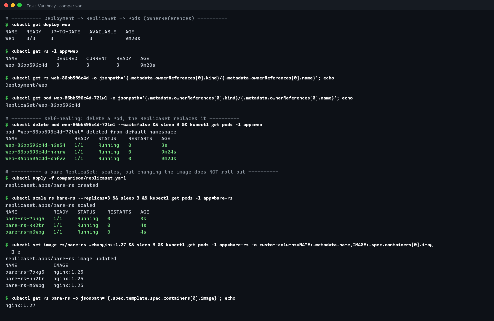
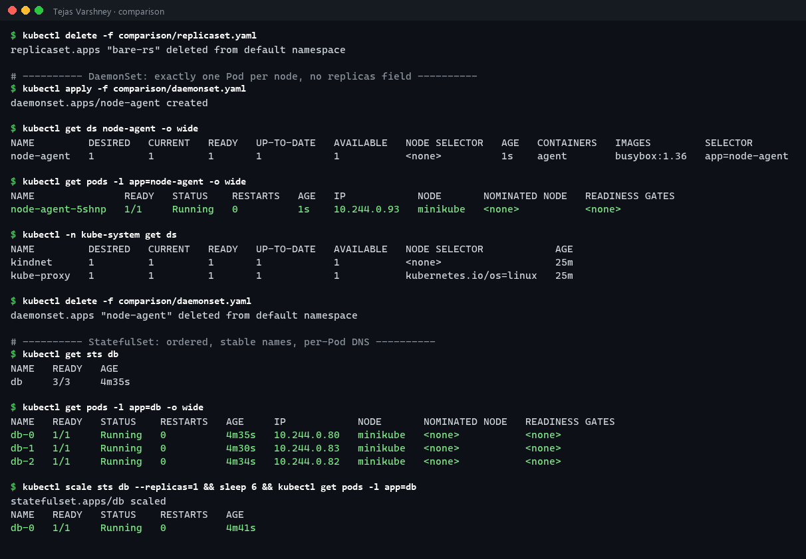
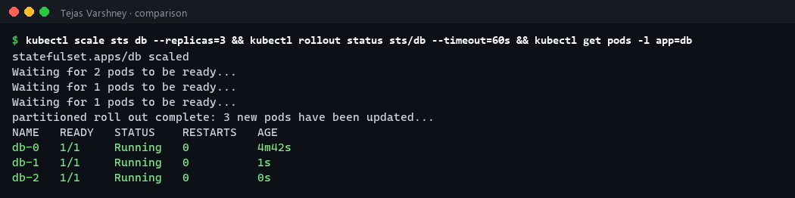

# Kubernetes Object Comparison

> 📸 **Screenshots:** the terminal images on this page are rendered from the exact command output captured during my runs (full text is under each *Text output* section).

Hands-on output for everything below is at the end of this page ([daemonset.yaml](daemonset.yaml), [replicaset.yaml](replicaset.yaml), plus the `web` Deployment and `db` StatefulSet from the Services demo).

---

## 1. Deployment vs ReplicaSet

| | ReplicaSet | Deployment |
|---|---|---|
| **Purpose** | Keep exactly N identical Pods running | Declarative updates for Pods; manages ReplicaSets for you |
| **Pod management** | Creates/deletes Pods directly to match `replicas` and its label selector | Doesn't touch Pods directly; it creates a ReplicaSet per Pod-template version |
| **Scaling** | `kubectl scale rs` ✔ | `kubectl scale deploy` ✔ (passes the count down to the current ReplicaSet) |
| **Rolling updates** | ❌ Changing the template does **not** replace existing Pods. Only *new* Pods get the new image. | ✔ `RollingUpdate` / `Recreate`, `maxSurge`, `maxUnavailable`, `rollout status/pause/resume` |
| **Rollback** | ❌ | ✔ `kubectl rollout undo` (old ReplicaSets kept, up to `revisionHistoryLimit`) |
| **When to use** | Almost never directly | Default for stateless apps |

**Relationship:** `Deployment ──owns──▶ ReplicaSet (one per template hash) ──owns──▶ Pods`. You can see it in `ownerReferences`, and in Pod names: `web-86bb596c4d-xhfvv` = Deployment `web` + ReplicaSet hash `86bb596c4d` + random suffix. On an update, the Deployment creates a new ReplicaSet and shifts replicas from the old one to the new one (see Session 10).

**Proven in my output below:** I ran `kubectl set image` on a bare ReplicaSet. The template changed to `nginx:1.27`, but all 3 running Pods stayed on `nginx:1.25`. A ReplicaSet only cares about the **count** of Pods matching its selector, not their spec.

## 2. Deployment vs DaemonSet vs StatefulSet

| | Deployment | DaemonSet | StatefulSet |
|---|---|---|---|
| **Use case** | Stateless apps: web/API servers, workers | One agent per node: log collectors (Fluent Bit), monitoring (node-exporter), CNI (kindnet, Calico), kube-proxy | Stateful apps needing identity: databases, Kafka, ZooKeeper, Elasticsearch |
| **Pod creation** | All at once, random names (`web-86bb…-xhfvv`) | One Pod per (matching) node, created automatically when a node joins | **Ordered** `db-0`, `db-1`, `db-2`. Each waits for the previous to be Ready; scale-down removes the highest ordinal first |
| **Scaling** | `replicas: N` | No `replicas`; count = number of eligible nodes (`nodeSelector` / tolerations) | `replicas: N`, scaled one Pod at a time in order |
| **Networking** | Shared ClusterIP Service; Pods are interchangeable | Often `hostNetwork`/`hostPort`; reached per node | **Headless Service** gives each Pod a stable DNS name `db-0.db-headless.ns.svc.cluster.local` |
| **Storage** | Shared PVC (or none); all replicas see the same volume | Usually `hostPath` (node logs, `/proc`) | `volumeClaimTemplates`: **one PVC per Pod** (`data-db-0`), re-attached to the same Pod after rescheduling |
| **Identity after restart** | New name, new IP | Tied to the node | **Same name, same PVC**, new IP |
| **Examples** | nginx, React frontend, Node/Java API | `kube-proxy`, `kindnet` (seen in my `kube-system`), Datadog agent | MySQL, PostgreSQL, MongoDB replica set, RabbitMQ |

## 3. ReplicaSet vs Service

| | ReplicaSet | Service |
|---|---|---|
| **Responsibility** | *How many* Pods exist. Creates replacements when Pods die. | *How to reach* the Pods. A stable virtual IP + DNS name in front of them. |
| **Works on** | Pod lifecycle (create/delete) | Network traffic (load-balancing) |
| **Finds Pods by** | Label selector | Label selector (the same labels, but completely independent of the ReplicaSet) |
| **Knows about the other?** | No | No |

**Why a Service is required:** Pods are ephemeral. Each time the ReplicaSet replaces a Pod, the new one gets a **new IP** (I saw `db-1` change `10.244.0.81` → `.83`). Clients can't hard-code Pod IPs. A Service gives a **fixed ClusterIP + DNS name** that never changes, and it continuously tracks which Pods are Ready.

**How traffic reaches Pods:**
1. The client Pod resolves `web-clusterip` → CoreDNS returns ClusterIP `10.102.13.85`.
2. The client sends packets to `10.102.13.85:80`.
3. The **EndpointSlice controller** keeps the list of Ready Pod IPs matching the Service selector (`10.244.0.76/77/78:8080`).
4. **kube-proxy** on every node turns that list into iptables (or IPVS/nftables) rules. The kernel DNATs the packet to one random Pod IP:targetPort.
5. Pods failing their readiness probe are removed from the EndpointSlice, so they stop getting traffic without being killed.

So: **ReplicaSet keeps the Pods alive, and the Service makes them reachable.**

---

## Hands-on output





<details><summary>Text output</summary>

```text
# ---------- Deployment -> ReplicaSet -> Pods (ownerReferences) ----------
$ kubectl get deploy web
NAME   READY   UP-TO-DATE   AVAILABLE   AGE
web    3/3     3            3           9m20s

$ kubectl get rs -l app=web
NAME             DESIRED   CURRENT   READY   AGE
web-86bb596c4d   3         3         3       9m20s

$ kubectl get rs web-86bb596c4d -o jsonpath='{.metadata.ownerReferences[0].kind}/{.metadata.ownerReferences[0].name}'; echo
Deployment/web

$ kubectl get pod web-86bb596c4d-72lwl -o jsonpath='{.metadata.ownerReferences[0].kind}/{.metadata.ownerReferences[0].name}'; echo
ReplicaSet/web-86bb596c4d

# ---------- self-healing: delete a Pod, the ReplicaSet replaces it ----------
$ kubectl delete pod web-86bb596c4d-72lwl --wait=false && sleep 3 && kubectl get pods -l app=web
pod "web-86bb596c4d-72lwl" deleted from default namespace
NAME                   READY   STATUS    RESTARTS   AGE
web-86bb596c4d-h6s54   1/1     Running   0          3s
web-86bb596c4d-nknrw   1/1     Running   0          9m24s
web-86bb596c4d-xhfvv   1/1     Running   0          9m24s

# ---------- a bare ReplicaSet: scales, but changing the image does NOT roll out ----------
$ kubectl apply -f comparison/replicaset.yaml
replicaset.apps/bare-rs created

$ kubectl scale rs bare-rs --replicas=3 && sleep 3 && kubectl get pods -l app=bare-rs
replicaset.apps/bare-rs scaled
NAME            READY   STATUS    RESTARTS   AGE
bare-rs-7bkg5   1/1     Running   0          3s
bare-rs-kk2tr   1/1     Running   0          4s
bare-rs-m6wpg   1/1     Running   0          4s

$ kubectl set image rs/bare-rs web=nginx:1.27 && sleep 3 && kubectl get pods -l app=bare-rs -o custom-columns=NAME:.metadata.name,IMAGE:.spec.containers[0].image
replicaset.apps/bare-rs image updated
NAME            IMAGE
bare-rs-7bkg5   nginx:1.25
bare-rs-kk2tr   nginx:1.25
bare-rs-m6wpg   nginx:1.25

$ kubectl get rs bare-rs -o jsonpath='{.spec.template.spec.containers[0].image}'; echo
nginx:1.27

$ kubectl delete -f comparison/replicaset.yaml
replicaset.apps "bare-rs" deleted from default namespace

# ---------- DaemonSet: exactly one Pod per node, no replicas field ----------
$ kubectl apply -f comparison/daemonset.yaml
daemonset.apps/node-agent created

$ kubectl get ds node-agent -o wide
NAME         DESIRED   CURRENT   READY   UP-TO-DATE   AVAILABLE   NODE SELECTOR   AGE   CONTAINERS   IMAGES         SELECTOR
node-agent   1         1         1       1            1           <none>          1s    agent        busybox:1.36   app=node-agent

$ kubectl get pods -l app=node-agent -o wide
NAME               READY   STATUS    RESTARTS   AGE   IP            NODE       NOMINATED NODE   READINESS GATES
node-agent-5shnp   1/1     Running   0          1s    10.244.0.93   minikube   <none>           <none>

$ kubectl -n kube-system get ds
NAME         DESIRED   CURRENT   READY   UP-TO-DATE   AVAILABLE   NODE SELECTOR            AGE
kindnet      1         1         1       1            1           <none>                   25m
kube-proxy   1         1         1       1            1           kubernetes.io/os=linux   25m

$ kubectl delete -f comparison/daemonset.yaml
daemonset.apps "node-agent" deleted from default namespace

# ---------- StatefulSet: ordered, stable names, per-Pod DNS ----------
$ kubectl get sts db
NAME   READY   AGE
db     3/3     4m35s

$ kubectl get pods -l app=db -o wide
NAME   READY   STATUS    RESTARTS   AGE     IP            NODE       NOMINATED NODE   READINESS GATES
db-0   1/1     Running   0          4m35s   10.244.0.80   minikube   <none>           <none>
db-1   1/1     Running   0          4m30s   10.244.0.83   minikube   <none>           <none>
db-2   1/1     Running   0          4m34s   10.244.0.82   minikube   <none>           <none>

$ kubectl scale sts db --replicas=1 && sleep 6 && kubectl get pods -l app=db
statefulset.apps/db scaled
NAME   READY   STATUS    RESTARTS   AGE
db-0   1/1     Running   0          4m41s

$ kubectl scale sts db --replicas=3 && kubectl rollout status sts/db --timeout=60s && kubectl get pods -l app=db
statefulset.apps/db scaled
Waiting for 2 pods to be ready...
Waiting for 1 pods to be ready...
Waiting for 1 pods to be ready...
partitioned roll out complete: 3 new pods have been updated...
NAME   READY   STATUS    RESTARTS   AGE
db-0   1/1     Running   0          4m42s
db-1   1/1     Running   0          1s
db-2   1/1     Running   0          0s
```

</details>
