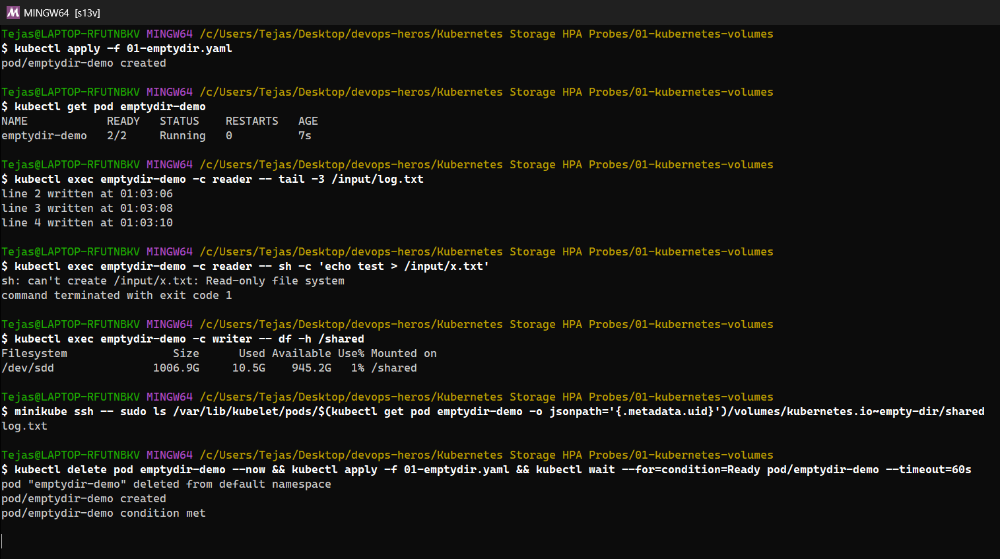
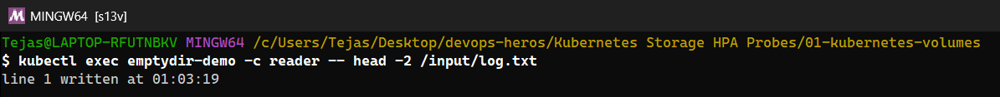
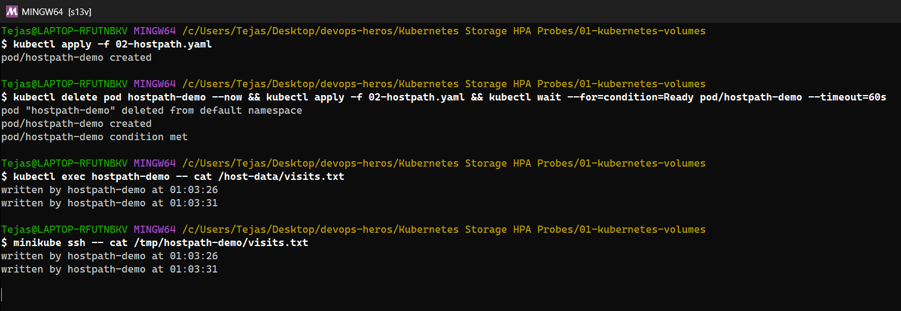
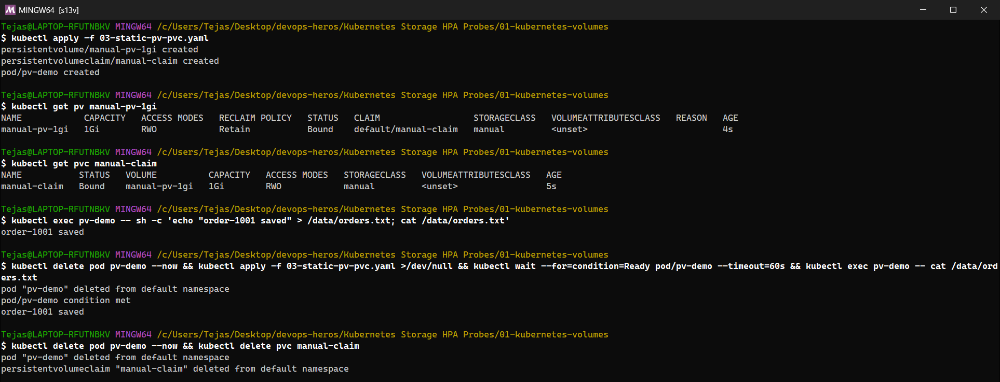
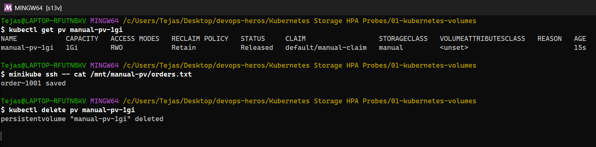
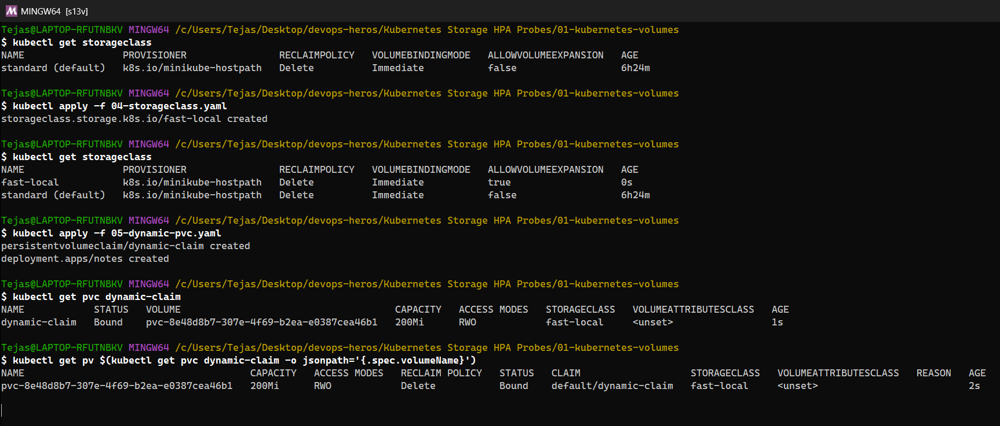
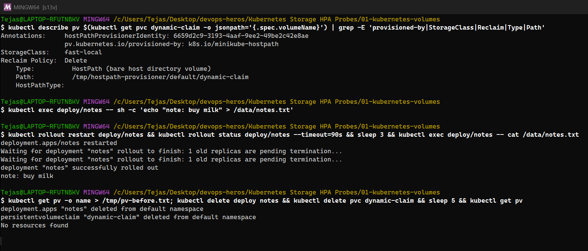

# Kubernetes Volumes – what I learned

> 📸 **Screenshots:** the terminal images are **real screenshots of my terminal window** (Git Bash on Windows 11) taken while I re-ran every command on my minikube cluster. Pod names, IPs and ages therefore differ slightly from the *Text output (original run)* sections, which keep the output from my first run.

A container's filesystem is **ephemeral**: when the container restarts, everything written to it is gone, and two containers can't see each other's files. **Volumes** solve this. A volume is declared in `spec.volumes` of the Pod and mounted into containers with `volumeMounts`.

```
                    lifetime tied to …
emptyDir     ──────▶ the Pod                (scratch / sharing between containers)
hostPath     ──────▶ the Node               (node files; avoid for apps)
PV + PVC     ──────▶ the storage backend    (real persistence, independent of Pods/Nodes)
StorageClass ──────▶ creates PVs on demand  (dynamic provisioning)
```

All examples below are in this folder and were run on my minikube cluster. The full output is at the bottom.

---

## emptyDir
- Created **empty** when the Pod is scheduled on a node, and **deleted when the Pod is deleted**. It survives *container* restarts, though.
- Shared by all containers in the Pod, which makes it the standard way to share files (sidecar log shippers, init containers preparing files).
- Backed by node disk by default, or RAM (`medium: Memory`, tmpfs). `sizeLimit` caps it.

**Example** ([01-emptydir.yaml](01-emptydir.yaml)): a `writer` container appends a line every 2s to `/shared/log.txt`, and a `reader` container mounts the same volume **read-only** at `/input`.
- The reader saw the writer's lines; writing from the reader failed with `Read-only file system`.
- On the node the data lives under `/var/lib/kubelet/pods/<pod-uid>/volumes/kubernetes.io~empty-dir/shared`.
- After deleting and recreating the Pod, the log started again at `line 1`, so the data was gone.

## hostPath
- Mounts a file or directory **from the node's filesystem** into the Pod. Data outlives the Pod but is tied to **that node**: if the Pod moves to another node, it sees different data.
- A security risk (it can expose `/var/run/docker.sock`, `/etc`), so many clusters forbid it with Pod Security Standards. Legitimate uses: node agents (log collectors reading `/var/log`, node-exporter reading `/proc`).
- `type: DirectoryOrCreate`, `Directory`, `File`, `Socket`…

**Example** ([02-hostpath.yaml](02-hostpath.yaml)): each Pod start appends a line to `/tmp/hostpath-demo/visits.txt` on the node. After deleting and recreating the Pod, the file had **both lines**, and `minikube ssh -- cat /tmp/hostpath-demo/visits.txt` showed the same file directly on the node.

## PersistentVolume (PV)
- A **cluster-level** storage resource (not namespaced) that represents a real piece of storage: an AWS EBS volume, NFS export, Azure Disk, or a host directory in labs.
- Has a capacity, **access modes** (`ReadWriteOnce` = one node, `ReadOnlyMany`, `ReadWriteMany`, `ReadWriteOncePod`), a `storageClassName`, and a **reclaim policy**:
  - `Retain`: after the claim is deleted, the PV becomes `Released` and **the data is kept** for manual recovery
  - `Delete`: the PV and the underlying disk are deleted with the claim (the default for dynamic provisioning)
- Lifecycle: `Available` → `Bound` → `Released` → (manual cleanup / reuse).

## PersistentVolumeClaim (PVC)
- A **namespaced request** for storage by an application: "I need 500Mi, ReadWriteOnce, class X". Kubernetes **binds** it to a matching PV (one-to-one).
- Pods reference the **claim**, not the PV (`persistentVolumeClaim.claimName`). Developers don't need to know which disk they get.
- The data outlives Pods: delete or reschedule the Pod and the new one mounts the same claim.

**Example, static provisioning** ([03-static-pv-pvc.yaml](03-static-pv-pvc.yaml)): an "admin" PV `manual-pv-1gi` (1Gi, `Retain`, class `manual`) and a PVC `manual-claim` asking for 500Mi of class `manual`.
- Both became `Bound`. The PVC shows capacity **1Gi**, because it gets the whole PV, which can be bigger than requested.
- Wrote `order-1001 saved`, deleted the Pod, and the new Pod read it back.
- Deleting the PVC turned the PV into **`Released`**, and the file **was still on the node** (`/mnt/manual-pv/orders.txt`). That's the `Retain` policy protecting data.

## StorageClass
- Describes a **"class" of storage** and *how to create it*: the **provisioner** (CSI driver, e.g. `ebs.csi.aws.com`, `pd.csi.storage.gke.io`, `k8s.io/minikube-hostpath`), parameters (disk type `gp3`, IOPS, encryption), `reclaimPolicy`, `volumeBindingMode` (`Immediate` or `WaitForFirstConsumer` = create the disk in the AZ where the Pod lands), and `allowVolumeExpansion`.
- One class can be the **default** (annotation `storageclass.kubernetes.io/is-default-class`). PVCs without `storageClassName` use it. minikube's default is `standard`.

**Example** ([04-storageclass.yaml](04-storageclass.yaml)): my own class `fast-local` (same minikube provisioner, `allowVolumeExpansion: true`).

## Dynamic provisioning
- No admin pre-creates PVs. When a PVC names a StorageClass, the class's **provisioner automatically creates a PV** (and the real disk) sized to the request, then binds it.
- This is how storage works in real clusters (EKS + EBS CSI, etc.), and StatefulSets use it via `volumeClaimTemplates` (one PVC per replica).

**Example** ([05-dynamic-pvc.yaml](05-dynamic-pvc.yaml)): PVC `dynamic-claim` (200Mi, class `fast-local`) + a Deployment using it.
- Within a second a PV named `pvc-6cfad988-…` appeared, annotated `pv.kubernetes.io/provisioned-by: k8s.io/minikube-hostpath`, backed by `/tmp/hostpath-provisioner/default/dynamic-claim`.
- `note: buy milk` survived a `kubectl rollout restart` (new Pod, same data).
- Deleting the PVC **deleted the PV automatically** (`NotFound`), because the reclaim policy is `Delete`.

## Summary

| | emptyDir | hostPath | PV/PVC (static) | StorageClass (dynamic) |
|---|---|---|---|---|
| Survives container restart | ✅ | ✅ | ✅ | ✅ |
| Survives Pod deletion | ❌ | ✅ (same node only) | ✅ | ✅ |
| Survives node loss | ❌ | ❌ | ✅ (network storage) | ✅ |
| Who creates storage | kubelet | Already on the node | Admin creates PV | Provisioner, automatically |
| Typical use | Cache, scratch, sidecar sharing | Node agents | Pre-existing disks/NFS | Databases, StatefulSets, almost everything |

---

## Hands-on output









<details><summary>Text output (original run)</summary>

```text
################ emptyDir ################
$ kubectl apply -f 01-emptydir.yaml
pod/emptydir-demo created

$ kubectl get pod emptydir-demo
NAME            READY   STATUS    RESTARTS   AGE
emptydir-demo   2/2     Running   0          7s

$ kubectl exec emptydir-demo -c reader -- tail -3 /input/log.txt
line 2 written at 19:15:44
line 3 written at 19:15:46
line 4 written at 19:15:48

$ kubectl exec emptydir-demo -c reader -- sh -c 'echo test > /input/x.txt'
sh: can't create /input/x.txt: Read-only file system
command terminated with exit code 1

$ kubectl exec emptydir-demo -c writer -- df -h /shared
Filesystem                Size      Used Available Use% Mounted on
/dev/sde               1006.9G      9.0G    946.6G   1% /shared

$ minikube ssh -- sudo ls /var/lib/kubelet/pods/742ed947-645f-43e0-93ea-5a51e068f4c7/volumes/kubernetes.io~empty-dir/shared
log.txt

$ kubectl delete pod emptydir-demo --now && kubectl apply -f 01-emptydir.yaml && kubectl wait --for=condition=Ready pod/emptydir-demo --timeout=60s
pod "emptydir-demo" deleted from default namespace
pod/emptydir-demo created
pod/emptydir-demo condition met

$ kubectl exec emptydir-demo -c reader -- head -2 /input/log.txt
line 1 written at 19:15:54

################ hostPath ################
$ kubectl apply -f 02-hostpath.yaml
pod/hostpath-demo created

$ kubectl delete pod hostpath-demo --now && kubectl apply -f 02-hostpath.yaml && kubectl wait --for=condition=Ready pod/hostpath-demo --timeout=60s
pod "hostpath-demo" deleted from default namespace
pod/hostpath-demo created
pod/hostpath-demo condition met

$ kubectl exec hostpath-demo -- cat /host-data/visits.txt
written by hostpath-demo at 19:15:55
written by hostpath-demo at 19:15:59

$ minikube ssh -- cat /tmp/hostpath-demo/visits.txt
written by hostpath-demo at 19:15:55
written by hostpath-demo at 19:15:59

################ static PersistentVolume + PersistentVolumeClaim ################
$ kubectl apply -f 03-static-pv-pvc.yaml
persistentvolume/manual-pv-1gi created
persistentvolumeclaim/manual-claim created
pod/pv-demo created

$ kubectl get pv manual-pv-1gi
NAME            CAPACITY   ACCESS MODES   RECLAIM POLICY   STATUS   CLAIM                  STORAGECLASS   VOLUMEATTRIBUTESCLASS   REASON   AGE
manual-pv-1gi   1Gi        RWO            Retain           Bound    default/manual-claim   manual         <unset>                          1s

$ kubectl get pvc manual-claim
NAME           STATUS   VOLUME          CAPACITY   ACCESS MODES   STORAGECLASS   VOLUMEATTRIBUTESCLASS   AGE
manual-claim   Bound    manual-pv-1gi   1Gi        RWO            manual         <unset>                 1s

$ kubectl exec pv-demo -- sh -c 'echo "order-1001 saved" > /data/orders.txt; cat /data/orders.txt'
order-1001 saved

$ kubectl delete pod pv-demo --now && kubectl apply -f 03-static-pv-pvc.yaml >/dev/null && kubectl wait --for=condition=Ready pod/pv-demo --timeout=60s && kubectl exec pv-demo -- cat /data/orders.txt
pod "pv-demo" deleted from default namespace
pod/pv-demo condition met
order-1001 saved

# --- Retain policy: deleting the PVC releases the PV but keeps the data ---
$ kubectl delete pod pv-demo --now && kubectl delete pvc manual-claim
pod "pv-demo" deleted from default namespace
persistentvolumeclaim "manual-claim" deleted from default namespace

$ kubectl get pv manual-pv-1gi
NAME            CAPACITY   ACCESS MODES   RECLAIM POLICY   STATUS     CLAIM                  STORAGECLASS   VOLUMEATTRIBUTESCLASS   REASON   AGE
manual-pv-1gi   1Gi        RWO            Retain           Released   default/manual-claim   manual         <unset>                          9s

$ minikube ssh -- cat /mnt/manual-pv/orders.txt
order-1001 saved

$ kubectl delete pv manual-pv-1gi
persistentvolume "manual-pv-1gi" deleted

################ StorageClass + dynamic provisioning ################
$ kubectl get storageclass
NAME                 PROVISIONER                RECLAIMPOLICY   VOLUMEBINDINGMODE   ALLOWVOLUMEEXPANSION   AGE
standard (default)   k8s.io/minikube-hostpath   Delete          Immediate           false                  36m

$ kubectl apply -f 04-storageclass.yaml
storageclass.storage.k8s.io/fast-local created

$ kubectl get storageclass
NAME                 PROVISIONER                RECLAIMPOLICY   VOLUMEBINDINGMODE   ALLOWVOLUMEEXPANSION   AGE
fast-local           k8s.io/minikube-hostpath   Delete          Immediate           true                   0s
standard (default)   k8s.io/minikube-hostpath   Delete          Immediate           false                  36m

$ kubectl apply -f 05-dynamic-pvc.yaml
persistentvolumeclaim/dynamic-claim created
deployment.apps/notes created

$ kubectl get pvc dynamic-claim
NAME            STATUS   VOLUME                                     CAPACITY   ACCESS MODES   STORAGECLASS   VOLUMEATTRIBUTESCLASS   AGE
dynamic-claim   Bound    pvc-6cfad988-10ad-46f4-883a-c816ed54fe3e   200Mi      RWO            fast-local     <unset>                 1s

$ kubectl get pv pvc-6cfad988-10ad-46f4-883a-c816ed54fe3e
NAME                                       CAPACITY   ACCESS MODES   RECLAIM POLICY   STATUS   CLAIM                   STORAGECLASS   VOLUMEATTRIBUTESCLASS   REASON   AGE
pvc-6cfad988-10ad-46f4-883a-c816ed54fe3e   200Mi      RWO            Delete           Bound    default/dynamic-claim   fast-local     <unset>                          2s

$ kubectl describe pv pvc-6cfad988-10ad-46f4-883a-c816ed54fe3e | grep -E 'Annotations|provisioned-by|StorageClass|Reclaim|Source|Path'
Annotations:     hostPathProvisionerIdentity: 855b89c4-bb48-416c-9b3d-57aa24c3caa7
                 pv.kubernetes.io/provisioned-by: k8s.io/minikube-hostpath
StorageClass:    fast-local
Reclaim Policy:  Delete
Source:
    Type:          HostPath (bare host directory volume)
    Path:          /tmp/hostpath-provisioner/default/dynamic-claim
    HostPathType:  

$ kubectl exec deploy/notes -- sh -c 'echo "note: buy milk" > /data/notes.txt'

$ kubectl rollout restart deploy/notes && kubectl rollout status deploy/notes --timeout=90s && sleep 3 && kubectl exec deploy/notes -- cat /data/notes.txt
deployment.apps/notes restarted
Waiting for deployment "notes" rollout to finish: 1 old replicas are pending termination...
Waiting for deployment "notes" rollout to finish: 1 old replicas are pending termination...
deployment "notes" successfully rolled out
note: buy milk

# --- Delete policy: deleting the PVC deletes the dynamically created PV ---
$ kubectl delete deploy notes && kubectl delete pvc dynamic-claim && sleep 5 && kubectl get pv pvc-6cfad988-10ad-46f4-883a-c816ed54fe3e
deployment.apps "notes" deleted from default namespace
persistentvolumeclaim "dynamic-claim" deleted from default namespace
Error from server (NotFound): persistentvolumes "pvc-6cfad988-10ad-46f4-883a-c816ed54fe3e" not found
```

</details>
