# Session 13: Kubernetes Storage, HPA & Probes

> 📸 **Screenshots:** the terminal images are **real screenshots of my terminal window** (Git Bash on Windows 11) taken while I re-ran every command on my minikube cluster. Pod names, IPs and ages therefore differ slightly from the *Text output (original run)* sections, which keep the output from my first run.

**Name:** Tejas Varshney  
**Cluster:** minikube v1.39.0 (Kubernetes v1.37.0) with the `metrics-server` add-on, on Windows 11

| Task | Where |
|---|---|
| 1. Kubernetes volumes | [01-kubernetes-volumes/README.md](01-kubernetes-volumes/README.md) (notes + 5 hands-on manifests) |
| 2. HPA hands-on | [02-hpa](02-hpa): `hpa.yml` (course file), `deployment.yaml`, `service.yaml`, `load-generator.yaml`, `load_generator.sh` |
| 3. Mini project | [03-mini-project](03-mini-project): namespace, PVC, Deployment with 3 probes, Service, HPA |
| Raw outputs | [outputs/](outputs) |

---

## Task 1 – Kubernetes volumes

Full notes with practical examples: **[01-kubernetes-volumes/README.md](01-kubernetes-volumes/README.md)**. It covers emptyDir, hostPath, PersistentVolume, PersistentVolumeClaim, StorageClass and dynamic provisioning, each demonstrated on my cluster.

---

## Task 2 – HPA hands-on

I used the course's [`hpa.yml`](02-hpa/hpa.yml) unchanged: target Deployment `yatri-backend`, **min 2 / max 10** replicas, **50% average CPU**.

The course folder only had the HPA and Service, so I wrote [`deployment.yaml`](02-hpa/deployment.yaml) using `registry.k8s.io/hpa-example`, a PHP page that burns CPU on every request. It sets `requests.cpu: 200m`, because HPA utilisation is measured **against the request**. The Service's `targetPort` is changed from 5000 to 80 to match that image.

The course's [`load_generator.sh`](02-hpa/load_generator.sh) goes through a laptop-side `kubectl port-forward`, which becomes the bottleneck. So I generated load **inside the cluster** with [`load-generator.yaml`](02-hpa/load-generator.yaml): 4 busybox Pods looping `wget`.

```bash
kubectl apply -f 02-hpa/deployment.yaml -f 02-hpa/service.yaml   # 1. deploy
kubectl apply -f 02-hpa/hpa.yml                                  # 2. configure HPA
kubectl get hpa ; kubectl describe hpa yatri-backend-hpa         # 3. verify
kubectl apply -f 02-hpa/load-generator.yaml                      # 4-5. load
kubectl top pods ; kubectl get hpa -w                            # 6-7. observe
```

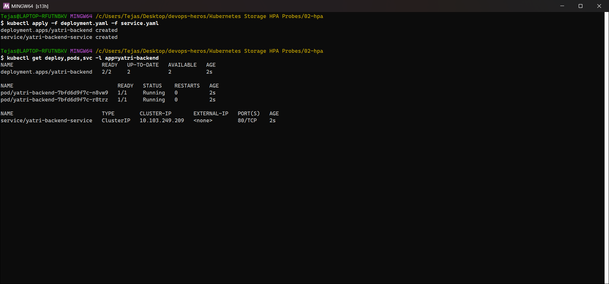
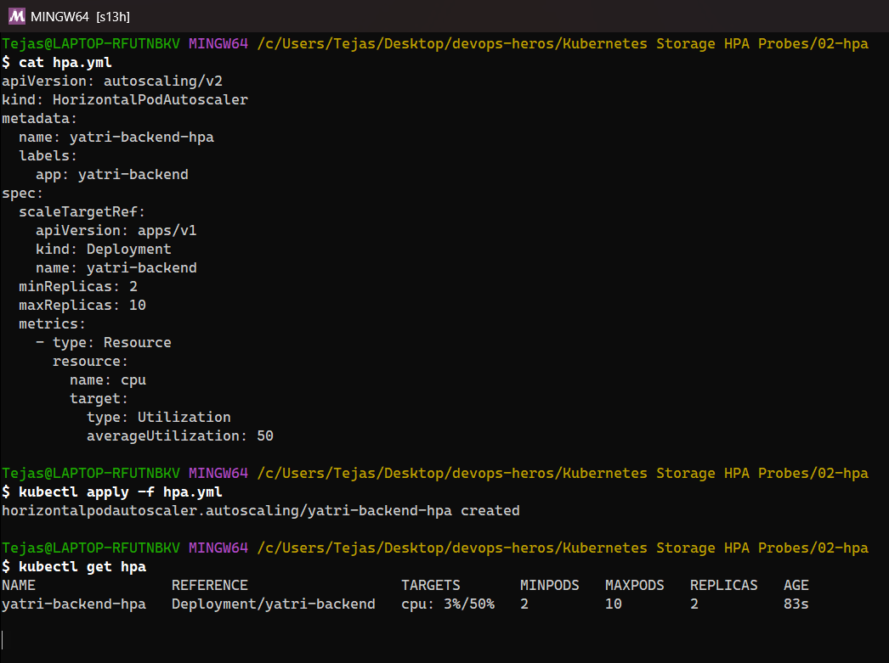
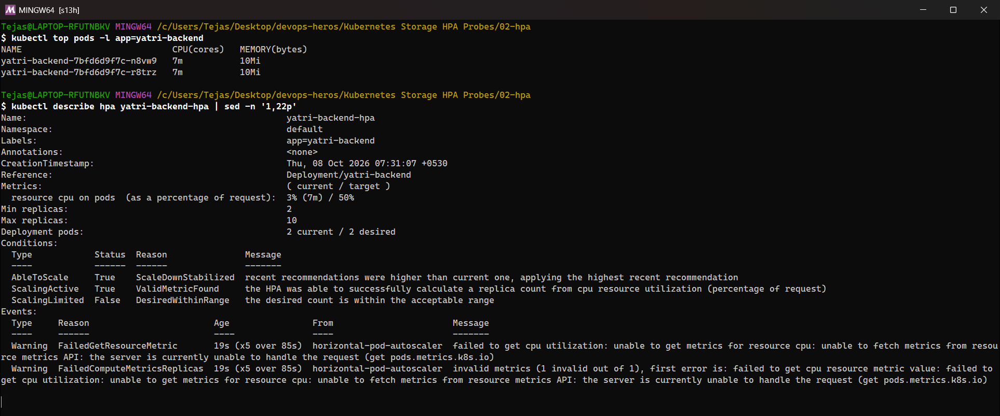
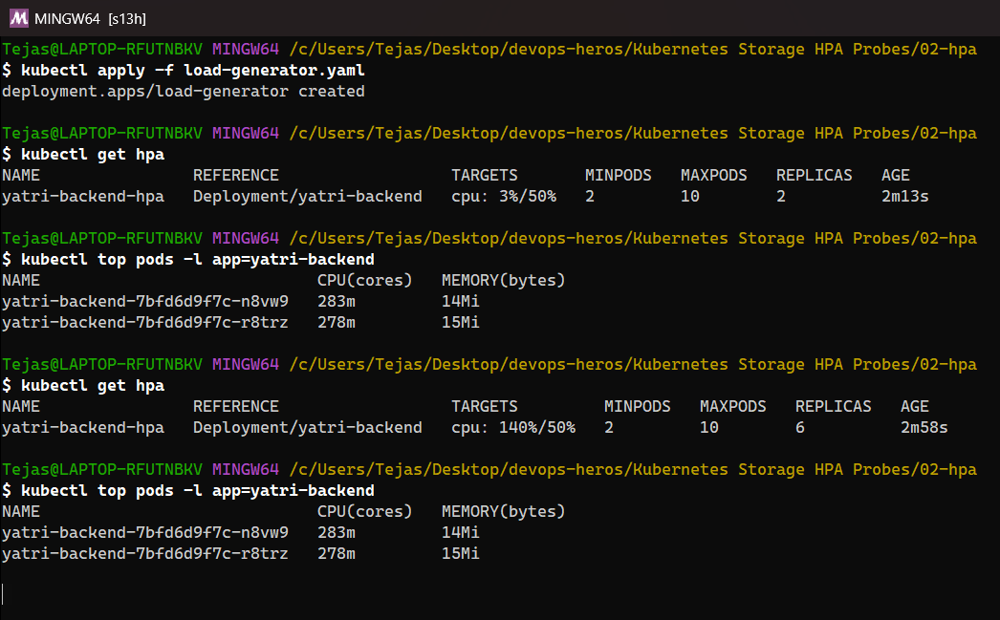
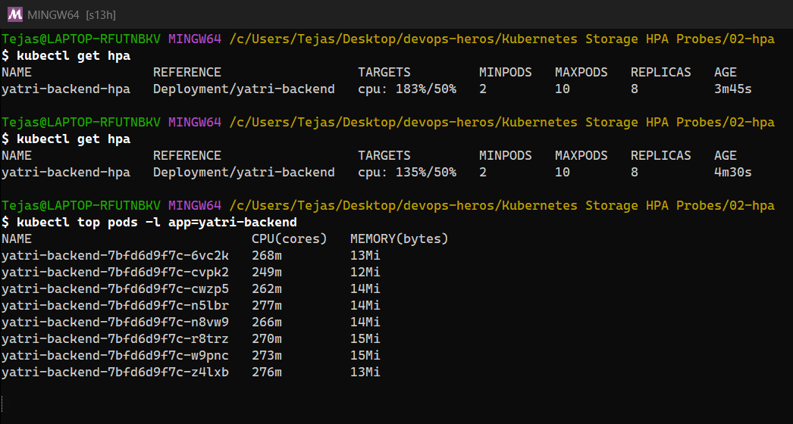
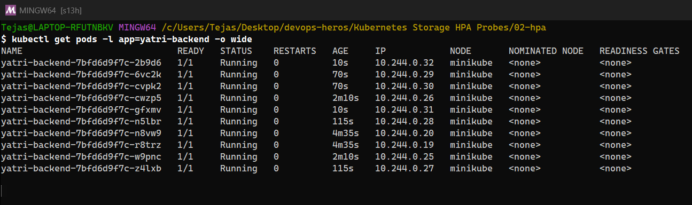
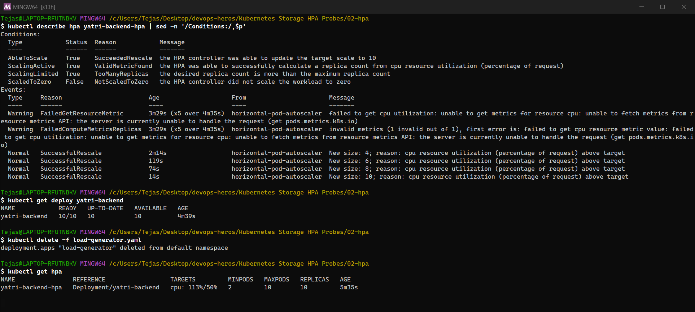
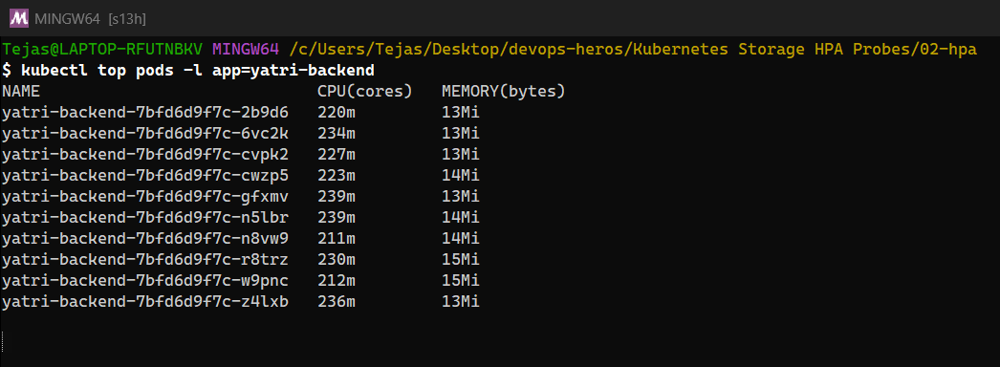
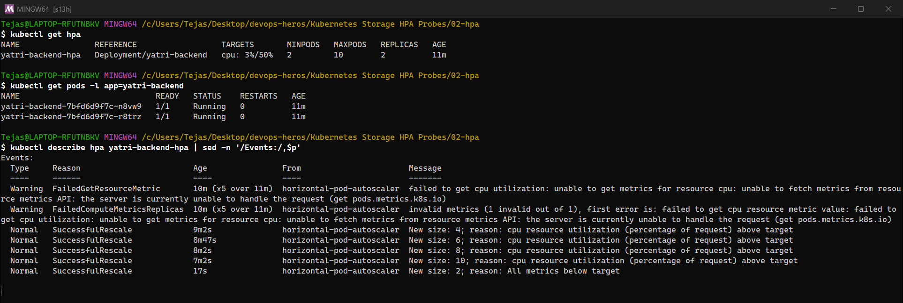

<details><summary>Text output (original run)</summary>

```text
################ 1. deploy the application ################
$ kubectl apply -f deployment.yaml -f service.yaml
deployment.apps/yatri-backend created
service/yatri-backend-service unchanged

$ kubectl get deploy,pods,svc -l app=yatri-backend
NAME                            READY   UP-TO-DATE   AVAILABLE   AGE
deployment.apps/yatri-backend   2/2     2            2           3s

NAME                                 READY   STATUS    RESTARTS   AGE
pod/yatri-backend-7bfd6d9f7c-656k7   1/1     Running   0          3s
pod/yatri-backend-7bfd6d9f7c-fvlgq   1/1     Running   0          3s

NAME                            TYPE        CLUSTER-IP     EXTERNAL-IP   PORT(S)   AGE
service/yatri-backend-service   ClusterIP   10.97.182.49   <none>        80/TCP    18m

################ 2. configure HPA (hpa.yml) ################
$ cat hpa.yml
apiVersion: autoscaling/v2
kind: HorizontalPodAutoscaler
metadata:
  name: yatri-backend-hpa
  labels:
    app: yatri-backend
spec:
  scaleTargetRef:
    apiVersion: apps/v1
    kind: Deployment
    name: yatri-backend
  minReplicas: 2
  maxReplicas: 10
  metrics:
    - type: Resource
      resource:
        name: cpu
        target:
          type: Utilization
          averageUtilization: 50

$ kubectl apply -f hpa.yml
horizontalpodautoscaler.autoscaling/yatri-backend-hpa created

################ 3. verify HPA ################
$ kubectl get hpa
NAME                REFERENCE                  TARGETS       MINPODS   MAXPODS   REPLICAS   AGE
yatri-backend-hpa   Deployment/yatri-backend   cpu: 4%/50%   2         10        2          98s

$ kubectl top pods -l app=yatri-backend
NAME                             CPU(cores)   MEMORY(bytes)   
yatri-backend-7bfd6d9f7c-656k7   8m           10Mi            
yatri-backend-7bfd6d9f7c-fvlgq   8m           10Mi            

$ kubectl describe hpa yatri-backend-hpa
Name:                                                  yatri-backend-hpa
Namespace:                                             default
Labels:                                                app=yatri-backend
Annotations:                                           <none>
CreationTimestamp:                                     Thu, 08 Oct 2026 01:05:51 +0530
Reference:                                             Deployment/yatri-backend
Metrics:                                               ( current / target )
  resource cpu on pods  (as a percentage of request):  4% (8m) / 50%
Min replicas:                                          2
Max replicas:                                          10
Deployment pods:                                       2 current / 2 desired
Conditions:
  Type            Status  Reason               Message
  ----            ------  ------               -------
  AbleToScale     True    ScaleDownStabilized  recent recommendations were higher than current one, applying the highest recent recommendation
  ScalingActive   True    ValidMetricFound     the HPA was able to successfully calculate a replica count from cpu resource utilization (percentage of request)
  ScalingLimited  False   DesiredWithinRange   the desired count is within the acceptable range
Events:
  Type     Reason                        Age                From                       Message
  ----     ------                        ----               ----                       -------
  Warning  FailedGetResourceMetric       20s (x7 over 99s)  horizontal-pod-autoscaler  failed to get cpu utilization: unable to get metrics for resource cpu: unable to fetch metrics from resource metrics API: the server is currently unable to handle the request (get pods.metrics.k8s.io)
  Warning  FailedComputeMetricsReplicas  20s (x7 over 99s)  horizontal-pod-autoscaler  invalid metrics (1 invalid out of 1), first error is: failed to get cpu resource metric value: failed to get cpu utilization: unable to get metrics for resource cpu: unable to fetch metrics from resource metrics API: the server is currently unable to handle the request (get pods.metrics.k8s.io)

################ 4. deploy the load generator / 5. increase load ################
$ kubectl apply -f load-generator.yaml
deployment.apps/load-generator created

################ 6. observe CPU utilization / 7. observe Pod scaling (every 45s) ################
======== t+45s under load ========
$ kubectl get hpa
NAME                REFERENCE                  TARGETS         MINPODS   MAXPODS   REPLICAS   AGE
yatri-backend-hpa   Deployment/yatri-backend   cpu: 106%/50%   2         10        2          2m25s

$ kubectl top pods -l app=yatri-backend
NAME                             CPU(cores)   MEMORY(bytes)   
yatri-backend-7bfd6d9f7c-656k7   216m         15Mi            
yatri-backend-7bfd6d9f7c-fvlgq   209m         14Mi            

======== t+90s under load ========
$ kubectl get hpa
NAME                REFERENCE                  TARGETS         MINPODS   MAXPODS   REPLICAS   AGE
yatri-backend-hpa   Deployment/yatri-backend   cpu: 106%/50%   2         10        5          3m10s

$ kubectl top pods -l app=yatri-backend
NAME                             CPU(cores)   MEMORY(bytes)   
yatri-backend-7bfd6d9f7c-656k7   216m         15Mi            
yatri-backend-7bfd6d9f7c-fvlgq   209m         14Mi            

======== t+135s under load ========
$ kubectl get hpa
NAME                REFERENCE                  TARGETS         MINPODS   MAXPODS   REPLICAS   AGE
yatri-backend-hpa   Deployment/yatri-backend   cpu: 154%/50%   2         10        7          3m56s

$ kubectl top pods -l app=yatri-backend
NAME                             CPU(cores)   MEMORY(bytes)   
yatri-backend-7bfd6d9f7c-656k7   304m         14Mi            
yatri-backend-7bfd6d9f7c-fvlgq   314m         14Mi            
yatri-backend-7bfd6d9f7c-hmgrc   297m         13Mi            
yatri-backend-7bfd6d9f7c-k45lf   298m         14Mi            
yatri-backend-7bfd6d9f7c-vtxsb   301m         13Mi            

======== t+180s under load ========
$ kubectl get hpa
NAME                REFERENCE                  TARGETS         MINPODS   MAXPODS   REPLICAS   AGE
yatri-backend-hpa   Deployment/yatri-backend   cpu: 128%/50%   2         10        10         4m42s

$ kubectl top pods -l app=yatri-backend
NAME                             CPU(cores)   MEMORY(bytes)   
yatri-backend-7bfd6d9f7c-2pnnh   233m         13Mi            
yatri-backend-7bfd6d9f7c-656k7   279m         14Mi            
yatri-backend-7bfd6d9f7c-f64qz   237m         13Mi            
yatri-backend-7bfd6d9f7c-fvlgq   246m         14Mi            
yatri-backend-7bfd6d9f7c-hmgrc   255m         13Mi            
yatri-backend-7bfd6d9f7c-k45lf   246m         15Mi            
yatri-backend-7bfd6d9f7c-vtxsb   263m         13Mi            

======== t+225s under load ========
$ kubectl get hpa
NAME                REFERENCE                  TARGETS         MINPODS   MAXPODS   REPLICAS   AGE
yatri-backend-hpa   Deployment/yatri-backend   cpu: 102%/50%   2         10        10         5m27s

$ kubectl top pods -l app=yatri-backend
NAME                             CPU(cores)   MEMORY(bytes)   
yatri-backend-7bfd6d9f7c-2pnnh   195m         13Mi            
yatri-backend-7bfd6d9f7c-48qtg   199m         13Mi            
yatri-backend-7bfd6d9f7c-656k7   223m         14Mi            
yatri-backend-7bfd6d9f7c-88hll   227m         12Mi            
yatri-backend-7bfd6d9f7c-f64qz   205m         13Mi            
yatri-backend-7bfd6d9f7c-fvlgq   201m         14Mi            
yatri-backend-7bfd6d9f7c-hmgrc   177m         13Mi            
yatri-backend-7bfd6d9f7c-k45lf   203m         15Mi            
yatri-backend-7bfd6d9f7c-nf74x   179m         13Mi            
yatri-backend-7bfd6d9f7c-vtxsb   229m         14Mi            

======== t+270s under load ========
$ kubectl get hpa
NAME                REFERENCE                  TARGETS         MINPODS   MAXPODS   REPLICAS   AGE
yatri-backend-hpa   Deployment/yatri-backend   cpu: 102%/50%   2         10        10         6m13s

$ kubectl top pods -l app=yatri-backend
NAME                             CPU(cores)   MEMORY(bytes)   
yatri-backend-7bfd6d9f7c-2pnnh   195m         13Mi            
yatri-backend-7bfd6d9f7c-48qtg   199m         13Mi            
yatri-backend-7bfd6d9f7c-656k7   223m         14Mi            
yatri-backend-7bfd6d9f7c-88hll   227m         12Mi            
yatri-backend-7bfd6d9f7c-f64qz   205m         13Mi            
yatri-backend-7bfd6d9f7c-fvlgq   201m         14Mi            
yatri-backend-7bfd6d9f7c-hmgrc   177m         13Mi            
yatri-backend-7bfd6d9f7c-k45lf   203m         15Mi            
yatri-backend-7bfd6d9f7c-nf74x   179m         13Mi            
yatri-backend-7bfd6d9f7c-vtxsb   229m         14Mi            

$ kubectl get pods -l app=yatri-backend -o wide
NAME                             READY   STATUS    RESTARTS   AGE     IP            NODE       NOMINATED NODE   READINESS GATES
yatri-backend-7bfd6d9f7c-2pnnh   1/1     Running   0          2m54s   10.244.0.21   minikube   <none>           <none>
yatri-backend-7bfd6d9f7c-48qtg   1/1     Running   0          114s    10.244.0.25   minikube   <none>           <none>
yatri-backend-7bfd6d9f7c-656k7   1/1     Running   0          6m17s   10.244.0.12   minikube   <none>           <none>
yatri-backend-7bfd6d9f7c-88hll   1/1     Running   0          114s    10.244.0.24   minikube   <none>           <none>
yatri-backend-7bfd6d9f7c-f64qz   1/1     Running   0          2m54s   10.244.0.22   minikube   <none>           <none>
yatri-backend-7bfd6d9f7c-fvlgq   1/1     Running   0          6m17s   10.244.0.13   minikube   <none>           <none>
yatri-backend-7bfd6d9f7c-hmgrc   1/1     Running   0          3m54s   10.244.0.18   minikube   <none>           <none>
yatri-backend-7bfd6d9f7c-k45lf   1/1     Running   0          3m39s   10.244.0.20   minikube   <none>           <none>
yatri-backend-7bfd6d9f7c-nf74x   1/1     Running   0          114s    10.244.0.23   minikube   <none>           <none>
yatri-backend-7bfd6d9f7c-vtxsb   1/1     Running   0          3m54s   10.244.0.19   minikube   <none>           <none>

$ kubectl describe hpa yatri-backend-hpa | sed -n '/Conditions:/,$p'
Conditions:
  Type            Status  Reason            Message
  ----            ------  ------            -------
  AbleToScale     True    ReadyForNewScale  recommended size matches current size
  ScalingActive   True    ValidMetricFound  the HPA was able to successfully calculate a replica count from cpu resource utilization (percentage of request)
  ScalingLimited  True    TooManyReplicas   the desired replica count is more than the maximum replica count
  ScaledToZero    False   NotScaledToZero   the HPA controller did not scale the workload to zero
Events:
  Type     Reason                        Age                    From                       Message
  ----     ------                        ----                   ----                       -------
  Warning  FailedGetResourceMetric       4m55s (x7 over 6m14s)  horizontal-pod-autoscaler  failed to get cpu utilization: unable to get metrics for resource cpu: unable to fetch metrics from resource metrics API: the server is currently unable to handle the request (get pods.metrics.k8s.io)
  Warning  FailedComputeMetricsReplicas  4m55s (x7 over 6m14s)  horizontal-pod-autoscaler  invalid metrics (1 invalid out of 1), first error is: failed to get cpu resource metric value: failed to get cpu utilization: unable to get metrics for resource cpu: unable to fetch metrics from resource metrics API: the server is currently unable to handle the request (get pods.metrics.k8s.io)
  Normal   SuccessfulRescale             3m55s                  horizontal-pod-autoscaler  New size: 4; reason: cpu resource utilization (percentage of request) above target
  Normal   SuccessfulRescale             3m40s                  horizontal-pod-autoscaler  New size: 5; reason:
  Normal   SuccessfulRescale             2m55s                  horizontal-pod-autoscaler  New size: 7; reason: cpu resource utilization (percentage of request) above target
  Normal   SuccessfulRescale             115s                   horizontal-pod-autoscaler  New size: 10; reason: cpu resource utilization (percentage of request) above target

$ kubectl get deploy yatri-backend
NAME            READY   UP-TO-DATE   AVAILABLE   AGE
yatri-backend   10/10   10           10          6m18s

################ stop the load -> scale down (5-minute stabilization window) ################
$ kubectl delete -f load-generator.yaml
deployment.apps "load-generator" deleted from default namespace

$ kubectl get hpa
NAME                REFERENCE                  TARGETS       MINPODS   MAXPODS   REPLICAS   AGE
yatri-backend-hpa   Deployment/yatri-backend   cpu: 4%/50%   2         10        10         12m

$ kubectl top pods -l app=yatri-backend
NAME                             CPU(cores)   MEMORY(bytes)   
yatri-backend-7bfd6d9f7c-2pnnh   8m           13Mi            
yatri-backend-7bfd6d9f7c-48qtg   9m           13Mi            
yatri-backend-7bfd6d9f7c-656k7   9m           14Mi            
yatri-backend-7bfd6d9f7c-88hll   9m           13Mi            
yatri-backend-7bfd6d9f7c-f64qz   9m           14Mi            
yatri-backend-7bfd6d9f7c-fvlgq   9m           14Mi            
yatri-backend-7bfd6d9f7c-hmgrc   8m           14Mi            
yatri-backend-7bfd6d9f7c-k45lf   8m           15Mi            
yatri-backend-7bfd6d9f7c-nf74x   9m           14Mi            
yatri-backend-7bfd6d9f7c-vtxsb   9m           14Mi            

$ kubectl get pods -l app=yatri-backend
NAME                             READY   STATUS    RESTARTS   AGE
yatri-backend-7bfd6d9f7c-2pnnh   1/1     Running   0          9m36s
yatri-backend-7bfd6d9f7c-48qtg   1/1     Running   0          8m36s
yatri-backend-7bfd6d9f7c-656k7   1/1     Running   0          12m
yatri-backend-7bfd6d9f7c-88hll   1/1     Running   0          8m36s
yatri-backend-7bfd6d9f7c-f64qz   1/1     Running   0          9m36s
yatri-backend-7bfd6d9f7c-fvlgq   1/1     Running   0          12m
yatri-backend-7bfd6d9f7c-hmgrc   1/1     Running   0          10m
yatri-backend-7bfd6d9f7c-k45lf   1/1     Running   0          10m
yatri-backend-7bfd6d9f7c-nf74x   1/1     Running   0          8m36s
yatri-backend-7bfd6d9f7c-vtxsb   1/1     Running   0          10m

$ kubectl describe hpa yatri-backend-hpa | sed -n '/Events:/,$p'
Events:
  Type     Reason                        Age                From                       Message
  ----     ------                        ----               ----                       -------
  Warning  FailedGetResourceMetric       11m (x7 over 12m)  horizontal-pod-autoscaler  failed to get cpu utilization: unable to get metrics for resource cpu: unable to fetch metrics from resource metrics API: the server is currently unable to handle the request (get pods.metrics.k8s.io)
  Warning  FailedComputeMetricsReplicas  11m (x7 over 12m)  horizontal-pod-autoscaler  invalid metrics (1 invalid out of 1), first error is: failed to get cpu resource metric value: failed to get cpu utilization: unable to get metrics for resource cpu: unable to fetch metrics from resource metrics API: the server is currently unable to handle the request (get pods.metrics.k8s.io)
  Normal   SuccessfulRescale             10m                horizontal-pod-autoscaler  New size: 4; reason: cpu resource utilization (percentage of request) above target
  Normal   SuccessfulRescale             10m                horizontal-pod-autoscaler  New size: 5; reason:
  Normal   SuccessfulRescale             9m37s              horizontal-pod-autoscaler  New size: 7; reason: cpu resource utilization (percentage of request) above target
  Normal   SuccessfulRescale             8m37s              horizontal-pod-autoscaler  New size: 10; reason: cpu resource utilization (percentage of request) above target

$ kubectl get hpa yatri-backend-hpa -w     (full watch log, whole run)
NAME                REFERENCE                  TARGETS       MINPODS   MAXPODS   REPLICAS   AGE
yatri-backend-hpa   Deployment/yatri-backend   cpu: 4%/50%   2         10        2          100s
yatri-backend-hpa   Deployment/yatri-backend   cpu: 106%/50%   2         10        2          2m19s
yatri-backend-hpa   Deployment/yatri-backend   cpu: 106%/50%   2         10        4          2m34s
yatri-backend-hpa   Deployment/yatri-backend   cpu: 106%/50%   2         10        5          2m49s
yatri-backend-hpa   Deployment/yatri-backend   cpu: 154%/50%   2         10        5          3m19s
yatri-backend-hpa   Deployment/yatri-backend   cpu: 154%/50%   2         10        7          3m34s
yatri-backend-hpa   Deployment/yatri-backend   cpu: 128%/50%   2         10        7          4m19s
yatri-backend-hpa   Deployment/yatri-backend   cpu: 128%/50%   2         10        10         4m34s
yatri-backend-hpa   Deployment/yatri-backend   cpu: 102%/50%   2         10        10         5m19s
yatri-backend-hpa   Deployment/yatri-backend   cpu: 99%/50%    2         10        10         6m19s
yatri-backend-hpa   Deployment/yatri-backend   cpu: 62%/50%    2         10        10         7m19s
yatri-backend-hpa   Deployment/yatri-backend   cpu: 4%/50%     2         10        10         8m19s

################ ~1 minute after the capture above: scale-down completed ################
$ kubectl get hpa
NAME                REFERENCE                  TARGETS       MINPODS   MAXPODS   REPLICAS   AGE
yatri-backend-hpa   Deployment/yatri-backend   cpu: 5%/50%   2         10        2          13m

$ kubectl get pods -l app=yatri-backend
NAME                             READY   STATUS    RESTARTS   AGE
yatri-backend-7bfd6d9f7c-fvlgq   1/1     Running   0          13m
yatri-backend-7bfd6d9f7c-hmgrc   1/1     Running   0          11m

$ kubectl describe hpa yatri-backend-hpa | sed -n '/Events:/,$p'
Events:
  Type     Reason                        Age                From                       Message
  ----     ------                        ----               ----                       -------
  Warning  FailedGetResourceMetric       12m (x7 over 13m)  horizontal-pod-autoscaler  failed to get cpu utilization: unable to get metrics for resource cpu: unable to fetch metrics from resource metrics API: the server is currently unable to handle the request (get pods.metrics.k8s.io)
  Warning  FailedComputeMetricsReplicas  12m (x7 over 13m)  horizontal-pod-autoscaler  invalid metrics (1 invalid out of 1), first error is: failed to get cpu resource metric value: failed to get cpu utilization: unable to get metrics for resource cpu: unable to fetch metrics from resource metrics API: the server is currently unable to handle the request (get pods.metrics.k8s.io)
  Normal   SuccessfulRescale             11m                horizontal-pod-autoscaler  New size: 4; reason: cpu resource utilization (percentage of request) above target
  Normal   SuccessfulRescale             10m                horizontal-pod-autoscaler  New size: 5; reason:
  Normal   SuccessfulRescale             10m                horizontal-pod-autoscaler  New size: 7; reason: cpu resource utilization (percentage of request) above target
  Normal   SuccessfulRescale             9m13s              horizontal-pod-autoscaler  New size: 10; reason: cpu resource utilization (percentage of request) above target
  Normal   SuccessfulRescale             27s                horizontal-pod-autoscaler  New size: 2; reason: All metrics below target
```

</details>

### What I observed

| Time | CPU (avg of requests) | Replicas | What happened |
|---|---|---|---|
| Before load | 4% / 50% | 2 | `minReplicas` |
| ~1 min under load | **106%** / 50% | 2 → 4 → 5 | Desired = ceil(2 × 106/50) = 5 |
| ~2 min | **154%** / 50% | 7 | New Pods added load-handling capacity, but the load was still above target |
| ~3 min | 128% / 50% | **10** | Hit `maxReplicas: 10`, so it can't scale further even though CPU is still > 50% |
| Load stopped | 4% / 50% | 10 for ~5 min | **Scale-down stabilization window** (default 300s) prevents flapping |
| +~6.5 min | 5% / 50% | **2** | `SuccessfulRescale New size: 2; reason: All metrics below target` |

- The first events (`FailedGetResourceMetric … unable to fetch metrics`) appeared because metrics-server had just restarted with the cluster. The HPA reported `<unknown>` until the first metrics arrived. That's the classic HPA troubleshooting case: check `kubectl top pods` and that the Pods have CPU **requests**.
- The HPA formula is `desiredReplicas = ceil(currentReplicas × currentUtilization / targetUtilization)`. It scales up fast and scales down slowly.

---

## Task 3 – Mini project: production-ready web app

The course mini project ([03-mini-project](03-mini-project)): namespace `production-webapp`, a 500Mi RWO **PVC** mounted at `/data`, an nginx Deployment with **startup, readiness and liveness probes** and CPU requests/limits, a ClusterIP Service, and an **HPA** (2–5 replicas at 50% CPU).

<details><summary>Text output (original run)</summary>

```text
################ Step 5.1 - 5.4: deploy ################
$ kubectl apply -f namespace.yaml
namespace/production-webapp created

$ kubectl apply -f pvc.yaml
persistentvolumeclaim/web-data created

$ kubectl get pvc -n production-webapp
NAME       STATUS   VOLUME                                     CAPACITY   ACCESS MODES   STORAGECLASS   VOLUMEATTRIBUTESCLASS   AGE
web-data   Bound    pvc-665e4c7c-f0bf-445d-bee1-07b596d15204   500Mi      RWO            standard       <unset>                 0s

$ kubectl apply -f deployment.yaml -f service.yaml
deployment.apps/web-app created
service/web-service created

$ kubectl get pods -n production-webapp -o wide
NAME                      READY   STATUS    RESTARTS   AGE   IP            NODE       NOMINATED NODE   READINESS GATES
web-app-d45775485-cx8xl   1/1     Running   0          10s   10.244.0.31   minikube   <none>           <none>
web-app-d45775485-kdgnz   1/1     Running   0          10s   10.244.0.32   minikube   <none>           <none>

$ kubectl apply -f hpa.yaml
horizontalpodautoscaler.autoscaling/web-app-hpa created

$ kubectl get hpa -n production-webapp
NAME          REFERENCE            TARGETS       MINPODS   MAXPODS   REPLICAS   AGE
web-app-hpa   Deployment/web-app   cpu: 1%/50%   2         5         2          78s

$ kubectl get pvc,pv -n production-webapp
NAME                             STATUS   VOLUME                                     CAPACITY   ACCESS MODES   STORAGECLASS   VOLUMEATTRIBUTESCLASS   AGE
persistentvolumeclaim/web-data   Bound    pvc-665e4c7c-f0bf-445d-bee1-07b596d15204   500Mi      RWO            standard       <unset>                 88s

NAME                                                        CAPACITY   ACCESS MODES   RECLAIM POLICY   STATUS   CLAIM                        STORAGECLASS   VOLUMEATTRIBUTESCLASS   REASON   AGE
persistentvolume/pvc-665e4c7c-f0bf-445d-bee1-07b596d15204   500Mi      RWO            Delete           Bound    production-webapp/web-data   standard       <unset>                          88s

$ kubectl describe pod web-app-d45775485-cx8xl -n production-webapp | grep -E 'Startup|Liveness|Readiness|Requests|Limits|cpu|memory|/data|ClaimName'
    Limits:
      cpu:     200m
      memory:  128Mi
    Requests:
      cpu:        100m
      memory:     64Mi
    Liveness:     http-get http://:80/ delay=5s timeout=2s period=5s #success=1 #failure=3
    Readiness:    http-get http://:80/ delay=5s timeout=2s period=5s #success=1 #failure=2
    Startup:      http-get http://:80/ delay=0s timeout=1s period=2s #success=1 #failure=30
      /data from persistent-storage (rw)
    ClaimName:  web-data

################ Task 1: storage persistence ################
$ kubectl exec -n production-webapp web-app-d45775485-cx8xl -- sh -c 'echo "Student: Tejas Varshney" > /data/student.txt'

$ kubectl exec -n production-webapp web-app-d45775485-cx8xl -- cat /data/student.txt
Student: Tejas Varshney

$ kubectl delete pod -n production-webapp web-app-d45775485-cx8xl
pod "web-app-d45775485-cx8xl" deleted from production-webapp namespace

$ kubectl get pods -n production-webapp
NAME                      READY   STATUS    RESTARTS   AGE
web-app-d45775485-6zlg7   1/1     Running   0          12s
web-app-d45775485-kdgnz   1/1     Running   0          102s

$ kubectl exec -n production-webapp web-app-d45775485-6zlg7 -- cat /data/student.txt
Student: Tejas Varshney

################ Task 2: service verification ################
$ kubectl get svc,endpointslices -n production-webapp
NAME                  TYPE        CLUSTER-IP     EXTERNAL-IP   PORT(S)   AGE
service/web-service   ClusterIP   10.109.64.68   <none>        80/TCP    103s

NAME                                               ADDRESSTYPE   PORTS   ENDPOINTS                 AGE
endpointslice.discovery.k8s.io/web-service-p5nlh   IPv4          80      10.244.0.32,10.244.0.38   103s

$ curl -s http://localhost:8085 | head -5
<!DOCTYPE html>
<html>
<head>
<title>Welcome to nginx!</title>
<style>

################ Task 3: trigger HPA elastic scaling ################
$ kubectl run load-generator -n production-webapp --image=busybox:1.36 --restart=Never -- /bin/sh -c 'while true; do wget -q -O- http://web-service > /dev/null; done'
pod/load-generator created

======== t+45s ========
$ kubectl get hpa -n production-webapp
NAME          REFERENCE            TARGETS        MINPODS   MAXPODS   REPLICAS   AGE
web-app-hpa   Deployment/web-app   cpu: 16%/50%   2         5         2          2m22s

$ kubectl top pods -n production-webapp
NAME                      CPU(cores)   MEMORY(bytes)   
load-generator            798m         6Mi             
web-app-d45775485-6zlg7   28m          18Mi            
web-app-d45775485-kdgnz   16m          19Mi            

======== t+90s ========
$ kubectl get hpa -n production-webapp
NAME          REFERENCE            TARGETS        MINPODS   MAXPODS   REPLICAS   AGE
web-app-hpa   Deployment/web-app   cpu: 16%/50%   2         5         2          3m8s

$ kubectl top pods -n production-webapp
NAME                      CPU(cores)   MEMORY(bytes)   
load-generator            849m         8Mi             
web-app-d45775485-6zlg7   43m          19Mi            
web-app-d45775485-kdgnz   45m          19Mi            

======== t+135s ========
$ kubectl get hpa -n production-webapp
NAME          REFERENCE            TARGETS        MINPODS   MAXPODS   REPLICAS   AGE
web-app-hpa   Deployment/web-app   cpu: 44%/50%   2         5         2          3m53s

$ kubectl top pods -n production-webapp
NAME                      CPU(cores)   MEMORY(bytes)   
load-generator            849m         8Mi             
web-app-d45775485-6zlg7   43m          19Mi            
web-app-d45775485-kdgnz   45m          19Mi            

======== t+180s ========
$ kubectl get hpa -n production-webapp
NAME          REFERENCE            TARGETS        MINPODS   MAXPODS   REPLICAS   AGE
web-app-hpa   Deployment/web-app   cpu: 43%/50%   2         5         2          4m39s

$ kubectl top pods -n production-webapp
NAME                      CPU(cores)   MEMORY(bytes)   
load-generator            836m         8Mi             
web-app-d45775485-6zlg7   44m          19Mi            
web-app-d45775485-kdgnz   42m          19Mi            

$ kubectl get pods -n production-webapp -o wide
NAME                      READY   STATUS    RESTARTS   AGE     IP            NODE       NOMINATED NODE   READINESS GATES
load-generator            1/1     Running   0          3m2s    10.244.0.42   minikube   <none>           <none>
web-app-d45775485-6zlg7   1/1     Running   0          3m19s   10.244.0.38   minikube   <none>           <none>
web-app-d45775485-kdgnz   1/1     Running   0          4m49s   10.244.0.32   minikube   <none>           <none>

$ kubectl delete pod load-generator -n production-webapp --now
pod "load-generator" deleted from production-webapp namespace

$ kubectl get hpa -n production-webapp
NAME          REFERENCE            TARGETS       MINPODS   MAXPODS   REPLICAS   AGE
web-app-hpa   Deployment/web-app   cpu: 1%/50%   2         5         2          10m

$ kubectl get pods -n production-webapp
NAME                      READY   STATUS    RESTARTS   AGE
web-app-d45775485-6zlg7   1/1     Running   0          8m53s
web-app-d45775485-kdgnz   1/1     Running   0          10m

$ kubectl describe hpa web-app-hpa -n production-webapp | sed -n '/Events:/,$p'
Events:
  Type     Reason                        Age                    From                       Message
  ----     ------                        ----                   ----                       -------
  Warning  FailedGetResourceMetric       10m                    horizontal-pod-autoscaler  failed to get cpu utilization: unable to get metrics for resource cpu: no metrics returned from resource metrics API
  Warning  FailedComputeMetricsReplicas  10m                    horizontal-pod-autoscaler  invalid metrics (1 invalid out of 1), first error is: failed to get cpu resource metric value: failed to get cpu utilization: unable to get metrics for resource cpu: no metrics returned from resource metrics API
  Warning  FailedGetResourceMetric       9m13s (x4 over 9m58s)  horizontal-pod-autoscaler  failed to get cpu utilization: did not receive metrics for targeted pods (pods might be unready)
  Warning  FailedComputeMetricsReplicas  9m13s (x4 over 9m58s)  horizontal-pod-autoscaler  invalid metrics (1 invalid out of 1), first error is: failed to get cpu resource metric value: failed to get cpu utilization: did not receive metrics for targeted pods (pods might be unready)

$ kubectl get hpa -n production-webapp -w   (full watch log)
NAME          REFERENCE            TARGETS       MINPODS   MAXPODS   REPLICAS   AGE
web-app-hpa   Deployment/web-app   cpu: 1%/50%   2         5         2          97s
web-app-hpa   Deployment/web-app   cpu: 16%/50%   2         5         2          2m15s
web-app-hpa   Deployment/web-app   cpu: 44%/50%   2         5         2          3m15s
web-app-hpa   Deployment/web-app   cpu: 43%/50%   2         5         2          4m15s
web-app-hpa   Deployment/web-app   cpu: 29%/50%   2         5         2          5m15s
web-app-hpa   Deployment/web-app   cpu: 1%/50%    2         5         2          6m15s

################ Bonus 2: readiness gating ################
$ kubectl patch deploy web-app -n production-webapp --type json -p '[{"op":"replace","path":"/spec/template/spec/containers/0/readinessProbe/httpGet/path","value":"/does-not-exist"}]'
deployment.apps/web-app patched

$ kubectl get pods -n production-webapp
NAME                       READY   STATUS    RESTARTS   AGE
web-app-5945bfc776-glrm6   0/1     Running   0          39s
web-app-5945bfc776-rwvbc   0/1     Running   0          39s

$ kubectl get endpointslices -n production-webapp
NAME                ADDRESSTYPE   PORTS   ENDPOINTS                 AGE
web-service-p5nlh   IPv4          80      10.244.0.59,10.244.0.58   11m

$ kubectl describe pod -n production-webapp -l app=web-app | grep -E 'Readiness probe failed' | head -2
  Warning  Unhealthy  1s (x7 over 31s)  kubelet            Readiness probe failed: HTTP probe failed with statuscode: 404
  Warning  Unhealthy  1s (x7 over 31s)  kubelet            Readiness probe failed: HTTP probe failed with statuscode: 404

################ Bonus 3: liveness restart loop ################
$ kubectl patch deploy web-app -n production-webapp --type json -p '[{"op":"replace","path":"/spec/template/spec/containers/0/readinessProbe/httpGet/path","value":"/"},{"op":"replace","path":"/spec/template/spec/containers/0/livenessProbe/httpGet/path","value":"/crash"}]'
deployment.apps/web-app patched

$ kubectl get pods -n production-webapp
NAME                      READY   STATUS             RESTARTS      AGE
web-app-85d86b65d-4mrhq   0/1     CrashLoopBackOff   3 (14s ago)   75s
web-app-85d86b65d-wpshq   0/1     CrashLoopBackOff   3 (14s ago)   75s

$ kubectl describe pod -n production-webapp -l app=web-app | grep -E 'Liveness probe failed|will be restarted' | head -3
  Warning  Unhealthy  14s (x12 over 69s)  kubelet            Liveness probe failed: HTTP probe failed with statuscode: 404
  Normal   Killing    14s (x4 over 59s)   kubelet            Container nginx failed liveness probe, will be restarted
  Warning  Unhealthy  14s (x12 over 69s)  kubelet            Liveness probe failed: HTTP probe failed with statuscode: 404

# restore the original probes
$ kubectl apply -f deployment.yaml && kubectl rollout status deploy/web-app -n production-webapp --timeout=120s
deployment.apps/web-app configured
Waiting for deployment "web-app" rollout to finish: 0 out of 2 new replicas have been updated...
Waiting for deployment "web-app" rollout to finish: 0 out of 2 new replicas have been updated...
Waiting for deployment "web-app" rollout to finish: 0 out of 2 new replicas have been updated...
Waiting for deployment "web-app" rollout to finish: 0 out of 2 new replicas have been updated...
Waiting for deployment "web-app" rollout to finish: 0 of 2 updated replicas are available...
Waiting for deployment "web-app" rollout to finish: 1 of 2 updated replicas are available...
deployment "web-app" successfully rolled out

$ kubectl get pods,endpointslices -n production-webapp
NAME                          READY   STATUS    RESTARTS   AGE
pod/web-app-d45775485-5x89d   1/1     Running   0          8s
pod/web-app-d45775485-dkqqk   1/1     Running   0          8s

NAME                                               ADDRESSTYPE   PORTS   ENDPOINTS                 AGE
endpointslice.discovery.k8s.io/web-service-p5nlh   IPv4          80      10.244.0.76,10.244.0.77   12m
```

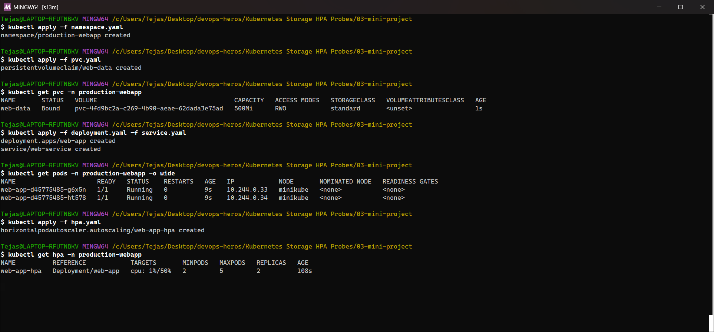
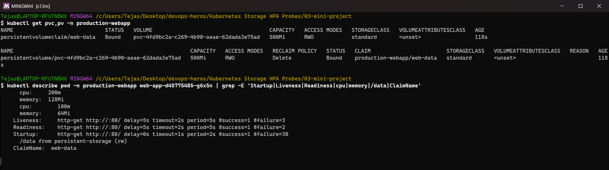
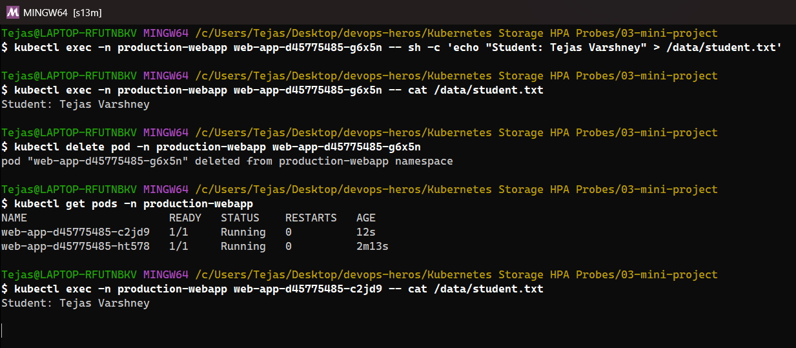
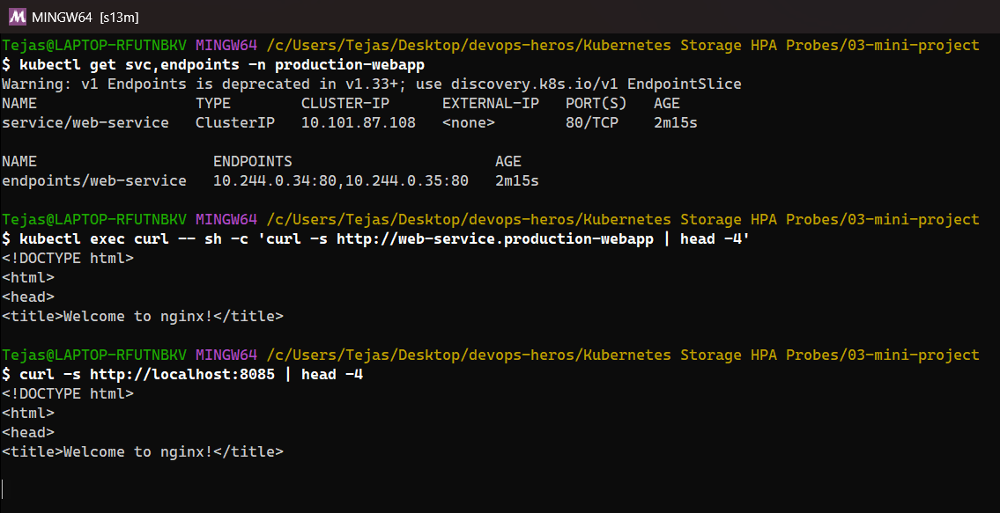
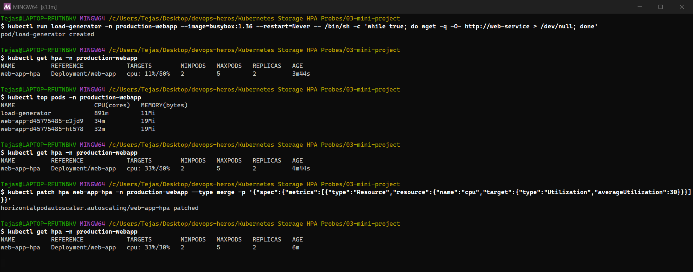
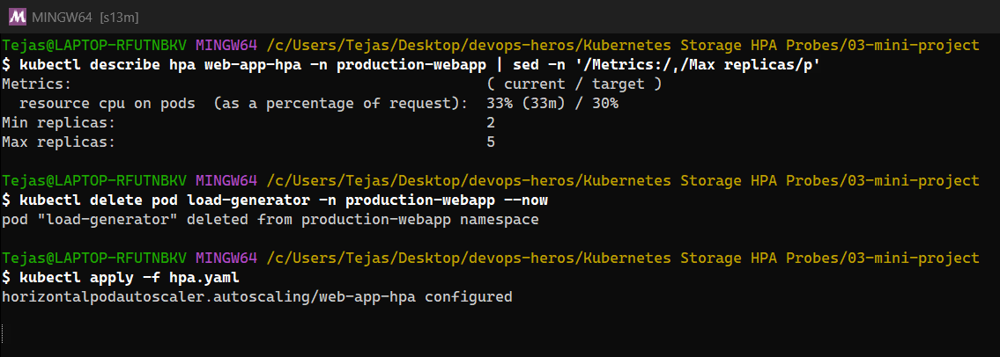
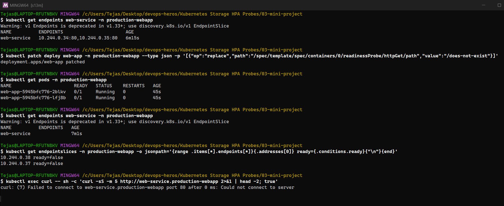
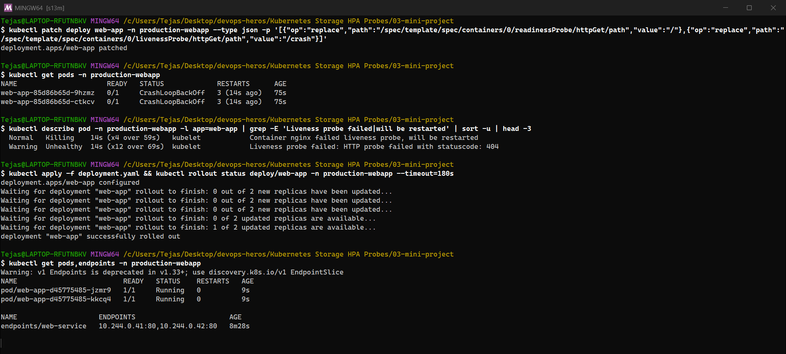

</details>

Re-run of Task 2 (my first port-forward capture came out empty), **Bonus 1** (HPA threshold 30%) and **Bonus 2** with the right command (`kubectl get endpoints` shows only *Ready* addresses; `get endpointslices` also lists not-ready ones):

<details><summary>Text output (original run)</summary>

```text
################ Task 2 (re-run): service verification ################
$ kubectl get svc,endpoints -n production-webapp
Warning: v1 Endpoints is deprecated in v1.33+; use discovery.k8s.io/v1 EndpointSlice
NAME                  TYPE        CLUSTER-IP      EXTERNAL-IP   PORT(S)   AGE
service/web-service   ClusterIP   10.97.248.119   <none>        80/TCP    8s

NAME                    ENDPOINTS                       AGE
endpoints/web-service   10.244.0.85:80,10.244.0.86:80   8s

$ kubectl exec curl -- sh -c 'curl -s http://web-service.production-webapp | head -4'
<!DOCTYPE html>
<html>
<head>
<title>Welcome to nginx!</title>

$ kubectl port-forward -n production-webapp svc/web-service 8085:80   (background)
Forwarding from 127.0.0.1:8085 -> 80
Forwarding from [::1]:8085 -> 80

$ curl -s http://localhost:8085 | head -4
<!DOCTYPE html>
<html>
<head>
<title>Welcome to nginx!</title>

################ Bonus 1: lower the HPA target from 50% to 30% ################
$ kubectl patch hpa web-app-hpa -n production-webapp --type merge -p '{"spec":{"metrics":[{"type":"Resource","resource":{"name":"cpu","target":{"type":"Utilization","averageUtilization":30}}}]}}'
horizontalpodautoscaler.autoscaling/web-app-hpa patched

$ kubectl get hpa -n production-webapp
NAME          REFERENCE            TARGETS       MINPODS   MAXPODS   REPLICAS   AGE
web-app-hpa   Deployment/web-app   cpu: 1%/30%   2         5         2          77s

$ kubectl run load-generator -n production-webapp --image=busybox:1.36 --restart=Never -- /bin/sh -c 'while true; do wget -q -O- http://web-service > /dev/null; done'
pod/load-generator created

======== t+45s ========
$ kubectl get hpa -n production-webapp
NAME          REFERENCE            TARGETS       MINPODS   MAXPODS   REPLICAS   AGE
web-app-hpa   Deployment/web-app   cpu: 1%/30%   2         5         2          2m2s

======== t+90s ========
$ kubectl get hpa -n production-webapp
NAME          REFERENCE            TARGETS        MINPODS   MAXPODS   REPLICAS   AGE
web-app-hpa   Deployment/web-app   cpu: 28%/30%   2         5         2          2m47s

======== t+135s ========
$ kubectl get hpa -n production-webapp
NAME          REFERENCE            TARGETS        MINPODS   MAXPODS   REPLICAS   AGE
web-app-hpa   Deployment/web-app   cpu: 32%/30%   2         5         2          3m32s

======== t+180s ========
$ kubectl get hpa -n production-webapp
NAME          REFERENCE            TARGETS        MINPODS   MAXPODS   REPLICAS   AGE
web-app-hpa   Deployment/web-app   cpu: 33%/30%   2         5         2          4m18s

$ kubectl top pods -n production-webapp
NAME                      CPU(cores)   MEMORY(bytes)   
load-generator            870m         11Mi            
web-app-d45775485-7m7h2   32m          19Mi            
web-app-d45775485-kdxl6   34m          19Mi            

$ kubectl get pods -n production-webapp
NAME                      READY   STATUS    RESTARTS   AGE
load-generator            1/1     Running   0          3m1s
web-app-d45775485-7m7h2   1/1     Running   0          4m18s
web-app-d45775485-kdxl6   1/1     Running   0          4m18s

$ kubectl describe hpa web-app-hpa -n production-webapp | sed -n '/Events:/,$p'
Events:
  Type     Reason                        Age                   From                       Message
  ----     ------                        ----                  ----                       -------
  Warning  FailedGetResourceMetric       4m18s                 horizontal-pod-autoscaler  failed to get cpu utilization: unable to get metrics for resource cpu: no metrics returned from resource metrics API
  Warning  FailedComputeMetricsReplicas  4m18s                 horizontal-pod-autoscaler  invalid metrics (1 invalid out of 1), first error is: failed to get cpu resource metric value: failed to get cpu utilization: unable to get metrics for resource cpu: no metrics returned from resource metrics API
  Warning  FailedGetResourceMetric       3m18s (x5 over 4m3s)  horizontal-pod-autoscaler  failed to get cpu utilization: did not receive metrics for targeted pods (pods might be unready)
  Warning  FailedComputeMetricsReplicas  3m18s (x5 over 4m3s)  horizontal-pod-autoscaler  invalid metrics (1 invalid out of 1), first error is: failed to get cpu resource metric value: failed to get cpu utilization: did not receive metrics for targeted pods (pods might be unready)

$ kubectl get hpa -n production-webapp -w   (full watch log)
NAME          REFERENCE            TARGETS       MINPODS   MAXPODS   REPLICAS   AGE
web-app-hpa   Deployment/web-app   cpu: 1%/30%   2         5         2          77s
web-app-hpa   Deployment/web-app   cpu: 28%/30%   2         5         2          2m15s
web-app-hpa   Deployment/web-app   cpu: 32%/30%   2         5         2          3m15s
web-app-hpa   Deployment/web-app   cpu: 33%/30%   2         5         2          4m15s

$ kubectl delete pod load-generator -n production-webapp --now
pod "load-generator" deleted from production-webapp namespace

$ kubectl apply -f hpa.yaml
horizontalpodautoscaler.autoscaling/web-app-hpa configured

################ Bonus 2 (re-run): readiness gating ################
$ kubectl get endpoints web-service -n production-webapp
Warning: v1 Endpoints is deprecated in v1.33+; use discovery.k8s.io/v1 EndpointSlice
NAME          ENDPOINTS                       AGE
web-service   10.244.0.85:80,10.244.0.86:80   4m21s

$ kubectl patch deploy web-app -n production-webapp --type json -p '[{"op":"replace","path":"/spec/template/spec/containers/0/readinessProbe/httpGet/path","value":"/does-not-exist"}]'
deployment.apps/web-app patched

$ kubectl get pods -n production-webapp
NAME                       READY   STATUS    RESTARTS   AGE
web-app-5945bfc776-jvrm4   0/1     Running   0          44s
web-app-5945bfc776-jxm7p   0/1     Running   0          44s

$ kubectl get endpoints web-service -n production-webapp
Warning: v1 Endpoints is deprecated in v1.33+; use discovery.k8s.io/v1 EndpointSlice
NAME          ENDPOINTS   AGE
web-service               5m6s

$ kubectl get endpointslices -n production-webapp -o jsonpath='{range .items[*].endpoints[*]}{.addresses[0]} ready={.conditions.ready}{"\n"}{end}'
10.244.0.89 ready=false
10.244.0.88 ready=false

$ kubectl exec curl -- sh -c 'curl -sS -m 5 http://web-service.production-webapp 2>&1 | head -2; true'
curl: (7) Failed to connect to web-service.production-webapp port 80 after 1 ms: Could not connect to server

$ kubectl apply -f deployment.yaml && kubectl rollout status deploy/web-app -n production-webapp --timeout=180s
deployment.apps/web-app configured
Waiting for deployment "web-app" rollout to finish: 0 out of 2 new replicas have been updated...
Waiting for deployment "web-app" rollout to finish: 0 out of 2 new replicas have been updated...
Waiting for deployment "web-app" rollout to finish: 0 out of 2 new replicas have been updated...
Waiting for deployment "web-app" rollout to finish: 0 out of 2 new replicas have been updated...
Waiting for deployment "web-app" rollout to finish: 0 of 2 updated replicas are available...
Waiting for deployment "web-app" rollout to finish: 1 of 2 updated replicas are available...
deployment "web-app" successfully rolled out

$ kubectl get endpoints web-service -n production-webapp
Warning: v1 Endpoints is deprecated in v1.33+; use discovery.k8s.io/v1 EndpointSlice
NAME          ENDPOINTS                       AGE
web-service   10.244.0.90:80,10.244.0.91:80   5m16s
```

</details>

### Results

| Check | Result |
|---|---|
| PVC | `web-data` **Bound** to a dynamically provisioned 500Mi volume (StorageClass `standard`, `k8s.io/minikube-hostpath`) |
| Task 1: persistence | Wrote `Student: Tejas Varshney` to `/data/student.txt`, deleted the Pod, and the **new Pod read the same file**. Data outlives Pods |
| Task 2: Service | `curl` through the Service (in-cluster) and through `kubectl port-forward` → `Welcome to nginx!` |
| Task 3: HPA at 50% | One busybox `wget` loop pushed nginx to **44% of its 100m request**, below 50%, so the HPA **correctly did not scale** |
| Bonus 1: HPA at 30% | CPU reached **33% / 30%**, a ratio of 1.10. The HPA ignores changes within its **10% tolerance** (`--horizontal-pod-autoscaler-tolerance=0.1`), so it scales only when the ratio is **beyond** 1.1. It stayed at 2 replicas. A heavier load (as in Task 2 above, 2 → 10 replicas) is needed to cross the threshold |
| Bonus 2: readiness gating | Readiness path `/does-not-exist` → Pods `Running` but `0/1` Ready, **Endpoints empty**, EndpointSlice `ready=false`, curl refused. Pods were **not restarted** |
| Bonus 3: liveness loop | Liveness path `/crash` → `Liveness probe failed: 404` → `Killing … will be restarted` → **CrashLoopBackOff**, restarts climbing |

### Probes, as I observed them

| Probe | Question | On failure | Seen in |
|---|---|---|---|
| **Startup** | Has the app finished starting? | Restart after `failureThreshold × periodSeconds` (30 × 2s = 60s here); liveness/readiness wait until it passes | Session 10 `lifecycle-startup` |
| **Readiness** | Should this Pod get traffic now? | **Removed from Service endpoints**, not restarted | Bonus 2: endpoints went empty |
| **Liveness** | Is the app still healthy? | **Container restarted** by kubelet | Bonus 3: CrashLoopBackOff |

### Mini-project troubleshooting notes (from the course guide)
- **PVC Pending** → `kubectl describe pvc`, check `kubectl get sc` has a default StorageClass.
- **HPA `<unknown>`** → metrics-server missing, or the container has no `resources.requests.cpu`. I saw this for the first ~2 min after a restart.
- **CrashLoopBackOff** → a probe path/port is wrong (Bonus 3 reproduced exactly this).
