# Session 14: Kubernetes Troubleshooting

> 📸 **Screenshots:** the terminal images on this page are rendered from the exact command output captured during my runs (full text is under each *Text output* section).

**Name:** Tejas Varshney  
**Cluster:** minikube v1.39.0 (Kubernetes v1.37.0) on Windows 11

| Task | Where |
|---|---|
| 1. Troubleshooting commands | [01-commands](01-commands) → output below |
| 2. Nine common issues (broken → investigate → root cause → fix → verify) | [02-issues](02-issues) |
| 3. Mini project | [03-mini-project](03-mini-project) |
| Raw outputs | [outputs/](outputs) |

My method for every problem, following the course's "don't guess" rule:

```
GET ─▶ DESCRIBE ─▶ EVENTS ─▶ LOGS ─▶ EXEC / TEST ─▶ ROOT CAUSE ─▶ FIX ─▶ VERIFY
```

---

## Task 1 – Kubernetes troubleshooting commands

Hands-on with a 2-replica nginx Deployment + Service ([01-commands/app.yaml](01-commands/app.yaml)).

| Command | What it tells me |
|---|---|
| `kubectl get` | Quick status list: READY, STATUS, RESTARTS, AGE. `-o yaml/json/jsonpath` for raw fields, `--show-labels` for labels |
| `kubectl get -o wide` | Adds Pod IP, node, nominated node, and container images (for Deployments). First stop for networking questions |
| `kubectl describe` | Full human-readable state: container state/reason/exit code, probes, mounts, conditions and **Events** |
| `kubectl logs` | Container stdout/stderr. `--previous` for the crashed instance, `-c` for a container, `-l` + `--prefix` for many Pods, `deploy/x` |
| `kubectl exec` | Run commands inside a running container: curl localhost, check env, files, DNS |
| `kubectl events` | Cluster events (scheduling, pulling, probes, kills, scaling). `--for`, `--types=Warning`. Events expire after about 1 h |
| `kubectl explain` | Built-in API docs for any field (`pod.spec.containers.livenessProbe`), so I don't have to guess YAML |
| `kubectl top` | Live CPU/memory from metrics-server for nodes, Pods and containers. Finds OOM/CPU-throttling suspects |

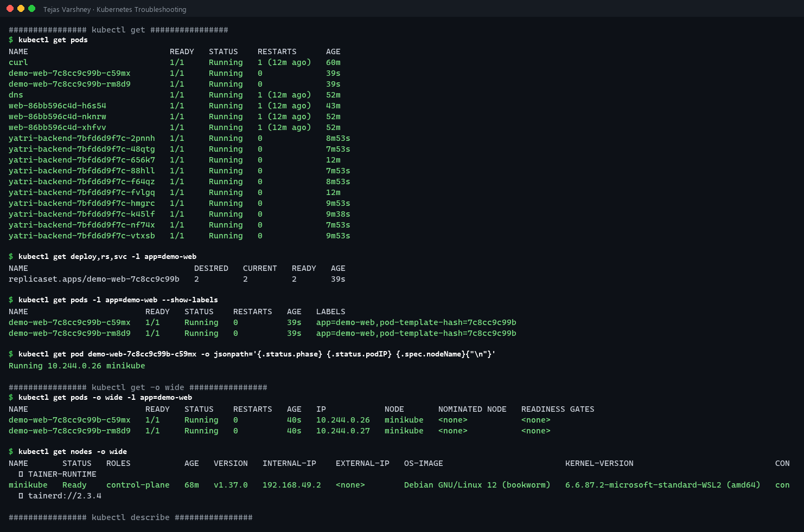
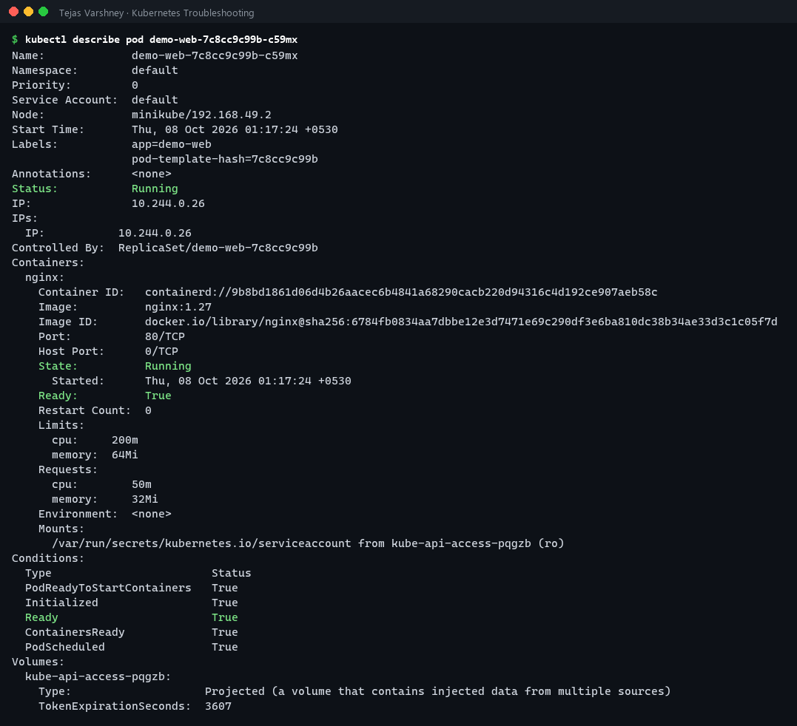
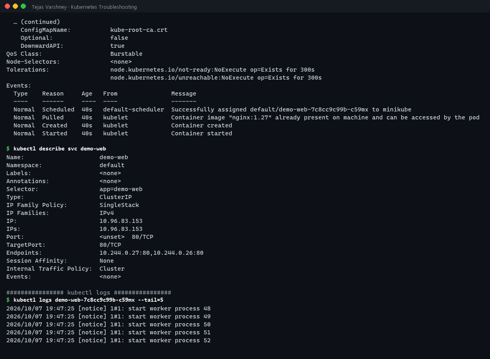
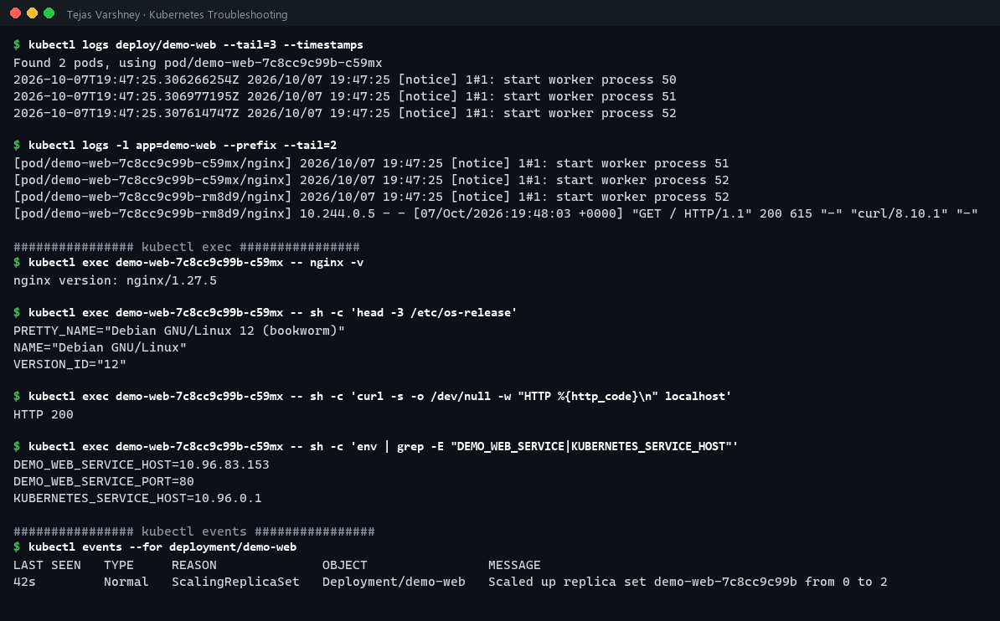
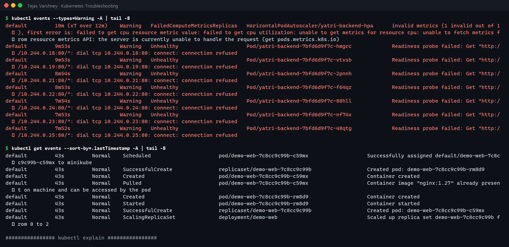
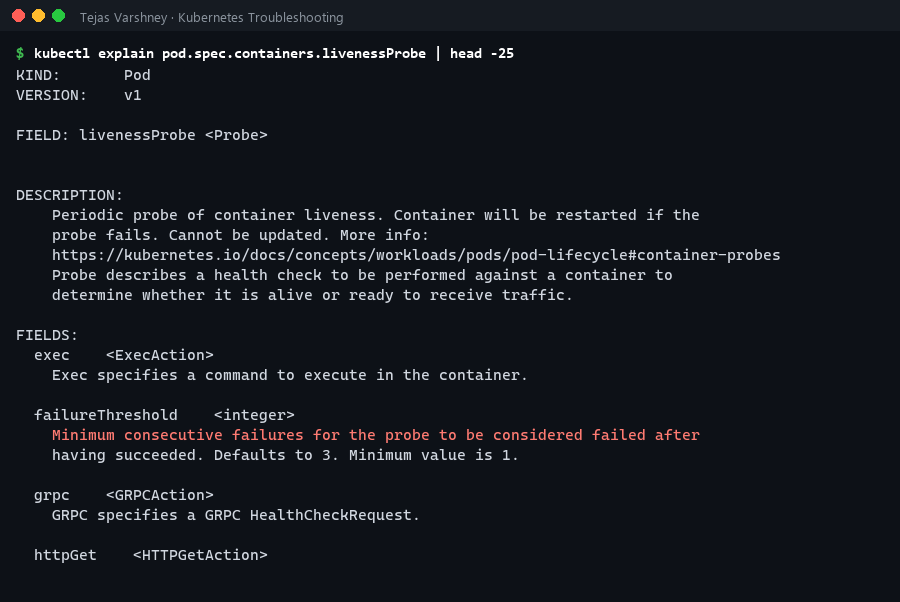
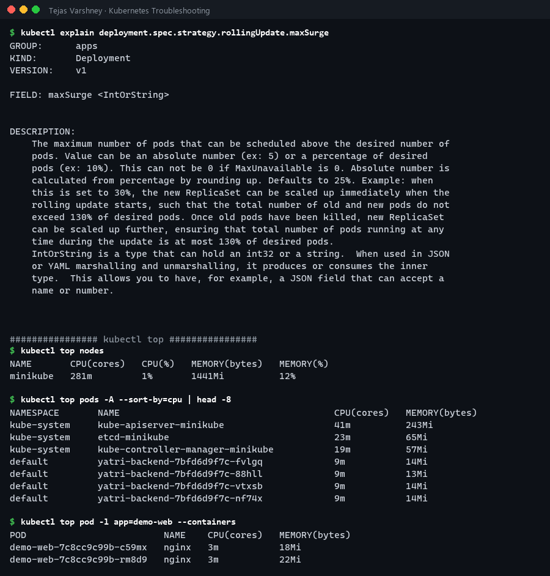

<details><summary>Text output</summary>

```text
################ kubectl get ################
$ kubectl get pods
NAME                             READY   STATUS    RESTARTS      AGE
curl                             1/1     Running   1 (12m ago)   60m
demo-web-7c8cc9c99b-c59mx        1/1     Running   0             39s
demo-web-7c8cc9c99b-rm8d9        1/1     Running   0             39s
dns                              1/1     Running   1 (12m ago)   52m
web-86bb596c4d-h6s54             1/1     Running   1 (12m ago)   43m
web-86bb596c4d-nknrw             1/1     Running   1 (12m ago)   52m
web-86bb596c4d-xhfvv             1/1     Running   1 (12m ago)   52m
yatri-backend-7bfd6d9f7c-2pnnh   1/1     Running   0             8m53s
yatri-backend-7bfd6d9f7c-48qtg   1/1     Running   0             7m53s
yatri-backend-7bfd6d9f7c-656k7   1/1     Running   0             12m
yatri-backend-7bfd6d9f7c-88hll   1/1     Running   0             7m53s
yatri-backend-7bfd6d9f7c-f64qz   1/1     Running   0             8m53s
yatri-backend-7bfd6d9f7c-fvlgq   1/1     Running   0             12m
yatri-backend-7bfd6d9f7c-hmgrc   1/1     Running   0             9m53s
yatri-backend-7bfd6d9f7c-k45lf   1/1     Running   0             9m38s
yatri-backend-7bfd6d9f7c-nf74x   1/1     Running   0             7m53s
yatri-backend-7bfd6d9f7c-vtxsb   1/1     Running   0             9m53s

$ kubectl get deploy,rs,svc -l app=demo-web
NAME                                  DESIRED   CURRENT   READY   AGE
replicaset.apps/demo-web-7c8cc9c99b   2         2         2       39s

$ kubectl get pods -l app=demo-web --show-labels
NAME                        READY   STATUS    RESTARTS   AGE   LABELS
demo-web-7c8cc9c99b-c59mx   1/1     Running   0          39s   app=demo-web,pod-template-hash=7c8cc9c99b
demo-web-7c8cc9c99b-rm8d9   1/1     Running   0          39s   app=demo-web,pod-template-hash=7c8cc9c99b

$ kubectl get pod demo-web-7c8cc9c99b-c59mx -o jsonpath='{.status.phase} {.status.podIP} {.spec.nodeName}{"\n"}'
Running 10.244.0.26 minikube

################ kubectl get -o wide ################
$ kubectl get pods -o wide -l app=demo-web
NAME                        READY   STATUS    RESTARTS   AGE   IP            NODE       NOMINATED NODE   READINESS GATES
demo-web-7c8cc9c99b-c59mx   1/1     Running   0          40s   10.244.0.26   minikube   <none>           <none>
demo-web-7c8cc9c99b-rm8d9   1/1     Running   0          40s   10.244.0.27   minikube   <none>           <none>

$ kubectl get nodes -o wide
NAME       STATUS   ROLES           AGE   VERSION   INTERNAL-IP    EXTERNAL-IP   OS-IMAGE                         KERNEL-VERSION                             CONTAINER-RUNTIME
minikube   Ready    control-plane   68m   v1.37.0   192.168.49.2   <none>        Debian GNU/Linux 12 (bookworm)   6.6.87.2-microsoft-standard-WSL2 (amd64)   containerd://2.3.4

################ kubectl describe ################
$ kubectl describe pod demo-web-7c8cc9c99b-c59mx
Name:             demo-web-7c8cc9c99b-c59mx
Namespace:        default
Priority:         0
Service Account:  default
Node:             minikube/192.168.49.2
Start Time:       Thu, 08 Oct 2026 01:17:24 +0530
Labels:           app=demo-web
                  pod-template-hash=7c8cc9c99b
Annotations:      <none>
Status:           Running
IP:               10.244.0.26
IPs:
  IP:           10.244.0.26
Controlled By:  ReplicaSet/demo-web-7c8cc9c99b
Containers:
  nginx:
    Container ID:   containerd://9b8bd1861d06d4b26aacec6b4841a68290cacb220d94316c4d192ce907aeb58c
    Image:          nginx:1.27
    Image ID:       docker.io/library/nginx@sha256:6784fb0834aa7dbbe12e3d7471e69c290df3e6ba810dc38b34ae33d3c1c05f7d
    Port:           80/TCP
    Host Port:      0/TCP
    State:          Running
      Started:      Thu, 08 Oct 2026 01:17:24 +0530
    Ready:          True
    Restart Count:  0
    Limits:
      cpu:     200m
      memory:  64Mi
    Requests:
      cpu:        50m
      memory:     32Mi
    Environment:  <none>
    Mounts:
      /var/run/secrets/kubernetes.io/serviceaccount from kube-api-access-pqgzb (ro)
Conditions:
  Type                        Status
  PodReadyToStartContainers   True 
  Initialized                 True 
  Ready                       True 
  ContainersReady             True 
  PodScheduled                True 
Volumes:
  kube-api-access-pqgzb:
    Type:                    Projected (a volume that contains injected data from multiple sources)
    TokenExpirationSeconds:  3607
    ConfigMapName:           kube-root-ca.crt
    Optional:                false
    DownwardAPI:             true
QoS Class:                   Burstable
Node-Selectors:              <none>
Tolerations:                 node.kubernetes.io/not-ready:NoExecute op=Exists for 300s
                             node.kubernetes.io/unreachable:NoExecute op=Exists for 300s
Events:
  Type    Reason     Age   From               Message
  ----    ------     ----  ----               -------
  Normal  Scheduled  40s   default-scheduler  Successfully assigned default/demo-web-7c8cc9c99b-c59mx to minikube
  Normal  Pulled     40s   kubelet            Container image "nginx:1.27" already present on machine and can be accessed by the pod
  Normal  Created    40s   kubelet            Container created
  Normal  Started    40s   kubelet            Container started

$ kubectl describe svc demo-web
Name:                     demo-web
Namespace:                default
Labels:                   <none>
Annotations:              <none>
Selector:                 app=demo-web
Type:                     ClusterIP
IP Family Policy:         SingleStack
IP Families:              IPv4
IP:                       10.96.83.153
IPs:                      10.96.83.153
Port:                     <unset>  80/TCP
TargetPort:               80/TCP
Endpoints:                10.244.0.27:80,10.244.0.26:80
Session Affinity:         None
Internal Traffic Policy:  Cluster
Events:                   <none>

################ kubectl logs ################
$ kubectl logs demo-web-7c8cc9c99b-c59mx --tail=5
2026/10/07 19:47:25 [notice] 1#1: start worker process 48
2026/10/07 19:47:25 [notice] 1#1: start worker process 49
2026/10/07 19:47:25 [notice] 1#1: start worker process 50
2026/10/07 19:47:25 [notice] 1#1: start worker process 51
2026/10/07 19:47:25 [notice] 1#1: start worker process 52

$ kubectl logs deploy/demo-web --tail=3 --timestamps
Found 2 pods, using pod/demo-web-7c8cc9c99b-c59mx
2026-10-07T19:47:25.306266254Z 2026/10/07 19:47:25 [notice] 1#1: start worker process 50
2026-10-07T19:47:25.306977195Z 2026/10/07 19:47:25 [notice] 1#1: start worker process 51
2026-10-07T19:47:25.307614747Z 2026/10/07 19:47:25 [notice] 1#1: start worker process 52

$ kubectl logs -l app=demo-web --prefix --tail=2
[pod/demo-web-7c8cc9c99b-c59mx/nginx] 2026/10/07 19:47:25 [notice] 1#1: start worker process 51
[pod/demo-web-7c8cc9c99b-c59mx/nginx] 2026/10/07 19:47:25 [notice] 1#1: start worker process 52
[pod/demo-web-7c8cc9c99b-rm8d9/nginx] 2026/10/07 19:47:25 [notice] 1#1: start worker process 52
[pod/demo-web-7c8cc9c99b-rm8d9/nginx] 10.244.0.5 - - [07/Oct/2026:19:48:03 +0000] "GET / HTTP/1.1" 200 615 "-" "curl/8.10.1" "-"

################ kubectl exec ################
$ kubectl exec demo-web-7c8cc9c99b-c59mx -- nginx -v
nginx version: nginx/1.27.5

$ kubectl exec demo-web-7c8cc9c99b-c59mx -- sh -c 'head -3 /etc/os-release'
PRETTY_NAME="Debian GNU/Linux 12 (bookworm)"
NAME="Debian GNU/Linux"
VERSION_ID="12"

$ kubectl exec demo-web-7c8cc9c99b-c59mx -- sh -c 'curl -s -o /dev/null -w "HTTP %{http_code}\n" localhost'
HTTP 200

$ kubectl exec demo-web-7c8cc9c99b-c59mx -- sh -c 'env | grep -E "DEMO_WEB_SERVICE|KUBERNETES_SERVICE_HOST"'
DEMO_WEB_SERVICE_HOST=10.96.83.153
DEMO_WEB_SERVICE_PORT=80
KUBERNETES_SERVICE_HOST=10.96.0.1

################ kubectl events ################
$ kubectl events --for deployment/demo-web
LAST SEEN   TYPE     REASON              OBJECT                MESSAGE
42s         Normal   ScalingReplicaSet   Deployment/demo-web   Scaled up replica set demo-web-7c8cc9c99b from 0 to 2

$ kubectl events --types=Warning -A | tail -8
default         10m (x7 over 12m)    Warning   FailedComputeMetricsReplicas   HorizontalPodAutoscaler/yatri-backend-hpa      invalid metrics (1 invalid out of 1), first error is: failed to get cpu resource metric value: failed to get cpu utilization: unable to get metrics for resource cpu: unable to fetch metrics from resource metrics API: the server is currently unable to handle the request (get pods.metrics.k8s.io)
default         9m53s                Warning   Unhealthy                      Pod/yatri-backend-7bfd6d9f7c-hmgrc             Readiness probe failed: Get "http://10.244.0.18:80/": dial tcp 10.244.0.18:80: connect: connection refused
default         9m53s                Warning   Unhealthy                      Pod/yatri-backend-7bfd6d9f7c-vtxsb             Readiness probe failed: Get "http://10.244.0.19:80/": dial tcp 10.244.0.19:80: connect: connection refused
default         8m54s                Warning   Unhealthy                      Pod/yatri-backend-7bfd6d9f7c-2pnnh             Readiness probe failed: Get "http://10.244.0.21:80/": dial tcp 10.244.0.21:80: connect: connection refused
default         8m53s                Warning   Unhealthy                      Pod/yatri-backend-7bfd6d9f7c-f64qz             Readiness probe failed: Get "http://10.244.0.22:80/": dial tcp 10.244.0.22:80: connect: connection refused
default         7m54s                Warning   Unhealthy                      Pod/yatri-backend-7bfd6d9f7c-88hll             Readiness probe failed: Get "http://10.244.0.24:80/": dial tcp 10.244.0.24:80: connect: connection refused
default         7m53s                Warning   Unhealthy                      Pod/yatri-backend-7bfd6d9f7c-nf74x             Readiness probe failed: Get "http://10.244.0.23:80/": dial tcp 10.244.0.23:80: connect: connection refused
default         7m52s                Warning   Unhealthy                      Pod/yatri-backend-7bfd6d9f7c-48qtg             Readiness probe failed: Get "http://10.244.0.25:80/": dial tcp 10.244.0.25:80: connect: connection refused

$ kubectl get events --sort-by=.lastTimestamp -A | tail -8
default         43s         Normal    Scheduled                      pod/demo-web-7c8cc9c99b-c59mx                   Successfully assigned default/demo-web-7c8cc9c99b-c59mx to minikube
default         43s         Normal    SuccessfulCreate               replicaset/demo-web-7c8cc9c99b                  Created pod: demo-web-7c8cc9c99b-rm8d9
default         43s         Normal    Created                        pod/demo-web-7c8cc9c99b-c59mx                   Container created
default         43s         Normal    Pulled                         pod/demo-web-7c8cc9c99b-c59mx                   Container image "nginx:1.27" already present on machine and can be accessed by the pod
default         43s         Normal    Created                        pod/demo-web-7c8cc9c99b-rm8d9                   Container created
default         43s         Normal    Started                        pod/demo-web-7c8cc9c99b-rm8d9                   Container started
default         43s         Normal    SuccessfulCreate               replicaset/demo-web-7c8cc9c99b                  Created pod: demo-web-7c8cc9c99b-c59mx
default         43s         Normal    ScalingReplicaSet              deployment/demo-web                             Scaled up replica set demo-web-7c8cc9c99b from 0 to 2

################ kubectl explain ################
$ kubectl explain pod.spec.containers.livenessProbe | head -25
KIND:       Pod
VERSION:    v1

FIELD: livenessProbe <Probe>


DESCRIPTION:
    Periodic probe of container liveness. Container will be restarted if the
    probe fails. Cannot be updated. More info:
    https://kubernetes.io/docs/concepts/workloads/pods/pod-lifecycle#container-probes
    Probe describes a health check to be performed against a container to
    determine whether it is alive or ready to receive traffic.
    
FIELDS:
  exec	<ExecAction>
    Exec specifies a command to execute in the container.

  failureThreshold	<integer>
    Minimum consecutive failures for the probe to be considered failed after
    having succeeded. Defaults to 3. Minimum value is 1.

  grpc	<GRPCAction>
    GRPC specifies a GRPC HealthCheckRequest.

  httpGet	<HTTPGetAction>

$ kubectl explain deployment.spec.strategy.rollingUpdate.maxSurge
GROUP:      apps
KIND:       Deployment
VERSION:    v1

FIELD: maxSurge <IntOrString>


DESCRIPTION:
    The maximum number of pods that can be scheduled above the desired number of
    pods. Value can be an absolute number (ex: 5) or a percentage of desired
    pods (ex: 10%). This can not be 0 if MaxUnavailable is 0. Absolute number is
    calculated from percentage by rounding up. Defaults to 25%. Example: when
    this is set to 30%, the new ReplicaSet can be scaled up immediately when the
    rolling update starts, such that the total number of old and new pods do not
    exceed 130% of desired pods. Once old pods have been killed, new ReplicaSet
    can be scaled up further, ensuring that total number of pods running at any
    time during the update is at most 130% of desired pods.
    IntOrString is a type that can hold an int32 or a string.  When used in JSON
    or YAML marshalling and unmarshalling, it produces or consumes the inner
    type.  This allows you to have, for example, a JSON field that can accept a
    name or number.
    


################ kubectl top ################
$ kubectl top nodes
NAME       CPU(cores)   CPU(%)   MEMORY(bytes)   MEMORY(%)   
minikube   281m         1%       1441Mi          12%         

$ kubectl top pods -A --sort-by=cpu | head -8
NAMESPACE       NAME                                       CPU(cores)   MEMORY(bytes)   
kube-system     kube-apiserver-minikube                    41m          243Mi           
kube-system     etcd-minikube                              23m          65Mi            
kube-system     kube-controller-manager-minikube           19m          57Mi            
default         yatri-backend-7bfd6d9f7c-fvlgq             9m           14Mi            
default         yatri-backend-7bfd6d9f7c-88hll             9m           13Mi            
default         yatri-backend-7bfd6d9f7c-vtxsb             9m           14Mi            
default         yatri-backend-7bfd6d9f7c-nf74x             9m           14Mi            

$ kubectl top pod -l app=demo-web --containers
POD                         NAME    CPU(cores)   MEMORY(bytes)   
demo-web-7c8cc9c99b-c59mx   nginx   3m           18Mi            
demo-web-7c8cc9c99b-rm8d9   nginx   3m           22Mi
```

</details>

---

## Task 2 – Troubleshooting common issues

Each folder in [02-issues](02-issues) contains the broken manifest and the fix. Every scenario was run on my cluster, and the complete before/after output follows each summary.

### Summary table

| # | Problem | What I saw | Command that found it | Root cause | Fix |
|---|---|---|---|---|---|
| 1 | **CrashLoopBackOff** | `Error` → `CrashLoopBackOff`, restarts climbing, exit code 1 | `kubectl logs --previous` → `FATAL: DB_HOST is not set` | Required env var missing, so the app exits on start | Add `env: DB_HOST` |
| 2 | **ImagePullBackOff** | `ErrImagePull` → `ImagePullBackOff` | `describe` events: `nginx:1.277: not found` | Typo in the image tag | `nginx:1.27` |
| 3 | **ErrImagePull** | `ErrImagePull` within 6s | `describe` events: `failed to resolve reference "registry.example.invalid/..."` + `nslookup` NXDOMAIN | Registry hostname doesn't exist | Use the correct registry `docker.io/library/nginx` |
| 4 | **Pending** | `Pending`, no node, no IP | `describe` events: `0/1 nodes are available: 1 node(s) didn't match Pod's node affinity/selector` | `nodeSelector: hardware=gpu`, but no node has that label | Use a real label (or `kubectl label node`) |
| 5 | **ContainerCreating** | Stuck `ContainerCreating` | `describe` events: `FailedMount … configmap "report-config" not found` | Mounted ConfigMap was never created | Create the ConfigMap; kubelet retries the mount and the Pod starts |
| 6 | **Service connectivity** | `curl orders` → *connection refused* | EndpointSlice port `8080` vs Pod args `-listen=:5678`; curl Pod IP:5678 works | Service `targetPort` ≠ container port | `targetPort: 5678` |
| 7 | **DNS** | Frontend logs `ERROR calling http://stock` | `nslookup stock` → NXDOMAIN; `resolv.conf` search = `default.svc…`; Service is in `inventory` | Short name used across namespaces | `http://stock.inventory.svc.cluster.local` |
| 8 | **Pod networking** | `curl profile` and `curl <podIP>:8080` refused, but **ping works** | `kubectl debug` ephemeral container: `netstat` → `127.0.0.1:8080 LISTEN`; app log "listening on 127.0.0.1" | App bound to loopback only, unreachable on the Pod IP | Bind `0.0.0.0:8080` |
| 9 | **Configuration** | `Error`/CrashLoopBackOff | `kubectl logs` → `nginx: [emerg] unexpected "}" in default.conf:5` | Syntax error (missing `;`) in nginx config from a ConfigMap | Fix the ConfigMap + `rollout restart` |

### 1. CrashLoopBackOff
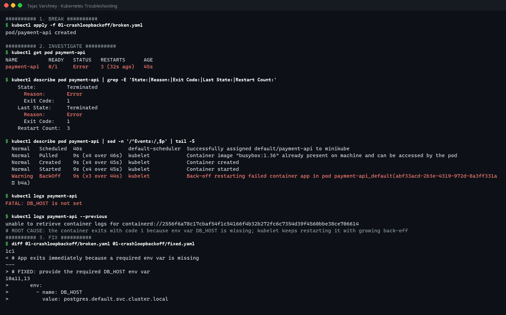
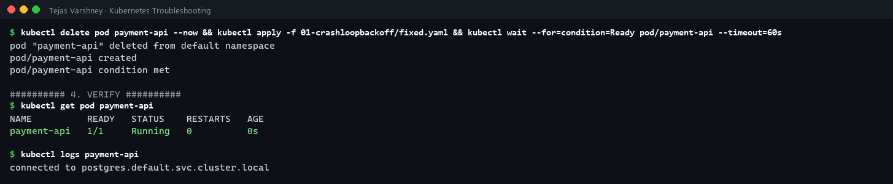

<details><summary>Text output</summary>

```text
########## 1. BREAK ##########
$ kubectl apply -f 01-crashloopbackoff/broken.yaml
pod/payment-api created

########## 2. INVESTIGATE ##########
$ kubectl get pod payment-api
NAME          READY   STATUS   RESTARTS      AGE
payment-api   0/1     Error    3 (32s ago)   45s

$ kubectl describe pod payment-api | grep -E 'State:|Reason:|Exit Code:|Last State:|Restart Count:'
    State:          Terminated
      Reason:       Error
      Exit Code:    1
    Last State:     Terminated
      Reason:       Error
      Exit Code:    1
    Restart Count:  3

$ kubectl describe pod payment-api | sed -n '/^Events:/,$p' | tail -5
  Normal   Scheduled  46s               default-scheduler  Successfully assigned default/payment-api to minikube
  Normal   Pulled     9s (x4 over 46s)  kubelet            Container image "busybox:1.36" already present on machine and can be accessed by the pod
  Normal   Created    9s (x4 over 45s)  kubelet            Container created
  Normal   Started    9s (x4 over 45s)  kubelet            Container started
  Warning  BackOff    9s (x3 over 44s)  kubelet            Back-off restarting failed container app in pod payment-api_default(abf33acd-2b3e-4319-972d-8a3ff331ab4a)

$ kubectl logs payment-api
FATAL: DB_HOST is not set

$ kubectl logs payment-api --previous
unable to retrieve container logs for containerd://2556f6a78c17cbaf54f1c54166f4b32b272fc6c7354d39f4560bbe38ce706614
# ROOT CAUSE: the container exits with code 1 because env var DB_HOST is missing; kubelet keeps restarting it with growing back-off
########## 3. FIX ##########
$ diff 01-crashloopbackoff/broken.yaml 01-crashloopbackoff/fixed.yaml
1c1
< # App exits immediately because a required env var is missing
---
> # FIXED: provide the required DB_HOST env var
10a11,13
>       env:
>         - name: DB_HOST
>           value: postgres.default.svc.cluster.local

$ kubectl delete pod payment-api --now && kubectl apply -f 01-crashloopbackoff/fixed.yaml && kubectl wait --for=condition=Ready pod/payment-api --timeout=60s
pod "payment-api" deleted from default namespace
pod/payment-api created
pod/payment-api condition met

########## 4. VERIFY ##########
$ kubectl get pod payment-api
NAME          READY   STATUS    RESTARTS   AGE
payment-api   1/1     Running   0          0s

$ kubectl logs payment-api
connected to postgres.default.svc.cluster.local
```

</details>

**Process:** `get` showed restarts climbing. `describe` showed `Last State: Terminated, Exit Code: 1` and `BackOff` events. `logs --previous` printed the real reason. CrashLoopBackOff isn't an error by itself: it means "the container keeps exiting, and kubelet is waiting longer between restarts (10s → 20s → 40s … 5 min)". Always read the logs of the **previous** container.

### 2. ImagePullBackOff
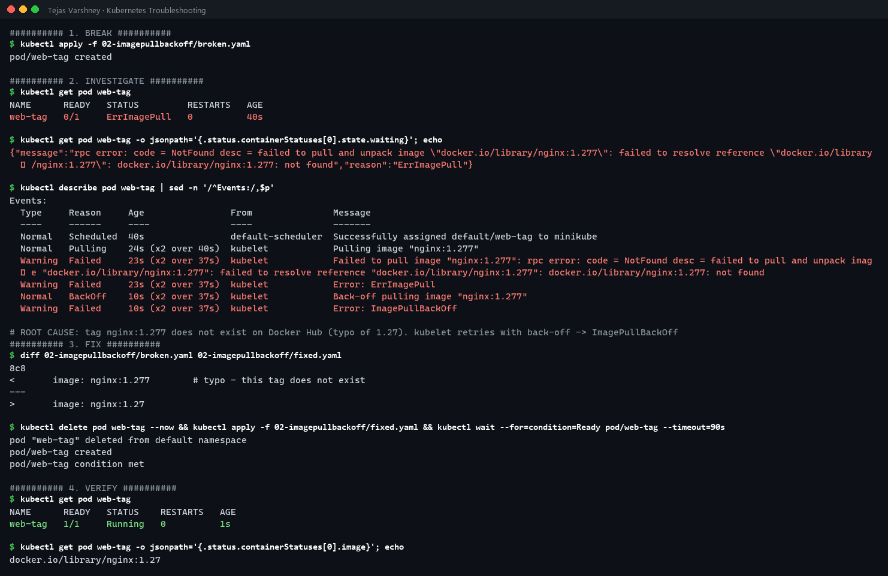

<details><summary>Text output</summary>

```text
########## 1. BREAK ##########
$ kubectl apply -f 02-imagepullbackoff/broken.yaml
pod/web-tag created

########## 2. INVESTIGATE ##########
$ kubectl get pod web-tag
NAME      READY   STATUS         RESTARTS   AGE
web-tag   0/1     ErrImagePull   0          40s

$ kubectl get pod web-tag -o jsonpath='{.status.containerStatuses[0].state.waiting}'; echo
{"message":"rpc error: code = NotFound desc = failed to pull and unpack image \"docker.io/library/nginx:1.277\": failed to resolve reference \"docker.io/library/nginx:1.277\": docker.io/library/nginx:1.277: not found","reason":"ErrImagePull"}

$ kubectl describe pod web-tag | sed -n '/^Events:/,$p'
Events:
  Type     Reason     Age                From               Message
  ----     ------     ----               ----               -------
  Normal   Scheduled  40s                default-scheduler  Successfully assigned default/web-tag to minikube
  Normal   Pulling    24s (x2 over 40s)  kubelet            Pulling image "nginx:1.277"
  Warning  Failed     23s (x2 over 37s)  kubelet            Failed to pull image "nginx:1.277": rpc error: code = NotFound desc = failed to pull and unpack image "docker.io/library/nginx:1.277": failed to resolve reference "docker.io/library/nginx:1.277": docker.io/library/nginx:1.277: not found
  Warning  Failed     23s (x2 over 37s)  kubelet            Error: ErrImagePull
  Normal   BackOff    10s (x2 over 37s)  kubelet            Back-off pulling image "nginx:1.277"
  Warning  Failed     10s (x2 over 37s)  kubelet            Error: ImagePullBackOff

# ROOT CAUSE: tag nginx:1.277 does not exist on Docker Hub (typo of 1.27). kubelet retries with back-off -> ImagePullBackOff
########## 3. FIX ##########
$ diff 02-imagepullbackoff/broken.yaml 02-imagepullbackoff/fixed.yaml
8c8
<       image: nginx:1.277        # typo - this tag does not exist
---
>       image: nginx:1.27

$ kubectl delete pod web-tag --now && kubectl apply -f 02-imagepullbackoff/fixed.yaml && kubectl wait --for=condition=Ready pod/web-tag --timeout=90s
pod "web-tag" deleted from default namespace
pod/web-tag created
pod/web-tag condition met

########## 4. VERIFY ##########
$ kubectl get pod web-tag
NAME      READY   STATUS    RESTARTS   AGE
web-tag   1/1     Running   0          1s

$ kubectl get pod web-tag -o jsonpath='{.status.containerStatuses[0].image}'; echo
docker.io/library/nginx:1.27
```

</details>

**Process:** the `waiting` state reason was `ImagePullBackOff`. Events showed `not found` for `nginx:1.277`, so the registry was reachable but the tag doesn't exist. Other causes to check: private repo without `imagePullSecrets`, Docker Hub rate limits, wrong architecture.

### 3. ErrImagePull
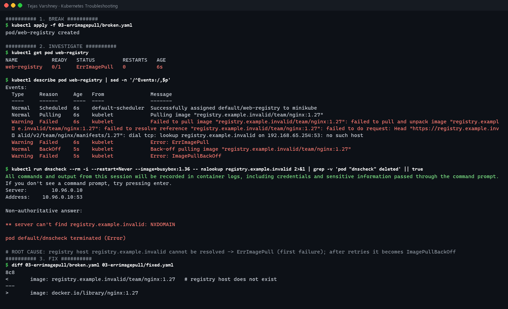
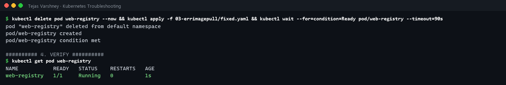

<details><summary>Text output</summary>

```text
########## 1. BREAK ##########
$ kubectl apply -f 03-errimagepull/broken.yaml
pod/web-registry created

########## 2. INVESTIGATE ##########
$ kubectl get pod web-registry
NAME           READY   STATUS         RESTARTS   AGE
web-registry   0/1     ErrImagePull   0          6s

$ kubectl describe pod web-registry | sed -n '/^Events:/,$p'
Events:
  Type     Reason     Age   From               Message
  ----     ------     ----  ----               -------
  Normal   Scheduled  6s    default-scheduler  Successfully assigned default/web-registry to minikube
  Normal   Pulling    6s    kubelet            Pulling image "registry.example.invalid/team/nginx:1.27"
  Warning  Failed     6s    kubelet            Failed to pull image "registry.example.invalid/team/nginx:1.27": failed to pull and unpack image "registry.example.invalid/team/nginx:1.27": failed to resolve reference "registry.example.invalid/team/nginx:1.27": failed to do request: Head "https://registry.example.invalid/v2/team/nginx/manifests/1.27": dial tcp: lookup registry.example.invalid on 192.168.65.254:53: no such host
  Warning  Failed     6s    kubelet            Error: ErrImagePull
  Normal   BackOff    5s    kubelet            Back-off pulling image "registry.example.invalid/team/nginx:1.27"
  Warning  Failed     5s    kubelet            Error: ImagePullBackOff

$ kubectl run dnscheck --rm -i --restart=Never --image=busybox:1.36 -- nslookup registry.example.invalid 2>&1 | grep -v 'pod "dnscheck" deleted' || true
All commands and output from this session will be recorded in container logs, including credentials and sensitive information passed through the command prompt.
If you don't see a command prompt, try pressing enter.
Server:		10.96.0.10
Address:	10.96.0.10:53

Non-authoritative answer:

** server can't find registry.example.invalid: NXDOMAIN

pod default/dnscheck terminated (Error)

# ROOT CAUSE: registry host registry.example.invalid cannot be resolved -> ErrImagePull (first failure); after retries it becomes ImagePullBackOff
########## 3. FIX ##########
$ diff 03-errimagepull/broken.yaml 03-errimagepull/fixed.yaml
8c8
<       image: registry.example.invalid/team/nginx:1.27   # registry host does not exist
---
>       image: docker.io/library/nginx:1.27

$ kubectl delete pod web-registry --now && kubectl apply -f 03-errimagepull/fixed.yaml && kubectl wait --for=condition=Ready pod/web-registry --timeout=90s
pod "web-registry" deleted from default namespace
pod/web-registry created
pod/web-registry condition met

########## 4. VERIFY ##########
$ kubectl get pod web-registry
NAME           READY   STATUS    RESTARTS   AGE
web-registry   1/1     Running   0          1s
```

</details>

**Process:** `ErrImagePull` is the **first** failed attempt. After retries kubelet switches to `ImagePullBackOff` (both are visible in the events). Here the event says `failed to resolve reference`, and a throw-away busybox Pod confirmed with `nslookup` that `registry.example.invalid` is NXDOMAIN, so it's a registry/DNS problem rather than a tag problem.

### 4. Pending
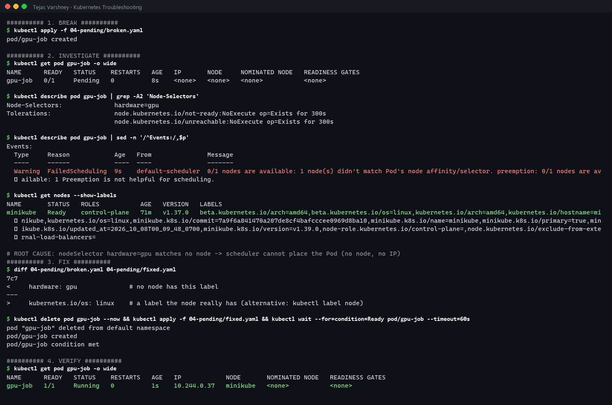
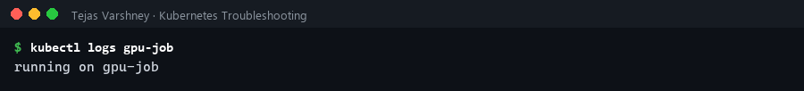

<details><summary>Text output</summary>

```text
########## 1. BREAK ##########
$ kubectl apply -f 04-pending/broken.yaml
pod/gpu-job created

########## 2. INVESTIGATE ##########
$ kubectl get pod gpu-job -o wide
NAME      READY   STATUS    RESTARTS   AGE   IP       NODE     NOMINATED NODE   READINESS GATES
gpu-job   0/1     Pending   0          8s    <none>   <none>   <none>           <none>

$ kubectl describe pod gpu-job | grep -A2 'Node-Selectors'
Node-Selectors:              hardware=gpu
Tolerations:                 node.kubernetes.io/not-ready:NoExecute op=Exists for 300s
                             node.kubernetes.io/unreachable:NoExecute op=Exists for 300s

$ kubectl describe pod gpu-job | sed -n '/^Events:/,$p'
Events:
  Type     Reason            Age   From               Message
  ----     ------            ----  ----               -------
  Warning  FailedScheduling  9s    default-scheduler  0/1 nodes are available: 1 node(s) didn't match Pod's node affinity/selector. preemption: 0/1 nodes are available: 1 Preemption is not helpful for scheduling.

$ kubectl get nodes --show-labels
NAME       STATUS   ROLES           AGE   VERSION   LABELS
minikube   Ready    control-plane   71m   v1.37.0   beta.kubernetes.io/arch=amd64,beta.kubernetes.io/os=linux,kubernetes.io/arch=amd64,kubernetes.io/hostname=minikube,kubernetes.io/os=linux,minikube.k8s.io/commit=7a9f6a841470a207de8cf4bafcccee0969d8ba10,minikube.k8s.io/name=minikube,minikube.k8s.io/primary=true,minikube.k8s.io/updated_at=2026_10_08T00_09_48_0700,minikube.k8s.io/version=v1.39.0,node-role.kubernetes.io/control-plane=,node.kubernetes.io/exclude-from-external-load-balancers=

# ROOT CAUSE: nodeSelector hardware=gpu matches no node -> scheduler cannot place the Pod (no node, no IP)
########## 3. FIX ##########
$ diff 04-pending/broken.yaml 04-pending/fixed.yaml
7c7
<     hardware: gpu              # no node has this label
---
>     kubernetes.io/os: linux    # a label the node really has (alternative: kubectl label node)

$ kubectl delete pod gpu-job --now && kubectl apply -f 04-pending/fixed.yaml && kubectl wait --for=condition=Ready pod/gpu-job --timeout=60s
pod "gpu-job" deleted from default namespace
pod/gpu-job created
pod/gpu-job condition met

########## 4. VERIFY ##########
$ kubectl get pod gpu-job -o wide
NAME      READY   STATUS    RESTARTS   AGE   IP            NODE       NOMINATED NODE   READINESS GATES
gpu-job   1/1     Running   0          1s    10.244.0.37   minikube   <none>           <none>

$ kubectl logs gpu-job
running on gpu-job
```

</details>

**Process:** a Pending Pod with **no node and no IP** means the scheduler couldn't place it. The `FailedScheduling` event names the reason. `get nodes --show-labels` proved no node carries `hardware=gpu`. Other Pending causes I've seen: insufficient CPU/memory (Session 10's 64Gi Pod), taints without tolerations, an unbound PVC.

### 5. ContainerCreating
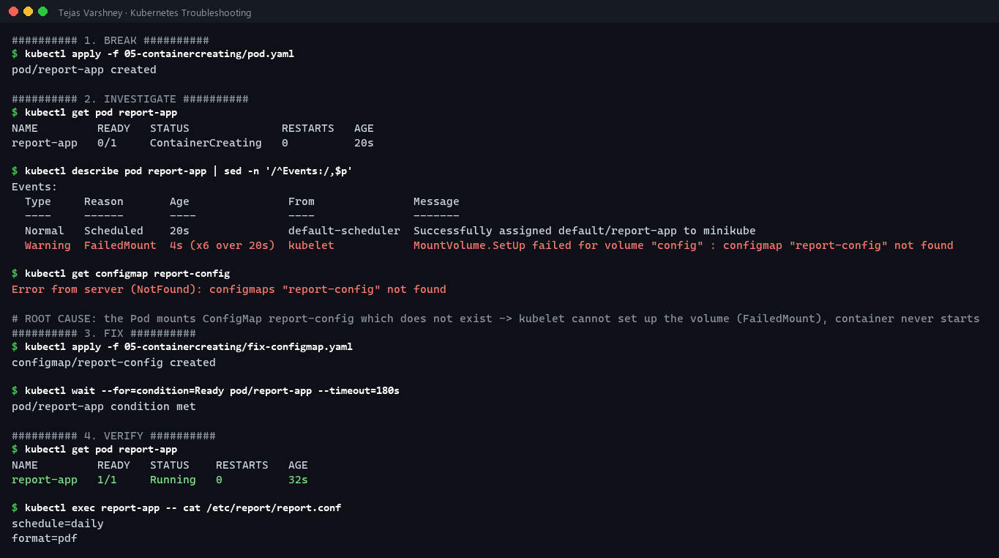

<details><summary>Text output</summary>

```text
########## 1. BREAK ##########
$ kubectl apply -f 05-containercreating/pod.yaml
pod/report-app created

########## 2. INVESTIGATE ##########
$ kubectl get pod report-app
NAME         READY   STATUS              RESTARTS   AGE
report-app   0/1     ContainerCreating   0          20s

$ kubectl describe pod report-app | sed -n '/^Events:/,$p'
Events:
  Type     Reason       Age               From               Message
  ----     ------       ----              ----               -------
  Normal   Scheduled    20s               default-scheduler  Successfully assigned default/report-app to minikube
  Warning  FailedMount  4s (x6 over 20s)  kubelet            MountVolume.SetUp failed for volume "config" : configmap "report-config" not found

$ kubectl get configmap report-config
Error from server (NotFound): configmaps "report-config" not found

# ROOT CAUSE: the Pod mounts ConfigMap report-config which does not exist -> kubelet cannot set up the volume (FailedMount), container never starts
########## 3. FIX ##########
$ kubectl apply -f 05-containercreating/fix-configmap.yaml
configmap/report-config created

$ kubectl wait --for=condition=Ready pod/report-app --timeout=180s
pod/report-app condition met

########## 4. VERIFY ##########
$ kubectl get pod report-app
NAME         READY   STATUS    RESTARTS   AGE
report-app   1/1     Running   0          32s

$ kubectl exec report-app -- cat /etc/report/report.conf
schedule=daily
format=pdf
```

</details>

**Process:** the Pod was scheduled (it has a node), but the container never started. `FailedMount: configmap "report-config" not found` explained it. I didn't need to delete the Pod: as soon as the ConfigMap existed, kubelet's retry mounted it and the Pod became Ready. Other causes: missing Secret, PVC not bound or attached, CNI failure (`FailedCreatePodSandBox`), a slow image pull.

### 6. Service connectivity
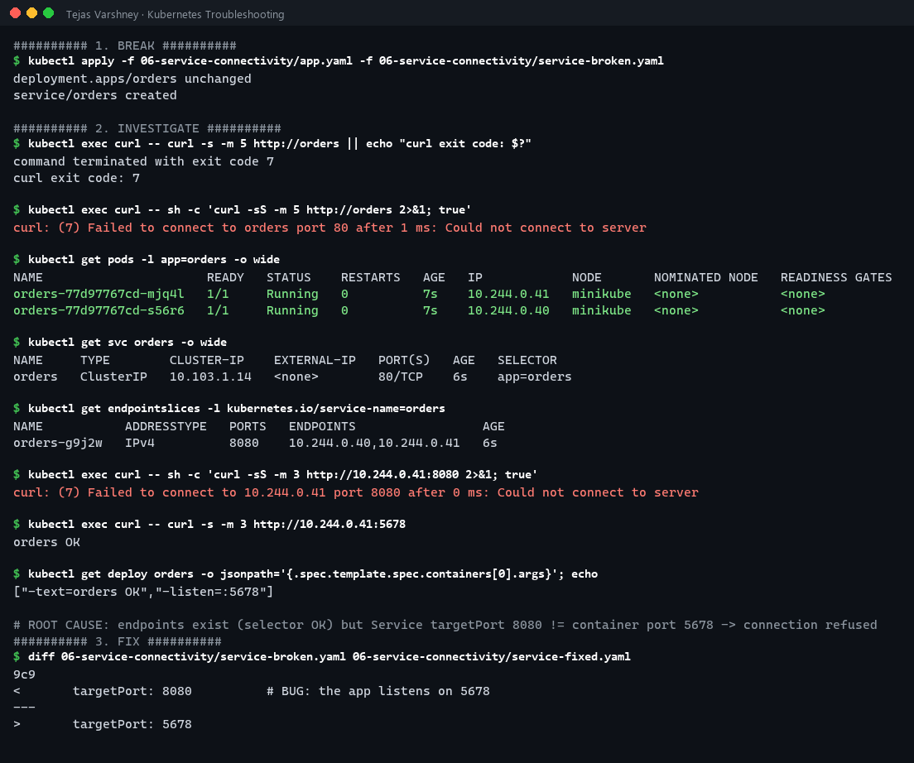
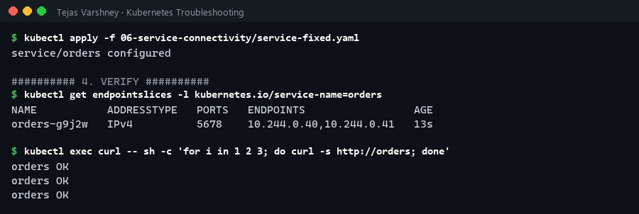

<details><summary>Text output</summary>

```text
########## 1. BREAK ##########
$ kubectl apply -f 06-service-connectivity/app.yaml -f 06-service-connectivity/service-broken.yaml
deployment.apps/orders unchanged
service/orders created

########## 2. INVESTIGATE ##########
$ kubectl exec curl -- curl -s -m 5 http://orders || echo "curl exit code: $?"
command terminated with exit code 7
curl exit code: 7

$ kubectl exec curl -- sh -c 'curl -sS -m 5 http://orders 2>&1; true'
curl: (7) Failed to connect to orders port 80 after 1 ms: Could not connect to server

$ kubectl get pods -l app=orders -o wide
NAME                      READY   STATUS    RESTARTS   AGE   IP            NODE       NOMINATED NODE   READINESS GATES
orders-77d97767cd-mjq4l   1/1     Running   0          7s    10.244.0.41   minikube   <none>           <none>
orders-77d97767cd-s56r6   1/1     Running   0          7s    10.244.0.40   minikube   <none>           <none>

$ kubectl get svc orders -o wide
NAME     TYPE        CLUSTER-IP    EXTERNAL-IP   PORT(S)   AGE   SELECTOR
orders   ClusterIP   10.103.1.14   <none>        80/TCP    6s    app=orders

$ kubectl get endpointslices -l kubernetes.io/service-name=orders
NAME           ADDRESSTYPE   PORTS   ENDPOINTS                 AGE
orders-g9j2w   IPv4          8080    10.244.0.40,10.244.0.41   6s

$ kubectl exec curl -- sh -c 'curl -sS -m 3 http://10.244.0.41:8080 2>&1; true'
curl: (7) Failed to connect to 10.244.0.41 port 8080 after 0 ms: Could not connect to server

$ kubectl exec curl -- curl -s -m 3 http://10.244.0.41:5678
orders OK

$ kubectl get deploy orders -o jsonpath='{.spec.template.spec.containers[0].args}'; echo
["-text=orders OK","-listen=:5678"]

# ROOT CAUSE: endpoints exist (selector OK) but Service targetPort 8080 != container port 5678 -> connection refused
########## 3. FIX ##########
$ diff 06-service-connectivity/service-broken.yaml 06-service-connectivity/service-fixed.yaml
9c9
<       targetPort: 8080          # BUG: the app listens on 5678
---
>       targetPort: 5678

$ kubectl apply -f 06-service-connectivity/service-fixed.yaml
service/orders configured

########## 4. VERIFY ##########
$ kubectl get endpointslices -l kubernetes.io/service-name=orders
NAME           ADDRESSTYPE   PORTS   ENDPOINTS                 AGE
orders-g9j2w   IPv4          5678    10.244.0.40,10.244.0.41   13s

$ kubectl exec curl -- sh -c 'for i in 1 2 3; do curl -s http://orders; done'
orders OK
orders OK
orders OK
```

</details>

**Process:** endpoints were **not empty**, so the selector was fine (compare with the mini project, where it wasn't). Curling the Pod IP on the Service's targetPort (8080) failed, while 5678 worked, so the Service pointed at a port where nothing listens. The checklist: selector ↔ labels, `port` ↔ `targetPort` ↔ `containerPort`, readiness.

### 7. DNS
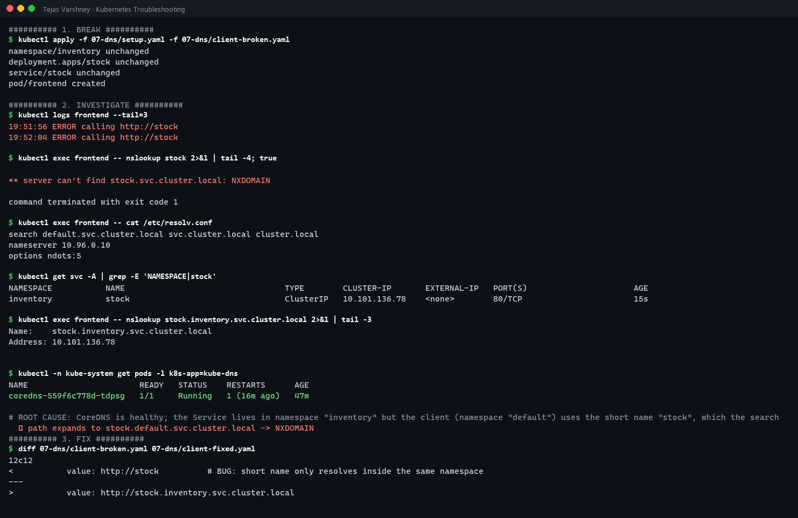
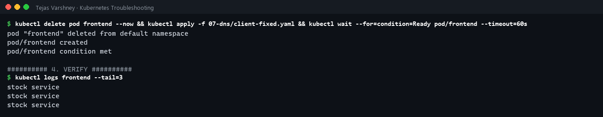

<details><summary>Text output</summary>

```text
########## 1. BREAK ##########
$ kubectl apply -f 07-dns/setup.yaml -f 07-dns/client-broken.yaml
namespace/inventory unchanged
deployment.apps/stock unchanged
service/stock unchanged
pod/frontend created

########## 2. INVESTIGATE ##########
$ kubectl logs frontend --tail=3
19:51:56 ERROR calling http://stock
19:52:04 ERROR calling http://stock

$ kubectl exec frontend -- nslookup stock 2>&1 | tail -4; true

** server can't find stock.svc.cluster.local: NXDOMAIN

command terminated with exit code 1

$ kubectl exec frontend -- cat /etc/resolv.conf
search default.svc.cluster.local svc.cluster.local cluster.local
nameserver 10.96.0.10
options ndots:5

$ kubectl get svc -A | grep -E 'NAMESPACE|stock'
NAMESPACE           NAME                                 TYPE        CLUSTER-IP       EXTERNAL-IP   PORT(S)                      AGE
inventory           stock                                ClusterIP   10.101.136.78    <none>        80/TCP                       15s

$ kubectl exec frontend -- nslookup stock.inventory.svc.cluster.local 2>&1 | tail -3
Name:	stock.inventory.svc.cluster.local
Address: 10.101.136.78


$ kubectl -n kube-system get pods -l k8s-app=kube-dns
NAME                       READY   STATUS    RESTARTS      AGE
coredns-559f6c778d-tdpsg   1/1     Running   1 (16m ago)   47m

# ROOT CAUSE: CoreDNS is healthy; the Service lives in namespace "inventory" but the client (namespace "default") uses the short name "stock", which the search path expands to stock.default.svc.cluster.local -> NXDOMAIN
########## 3. FIX ##########
$ diff 07-dns/client-broken.yaml 07-dns/client-fixed.yaml
12c12
<           value: http://stock          # BUG: short name only resolves inside the same namespace
---
>           value: http://stock.inventory.svc.cluster.local

$ kubectl delete pod frontend --now && kubectl apply -f 07-dns/client-fixed.yaml && kubectl wait --for=condition=Ready pod/frontend --timeout=60s
pod "frontend" deleted from default namespace
pod/frontend created
pod/frontend condition met

########## 4. VERIFY ##########
$ kubectl logs frontend --tail=3
stock service
stock service
stock service
```

</details>

**Process:** first I made sure DNS itself was healthy (the CoreDNS Pod was Running, and the FQDN `stock.inventory.svc.cluster.local` resolved). The short name failed because the search path only appends the **client's** namespace (`default.svc.cluster.local`), and the Service lives in `inventory`. Fix: use `<svc>.<namespace>` or the full FQDN. For cluster-wide DNS failures (CoreDNS down, no endpoints), see my CoreDNS outage demo in Session 11.

### 8. Pod networking
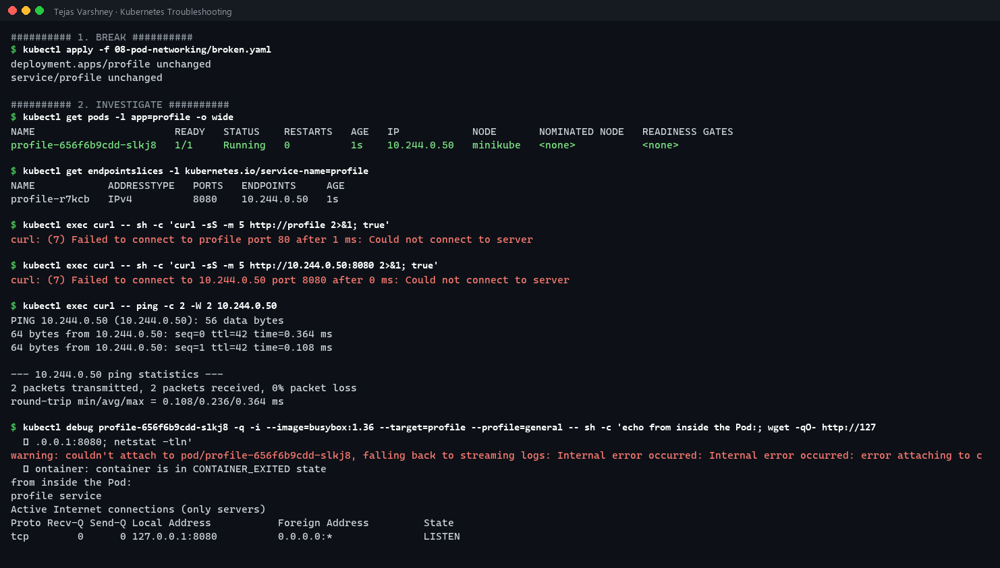
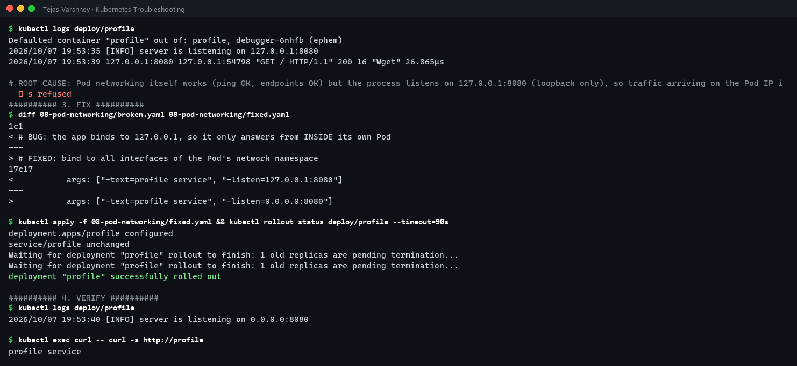

<details><summary>Text output</summary>

```text
########## 1. BREAK ##########
$ kubectl apply -f 08-pod-networking/broken.yaml
deployment.apps/profile unchanged
service/profile unchanged

########## 2. INVESTIGATE ##########
$ kubectl get pods -l app=profile -o wide
NAME                       READY   STATUS    RESTARTS   AGE   IP            NODE       NOMINATED NODE   READINESS GATES
profile-656f6b9cdd-slkj8   1/1     Running   0          1s    10.244.0.50   minikube   <none>           <none>

$ kubectl get endpointslices -l kubernetes.io/service-name=profile
NAME            ADDRESSTYPE   PORTS   ENDPOINTS     AGE
profile-r7kcb   IPv4          8080    10.244.0.50   1s

$ kubectl exec curl -- sh -c 'curl -sS -m 5 http://profile 2>&1; true'
curl: (7) Failed to connect to profile port 80 after 1 ms: Could not connect to server

$ kubectl exec curl -- sh -c 'curl -sS -m 5 http://10.244.0.50:8080 2>&1; true'
curl: (7) Failed to connect to 10.244.0.50 port 8080 after 0 ms: Could not connect to server

$ kubectl exec curl -- ping -c 2 -W 2 10.244.0.50
PING 10.244.0.50 (10.244.0.50): 56 data bytes
64 bytes from 10.244.0.50: seq=0 ttl=42 time=0.364 ms
64 bytes from 10.244.0.50: seq=1 ttl=42 time=0.108 ms

--- 10.244.0.50 ping statistics ---
2 packets transmitted, 2 packets received, 0% packet loss
round-trip min/avg/max = 0.108/0.236/0.364 ms

$ kubectl debug profile-656f6b9cdd-slkj8 -q -i --image=busybox:1.36 --target=profile --profile=general -- sh -c 'echo from inside the Pod:; wget -qO- http://127.0.0.1:8080; netstat -tln'
warning: couldn't attach to pod/profile-656f6b9cdd-slkj8, falling back to streaming logs: Internal error occurred: Internal error occurred: error attaching to container: container is in CONTAINER_EXITED state
from inside the Pod:
profile service
Active Internet connections (only servers)
Proto Recv-Q Send-Q Local Address           Foreign Address         State       
tcp        0      0 127.0.0.1:8080          0.0.0.0:*               LISTEN      

$ kubectl logs deploy/profile
Defaulted container "profile" out of: profile, debugger-6nhfb (ephem)
2026/10/07 19:53:35 [INFO] server is listening on 127.0.0.1:8080
2026/10/07 19:53:39 127.0.0.1:8080 127.0.0.1:54798 "GET / HTTP/1.1" 200 16 "Wget" 26.865µs

# ROOT CAUSE: Pod networking itself works (ping OK, endpoints OK) but the process listens on 127.0.0.1:8080 (loopback only), so traffic arriving on the Pod IP is refused
########## 3. FIX ##########
$ diff 08-pod-networking/broken.yaml 08-pod-networking/fixed.yaml
1c1
< # BUG: the app binds to 127.0.0.1, so it only answers from INSIDE its own Pod
---
> # FIXED: bind to all interfaces of the Pod's network namespace
17c17
<           args: ["-text=profile service", "-listen=127.0.0.1:8080"]
---
>           args: ["-text=profile service", "-listen=0.0.0.0:8080"]

$ kubectl apply -f 08-pod-networking/fixed.yaml && kubectl rollout status deploy/profile --timeout=90s
deployment.apps/profile configured
service/profile unchanged
Waiting for deployment "profile" rollout to finish: 1 old replicas are pending termination...
Waiting for deployment "profile" rollout to finish: 1 old replicas are pending termination...
deployment "profile" successfully rolled out

########## 4. VERIFY ##########
$ kubectl logs deploy/profile
2026/10/07 19:53:40 [INFO] server is listening on 0.0.0.0:8080

$ kubectl exec curl -- curl -s http://profile
profile service
```

</details>

**Process:** I separated the layers. **L3** works (ping to the Pod IP succeeds, and the CNI is fine). The Service has endpoints. But **L4** to `podIP:8080` is refused. `kubectl debug` added an ephemeral busybox container sharing the Pod's network namespace: from *inside*, `wget 127.0.0.1:8080` works, and `netstat` shows the socket bound to `127.0.0.1`. The app was only listening on loopback. (The first `kubectl debug deploy/...` attempt failed, because debug needs a Pod, so I re-ran it with the Pod name.)

### 9. Configuration issues
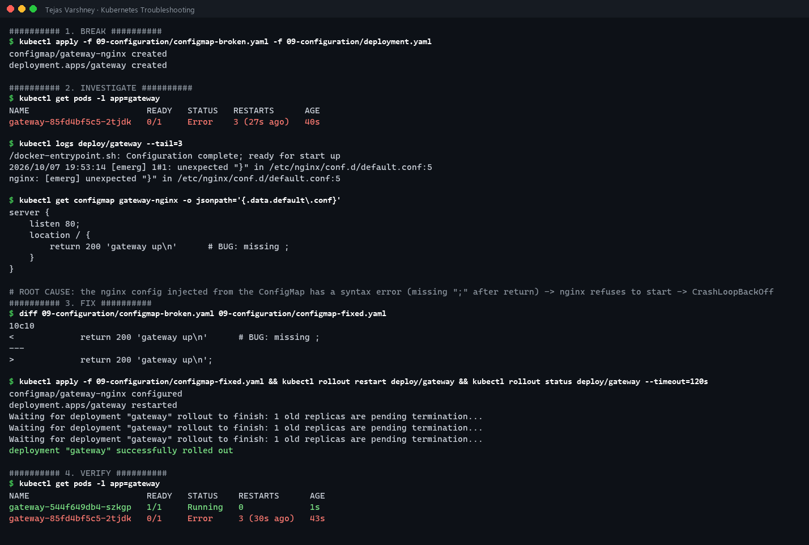
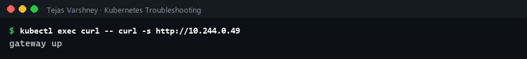

<details><summary>Text output</summary>

```text
########## 1. BREAK ##########
$ kubectl apply -f 09-configuration/configmap-broken.yaml -f 09-configuration/deployment.yaml
configmap/gateway-nginx created
deployment.apps/gateway created

########## 2. INVESTIGATE ##########
$ kubectl get pods -l app=gateway
NAME                       READY   STATUS   RESTARTS      AGE
gateway-85fd4bf5c5-2tjdk   0/1     Error    3 (27s ago)   40s

$ kubectl logs deploy/gateway --tail=3
/docker-entrypoint.sh: Configuration complete; ready for start up
2026/10/07 19:53:14 [emerg] 1#1: unexpected "}" in /etc/nginx/conf.d/default.conf:5
nginx: [emerg] unexpected "}" in /etc/nginx/conf.d/default.conf:5

$ kubectl get configmap gateway-nginx -o jsonpath='{.data.default\.conf}'
server {
    listen 80;
    location / {
        return 200 'gateway up\n'      # BUG: missing ;
    }
}

# ROOT CAUSE: the nginx config injected from the ConfigMap has a syntax error (missing ";" after return) -> nginx refuses to start -> CrashLoopBackOff
########## 3. FIX ##########
$ diff 09-configuration/configmap-broken.yaml 09-configuration/configmap-fixed.yaml
10c10
<             return 200 'gateway up\n'      # BUG: missing ;
---
>             return 200 'gateway up\n';

$ kubectl apply -f 09-configuration/configmap-fixed.yaml && kubectl rollout restart deploy/gateway && kubectl rollout status deploy/gateway --timeout=120s
configmap/gateway-nginx configured
deployment.apps/gateway restarted
Waiting for deployment "gateway" rollout to finish: 1 old replicas are pending termination...
Waiting for deployment "gateway" rollout to finish: 1 old replicas are pending termination...
Waiting for deployment "gateway" rollout to finish: 1 old replicas are pending termination...
deployment "gateway" successfully rolled out

########## 4. VERIFY ##########
$ kubectl get pods -l app=gateway
NAME                       READY   STATUS    RESTARTS      AGE
gateway-544f649db4-szkgp   1/1     Running   0             1s
gateway-85fd4bf5c5-2tjdk   0/1     Error     3 (30s ago)   43s

$ kubectl exec curl -- curl -s http://10.244.0.49
gateway up
```

</details>

**Process:** the CrashLoop logs pointed at the exact file and line (`default.conf:5`). The ConfigMap content showed the `return` directive missing its `;`. After fixing the ConfigMap, the Pod needed a `rollout restart` because nginx only reads config at start. A safer pattern is to validate config in CI (`nginx -t`) or with an init container.

---

## Task 3 – Mini project

The instructor's scenario ([03-mini-project](03-mini-project)): an nginx Deployment + Service, a broken Pod, and a Service selector challenge.

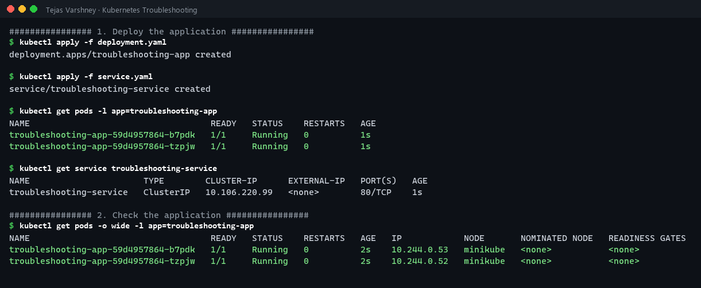
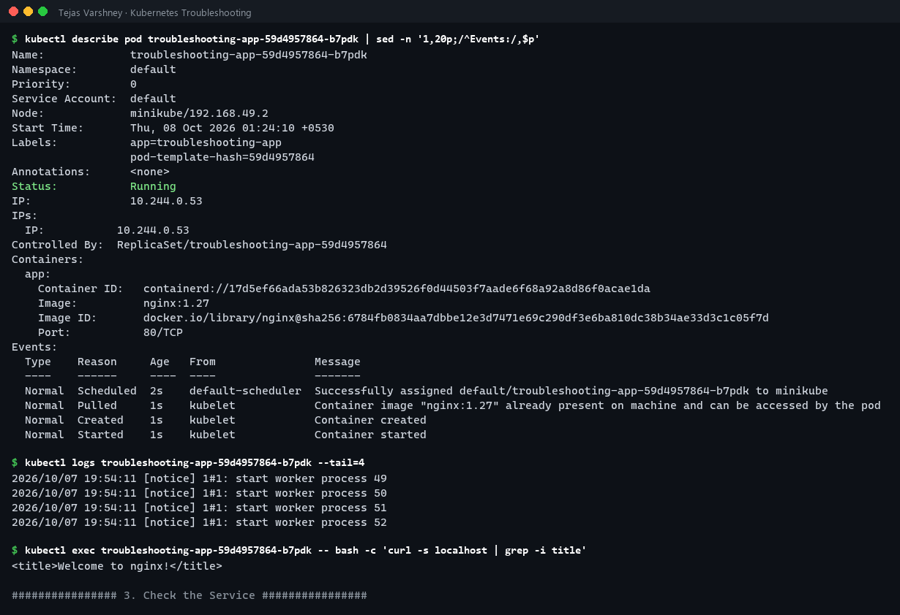
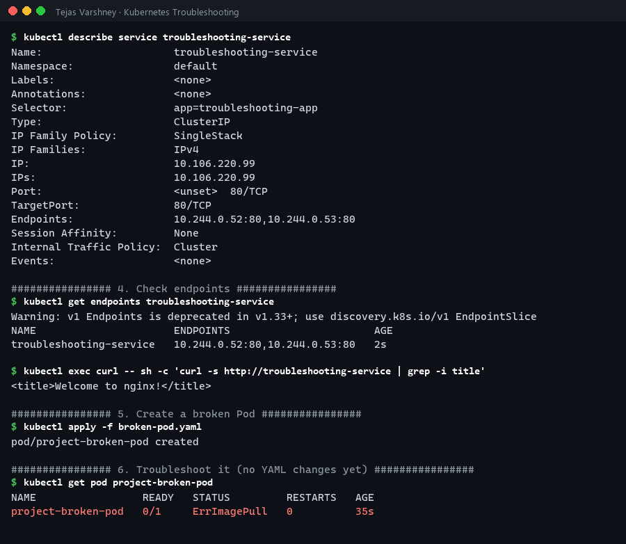
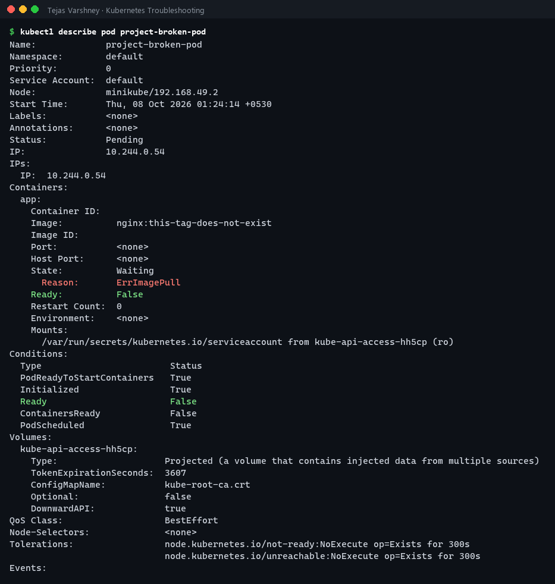
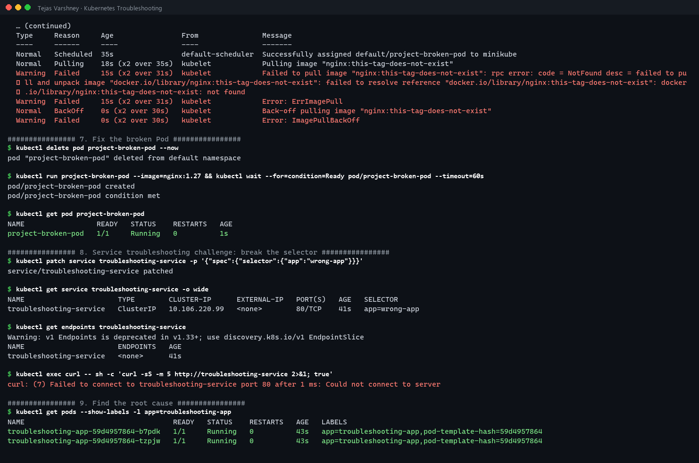
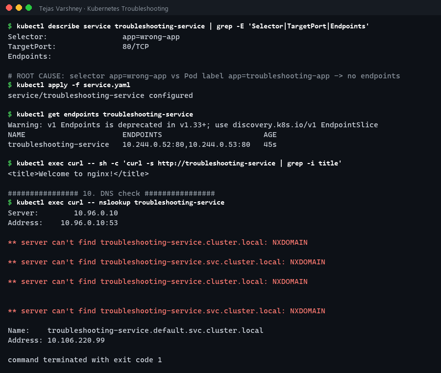

<details><summary>Text output</summary>

```text
################ 1. Deploy the application ################
$ kubectl apply -f deployment.yaml
deployment.apps/troubleshooting-app created

$ kubectl apply -f service.yaml
service/troubleshooting-service created

$ kubectl get pods -l app=troubleshooting-app
NAME                                   READY   STATUS    RESTARTS   AGE
troubleshooting-app-59d4957864-b7pdk   1/1     Running   0          1s
troubleshooting-app-59d4957864-tzpjw   1/1     Running   0          1s

$ kubectl get service troubleshooting-service
NAME                      TYPE        CLUSTER-IP      EXTERNAL-IP   PORT(S)   AGE
troubleshooting-service   ClusterIP   10.106.220.99   <none>        80/TCP    1s

################ 2. Check the application ################
$ kubectl get pods -o wide -l app=troubleshooting-app
NAME                                   READY   STATUS    RESTARTS   AGE   IP            NODE       NOMINATED NODE   READINESS GATES
troubleshooting-app-59d4957864-b7pdk   1/1     Running   0          2s    10.244.0.53   minikube   <none>           <none>
troubleshooting-app-59d4957864-tzpjw   1/1     Running   0          2s    10.244.0.52   minikube   <none>           <none>

$ kubectl describe pod troubleshooting-app-59d4957864-b7pdk | sed -n '1,20p;/^Events:/,$p'
Name:             troubleshooting-app-59d4957864-b7pdk
Namespace:        default
Priority:         0
Service Account:  default
Node:             minikube/192.168.49.2
Start Time:       Thu, 08 Oct 2026 01:24:10 +0530
Labels:           app=troubleshooting-app
                  pod-template-hash=59d4957864
Annotations:      <none>
Status:           Running
IP:               10.244.0.53
IPs:
  IP:           10.244.0.53
Controlled By:  ReplicaSet/troubleshooting-app-59d4957864
Containers:
  app:
    Container ID:   containerd://17d5ef66ada53b826323db2d39526f0d44503f7aade6f68a92a8d86f0acae1da
    Image:          nginx:1.27
    Image ID:       docker.io/library/nginx@sha256:6784fb0834aa7dbbe12e3d7471e69c290df3e6ba810dc38b34ae33d3c1c05f7d
    Port:           80/TCP
Events:
  Type    Reason     Age   From               Message
  ----    ------     ----  ----               -------
  Normal  Scheduled  2s    default-scheduler  Successfully assigned default/troubleshooting-app-59d4957864-b7pdk to minikube
  Normal  Pulled     1s    kubelet            Container image "nginx:1.27" already present on machine and can be accessed by the pod
  Normal  Created    1s    kubelet            Container created
  Normal  Started    1s    kubelet            Container started

$ kubectl logs troubleshooting-app-59d4957864-b7pdk --tail=4
2026/10/07 19:54:11 [notice] 1#1: start worker process 49
2026/10/07 19:54:11 [notice] 1#1: start worker process 50
2026/10/07 19:54:11 [notice] 1#1: start worker process 51
2026/10/07 19:54:11 [notice] 1#1: start worker process 52

$ kubectl exec troubleshooting-app-59d4957864-b7pdk -- bash -c 'curl -s localhost | grep -i title'
<title>Welcome to nginx!</title>

################ 3. Check the Service ################
$ kubectl describe service troubleshooting-service
Name:                     troubleshooting-service
Namespace:                default
Labels:                   <none>
Annotations:              <none>
Selector:                 app=troubleshooting-app
Type:                     ClusterIP
IP Family Policy:         SingleStack
IP Families:              IPv4
IP:                       10.106.220.99
IPs:                      10.106.220.99
Port:                     <unset>  80/TCP
TargetPort:               80/TCP
Endpoints:                10.244.0.52:80,10.244.0.53:80
Session Affinity:         None
Internal Traffic Policy:  Cluster
Events:                   <none>

################ 4. Check endpoints ################
$ kubectl get endpoints troubleshooting-service
Warning: v1 Endpoints is deprecated in v1.33+; use discovery.k8s.io/v1 EndpointSlice
NAME                      ENDPOINTS                       AGE
troubleshooting-service   10.244.0.52:80,10.244.0.53:80   2s

$ kubectl exec curl -- sh -c 'curl -s http://troubleshooting-service | grep -i title'
<title>Welcome to nginx!</title>

################ 5. Create a broken Pod ################
$ kubectl apply -f broken-pod.yaml
pod/project-broken-pod created

################ 6. Troubleshoot it (no YAML changes yet) ################
$ kubectl get pod project-broken-pod
NAME                 READY   STATUS         RESTARTS   AGE
project-broken-pod   0/1     ErrImagePull   0          35s

$ kubectl describe pod project-broken-pod
Name:             project-broken-pod
Namespace:        default
Priority:         0
Service Account:  default
Node:             minikube/192.168.49.2
Start Time:       Thu, 08 Oct 2026 01:24:14 +0530
Labels:           <none>
Annotations:      <none>
Status:           Pending
IP:               10.244.0.54
IPs:
  IP:  10.244.0.54
Containers:
  app:
    Container ID:   
    Image:          nginx:this-tag-does-not-exist
    Image ID:       
    Port:           <none>
    Host Port:      <none>
    State:          Waiting
      Reason:       ErrImagePull
    Ready:          False
    Restart Count:  0
    Environment:    <none>
    Mounts:
      /var/run/secrets/kubernetes.io/serviceaccount from kube-api-access-hh5cp (ro)
Conditions:
  Type                        Status
  PodReadyToStartContainers   True 
  Initialized                 True 
  Ready                       False 
  ContainersReady             False 
  PodScheduled                True 
Volumes:
  kube-api-access-hh5cp:
    Type:                    Projected (a volume that contains injected data from multiple sources)
    TokenExpirationSeconds:  3607
    ConfigMapName:           kube-root-ca.crt
    Optional:                false
    DownwardAPI:             true
QoS Class:                   BestEffort
Node-Selectors:              <none>
Tolerations:                 node.kubernetes.io/not-ready:NoExecute op=Exists for 300s
                             node.kubernetes.io/unreachable:NoExecute op=Exists for 300s
Events:
  Type     Reason     Age                From               Message
  ----     ------     ----               ----               -------
  Normal   Scheduled  35s                default-scheduler  Successfully assigned default/project-broken-pod to minikube
  Normal   Pulling    18s (x2 over 35s)  kubelet            Pulling image "nginx:this-tag-does-not-exist"
  Warning  Failed     15s (x2 over 31s)  kubelet            Failed to pull image "nginx:this-tag-does-not-exist": rpc error: code = NotFound desc = failed to pull and unpack image "docker.io/library/nginx:this-tag-does-not-exist": failed to resolve reference "docker.io/library/nginx:this-tag-does-not-exist": docker.io/library/nginx:this-tag-does-not-exist: not found
  Warning  Failed     15s (x2 over 31s)  kubelet            Error: ErrImagePull
  Normal   BackOff    0s (x2 over 30s)   kubelet            Back-off pulling image "nginx:this-tag-does-not-exist"
  Warning  Failed     0s (x2 over 30s)   kubelet            Error: ImagePullBackOff

################ 7. Fix the broken Pod ################
$ kubectl delete pod project-broken-pod --now
pod "project-broken-pod" deleted from default namespace

$ kubectl run project-broken-pod --image=nginx:1.27 && kubectl wait --for=condition=Ready pod/project-broken-pod --timeout=60s
pod/project-broken-pod created
pod/project-broken-pod condition met

$ kubectl get pod project-broken-pod
NAME                 READY   STATUS    RESTARTS   AGE
project-broken-pod   1/1     Running   0          1s

################ 8. Service troubleshooting challenge: break the selector ################
$ kubectl patch service troubleshooting-service -p '{"spec":{"selector":{"app":"wrong-app"}}}'
service/troubleshooting-service patched

$ kubectl get service troubleshooting-service -o wide
NAME                      TYPE        CLUSTER-IP      EXTERNAL-IP   PORT(S)   AGE   SELECTOR
troubleshooting-service   ClusterIP   10.106.220.99   <none>        80/TCP    41s   app=wrong-app

$ kubectl get endpoints troubleshooting-service
Warning: v1 Endpoints is deprecated in v1.33+; use discovery.k8s.io/v1 EndpointSlice
NAME                      ENDPOINTS   AGE
troubleshooting-service   <none>      41s

$ kubectl exec curl -- sh -c 'curl -sS -m 5 http://troubleshooting-service 2>&1; true'
curl: (7) Failed to connect to troubleshooting-service port 80 after 1 ms: Could not connect to server

################ 9. Find the root cause ################
$ kubectl get pods --show-labels -l app=troubleshooting-app
NAME                                   READY   STATUS    RESTARTS   AGE   LABELS
troubleshooting-app-59d4957864-b7pdk   1/1     Running   0          43s   app=troubleshooting-app,pod-template-hash=59d4957864
troubleshooting-app-59d4957864-tzpjw   1/1     Running   0          43s   app=troubleshooting-app,pod-template-hash=59d4957864

$ kubectl describe service troubleshooting-service | grep -E 'Selector|TargetPort|Endpoints'
Selector:                 app=wrong-app
TargetPort:               80/TCP
Endpoints:                

# ROOT CAUSE: selector app=wrong-app vs Pod label app=troubleshooting-app -> no endpoints
$ kubectl apply -f service.yaml
service/troubleshooting-service configured

$ kubectl get endpoints troubleshooting-service
Warning: v1 Endpoints is deprecated in v1.33+; use discovery.k8s.io/v1 EndpointSlice
NAME                      ENDPOINTS                       AGE
troubleshooting-service   10.244.0.52:80,10.244.0.53:80   45s

$ kubectl exec curl -- sh -c 'curl -s http://troubleshooting-service | grep -i title'
<title>Welcome to nginx!</title>

################ 10. DNS check ################
$ kubectl exec curl -- nslookup troubleshooting-service
Server:		10.96.0.10
Address:	10.96.0.10:53

** server can't find troubleshooting-service.cluster.local: NXDOMAIN

** server can't find troubleshooting-service.svc.cluster.local: NXDOMAIN

** server can't find troubleshooting-service.cluster.local: NXDOMAIN


** server can't find troubleshooting-service.svc.cluster.local: NXDOMAIN

Name:	troubleshooting-service.default.svc.cluster.local
Address: 10.106.220.99

command terminated with exit code 1
```

</details>

### Answers for the broken Pod
1. **What is the Pod status?** `ErrImagePull`, which then alternates with `ImagePullBackOff`. READY `0/1`.
2. **What is the actual error?** `failed to resolve reference "docker.io/library/nginx:this-tag-does-not-exist": not found`.
3. **Which command helped find the reason?** `kubectl describe pod project-broken-pod` (the Events section).
4. **What is wrong with the image?** The tag `this-tag-does-not-exist` isn't published for `nginx` on Docker Hub.
5. **How would you fix it?** Use a real tag (`nginx:1.27`) and recreate the Pod (Pods are immutable, so delete it and apply again).

### Troubleshooting table

| Problem | What I saw | Command I used | Root cause | Fix |
| :--- | :--- | :--- | :--- | :--- |
| **Broken Pod** | `0/1 ErrImagePull` | `kubectl get pod`, `kubectl describe pod` | Image tag doesn't exist | Recreate with `nginx:1.27` |
| **Service problem** | `curl` → connection refused; Endpoints `<none>` | `kubectl get endpoints`, `kubectl describe service`, `kubectl get pods --show-labels` | Selector `app=wrong-app` ≠ label `app=troubleshooting-app` | Restore the selector (`kubectl apply -f service.yaml`) |
| **Image problem** | `Back-off pulling image` events | `kubectl describe pod` (Events) | Wrong/non-existent tag (also: private registry without `imagePullSecrets`) | Correct the image reference |

### README questions
1. **What does `kubectl get` tell us?** A one-line status per object: for Pods that's READY containers, STATUS (phase or waiting reason), RESTARTS and AGE. It's the "what is happening" view, and with `-o wide/yaml/jsonpath` it shows IPs, nodes and any field.
2. **Difference between `get` and `describe`?** `get` is a compact table (or raw YAML). `describe` is a detailed, human-readable report that combines the object's spec and status with related information, especially **Events**, container states, exit codes, probes and mounts. `get` tells me *that* something is wrong; `describe` usually tells me *why*.
3. **Why use `kubectl logs`?** To read what the application itself printed (stdout/stderr): stack traces, config errors, "FATAL: DB_HOST is not set". `--previous` shows the logs of the container that just crashed.
4. **When use `kubectl exec`?** When the container is running and I need to test from inside: `curl localhost` (is the app up?), check env vars, mounted files and `/etc/resolv.conf`, run `nslookup`. For distroless or crashed containers, use `kubectl debug` (ephemeral container) instead.
5. **What does `CrashLoopBackOff` mean?** The container starts, exits (crash, or just finishes), and kubelet restarts it under `restartPolicy: Always`, waiting longer each time (back-off up to 5 min). The cause is inside the app or its config, so check `logs --previous` and the exit code.
6. **What does `ImagePullBackOff` mean?** kubelet couldn't pull the image (wrong name/tag, missing registry credentials, registry unreachable, rate limit) and is backing off between retries. The first failure shows as `ErrImagePull`.
7. **Why can a Pod remain `Pending`?** The scheduler can't find a node: not enough CPU/memory, nodeSelector/affinity doesn't match, taints without tolerations, an unbound PVC, or too many Pods per node. It can also be Pending while images are still being pulled.
8. **Why can a Service have no endpoints?** Its selector matches no Pods (typo or wrong labels), the matching Pods aren't **Ready** (failing readiness probe, as in Session 13's bonus challenge), the Pods are in another namespace, or there are simply zero replicas.
9. **Relationship between a Service selector and Pod labels?** The Service has no fixed list of Pods. The EndpointSlice controller continuously selects every Ready Pod **in the same namespace** whose labels match the Service's `selector`, and publishes their IPs as endpoints. Change the labels or the selector and the traffic target changes, which is how blue-green switching works (Session 10).
10. **What is Kubernetes DNS?** CoreDNS, running in `kube-system` behind the `kube-dns` Service (`10.96.0.10`). kubelet puts it into every Pod's `/etc/resolv.conf`. It answers `<service>.<namespace>.svc.cluster.local` with the ClusterIP (or Pod IPs for headless Services), so apps find each other by name. See the CoreDNS notes in [Session 11](../Kubernetes%20Services/coredns/README.md).
