# Linux Fundamentals Guide

This directory contains key Linux operating system commands, file management techniques, permission structures, process monitoring tools, and administrative utilities.

---

## Table of Contents

1. [System Information & Architecture](#1-system-information--architecture)
2. [File System Navigation](#2-file-system-navigation)
3. [File & Directory Management](#3-file--directory-management)
4. [Searching & Filtering](#4-searching--filtering)
5. [File Permissions & Ownership](#5-file-permissions--ownership)
6. [Process Management & Monitoring](#6-process-management--monitoring)
7. [User & Group Management](#7-user--group-management)
8. [Package Management](#8-package-management)

---

## 1. System Information & Architecture

Inspect Linux kernel versions, system uptime, and hardware architecture details.

```bash
uname -a
hostnamectl
uptime
df -h
free -m
```

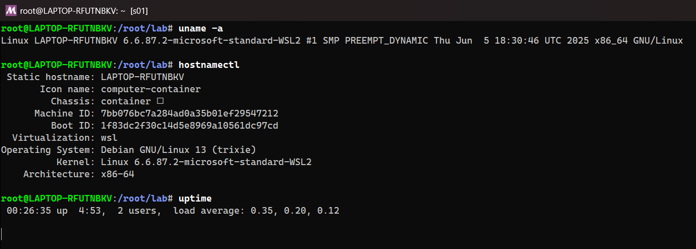
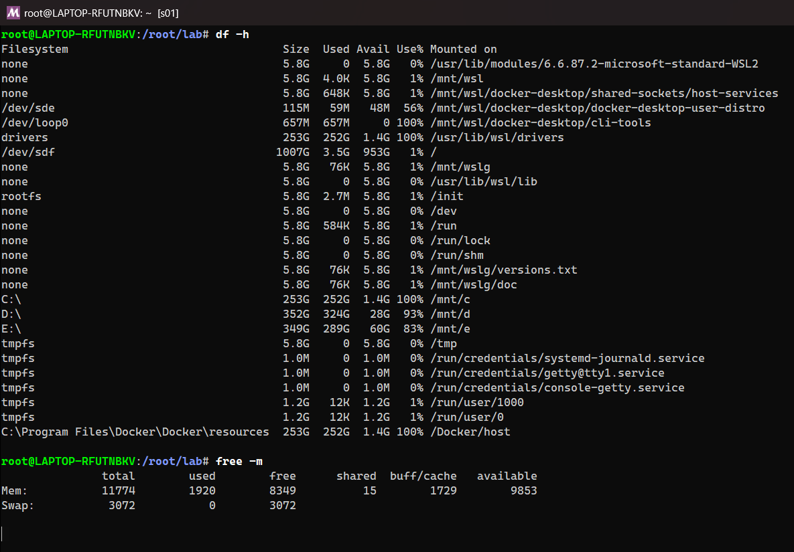


---

## 2. File System Navigation

Navigate the Linux directory tree and inspect directory contents.

```bash
pwd
ls -la
ls -lh
cd /var/log
cd ~
cd ..
```

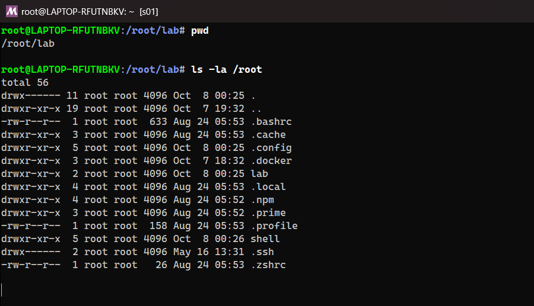
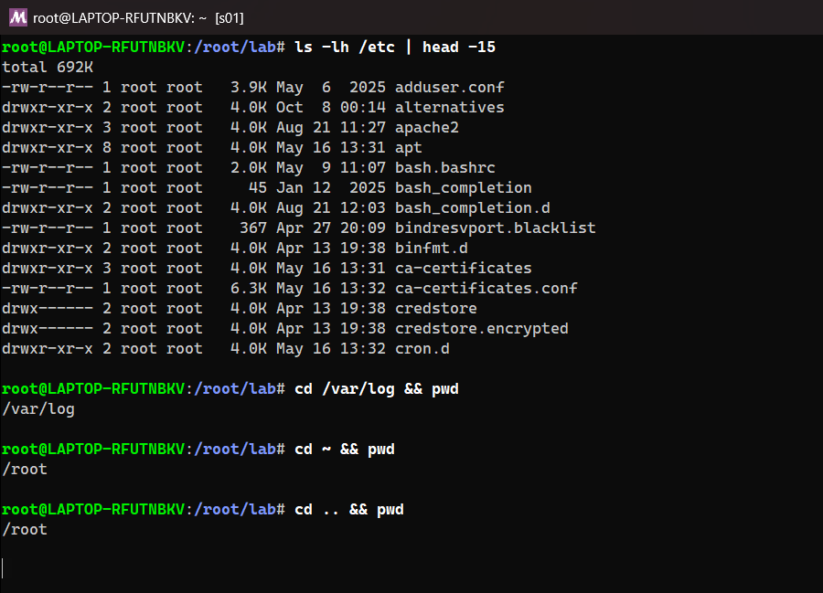


---

## 3. File & Directory Management

Create, copy, move, view, and remove files and directories.

```bash
mkdir -p project/src
touch project/src/app.js
cp project/src/app.js project/src/app.bak.js
mv project/src/app.bak.js project/
cat project/src/app.js
head -n 10 /var/log/syslog
tail -n 20 -f /var/log/syslog
rm project/app.bak.js
rm -rf project
```

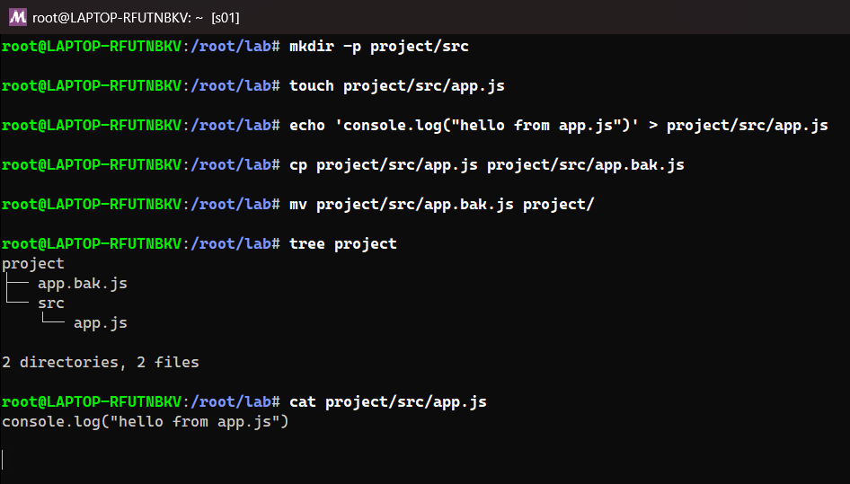
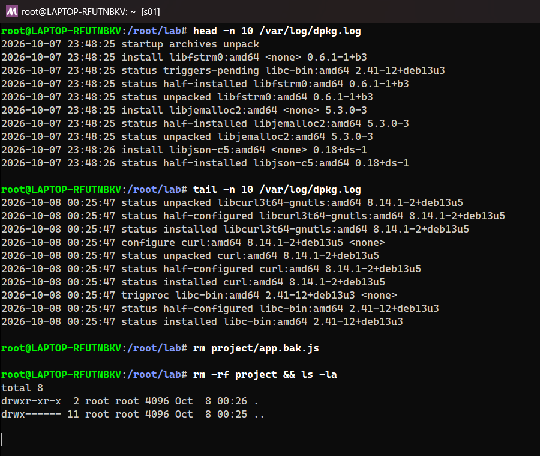


---

## 4. Searching & Filtering

Locate files and search through text data using pattern matching tools.

```bash
find /var/log -name "*.log"
find . -type f -size +10M
grep -i "error" /var/log/syslog
grep -rn "TODO" src/
awk '{print $1, $5}' /var/log/auth.log
sed -i 's/http/https/g' config.txt
```

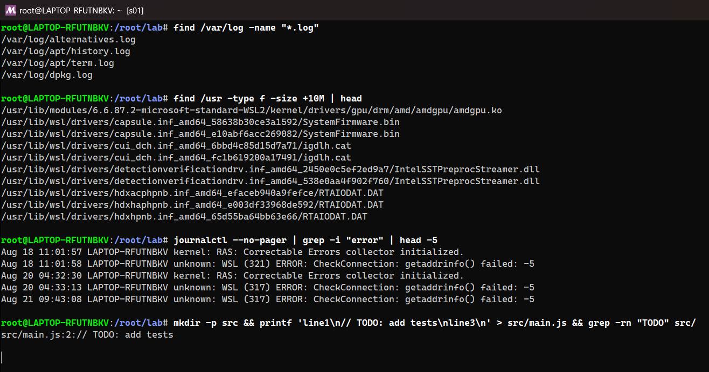
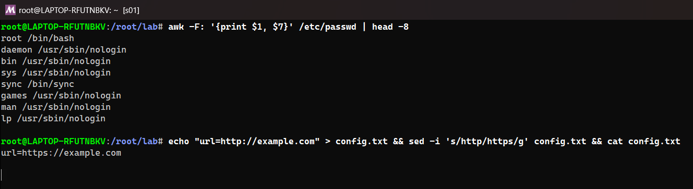


---

## 5. File Permissions & Ownership

Manage file access modes (read, write, execute) and owner/group assignments.

```bash
chmod 755 script.sh
chmod +x script.sh
chmod -R 644 /var/www/html
chown john:developers file.txt
chown -R www-data:www-data /var/www/html
```

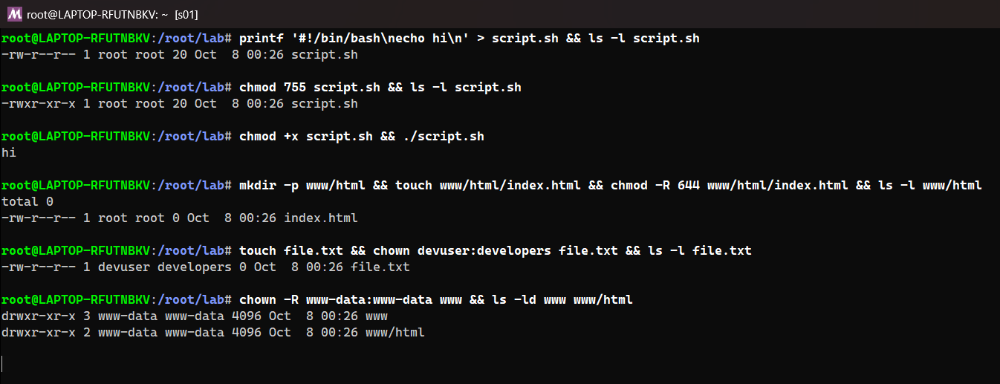


---

## 6. Process Management & Monitoring

Monitor system resources, view running processes, and send termination signals.

```bash
ps aux
ps -ef | grep nginx
top
htop
kill 1234
kill -9 1234
pkill -f python
```

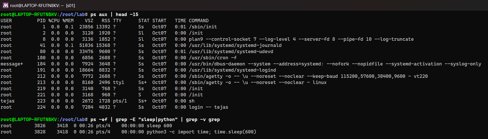
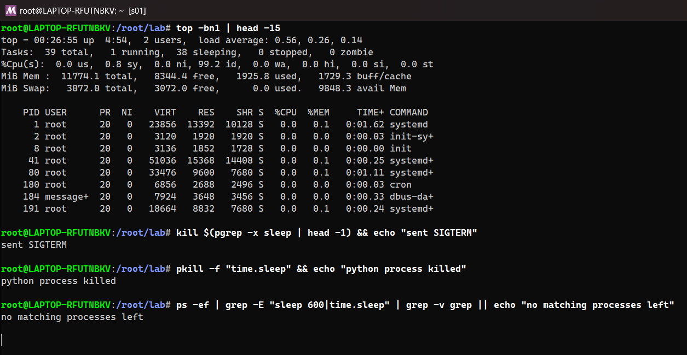


---

## 7. User & Group Management

Create and manage system user accounts, passwords, and group memberships.

```bash
useradd -m -s /bin/bash devuser
passwd devuser
usermod -aG sudo devuser
groupadd developers
usermod -aG developers devuser
id devuser
userdel -r devuser
```

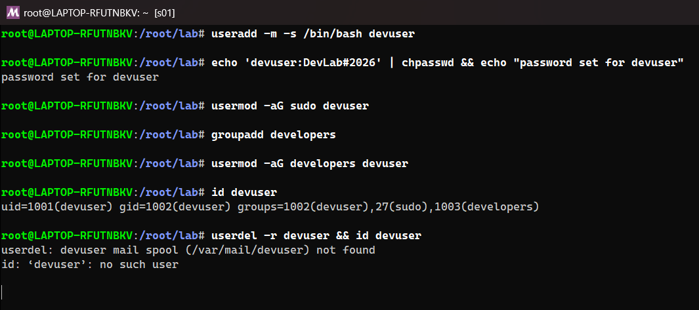


---

## 8. Package Management

Install, update, and remove software packages across Ubuntu/Debian (`apt`) and RHEL/CentOS (`yum`/`dnf`).

```bash
sudo apt update && sudo apt upgrade -y
sudo apt install -y curl git nginx
sudo apt remove --purge nginx -y
sudo dnf check-update
sudo dnf install -y htop
```

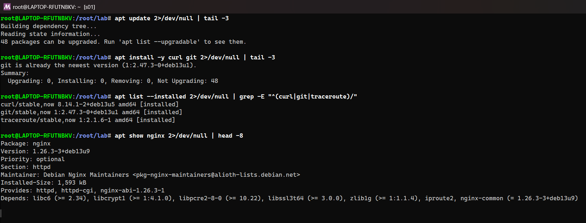


---

## 9. Homework Tasks

### Task 1: Soft Link & Hard Link

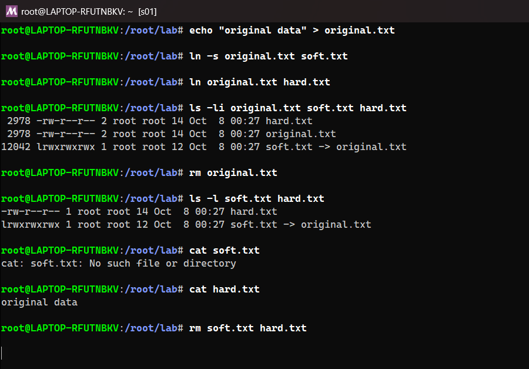


| | Soft (symbolic) link | Hard link |
|---|---|---|
| Command | `ln -s target link` | `ln target link` |
| What it is | A small file that stores the **path** to the target | Another **name** for the same inode (same data on disk) |
| Inode | Different inode from the target | **Same inode** as the target (see `ls -li`) |
| If the original is deleted | Link breaks ("dangling", `No such file or directory`) | Data is still there; it's only removed when the last hard link is deleted |
| Directories / other filesystems | Can point to directories and across filesystems | Files only, same filesystem only |

**Interview answer:** a hard link is a second directory entry for the same inode, and a soft link is a pointer to a path. That's why deleting the original breaks the soft link but not the hard link, as shown below: `cat soft.txt` fails and `cat hard.txt` still prints the data.

### Task 2: adduser vs useradd

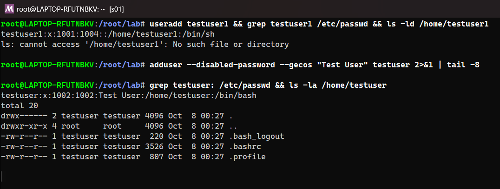


- **`useradd`** is the low-level binary that ships with every distro. With no options it creates the user only: **no home directory**, no password, and the default shell `/bin/sh` on Debian. You pass everything as flags (`-m -s /bin/bash -G ...`).
- **`adduser`** is a friendly Perl wrapper on Debian/Ubuntu that calls `useradd`. It creates the home directory, copies `/etc/skel`, creates a group, sets the shell to `/bin/bash`, and asks for a password and user info.
- **On Ubuntu/Debian, `adduser` is recommended** for creating people's accounts interactively. `useradd` is preferred in scripts and Dockerfiles, and on RHEL-based systems, where `adduser` is just a link to `useradd`.

Below, `useradd testuser1` created no `/home/testuser1`, while `adduser testuser` created a populated home directory with `.bashrc` and `.profile`.

### Task 3: journalctl

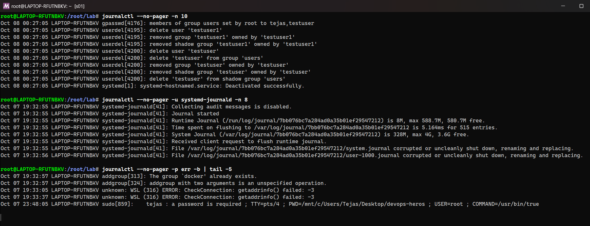
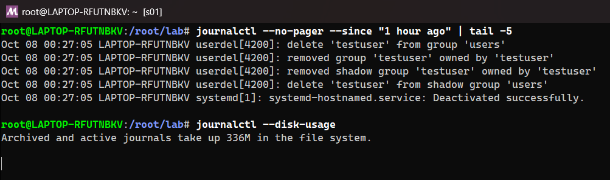


`journalctl` reads the **systemd journal**: the central, binary, indexed log of the kernel, systemd and every service.

| Command | Purpose |
|---|---|
| `journalctl -n 10` | Last 10 log lines |
| `journalctl -u <service>` | Logs of one service (here `systemd-journald`; e.g. `-u nginx`, `-u ssh`) |
| `journalctl -f` | Follow live, like `tail -f` |
| `journalctl -p err -b` | Only errors since the current boot |
| `journalctl --since "1 hour ago"` | Time filter |
| `journalctl --disk-usage` | How much space the journal uses |

### Task 4: Linux Command Cheat Sheet

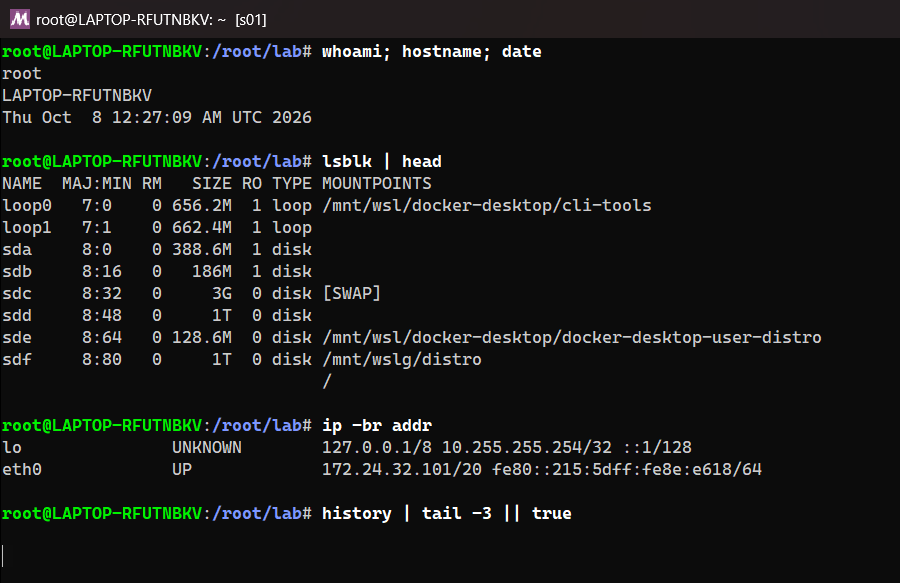


I practised the commands from the cheat sheet in sections 1–8 above (all run in my WSL Debian terminal). A few more everyday ones are below.
