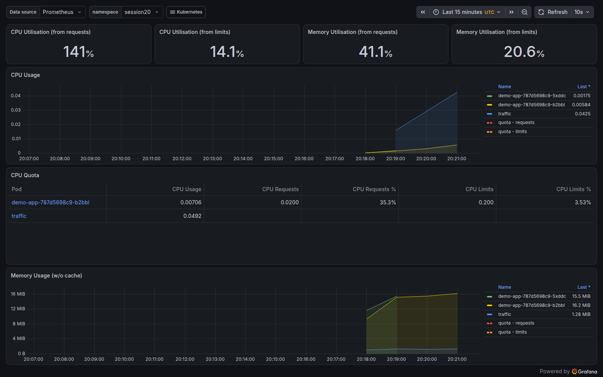
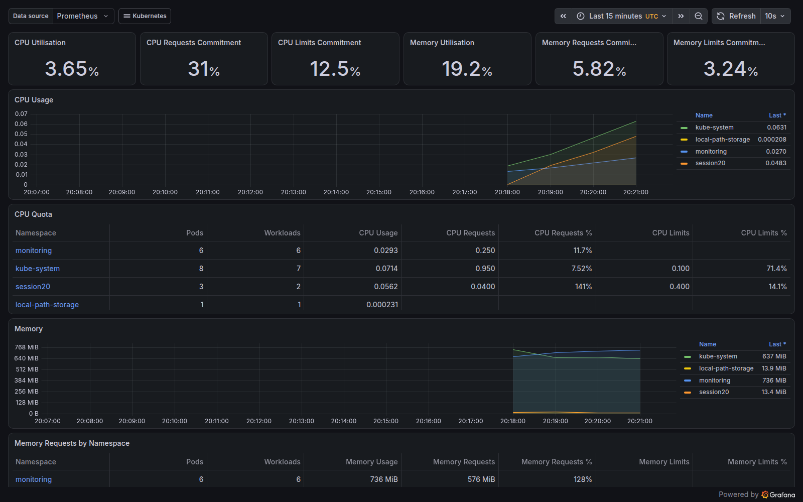
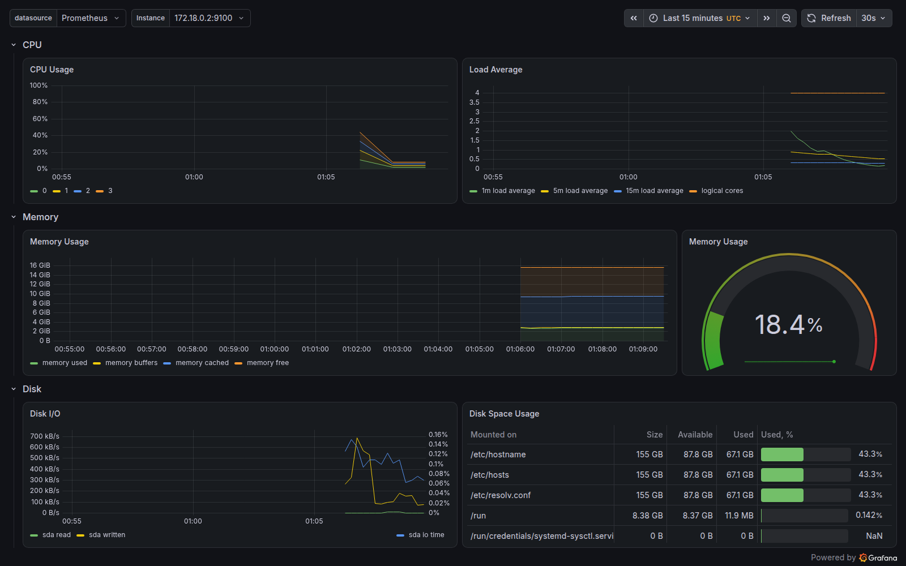
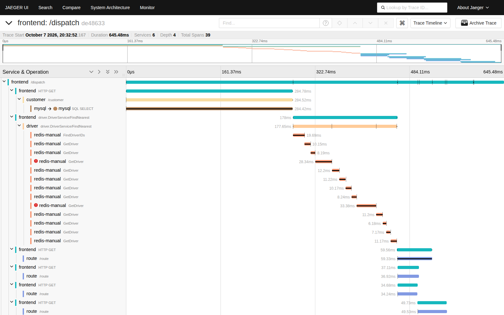

# Session 20: Monitoring, Observability & GitOps

**Name:** Tejas Varshney

Everything below ran on a real Kubernetes cluster (**kind**, created inside a GitHub Actions runner) by [.github/workflows/session20-observability-gitops.yml](../.github/workflows/session20-observability-gitops.yml). The scripts are [scripts/run-demo.sh](scripts/run-demo.sh) and [scripts/gitops-git-change.sh](scripts/gitops-git-change.sh). All command output and the screenshots were committed back to [outputs/](outputs). (My laptop didn't have enough free disk space for Prometheus + Grafana + Argo CD in minikube, so the pipeline's runner did the work.)

```text
GitHub Actions run: https://github.com/TejasVarshney/devops-heros/actions/runs/37682033614
runner: ubuntu24
kind v0.22.0 go1.20.13 linux/amd64
Client Version: v1.29.3
Kustomize Version: v5.0.4-0.20230601165947-6ce0bf390ce3
v3.22.0+g144ca65
Wed Oct  7 20:35:14 UTC 2026
```

| Deliverable | Where |
|---|---|
| Monitoring demo | [monitoring/](monitoring): kube-prometheus-stack values, instrumented app + ServiceMonitor, alert rules → **Task 1** |
| Observability documentation | **Task 2** below, plus tracing manifests in [observability/](observability) |
| GitOps demo | [gitops/](gitops): Argo CD Application + app manifests (from my [devops-argocd-tutorial](https://github.com/TejasVarshney/devops-argocd-tutorial) repo) → **Task 3** |
| Screenshots | Grafana and Jaeger, below |

---

# Task 1 – Monitoring

**Stack:** `kube-prometheus-stack` (Helm) = **Prometheus** (scrapes and stores metrics, evaluates alert rules) + **Alertmanager** (groups and routes alerts) + **Grafana** (dashboards) + **node-exporter** (node CPU/memory/disk) + **kube-state-metrics** (Kubernetes object state, e.g. available replicas) + the **Prometheus Operator** (turns `ServiceMonitor` / `PrometheusRule` CRDs into Prometheus config).

**App:** [`demo-app.yaml`](monitoring/demo-app.yaml) runs `prometheus-example-app`, which exposes `http_requests_total{code,method}` on `/metrics`. A **ServiceMonitor** tells Prometheus to scrape it every 15s. A traffic Pod sends requests to `/` (200) and `/err` (404).

**Alerts:** [`alerts.yaml`](monitoring/alerts.yaml) defines three `PrometheusRule` alerts: `DemoAppReplicasLow` (available replicas < 2 for 30s), `DemoAppHighRequestRate` (> 5 req/s), `DemoAppHighMemory` (> 50Mi per Pod).

```text
################ install kube-prometheus-stack (Prometheus, Alertmanager, Grafana, node-exporter, kube-state-metrics) ################
$ helm repo add prometheus-community https://prometheus-community.github.io/helm-charts && helm repo update
"prometheus-community" has been added to your repositories
Hang tight while we grab the latest from your chart repositories...
...Successfully got an update from the "prometheus-community" chart repository
Update Complete. ⎈Happy Helming!⎈

$ helm install kps prometheus-community/kube-prometheus-stack -n monitoring --create-namespace -f monitoring/kps-values.yaml --wait --timeout 10m
NAME: kps
LAST DEPLOYED: Wed Oct  7 20:27:48 2026
NAMESPACE: monitoring
STATUS: deployed
REVISION: 1
NOTES:
kube-prometheus-stack has been installed. Check its status by running:
  kubectl --namespace monitoring get pods -l "release=kps"

Get Grafana 'admin' user password by running:

  kubectl --namespace monitoring get secrets kps-grafana -o jsonpath="{.data.admin-password}" | base64 -d ; echo

Access Grafana local instance:

  export POD_NAME=$(kubectl --namespace monitoring get pod -l "app.kubernetes.io/name=grafana,app.kubernetes.io/instance=kps" -oname)
  kubectl --namespace monitoring port-forward $POD_NAME 3000

Get your grafana admin user password by running:

  kubectl get secret --namespace monitoring -l app.kubernetes.io/component=admin-secret -o jsonpath="{.items[0].data.admin-password}" | base64 --decode ; echo


Visit https://github.com/prometheus-operator/kube-prometheus for instructions on how to create & configure Alertmanager and Prometheus instances using the Operator.

$ kubectl get pods -n monitoring
NAME                                      READY   STATUS    RESTARTS   AGE
alertmanager-kps-alertmanager-0           2/2     Running   0          40s
kps-grafana-7bc98b4bc5-29dpn              3/3     Running   0          48s
kps-kube-state-metrics-7cf7845df4-zp5zn   1/1     Running   0          48s
kps-operator-5f8bff94d8-94kp5             1/1     Running   0          48s
kps-prometheus-node-exporter-z55sk        1/1     Running   0          48s
prometheus-kps-prometheus-0               2/2     Running   0          39s

$ kubectl get svc -n monitoring
NAME                           TYPE        CLUSTER-IP      EXTERNAL-IP   PORT(S)                      AGE
alertmanager-operated          ClusterIP   None            <none>        9093/TCP,9094/TCP,9094/UDP   40s
kps-alertmanager               ClusterIP   10.96.111.28    <none>        9093/TCP,8080/TCP            48s
kps-grafana                    ClusterIP   10.96.135.172   <none>        80/TCP                       48s
kps-kube-state-metrics         ClusterIP   10.96.1.188     <none>        8080/TCP                     48s
kps-operator                   ClusterIP   10.96.61.67     <none>        443/TCP                      48s
kps-prometheus                 ClusterIP   10.96.106.73    <none>        9090/TCP,8080/TCP            48s
kps-prometheus-node-exporter   ClusterIP   10.96.240.67    <none>        9100/TCP                     48s
prometheus-operated            ClusterIP   None            <none>        9090/TCP                     40s

################ deploy an instrumented app + ServiceMonitor + alert rules ################
$ kubectl apply -f monitoring/demo-app.yaml && kubectl apply -f monitoring/alerts.yaml
namespace/session20 created
deployment.apps/demo-app created
service/demo-app created
servicemonitor.monitoring.coreos.com/demo-app created
prometheusrule.monitoring.coreos.com/demo-app-alerts created

$ kubectl -n session20 rollout status deploy/demo-app --timeout=120s
Waiting for deployment "demo-app" rollout to finish: 0 of 2 updated replicas are available...
Waiting for deployment "demo-app" rollout to finish: 1 of 2 updated replicas are available...
deployment "demo-app" successfully rolled out

$ kubectl get pods,svc,servicemonitor,prometheusrule -n session20
NAME                            READY   STATUS    RESTARTS   AGE
pod/demo-app-787d5698c9-875pb   1/1     Running   0          5s
pod/demo-app-787d5698c9-lx97d   1/1     Running   0          5s

NAME               TYPE        CLUSTER-IP     EXTERNAL-IP   PORT(S)   AGE
service/demo-app   ClusterIP   10.96.95.158   <none>        80/TCP    5s

NAME                                            AGE
servicemonitor.monitoring.coreos.com/demo-app   5s

NAME                                                   AGE
prometheusrule.monitoring.coreos.com/demo-app-alerts   4s

$ curl -s localhost:8081/ ; curl -s localhost:8081/err >/dev/null; curl -s localhost:8081/metrics | grep -E '^# (HELP|TYPE) http_requests_total|^http_requests_total|^version'
Hello from example application.# HELP http_requests_total Count of all HTTP requests
# TYPE http_requests_total counter
http_requests_total{code="200",method="get"} 2
http_requests_total{code="404",method="get"} 1
version{version="v0.5.0"} 1

################ generate traffic ################
pod/traffic created
################ Prometheus: targets ################
$ curl -s localhost:9090/api/v1/targets | jq -r '.data.activeTargets[] | "\(.labels.job) \(.labels.instance) health=\(.health)"' | sort | uniq
apiserver 172.18.0.2:6443 health=up
coredns 10.244.0.3:9153 health=up
coredns 10.244.0.4:9153 health=up
demo-app 10.244.0.12:8080 health=up
demo-app 10.244.0.13:8080 health=up
kps-alertmanager 10.244.0.9:8080 health=up
kps-alertmanager 10.244.0.9:9093 health=up
kps-grafana 10.244.0.8:3000 health=up
kps-operator 10.244.0.7:10250 health=up
kps-prometheus 10.244.0.10:8080 health=up
kps-prometheus 10.244.0.10:9090 health=up
kube-state-metrics 10.244.0.6:8080 health=up
kubelet 172.18.0.2:10250 health=up
node-exporter 172.18.0.2:9100 health=up

################ Metrics: application health ################
$ promq 'up{namespace="session20"}'
container=app,endpoint=http,instance=10.244.0.12:8080,job=demo-app,namespace=session20,pod=demo-app-787d5698c9-875pb,service=demo-app => 1
container=app,endpoint=http,instance=10.244.0.13:8080,job=demo-app,namespace=session20,pod=demo-app-787d5698c9-lx97d,service=demo-app => 1

$ promq 'sum by (code) (rate(http_requests_total{namespace="session20"}[1m]))'
code=200 => 15.378511666666665
code=404 => 15.06093611111111

$ promq 'kube_deployment_status_replicas_available{namespace="session20"}'
container=kube-state-metrics,deployment=demo-app,endpoint=http,instance=10.244.0.6:8080,job=kube-state-metrics,namespace=session20,pod=kps-kube-state-metrics-7cf7845df4-zp5zn,service=kps-kube-state-metrics => 2

################ Metrics: CPU utilization ################
$ promq 'sum by (pod) (rate(container_cpu_usage_seconds_total{namespace="session20", container!=""}[2m]))'
pod=demo-app-787d5698c9-875pb => 0.00452430011397635
pod=demo-app-787d5698c9-lx97d => 0.004520608390772541
pod=traffic => 0.042599643750000006

$ promq '100 * (1 - avg(rate(node_cpu_seconds_total{mode="idle"}[2m])))'
 => 6.919047619047625

################ Metrics: memory utilization ################
$ promq 'sum by (pod) (container_memory_working_set_bytes{namespace="session20", container!=""})'
pod=demo-app-787d5698c9-875pb => 14569472
pod=demo-app-787d5698c9-lx97d => 15101952
pod=traffic => 1101824

$ promq '100 * (1 - node_memory_MemAvailable_bytes / node_memory_MemTotal_bytes)'
container=node-exporter,endpoint=http-metrics,instance=172.18.0.2:9100,job=node-exporter,namespace=monitoring,pod=kps-prometheus-node-exporter-z55sk,service=kps-prometheus-node-exporter => 18.686639811812434

################ Alerts: rules loaded ################
$ curl -s localhost:9090/api/v1/rules | jq -r '.data.groups[] | select(.name=="demo-app.rules") | .rules[] | "\(.name): \(.state) health=\(.health)"'
DemoAppReplicasLow: inactive health=ok
DemoAppHighRequestRate: pending health=ok
DemoAppHighMemory: inactive health=ok

################ Alerts: break something - scale demo-app to 1 replica ################
$ kubectl -n session20 scale deploy demo-app --replicas=1
deployment.apps/demo-app scaled

$ curl -s localhost:9090/api/v1/alerts | jq -r '.data.alerts[] | select(.labels.namespace=="session20" or (.labels.alertname|startswith("DemoApp"))) | "\(.labels.alertname) state=\(.state) severity=\(.labels.severity) value=\(.value) since=\(.activeAt)"'
DemoAppReplicasLow state=firing severity=warning value=1e+00 since=2026-10-07T20:31:00.053037286Z
DemoAppHighRequestRate state=firing severity=info value=3.764444444444444e+01 since=2026-10-07T20:30:30.053037286Z

$ curl -s localhost:9093/api/v2/alerts | jq -r '.[] | select(.labels.alertname|startswith("DemoApp")) | "Alertmanager received: \(.labels.alertname) [\(.status.state)] \(.annotations.summary)"'
Alertmanager received: DemoAppHighRequestRate [suppressed] demo-app is receiving more than 5 req/s
Alertmanager received: DemoAppReplicasLow [active] demo-app has fewer than 2 available replicas

$ kubectl -n session20 scale deploy demo-app --replicas=2 && kubectl -n session20 rollout status deploy/demo-app --timeout=60s
deployment.apps/demo-app scaled
Waiting for deployment "demo-app" rollout to finish: 1 of 2 updated replicas are available...
deployment "demo-app" successfully rolled out
```

### What the demo shows

| Requirement | Evidence above |
|---|---|
| **Metrics** | Raw `/metrics` exposition (`http_requests_total{code="200",method="get"} 2`). Prometheus targets all `health=up`. PromQL queries on app and cluster metrics |
| **Application health** | `up{namespace="session20"} = 1` for both Pods. Request rate by status code (`200` ≈ 15 req/s, `404` ≈ 15 req/s). `kube_deployment_status_replicas_available = 2` |
| **CPU utilization** | `rate(container_cpu_usage_seconds_total[2m])` per Pod; whole-node CPU % from `node_cpu_seconds_total` |
| **Memory utilization** | `container_memory_working_set_bytes` per Pod; node memory % from `node_memory_MemAvailable_bytes / MemTotal` |
| **Alerts** | Rules loaded (`inactive` / `pending`). After I scaled the app to 1 replica, **`DemoAppReplicasLow` went `firing`** and **Alertmanager received it as `active`**. `DemoAppHighRequestRate` fired too, but Alertmanager shows it `suppressed`: kube-prometheus-stack's default inhibition rule mutes `severity=info` alerts while a `warning` is firing in the same namespace |
| **Logs** | See Task 2 (kubectl logs, events, HotROD structured logs) |

### Grafana dashboards (screenshots taken by the pipeline with headless Chrome)

**Kubernetes / Compute Resources / Namespace (Pods)**, namespace `session20`: CPU and memory per Pod, plus requests/limits utilisation.



**Kubernetes / Compute Resources / Cluster**



**Node Exporter / Nodes**: node CPU, load, memory, disk and network.



```text
$ curl -s localhost:3000/api/health
{
  "database": "ok",
  "version": "13.2.3",
  "commit": "90ffed056f0884267356c12a0eeb72a022af53f1"
}
$ curl -s -u admin:demo-only-not-secret localhost:3000/api/datasources | jq -r '.[] | "\(.name) \(.type) \(.url)"'
Alertmanager alertmanager http://kps-alertmanager.monitoring:9093/
Prometheus prometheus http://kps-prometheus.monitoring:9090/

$ curl -s -u admin:demo-only-not-secret 'localhost:3000/api/search?type=dash-db' | jq -r '.[].title' | sort | head -40
Alertmanager / Overview
CoreDNS
Grafana Overview
Kubernetes / API server
Kubernetes / Compute Resources /  Multi-Cluster
Kubernetes / Compute Resources / Cluster
Kubernetes / Compute Resources / Namespace (Pods)
Kubernetes / Compute Resources / Namespace (Workloads)
Kubernetes / Compute Resources / Node (Pods)
Kubernetes / Compute Resources / Nodes Overview
Kubernetes / Compute Resources / Pod
Kubernetes / Compute Resources / Workload
Kubernetes / Kubelet
Kubernetes / Networking / Cluster
Kubernetes / Networking / Namespace (Pods)
Kubernetes / Networking / Namespace (Workload)
Kubernetes / Networking / Pod
Kubernetes / Networking / Workload
Kubernetes / Persistent Volumes
Node Exporter / AIX
Node Exporter / MacOS
Node Exporter / Nodes
Node Exporter / USE Method / Cluster
Node Exporter / USE Method / Node
Prometheus / Overview

screenshot grafana-namespace-pods.png <- dashboard 'Kubernetes / Compute Resources / Namespace (Pods)' (uid=85a562078cdf77779eaa1add43ccec1e)
screenshot grafana-cluster.png <- dashboard 'Kubernetes / Compute Resources / Cluster' (uid=efa86fd1d0c121a26444b636a3f509a8)
screenshot grafana-node-exporter.png <- dashboard 'Node Exporter / Nodes' (uid=7d57716318ee0dddbac5a7f451fb7753)
```

---

# Task 2 – Observability

**Monitoring** tells you *when* something is wrong (known questions, dashboards, alerts). **Observability** is the ability to understand *why*, including for problems you didn't predict, from the data the system emits. It rests on three pillars:

| Pillar | What it is | Answers | Typical tools | In my demo |
|---|---|---|---|---|
| **Metrics** | Numeric time series with labels, cheap to store and aggregate | "Is error rate / latency / CPU abnormal? Since when?" | Prometheus, Thanos/Mimir, Datadog, CloudWatch | Prometheus + Grafana + alerts (Task 1) |
| **Logs** | Timestamped event records (ideally structured JSON) from apps and infrastructure | "What exactly happened in this component at 20:32:52?" | Loki, ELK/OpenSearch, Fluent Bit/Fluentd, CloudWatch Logs | `kubectl logs`, Kubernetes events, HotROD's structured logs |
| **Traces** | The path of one request across services, as a tree of timed **spans** sharing a trace ID | "Which service or call made this request slow or fail?" | OpenTelemetry + Jaeger, Tempo, Zipkin, X-Ray | Jaeger + HotROD (4 microservices + mysql/redis simulation) |

### Why observability is required
- Microservices and Kubernetes are dynamic: Pods come and go, requests cross many services, and failures are often *emergent* (e.g. a slow Redis call making one endpoint time out). Dashboards for known failure modes aren't enough.
- It shortens **MTTD/MTTR**: metrics alert, traces locate the slow hop, and logs (correlated by `trace_id`) explain it.
- It's the basis for **SLOs** (e.g. 99.9% of requests < 300ms) and for safe deployments: compare canary vs stable metrics, and roll back on regressions (as in Session 10 and the GitOps flow below).

### Kubernetes observability
- **Metrics:** metrics-server (for `kubectl top` and the HPA), kube-state-metrics (object state), cAdvisor in the kubelet (container CPU/memory), node-exporter (nodes), app `/metrics` scraped via ServiceMonitors.
- **Logs:** containers log to stdout/stderr, kubelet stores them on the node, and a DaemonSet agent (Fluent Bit / Promtail) ships them to Loki or Elasticsearch. `kubectl logs` and `kubectl get events` are the built-in views.
- **Traces:** apps are instrumented with the **OpenTelemetry** SDK and export over OTLP to a collector or backend (Jaeger, Tempo). Context propagates in HTTP headers (`traceparent`).
- **Correlation:** add `trace_id` to logs (as HotROD does) and use Prometheus exemplars, so you can jump metric → trace → log in Grafana.

```text
################ Logs pillar ################
$ kubectl -n session20 logs deploy/demo-app --tail=5
Found 2 pods, using pod/demo-app-787d5698c9-lx97d

$ kubectl -n session20 logs traffic --tail=3

$ kubectl -n monitoring logs statefulset/prometheus-kps-prometheus -c prometheus --tail=5
time=2026-10-07T20:28:31.844Z level=INFO source=main.go:1721 msg="Loading configuration file" filename=/etc/prometheus/config_out/prometheus.env.yaml
time=2026-10-07T20:28:31.884Z level=INFO source=main.go:1763 msg="Completed loading of configuration file" db_storage=2.774µs remote_storage=2.534µs web_handler=531ns query_engine=1.142µs scrape=56.554µs scrape_sd=40.75µs notify=138.735µs notify_sd=5.267µs rules=37.208915ms tracing=9.123µs filename=/etc/prometheus/config_out/prometheus.env.yaml totalDuration=40.397171ms
time=2026-10-07T20:29:55.573Z level=INFO source=main.go:1721 msg="Loading configuration file" filename=/etc/prometheus/config_out/prometheus.env.yaml
time=2026-10-07T20:29:55.577Z level=INFO source=kubernetes.go:323 msg="Using pod service account via in-cluster config" component="discovery manager scrape" discovery=kubernetes config=serviceMonitor/session20/demo-app/0
time=2026-10-07T20:29:55.610Z level=INFO source=main.go:1763 msg="Completed loading of configuration file" db_storage=2.674µs remote_storage=2.393µs web_handler=410ns query_engine=1.051µs scrape=833.642µs scrape_sd=287.064µs notify=172.575µs notify_sd=8.082µs rules=33.027216ms tracing=6.299µs filename=/etc/prometheus/config_out/prometheus.env.yaml totalDuration=37.232434ms

$ kubectl get events -n session20 --sort-by=.lastTimestamp | tail -8
119s        Normal   Killing             pod/demo-app-787d5698c9-875pb    Stopping container app
119s        Normal   ScalingReplicaSet   deployment/demo-app              Scaled down replica set demo-app-787d5698c9 to 1 from 2
16s         Normal   Pulled              pod/demo-app-787d5698c9-nph45    Container image "quay.io/brancz/prometheus-example-app:v0.5.0" already present on machine
16s         Normal   ScalingReplicaSet   deployment/demo-app              Scaled up replica set demo-app-787d5698c9 to 2 from 1
16s         Normal   SuccessfulCreate    replicaset/demo-app-787d5698c9   Created pod: demo-app-787d5698c9-nph45
16s         Normal   Started             pod/demo-app-787d5698c9-nph45    Started container app
16s         Normal   Created             pod/demo-app-787d5698c9-nph45    Created container app
16s         Normal   Scheduled           pod/demo-app-787d5698c9-nph45    Successfully assigned session20/demo-app-787d5698c9-nph45 to session20-control-plane

################ Traces pillar: Jaeger + HotROD (OpenTelemetry) ################
$ kubectl apply -f observability/tracing.yaml
namespace/tracing created
deployment.apps/jaeger created
service/jaeger created
deployment.apps/hotrod created
service/hotrod created

$ kubectl -n tracing rollout status deploy/jaeger --timeout=180s && kubectl -n tracing rollout status deploy/hotrod --timeout=180s
Waiting for deployment "jaeger" rollout to finish: 0 of 1 updated replicas are available...
deployment "jaeger" successfully rolled out
Waiting for deployment "hotrod" rollout to finish: 0 of 1 updated replicas are available...
deployment "hotrod" successfully rolled out

$ kubectl get pods,svc -n tracing
NAME                          READY   STATUS    RESTARTS   AGE
pod/hotrod-7b4d7978f7-9tbxz   1/1     Running   0          5s
pod/jaeger-b755f74c6-9tvkb    1/1     Running   0          5s

NAME             TYPE        CLUSTER-IP      EXTERNAL-IP   PORT(S)                       AGE
service/hotrod   ClusterIP   10.96.243.213   <none>        8080/TCP                      5s
service/jaeger   ClusterIP   10.96.154.174   <none>        16686/TCP,4318/TCP,4317/TCP   5s

$ for c in 123 392 731 567; do curl -s "localhost:8080/dispatch?customer=$c" | jq -c '{Driver, ETA}'; done
{"Driver":"T784901C","ETA":180000000000}
{"Driver":"T703487C","ETA":120000000000}
{"Driver":"T762117C","ETA":120000000000}
{"Driver":"T768891C","ETA":120000000000}

$ kubectl -n tracing logs deploy/hotrod --tail=4 | cut -c1-220
2026-10-07T20:32:52.760Z	INFO	route/client.go:36	Finding route	{"service": "frontend", "component": "route_client", "trace_id": "de48633b892688e72d021a44ad53a15b", "span_id": "307b40f461f7d3d0", "pickup": "313,998", "dro
2026-10-07T20:32:52.760Z	INFO	route/server.go:67	HTTP request received	{"service": "route", "trace_id": "de48633b892688e72d021a44ad53a15b", "span_id": "2e4618e8cf615836", "method": "GET", "url": "/route?dropoff=211%2C653
2026-10-07T20:32:52.812Z	INFO	frontend/best_eta.go:87	Found routes	{"service": "frontend", "trace_id": "de48633b892688e72d021a44ad53a15b", "span_id": "307b40f461f7d3d0", "routes": [{},{},{},{},{},{},{},{},{},{}]}
2026-10-07T20:32:52.812Z	INFO	frontend/best_eta.go:103	Dispatch successful	{"service": "frontend", "trace_id": "de48633b892688e72d021a44ad53a15b", "span_id": "307b40f461f7d3d0", "driver": "T768891C", "eta": "2m0s"}

$ curl -s localhost:16686/api/services | jq -r '.data[]' | sort
customer
driver
frontend
mysql
redis-manual
route

$ curl -s 'localhost:16686/api/traces?service=frontend&limit=1&lookback=1h' | jq -r '.data[0] | "traceID=\(.traceID)  spans=\(.spans|length)  services=\([.processes[].serviceName]|unique|join(","))"'
traceID=de48633b892688e72d021a44ad53a15b  spans=39  services=customer,driver,frontend,mysql,redis-manual,route

$ curl -s 'localhost:16686/api/traces?service=frontend&limit=1&lookback=1h' | jq -r '.data[0] as $t | $t.spans | sort_by(.startTime) | .[] | "\($t.processes[.processID].serviceName | .[0:10]) \(.operationName | .[0:40])  \(.duration/1000|floor)ms"' | head -25
frontend /dispatch  645ms
frontend HTTP GET  284ms
customer /customer  284ms
mysql SQL SELECT  284ms
frontend driver.DriverService/FindNearest  177ms
driver driver.DriverService/FindNearest  177ms
redis-manu FindDriverIDs  19ms
redis-manu GetDriver  10ms
redis-manu GetDriver  8ms
redis-manu GetDriver  28ms
redis-manu GetDriver  12ms
redis-manu GetDriver  11ms
redis-manu GetDriver  10ms
redis-manu GetDriver  8ms
redis-manu GetDriver  33ms
redis-manu GetDriver  11ms
redis-manu GetDriver  6ms
redis-manu GetDriver  7ms
redis-manu GetDriver  11ms
frontend HTTP GET  59ms
frontend HTTP GET  37ms
frontend HTTP GET  34ms
route /route  59ms
route /route  36ms
route /route  34ms

screenshot jaeger-trace.png
```

**What the traces show:** one `/dispatch` request produced a trace of **39 spans across 6 services** (frontend → customer → mysql, frontend → driver → redis ×13, frontend → route ×10). The timeline makes it obvious that the **MySQL query (~279ms) is the biggest part of the ~655ms request**, and that the route calls run in parallel. You can't see that from metrics or logs alone. The HotROD log lines carry the same `trace_id`, so logs and traces can be joined.



---

# Task 3 – GitOps

**GitOps** = operating infrastructure and applications by using **Git as the single source of truth** for the *desired state*, with an **agent in the cluster** that continuously **pulls** that state and **reconciles** the cluster to match it.

| Principle | Meaning | How I demonstrated it |
|---|---|---|
| **Declarative** | The whole system is described as YAML/Helm/Kustomize, not as scripts of commands | [gitops/app/](gitops/app): Deployment + Service |
| **Versioned and immutable (Git = source of truth)** | Every change is a commit, with review, audit trail and easy rollback | Each change below is a commit on the `gitops-demo` branch; Argo CD history lists the deployed commit SHAs |
| **Pulled automatically** | The cluster pulls from Git; CI doesn't need cluster credentials | Argo CD polls/refreshes the repo, and nobody ran `kubectl apply` for the app |
| **Continuously reconciled** | Drift is detected and corrected | `selfHeal: true`: manual scale and delete were reverted. `prune: true`: deleting a file deleted the resource |

**GitOps workflow:**

```
developer ── git commit/PR ──▶ Git repo (desired state) ◀── pull/watch ── Argo CD (in cluster)
                                                                        │ compare desired vs live
                                                                        ▼
                                                              apply diff to Kubernetes
                                                                        │
                       rollback = git revert ◀── history/audit ◀────────┘ status: Synced / Healthy
```

**Kubernetes + GitOps:** Argo CD runs as controllers inside the cluster. An `Application` CRD ([gitops/argocd-application.yaml](gitops/argocd-application.yaml)) points at a repo/branch/path and a destination namespace. Argo CD renders the manifests (plain YAML, Helm or Kustomize), diffs them against the live objects, and syncs. Session 21 uses the same mechanism to deploy a Helm chart, with CI updating the image tag in Git.

### 3a. Install Argo CD, create the Application, self-heal

```text
################ install Argo CD ################
$ kubectl create namespace argocd && kubectl apply -n argocd --server-side -f https://raw.githubusercontent.com/argoproj/argo-cd/stable/manifests/install.yaml | tail -3
namespace/argocd created
networkpolicy.networking.k8s.io/argocd-redis-network-policy serverside-applied
networkpolicy.networking.k8s.io/argocd-repo-server-network-policy serverside-applied
networkpolicy.networking.k8s.io/argocd-server-network-policy serverside-applied

$ kubectl -n argocd rollout status deploy/argocd-server --timeout=300s && kubectl -n argocd rollout status deploy/argocd-repo-server --timeout=300s && kubectl -n argocd rollout status statefulset/argocd-application-controller --timeout=300s
Waiting for deployment "argocd-server" rollout to finish: 0 of 1 updated replicas are available...
deployment "argocd-server" successfully rolled out
deployment "argocd-repo-server" successfully rolled out
partitioned roll out complete: 1 new pods have been updated...

$ kubectl get pods -n argocd
NAME                                                READY   STATUS    RESTARTS   AGE
argocd-application-controller-0                     1/1     Running   0          31s
argocd-applicationset-controller-59cdc58ccb-xwwt8   1/1     Running   0          31s
argocd-dex-server-78bd84dc54-44fxw                  1/1     Running   0          31s
argocd-notifications-controller-5c45dc8b68-fglp7    1/1     Running   0          31s
argocd-redis-78c944f84c-z982h                       1/1     Running   0          31s
argocd-repo-server-8f6876d64-xds5t                  1/1     Running   0          31s
argocd-server-58bc76d7b7-q6pv8                      1/1     Running   0          31s

################ Git is the source of truth: create the Application ################
$ cat gitops/argocd-application.yaml
# Argo CD Application: keeps namespace session20-gitops in sync with gitops/app in this repo.
# targetRevision is the "gitops-demo" branch so the CI demo can push changes to it.
apiVersion: argoproj.io/v1alpha1
kind: Application
metadata:
  name: session20-app
  namespace: argocd
spec:
  project: default
  source:
    repoURL: https://github.com/TejasVarshney/devops-heros.git
    targetRevision: gitops-demo
    path: Monitoring Observability GitOps/gitops/app
  destination:
    server: https://kubernetes.default.svc
    namespace: session20-gitops
  syncPolicy:
    automated:
      prune: true       # delete resources that were removed from Git
      selfHeal: true    # undo manual changes made in the cluster
    syncOptions:
      - CreateNamespace=true

$ kubectl apply -f gitops/argocd-application.yaml
application.argoproj.io/session20-app created

$ kubectl -n argocd get application session20-app -o wide
NAME            SYNC STATUS   HEALTH STATUS   REVISION                                   PROJECT
session20-app   Synced        Healthy         4b0eec8b47cb0b72c27f3080594c829fbeb42a33   default

$ kubectl -n argocd get application session20-app -o jsonpath='{.status.sync.revision}'; echo
4b0eec8b47cb0b72c27f3080594c829fbeb42a33

$ kubectl get deploy,svc,pods -n session20-gitops
NAME                                   READY   UP-TO-DATE   AVAILABLE   AGE
deployment.apps/session20-gitops-app   2/2     2            2           7s

NAME                           TYPE        CLUSTER-IP     EXTERNAL-IP   PORT(S)   AGE
service/session20-gitops-app   ClusterIP   10.96.192.58   <none>        80/TCP    7s

NAME                                        READY   STATUS    RESTARTS   AGE
pod/session20-gitops-app-67cfc4ccc4-8wtfn   1/1     Running   0          7s
pod/session20-gitops-app-67cfc4ccc4-r9h4f   1/1     Running   0          7s

################ Continuous reconciliation: self-heal (manual drift is reverted) ################
$ kubectl -n session20-gitops scale deploy session20-gitops-app --replicas=5
deployment.apps/session20-gitops-app scaled

$ kubectl -n session20-gitops get deploy session20-gitops-app
NAME                   READY   UP-TO-DATE   AVAILABLE   AGE
session20-gitops-app   2/5     2            2           7s

$ kubectl -n session20-gitops get deploy session20-gitops-app
NAME                   READY   UP-TO-DATE   AVAILABLE   AGE
session20-gitops-app   2/2     2            2           32s

$ kubectl -n session20-gitops delete svc session20-gitops-app
service "session20-gitops-app" deleted

$ kubectl -n session20-gitops get svc
NAME                   TYPE        CLUSTER-IP    EXTERNAL-IP   PORT(S)   AGE
session20-gitops-app   ClusterIP   10.96.85.46   <none>        80/TCP    25s

$ kubectl -n argocd get application session20-app -o jsonpath='{range .status.history[*]}{.id} {.revision} {.deployedAt}{"\n"}{end}'
0 4b0eec8b47cb0b72c27f3080594c829fbeb42a33 2026-10-07T20:33:45Z
```

- The Application became **Synced / Healthy** at the commit SHA of the `gitops-demo` branch.
- **Self-heal:** I scaled the Deployment to 5 by hand. Within seconds READY went `2/5` → back to `2/2`. I deleted the Service, and Argo CD recreated it (new ClusterIP, AGE 25s).

### 3b. Changing the system only through Git

```text
################ Change 1: scale from 2 to 3 replicas - by committing to Git, not with kubectl ################
$ kubectl -n session20-gitops get deploy session20-gitops-app
NAME                   READY   UP-TO-DATE   AVAILABLE   AGE
session20-gitops-app   2/2     2            2           57s

$ git -C '/tmp/tmp.PC9PfMDDwF' log --oneline -1 && git -C '/tmp/tmp.PC9PfMDDwF' show --stat --format= HEAD && git -C '/tmp/tmp.PC9PfMDDwF' diff HEAD~1 -- 'Monitoring Observability GitOps/gitops/app/deployment.yaml'
b7b0716 GitOps demo: scale session20-gitops-app to 3 replicas
 Monitoring Observability GitOps/gitops/app/deployment.yaml | 2 +-
 1 file changed, 1 insertion(+), 1 deletion(-)
diff --git a/Monitoring Observability GitOps/gitops/app/deployment.yaml b/Monitoring Observability GitOps/gitops/app/deployment.yaml
index d874558..c128447 100644
--- a/Monitoring Observability GitOps/gitops/app/deployment.yaml	
+++ b/Monitoring Observability GitOps/gitops/app/deployment.yaml	
@@ -5,7 +5,7 @@ metadata:
   labels:
     app: session20-gitops-app
 spec:
-  replicas: 2
+  replicas: 3
   selector:
     matchLabels:
       app: session20-gitops-app

$ kubectl -n argocd get application session20-app -o jsonpath='synced revision: {.status.sync.revision}  sync={.status.sync.status}  health={.status.health.status}'; echo
synced revision: b7b0716e750872de8a4818869569bc58095c3b5d  sync=Synced  health=Healthy

$ kubectl -n session20-gitops get deploy session20-gitops-app
NAME                   READY   UP-TO-DATE   AVAILABLE   AGE
session20-gitops-app   3/3     3            3           64s

$ kubectl -n session20-gitops get pods
NAME                                    READY   STATUS    RESTARTS   AGE
session20-gitops-app-67cfc4ccc4-8wtfn   1/1     Running   0          64s
session20-gitops-app-67cfc4ccc4-nfgn2   1/1     Running   0          4s
session20-gitops-app-67cfc4ccc4-r9h4f   1/1     Running   0          64s

################ Change 2: upgrade the image nginx:1.27-alpine -> nginx:1.28-alpine via Git ################
$ git -C '/tmp/tmp.PC9PfMDDwF' diff HEAD~1 -- 'Monitoring Observability GitOps/gitops/app/deployment.yaml'
diff --git a/Monitoring Observability GitOps/gitops/app/deployment.yaml b/Monitoring Observability GitOps/gitops/app/deployment.yaml
index c128447..3fc2e0e 100644
--- a/Monitoring Observability GitOps/gitops/app/deployment.yaml	
+++ b/Monitoring Observability GitOps/gitops/app/deployment.yaml	
@@ -16,6 +16,6 @@ spec:
     spec:
       containers:
         - name: app
-          image: nginx:1.27-alpine
+          image: nginx:1.28-alpine
           ports:
             - containerPort: 80

$ kubectl -n session20-gitops get deploy session20-gitops-app -o jsonpath='{.spec.template.spec.containers[0].image}  ready={.status.readyReplicas}/{.spec.replicas}'; echo
nginx:1.28-alpine  ready=3/3

################ Change 3: prune - delete service.yaml from Git, Argo CD deletes the Service ################
$ kubectl -n session20-gitops get svc
NAME                   TYPE        CLUSTER-IP    EXTERNAL-IP   PORT(S)   AGE
session20-gitops-app   ClusterIP   10.96.85.46   <none>        80/TCP    44s

$ kubectl -n session20-gitops get svc
No resources found in session20-gitops namespace.

################ Roll back = git revert ################
$ git -C '/tmp/tmp.PC9PfMDDwF' log --oneline -5
e7b277a Revert "GitOps demo: remove the Service"
536f392 GitOps demo: remove the Service
b648dbf GitOps demo: upgrade to nginx 1.28
b7b0716 GitOps demo: scale session20-gitops-app to 3 replicas
4b0eec8 Session 21: fix output paths and commit-back step (autostash, fail loudly)

$ kubectl -n session20-gitops get deploy,svc
NAME                                   READY   UP-TO-DATE   AVAILABLE   AGE
deployment.apps/session20-gitops-app   3/3     3            3           89s

NAME                           TYPE        CLUSTER-IP      EXTERNAL-IP   PORT(S)   AGE
service/session20-gitops-app   ClusterIP   10.96.233.252   <none>        80/TCP    4s

$ kubectl -n argocd get application session20-app -o jsonpath='{range .status.history[*]}{.id}  {.revision}  {.deployedAt}{"\n"}{end}'
0  4b0eec8b47cb0b72c27f3080594c829fbeb42a33  2026-10-07T20:33:45Z
1  b7b0716e750872de8a4818869569bc58095c3b5d  2026-10-07T20:34:45Z
2  b648dbfb3c6286fffb4c75827b80963d2e030bfe  2026-10-07T20:34:51Z
3  536f3920a1b5c45d731bc04c890512990d977708  2026-10-07T20:35:04Z
4  e7b277a0c8210f73467fdf862a57e174d4ef95f2  2026-10-07T20:35:10Z
```

| Commit on `gitops-demo` | Result in the cluster (no kubectl used) |
|---|---|
| `scale … to 3 replicas` (`replicas: 2 → 3`) | Argo synced that SHA → Deployment `3/3` |
| `upgrade to nginx 1.28` | Image `nginx:1.28-alpine`, `ready=3/3` (rolling update) |
| `remove the Service` (`git rm service.yaml`) | **Pruned:** `No resources found` |
| `Revert "remove the Service"` | Service back. **Rollback = `git revert`** |

The Argo CD history lists every deployed revision (SHAs 0–4). That's the audit trail GitOps gives for free.

---

## Lessons learned
- The Prometheus Operator needs about a minute to turn new ServiceMonitors/rules into config. My first run queried too early and got empty results, so the script now waits for the target and rule group to appear.
- Alert design matters: `for:` prevents flapping, and Alertmanager **inhibition** suppressed the `info` alert while a `warning` fired in the same namespace.
- Traces answered "why is it slow" (the MySQL span) in one view. Logs with `trace_id` connect the pillars.
- With GitOps, the fastest way to fix a cluster is a Git commit. Manual `kubectl` changes are temporary because self-heal reverts them, and that's the point.
