# Networking Fundamentals Guide

This directory contains key computer networking concepts, IP addressing standards, subnetting principles, diagnostic utilities, and remote communication tools.

---

## Table of Contents

1. [IP Addressing & Subnetting](#1-ip-addressing--subnetting)
2. [Network Connectivity Diagnostics](#2-network-connectivity-diagnostics)
3. [Interface & Routing Inspection](#3-interface--routing-inspection)
4. [Domain Name Resolution (DNS)](#4-domain-name-resolution-dns)
5. [HTTP & API Testing](#5-http--api-testing)
6. [Port Scanning & Socket Testing](#6-port-scanning--socket-testing)
7. [Secure Remote Access & File Transfer](#7-secure-remote-access--file-transfer)

---

## 1. IP Addressing & Subnetting

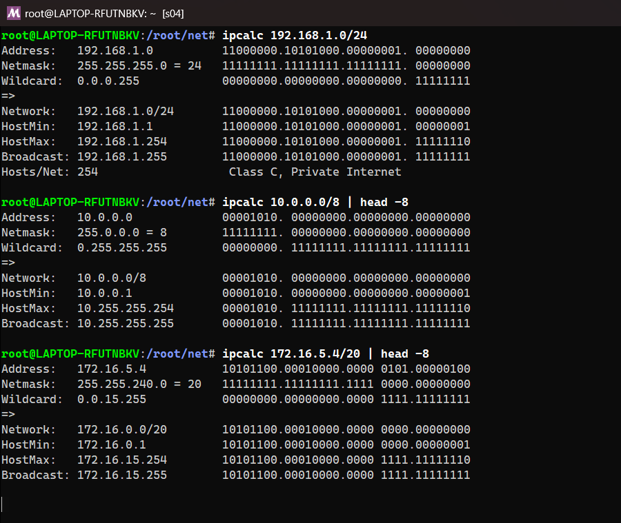


IP addresses uniquely identify network devices. CIDR notation defines the network and host portions.

### IPv4 Address Classes & Private Ranges

- **Class A**: `1.0.0.0` to `127.255.255.255` (Subnet Mask: `255.0.0.0` / `/8`)
- **Class B**: `128.0.0.0` to `191.255.255.255` (Subnet Mask: `255.255.0.0` / `/16`)
- **Class C**: `192.0.0.0` to `223.255.255.255` (Subnet Mask: `255.255.255.0` / `/24`)

### Private IP Address Ranges

- **Class A Private**: `10.0.0.0` - `10.255.255.255`
- **Class B Private**: `172.16.0.0` - `172.31.255.255`
- **Class C Private**: `192.168.0.0` - `192.168.255.255`

---

## 2. Network Connectivity Diagnostics

Test host reachability, packet loss, and network routing hops.

```bash
ping -c 4 google.com
traceroute google.com
tracepath google.com
mtr google.com
```

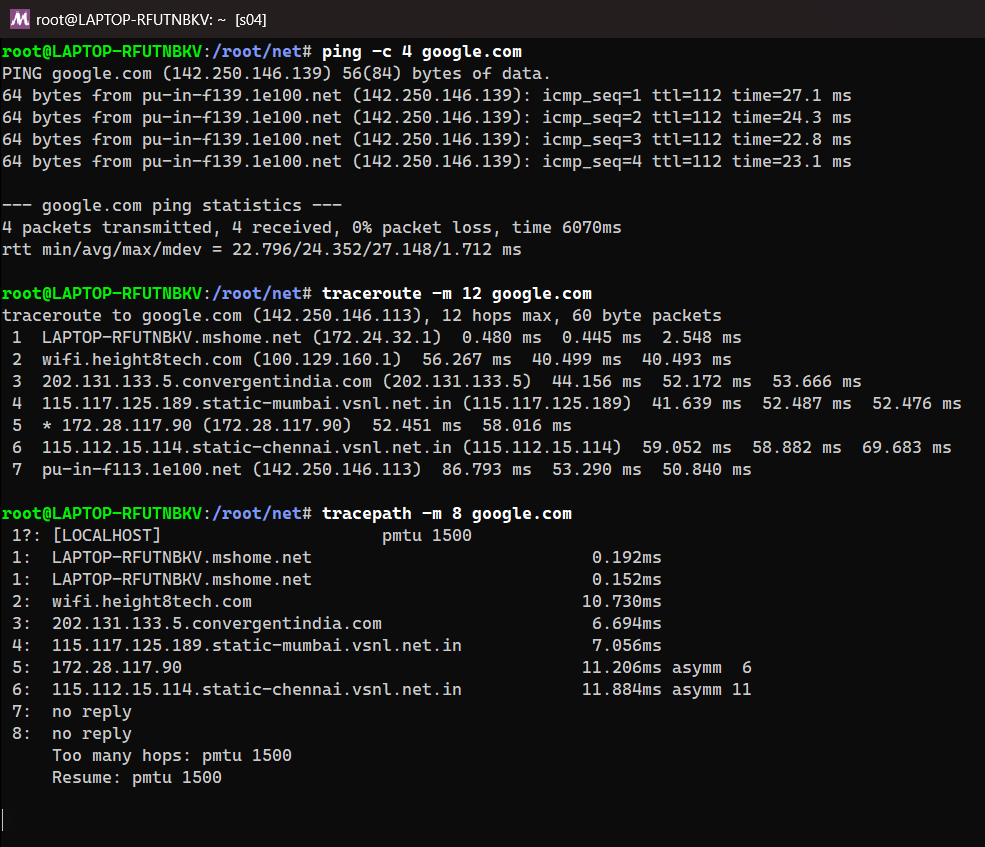
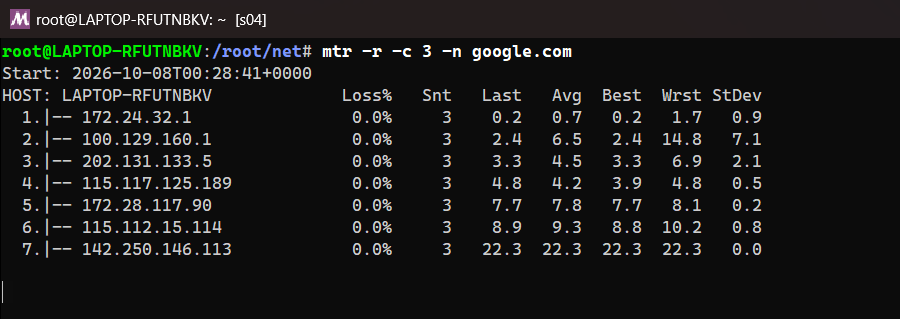


---

## 3. Interface & Routing Inspection

Inspect network interfaces, IP address assignments, routing tables, and active sockets.

```bash
ip addr show
ip route show
ifconfig
netstat -tulpn
ss -tulpn
```

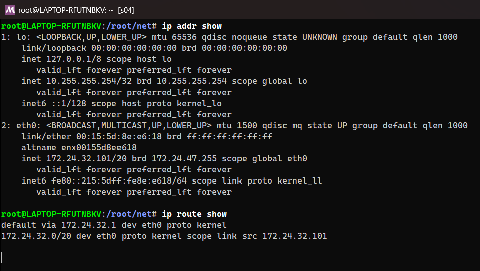
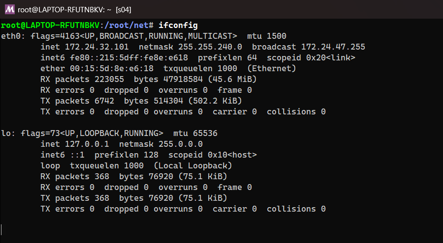
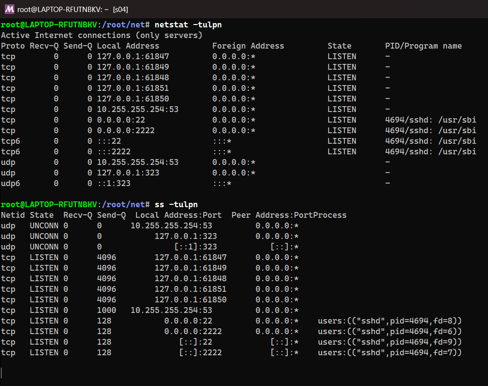


---

## 4. Domain Name Resolution (DNS)

Query DNS servers to resolve hostnames to IP addresses and inspect DNS records.

```bash
nslookup google.com
dig google.com
dig google.com MX
dig +short google.com
host google.com
```

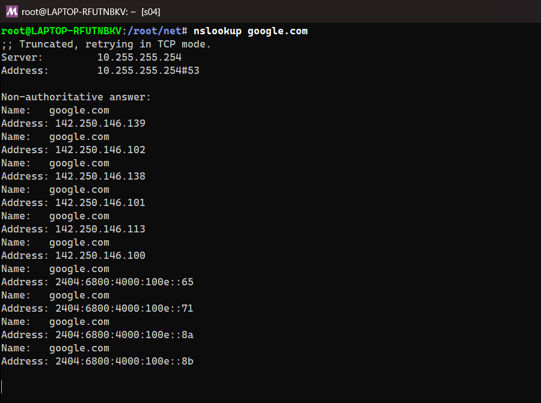
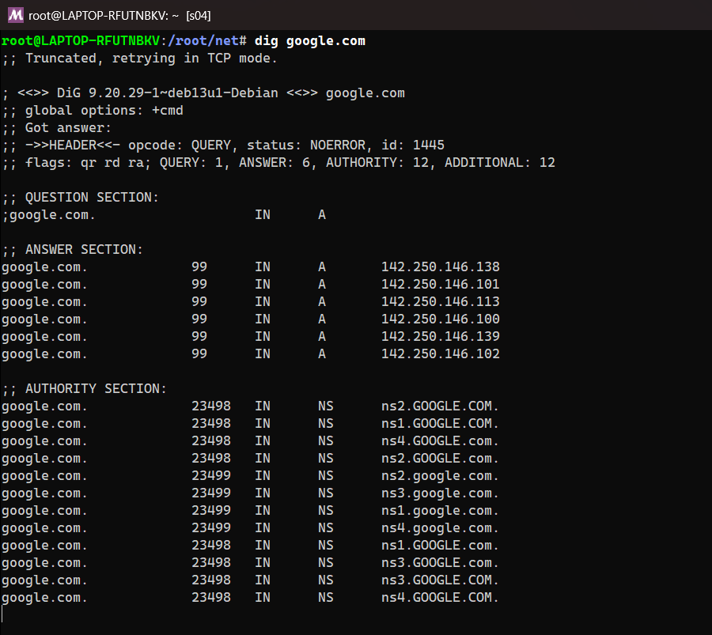
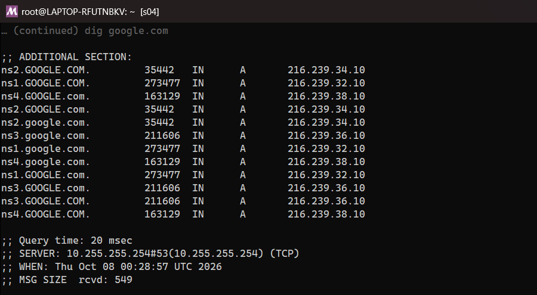
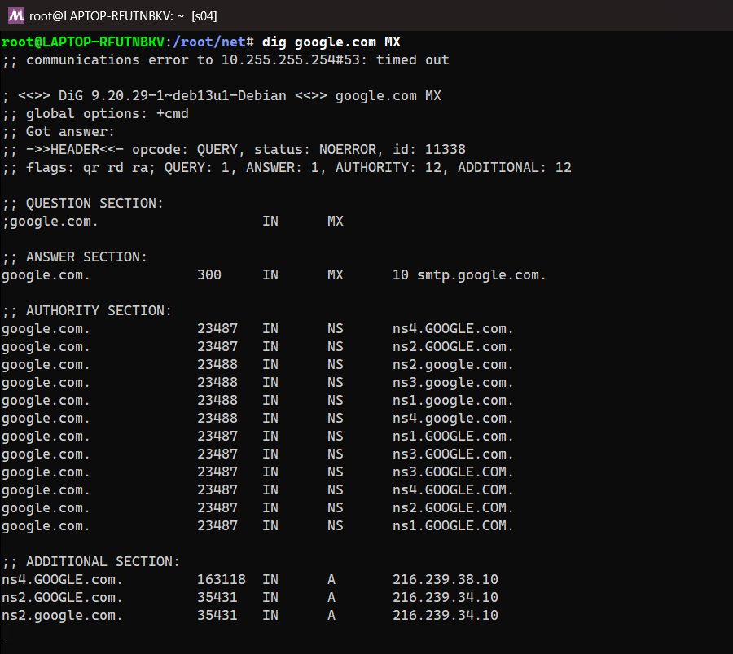
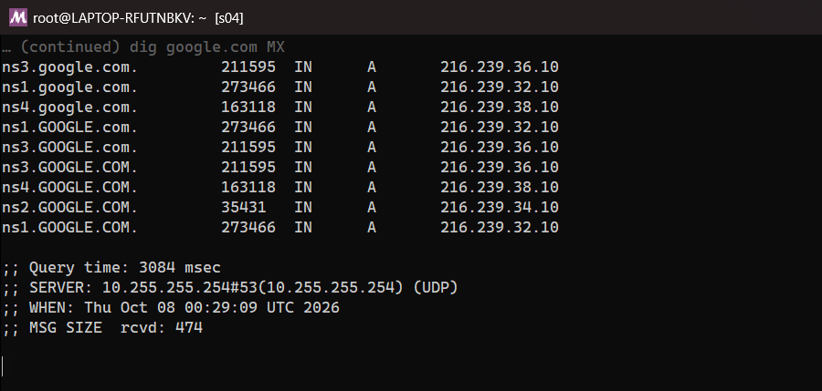
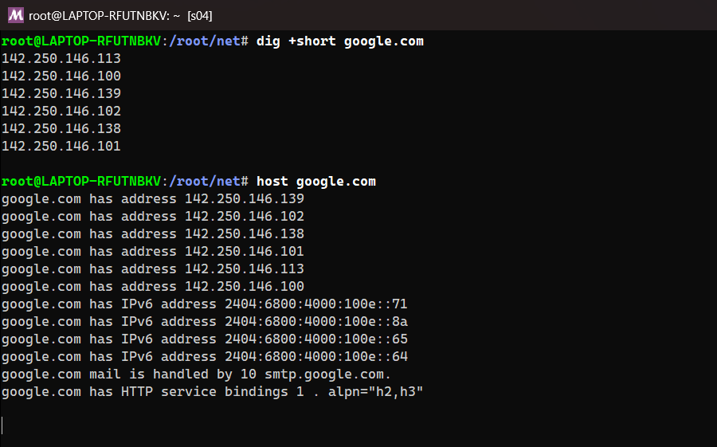


---

## 5. HTTP & API Testing

Transfer data over HTTP/HTTPS protocols to test Web servers and REST APIs.

```bash
curl -I https://example.com
curl -X POST -H "Content-Type: application/json" -d '{"key":"value"}' https://api.example.com/data
curl -o file.zip https://example.com/file.zip
wget https://example.com/file.zip
```

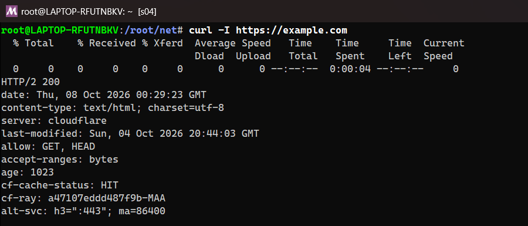
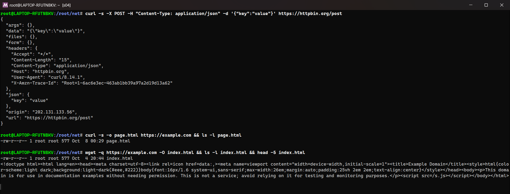


---

## 6. Port Scanning & Socket Testing

Audit open network ports and establish raw TCP/UDP socket connections.

```bash
nc -zv 192.168.1.1 80
nc -l 8080
telnet 192.168.1.1 22
nmap -sS -p 1-1000 192.168.1.1
```

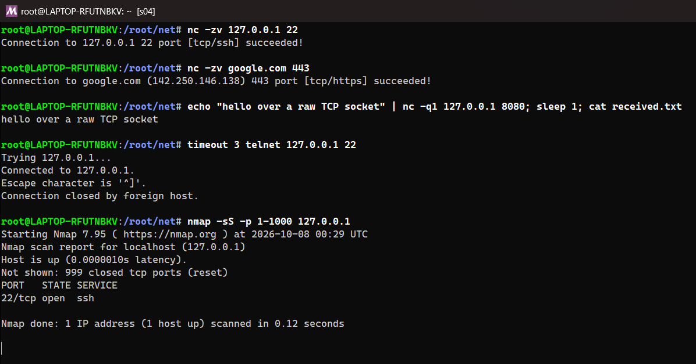


---

## 7. Secure Remote Access & File Transfer

Establish encrypted remote terminal sessions and securely transfer files over SSH.

```bash
ssh user@192.168.1.50
ssh -i ~/.ssh/id_rsa user@192.168.1.50 -p 2222
scp app.tar.gz user@192.168.1.50:/var/www/
rsync -avz --progress ./src/ user@192.168.1.50:/var/www/src/
```

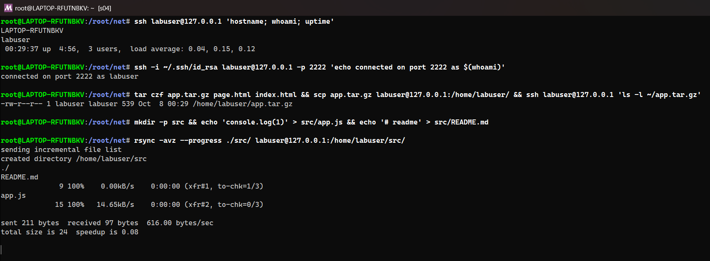

