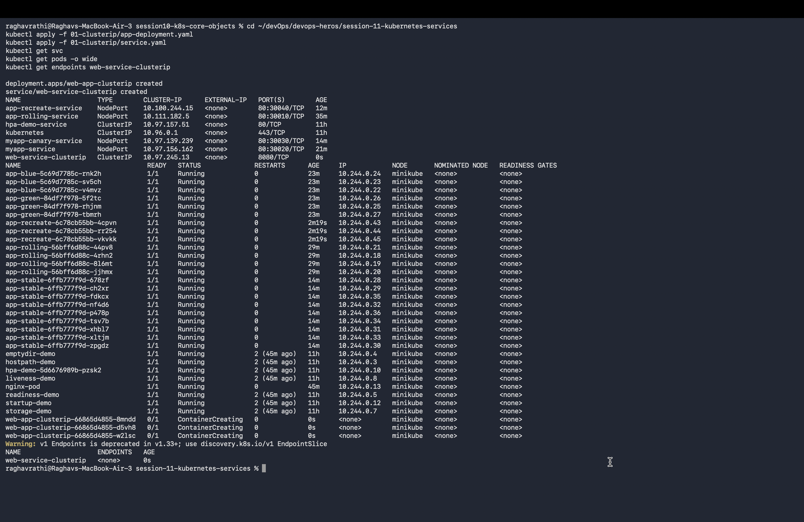

# Session 11: Kubernetes Networking & Services

## Task 1: 5 Kubernetes Service Types Demonstration
- 🟢 **ClusterIP**: Internal-only Cluster IP assignment for pod-to-pod communication.
- 🔵 **NodePort**: Exposes service on each node's IP at a static port (`30000-32767`).
- 🟡 **LoadBalancer**: Integrates with external cloud provider load balancers.
- 🟣 **ExternalName**: Maps service to external CNAME record without proxying.
- ⚪ **Headless**: Set `clusterIP: None` for direct Pod IP discovery via DNS.

---

## Task 2: Kubernetes Object Comparison

### 1. Deployment vs ReplicaSet
- **ReplicaSet**: Ensures a specified number of identical Pod replicas are running at any given time using label selectors. Handles Pod scaling and self-healing.
- **Deployment**: High-level declarative abstraction built on top of ReplicaSets. Provides declarative updates, rolling updates, rollbacks, and pause/resume capabilities.

### 2. Deployment vs DaemonSet vs StatefulSet
| Feature | Deployment | DaemonSet | StatefulSet |
| :--- | :--- | :--- | :--- |
| **Pod Allocation** | Any available worker node based on scheduler. | Runs **exactly one Pod copy on every node** (or selected nodes). | Ordered deployment on nodes with sticky identities. |
| **Identity & Storage** | Stateless, random pod names. | Node-bound, system monitoring/logging agents. | Persistent storage per pod, unique stable network identity (`pod-0`, `pod-1`). |
| **Use Cases** | Stateless Web APIs, microservices. | `kube-proxy`, Prometheus `node-exporter`, Fluentd logs. | Databases (MySQL, PostgreSQL, MongoDB, Redis Cluster). |

### 3. ReplicaSet vs Service
- **ReplicaSet Responsibility**: Manages Pod lifecycle, pod count scaling, and replacement of crashed pods.
- **Service Responsibility**: Provides a stable IP address, DNS name, and load balancing across dynamic, ephemeral Pods matching a label selector.

---

## Task 3 & 4: FQDN & CoreDNS Deliverables
- 📄 [FQDN Documentation](./fqdn/README.md)
- 📄 [CoreDNS Architecture & Troubleshooting Guide](./coredns/README.md)
