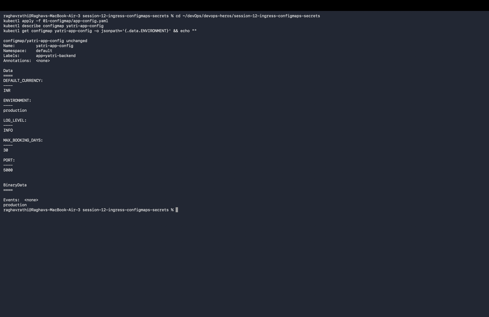
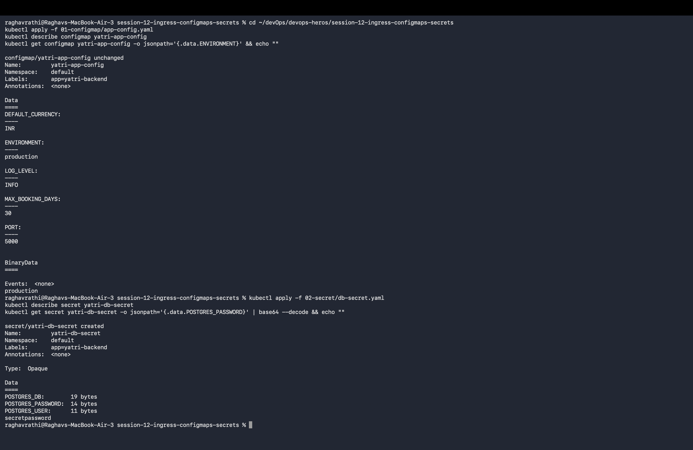
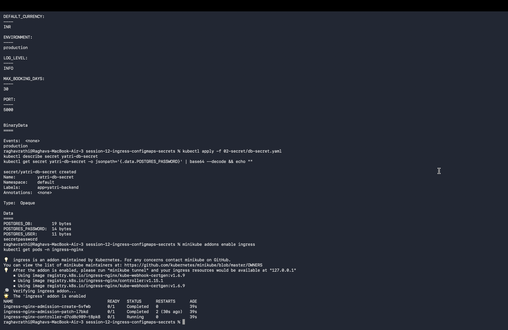
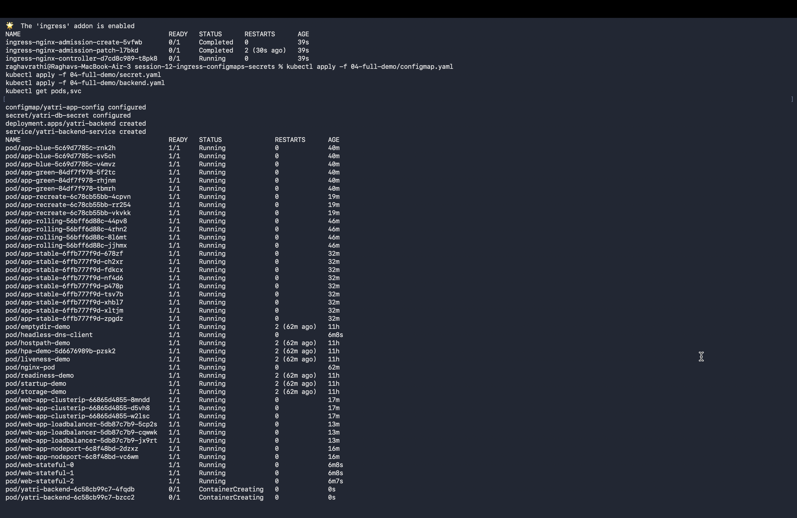

# Session 12: Kubernetes Ingress, ConfigMaps & Secrets

## Task 1: ConfigMap Hands-on Demo
- **Creation & Injection**: ConfigMaps decouple configuration artifacts from image content to keep containerized applications portable across environments.
- **YAML Location**: [`01-configmap/configmap.yaml`](./01-configmap/configmap.yaml) & [`01-configmap/pod.yaml`](./01-configmap/pod.yaml).
- **Verification**: Injected via environment variables and mounted volume inside container.

---

## Task 2: Secret Hands-on Demo
- **Sensitive Storage**: Secrets store sensitive data (passwords, tokens, keys) encoded in base64.
- **YAML Location**: [`02-secret/secret.yaml`](./02-secret/secret.yaml) & [`02-secret/pod.yaml`](./02-secret/pod.yaml).
- **Git Security Principle**: Raw Secret YAML manifests should **NEVER** be committed directly to version control systems like Git because base64 is encoding, not encryption. Use Sealed Secrets, Vault, or SOPS instead.

---

## Task 3: Ingress Demonstration
- **Routing Setup**: Configured Nginx Ingress routing rules mapping path `/app` to backend Service.
- **YAML Location**: [`03-ingress/ingress.yaml`](./03-ingress/ingress.yaml).

---

## Task 4: Ingress vs Ingress Controller

### 1. What is Ingress?
An Ingress is a Kubernetes API object that manages external access to services in a cluster, typically HTTP/HTTPS. It defines path-based and host-based routing rules.

### 2. What is an Ingress Controller?
An Ingress Controller is the actual daemon/reverse-proxy (e.g. Nginx, Traefik, HAProxy, Envoy) that evaluates Ingress rules and routes incoming network traffic to matching Pod endpoints.

### 3. Comparison & Rationale
- **Why Both Are Required**: An Ingress object is merely a set of rules stored in `etcd`. Without an active Ingress Controller running, creating an Ingress resource has zero effect on network routing.
- **Example**: Creating an `Ingress` YAML rule is like writing a map; the `Ingress Controller` (Nginx) is the driver following the map.

---

## Task 5: Troubleshooting Demonstration
- **Issue**: Ingress routing 502 Bad Gateway / Endpoints missing.
- **RCA & Fix**: Mismatched `service.port` target port in Ingress rule. Corrected target port to match pod containerPort 80.

