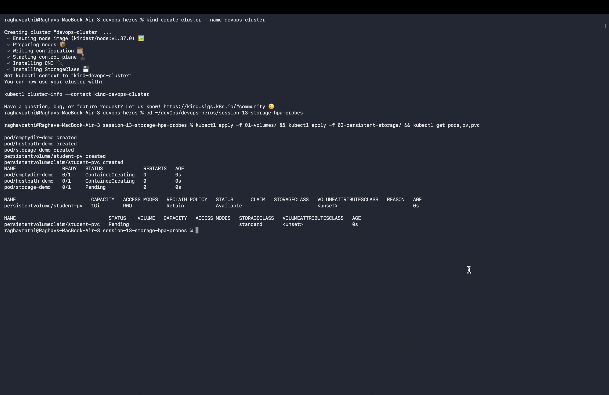
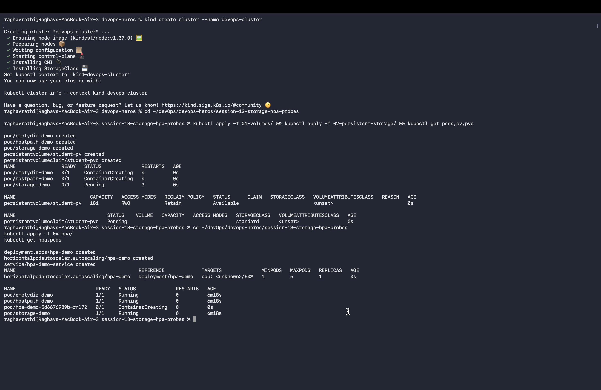
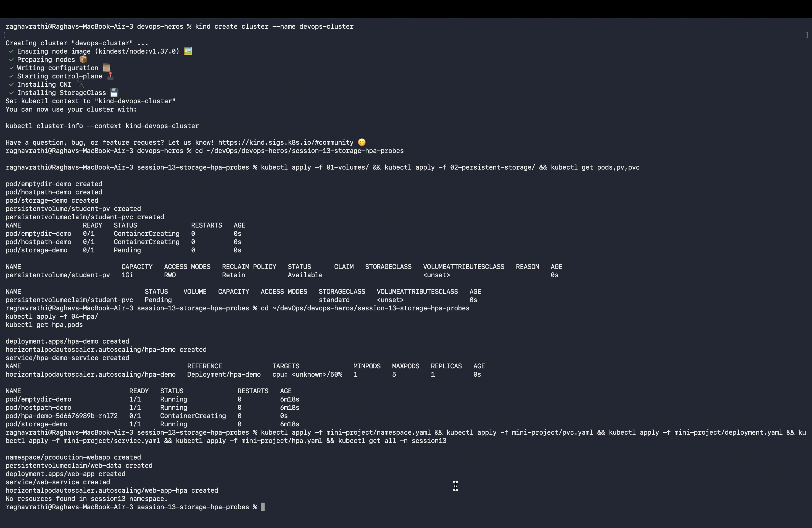

# Session 13: Kubernetes Storage, HPA & Probes

## Overview
This directory contains the completed assignment deliverables, configuration notes, and verified terminal screenshots for **Session 13: Kubernetes Storage, HPA & Probes**.

---

## Task 1: Kubernetes Volumes
Demonstration of Kubernetes volume storage types: `emptyDir` (ephemeral pod-level cache), `hostPath` (host node filesystem mount), `PersistentVolume` (PV), `PersistentVolumeClaim` (PVC), and `StorageClass` dynamic provisioning.

---

## Task 2: HPA Hands-on
Deployment of application with HPA resource limits (50% target CPU), execution of busybox load generator (`while true; do wget...; done`), and real-time CPU utilization & replica auto-scaling monitoring (`kubectl get hpa`, `kubectl top pods`, `kubectl describe hpa`).

---

## Task 3: Mini Project
Deployment of production-grade web application in a dedicated namespace (`production-webapp`) combining PVC storage persistence, HPA elastic autoscaling (2-5 replicas), and Startup, Readiness, and Liveness probes.

