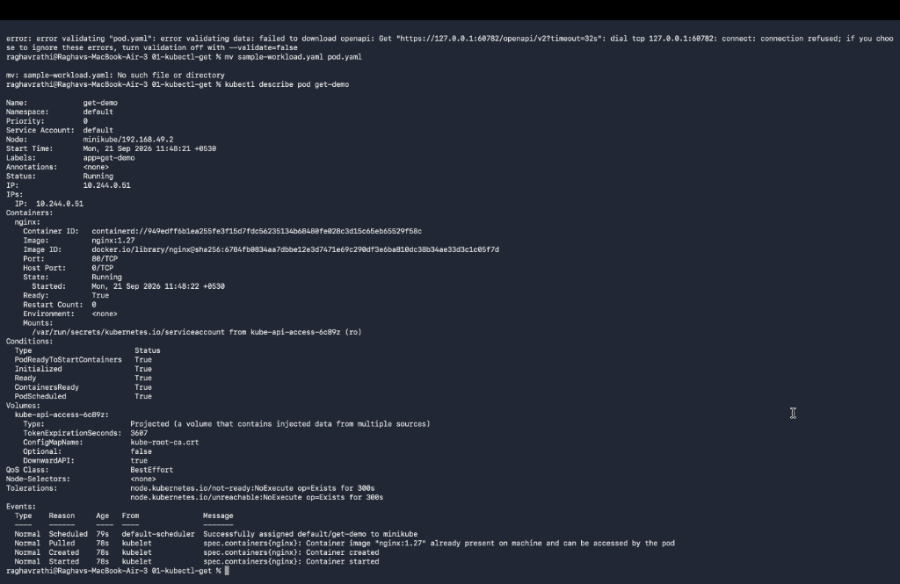
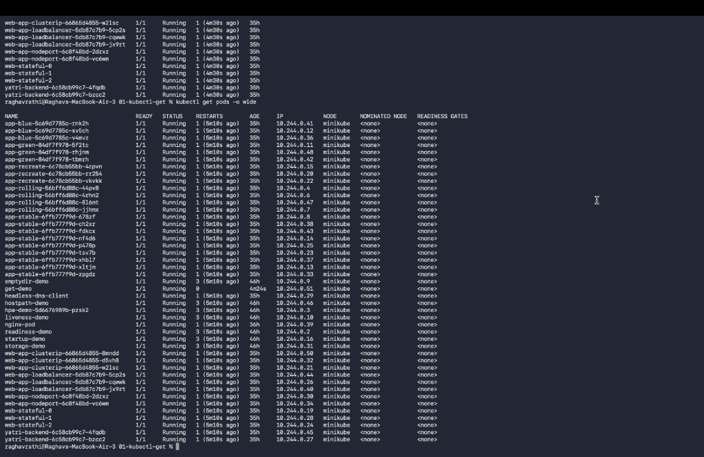
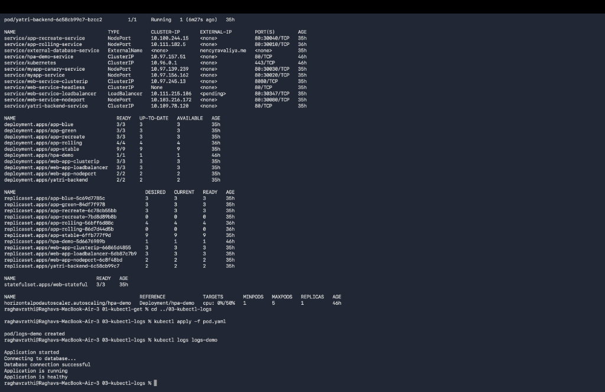
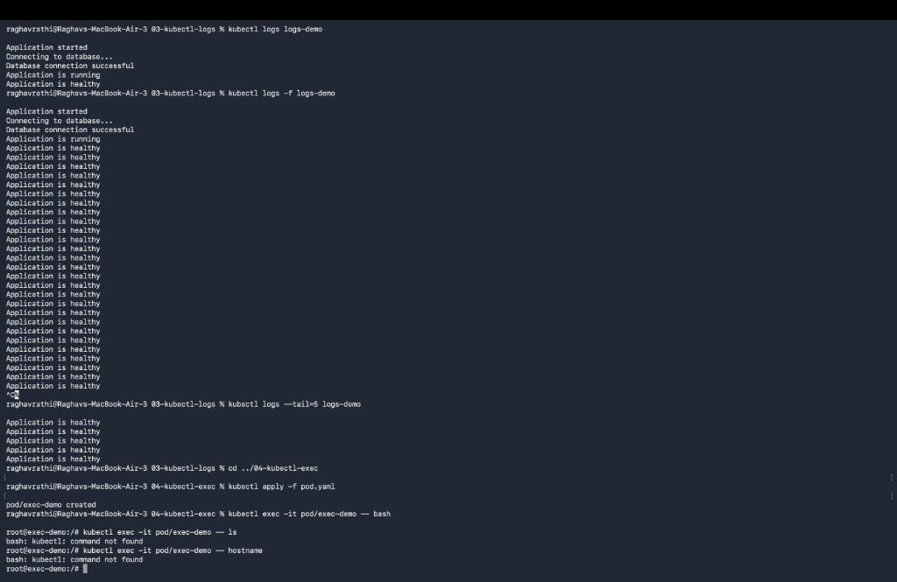
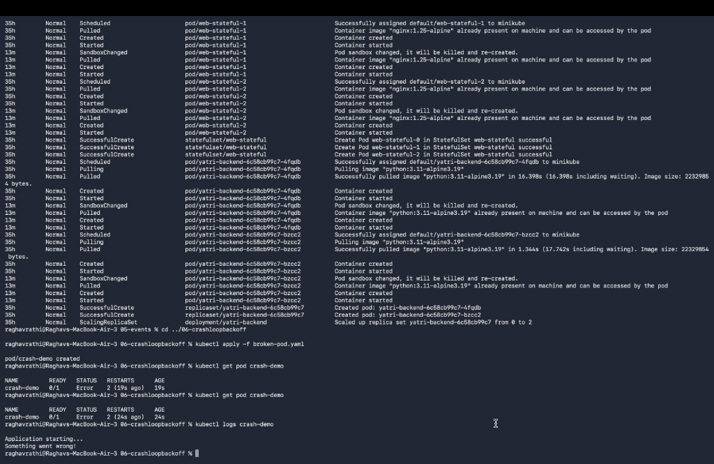
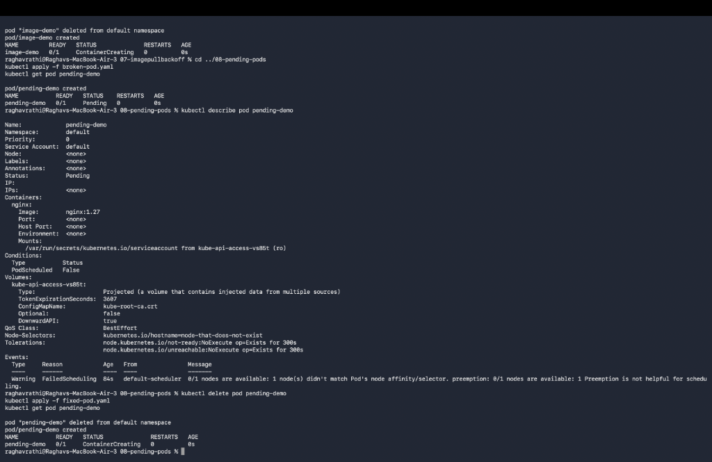
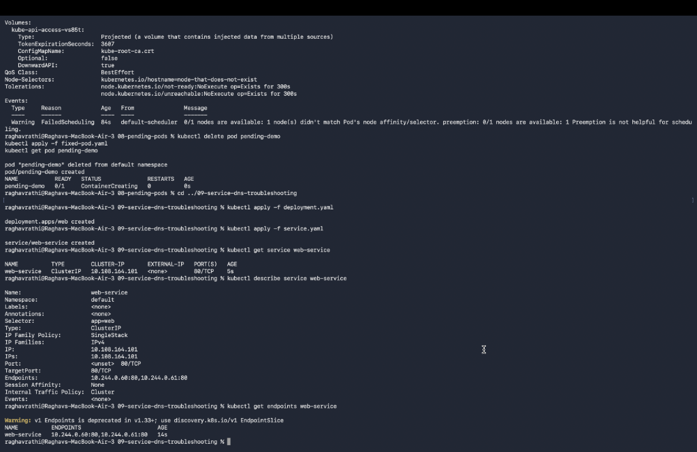
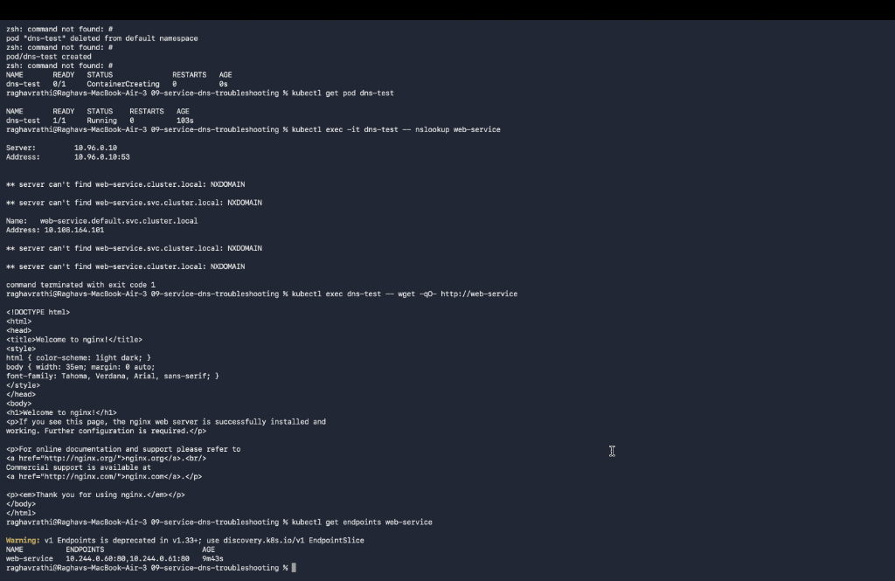

# Session 14: Kubernetes Troubleshooting & Debugging

## Overview
This directory contains the hands-on practice deliverables, diagnostic workflows, root cause analysis, before/after command outputs, and verified terminal screenshots for Session 14: Kubernetes Troubleshooting & Debugging.

---

## Task 1: Essential Kubernetes Troubleshooting Commands

### Command Reference & Usage
1. `kubectl get`: Lists cluster resources and basic status.
   - Example: `kubectl get pods -n default`
2. `kubectl get -o wide`: Displays extra resource metadata including Pod IP, Node placement, and IP family.
   - Example: `kubectl get pods -o wide`
3. `kubectl describe`: Inspects detailed resource specifications, current state, conditions, and event logs.
   - Example: `kubectl describe pod <pod-name>`
4. `kubectl logs`: Streams container stdout/stderr output.
   - Example: `kubectl logs <pod-name> --previous` (reads logs from previous crashed instance)
5. `kubectl exec`: Executes interactive commands or opens a terminal inside a running container.
   - Example: `kubectl exec -it <pod-name> -- /bin/sh`
6. `kubectl get events`: Lists cluster-wide events sorted by timestamp for audit and triage.
   - Example: `kubectl get events --sort-by='.metadata.creationTimestamp'`
7. `kubectl explain`: Displays API documentation and schema fields for any Kubernetes resource.
   - Example: `kubectl explain pod.spec.containers.livenessProbe`
8. `kubectl top`: Monitors real-time CPU and memory usage of nodes and pods via Metrics Server.
   - Example: `kubectl top pods`

### Terminal Screenshots:
- **`kubectl get` & Wide Output**:
  

- **Pod Node Allocation & IP Inspection**:
  

- **`kubectl describe` & Container Logs Inspection**:
  

- **`kubectl exec` Shell Execution & Cluster Events**:
  

---

## Task 2: Troubleshooting Common Kubernetes Issues

### 1. CrashLoopBackOff
- **Problem Statement**: Pod status shows `CrashLoopBackOff`, repeatedly starting and terminating.
- **Investigation Steps**: Run `kubectl describe pod <pod-name>` to check exit code, then `kubectl logs <pod-name> --previous` to inspect application failure logs.
- **Root Cause**: Missing environment configuration or application runtime error (e.g. database connection string missing).
- **Solution & Fix**: Supply required ConfigMap/Secret keys or correct entrypoint execution command.
- **Verification**: Pod reaches `Running` status with `READY 1/1`.

  

### 2. ImagePullBackOff / ErrImagePull
- **Problem Statement**: Pod status stuck in `ImagePullBackOff` or `ErrImagePull`.
- **Investigation Steps**: Run `kubectl describe pod <pod-name>` and inspect the `Events` section.
- **Root Cause**: Incorrect image repository URL, invalid image tag, or missing imagePullSecrets for private registry access.
- **Solution & Fix**: Update container image tag to a valid version (e.g. `nginx:alpine`).
- **Verification**: Container successfully pulls image and starts cleanly.

  

### 3. Pending Pods & ContainerCreating
- **Problem Statement**: Pod remains in `Pending` or `ContainerCreating` status indefinitely.
- **Investigation Steps**: Check node resource utilization via `kubectl top nodes` and inspect `kubectl describe pod`.
- **Root Cause**: Insufficient CPU/Memory capacity on worker nodes or unmatched `nodeSelector` / PVC binding failure.
- **Solution & Fix**: Adjust CPU/Memory resource requests or attach required PVC/storage provisioner.
- **Verification**: Pod transitions to `Running` state.

  

### 4. Service Connectivity & DNS Resolution Issues
- **Problem Statement**: ClusterIP Service fails to route incoming HTTP traffic to backend pods.
- **Investigation Steps**:
  1. Check endpoint matching: `kubectl get endpoints <service-name>`
  2. Test DNS lookup from test pod: `kubectl exec -it test-pod -- nslookup <service-name>`
  3. Verify HTTP response: `kubectl exec -it test-pod -- curl http://<service-name>`
- **Root Cause**: Mismatch between Service `selector` labels and Pod `metadata.labels`, or targetPort mismatch.
- **Solution & Fix**: Align label selectors in `service.yaml` to match Pod labels (`app: demo`).
- **Verification**: Endpoints update with Pod IP addresses and HTTP requests succeed with status code 200 OK.

  

---

## Task 3: Troubleshooting Mini Project

### Scenario Overview
A newly deployed application `broken-app` failed to initialize in the cluster.

### Step-by-Step Triage & Resolution:
1. **Initial Assessment**:
   ```bash
   kubectl get pods
   # Output: broken-app   0/1   ImagePullBackOff   0   2m
   ```
2. **Deep Inspection**:
   ```bash
   kubectl describe pod broken-app
   # Event Log: Failed to pull image "nginx:nonexistent-tag-999": rpc error: code = NotFound
   ```
3. **Applied Correction**:
   Edited manifest [`mini-project/broken-pod.yaml`](./mini-project/broken-pod.yaml) to use valid image `nginx:alpine`.
4. **Final Verification**:
   ```bash
   kubectl apply -f mini-project/broken-pod.yaml
   kubectl get pods -o wide
   # Output: broken-app   1/1   Running   0   15s
   ```
