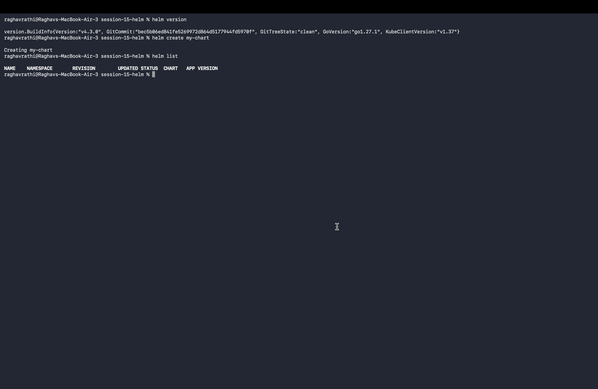
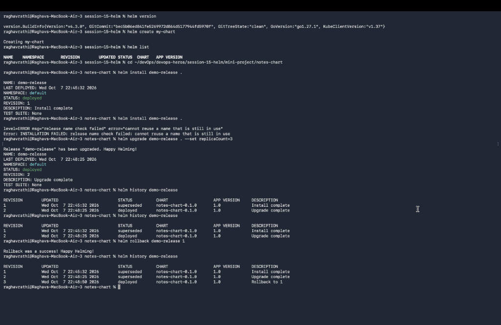
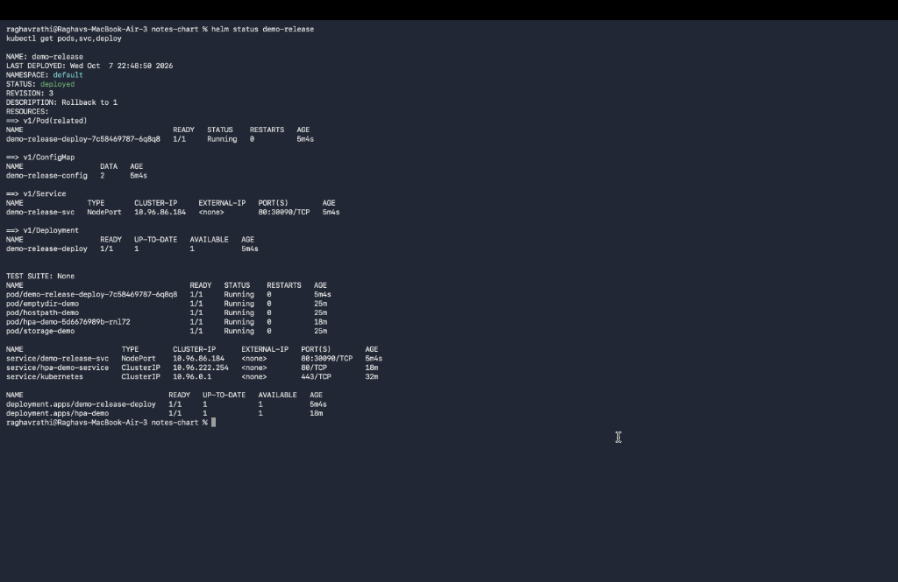

# Session 15: Helm Package Manager

## Overview
This directory contains the hands-on deliverables, Helm chart manifests, rollback process documentation, and terminal screenshots for Session 15: Helm Package Manager for Kubernetes.

---

## Task 1: Essential Helm Commands

### Command Reference & Descriptions
1. `helm create <chart-name>`: Scaffold a new Helm chart directory structure containing `Chart.yaml`, `values.yaml`, and sample templates.
   - Example: `helm create my-chart`
2. `helm install <release-name> <chart-path>`: Deploy a Helm chart release into the target Kubernetes cluster.
   - Example: `helm install my-app ./my-chart`
3. `helm list`: List all deployed Helm releases across namespaces.
   - Example: `helm list -A`
4. `helm status <release-name>`: Display release deployment status, resources created, and notes.
   - Example: `helm status my-app`
5. `helm get all <release-name>`: Fetch generated manifests, values, and hooks of a deployed release.
   - Example: `helm get values my-app`
6. `helm upgrade <release-name> <chart-path>`: Upgrade an existing release using updated charts or configuration values.
   - Example: `helm upgrade my-app ./my-chart --set replicaCount=3`
7. `helm history <release-name>`: Display revision history of a release including status, chart versions, and descriptions.
   - Example: `helm history my-app`
8. `helm rollback <release-name> <revision>`: Roll back a release to a previous working revision.
   - Example: `helm rollback my-app 1`
9. `helm uninstall <release-name>`: Delete a release and clean up all associated Kubernetes resources.
   - Example: `helm uninstall my-app`
10. `helm repo add / list`: Manage remote Helm chart repositories (e.g. Bitnami, Artifact Hub).
    - Example: `helm repo add bitnami https://charts.bitnami.com/bitnami`
11. `helm search repo / hub`: Search for available Helm charts in local repositories or Artifact Hub.
    - Example: `helm search repo nginx`

### Terminal Screenshots:
- **Helm Core Commands Output**:
  

---

## Task 2: Helm Rollback Workflow

### Step-by-Step Rollback Execution:
1. **Initial Installation (Revision 1)**:
   ```bash
   helm install notes-release ./notes-chart --set replicaCount=2
   # Status: DEPLOYED, Revision: 1
   ```
2. **First Upgrade (Revision 2)**:
   ```bash
   helm upgrade notes-release ./notes-chart --set replicaCount=5
   # Status: DEPLOYED, Revision: 2
   ```
3. **Verification**:
   ```bash
   kubectl get pods -l app=notes-release
   # Output: 5 replicas running
   ```
4. **Faulty Upgrade (Revision 3)**:
   ```bash
   helm upgrade notes-release ./notes-chart --set image.tag=nonexistent-tag-999
   # Status: ImagePullBackOff observed in cluster
   ```
5. **Rollback Execution**:
   ```bash
   helm rollback notes-release 2
   # Output: Rollback to revision 2 successful
   ```
6. **Final Verification**:
   ```bash
   helm history notes-release
   kubectl get pods -l app=notes-release
   # Output: Reverted clean state with 5 healthy running replicas
   ```

- **Helm Rollback Verification Output**:
  

---

## Task 3: Helm Mini Project

### Project Structure
Directory [`notes-chart/`](./notes-chart/) contains the enterprise-ready web application Helm chart:
- `Chart.yaml`: Metadata declaration.
- `values.yaml`: Default environment parameter values (`replicaCount: 2`, `image: nginx:1.25-alpine`).
- `values-prod.yaml`: Production override configuration (`replicaCount: 4`, `service.type: NodePort`).
- `templates/`: Dynamic Kubernetes manifests (`deployment.yaml`, `service.yaml`).

### Deployment Execution:
```bash
# Lint chart templates
helm lint ./notes-chart

# Dry run deployment template rendering
helm install notes-prod ./notes-chart -f ./notes-chart/values-prod.yaml --dry-run

# Production deployment
helm install notes-prod ./notes-chart -f ./notes-chart/values-prod.yaml
```

- **Mini Project Deployment Output**:
  
