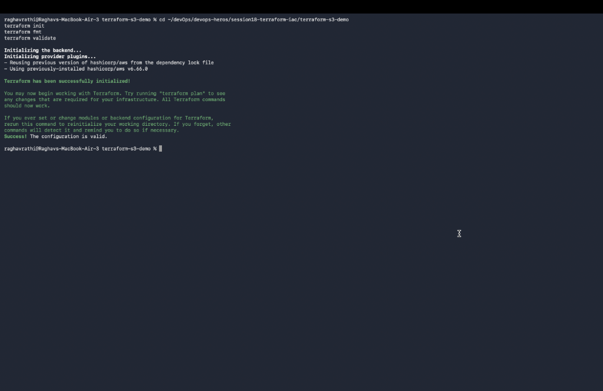
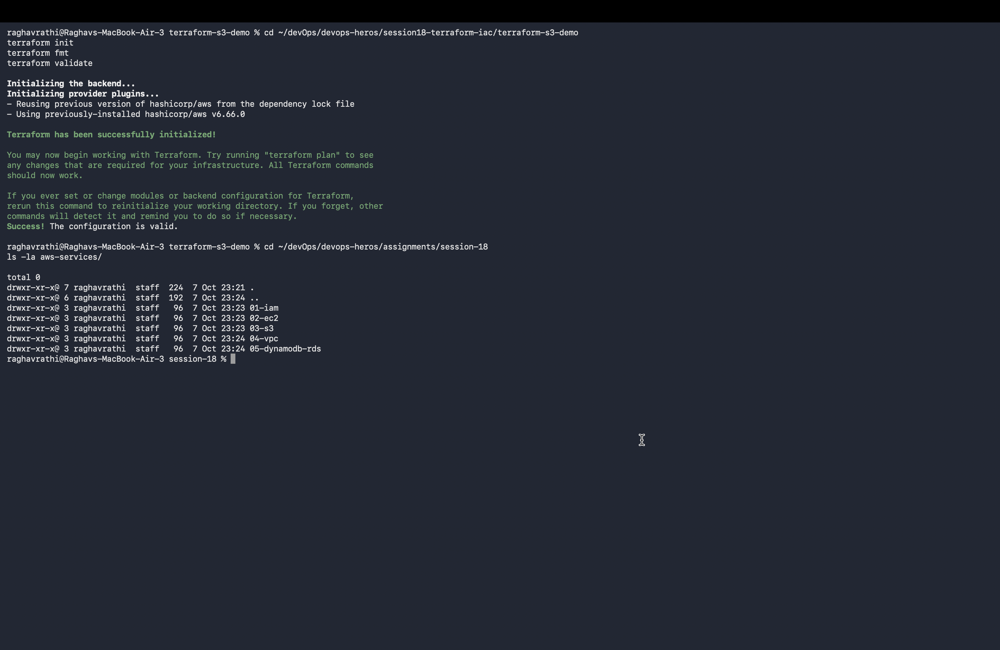

# Session 18: Terraform & Infrastructure as Code (IaC)

## Task 1: Terraform S3 Demo Project (`terraform-s3-demo/`)
Complete Infrastructure as Code project provisioning an AWS S3 Bucket with versioning and tags using Terraform.

### Project Files:
- 📄 `terraform-s3-demo/provider.tf`: AWS Provider configuration.
- 📄 `terraform-s3-demo/main.tf`: AWS S3 Bucket & Versioning resources.
- 📄 `terraform-s3-demo/variables.tf`: Input variables (`aws_region`, `bucket_name`, `environment`).
- 📄 `terraform-s3-demo/outputs.tf`: Output variables (`bucket_id`, `bucket_arn`).
- 📄 `terraform-s3-demo/terraform.tfvars`: Environment variable values.
- 📄 `terraform-s3-demo/README.md`: Workflow documentation.

### Workflow Commands Executed:
```bash
cd terraform-s3-demo
terraform init
terraform fmt
terraform validate
terraform plan
```



---

## Task 2: AWS Services Research (`aws-services/`)
Comprehensive research and architectural documentation for core AWS services:

- 📄 `aws-services/01-iam/README.md`: IAM Users, Groups, Roles, Policies, Least Privilege, MFA & Best Practices.
- 📄 `aws-services/02-ec2/README.md`: EC2 Compute, AMI, Instance Types, Key Pairs, Security Groups, EBS & Lifecycle.
- 📄 `aws-services/03-s3/README.md`: S3 Object Storage, Buckets, Storage Classes, Versioning, Encryption & Lifecycle Rules.
- 📄 `aws-services/04-vpc/README.md`: VPC Networking, CIDR, Subnets, Route Tables, Internet Gateway, NAT Gateway & NACLs.
- 📄 `aws-services/05-dynamodb-rds/README.md`: DynamoDB NoSQL vs RDS Relational Databases (Aurora, PostgreSQL, Multi-AZ).


