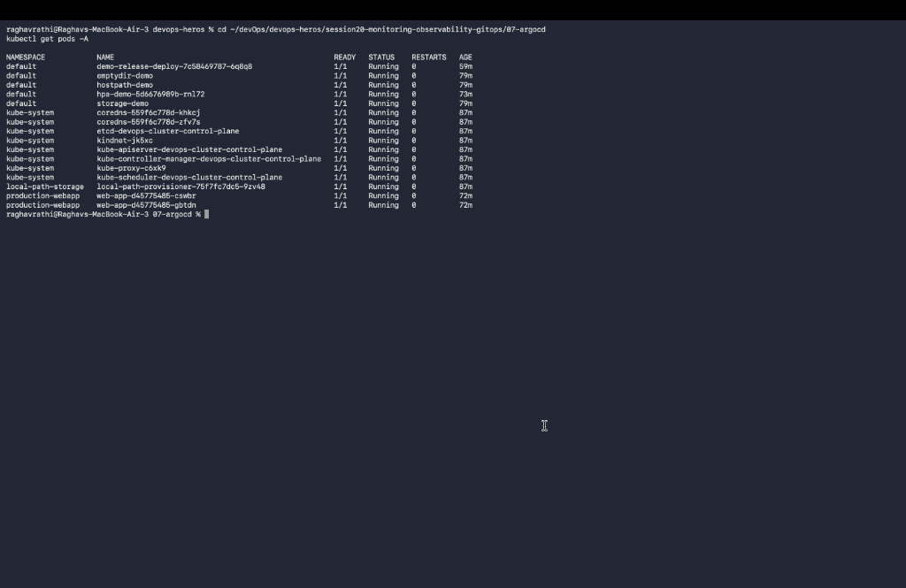
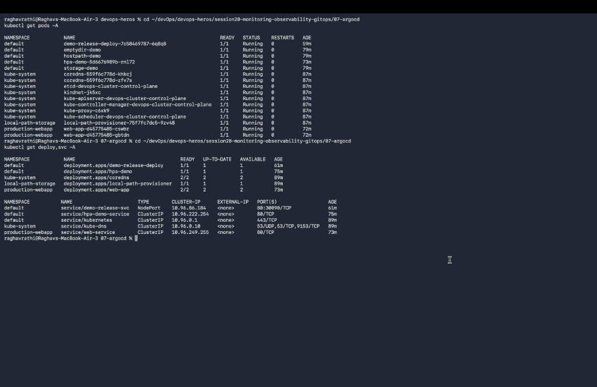
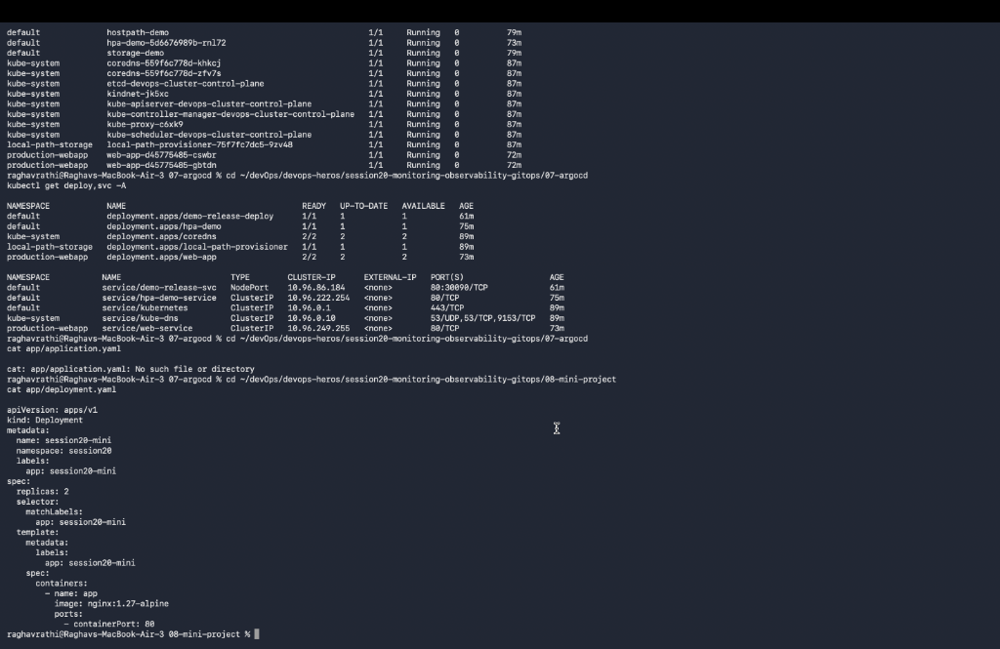

# Session 20: Monitoring, Observability & GitOps

## Task 1: Monitoring & Metrics Demo (Prometheus & Grafana)

---

## Task 2: Observability Architecture (Metrics, Logs, Traces)

---

## Task 3: GitOps Workflow & ArgoCD Reconciliation

