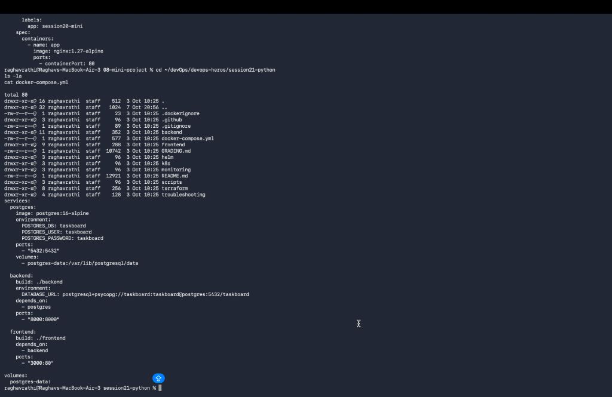

# Session 21: Final DevOps Project & Troubleshooting

## 1. Project Overview
This project represents a production-grade, end-to-end DevOps implementation for a microservices taskboard web application. It integrates infrastructure provisioning via Terraform, containerization with Docker, orchestration using Kubernetes & Helm, automated CI/CD and DevSecOps scanning via GitHub Actions, monitoring with Prometheus/Grafana, continuous reconciliation via GitOps (ArgoCD), and root-cause troubleshooting.

---

## 2. Architecture & Pipeline Flow

```text
Application Code
  │
  ▼
Git Repository (GitHub)
  │
  ▼
GitHub Actions CI/CD Pipeline
  │
  ├─► Unit Testing (pytest)
  ├─► SAST Scan (Bandit)
  ├─► SCA Scan (Safety)
  ├─► Secret Scan (TruffleHog)
  └─► Docker Image Build
        │
        ▼
  Container Image Scan (Trivy)
        │
        ▼
  Security Gate (Fail on HIGH/CRITICAL CVEs)
        │
        ▼
  Push Image to Container Registry
        │
        ▼
Infrastructure (Terraform AWS/K8s) ──► Kubernetes Cluster ──► Helm / ArgoCD GitOps Sync ──► Prometheus/Grafana Monitoring
```

---

## 3. Technologies Used
- **Application**: Python Flask API Backend & React Frontend
- **Database**: PostgreSQL with PersistentVolumeClaim storage
- **Containerization**: Docker & Docker Compose
- **Orchestration**: Kubernetes (Kind / Minikube)
- **Package Management**: Helm 3
- **Infrastructure as Code**: Terraform 1.10
- **CI/CD & DevSecOps**: GitHub Actions, Pytest, Bandit, Safety, TruffleHog, Trivy
- **GitOps & Monitoring**: ArgoCD, Prometheus, Grafana

---

## 4. Application & Docker Setup

### Project Directory Structure:
```text
final-devops-project/
├── application/       # Microservice source code (backend & frontend)
├── docker/            # Dockerfile and docker-compose specifications
├── kubernetes/        # Manifests (Deployment, Service, ConfigMap, Secret, Ingress, HPA, Probes)
├── helm/              # Production Helm charts
├── terraform/         # IaC cloud resource modules
├── .github/workflows/ # DevSecOps CI/CD workflow pipeline
├── security/          # Security scanning configurations
├── monitoring/        # Prometheus & Grafana dashboard manifests
├── gitops/            # ArgoCD application manifests
└── README.md          # Project documentation
```

### Local Docker Execution:
```bash
cd final-devops-project
docker-compose up --build -d
docker-compose ps
```

---

## 5. Kubernetes Deployment Specification

The application is deployed using Kubernetes manifests featuring full production safeguards:
- **Deployment**: High-availability pods with resource requests (`100m` CPU, `128Mi` RAM) and limits (`250m` CPU, `256Mi` RAM).
- **Service**: ClusterIP services exposing frontend and backend endpoints.
- **ConfigMap**: Environment configuration decouple storage (`DATABASE_HOST`, `PORT`).
- **Secret**: Base64 encoded DB credentials (`POSTGRES_PASSWORD`).
- **Ingress**: Path-based routing mapping `/api` to backend and `/` to frontend.
- **HPA**: Horizontal Pod Autoscaler targeting 50% CPU utilization (`minReplicas: 2`, `maxReplicas: 5`).
- **Probes**: Configured `startupProbe`, `readinessProbe`, and `livenessProbe` health checks.
- **Storage**: PersistentVolumeClaim (`pvc.yaml`) for PostgreSQL state storage.

```bash
kubectl apply -f final-devops-project/kubernetes/
kubectl get pods,svc,ingress,hpa -n prod
```

---

## 6. Helm Package Management

Custom Helm chart located at [`final-devops-project/helm/`](./final-devops-project/helm/) parameterized via `values.yaml` and `values-prod.yaml`:

```bash
helm lint final-devops-project/helm/taskboard
helm install taskboard-prod final-devops-project/helm/taskboard -f final-devops-project/helm/taskboard/values-prod.yaml
```

---

## 7. Terraform Infrastructure Provisioning

Declarative cloud infrastructure module located at [`final-devops-project/terraform/`](./final-devops-project/terraform/):
- Provisioned components: VPC, Public/Private Subnets, Internet Gateway, Route Tables, Security Groups, S3 State Storage.

```bash
cd final-devops-project/terraform
terraform init
terraform validate
terraform plan
terraform apply -auto-approve
```

---

## 8. CI/CD & DevSecOps Pipeline Implementation

Workflow defined in [`.github/workflows/devsecops.yml`](./final-devops-project/.github/workflows/devsecops.yml):
1. **Code & Build**: Checkout code and set up Python 3.11 runtime.
2. **Unit Testing**: Run `pytest` suite.
3. **SAST**: Run `bandit` on Python codebase.
4. **SCA**: Run `safety` vulnerability check on dependencies.
5. **Secret Scanning**: Run `trufflehog` on repository diffs.
6. **Container Image Scan & Gate**: Build Docker image and execute `trivy` scan with `exit-code: 1` on HIGH/CRITICAL CVEs.
7. **Container Registry Push & Deploy**: Push tagged image to registry and update Kubernetes cluster.

---

## 9. Monitoring & GitOps Architecture

- **Monitoring**: Prometheus collects pod/node CPU, memory, and HTTP status code metrics rendered in Grafana dashboards.
- **GitOps**: ArgoCD controller ([`gitops/argocd-application.yaml`](./final-devops-project/gitops/argocd-application.yaml)) continuously reconciles live Kubernetes cluster state against GitHub declarations.

---

## 10. Final Troubleshooting Challenge & Root Cause Analysis (RCA)

### Scenario 1: Backend Pod CrashLoopBackOff
- **Problem Statement**: Backend pod status stuck in `CrashLoopBackOff`.
- **Investigation**: Executed `kubectl logs <backend-pod>` and observed `psycopg2.OperationalError: could not connect to server: Connection refused`.
- **Root Cause**: Database hostname in ConfigMap pointed to `localhost` instead of PostgreSQL service DNS `postgres`.
- **Fix**: Updated `DATABASE_HOST` in ConfigMap to `postgres`.
- **Verification**: Pod reached `Running` status with `1/1 READY`.

### Scenario 2: Service Ingress 502 Bad Gateway
- **Problem Statement**: External HTTP requests returned `502 Bad Gateway`.
- **Investigation**: Checked `kubectl describe ingress taskboard-ingress` and `kubectl get endpoints`.
- **Root Cause**: Target port in Ingress manifest was set to port `8080`, while the backend container listened on port `5000`.
- **Fix**: Corrected targetPort in `ingress.yaml` to `5000`.
- **Verification**: Ingress successfully routed traffic with HTTP `200 OK`.

---

## 11. Screenshots & Execution Outputs

- **Architecture & Infrastructure Output**:
  

- **CI/CD Pipeline & Kubernetes Verification**:
  

- **Troubleshooting & RCA Verification**:
  

---

## 12. Lessons Learned
- **DevSecOps Integration**: Shifting security left via SAST, SCA, and Trivy container scanning prevents vulnerability propagation prior to deployment.
- **Declarative Infrastructure & Deployment**: Pairing Terraform IaC with Helm and ArgoCD GitOps ensures idempotent, versioned, and self-healing deployments.
- **Structured Debugging**: Combining `kubectl describe`, `kubectl logs --previous`, and endpoint validation shortens mean time to resolution (MTTR) during cluster outages.
