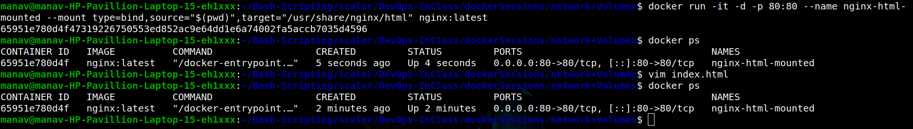
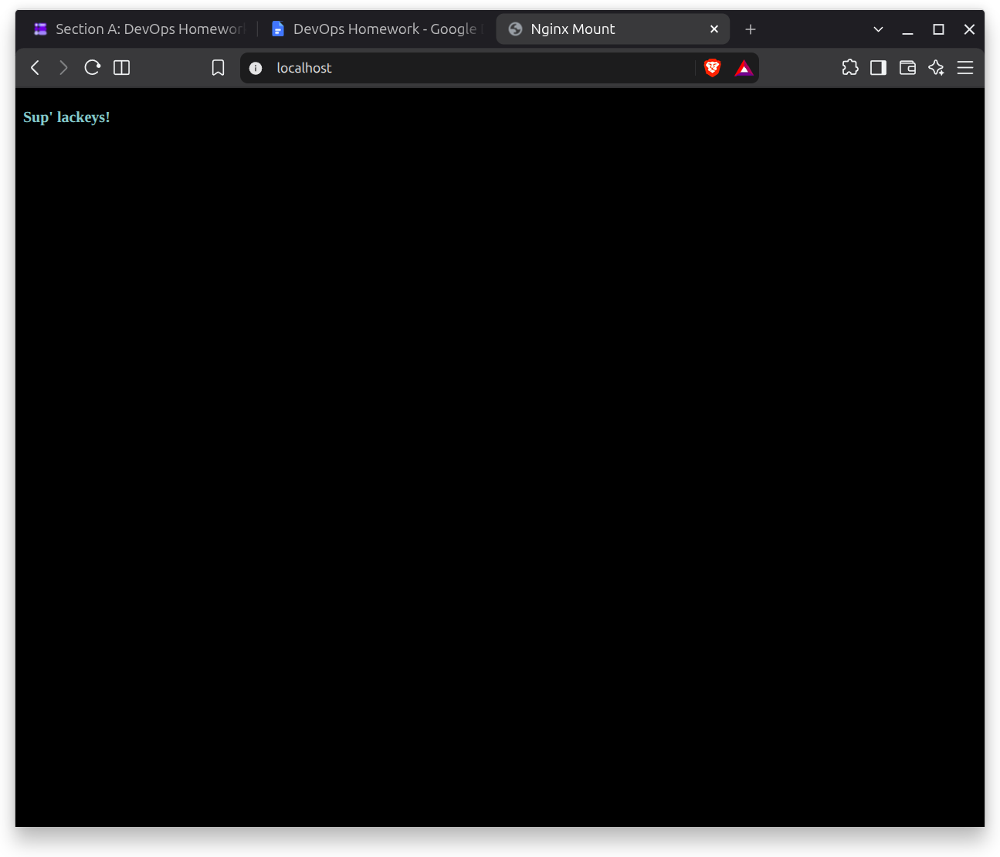

## Running Apache Container

### Terminal CMDs

```bash
manav@manav-HP-Pavillion-Laptop-15-eh1xxx:~$ docker pull ubuntu/apache2
Using default tag: latest
latest: Pulling from ubuntu/apache2
c7e8d27e04b0: Pull complete 
8a4d5fdfb6a1: Pull complete 
bf1561367389: Pull complete 
Digest: sha256:bd68b3b35b01aacb11148ad9073c538a6cf59e5bc1dbfc9fe03b2f8212cbd963
Status: Downloaded newer image for ubuntu/apache2:latest
docker.io/ubuntu/apache2:latest
```
```bash
manav@manav-HP-Pavillion-Laptop-15-eh1xxx:~$ docker run -it -d -p 80:80 --name apache2 ubuntu/apache2:latest 
15bb19a552f801abff1b6832ece2a0ff32bf440ff8cb7e40ab192115ec7d0b2c
```

### Browser Screenshot


## Bind-Mounting html to Nginx

### Terminal CMDs


### Original HTML served through nginx


### Updated HTML
