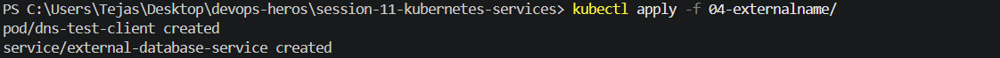
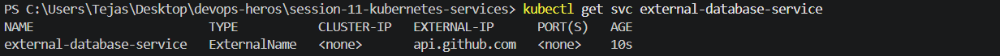
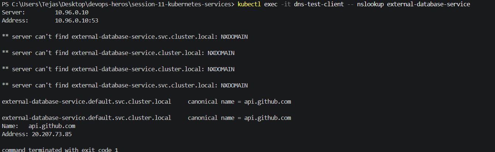
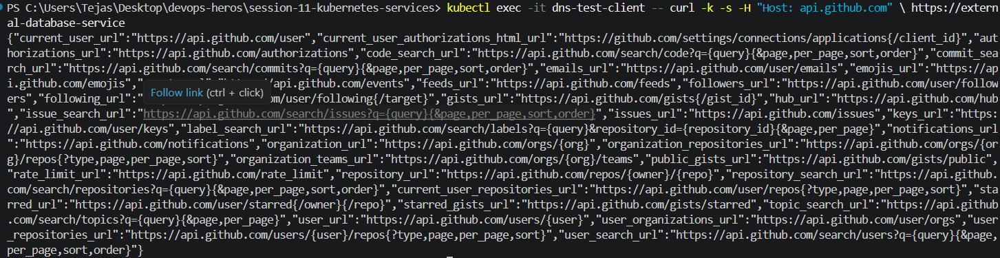
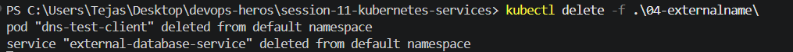

kubectl apply -f 04-externalname

kubectl get pod dns-test-client

kubectl exec -it dns-test-client -- nslookup external-database-service

kubectl exec -it dns-test-client -- curl -k -s -H "Host: api.github.com" https://external-database-service

kubectl delete -f .\04-loadbalancer\
