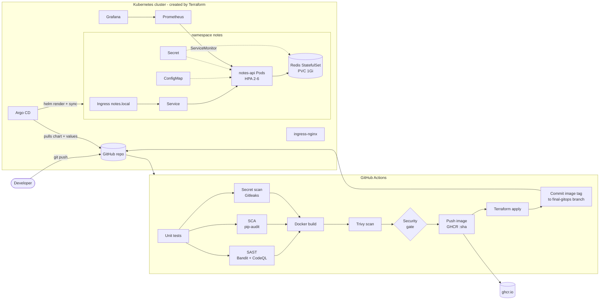
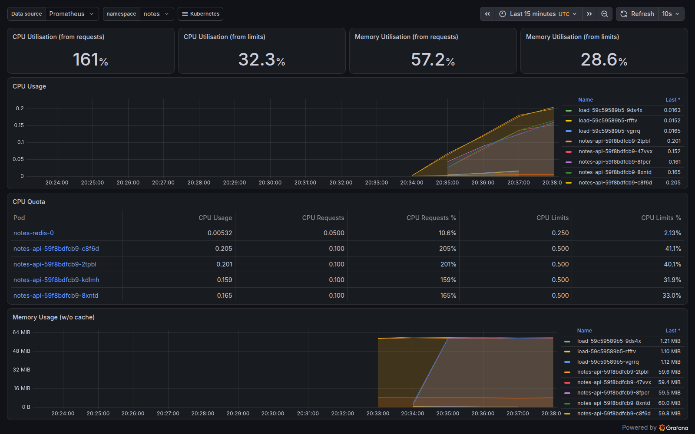

# Session 21: Final DevOps Project – Notes API, end to end

**Name:** Tejas Varshney

One application taken through **every stage of the course**: Git → GitHub → CI → build & test → security scanning → Docker image → container registry → Terraform-provisioned Kubernetes → Helm → GitOps (Argo CD) → monitoring. It finishes with a **troubleshooting challenge** where I intentionally break the app in five ways and fix each one.

The whole flow runs automatically on every push in **[.github/workflows/final-devops-project.yml](../.github/workflows/final-devops-project.yml)**. The latest run is green: [Run #3](https://github.com/TejasVarshney/devops-heros/actions/runs/37684007899). All evidence below was produced by that run and committed back to [outputs/](outputs).

```text
Workflow: Session 21 - Final DevOps Project   (final-devops-project.yml, on: push)
Run #3   commit 20df250   "Session 21: stronger troubleshooting evidence ..."
URL: https://github.com/TejasVarshney/devops-heros/actions/runs/37684007899
Status: Success      Total duration: 15m 42s

JOB                                                      RESULT    DURATION
Build & Unit Test                                        success   12s
SAST - Bandit                                            success   9s
SAST - CodeQL                                            success   59s
SCA - pip-audit                                          success   14s
Secret scan - Gitleaks                                   success   5s
Docker build, Trivy scan, security gate, push            success   46s
Terraform + GitOps deploy + verify + troubleshooting     success   13m 31s

Artifacts:
  image          48.2 MB   (docker save of ghcr.io/tejasvarshney/final-notes-api:20df250)
  test-results   455 B     (JUnit XML)

(Copied from the public run page; the per-step logs on GitHub require signing in.)
```

---

## 1. Project overview

**Notes API**: a small REST service (Python/Flask) to create and list notes.

| Endpoint | Purpose |
|---|---|
| `GET /` | App info: version (= commit SHA), environment, welcome message from the ConfigMap |
| `GET /health` | **Liveness/startup probe**: the process is alive |
| `GET /ready` | **Readiness probe**: pings Redis and returns 503 if storage is unreachable |
| `GET/POST /api/notes` | List / create notes, stored in **Redis** (StatefulSet + PVC) |
| `GET /api/burn?n=` | CPU work, used to demonstrate the **HPA** |
| `GET /metrics` | **Prometheus** metrics: request counter, latency histogram, notes created |

## 2. Architecture



## 3. Technologies used

| Area | Tools |
|---|---|
| Application | Python 3.12, Flask, gunicorn, redis-py, prometheus-client, pytest + fakeredis |
| Containers | Docker (multi-stage, non-root), GitHub Container Registry (GHCR) |
| Kubernetes | Deployment, StatefulSet, Service, ConfigMap, Secret, Ingress, HPA, PVC, startup/readiness/liveness probes, ServiceMonitor |
| Packaging | Helm chart [`helm/notes-api`](helm/notes-api) |
| Infrastructure as Code | Terraform with the `tehcyx/kind` + `hashicorp/helm` providers |
| CI/CD | GitHub Actions (7 jobs, `needs:` gates, artifacts, job outputs) |
| DevSecOps | Bandit, CodeQL, pip-audit, Gitleaks, Trivy |
| GitOps | Argo CD (multi-source Application: chart + environment values from Git) |
| Monitoring | kube-prometheus-stack (Prometheus, Alertmanager, Grafana, node-exporter, kube-state-metrics), metrics-server |

## 4. Repository layout

```
final-devops-project/
├── application/          # Flask app + unit tests (app/main.py, tests/test_api.py)
├── docker/Dockerfile     # multi-stage, non-root image
├── kubernetes/           # plain manifests (used by the troubleshooting challenge)
├── helm/notes-api/       # Helm chart deployed by Argo CD
├── terraform/            # cluster + platform add-ons
├── gitops/               # Argo CD Application + environment values (image tag)
├── security/             # Gitleaks config + security tooling notes
├── monitoring/           # PrometheusRule alerts
├── troubleshooting/      # broken/ manifests + challenge.sh
├── scripts/              # terraform-apply.sh, deploy-and-verify.sh (run by the pipeline)
└── outputs/              # everything the pipeline captured
.github/workflows/final-devops-project.yml   # the pipeline
```

---

## 5. Application setup (local)

```bash
cd final-devops-project/application
pip install -r requirements-dev.txt
pytest -v                       # 9 tests, Redis mocked with fakeredis
docker run -d -p 6379:6379 redis:7.4-alpine
REDIS_HOST=localhost python -m app.main     # http://127.0.0.1:8000
```

## 6. Docker setup

[docker/Dockerfile](docker/Dockerfile): **stage 1** builds wheels, and **stage 2** copies only the wheels and the app into a clean `python:3.12-slim`, so no compilers end up in the final image. It runs as **UID 10001**, uses gunicorn with 2 workers, and gets `APP_VERSION` from a build arg (the commit SHA).

```bash
docker build -f docker/Dockerfile --build-arg APP_VERSION=$(git rev-parse --short HEAD) -t notes-api application/
```

## 7. Terraform infrastructure

No cloud account is used, so Terraform provisions the **Kubernetes cluster itself** (a 2-node kind cluster: control-plane with ingress port mappings + worker) and the **platform layer** as Helm releases: ingress-nginx, metrics-server, kube-prometheus-stack and Argo CD. The same layout maps to EKS by swapping `kind_cluster` for the EKS module (see Sessions 18/19 for the AWS VPC/EC2/S3 Terraform).

Files: [versions.tf](terraform/versions.tf) · [variables.tf](terraform/variables.tf) · [main.tf](terraform/main.tf) · [outputs.tf](terraform/outputs.tf) · [values/](terraform/values)

```text
$ terraform plan -input=false -out=tfplan

Terraform used the selected providers to generate the following execution
plan. Resource actions are indicated with the following symbols:
  + create

Terraform will perform the following actions:

  # helm_release.argocd will be created
  + resource "helm_release" "argocd" {
      + atomic                     = false
      + chart                      = "argo-cd"
      + cleanup_on_fail            = false
      + create_namespace           = true
      + dependency_update          = false
      + disable_crd_hooks          = false
      + disable_openapi_validation = false
      + disable_webhooks           = false
      + force_update               = false
      + id                         = (known after apply)
      + lint                       = false
      + manifest                   = (known after apply)
      + max_history                = 0
      + metadata                   = (known after apply)
      + name                       = "argocd"
      + namespace                  = "argocd"
      + pass_credentials           = false
      + recreate_pods              = false
      + render_subchart_notes      = true
      + replace                    = false
      + repository                 = "https://argoproj.github.io/argo-helm"
      + reset_values               = false
      + reuse_values               = false
      + skip_crds                  = false
      + status                     = "deployed"
      + timeout                    = 900
      + verify                     = false
      + version                    = "10.10.0"
      + wait                       = true
      + wait_for_jobs              = false

      + set {
          + name  = "dex.enabled"
          + value = "false"
            # (1 unchanged attribute hidden)
        }
      + set {
          + name  = "notifications.enabled"
          + value = "false"
            # (1 unchanged attribute hidden)
        }
    }

  # helm_release.ingress_nginx will be created
  + resource "helm_release" "ingress_nginx" {
      + atomic                     = false
      + chart                      = "ingress-nginx"
      + cleanup_on_fail            = false
      + create_namespace           = true
      + dependency_update          = false
      + disable_crd_hooks          = false
      + disable_openapi_validation = false
      + disable_webhooks           = false
      + force_update               = false
      + id                         = (known after apply)
      + lint                       = false
      + manifest                   = (known after apply)
      + max_history                = 0
      + metadata                   = (known after apply)
      + name                       = "ingress-nginx"
      + namespace                  = "ingress-nginx"
      + pass_credentials           = false
      + recreate_pods              = false
      + render_subchart_notes      = true
      + replace                    = false
      + repository                 = "https://kubernetes.github.io/ingress-nginx"
      + reset_values               = false
      + reuse_values               = false
      + skip_crds                  = false
      + status                     = "deployed"
      + timeout                    = 600
      + values                     = [
          + <<-EOT
                controller:
                  hostPort:
                    enabled: true          # bind 80/443 on the node, mapped to the runner by kind
                  service:
                    type: NodePort
                  nodeSelector:
                    ingress-ready: "true"
                  tolerations:
                    - key: node-role.kubernetes.io/control-plane
                      operator: Exists
                      effect: NoSchedule
                  watchIngressWithoutClass: true
            EOT,
        ]
      + verify                     = false
      + version                    = "4.15.1"
      + wait                       = true
      + wait_for_jobs              = false
    }

  # helm_release.metrics_server will be created
  + resource "helm_release" "metrics_server" {
      + atomic                     = false
      + chart                      = "metrics-server"
      + cleanup_on_fail            = false
      + create_namespace           = false
      + dependency_update          = false
      + disable_crd_hooks          = false
      + disable_openapi_validation = false
      + disable_webhooks           = false
      + force_update               = false
      + id                         = (known after apply)
      + lint                       = false
      + manifest                   = (known after apply)
      + max_history                = 0
      + metadata                   = (known after apply)
      + name                       = "metrics-server"
      + namespace                  = "kube-system"
      + pass_credentials           = false
      + recreate_pods              = false
      + render_subchart_notes      = true
      + replace                    = false
      + repository                 = "https://kubernetes-sigs.github.io/metrics-server/"
      + reset_values               = false
      + reuse_values               = false
      + skip_crds                  = false
      + status                     = "deployed"
      + timeout                    = 300
      + verify                     = false
      + version                    = "3.14.0"
      + wait                       = true
      + wait_for_jobs              = false

      + set {
          + name  = "args[0]"
          + value = "--kubelet-insecure-tls"
            # (1 unchanged attribute hidden)
        }
    }

  # helm_release.monitoring[0] will be created
  + resource "helm_release" "monitoring" {
      + atomic                     = false
      + chart                      = "kube-prometheus-stack"
      + cleanup_on_fail            = false
      + create_namespace           = true
      + dependency_update          = false
      + disable_crd_hooks          = false
      + disable_openapi_validation = false
      + disable_webhooks           = false
      + force_update               = false
      + id                         = (known after apply)
      + lint                       = false
      + manifest                   = (known after apply)
      + max_history                = 0
      + metadata                   = (known after apply)
      + name                       = "kps"
      + namespace                  = "monitoring"
      + pass_credentials           = false
      + recreate_pods              = false
      + render_subchart_notes      = true
      + replace                    = false
      + repository                 = "https://prometheus-community.github.io/helm-charts"
      + reset_values               = false
      + reuse_values               = false
      + skip_crds                  = false
      + status                     = "deployed"
      + timeout                    = 900
      + values                     = [
          + <<-EOT
                fullnameOverride: kps
                prometheus:
                  prometheusSpec:
                    scrapeInterval: 15s
                    serviceMonitorSelectorNilUsesHelmValues: false
                    ruleSelectorNilUsesHelmValues: false
                    retention: 2h
                grafana:
                  adminPassword: demo-only-not-secret
                  grafana.ini:
                    auth.anonymous:
                      enabled: true
                      org_role: Viewer
                kubeEtcd: { enabled: false }
                kubeControllerManager: { enabled: false }
                kubeScheduler: { enabled: false }
                kubeProxy: { enabled: false }
            EOT,
        ]
      + verify                     = false
      + version                    = "92.1.0"
      + wait                       = true
      + wait_for_jobs              = false
    }

  # kind_cluster.this will be created
  + resource "kind_cluster" "this" {
      + client_certificate     = (known after apply)
      + client_key             = (known after apply)
      + cluster_ca_certificate = (known after apply)
      + completed              = (known after apply)
      + endpoint               = (known after apply)
      + id                     = (known after apply)
      + kubeconfig             = (known after apply)
      + kubeconfig_path        = (known after apply)
      + name                   = "final-devops"
      + node_image             = "kindest/node:v1.33.1"
      + wait_for_ready         = true

      + kind_config {
          + api_version = "kind.x-k8s.io/v1alpha4"
          + kind        = "Cluster"

          + node {
              + kubeadm_config_patches = [
                  + <<-EOT
                        kind: InitConfiguration
                        nodeRegistration:
                          kubeletExtraArgs:
                            node-labels: "ingress-ready=true"
                    EOT,
                ]
              + role                   = "control-plane"

              + extra_port_mappings {
                  + container_port = 80
                  + host_port      = 80
                }
              + extra_port_mappings {
                  + container_port = 443
                  + host_port      = 443
                }
            }
          + node {
              + role = "worker"
            }
        }
    }

Plan: 5 to add, 0 to change, 0 to destroy.

Changes to Outputs:
  + api_endpoint      = (known after apply)
  + cluster_name      = "final-devops"
  + kubeconfig_path   = (known after apply)
  + platform_releases = [
      + "ingress-nginx",
      + "metrics-server",
      + "argocd",
      + "kps",
    ]
[exit code: 0]
```

```text
$ terraform apply -input=false -auto-approve tfplan
kind_cluster.this: Creating...
kind_cluster.this: Still creating... [00m10s elapsed]
kind_cluster.this: Still creating... [00m20s elapsed]
kind_cluster.this: Still creating... [00m30s elapsed]
kind_cluster.this: Still creating... [00m40s elapsed]
kind_cluster.this: Creation complete after 48s [id=final-devops-kindest/node:v1.33.1]
helm_release.argocd: Creating...
helm_release.metrics_server: Creating...
helm_release.monitoring[0]: Creating...
helm_release.ingress_nginx: Creating...
helm_release.argocd: Still creating... [00m10s elapsed]
helm_release.metrics_server: Still creating... [00m10s elapsed]
helm_release.monitoring[0]: Still creating... [00m10s elapsed]
helm_release.ingress_nginx: Still creating... [00m10s elapsed]
helm_release.argocd: Still creating... [00m20s elapsed]
helm_release.metrics_server: Still creating... [00m20s elapsed]
helm_release.monitoring[0]: Still creating... [00m20s elapsed]
helm_release.ingress_nginx: Still creating... [00m20s elapsed]
helm_release.metrics_server: Creation complete after 27s [id=metrics-server]
helm_release.argocd: Still creating... [00m30s elapsed]
helm_release.ingress_nginx: Creation complete after 28s [id=ingress-nginx]
helm_release.monitoring[0]: Still creating... [00m30s elapsed]
helm_release.argocd: Creation complete after 37s [id=argocd]
helm_release.monitoring[0]: Still creating... [00m40s elapsed]
helm_release.monitoring[0]: Still creating... [00m50s elapsed]
helm_release.monitoring[0]: Creation complete after 59s [id=kps]

Apply complete! Resources: 5 added, 0 changed, 0 destroyed.

Outputs:

api_endpoint = "https://127.0.0.1:35639"
cluster_name = "final-devops"
kubeconfig_path = "/home/runner/work/devops-heros/devops-heros/final-devops-project/terraform/final-devops-config"
platform_releases = [
  "ingress-nginx",
  "metrics-server",
  "argocd",
  "kps",
]
[exit code: 0]
```

```text
$ terraform state list
helm_release.argocd
helm_release.ingress_nginx
helm_release.metrics_server
helm_release.monitoring[0]
kind_cluster.this
[exit code: 0]
```

```text
$ kubectl get nodes -o wide
NAME                         STATUS   ROLES           AGE   VERSION   INTERNAL-IP   EXTERNAL-IP   OS-IMAGE                         KERNEL-VERSION      CONTAINER-RUNTIME
final-devops-control-plane   Ready    control-plane   88s   v1.33.1   172.18.0.3    <none>        Debian GNU/Linux 12 (bookworm)   6.17.0-1022-azure   containerd://2.1.1
final-devops-worker          Ready    <none>          78s   v1.33.1   172.18.0.2    <none>        Debian GNU/Linux 12 (bookworm)   6.17.0-1022-azure   containerd://2.1.1

$ helm list -A
NAME          	NAMESPACE    	REVISION	UPDATED                                	STATUS  	CHART                       	APP VERSION
argocd        	argocd       	1       	2026-10-07 20:45:19.808675407 +0000 UTC	deployed	argo-cd-10.10.0             	v3.5.4     
ingress-nginx 	ingress-nginx	1       	2026-10-07 20:45:20.300935973 +0000 UTC	deployed	ingress-nginx-4.15.1        	1.15.1     
kps           	monitoring   	1       	2026-10-07 20:45:26.038282216 +0000 UTC	deployed	kube-prometheus-stack-92.1.0	v0.94.1    
metrics-server	kube-system  	1       	2026-10-07 20:45:20.151588946 +0000 UTC	deployed	metrics-server-3.14.0       	0.9.0      

$ kubectl get pods -A
NAMESPACE            NAME                                                 READY   STATUS      RESTARTS   AGE
argocd               argocd-application-controller-0                      1/1     Running     0          47s
argocd               argocd-applicationset-controller-6d87689f74-wzkcd    1/1     Running     0          47s
argocd               argocd-redis-6df6bc684d-9qrvm                        1/1     Running     0          47s
argocd               argocd-redis-secret-init-hjszp                       0/1     Completed   0          62s
argocd               argocd-repo-server-74f9d7c6f5-bwt6l                  1/1     Running     0          47s
argocd               argocd-server-7d77d476f7-hvnz2                       1/1     Running     0          47s
ingress-nginx        ingress-nginx-controller-7b89b5b654-j598g            1/1     Running     0          60s
kube-system          coredns-674b8bbfcf-hkbzx                             1/1     Running     0          84s
kube-system          coredns-674b8bbfcf-wtngv                             1/1     Running     0          84s
kube-system          etcd-final-devops-control-plane                      1/1     Running     0          91s
kube-system          kindnet-l4hn6                                        1/1     Running     0          83s
kube-system          kindnet-tr8n6                                        1/1     Running     0          84s
kube-system          kube-apiserver-final-devops-control-plane            1/1     Running     0          90s
kube-system          kube-controller-manager-final-devops-control-plane   1/1     Running     0          90s
kube-system          kube-proxy-c7mrp                                     1/1     Running     0          83s
kube-system          kube-proxy-w2dxj                                     1/1     Running     0          84s
kube-system          kube-scheduler-final-devops-control-plane            1/1     Running     0          90s
kube-system          metrics-server-65f9479866-bgcqx                      1/1     Running     0          67s
local-path-storage   local-path-provisioner-7dc846544d-wbjsh              1/1     Running     0          84s
monitoring           alertmanager-kps-alertmanager-0                      2/2     Running     0          38s
monitoring           kps-grafana-54c98f5b68-ngmb7                         3/3     Running     0          48s
monitoring           kps-kube-state-metrics-667b9d7c5-c7nlx               1/1     Running     0          48s
monitoring           kps-operator-7c5fdd9599-5grb4                        1/1     Running     0          48s
monitoring           kps-prometheus-node-exporter-tqc22                   1/1     Running     0          48s
monitoring           kps-prometheus-node-exporter-xbbbl                   1/1     Running     0          48s
monitoring           prometheus-kps-prometheus-0                          2/2     Running     0          37s
```

## 8. CI/CD pipeline

| # | Job | What it does | Gate |
|---|---|---|---|
| 1 | Build & Unit Test | `pip install`, `compileall`, `pytest --cov` (9 tests), JUnit artifact | Fails → nothing else runs |
| 2 | SAST – Bandit | Python security linter | MEDIUM+ severity/confidence fails |
| 3 | SAST – CodeQL | Semantic analysis → GitHub Security tab | — |
| 4 | SCA – pip-audit | Known CVEs in `requirements.txt` | Any CVE fails |
| 5 | Secret scan – Gitleaks | Secrets in the project tree ([config](security/.gitleaks.toml)) | Any secret fails |
| 6 | Docker build → Trivy → **security gate** → push | Image built once, scanned, gated, pushed to `ghcr.io/tejasvarshney/final-notes-api:<sha>`, saved as an artifact | `needs` jobs 2–5. Trivy fails on fixable CRITICAL |
| 7 | Terraform + GitOps deploy + verify + troubleshooting | Provisions the cluster, loads the scanned image, commits the tag to Git, lets Argo CD deploy, verifies everything, runs the challenge, commits outputs | — |

## 9. DevSecOps implementation
- **Shift-left scans** (SAST ×2, SCA, secrets) run in parallel right after the tests. The image job `needs` all of them, so a single finding blocks the build (Session 17 shows this gate blocking a real `debug=True` issue).
- **Image gate**: Trivy reports HIGH/CRITICAL and fails on fixable CRITICAL. The pushed and deployed image is **exactly** the scanned one (same SHA tag, passed between jobs as an artifact).
- **No secrets in Git**: the Redis password is generated at deploy time (`openssl rand -hex 16`) into the `notes-redis-auth` Secret. Only a placeholder [secret.example.yaml](kubernetes/secret.example.yaml) is committed. GHCR uses the short-lived `GITHUB_TOKEN` with `packages: write` on that one job only.
- **Hardened workload**: `runAsNonRoot`, `readOnlyRootFilesystem` (+ an emptyDir for `/tmp`), `allowPrivilegeEscalation: false`, all capabilities dropped, requests/limits set.

## 10. Kubernetes deployment (via Helm + Argo CD)

| Requirement | Implementation | Verified below |
|---|---|---|
| Deployment | `notes-api`, rolling update, checksum annotation rolls Pods when config changes | 2/2 Ready |
| Service | ClusterIP `notes-api:80 → 8000` | — |
| ConfigMap | `notes-config` (APP_ENV, WELCOME_MESSAGE, REDIS_HOST/PORT) via `envFrom` | Values read inside the container |
| Secret | `notes-redis-auth`, used by both Redis (`--requirepass`) and the API | `REDIS_PASSWORD length=32` |
| Ingress | `notes.local` → Service (ingress-nginx) | `curl -H 'Host: notes.local' http://localhost/` |
| HPA | 2–6 replicas at 60% CPU | **2 → 6 under load** |
| Probes | startup `/health`, liveness `/health`, readiness `/ready` (checks Redis) | `describe` + troubleshooting issue 3 |
| Storage | Redis StatefulSet with a `volumeClaimTemplate` (1Gi PVC) | Notes **survived deleting the Redis Pod** |

## 11. Helm deployment

The chart [helm/notes-api](helm/notes-api) templates all of the above from [values.yaml](helm/notes-api/values.yaml). Environment-specific values (image tag, environment name, message) live in [gitops/notes-values.yaml](gitops/notes-values.yaml). That's the one file CI changes. Argo CD renders the chart with release name `notes` (`helm template` equivalent) and applies it, so `helm upgrade` is never run by hand.

## 12. GitOps

1. CI commits `image.tag: "<sha>"` to [gitops/notes-values.yaml](gitops/notes-values.yaml) on the **`final-gitops`** branch.
2. The Argo CD [Application](gitops/argocd-application.yaml) (multi-source: the chart path + `$values/…/notes-values.yaml`, both from that branch) detects the new commit and syncs.
3. `automated.prune` + `selfHeal`: manual edits are reverted (shown below with the ConfigMap).

```text
################ load the image built + scanned by the pipeline into the cluster ################
$ docker load -i ../image.tar.gz 2>/dev/null || docker load -i image.tar.gz
Loaded image: ghcr.io/tejasvarshney/final-notes-api:20df250

$ kind load docker-image ghcr.io/tejasvarshney/final-notes-api:20df250 --name final-devops
Image: "ghcr.io/tejasvarshney/final-notes-api:20df250" with ID "sha256:6202f5772b88660e1468d3d614fe4ca0c35ecf9bc97a0d4d4738f03a7e3b9ebd" not yet present on node "final-devops-control-plane", loading...
Image: "ghcr.io/tejasvarshney/final-notes-api:20df250" with ID "sha256:6202f5772b88660e1468d3d614fe4ca0c35ecf9bc97a0d4d4738f03a7e3b9ebd" not yet present on node "final-devops-worker", loading...

################ the Secret is created by the pipeline - never committed to Git ################
$ kubectl create namespace notes
namespace/notes created

$ kubectl -n notes create secret generic notes-redis-auth --from-literal=password=$(openssl rand -hex 16)
secret/notes-redis-auth created

$ kubectl -n notes get secret notes-redis-auth
NAME               TYPE     DATA   AGE
notes-redis-auth   Opaque   1      0s

################ GitOps: commit the new image tag to the environment branch ################
$ git log --oneline -1 && git show --format= HEAD -- gitops/notes-values.yaml
edd94bd GitOps: deploy notes-api 20df250
diff --git a/final-devops-project/gitops/notes-values.yaml b/final-devops-project/gitops/notes-values.yaml
index f16d4fa..67a07ed 100644
--- a/final-devops-project/gitops/notes-values.yaml
+++ b/final-devops-project/gitops/notes-values.yaml
@@ -1,7 +1,7 @@
 # Environment-specific values - THE file the CI pipeline changes.
 # Argo CD watches it (branch "final-gitops") and syncs the cluster to whatever is committed here.
 image:
-  tag: latest
+  tag: "20df250"
 config:
   APP_ENV: production
   WELCOME_MESSAGE: "Welcome to the Notes API - deployed by Argo CD"

error: Your local changes to the following files would be overwritten by checkout:
	final-devops-project/outputs/20-gitops-deploy.txt
Please commit your changes or stash them before you switch branches.
Aborting
################ Argo CD Application (Helm chart + values from Git) ################
$ cat gitops/argocd-application.yaml
# Multi-source Application: the Helm chart + the values file, both from this repo.
apiVersion: argoproj.io/v1alpha1
kind: Application
metadata:
  name: notes-api
  namespace: argocd
spec:
  project: default
  sources:
    - repoURL: https://github.com/TejasVarshney/devops-heros.git
      targetRevision: final-gitops
      path: final-devops-project/helm/notes-api
      helm:
        releaseName: notes
        valueFiles:
          - $values/final-devops-project/gitops/notes-values.yaml
    - repoURL: https://github.com/TejasVarshney/devops-heros.git
      targetRevision: final-gitops
      ref: values
  destination:
    server: https://kubernetes.default.svc
    namespace: notes
  syncPolicy:
    automated:
      prune: true
      selfHeal: true
    syncOptions:
      - CreateNamespace=true

$ kubectl apply -f gitops/argocd-application.yaml
application.argoproj.io/notes-api created

$ kubectl -n argocd get applications -o wide
NAME        SYNC STATUS   HEALTH STATUS   REVISION   PROJECT
notes-api   Synced        Healthy                    default

$ kubectl -n argocd get application notes-api -o jsonpath='revision={.status.sync.revisions}{"\n"}'
revision=["edd94bd5e7f1f414537d8c974d68d35adef758bd","edd94bd5e7f1f414537d8c974d68d35adef758bd"]

(expected GitOps commit: edd94bd5e7f1f414537d8c974d68d35adef758bd)

$ kubectl -n notes get all,ingress,hpa,pvc,configmap,secret,servicemonitor
NAME                            READY   STATUS    RESTARTS   AGE
pod/notes-api-fbbf5d9b7-7t9fv   1/1     Running   0          37s
pod/notes-api-fbbf5d9b7-k6qr8   1/1     Running   0          52s
pod/notes-redis-0               1/1     Running   0          52s

NAME                  TYPE        CLUSTER-IP     EXTERNAL-IP   PORT(S)    AGE
service/notes-api     ClusterIP   10.96.210.18   <none>        80/TCP     52s
service/notes-redis   ClusterIP   10.96.37.25    <none>        6379/TCP   52s

NAME                        READY   UP-TO-DATE   AVAILABLE   AGE
deployment.apps/notes-api   2/2     2            2           52s

NAME                                  DESIRED   CURRENT   READY   AGE
replicaset.apps/notes-api-fbbf5d9b7   2         2         2       52s

NAME                           READY   AGE
statefulset.apps/notes-redis   1/1     52s

NAME                                            REFERENCE              TARGETS       MINPODS   MAXPODS   REPLICAS   AGE
horizontalpodautoscaler.autoscaling/notes-api   Deployment/notes-api   cpu: 1%/60%   2         6         2          52s

NAME                                  CLASS   HOSTS         ADDRESS         PORTS   AGE
ingress.networking.k8s.io/notes-api   nginx   notes.local   10.96.163.157   80      51s

NAME                                       STATUS   VOLUME                                     CAPACITY   ACCESS MODES   STORAGECLASS   VOLUMEATTRIBUTESCLASS   AGE
persistentvolumeclaim/data-notes-redis-0   Bound    pvc-5ab65c79-06f0-46d9-9d21-5a36a01b3cb1   1Gi        RWO            standard       <unset>                 52s

NAME                         DATA   AGE
configmap/kube-root-ca.crt   1      58s
configmap/notes-config       4      52s

NAME                      TYPE     DATA   AGE
secret/notes-redis-auth   Opaque   1      58s

NAME                                             AGE
servicemonitor.monitoring.coreos.com/notes-api   51s
```

## 13. Verification: ingress, storage, config, probes, HPA, self-heal

```text
################ through the Ingress (http://notes.local on the cluster's port 80) ################
$ api / | jq .
{
  "app": "notes-api",
  "environment": "production",
  "message": "Welcome to the Notes API - deployed by Argo CD",
  "version": "20df250"
}

$ api /health
{"status":"ok"}

$ api /ready
{"status":"ready"}

$ api /api/notes -X POST -H 'Content-Type: application/json' -d '{"text":"Final project deployed by Argo CD"}' | jq .
{
  "created": 1791406053.9779809,
  "id": "d02b8e0a",
  "text": "Final project deployed by Argo CD"
}

$ api /api/notes -X POST -H 'Content-Type: application/json' -d '{"text":"Notes survive Redis restarts"}' | jq .
{
  "created": 1791406053.9871948,
  "id": "e496ef51",
  "text": "Notes survive Redis restarts"
}

$ api /api/notes | jq -r '.[].text'
Final project deployed by Argo CD
Notes survive Redis restarts

################ storage: delete the Redis Pod, the PVC keeps the data ################
$ kubectl -n notes get pvc
NAME                 STATUS   VOLUME                                     CAPACITY   ACCESS MODES   STORAGECLASS   VOLUMEATTRIBUTESCLASS   AGE
data-notes-redis-0   Bound    pvc-5ab65c79-06f0-46d9-9d21-5a36a01b3cb1   1Gi        RWO            standard       <unset>                 53s

$ kubectl -n notes delete pod notes-redis-0 && kubectl -n notes wait --for=condition=Ready pod/notes-redis-0 --timeout=120s
pod "notes-redis-0" deleted from notes namespace
pod/notes-redis-0 condition met

$ api /api/notes | jq -r '.[].text'
Final project deployed by Argo CD
Notes survive Redis restarts

################ ConfigMap + Secret inside the container ################
$ kubectl -n notes exec deploy/notes-api -- sh -c 'echo APP_ENV=$APP_ENV; echo WELCOME_MESSAGE=$WELCOME_MESSAGE; echo REDIS_HOST=$REDIS_HOST; echo REDIS_PASSWORD length=${#REDIS_PASSWORD}'
APP_ENV=production
WELCOME_MESSAGE=Welcome to the Notes API - deployed by Argo CD
REDIS_HOST=notes-redis
REDIS_PASSWORD length=32

################ probes ################
$ kubectl -n notes describe deploy notes-api | grep -E 'Liveness|Readiness|Startup|Limits|Requests' -A0
    Limits:
--
    Requests:
--
    Liveness:   http-get http://:http/health delay=0s timeout=1s period=10s successThreshold=1 failureThreshold=3
    Readiness:  http-get http://:http/ready delay=0s timeout=1s period=5s successThreshold=1 failureThreshold=2
    Startup:    http-get http://:http/health delay=0s timeout=1s period=2s successThreshold=1 failureThreshold=30

################ HPA: generate CPU load on /api/burn ################
$ kubectl -n notes get hpa
NAME        REFERENCE              TARGETS       MINPODS   MAXPODS   REPLICAS   AGE
notes-api   Deployment/notes-api   cpu: 1%/60%   2         6         2          65s

deployment.apps/load created
======== t+45s under load ========
$ kubectl -n notes get hpa notes-api
NAME        REFERENCE              TARGETS         MINPODS   MAXPODS   REPLICAS   AGE
notes-api   Deployment/notes-api   cpu: 397%/60%   2         6         6          110s

======== t+90s under load ========
$ kubectl -n notes get hpa notes-api
NAME        REFERENCE              TARGETS         MINPODS   MAXPODS   REPLICAS   AGE
notes-api   Deployment/notes-api   cpu: 236%/60%   2         6         6          2m35s

======== t+135s under load ========
$ kubectl -n notes get hpa notes-api
NAME        REFERENCE              TARGETS         MINPODS   MAXPODS   REPLICAS   AGE
notes-api   Deployment/notes-api   cpu: 257%/60%   2         6         6          3m20s

======== t+180s under load ========
$ kubectl -n notes get hpa notes-api
NAME        REFERENCE              TARGETS         MINPODS   MAXPODS   REPLICAS   AGE
notes-api   Deployment/notes-api   cpu: 260%/60%   2         6         6          4m6s

$ kubectl -n notes top pods
NAME                        CPU(cores)   MEMORY(bytes)   
load-59c59589b5-7nmg9       26m          1Mi             
load-59c59589b5-84g7d       23m          1Mi             
load-59c59589b5-9lsvp       24m          1Mi             
notes-api-fbbf5d9b7-5tcj6   226m         59Mi            
notes-api-fbbf5d9b7-7t9fv   266m         59Mi            
notes-api-fbbf5d9b7-k6qr8   252m         59Mi            
notes-api-fbbf5d9b7-n5pbc   256m         59Mi            
notes-api-fbbf5d9b7-pnqkc   292m         59Mi            
notes-api-fbbf5d9b7-xl4lj   269m         59Mi            
notes-redis-0               6m           10Mi            

$ kubectl -n notes get pods -l app=notes-api
NAME                        READY   STATUS    RESTARTS   AGE
notes-api-fbbf5d9b7-5tcj6   1/1     Running   0          2m35s
notes-api-fbbf5d9b7-7t9fv   1/1     Running   0          3m51s
notes-api-fbbf5d9b7-k6qr8   1/1     Running   0          4m6s
notes-api-fbbf5d9b7-n5pbc   1/1     Running   0          2m35s
notes-api-fbbf5d9b7-pnqkc   1/1     Running   0          2m35s
notes-api-fbbf5d9b7-xl4lj   1/1     Running   0          2m35s

$ kubectl -n notes describe hpa notes-api | sed -n '/Events:/,$p'
Events:
  Type     Reason                        Age    From                       Message
  ----     ------                        ----   ----                       -------
  Normal   SuccessfulRescale             3m51s  horizontal-pod-autoscaler  New size: 2; reason: Current number of replicas below Spec.MinReplicas
  Warning  FailedGetResourceMetric       3m36s  horizontal-pod-autoscaler  failed to get cpu utilization: did not receive metrics for targeted pods (pods might be unready)
  Warning  FailedComputeMetricsReplicas  3m36s  horizontal-pod-autoscaler  invalid metrics (1 invalid out of 1), first error is: failed to get cpu resource metric value: failed to get cpu utilization: did not receive metrics for targeted pods (pods might be unready)
  Normal   SuccessfulRescale             2m35s  horizontal-pod-autoscaler  New size: 6; reason: cpu resource utilization (percentage of request) above target

################ GitOps self-heal: manual change is reverted by Argo CD ################
$ kubectl -n notes patch configmap notes-config --type merge -p '{"data":{"WELCOME_MESSAGE":"hacked by hand"}}'
configmap/notes-config patched

$ kubectl -n notes get configmap notes-config -o jsonpath='{.data.WELCOME_MESSAGE}'; echo
Welcome to the Notes API - deployed by Argo CD
```

- Through the **Ingress**, the API reports `version: 20df250` (the commit being deployed) and the ConfigMap message `deployed by Argo CD`.
- **Storage:** after `kubectl delete pod notes-redis-0`, both notes were still there (Redis AOF on the PVC).
- **HPA:** under load CPU jumped to **397%** of requests and the HPA scaled **2 → 6 (max)** within ~45s. With 6 Pods it settled around 236–260%. It can't go higher than `maxReplicas: 6`, which is exactly what the max is for. The `FailedGetResourceMetric` event at the start is the normal gap before metrics-server has data for new Pods.
- **Self-heal:** I set `WELCOME_MESSAGE` to "hacked by hand", and 30s later Argo CD had restored the Git value.

## 14. Monitoring

Prometheus discovers the API through the chart's **ServiceMonitor**. [monitoring/alerts.yaml](monitoring/alerts.yaml) adds `NotesApiDown`, `NotesApiHighErrorRate` (> 5% 5xx) and `NotesApiHighLatency` (p95 > 500ms).

```text
$ curl -s localhost:9090/api/v1/targets | jq -r '.data.activeTargets[] | select(.labels.namespace=="notes") | "\(.labels.job) \(.labels.instance) health=\(.health)"'
notes-api 10.244.1.26:8000 health=up
notes-api 10.244.1.27:8000 health=up
notes-api 10.244.1.29:8000 health=up
notes-api 10.244.1.28:8000 health=up
notes-api 10.244.1.18:8000 health=up
notes-api 10.244.1.21:8000 health=up

$ promq 'sum by (endpoint, status) (rate(notes_http_requests_total{namespace="notes"}[2m]))'
endpoint=http,status=200 => 43.8896506031746
endpoint=http,status=503 => 0.028571428571428567
endpoint=http,status=201 => 0
endpoint=http,status=404 => 0.1339853703703704

$ promq 'histogram_quantile(0.95, sum by (le) (rate(notes_http_request_duration_seconds_bucket{namespace="notes"}[5m])))'
 => 0.19367649306158014

$ promq 'notes_created_total'
container=api,endpoint=http,instance=10.244.1.21:8000,job=notes-api,namespace=notes,pod=notes-api-fbbf5d9b7-7t9fv,service=notes-api => 0
container=api,endpoint=http,instance=10.244.1.18:8000,job=notes-api,namespace=notes,pod=notes-api-fbbf5d9b7-k6qr8,service=notes-api => 1
container=api,endpoint=http,instance=10.244.1.26:8000,job=notes-api,namespace=notes,pod=notes-api-fbbf5d9b7-pnqkc,service=notes-api => 0
container=api,endpoint=http,instance=10.244.1.29:8000,job=notes-api,namespace=notes,pod=notes-api-fbbf5d9b7-xl4lj,service=notes-api => 0
container=api,endpoint=http,instance=10.244.1.27:8000,job=notes-api,namespace=notes,pod=notes-api-fbbf5d9b7-5tcj6,service=notes-api => 0
container=api,endpoint=http,instance=10.244.1.28:8000,job=notes-api,namespace=notes,pod=notes-api-fbbf5d9b7-n5pbc,service=notes-api => 0

$ promq 'sum by (pod) (rate(container_cpu_usage_seconds_total{namespace="notes", container!=""}[2m]))'
pod=notes-api-fbbf5d9b7-k6qr8 => 0.11328007658869799
pod=notes-api-fbbf5d9b7-7t9fv => 0.11224719041654173
pod=notes-redis-0 => 0.004843297665553227
pod=load-59c59589b5-9lsvp => 0.008423625953913485
pod=load-59c59589b5-7nmg9 => 0.007735235937172948
pod=load-59c59589b5-84g7d => 0.009120938616341081
pod=notes-api-fbbf5d9b7-pnqkc => 0.1142187698429497
pod=notes-api-fbbf5d9b7-5tcj6 => 0.09199416209132155
pod=notes-api-fbbf5d9b7-xl4lj => 0.10042523792093705
pod=notes-api-fbbf5d9b7-n5pbc => 0.10604203500476006

$ promq 'sum by (pod) (container_memory_working_set_bytes{namespace="notes", container!=""})'
pod=notes-api-fbbf5d9b7-k6qr8 => 62717952
pod=notes-api-fbbf5d9b7-7t9fv => 62537728
pod=notes-redis-0 => 10723328
pod=notes-api-fbbf5d9b7-pnqkc => 62406656
pod=notes-api-fbbf5d9b7-5tcj6 => 62763008
pod=notes-api-fbbf5d9b7-xl4lj => 62427136
pod=notes-api-fbbf5d9b7-n5pbc => 62357504

$ curl -s localhost:9090/api/v1/rules | jq -r '.data.groups[] | select(.name=="notes-api.rules") | .rules[] | "\(.name): \(.state) health=\(.health)"'
NotesApiDown: unknown health=unknown
NotesApiHighErrorRate: unknown health=unknown
NotesApiHighLatency: unknown health=unknown

$ kubectl -n notes logs deploy/notes-api --tail=6
Found 6 pods, using pod/notes-api-fbbf5d9b7-k6qr8
10.244.1.1 - - [07/Oct/2026:20:52:11 +0000] "GET /ready HTTP/1.1" 200 19 "-" "kube-probe/1.33"
10.244.1.1 - - [07/Oct/2026:20:52:12 +0000] "GET /health HTTP/1.1" 200 16 "-" "kube-probe/1.33"
10.244.1.1 - - [07/Oct/2026:20:52:16 +0000] "GET /ready HTTP/1.1" 200 19 "-" "kube-probe/1.33"
10.244.1.16 - - [07/Oct/2026:20:52:19 +0000] "GET /metrics HTTP/1.1" 200 10822 "-" "Prometheus/3.15.0"
10.244.1.1 - - [07/Oct/2026:20:52:21 +0000] "GET /ready HTTP/1.1" 200 19 "-" "kube-probe/1.33"
10.244.1.1 - - [07/Oct/2026:20:52:22 +0000] "GET /health HTTP/1.1" 200 16 "-" "kube-probe/1.33"
```

- All `notes-api` Pods are scraped (`health=up`, one target per HPA replica).
- Request rate by status (≈44 req/s `200` from the load test, plus `404`s from my `/missing` requests and a few `503`s recorded while the Redis Pod was being restarted in the storage test), **p95 latency ≈ 0.19s**, `notes_created_total`, CPU and memory per Pod.
- The three alert rules are **loaded**. They still showed `unknown` at capture time because the pipeline queried before Prometheus's first evaluation cycle of the new group. A full alert-firing demo (rule → firing → Alertmanager) is in [Session 20](../Monitoring%20Observability%20GitOps/README.md#task-1--monitoring).
- Logs: gunicorn access logs show the kube-probe and Prometheus scrape requests.



---

## 15. Final troubleshooting challenge

I deployed a copy of the app into `notes-staging` from [troubleshooting/broken/](troubleshooting/broken), with **five intentional faults**, then worked through them with [troubleshooting/challenge.sh](troubleshooting/challenge.sh), fixing each one with the correct manifest from [kubernetes/](kubernetes).

| # | Symptom | Investigation | Root cause | Fix |
|---|---|---|---|---|
| 1 | Pods `ErrImagePull` / `ImagePullBackOff` | `describe` image + `get events reason=Failed` → `…:20df250x: not found` | Typo in the image tag | Use the tag the pipeline built |
| 2 | `CreateContainerConfigError` | Event: `couldn't find key redis-password in Secret`; the Secret's keys are `["password"]` | Wrong `secretKeyRef.key` | `key: password` |
| 3 | Pods `Running` but `0/1` Ready; Service has **no endpoints** | `exec` → `/health` 200 but `/ready` **503: "Error -3 connecting to redis:6379. Temporary failure in name resolution"**; Service is named `notes-redis` | `REDIS_HOST=redis` in the ConfigMap | Correct ConfigMap + `rollout restart` → 2 endpoints |
| 4 | HPA `cpu: <unknown>/60%` | `describe hpa` → **`missing request for cpu in container api`**; `resources: {}` | No `resources.requests` (HPA % is relative to the request) | Add requests/limits → `cpu: 1%/60%` |
| 5 | Ingress **HTTP 503** | `describe ingress` → backend `notes-api:8000 ()`; Service ports `[80]` | Ingress points at the targetPort, not the Service port | `port: 80` |

After all five fixes, `notes-staging.local` returned the app info and stored a note (`["staging fixed"]`).

```text
############################ THE REPORT: "notes-staging.local is down" ############################
$ api / ; echo "HTTP $(curl -s -o /dev/null -w '%{http_code}' -H 'Host: notes-staging.local' http://localhost/)"
<html>
<head><title>503 Service Temporarily Unavailable</title></head>
<body>
<center><h1>503 Service Temporarily Unavailable</h1></center>
<hr><center>nginx</center>
</body>
</html>
HTTP 503

$ kubectl -n notes-staging get pods,svc,ingress,hpa
NAME                             READY   STATUS         RESTARTS   AGE
pod/notes-api-6b7644f554-62zh2   0/1     ErrImagePull   0          61s
pod/notes-api-6b7644f554-rjf56   0/1     ErrImagePull   0          61s
pod/notes-redis-0                1/1     Running        0          60s

NAME                  TYPE        CLUSTER-IP      EXTERNAL-IP   PORT(S)    AGE
service/notes-api     ClusterIP   10.96.220.79    <none>        80/TCP     60s
service/notes-redis   ClusterIP   10.96.147.123   <none>        6379/TCP   60s

NAME                                  CLASS   HOSTS                 ADDRESS         PORTS   AGE
ingress.networking.k8s.io/notes-api   nginx   notes-staging.local   10.96.163.157   80      60s

NAME                                            REFERENCE              TARGETS              MINPODS   MAXPODS   REPLICAS   AGE
horizontalpodautoscaler.autoscaling/notes-api   Deployment/notes-api   cpu: <unknown>/60%   2         6         2          61s

############################ ISSUE 1: ImagePullBackOff ############################
$ kubectl -n notes-staging get pods -l app=notes-api
NAME                         READY   STATUS         RESTARTS   AGE
notes-api-6b7644f554-62zh2   0/1     ErrImagePull   0          61s
notes-api-6b7644f554-rjf56   0/1     ErrImagePull   0          61s

$ kubectl -n notes-staging describe pod -l app=notes-api | grep -m1 'Image:'
    Image:          ghcr.io/tejasvarshney/final-notes-api:20df250x

$ kubectl -n notes-staging get events --field-selector reason=Failed -o custom-columns=OBJECT:.involvedObject.name,MESSAGE:.message | grep notes-api | sort -u | head -3
notes-api-6b7644f554-62zh2   Error: ErrImagePull
notes-api-6b7644f554-62zh2   Error: ImagePullBackOff
notes-api-6b7644f554-62zh2   Failed to pull image "ghcr.io/tejasvarshney/final-notes-api:20df250x": rpc error: code = NotFound desc = failed to pull and unpack image "ghcr.io/tejasvarshney/final-notes-api:20df250x": failed to resolve reference "ghcr.io/tejasvarshney/final-notes-api:20df250x": ghcr.io/tejasvarshney/final-notes-api:20df250x: not found

# ROOT CAUSE: image tag has a typo (extra 'x') - that tag was never built or pushed
# FIX: use the image the pipeline built (ghcr.io/tejasvarshney/final-notes-api:20df250)
$ kubectl -n notes-staging set image deploy/notes-api api=ghcr.io/tejasvarshney/final-notes-api:20df250
deployment.apps/notes-api image updated

$ kubectl -n notes-staging get pods -l app=notes-api
NAME                         READY   STATUS                       RESTARTS   AGE
notes-api-6b7644f554-62zh2   0/1     ImagePullBackOff             0          91s
notes-api-6b7644f554-rjf56   0/1     ImagePullBackOff             0          91s
notes-api-75b477b4d-l2hn5    0/1     CreateContainerConfigError   0          30s

############################ ISSUE 2: CreateContainerConfigError ############################
$ kubectl -n notes-staging get events --field-selector reason=Failed -o custom-columns=MESSAGE:.message | grep -i secret | sort -u | head -2
Error: couldn't find key redis-password in Secret notes-staging/notes-redis-auth

$ kubectl -n notes-staging get secret notes-redis-auth -o jsonpath='{.data}' | jq 'keys'
[
  "password"
]

# ROOT CAUSE: Deployment reads key 'redis-password' but the Secret's key is 'password'
$ diff <(sed 's#IMAGE_PLACEHOLDER_TYPO#IMG#' troubleshooting/broken/deployment.yaml) <(sed 's#IMAGE_PLACEHOLDER#IMG#' kubernetes/deployment.yaml)
1d0
< # BUG 1: image tag typo   BUG 2: wrong Secret key   BUG 4: no resource requests (HPA cannot compute %)
26c25
<                 secretKeyRef: { name: notes-redis-auth, key: redis-password }
---
>                 secretKeyRef: { name: notes-redis-auth, key: password }
31a31,33
>           resources:
>             requests: { cpu: 100m, memory: 96Mi }
>             limits:   { cpu: 500m, memory: 192Mi }

# FIX: apply the corrected Deployment (also adds resource requests - see issue 4)
$ sed 's#IMAGE_PLACEHOLDER#ghcr.io/tejasvarshney/final-notes-api:20df250#' kubernetes/deployment.yaml | kubectl -n notes-staging apply -f -
deployment.apps/notes-api configured

$ kubectl -n notes-staging get pods -l app=notes-api
NAME                         READY   STATUS                       RESTARTS   AGE
notes-api-6b7644f554-62zh2   0/1     ImagePullBackOff             0          2m12s
notes-api-75b477b4d-l2hn5    0/1     CreateContainerConfigError   0          71s
notes-api-ccb655b5f-vfbgs    0/1     Running                      0          40s

############################ ISSUE 3: Pods Running but never Ready ############################
$ kubectl -n notes-staging get pod notes-api-ccb655b5f-vfbgs
NAME                        READY   STATUS    RESTARTS   AGE
notes-api-ccb655b5f-vfbgs   0/1     Running   0          40s

$ kubectl -n notes-staging get events --field-selector involvedObject.name=notes-api-ccb655b5f-vfbgs,reason=Unhealthy -o custom-columns=MESSAGE:.message | sort -u | head -2
MESSAGE
Readiness probe failed: Get "http://10.244.1.35:8000/ready": dial tcp 10.244.1.35:8000: connect: connection refused

$ kubectl -n notes-staging exec notes-api-ccb655b5f-vfbgs -- python -c "import urllib.request as u; print(u.urlopen('http://127.0.0.1:8000/health').read().decode())"
{"status":"ok"}


$ kubectl -n notes-staging exec notes-api-ccb655b5f-vfbgs -- python -c "import urllib.request as u, urllib.error as e
try: u.urlopen('http://127.0.0.1:8000/ready')
except e.HTTPError as x: print(x.code, x.read().decode())"
503 {"reason":"Error -3 connecting to redis:6379. Temporary failure in name resolution.","status":"not ready"}


$ kubectl -n notes-staging get endpoints notes-api
Warning: v1 Endpoints is deprecated in v1.33+; use discovery.k8s.io/v1 EndpointSlice
NAME        ENDPOINTS   AGE
notes-api               2m11s

$ kubectl -n notes-staging get configmap notes-config -o jsonpath='{.data.REDIS_HOST}'; echo; kubectl -n notes-staging get svc
redis
NAME          TYPE        CLUSTER-IP      EXTERNAL-IP   PORT(S)    AGE
notes-api     ClusterIP   10.96.220.79    <none>        80/TCP     2m11s
notes-redis   ClusterIP   10.96.147.123   <none>        6379/TCP   2m11s

# ROOT CAUSE: REDIS_HOST=redis, but the Redis Service is named notes-redis -> name does not resolve -> /ready 503 -> no endpoints
$ kubectl -n notes-staging apply -f kubernetes/configmap.yaml && kubectl -n notes-staging rollout restart deploy/notes-api && kubectl -n notes-staging rollout status deploy/notes-api --timeout=120s
configmap/notes-config configured
deployment.apps/notes-api restarted
Waiting for deployment "notes-api" rollout to finish: 1 out of 2 new replicas have been updated...
Waiting for deployment "notes-api" rollout to finish: 1 out of 2 new replicas have been updated...
Waiting for deployment "notes-api" rollout to finish: 1 out of 2 new replicas have been updated...
Waiting for deployment "notes-api" rollout to finish: 1 out of 2 new replicas have been updated...
Waiting for deployment "notes-api" rollout to finish: 1 old replicas are pending termination...
Waiting for deployment "notes-api" rollout to finish: 1 old replicas are pending termination...
Waiting for deployment "notes-api" rollout to finish: 1 old replicas are pending termination...
deployment "notes-api" successfully rolled out

$ kubectl -n notes-staging get endpoints notes-api
Warning: v1 Endpoints is deprecated in v1.33+; use discovery.k8s.io/v1 EndpointSlice
NAME        ENDPOINTS                           AGE
notes-api   10.244.1.36:8000,10.244.1.37:8000   2m15s

############################ ISSUE 4: HPA shows <unknown> ############################
(state with the original broken manifest, captured at the start:)
$ kubectl -n notes-staging get hpa notes-api
NAME        REFERENCE              TARGETS              MINPODS   MAXPODS   REPLICAS   AGE
notes-api   Deployment/notes-api   cpu: <unknown>/60%   2         6         2          61s

$ kubectl -n notes-staging describe hpa notes-api | grep -iE 'missing request|FailedGetResourceMetric|unable' | head -3
  ScalingActive  False   FailedGetResourceMetric  the HPA was unable to compute the replica count: failed to get cpu utilization: unable to get metrics for resource cpu: no metrics returned from resource metrics API
  Warning  FailedGetResourceMetric       0s (x4 over 46s)  horizontal-pod-autoscaler  failed to get cpu utilization: unable to get metrics for resource cpu: no metrics returned from resource metrics API
  Warning  FailedComputeMetricsReplicas  0s (x4 over 46s)  horizontal-pod-autoscaler  invalid metrics (1 invalid out of 1), first error is: failed to get cpu resource metric value: failed to get cpu utilization: unable to get metrics for resource cpu: no metrics returned from resource metrics API

# At that point no Pod was even running. To isolate the real config bug, deploy the broken manifest
# with only issues 1+2 corrected, i.e. still WITHOUT resources.requests:
$ sed 's#IMAGE_PLACEHOLDER_TYPO#ghcr.io/tejasvarshney/final-notes-api:20df250#; s#key: redis-password#key: password#' troubleshooting/broken/deployment.yaml | kubectl -n notes-staging apply -f - && kubectl -n notes-staging rollout status deploy/notes-api --timeout=120s
deployment.apps/notes-api configured
Waiting for deployment "notes-api" rollout to finish: 1 out of 2 new replicas have been updated...
Waiting for deployment "notes-api" rollout to finish: 1 out of 2 new replicas have been updated...
Waiting for deployment "notes-api" rollout to finish: 1 out of 2 new replicas have been updated...
Waiting for deployment "notes-api" rollout to finish: 1 old replicas are pending termination...
Waiting for deployment "notes-api" rollout to finish: 1 old replicas are pending termination...
deployment "notes-api" successfully rolled out

$ kubectl -n notes-staging get hpa notes-api
NAME        REFERENCE              TARGETS              MINPODS   MAXPODS   REPLICAS   AGE
notes-api   Deployment/notes-api   cpu: <unknown>/60%   2         6         2          3m19s

$ kubectl -n notes-staging describe hpa notes-api | grep -iE 'missing request|FailedGetResourceMetric' | sort -u | head -3
  ScalingActive  False   FailedGetResourceMetric  the HPA was unable to compute the replica count: failed to get cpu utilization: missing request for cpu in container api of Pod notes-api-85c666477c-4zdch
  Warning  FailedComputeMetricsReplicas  18s                 horizontal-pod-autoscaler  invalid metrics (1 invalid out of 1), first error is: failed to get cpu resource metric value: failed to get cpu utilization: missing request for cpu in container api of Pod notes-api-85c666477c-4zdch
  Warning  FailedGetResourceMetric       33s (x3 over 78s)   horizontal-pod-autoscaler  failed to get cpu utilization: did not receive metrics for targeted pods (pods might be unready)

$ kubectl -n notes-staging get deploy notes-api -o jsonpath='{.spec.template.spec.containers[0].resources}'; echo '<- empty'
{}<- empty

# ROOT CAUSE: no resources.requests.cpu -> HPA utilization is a % OF THE REQUEST, so it cannot be computed
$ sed 's#IMAGE_PLACEHOLDER#ghcr.io/tejasvarshney/final-notes-api:20df250#' kubernetes/deployment.yaml | kubectl -n notes-staging apply -f - && kubectl -n notes-staging rollout status deploy/notes-api --timeout=120s
deployment.apps/notes-api configured
Waiting for deployment "notes-api" rollout to finish: 1 out of 2 new replicas have been updated...
Waiting for deployment "notes-api" rollout to finish: 1 out of 2 new replicas have been updated...
Waiting for deployment "notes-api" rollout to finish: 1 out of 2 new replicas have been updated...
Waiting for deployment "notes-api" rollout to finish: 1 old replicas are pending termination...
Waiting for deployment "notes-api" rollout to finish: 1 old replicas are pending termination...
deployment "notes-api" successfully rolled out

$ kubectl -n notes-staging get hpa notes-api
NAME        REFERENCE              TARGETS       MINPODS   MAXPODS   REPLICAS   AGE
notes-api   Deployment/notes-api   cpu: 1%/60%   2         6         2          4m37s

############################ ISSUE 5: Ingress returns 503 ############################
$ echo HTTP $(curl -s -o /dev/null -w '%{http_code}' -H 'Host: notes-staging.local' http://localhost/)
HTTP 503

$ kubectl -n notes-staging describe ingress notes-api | sed -n '/Rules:/,/Annotations:/p'
Rules:
  Host                 Path  Backends
  ----                 ----  --------
  notes-staging.local  
                       /   notes-api:8000 ()
Annotations:           <none>

$ kubectl -n notes-staging get svc notes-api -o jsonpath='{.spec.ports}'; echo
[{"name":"http","port":80,"protocol":"TCP","targetPort":"http"}]

# ROOT CAUSE: Ingress backend port 8000, but the Service port is 80 (8000 is the targetPort)
$ kubectl -n notes-staging apply -f kubernetes/ingress.yaml
ingress.networking.k8s.io/notes-api configured

############################ VERIFY: everything fixed ############################
$ kubectl -n notes-staging get pods,svc,ingress,hpa
NAME                             READY   STATUS    RESTARTS   AGE
pod/notes-api-558ddff888-4vcrk   1/1     Running   0          87s
pod/notes-api-558ddff888-p6rg2   1/1     Running   0          89s
pod/notes-redis-0                1/1     Running   0          4m47s

NAME                  TYPE        CLUSTER-IP      EXTERNAL-IP   PORT(S)    AGE
service/notes-api     ClusterIP   10.96.220.79    <none>        80/TCP     4m47s
service/notes-redis   ClusterIP   10.96.147.123   <none>        6379/TCP   4m47s

NAME                                  CLASS   HOSTS                 ADDRESS         PORTS   AGE
ingress.networking.k8s.io/notes-api   nginx   notes-staging.local   10.96.163.157   80      4m47s

NAME                                            REFERENCE              TARGETS       MINPODS   MAXPODS   REPLICAS   AGE
horizontalpodautoscaler.autoscaling/notes-api   Deployment/notes-api   cpu: 1%/60%   2         6         2          4m48s

$ api / | jq .
{
  "app": "notes-api",
  "environment": "staging",
  "message": "Welcome to the Notes API (plain manifests)",
  "version": "20df250"
}

$ api /api/notes -X POST -H 'Content-Type: application/json' -d '{"text":"staging fixed"}' | jq -c .
{"created":1791406659.1500244,"id":"c423a6f0","text":"staging fixed"}

$ api /api/notes | jq -c '[.[].text]'
["staging fixed"]
```

---

## 16. Screenshots
- Grafana dashboard of the `notes` namespace under HPA load (above): [outputs/grafana-notes-namespace.png](outputs/grafana-notes-namespace.png)
- More Grafana/Jaeger screenshots of the same stack in [Session 20](../Monitoring%20Observability%20GitOps/README.md)

## 17. Lessons learned
1. **Gates must fail the build.** A scanner that only reports is decoration. Wiring `needs:` and exit codes turned scans into real gates.
2. **Deploy what you scanned:** build once, tag with the commit SHA, carry that exact image through scan → registry → cluster.
3. **GitOps separates CI from CD:** CI only *writes the desired state to Git*. Argo CD *pulls and reconciles*. CI never needs cluster-admin credentials in production, and rollback is a `git revert`.
4. **Readiness probes should check dependencies** (`/ready` pings Redis). That made issue 3 visible as "no endpoints" instead of users getting 500s.
5. **HPA needs requests.** Without `resources.requests.cpu` it can't compute utilisation (issue 4).
6. **Port confusion is the most common networking bug:** Ingress → Service `port` → Pod `targetPort` → `containerPort`. Two of my nine Session 14 issues and one here were port/selector mismatches.
7. **CI is also software:** I hit and fixed real pipeline bugs while building this. Wrong relative paths meant Terraform logs weren't saved, `git pull --rebase` refused to run because of a lock file changed by `terraform init` (fixed with `--autostash`), and switching branches inside the job leaked the GitOps commit onto main (fixed by using a separate `git worktree`). The first run's Terraform failure is in the [run history](https://github.com/TejasVarshney/devops-heros/actions/workflows/final-devops-project.yml).
