# Git and GitHub Guide

This directory contains key Git and GitHub commands, workflows, and best practices covering fundamental Version Control concepts such as repository initialization, staging, committing, branching, remote syncing, and undoing changes.

---

## Table of Contents

1. [Git Configuration & Setup](#1-git-configuration--setup)
2. [Repository Initialization & Cloning](#2-repository-initialization--cloning)
3. [Staging & Committing Changes](#3-staging--committing-changes)
4. [Inspecting History & Differences](#4-inspecting-history--differences)
5. [Branching & Merging](#5-branching--merging)
6. [Remote Management & GitHub Sync](#6-remote-management--github-sync)
7. [Undoing & Discarding Changes](#7-undoing--discarding-changes)
8. [Stashing & Cherry-Picking](#8-stashing--cherry-picking)
9. [GitHub Workflow & Pull Requests](#9-github-workflow--pull-requests)

---

## 1. Git Configuration & Setup

Set up your identity and global preferences before working with Git repositories.

```bash
git config --global user.name "Your Name"
git config --global user.email "your.email@example.com"
git config --global init.defaultBranch main
git config --list
```

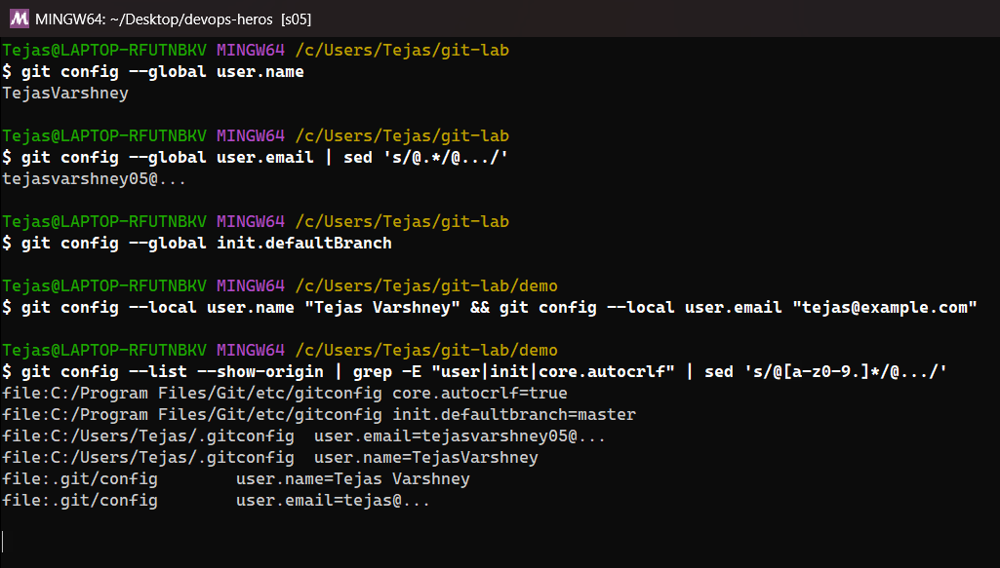


---

## 2. Repository Initialization & Cloning

Create a new local Git repository or copy an existing project from GitHub.

```bash
git init
git clone https://github.com/username/repository-name.git
git clone https://github.com/username/repository-name.git my-project
```

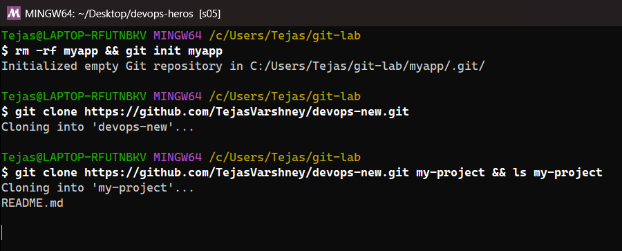


---

## 3. Staging & Committing Changes

Track changes, stage modified files, and record snapshots with meaningful commit messages.

```bash
git status
git add index.html
git add .
git commit -m "feat: add initial project structure and README"
git commit -am "fix: resolve navigation bar alignment issue"
```

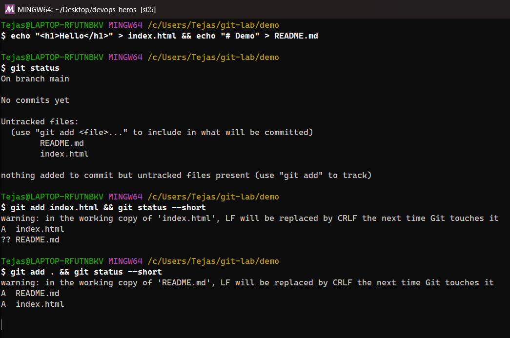
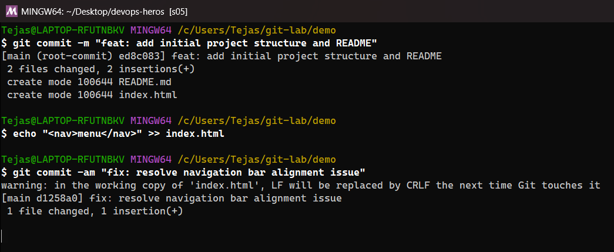


---

## 4. Inspecting History & Differences

View commit history and inspect specific modifications between commits or working files.

```bash
git log
git log --oneline --graph --decorate
git log -n 5
git diff
git diff --staged
```

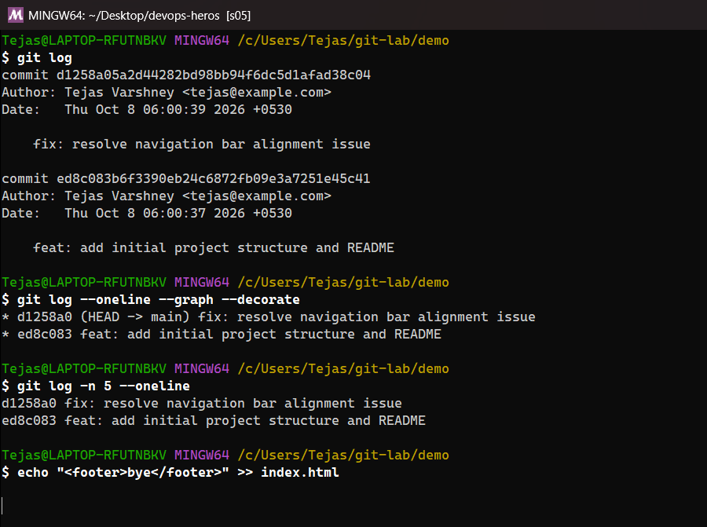
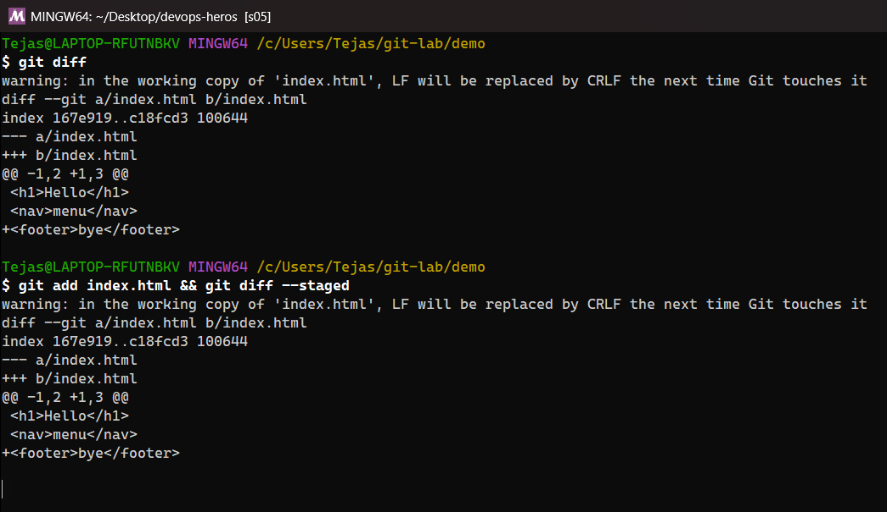


---

## 5. Branching & Merging

Isolate feature development using branches and integrate changes back into the main branch.

```bash
git branch
git branch feature/login-page
git checkout feature/login-page
git checkout -b feature/user-profile
git checkout main
git merge feature/user-profile
git branch -d feature/user-profile
```

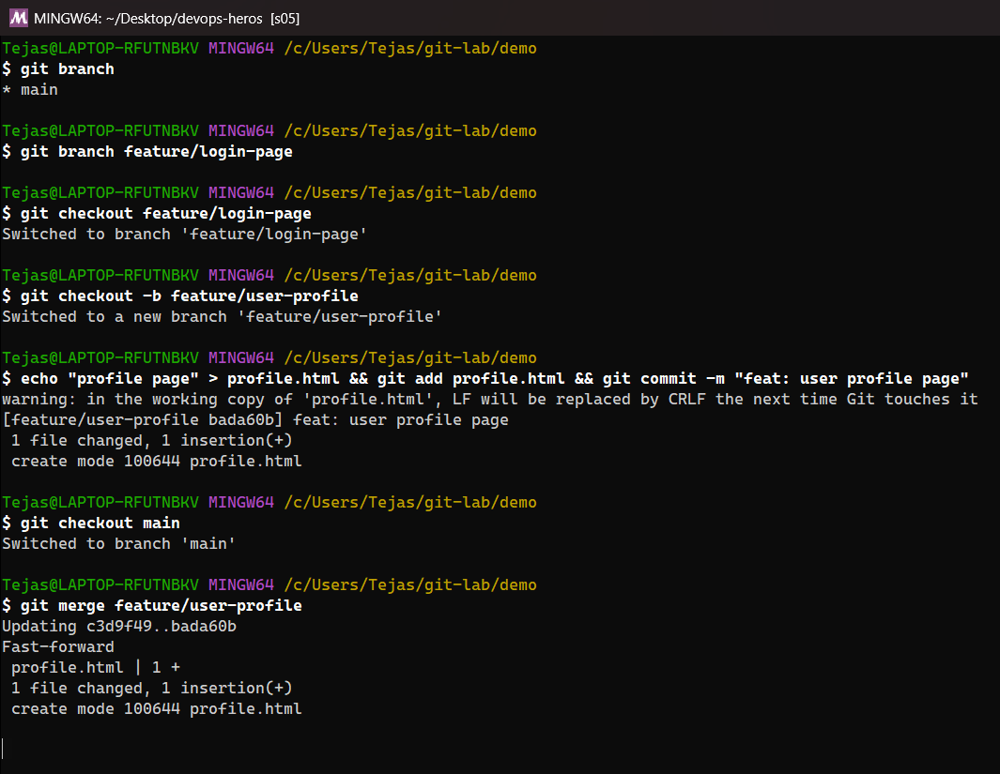
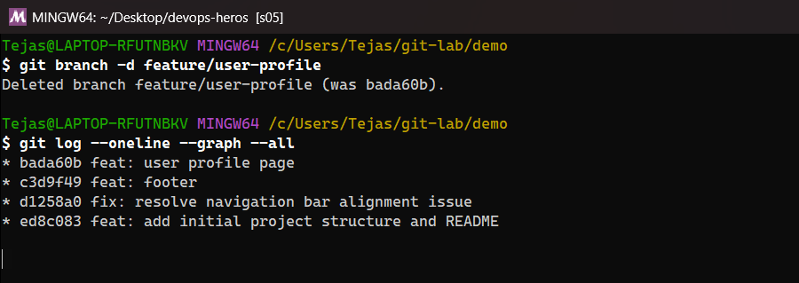


---

## 6. Remote Management & GitHub Sync

Connect local repositories to GitHub and push/pull code updates.

```bash
git remote -v
git remote add origin https://github.com/username/repository-name.git
git push -u origin main
git push
git fetch origin
git pull origin main
```

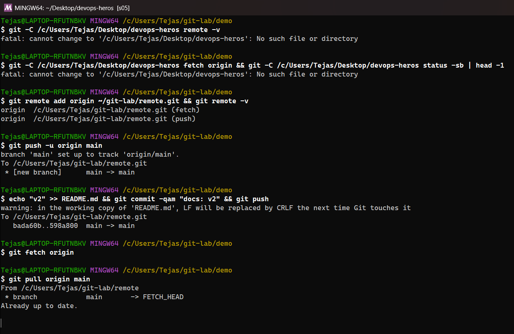


---

## 7. Undoing & Discarding Changes

Safely revert modifications, unstage files, or reset working trees.

```bash
git restore --staged filename.txt
git restore filename.txt
git revert <commit-hash>
git reset --soft HEAD~1
git reset --hard HEAD~1
```

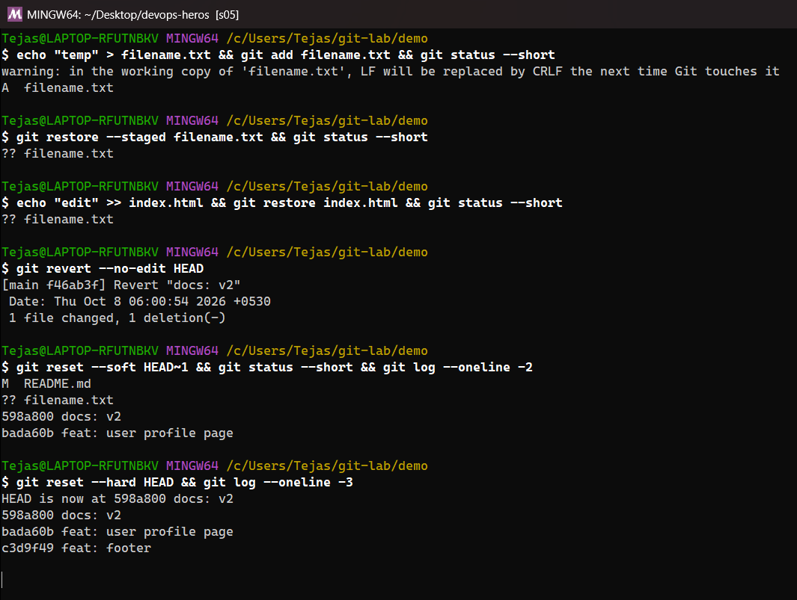
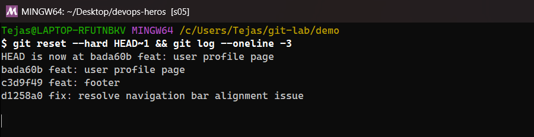


---

## 8. Stashing & Cherry-Picking

Temporarily shelve uncommitted work or apply specific commits from another branch.

```bash
git stash save "WIP: login form integration"
git stash list
git stash apply
git stash pop
git cherry-pick <commit-hash>
```

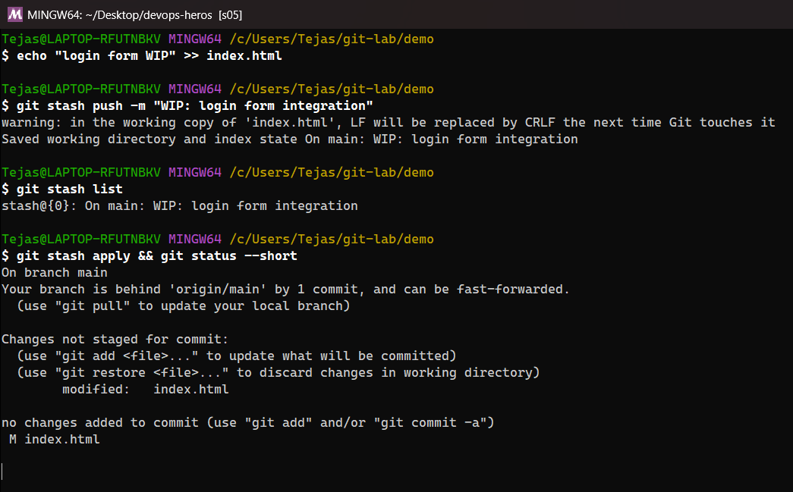
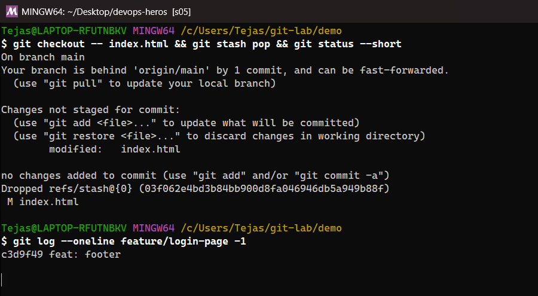


---

## 9. GitHub Workflow & Pull Requests

Standard collaboration workflow for team development on GitHub:

1. **Fork / Clone**: Clone or fork the target repository.
2. **Create Branch**: Create a descriptive feature branch (`git checkout -b feature/awesome-feature`).
3. **Commit Changes**: Make local edits and commit (`git commit -m "feat: add awesome feature"`).
4. **Push Branch**: Push branch to GitHub (`git push -u origin feature/awesome-feature`).
5. **Open Pull Request (PR)**: Navigate to GitHub UI, open a PR against `main`, request review, and merge after checks pass.

---

## 10. Homework Tasks

### Task 1: git commit -a -m vs git commit -m

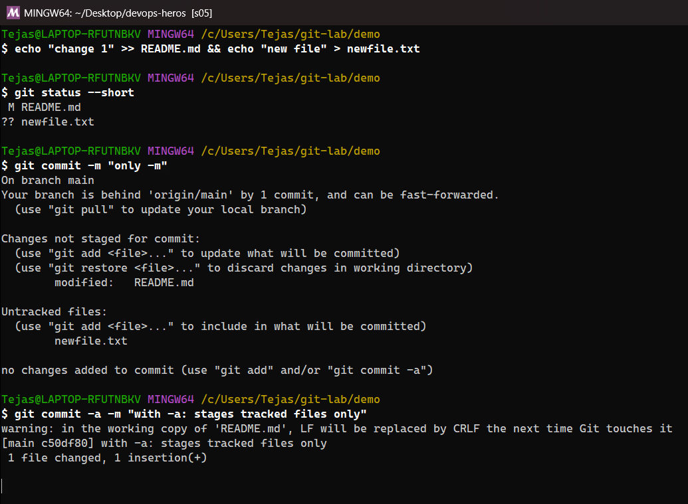
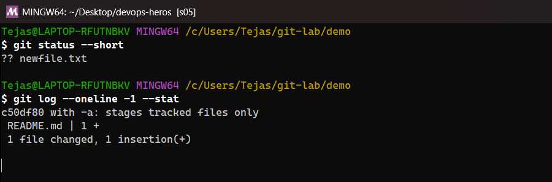


| | `git commit -m "msg"` | `git commit -a -m "msg"` |
|---|---|---|
| What gets committed | Only what is already **staged** (`git add`) | Automatically stages **all modified and deleted tracked files**, then commits |
| New (untracked) files | Not included | **Still not included**: `-a` never adds untracked files |
| When to use | Normal workflow, precise commits | Quick commits of edits to files Git already knows about |

In the demo I changed the tracked `README.md` and created an untracked `newfile.txt`. `git commit -m` committed **nothing** ("no changes added to commit") because nothing was staged. `git commit -a -m` committed `README.md` but left `newfile.txt` untracked (`?? newfile.txt`).

### Task 2: Git Cherry-Pick

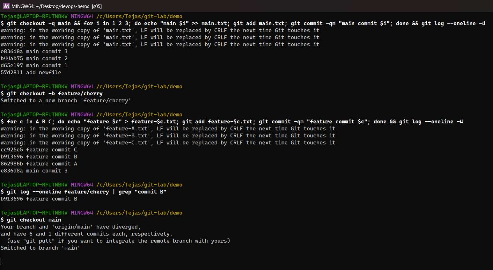
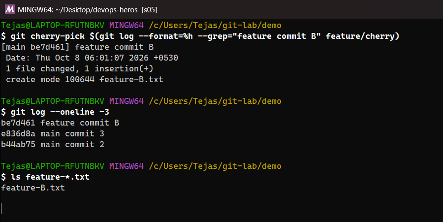


`git cherry-pick <hash>` applies the changes of **one specific commit** from another branch on top of the current branch, as a new commit with a new hash.

Steps I did: 3 commits on `main` → created `feature/cherry` → 3 commits there (A, B, C) → found commit **B** with `git log` → `git checkout main` → `git cherry-pick <hash of B>`. `main` now has `feature commit B` (and `feature-B.txt`) but **not** A or C.
