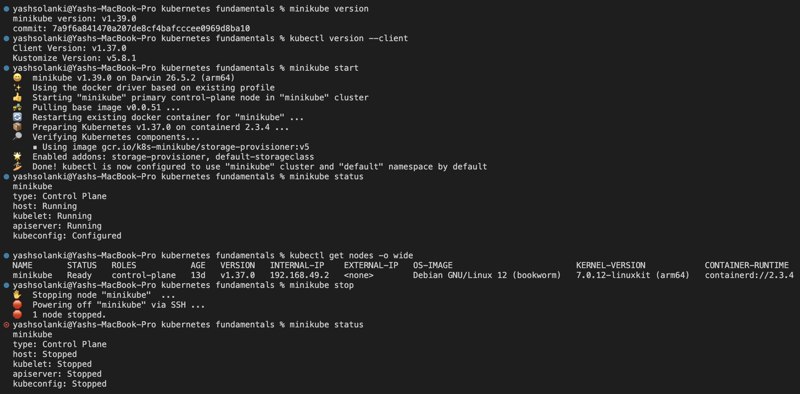

# Kubernetes Fundamentals

**Author:** Yash Solanki  
**Roll Number:** 24BCS10291

## Kubernetes Cluster Architecture Summary

### 1. Control Plane Components (Master Node)
* **`kube-apiserver`**: The central HTTP/REST gateway that authenticates, validates, and routes all cluster administrative queries and control traffic.
* **`etcd`**: Consistent, distributed key-value store persisting the entire declarative cluster state, configurations, and object metadata.
* **`kube-scheduler`**: Detects newly created, unscheduled pods and assigns them to the most eligible node based on capacity, constraints, and affinity rules.
* **`kube-controller-manager`**: Runs continuous control loops (e.g., Node, ReplicaSet) to ensure actual system state matches desired state.

### 2. Worker Node Components (Data Plane)
* **`kubelet`**: Node-level agent responsible for communicating with `kube-apiserver`, directing the container runtime to launch workloads, and reporting node health.
* **`kube-proxy`**: Network proxy managing routing and host-level packet filtering (`iptables`/`IPVS`) to load-balance traffic across Service endpoints.
* **Container Runtime Interface (CRI)**: Underlying software (e.g., `containerd`) responsible for pulling images, isolating namespaces, and executing containers.
* **Pod**: The atomic, smallest schedulable deployment unit in Kubernetes, grouping one or more co-located containers with shared storage and network namespaces.