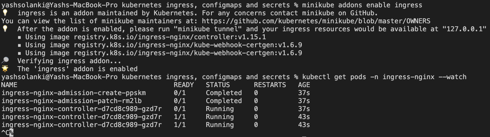
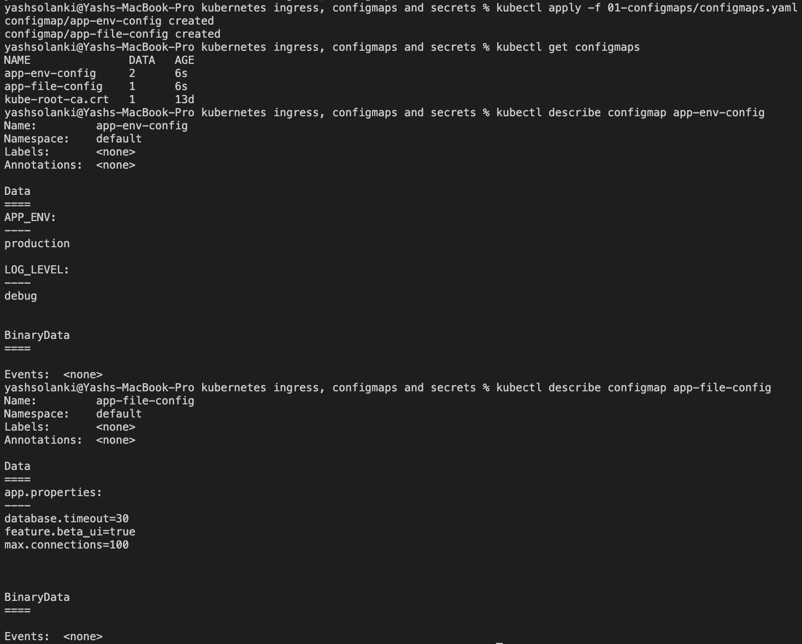
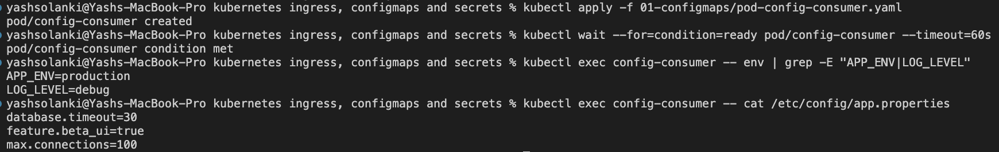
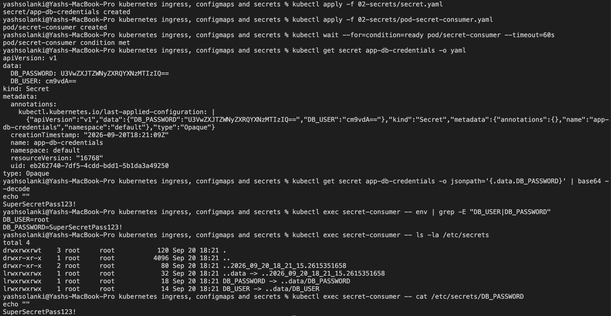
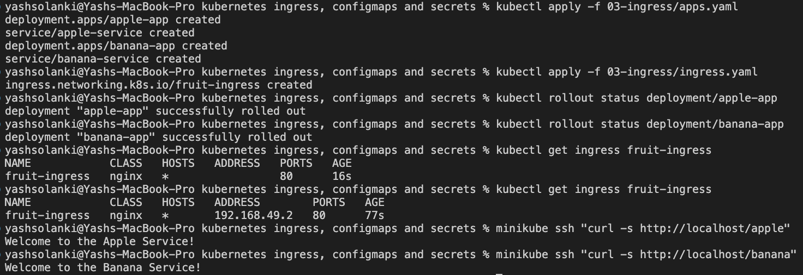
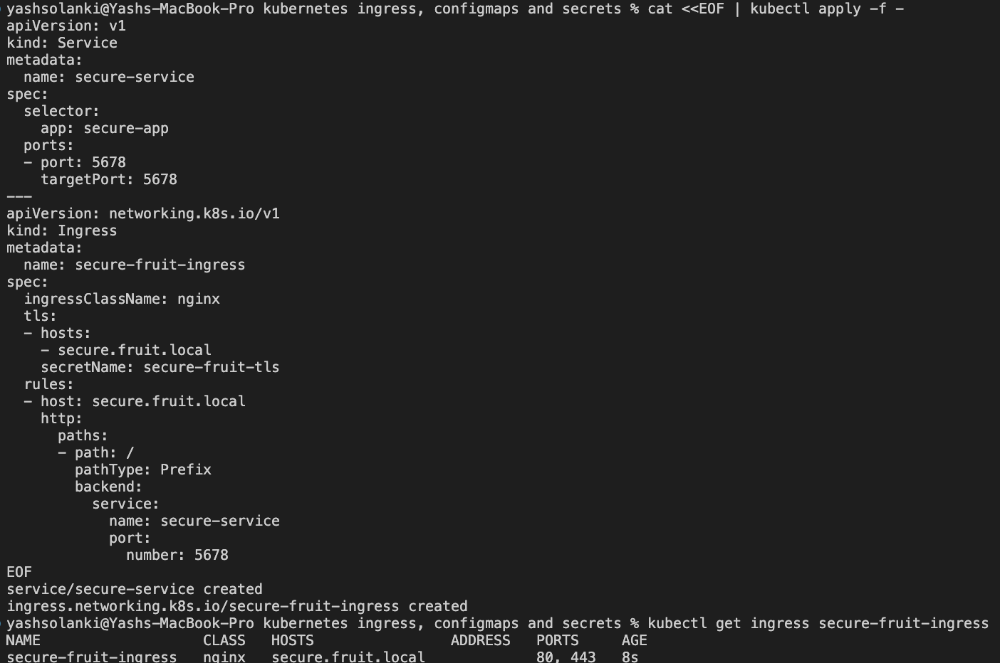
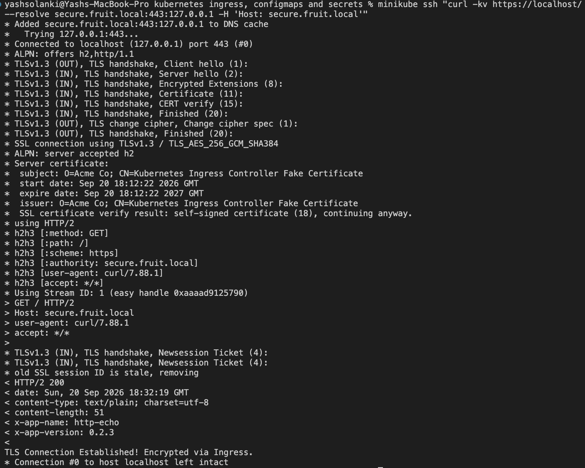

# Kubernetes Ingress, ConfigMaps, and Secrets Architecture

**Author:** Yash Solanki  
**Roll Number:** 24BCS10291 

---

## Lab Execution & Verification Screenshots



 

 

 

 

 



---

## Architecture Deep Dive & Theoretical Analysis

### 1. Configuration Decoupling: ConfigMaps vs. Secrets

Kubernetes separates configuration state from container images to fulfill the **Twelve-Factor App** methodology:

| Feature Dimension | ConfigMap (`v1.ConfigMap`) | Secret (`v1.Secret`) |
| :--- | :--- | :--- |
| **Data Types Supported** | UTF-8 text strings, configuration files, environment literals. | Arbitrary binary data, credentials, private keys, certificates. |
| **Storage Mechanism** | Standard plaintext keys in `data` or `binaryData`. | Base64-encoded strings in `data`, unencoded text via `stringData`. |
| **Storage Medium (Mounted)** | Standard node disk backing the pod volume. | Backed by `tmpfs` (RAM-only volatile filesystem on the node). |
| **Default etcd Security** | Stored unencrypted in cluster etcd store. | Plaintext Base64 unless KMS / encryption-at-rest is enabled. |
| **Primary Use Cases** | `nginx.conf`, app flags, database connection strings, timeouts. | Passwords, API tokens, SSH keys, TLS certificates (`kubernetes.io/tls`). |

---

### 2. Secret Consumption Mechanisms & Security Trade-Offs

When exposing sensitive credentials to a Pod, Kubernetes provides two primary vectors:

```text
               ┌───────────────────────────┐
               │    Kubernetes Secret      │
               └─────────────┬─────────────┘
                             │
              ┌──────────────┴──────────────┐
              ▼                             ▼
   [ Environment Variable ]        [ Volume Mount (tmpfs) ]
   - Static at container start     - In-memory filesystem
   - Leaks via crash logs/dumps   - Dynamic atomic symlink updates
   - Visible via `/proc/<pid>/environ` - Granular POSIX file permissions

```

1. **Environment Variables (`env.valueFrom.secretKeyRef`):**
* *Strengths:* Direct integration with twelve-factor applications expecting environment variables.
* *Vulnerabilities:* Process memory inspection via `/proc/$PID/environ`, crash telemetry dumps, child process inheritance, and container inspection (`crictl inspect`) can expose raw credentials. Values do not update dynamically if the underlying Secret changes.


2. **Mounted Volumes (`spec.volumes[*].secret`):**
* *Strengths:* Values are mounted onto a node-local `tmpfs` RAM disk (never written to physical disk). Kubernetes manages dynamic updates via symlink swapping without requiring pod restarts. File permissions can be restricted using `defaultMode` (e.g., `0400`).
* *Best Practice:* Production workloads should preferentially use volume-mounted secrets or external secret stores (e.g., HashiCorp Vault, AWS Secrets Manager via Secrets Store CSI Driver).


---

### Routing: Ingress Controller vs. Layer 4 Services

While `NodePort` and `LoadBalancer` operate primarily at Layer 4 (TCP/UDP transport layer), an **Ingress** operates at Layer 7 (Application layer):

| Routing Capability | Layer 4 Service (`NodePort` / `LoadBalancer`) | Layer 7 Ingress Controller (NGINX / Traefik) |
| --- | --- | --- |
| **OSI Operating Layer** | Layer 4 (TCP / UDP) | Layer 7 (HTTP / HTTPS / gRPC / WebSockets) |
| **Routing Decision** | Destination IP and Port. | Host headers (`foo.domain.com`), URL paths (`/api/v1`), HTTP headers. |
| **Load Balancer Ratio** | Typically 1 Public Cloud Load Balancer per Service. | 1 Cloud Load Balancer fronting an entire cluster of microservices. |
| **SSL/TLS Handling** | Passthrough only (unless terminated at external LB). | Centralized TLS termination and SNI-based certificate dispatch. |
| **Traffic Transformations** | Port forwarding and translation only. | URL rewrites, rate-limiting, CORS, authentication proxies, canary weights. |

---

### Anatomy of Ingress TLS Termination

When terminating TLS at the Ingress boundary, client connections are handled cleanly:

```text
External Client
      │
      │  HTTPS (Port 443) - TLS Handshake using 'secure-fruit-tls'
      ▼
┌────────────────────────────────────────────────────────┐
│ Ingress-NGINX Controller Pod                           │
│ - Decrypts payload                                     │
│ - Evaluates Host: secure.fruit.local                   │
│ - Matches path '/'                                     │
└─────────────────────────┬──────────────────────────────┘
                          │
                          │  HTTP (Plaintext Port 5678)
                          ▼
            ┌───────────────────────────┐
            │ Backend ClusterIP Service │
            │ (secure-service:5678)     │
            └─────────────┬─────────────┘
                          │
                          ▼
                   Backend Pods

```

* **Ingress Class:** Uses `ingressClassName: nginx` to associate the routing rule with the active controller deployment.
* **Certificate Mapping:** The `tls.secretName` references a secret with `tls.crt` and `tls.key`. The Ingress Controller loads this keypair directly into its dynamic NGINX worker configurations.
* **Internal Offloading:** By terminating encryption at the Ingress perimeter, backend pods are relieved of cryptographic CPU overhead while internal service communication remains within the private cluster network.