# Kubernetes Networking, Service Types & Ingress Architecture

**Author:** Yash Solanki  
**Roll Number:** 24BCS10291 

---

## Lab Execution & Verification Screenshots

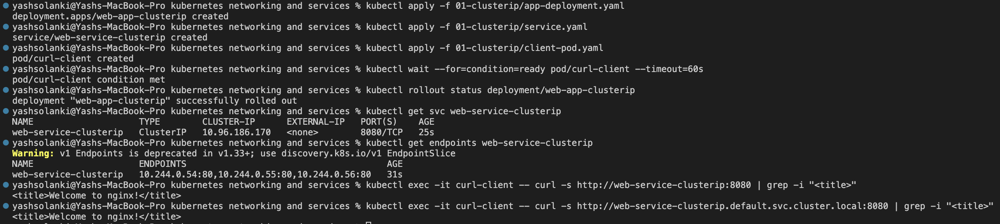 

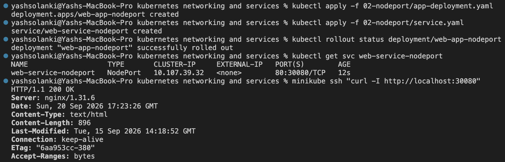 

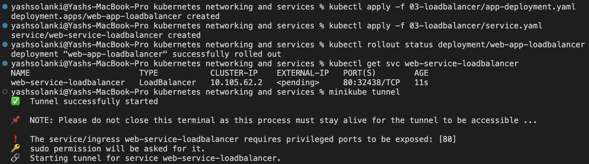 

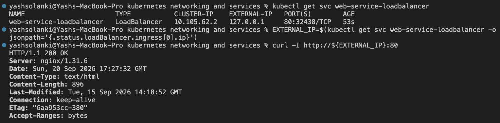 

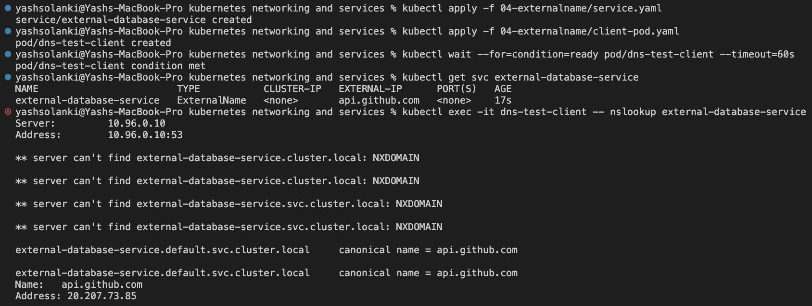 

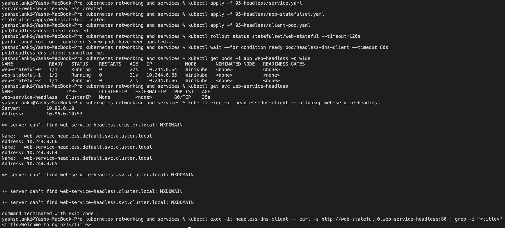 

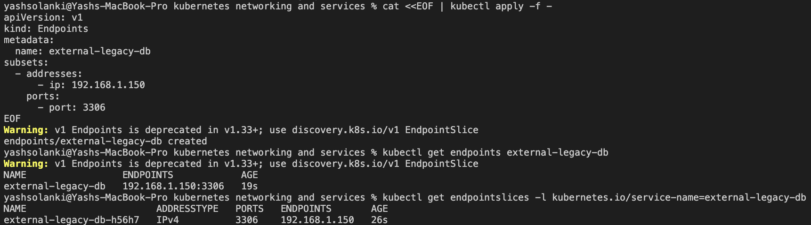 

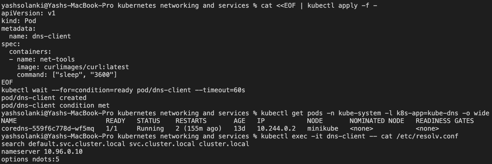 

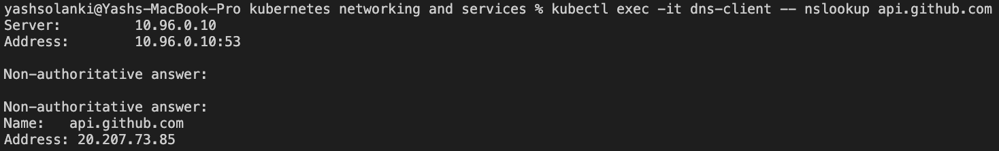

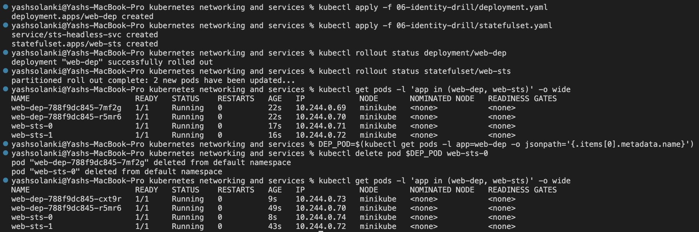 

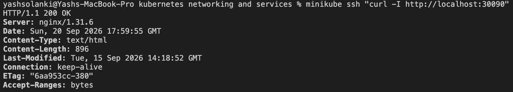 

---

## The 4 Kubernetes Ports Architecture

Understanding Kubernetes networking requires tracing traffic from external clients down to container processes:

| Port Concept | Layer & Scope | Architectural Role | Configuration Field |
| :--- | :--- | :--- | :--- |
| **`containerPort`** | Application Container | Port exposed by the application process inside the container runtime image. Primarily declarative metadata. | `Pod.spec.containers[*].ports.containerPort` |
| **`targetPort`** | Backend Pod Network | Actual port on the target Pod where traffic is dispatched by kube-proxy/endpoints. Defaults to `port` if omitted. | `Service.spec.ports[*].targetPort` |
| **`port`** | Service Virtual IP | Internal virtual IP (`ClusterIP`) port exposed within the cluster. Incoming requests to this port route to `targetPort`. | `Service.spec.ports[*].port` |
| **`nodePort`** | Worker Node Interface | High port opened across every cluster node's IP (`30000–32767`). Proxies traffic directly to the service `port`. | `Service.spec.ports[*].nodePort` |

---

## Master Controller Architectural Matrix

Kubernetes provides distinct workload controllers designed around data persistence, identity guarantees, and scheduling mechanics:

| Dimension | Deployment | StatefulSet | DaemonSet |
| :--- | :--- | :--- | :--- |
| **Primary Use Case** | Stateless web apps, APIs, microservices | Databases, distributed consensus engines (Kafka, MySQL, Cassandra) | Cluster-wide agents (log forwarders, monitoring, CNI plugins) |
| **Pod Identity** | Ephemeral, non-deterministic random hash (`web-dep-7b94...`) | Deterministic ordinal index (`web-sts-0`, `web-sts-1`) | Node-bound instance naming (`daemon-worker1`) |
| **Storage Semantics** | Shared ephemeral storage or shared volumes | Dedicated `PersistentVolumeClaimTemplate` per replica | Host-path mounted storage (`hostPath`) |
| **Network Identity** | Uniform virtual IP via ClusterIP | Stable network identity via Headless Service direct FQDN | Host network or standard node IP mapping |
| **Scaling Order** | Simultaneous parallel create / terminate | Strict ordered provisioning (`0 -> N`) and reverse teardown | Tied directly to node join/leave lifecycle |

---

## Production Cost Optimization & Service Selection Decision Tree

### Service Selection Decision Tree

```text
                                  [ Incoming Traffic Need ]
                                              │
                    ┌─────────────────────────┴─────────────────────────┐
             [ Internal Only ]                                   [ External Traffic ]
                    │                                                   │
          ┌─────────┴─────────┐                               ┌─────────┴─────────┐
    [ Single VIP ]     [ Direct Pod IPs ]             [ Low-Cost / Dev ]    [ High Volume Web ]
          │                   │                               │                     │
     ClusterIP         Headless Service                    NodePort          Ingress Controller
  (Default Service)  (clusterIP: None)               (Port 30000-32767)      (Single LB + Routing)

```

### Cost Optimization Analysis

1. **Cloud LoadBalancer Proliferation:** Deploying individual `type: LoadBalancer` services across 20 microservices provisions 20 independent cloud provider load balancers (AWS NLB/ALB, GCP Cloud LB), leading to substantial unneeded cloud expenditure (~$18–$25/month per LB base cost plus data processing fees).
2. **Ingress Aggregation Pattern:** A production cluster should route traffic through a single Ingress Controller (e.g., Ingress-NGINX or Traefik) fronted by **one** Cloud LoadBalancer. The Ingress routes traffic internally using host-based and path-based routing rules directly to internal `ClusterIP` services, reducing cloud network infrastructure costs by up to 95%.