# Kubernetes Core Objects, Controllers & Deployment Strategies

**Author:** Yash Solanki  
**Roll Number:** 24BCS10291 

---

## Lab Execution & Verification Screenshots

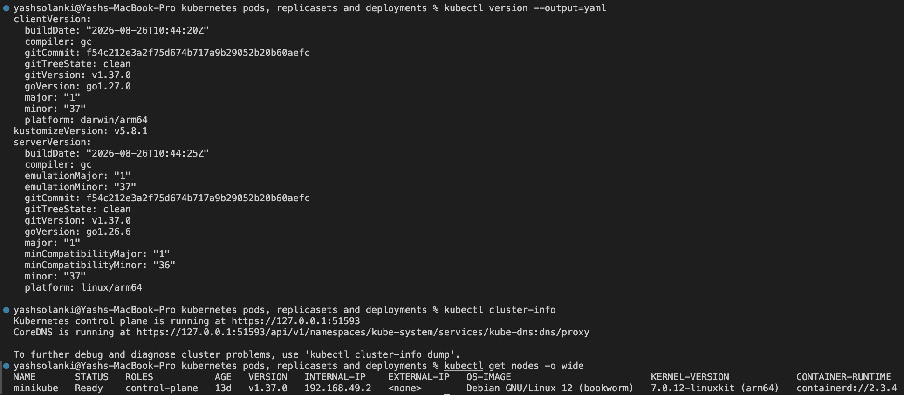 

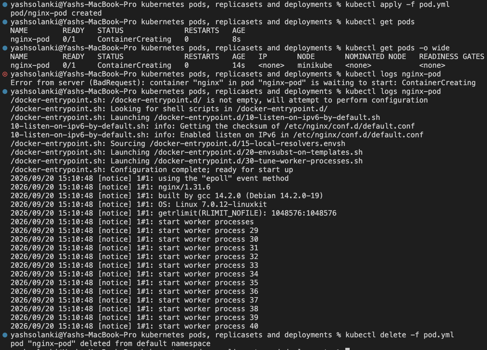 

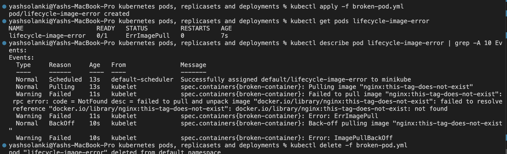 

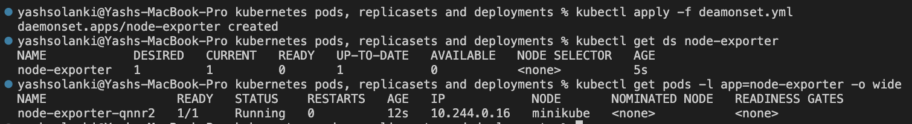 

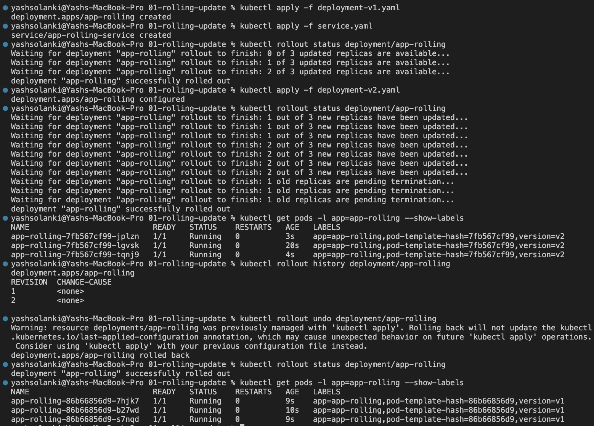 

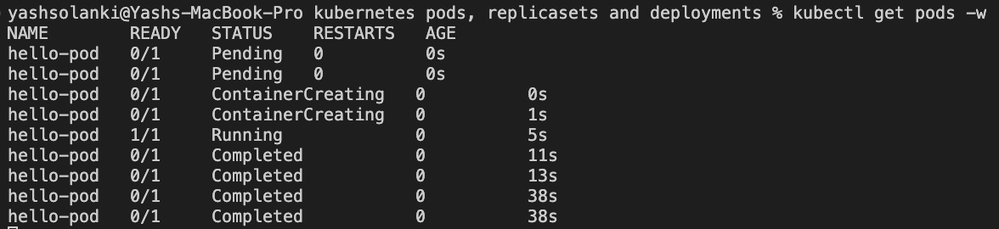 

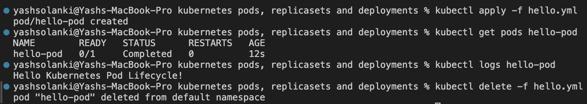 

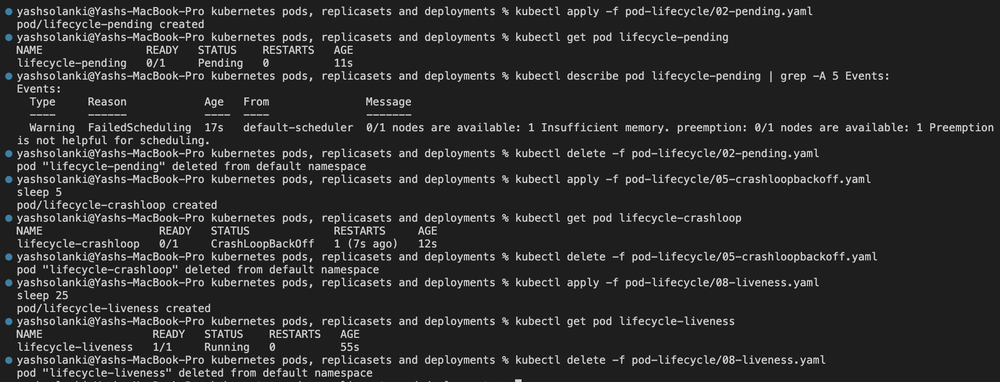 

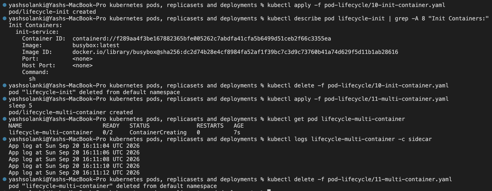 

 

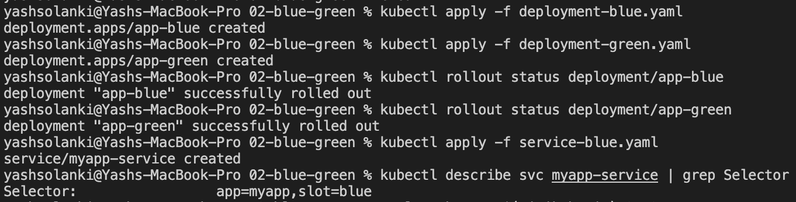 

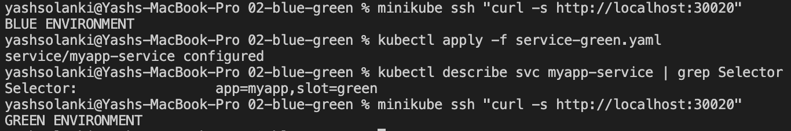 

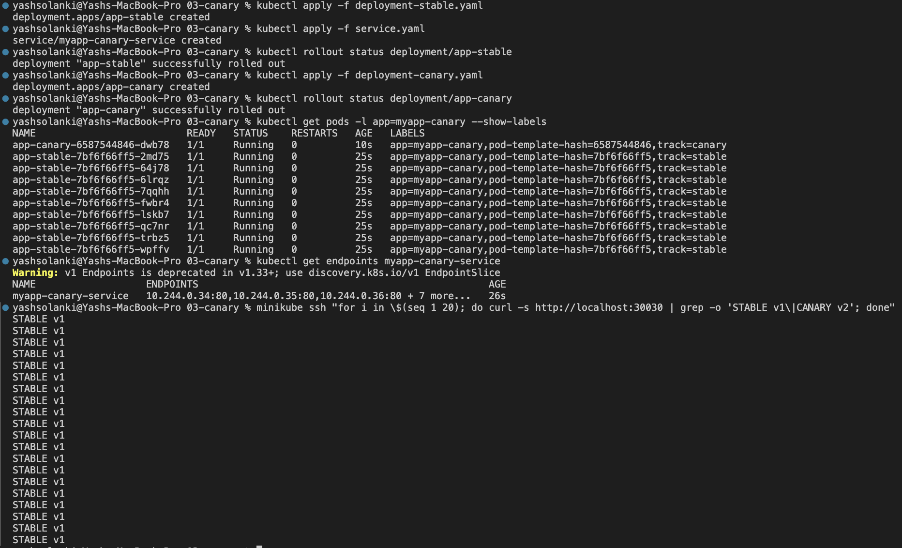 

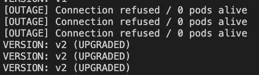 

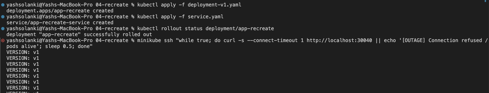 

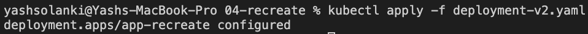

---

## Theoretical & Architectural Conceptual Writeup

### 1. The 4 Kubernetes Ports
* **`containerPort`**: The internal port opened inside the container image process (declarative metadata in PodSpec).
* **`targetPort`**: The actual port on the backend Pod to which incoming traffic from the Service is routed.
* **`port`**: The internal cluster port exposed by the Service virtual IP (`ClusterIP`).
* **`nodePort`**: The static high port (`30000–32767`) exposed across every cluster node's external IP.

### 2. Labels vs. Selectors
* **Labels**: Key-value metadata tags attached to Kubernetes objects (e.g., `app: nginx`, `env: prod`) for grouping and identity.
* **Selectors**: Filter queries declared in Controllers and Services to identify, match, and route to corresponding labelled pods.

### 3. The 4 Deployment Strategies
* **RollingUpdate**: Gradually replaces v1 pods with v2 pods without incurring application downtime.
* **Recreate**: Kills all v1 pods before creating any v2 pods; incurs a deliberate downtime window but avoids mixed-version execution.
* **Blue-Green**: Runs two identical production environments simultaneously (Blue=Live, Green=New); cutover occurs instantaneously by updating the Service selector. Requires 2x compute capacity.
* **Canary**: Directs a small fraction of real user traffic (e.g., 10%) to a v2 subset alongside v1 pods to test performance and error rates prior to full rollout.

### 4. `maxSurge` vs. `maxUnavailable` Math
For `replicas: 4`, `maxSurge: 1`, `maxUnavailable: 0`:
* **Maximum Allowed Pods During Rollout:** $4 + 1 = 5$ pods.
* **Minimum Available Pods During Rollout:** $4 - 0 = 4$ pods (ensures 100% serving capacity throughout the deployment).

### 5. Resource Requests vs. Limits & Binary Units
* **Requests**: Guaranteed baseline resources allocated by the scheduler to place the Pod onto a worker node.
* **Limits**: Hard upper bounds enforced via Linux cgroups. Exceeding CPU triggers CPU throttling; exceeding memory limits results in Out-Of-Memory (OOM) termination.
* **Units**: Decimal (1 GB = $10^9$ bytes) vs Binary (1 GiB = $2^{30} = 1,073,741,824$ bytes). Kubernetes resource specifications rely on binary mebibytes (`Mi`) and gibibytes (`Gi`).