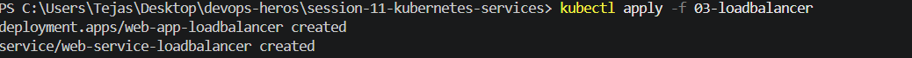
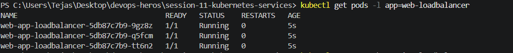
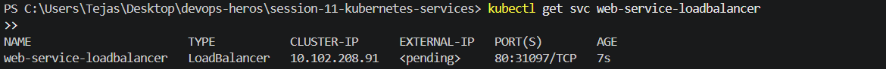
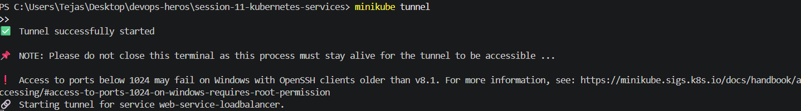
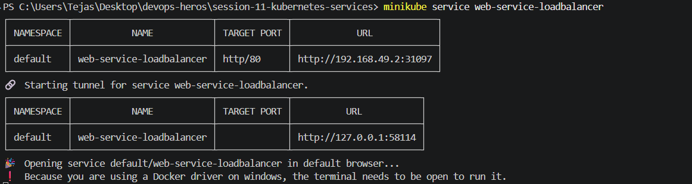
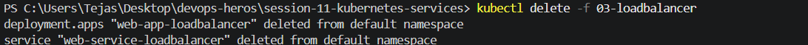

kubectl apply -d 03-loadbalancer

kubectl get pods -l app=web-loadbalancer

kubectl get svc web-service-loadbalancer

minikube tunnel

In browser, https://localhost
minikube service web-service-loadbalancer

minikube service web-service-loadbalancer

kubectl delete -f 03-loadbalancer
