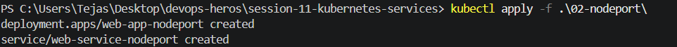
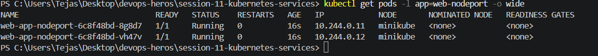
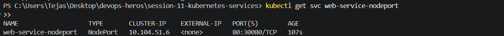
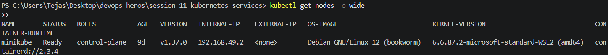
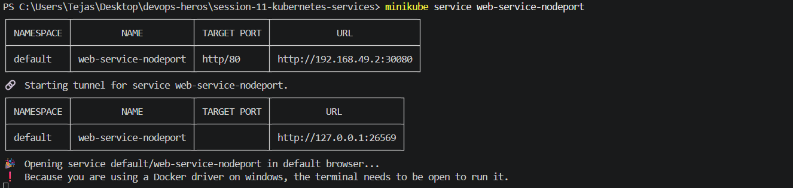
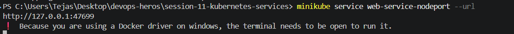
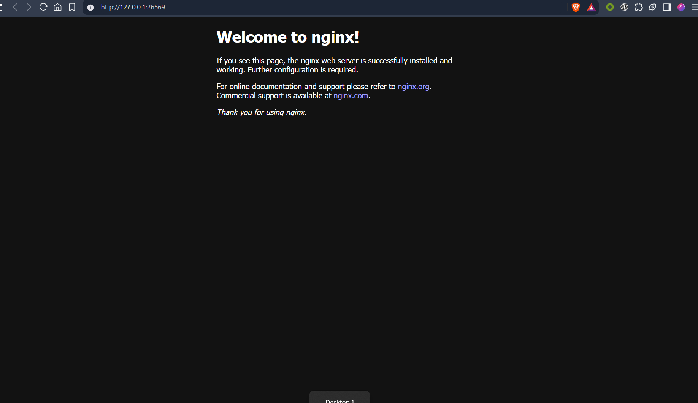
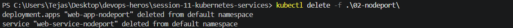

kubectl apply -f .\02-nodeport\

kubectl get pods -l app=web-nodeport -o wide

kubectl get svc web-service-nodeport

kubectl get nodes -o wide

minikube service web-service-nodeport

kubectl delete -f .\02-nodeport\
