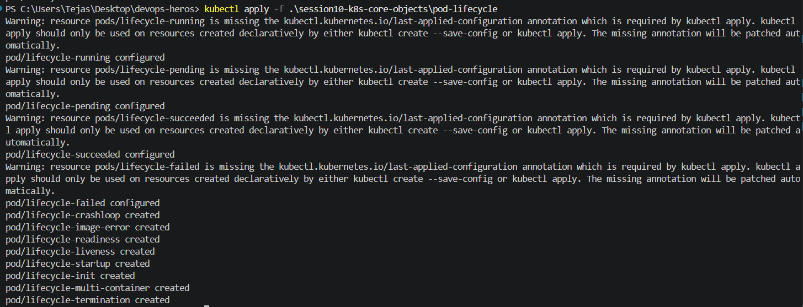
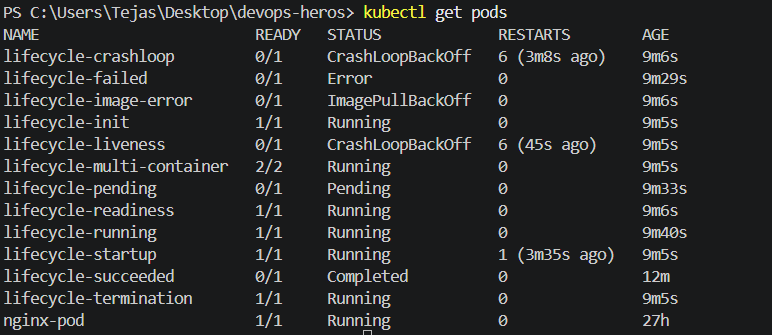
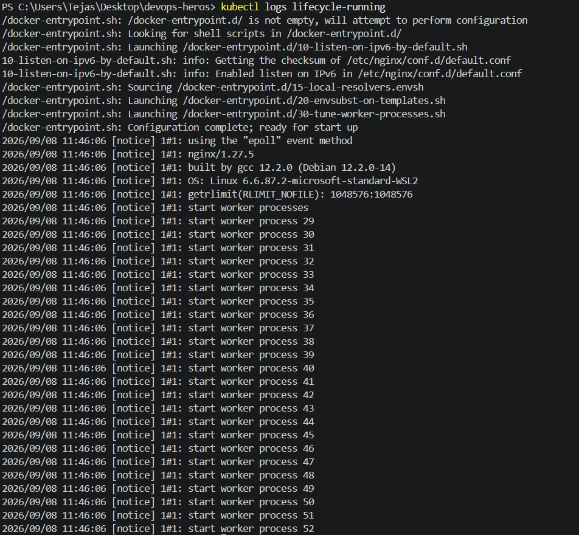
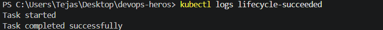
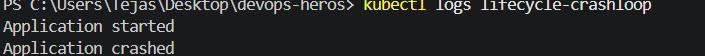
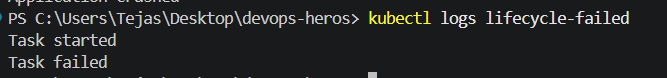
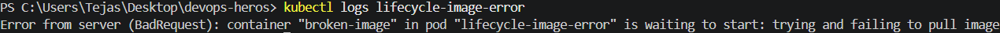
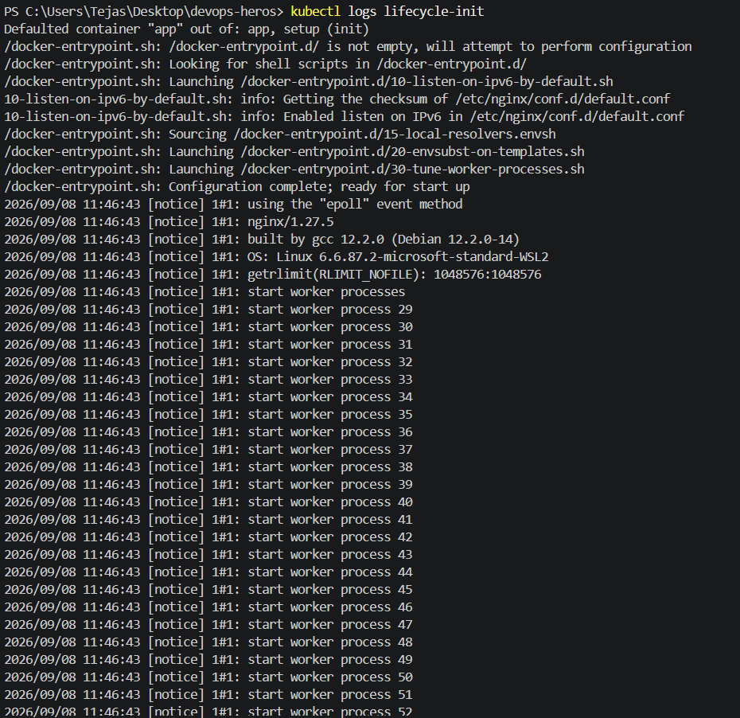
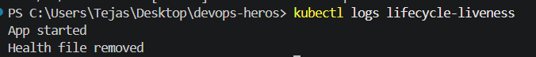
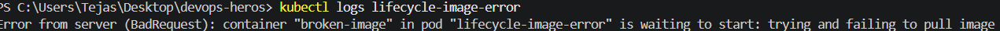

POD LIFECYCLE
created all pods in session10/pod-lifecycle
Used command kubectl apply -f session10/pod-lifecycle

kubectl get pods 

Logs of each pods

kubectl logs lifecycle-running 

kubectl logs lifecycle-pending

kubectl logs lifecycle-succeeded

kubectl logs lifecycle-crashloop

kubectl logs lifecycle-failed

kubectl logs lifecycle-image-error

kubectl logs lifecycle-init

kubectl logs lifecycle-liveness

kubectl logs lifecycle-image-error

