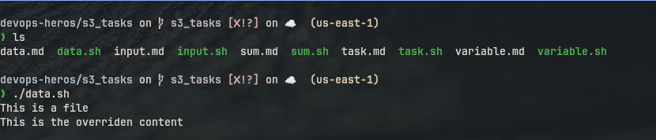
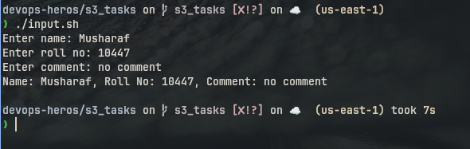
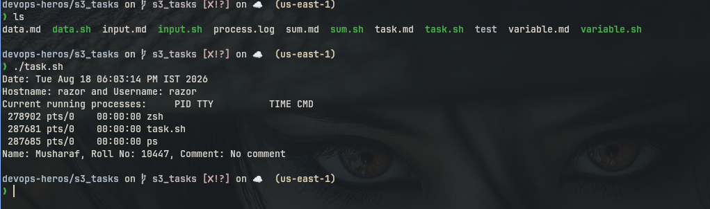
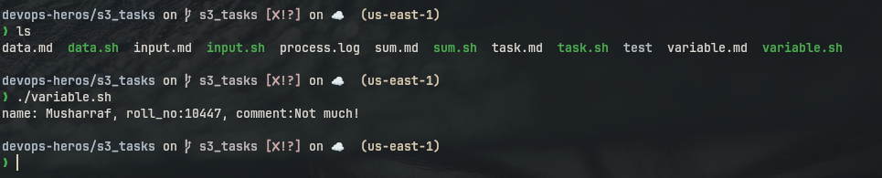

# S3 Tasks

---

## 1. data.sh

### Code

```bash
#!/bin/sh

mkdir test
cd test
touch file.txt
echo "This is a file" > file
cat file
echo "This is the overriden content" > file
cat file
```

### Output

```
This is a file
This is the overriden content
```

### Screenshot



---

## 2. input.sh

### Code

```bash
#!/bin/sh

read -p "Enter name: " name
read -p "Enter roll no: " roll_no
read -p "Enter comment: " commet

echo "Name: ${name}, Roll No: ${roll_no}, Comment: ${commet}"
```

### Output

```
Enter name: Musharaf
Enter roll no: 10447
Enter comment: no comment
Name: Musharaf, Roll No: 10447, Comment: no comment
```

### Screenshot



---

## 3. sum.sh

### Code

```bash
#!/bin/sh

read -p "Enter a number: " no
sum=0
for ((i = 0; i <= no; i++)); do
    sum=$((sum + $i))
done

echo $sum
```

### Output

```
Enter a number: 354
62835
```

### Screenshot


---

## 4. task.sh

### Code

```bash
#!/bin/sh

echo "Date: $(date)"
echo "Hostname: $(hostname) and Username: $(whoami)"

echo "Current running processes: $(ps)"
ps > process.log

echo "Name: Musharaf, Roll No: 10447, Comment: No comment"
```

### Output

```
Date: Tue Aug 18 06:03:14 PM IST 2026
Hostname: razor and Username: razor
Current running processes:    PID TTY          TIME CMD
 278902 pts/0    00:00:00 zsh
 287681 pts/0    00:00:00 task.sh
 287685 pts/0    00:00:00 ps
Name: Musharaf, Roll No: 10447, Comment: No comment
```

### Screenshot



---

## 5. variable.sh

### Code

```bash
#!/bin/sh

name="Musharraf"
roll_no="10447"
comment="Not much!"

echo "name: ${name}, roll_no:${roll_no}, comment:${comment}"
```

### Output

```
name: Musharraf, roll_no:10447, comment:Not much!
```

### Screenshot


