**Session:** 11 - Kubernetes Services

### Task 1: ClusterIP Service — Internal Microservice Communication

- **Description:** Deploy a backend web application and expose it internally using a ClusterIP Service.

- **Commands to Run:**
    
    ```bash
    kubectl apply -f 01-clusterip/app-deployment.yaml
    kubectl get pods -l app=web-clusterip -o wide
    kubectl apply -f 01-clusterip/service.yaml
    kubectl get svc web-service-clusterip
    kubectl get endpoints web-service-clusterip
    kubectl apply -f 01-clusterip/client-pod.yaml
    kubectl get pod curl-client
    kubectl exec -it curl-client -- curl -s http://web-service-clusterip:8080
    kubectl exec -it curl-client -- curl -s http://10.96.150.45:8080
    kubectl exec -it curl-client -- curl -s http://web-service-clusterip.default.svc.cluster.local:8080
    kubectl port-forward svc/web-service-clusterip 8080:8080
    ```
    
- **Output:**
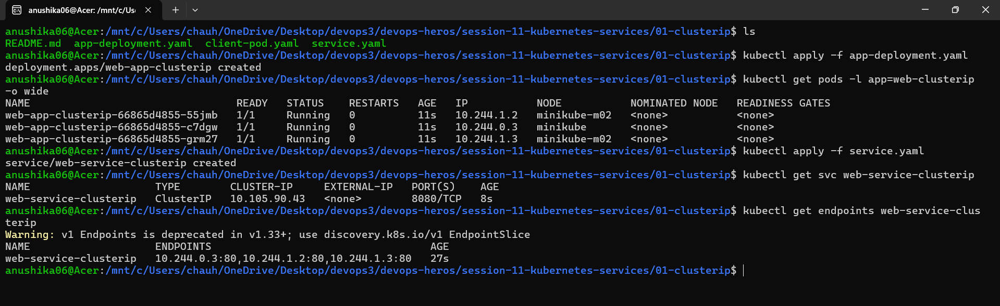
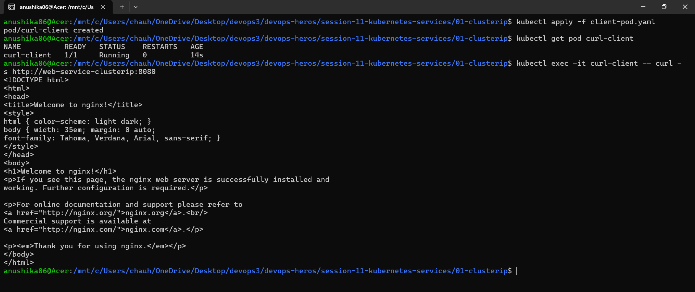

---

### Task 2: NodePort Service — External Host-Level Cluster Access

- **Description:** Expose a web application directly on the worker node's IP using a NodePort Service.

- **Commands to Run:**
    
    ```bash
    kubectl apply -f 02-nodeport/app-deployment.yaml
    kubectl get pods -l app=web-nodeport -o wide
    kubectl apply -f 02-nodeport/service.yaml
    kubectl get svc web-service-nodeport
    kubectl get nodes -o wide
    curl http://localhost:30080
    curl http://$(minikube ip):30080
    minikube service web-service-nodeport
    minikube service web-service-nodeport --url
    ```
    
- **Output:**
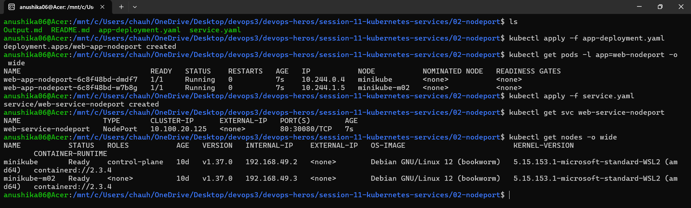
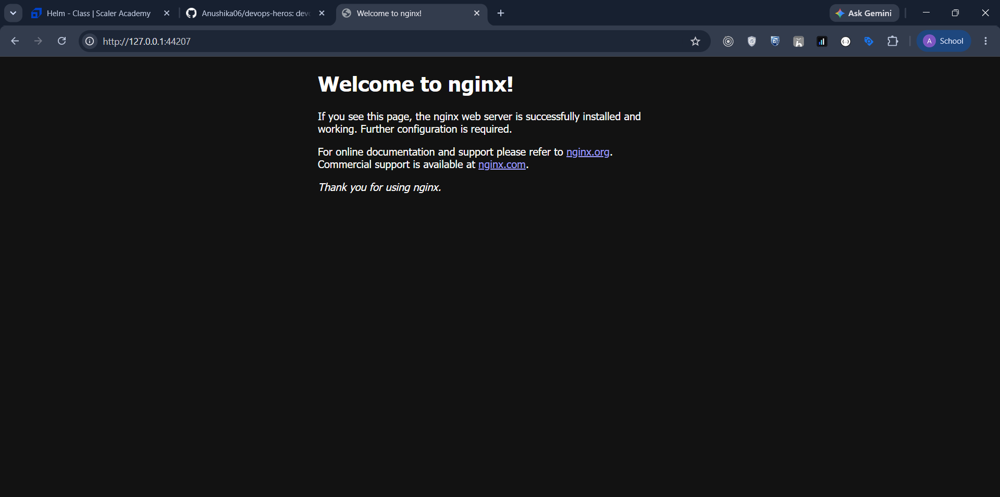
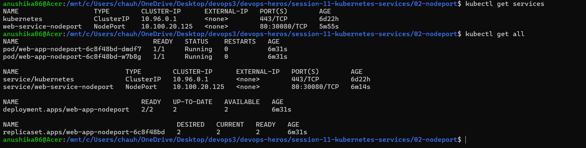

---

### Task 3: LoadBalancer Service — Production Public Cloud Ingress

- **Description:** Expose an application to the public internet using a cloud-managed LoadBalancer Service.

- **Commands to Run:**
    
    ```bash
    kubectl apply -f 03-loadbalancer/app-deployment.yaml
    kubectl get pods -l app=web-loadbalancer
    kubectl apply -f 03-loadbalancer/service.yaml
    kubectl get svc web-service-loadbalancer
    minikube tunnel
    minikube service web-service-loadbalancer
    ```
    
- **Output:**
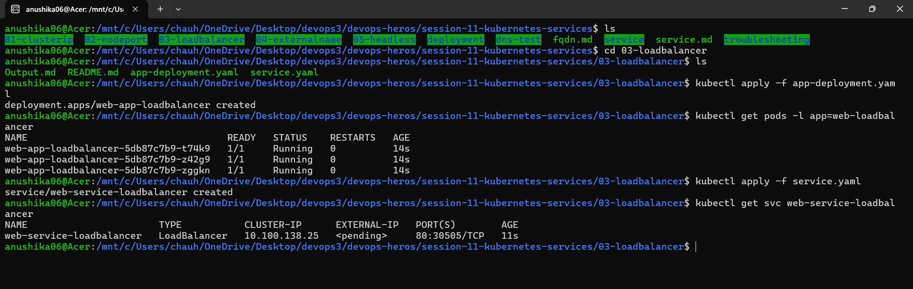
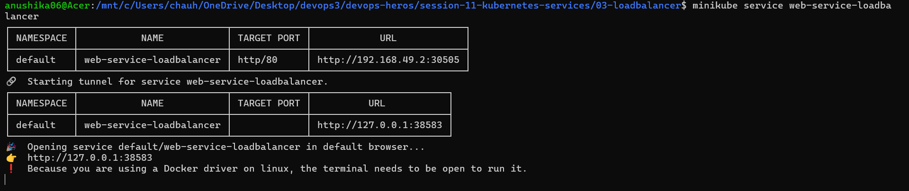
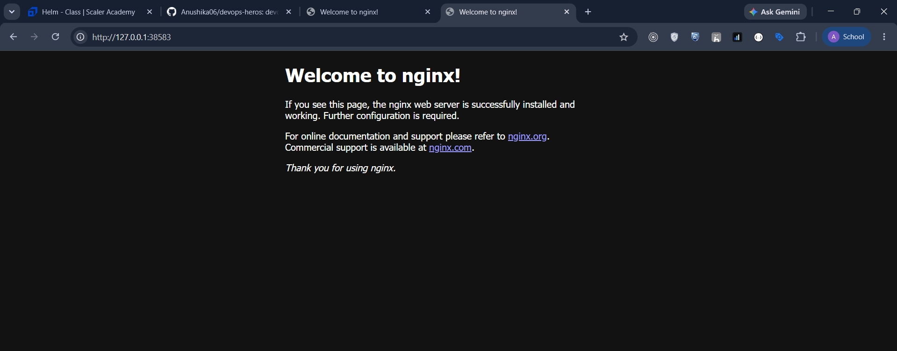

---

### Task 4: ExternalName (External DNS) Service — Bridging Outside Infrastructure

- **Description:** Create an internal DNS CNAME alias to route traffic to an external domain bypassing kube-proxy.

- **Commands to Run:**
    
    ```bash
    kubectl apply -f 04-externalname/service.yaml
    kubectl get svc external-database-service
    kubectl apply -f 04-externalname/client-pod.yaml
    kubectl get pod dns-test-client
    kubectl exec -it dns-test-client -- nslookup external-database-service
    kubectl exec -it dns-test-client -- curl -s -H "Host: api.github.com" https://external-database-service
    ```
    
- **Output:**
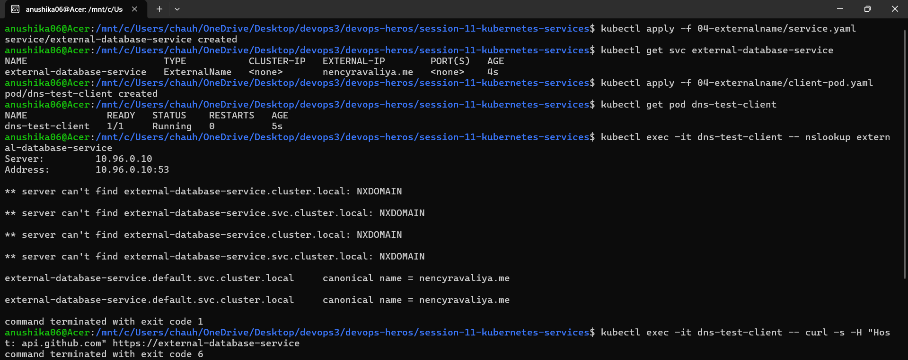

---

### Task 5: Headless Service (clusterIP: None) — Direct Pod-to-Pod Discovery

- **Description:** Deploy a headless service and stateful set to achieve direct Pod-to-Pod DNS discovery without load balancing.

- **Commands to Run:**
    
    ```bash
    kubectl apply -f 05-headless/service.yaml
    kubectl get svc web-service-headless
    kubectl apply -f 05-headless/app-statefulset.yaml
    kubectl get pods -l app=web-headless -o wide
    kubectl apply -f 05-headless/client-pod.yaml
    kubectl get pod headless-dns-client
    kubectl exec -it headless-dns-client -- nslookup web-service-headless
    kubectl exec -it headless-dns-client -- nslookup web-stateful-0.web-service-headless.default.svc.cluster.local
    kubectl exec -it headless-dns-client -- curl -s http://web-stateful-0.web-service-headless:80
    ```
    
- **Output:**
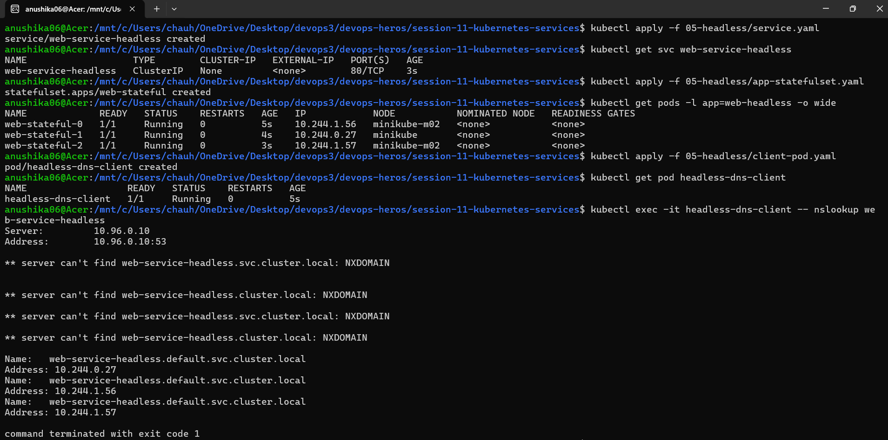
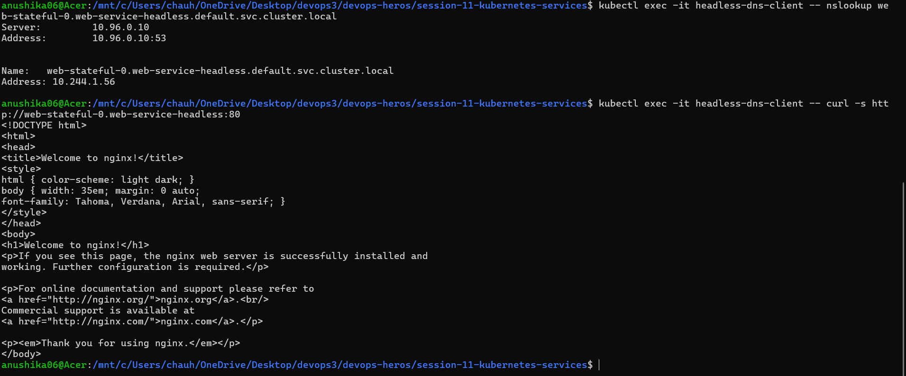
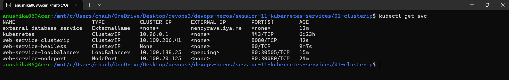
---
