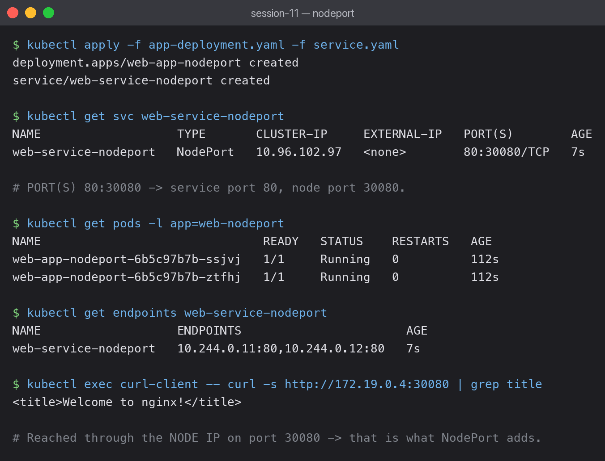

# 02 — NodePort Service

NodePort opens the **same port on every node** in the cluster and forwards it to the Service.
It is the first Service type that is reachable from outside the cluster.



## What the output shows

```bash
kubectl get svc web-service-nodeport
```

```text
NAME                   TYPE       CLUSTER-IP     EXTERNAL-IP   PORT(S)        AGE
web-service-nodeport   NodePort   10.96.102.97   <none>        80:30080/TCP   7s
```

The `PORT(S)` column reads `80:30080/TCP`:

- `80` — the Service port, used by in-cluster clients.
- `30080` — the node port, opened on every node. Must be in range 30000–32767.

A NodePort Service still gets a `CLUSTER-IP` (`10.96.102.97`). NodePort does not replace
ClusterIP — it **adds** external reachability on top of it.

## Reaching it through the node IP

```bash
kubectl exec curl-client -- curl -s http://172.19.0.4:30080 | grep title
```

```text
<title>Welcome to nginx!</title>
```

`172.19.0.4` is the node's internal IP (`kubectl get nodes -o wide`). Because my cluster's
node runs inside a container network, that address is reachable from within the cluster
network rather than from macOS directly. To open it from the host browser I used:

```bash
kubectl port-forward svc/web-service-nodeport 30080:80
```

which returned `HTTP 200` at `http://localhost:30080`.

## ClusterIP vs NodePort

| | ClusterIP | NodePort |
|---|---|---|
| Reachable from outside | No | Yes |
| Gets a cluster IP | Yes | Yes |
| Port range | Any | 30000–32767 |

## What I learned

- NodePort is a superset of ClusterIP, not an alternative to it.
- Hardcoding `nodePort: 30080` is fine for a lab, but in production you normally omit it and
  let Kubernetes allocate a free port, since a fixed port can collide across Services.
- Exposing a port on every node is why NodePort does not scale well for many services — it is
  the reason Ingress exists (session 12).
