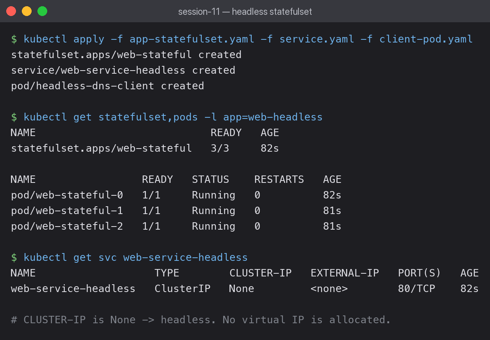
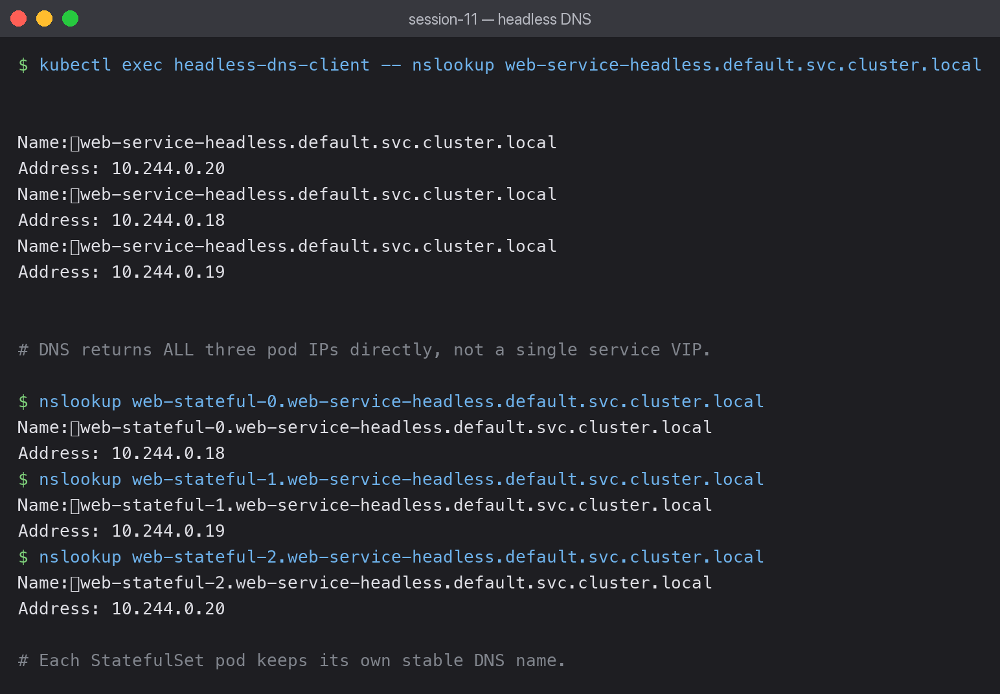

# 05 — Headless Service

A headless Service (`clusterIP: None`) does no load balancing. DNS returns the pod IPs
**directly**, so the client chooses which pod to talk to.



## clusterIP: None

```bash
kubectl get svc web-service-headless
```

```text
NAME                   TYPE        CLUSTER-IP   EXTERNAL-IP   PORT(S)   AGE
web-service-headless   ClusterIP   None         <none>        80/TCP    22s
```

`CLUSTER-IP` is literally `None` — no virtual IP is allocated, so there is nothing for
kube-proxy to balance across.

## StatefulSet gives ordered, stable pod names

```bash
kubectl get statefulset,pods -l app=web-headless
```

```text
NAME                            READY   AGE
statefulset.apps/web-stateful   3/3     22s

NAME                 READY   STATUS    RESTARTS   AGE
pod/web-stateful-0   1/1     Running   0          22s
pod/web-stateful-1   1/1     Running   0          21s
pod/web-stateful-2   1/1     Running   0          21s
```

Pods are named `-0`, `-1`, `-2` and are created in order, unlike a Deployment's random
hash suffixes. If `web-stateful-1` is deleted it comes back as `web-stateful-1`.

## DNS returns every pod IP



```bash
kubectl exec headless-dns-client -- nslookup web-service-headless.default.svc.cluster.local
```

```text
Name:	web-service-headless.default.svc.cluster.local
Address: 10.244.0.20
Name:	web-service-headless.default.svc.cluster.local
Address: 10.244.0.18
Name:	web-service-headless.default.svc.cluster.local
Address: 10.244.0.19
```

Three answers for one name. A normal ClusterIP Service returns exactly one address (its VIP);
a headless Service returns the full set of pod IPs.

## Each pod has its own stable DNS name

```bash
kubectl exec headless-dns-client -- nslookup web-stateful-0.web-service-headless.default.svc.cluster.local
```

```text
Name:	web-stateful-0.web-service-headless.default.svc.cluster.local   Address: 10.244.0.18
Name:	web-stateful-1.web-service-headless.default.svc.cluster.local   Address: 10.244.0.19
Name:	web-stateful-2.web-service-headless.default.svc.cluster.local   Address: 10.244.0.20
```

The pattern is `<pod-name>.<service-name>.<namespace>.svc.cluster.local`, and each resolves
to a distinct pod IP. This only works because the StatefulSet declares
`serviceName: web-service-headless`.

## Why this matters

Databases and clustered systems need to address specific members. A PostgreSQL replica must
reach *the primary*, not "whichever pod the load balancer picked". Stable per-pod DNS makes
that addressable — which is why headless Services and StatefulSets are almost always used
together.

## What I learned

- `clusterIP: None` is what makes a Service headless; the type still reads `ClusterIP`.
- Load balancing moves from kube-proxy to the client, which now sees every backend.
- Pod IPs still change on restart — the **DNS name** is what stays stable, not the address.
