# Session 11: Kubernetes Services, Networking & DNS

All labs executed on a **2-node Minikube cluster** (`minikube` control-plane + `minikube-m02` worker),
Kubernetes **v1.37.0**, Docker driver, macOS arm64.

---

## Task 1: Kubernetes Port Architecture & Clarification Drill

**Description:** Map the four distinct port definitions and trace a packet from an external client all the
way to the application process inside the container.

```bash
kubectl explain pod.spec.containers.ports.containerPort
kubectl explain service.spec.ports
```

### Packet Flow

```
External Client (browser / curl)
        │
        ▼
┌───────────────────────────────────────────────────────────┐
│  nodePort: 30080          Opened on EVERY node's IP        │
│                           Range 30000-32767                │
└───────────────────────┬───────────────────────────────────┘
                        │  kube-proxy iptables DNAT
                        ▼
┌───────────────────────────────────────────────────────────┐
│  port: 8080               Service ClusterIP (virtual IP)   │
│                           e.g. 10.98.89.79:8080            │
└───────────────────────┬───────────────────────────────────┘
                        │  load-balanced across endpoints
                        ▼
┌───────────────────────────────────────────────────────────┐
│  targetPort: 80           Port on the selected Pod         │
│                           e.g. 10.244.1.93:80              │
└───────────────────────┬───────────────────────────────────┘
                        │
                        ▼
┌───────────────────────────────────────────────────────────┐
│  containerPort: 80        Where nginx actually listens     │
└───────────────────────────────────────────────────────────┘
```

| Port | Defined in | Scope | Purpose |
| --- | --- | --- | --- |
| `containerPort` | Pod spec | Pod network namespace | **Documentation only.** Declares where the app listens. It does not open, publish or firewall anything — a process is reachable on any port it binds, declared or not. |
| `targetPort` | Service spec | Pod | The **destination** port the Service forwards to. Must match where the app really listens. Can be a *named* port, which is how you change the container port without editing the Service. |
| `port` | Service spec | Service ClusterIP | The port the **Service itself** exposes. In-cluster clients use `http://service-name:port`. |
| `nodePort` | Service spec (`NodePort`/`LoadBalancer`) | Every node's host IP | A static port opened cluster-wide for **external** access. Auto-assigned from `30000–32767` if omitted. |

**Verified in this session** (`03-loadbalancer/service.yaml` — a LoadBalancer builds all three layers):

```
ClusterIP:  10.101.181.91
port:       80        <-- Service VIP port
targetPort: 80        <-- Pod port
nodePort:   31823     <-- auto-allocated host port
```

**Screenshots:**

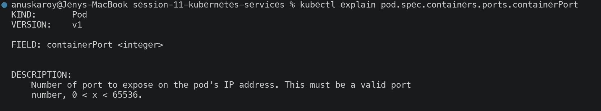
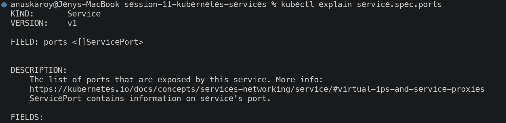

---

## Task 2: Type 1 — ClusterIP (Default Internal Networking)

**Description:** Deploy a 3-replica backend, expose it on a `ClusterIP` Service at port `8080` targeting
container port `80`, and test internal access by service name, FQDN and raw virtual IP.

```bash
kubectl apply -f 01-clusterip/app-deployment.yaml
kubectl apply -f 01-clusterip/service.yaml
kubectl apply -f 01-clusterip/client-pod.yaml
kubectl get pods -l app=web-clusterip -o wide
kubectl get svc,endpoints web-service-clusterip
```

```
NAME                                 READY   STATUS    RESTARTS   AGE   IP            NODE           NOMINATED NODE   READINESS GATES
web-app-clusterip-66865d4855-4wlwx   1/1     Running   0          22s   10.244.0.29   minikube       <none>           <none>
web-app-clusterip-66865d4855-4wr7j   1/1     Running   0          22s   10.244.1.93   minikube-m02   <none>           <none>
web-app-clusterip-66865d4855-wstgr   1/1     Running   0          22s   10.244.1.94   minikube-m02   <none>           <none>

NAME                    TYPE        CLUSTER-IP    EXTERNAL-IP   PORT(S)    AGE
web-service-clusterip   ClusterIP   10.98.89.79   <none>        8080/TCP   22s

NAME                    ENDPOINTS                                      AGE
web-service-clusterip   10.244.0.29:80,10.244.1.93:80,10.244.1.94:80   22s

NAME                          ADDRESSTYPE   PORTS   ENDPOINTS                             AGE
web-service-clusterip-8hn85   IPv4          80      10.244.1.93,10.244.0.29,10.244.1.94   22s
```

The Service controller automatically populated **Endpoints** (and the modern **EndpointSlice**) with the
3 Pod IPs matching `selector: app=web-clusterip`. Pods are spread across both nodes; the Service abstracts
that away entirely.

### Internal access — 3 equivalent addressing methods

```bash
kubectl exec curl-client -- curl -s http://web-service-clusterip:8080 | grep -i "<title>"
kubectl exec curl-client -- curl -s http://web-service-clusterip.default.svc.cluster.local:8080 | grep -i "<title>"
kubectl exec curl-client -- curl -s http://10.98.89.79:8080 | grep -i "<title>"
```

```
<title>Welcome to nginx!</title>      # short service name
<title>Welcome to nginx!</title>      # full FQDN
<title>Welcome to nginx!</title>      # raw ClusterIP virtual IP
```

### Proving kube-proxy load balancing

Each pod was given a unique `index.html` containing its own hostname, then polled 30 times:

```bash
for i in $(seq 1 30); do curl -s http://web-service-clusterip:8080; done | sort | uniq -c
```

```
  14 SERVED-BY: web-app-clusterip-66865d4855-4wlwx
   8 SERVED-BY: web-app-clusterip-66865d4855-4wr7j
   8 SERVED-BY: web-app-clusterip-66865d4855-wstgr
```

Traffic is distributed across all 3 backends. The distribution is uneven because `kube-proxy` in iptables
mode picks an endpoint **randomly per connection** rather than strict round-robin.

> A `ClusterIP` is a **virtual** IP — it exists only as iptables DNAT rules on each node, not as an
> interface you can ping. It is unreachable from outside the cluster by design.

**Screenshots:**

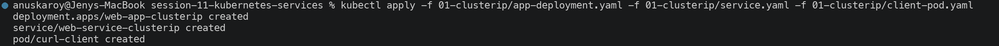
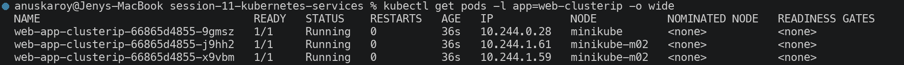
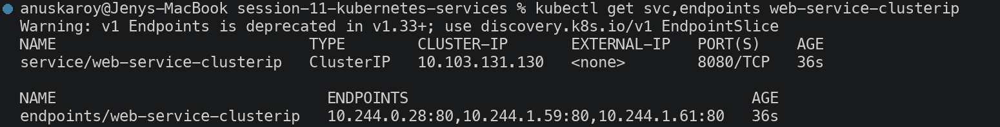


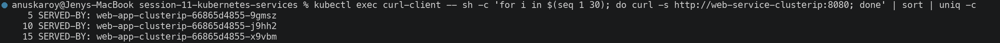

---

## Task 3: Type 2 — NodePort (Host-Level External Ingress)

```bash
kubectl apply -f 02-nodeport/app-deployment.yaml
kubectl apply -f 02-nodeport/service.yaml
kubectl get svc web-service-nodeport
```

```
NAME                   TYPE       CLUSTER-IP      EXTERNAL-IP   PORT(S)        AGE
web-service-nodeport   NodePort   10.102.143.40   <none>        80:30080/TCP   2s

NAME                   ENDPOINTS                       AGE
web-service-nodeport   10.244.0.30:80,10.244.1.96:80   2s
```

The `80:30080/TCP` notation means *Service port 80 is exposed on node port 30080*.

**Verified that the port is open on EVERY node**, not just the one running a pod:

```bash
minikube ssh -- curl -sI http://192.168.49.2:30080 | head -1                    # control-plane
minikube ssh -n minikube-m02 -- curl -sI http://192.168.49.3:30080 | head -1    # worker
```

```
HTTP/1.1 200 OK
HTTP/1.1 200 OK
```

This is the defining NodePort property: **any** node accepts the traffic and forwards it to a healthy pod,
even if that pod lives on a different node.

> Accessing this from the macOS host requires a workaround — see **Task 12**.

**Screenshots:**

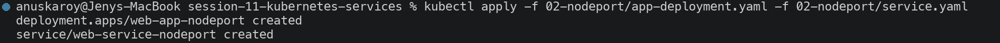
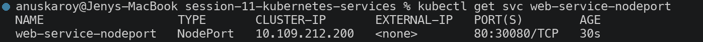


---

## Task 4: Type 3 — LoadBalancer (Cloud-Native Ingress Simulation)

```bash
kubectl apply -f 03-loadbalancer/app-deployment.yaml
kubectl apply -f 03-loadbalancer/service.yaml
kubectl get svc web-service-loadbalancer
```

**Before starting the tunnel** — no cloud controller exists, so the external IP never arrives:

```
NAME                       TYPE           CLUSTER-IP      EXTERNAL-IP   PORT(S)        AGE
web-service-loadbalancer   LoadBalancer   10.101.181.91   <pending>     80:31823/TCP   2s
```

**A LoadBalancer is built ON TOP of the other two types** — Kubernetes automatically allocated:

```
ClusterIP:  10.101.181.91     <-- ClusterIP layer (internal)
nodePort:   31823             <-- NodePort layer (every node)
                              <-- + external IP, requested from the cloud provider
```

**With `minikube tunnel` running in a separate terminal:**

```bash
minikube tunnel     # simulates a cloud controller; needs sudo to bind privileged ports
kubectl get svc web-service-loadbalancer
```

```
* Tunnel successfully started
! The service/ingress web-service-loadbalancer requires privileged ports to be exposed: [80]
* sudo permission will be asked for it.
* Starting tunnel for service web-service-loadbalancer.

NAME                       TYPE           CLUSTER-IP      EXTERNAL-IP   PORT(S)        AGE
web-service-loadbalancer   LoadBalancer   10.101.181.91   127.0.0.1     80:31823/TCP   41s
```

`EXTERNAL-IP` moved from `<pending>` to `127.0.0.1` — the tunnel acted as the cloud controller.

**Traffic verified through every layer:**

```bash
minikube ssh -- curl -sI http://192.168.49.2:31823 | head -1                        # NodePort layer
kubectl exec curl-client -- curl -s http://web-service-loadbalancer/ | grep title   # ClusterIP layer
```

```
HTTP/1.1 200 OK
<title>Welcome to nginx!</title>
```

> **On a real cloud:** this same manifest would cause the cloud-controller-manager to provision an actual
> AWS NLB / GCP Forwarding Rule / Azure LB and populate `EXTERNAL-IP` with a public address — at roughly
> **$18–25/month per Service** (see Task 11).

**Screenshots:**

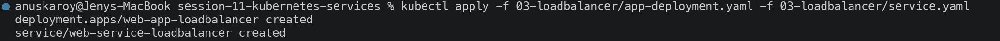

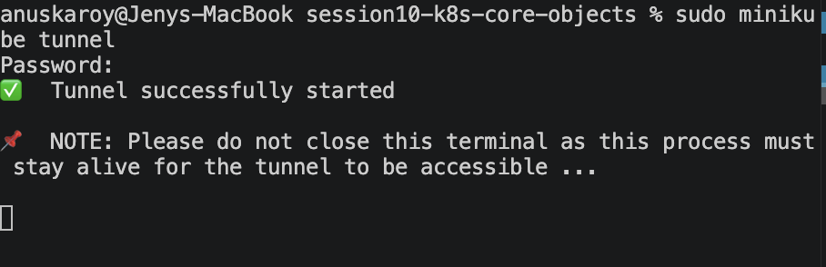


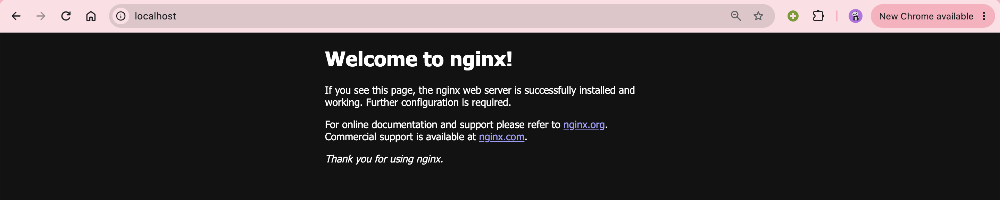

---

## Task 5: Type 4 — ExternalName (CoreDNS CNAME Alias)

```bash
kubectl apply -f 04-externalname/service.yaml
kubectl apply -f 04-externalname/client-pod.yaml
kubectl get svc external-database-service
kubectl get endpoints external-database-service
```

```
NAME                        TYPE           CLUSTER-IP   EXTERNAL-IP        PORT(S)   AGE
external-database-service   ExternalName   <none>       nencyravaliya.me   <none>    1s

Error from server (NotFound): endpoints "external-database-service" not found
```

**Two things are unique here:** `CLUSTER-IP` is `<none>` and **no Endpoints object exists at all**.

```bash
kubectl exec dns-test-client -- nslookup external-database-service
```

```
Server:		10.96.0.10
Address:	10.96.0.10:53

external-database-service.default.svc.cluster.local	canonical name = nencyravaliya.me
```

**How it works:** `ExternalName` is handled **purely at the DNS layer**. CoreDNS returns a `CNAME` record
and nothing else — no virtual IP is allocated, no iptables rules are written, and **no traffic is proxied
by Kubernetes**. The client resolves the CNAME and connects directly to the external host.

**Why it is useful:** application code can hardcode `postgres-db` in every environment, while the Service
maps it to `prod-rds.amazonaws.com` in production and `staging-rds.amazonaws.com` in staging. Migrating to
a different provider is a one-line Service change with no redeployment.

**Screenshots:**

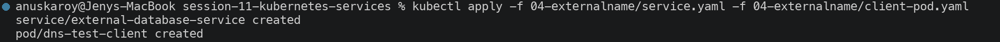
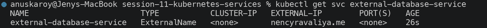
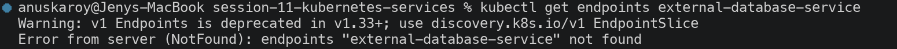
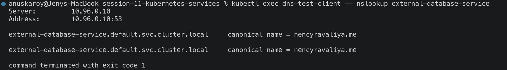

---

## Task 6: Type 5 — Headless Service (`clusterIP: None`)

```bash
kubectl apply -f 05-headless/service.yaml
kubectl apply -f 05-headless/app-statefulset.yaml
kubectl apply -f 05-headless/client-pod.yaml
kubectl get svc web-service-headless
kubectl get pods -l app=web-headless -o wide
```

```
NAME                   TYPE        CLUSTER-IP   EXTERNAL-IP   PORT(S)   AGE
web-service-headless   ClusterIP   None         <none>        80/TCP    2s

NAME             READY   STATUS    RESTARTS   AGE   IP             NODE
web-stateful-0   1/1     Running   0          2s    10.244.1.100   minikube-m02
web-stateful-1   1/1     Running   0          1s    10.244.0.32    minikube
web-stateful-2   1/1     Running   0          1s    10.244.1.102   minikube-m02
```

### The defining difference — DNS returns ALL pod IPs

```bash
kubectl exec headless-dns-client -- nslookup web-service-headless
```

```
Name:	web-service-headless.default.svc.cluster.local
Address: 10.244.1.100
Name:	web-service-headless.default.svc.cluster.local
Address: 10.244.0.32
Name:	web-service-headless.default.svc.cluster.local
Address: 10.244.1.102
```

**Compare with the normal ClusterIP Service from Task 2:**

```bash
kubectl exec headless-dns-client -- nslookup web-service-clusterip
```

```
Name:	web-service-clusterip.default.svc.cluster.local
Address: 10.98.89.79          <-- ONE virtual IP, backends hidden
```

| | ClusterIP Service | Headless Service |
| --- | --- | --- |
| DNS answer | 1 virtual IP | **N A-records, one per ready pod** |
| Load balancing | kube-proxy (iptables) | **None** — the client chooses |
| Pod addressability | Not individually addressable | Each pod has a stable DNS name |

### Stable per-pod DNS names

```bash
kubectl exec headless-dns-client -- nslookup web-stateful-0.web-service-headless.default.svc.cluster.local
kubectl exec headless-dns-client -- curl -s http://web-stateful-0.web-service-headless/ | grep title
```

```
Name:	web-stateful-0.web-service-headless.default.svc.cluster.local
Address: 10.244.1.100

<title>Welcome to nginx!</title>
```

**Why stateful systems require this:** a Kafka broker or MongoDB replica-set member must address *specific*
peers ("replicate to member 2"), not "any random pod". Load balancing would actively break replication.
The pattern is `<pod-name>.<service-name>.<namespace>.svc.cluster.local`, and it survives pod restarts —
as proved in Task 9.

**Screenshots:**

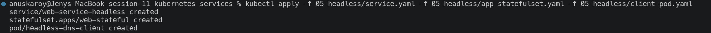

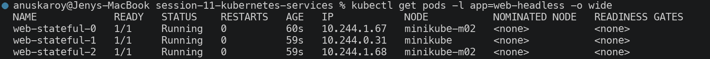
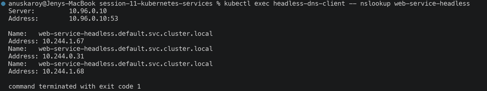
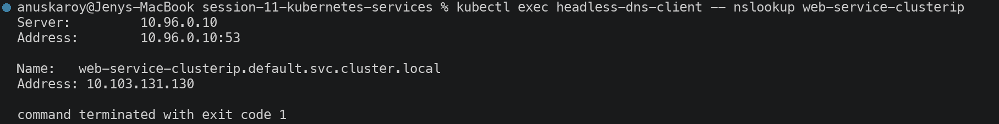
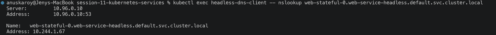


---

## Task 7: Services Without Selectors (Manual Endpoints Mapping)

**Step 1 — create a Service with NO selector:**

```bash
kubectl apply -f - <<EOF
apiVersion: v1
kind: Service
metadata:
  name: external-legacy-db
spec:
  ports:
    - protocol: TCP
      port: 3306
      targetPort: 3306
EOF
kubectl get svc external-legacy-db
kubectl get endpoints external-legacy-db
```

```
NAME                 TYPE        CLUSTER-IP     EXTERNAL-IP   PORT(S)    AGE
external-legacy-db   ClusterIP   10.100.9.235   <none>        3306/TCP   0s

Error from server (NotFound): endpoints "external-legacy-db" not found
```

A ClusterIP was allocated, but with no selector the endpoints controller has nothing to match — so **no
Endpoints object is created at all**.

**Step 2 — manually bind an external backend:**

```bash
kubectl apply -f - <<EOF
apiVersion: v1
kind: Endpoints
metadata:
  name: external-legacy-db     # name MUST match the Service exactly
subsets:
  - addresses:
      - ip: 192.168.1.150
    ports:
      - port: 3306
EOF
kubectl get endpoints external-legacy-db
```

```
NAME                 ENDPOINTS            AGE
external-legacy-db   192.168.1.150:3306   3s
```

```bash
kubectl exec curl-client -- nslookup external-legacy-db
```
```
Name:	external-legacy-db.default.svc.cluster.local
Address: 10.100.9.235
```

**Why this matters:** the Endpoints object is normally *managed* by Kubernetes, but it is a first-class API
object you can write yourself. Pods now reach a legacy VM, on-prem database or third-party host through a
native Service name — with kube-proxy load balancing and no application changes. This is the standard
migration pattern: point the Service at the legacy backend, then switch to a selector once the workload
moves into the cluster, with zero client-side changes.

**Difference from `ExternalName`:** this proxies **real traffic** through kube-proxy to an **IP address**;
`ExternalName` only returns a DNS CNAME to a **hostname** and proxies nothing.

**Screenshots:**

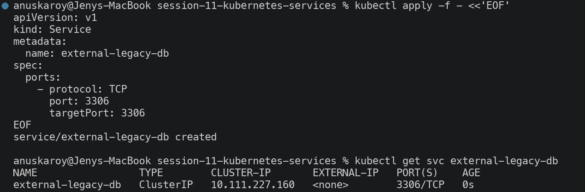
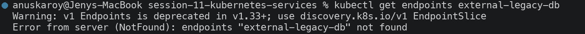
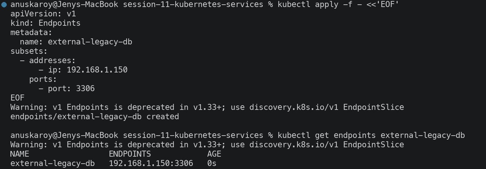
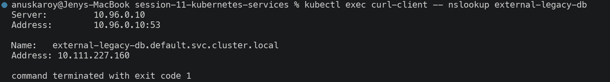

---

## Task 8: FQDN & CoreDNS Deep Dive

```bash
kubectl get pods -n kube-system -l k8s-app=kube-dns -o wide
kubectl get svc -n kube-system kube-dns
```

```
NAME                       READY   STATUS    RESTARTS   AGE    IP           NODE
coredns-559f6c778d-88l4g   1/1     Running   0          114m   10.244.0.2   minikube

NAME       TYPE        CLUSTER-IP   EXTERNAL-IP   PORT(S)                  AGE
kube-dns   ClusterIP   10.96.0.10   <none>        53/UDP,53/TCP,9153/TCP   114m
```

### Anatomy of a Kubernetes FQDN

```
web-service-clusterip . default . svc . cluster.local
└──────────┬─────────┘  └───┬───┘  └┬┘  └─────┬─────┘
      service name      namespace   type   cluster domain
```

### `/etc/resolv.conf` inside every pod

```bash
kubectl exec curl-client -- cat /etc/resolv.conf
```

```
search default.svc.cluster.local svc.cluster.local cluster.local
nameserver 10.96.0.10
options ndots:5
```

The kubelet injects this automatically. `nameserver 10.96.0.10` is the `kube-dns` Service ClusterIP.

### Search-domain expansion in action

```bash
kubectl exec curl-client -- nslookup web-service-clusterip
```

```
Server:		10.96.0.10
Address:	10.96.0.10:53

** server can't find web-service-clusterip.cluster.local: NXDOMAIN

Name:	web-service-clusterip.default.svc.cluster.local
Address: 10.98.89.79
```

The short name was tried against each search domain in turn; `default.svc.cluster.local` matched.

### Why `ndots:5` hurts external API calls in production

`ndots:5` means *"if a name has fewer than 5 dots, try the search domains before treating it as absolute."*
`api.github.com` has only 2 dots, so the resolver first issues **3 doomed queries**:

```
api.github.com.default.svc.cluster.local   -> NXDOMAIN
api.github.com.svc.cluster.local           -> NXDOMAIN
api.github.com.cluster.local               -> NXDOMAIN
api.github.com                             -> 20.207.73.85   (finally)
```

**Measured cost in this cluster** (20 lookups each):

| Query form | Total | Per lookup |
| --- | --- | --- |
| `api.github.com` (relative) | 541 ms | **27.1 ms** |
| `api.github.com.` (trailing dot = absolute) | 101 ms | **5.1 ms** |

**A 5.3× slowdown on every external DNS lookup.** For a service making thousands of outbound API calls
per second this is a significant and easily-missed latency tax, and it multiplies CoreDNS query load by 4.

**Three standard fixes:**
1. **Trailing dot** — `https://api.github.com.` forces an absolute lookup (measured above).
2. **Per-pod `dnsConfig`** — set `options: [{name: ndots, value: "1"}]` in the Pod spec.
3. **NodeLocal DNSCache** — a DaemonSet caching resolver on each node, removing most of the round trips.

**Screenshots:**


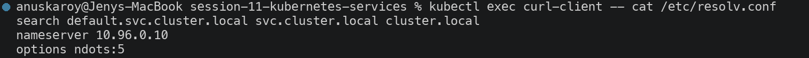
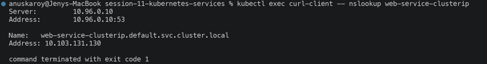
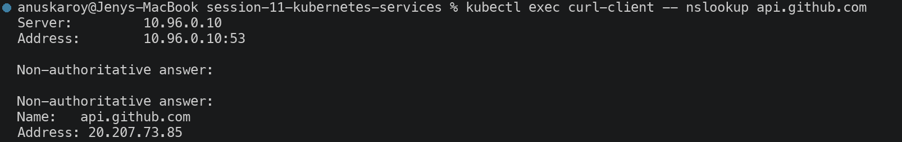
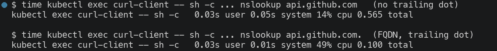

---

## Task 9: Pod Identity — Deployment (Stateless) vs StatefulSet (Stateful)

**Initial state — note the two naming schemes:**

```
# Deployment: <deployment>-<replicaset-hash>-<random suffix>
NAME                                 READY   STATUS    RESTARTS   AGE
web-app-clusterip-66865d4855-4wlwx   1/1     Running   0          4m53s
web-app-clusterip-66865d4855-4wr7j   1/1     Running   0          4m53s
web-app-clusterip-66865d4855-wstgr   1/1     Running   0          4m53s

# StatefulSet: <statefulset>-<ordinal>
NAME             READY   STATUS    RESTARTS   AGE
web-stateful-0   1/1     Running   0          91s
web-stateful-1   1/1     Running   0          90s
web-stateful-2   1/1     Running   0          90s
```

**Delete one pod from each controller:**

```bash
kubectl delete pod web-app-clusterip-66865d4855-4wlwx
kubectl get pods -l app=web-clusterip
```

```
pod "web-app-clusterip-66865d4855-4wlwx" deleted from default namespace

NAME                                 READY   STATUS    RESTARTS   AGE
web-app-clusterip-66865d4855-4wr7j   1/1     Running   0          5m14s
web-app-clusterip-66865d4855-qztqv   1/1     Running   0          21s     <-- NEW random identity
web-app-clusterip-66865d4855-wstgr   1/1     Running   0          5m14s
```

```bash
kubectl delete pod web-stateful-0
kubectl get pods -l app=web-headless
```

```
pod "web-stateful-0" deleted from default namespace

NAME             READY   STATUS    RESTARTS   AGE
web-stateful-0   1/1     Running   0          25s     <-- SAME ordinal identity
web-stateful-1   1/1     Running   0          2m17s
web-stateful-2   1/1     Running   0          2m17s
```

| | Deployment | StatefulSet |
| --- | --- | --- |
| Deleted | `web-app-clusterip-66865d4855-4wlwx` | `web-stateful-0` |
| Replaced by | `web-app-clusterip-66865d4855-qztqv` | `web-stateful-0` |
| Identity | **New random suffix** — pods are cattle | **Invariant ordinal** — pods are pets |
| DNS name | Not individually addressable | `web-stateful-0.web-service-headless` still resolves |
| Storage | No affinity to any volume | **Rebinds to the same PVC** (see Session 10 Task 6B) |

**Why this matters:** in Session 10 the same test on the MySQL StatefulSet showed the recreated `mysql-1`
rebinding to PVC `pvc-1be42fe2…` — the **identical volume**, with its data intact. A Deployment pod cannot
do this because its replacement has no stable identity to bind storage to. This is precisely why databases
require StatefulSets and stateless APIs do not.

**Screenshots:**

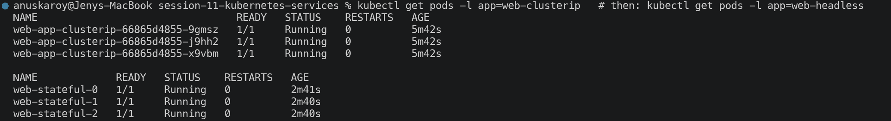
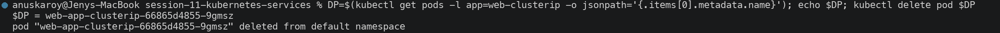
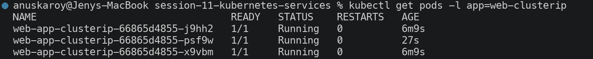

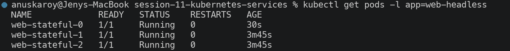

---

## Task 10: Master Architectural Matrix — Deployment vs StatefulSet vs DaemonSet

```bash
kubectl explain deployment.spec
kubectl explain statefulset.spec
kubectl explain daemonset.spec
kubectl get deploy,sts,ds
```

| Architectural Metric | Deployment | StatefulSet | DaemonSet |
| --- | --- | --- | --- |
| **Primary workload** | Stateless microservices, web APIs | Clustered databases, distributed queues | Node-level infrastructure agents |
| **Pod naming** | Random hash (`app-66865d4855-4wlwx`) | Deterministic ordinal (`web-stateful-0/1/2`) | Random hash, one per node (`node-exporter-c7tjh`) |
| **Identity persistence** | Ephemeral — replaced with a new name | **Invariant** — same name, DNS and volume return | Bound to a specific node |
| **Startup / shutdown order** | Parallel, unordered | **Strictly sequential** (`0→1→2`; reverse on delete) | Parallel across all eligible nodes |
| **Replica count** | `spec.replicas` (manual/HPA) | `spec.replicas` (manual) | **Implicit — equals the node count** |
| **Storage** | Shared PVC or ephemeral `emptyDir` | **Dedicated PVC per ordinal** via `volumeClaimTemplates` | `hostPath` / node-local |
| **Required Service type** | `ClusterIP` / `NodePort` / `LoadBalancer` | **Headless** (`clusterIP: None`) for peer discovery | Usually none |
| **Scaling behaviour** | Any node, any order | Ordinal, at the tail only | **Automatic** when nodes join/leave |
| **Production examples** | Nginx, Flask, Node.js APIs, Go services | Kafka, MongoDB, Cassandra, PostgreSQL, ZooKeeper | Fluentd, Prometheus Node Exporter, Cilium, Falco |

### Verified in these sessions

| Claim | Evidence |
| --- | --- |
| Deployment pods get new identities | S11 Task 9: `…4wlwx` → `…qztqv` |
| StatefulSet pods keep their identity | S11 Task 9: `web-stateful-0` → `web-stateful-0` |
| StatefulSet starts sequentially | S10 Task 6B: `mysql-0` Running before `mysql-1` was created |
| StatefulSet keeps per-ordinal storage | S10 Task 6B: `mysql-1` rebound to PVC `pvc-1be42fe2…` |
| DaemonSet derives its replica count | S10 Task 7: `DESIRED 2` on a 2-node cluster, never specified |

**Screenshots:**

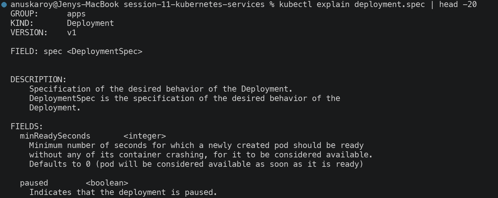
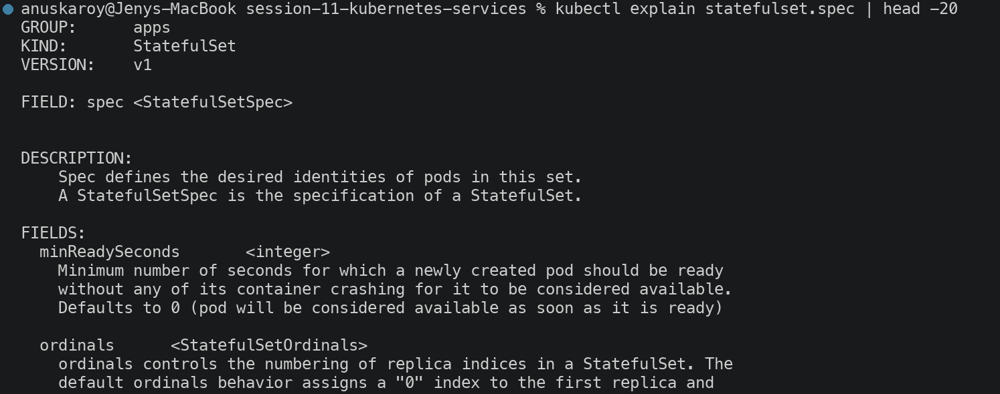
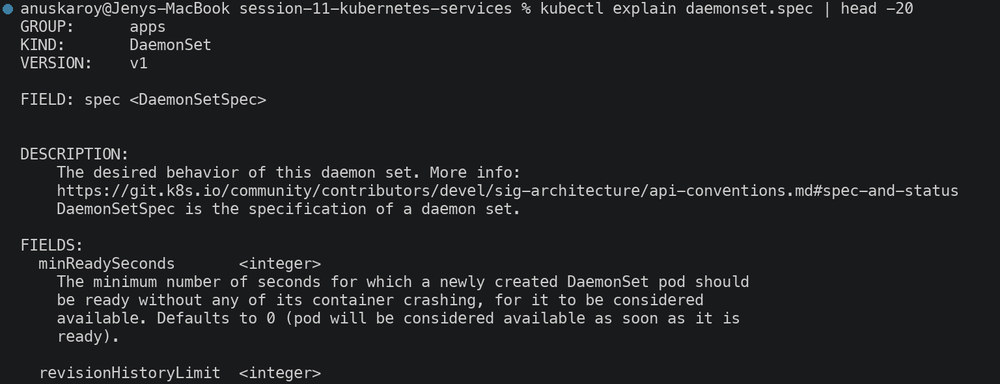
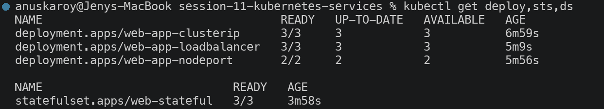
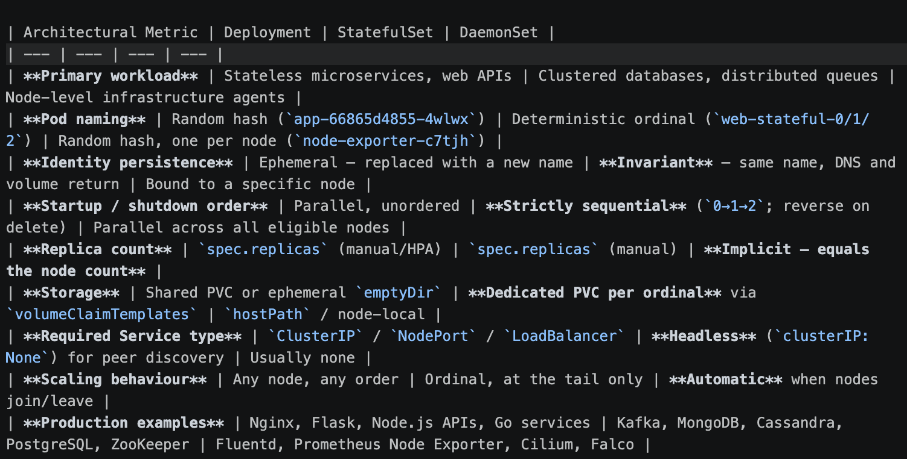

---

## Task 11: Production Cost Optimization & Service Selection Decision Tree

### The LoadBalancer-per-service anti-pattern

```
ANTI-PATTERN — one cloud load balancer per microservice:

  Microservice A ──► AWS NLB #1  ($25/mo) ──► ClusterIP A
  Microservice B ──► AWS NLB #2  ($25/mo) ──► ClusterIP B
  Microservice C ──► AWS NLB #3  ($25/mo) ──► ClusterIP C
                          ...
  50 microservices = 50 load balancers  =  $1,250 / month


BEST PRACTICE — one shared entrypoint, routed at Layer 7:

  Public Internet
        │
        ▼
  1 Cloud Load Balancer ($25/mo)
        │
        ▼
  ┌──────────────────────────────┐
  │  NGINX Ingress Controller    │   host + path routing
  └──┬──────────┬──────────┬─────┘
     ▼          ▼          ▼
  ClusterIP  ClusterIP  ClusterIP     (free — internal only)
      A          B          C

  50 microservices = 1 load balancer  =  $25 / month
```

| | 50 × LoadBalancer | 1 × Ingress |
| --- | --- | --- |
| Cloud LB count | 50 | 1 |
| Monthly cost | ~$1,250 | ~$25 |
| **Annual cost** | **~$15,000** | **~$300** |
| **Saving** | — | **~$14,700/yr (98%)** |

Beyond cost: a single ingress also centralises TLS termination, WAF rules, rate limiting and access logging,
instead of duplicating that configuration 50 times. It also avoids cloud quota limits on load balancers
per account/region.

### Service selection decision tree

```
Does traffic need to reach this service from OUTSIDE the cluster?
│
├─ NO ──► Do clients need to address INDIVIDUAL pods?
│          (Kafka brokers, DB replica members, peer discovery)
│         ├─ YES ──► HEADLESS SERVICE   (clusterIP: None)
│         └─ NO  ──► CLUSTERIP          (the default)
│
└─ YES ─► Is the target an EXTERNAL third-party host?
           (AWS RDS, Stripe, an on-prem database)
          ├─ YES, by hostname ──► EXTERNALNAME   (DNS CNAME only)
          ├─ YES, by IP       ──► SERVICE WITHOUT SELECTOR + manual Endpoints
          └─ NO ──► Running on a public cloud?
                    ├─ YES, HTTP/HTTPS ──► ONE INGRESS behind ONE LoadBalancer,
                    │                      all apps stay ClusterIP      ← cost-optimal
                    ├─ YES, raw TCP/UDP ──► LOADBALANCER per service
                    │                       (Ingress is HTTP-only)
                    └─ NO (on-prem / dev) ──► NODEPORT
```

**Screenshots:**

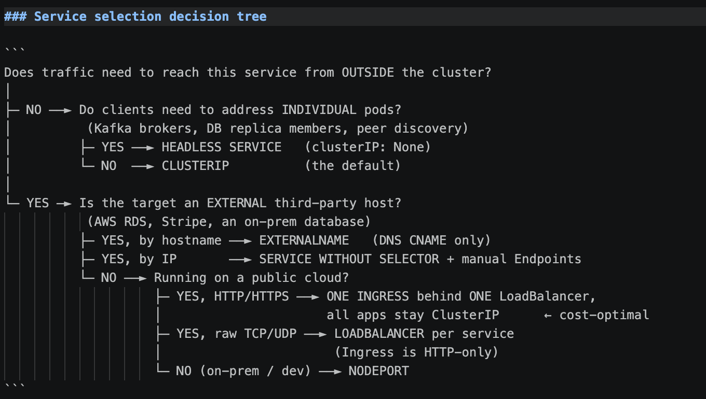

---

## Task 12: Minikube Docker-Driver Port Binding & Tunnel Gotcha

### The problem

```bash
NODE_IP=$(minikube ip)          # 192.168.49.2
curl --connect-timeout 5 -I http://192.168.49.2:30080
```

```
   Connection FAILED as expected (exit 28 = operation timed out)
```

### Proof that the NodePort itself is perfectly healthy

```bash
minikube ssh -- curl -sI http://192.168.49.2:30080 | head -1                    # control-plane node
minikube ssh -n minikube-m02 -- curl -sI http://192.168.49.3:30080 | head -1    # worker node
```

```
HTTP/1.1 200 OK
HTTP/1.1 200 OK
```

**The Service is working on both nodes.** Only the macOS host cannot reach it.

### Root cause

```
┌─ macOS host ────────────────────────────────────────────────┐
│                                                              │
│   curl 192.168.49.2:30080  ──X  no route                     │
│                                                              │
│   ┌─ Docker Desktop Linux VM ───────────────────────────┐    │
│   │                                                      │    │
│   │   ┌─ docker bridge network 192.168.49.0/24 ──────┐  │    │
│   │   │   minikube      192.168.49.2  :30080  OK     │  │    │
│   │   │   minikube-m02  192.168.49.3  :30080  OK     │  │    │
│   │   └───────────────────────────────────────────────┘  │    │
│   └──────────────────────────────────────────────────────┘    │
└──────────────────────────────────────────────────────────────┘
```

On **bare-metal Linux**, the node IP belongs to a real interface the host can route to directly.

With the **Docker driver on macOS/Windows**, each node is a container on an internal Docker bridge network
that lives *inside* the Docker Desktop Linux VM. The macOS kernel has no route to `192.168.49.0/24` —
the packets have nowhere to go, so the connection times out rather than being refused.

### Workaround 1 — `minikube service --url` (temporary loopback proxy)

```bash
minikube service web-service-nodeport --url
```
```
http://127.0.0.1:55801
```

```bash
curl -I http://127.0.0.1:55801
```
```
HTTP/1.1 200 OK
Server: nginx/1.25.5
Date: Sun, 20 Sep 2026 13:45:09 GMT
Content-Type: text/html
```

Minikube opens an **ephemeral** port on `127.0.0.1` and proxies it into the Docker bridge. Note the port is
`55801`, **not** `30080` — it is randomly assigned and changes each run. The proxy dies when the command is
interrupted, so the terminal must stay open.

### Workaround 2 — `minikube tunnel` (persistent L3 route, for LoadBalancer)

```bash
sudo minikube tunnel
```
```
* Tunnel successfully started
! The service/ingress web-service-loadbalancer requires privileged ports to be exposed: [80]
* sudo permission will be asked for it.
```

```
NAME                       TYPE           CLUSTER-IP      EXTERNAL-IP   PORT(S)        AGE
web-service-loadbalancer   LoadBalancer   10.101.181.91   127.0.0.1     80:31823/TCP   41s
```

`minikube tunnel` runs a background process that assigns `EXTERNAL-IP` and routes host traffic into the
cluster. Because it binds **privileged ports (<1024)** it must be started with `sudo`; without it the
external IP is still assigned but `curl http://127.0.0.1` returns `Connection refused`.

### Comparison

| | `minikube service --url` | `minikube tunnel` |
| --- | --- | --- |
| Service types | NodePort | **LoadBalancer** (also Ingress) |
| Port | Random ephemeral (`55801`) | **The real port** (`80`) |
| `EXTERNAL-IP` | Unchanged | Populated (`127.0.0.1`) |
| Root required | No | **Yes**, for ports < 1024 |
| Scope | One service | All LoadBalancer services |

**Screenshots:**

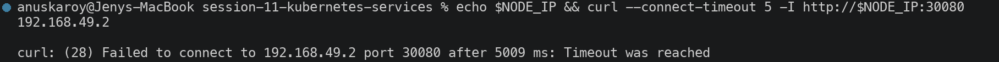

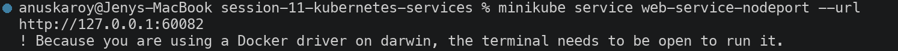


---

## Summary

| # | Task | Status |
| --- | --- | --- |
| 1 | Port architecture (4 ports) | Completed |
| 2 | ClusterIP service + internal access | Completed |
| 3 | NodePort service | Completed |
| 4 | LoadBalancer + minikube tunnel | Completed |
| 5 | ExternalName CNAME alias | Completed |
| 6 | Headless service + StatefulSet DNS | Completed |
| 7 | Service without selectors (manual Endpoints) | Completed |
| 8 | FQDN & CoreDNS deep dive (ndots measured) | Completed |
| 9 | Pod identity: Deployment vs StatefulSet | Completed |
| 10 | Architectural matrix | Completed |
| 11 | Cost optimization & decision tree | Completed |
| 12 | Minikube Docker-driver gotcha | Completed |

### The 5 Service Types at a Glance

| Type | ClusterIP allocated | Endpoints | External access | Use case |
| --- | --- | --- | --- | --- |
| **ClusterIP** | Yes (virtual) | Auto (by selector) | No | Internal microservices (default) |
| **NodePort** | Yes | Auto | Via `<node-ip>:30000-32767` | Dev / on-prem |
| **LoadBalancer** | Yes (+ NodePort) | Auto | Via cloud LB external IP | Cloud production ingress |
| **ExternalName** | **No** | **None** | N/A — DNS CNAME only | Aliasing external hostnames |
| **Headless** | **None** | Auto | No | Stateful peer discovery |
