# Lecture 11

### Task 1: Kubernetes Port Architecture & Clarification Drill

- **Short Description:** Document and visually map the 4 distinct port definitions in Kubernetes. Illustrate how a packet flows from an external client through the node, into the service, and down to the application process inside the container.
- **Manifest Reference:** Concept mapping across all `service.yaml` and `app-deployment.yaml` files.
- **Key Commands to Run:**
    
    ```bash
    # Inspect port declarations across pod and service
    kubectl explain pod.spec.containers.ports.containerPort
    kubectl explain service.spec.ports
    ```
    
- **Architecture Flowchart to Document:**
    
    ```
    Client Browser ──► [nodePort: 30080] (Host IP)
                            │
                            ▼
                       [port: 8080] (Service VIP)
                            │
                            ▼
                       [targetPort: 80] (Pod Network)
                            │
                            ▼
                       [containerPort: 80] (Container Engine / Nginx)
    ```
    
- **Screenshot**
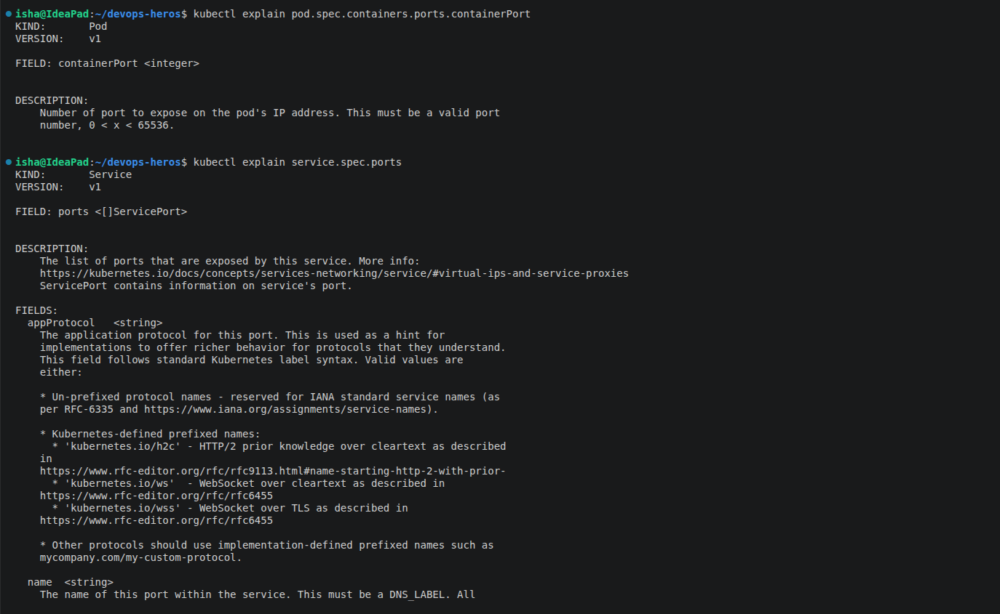
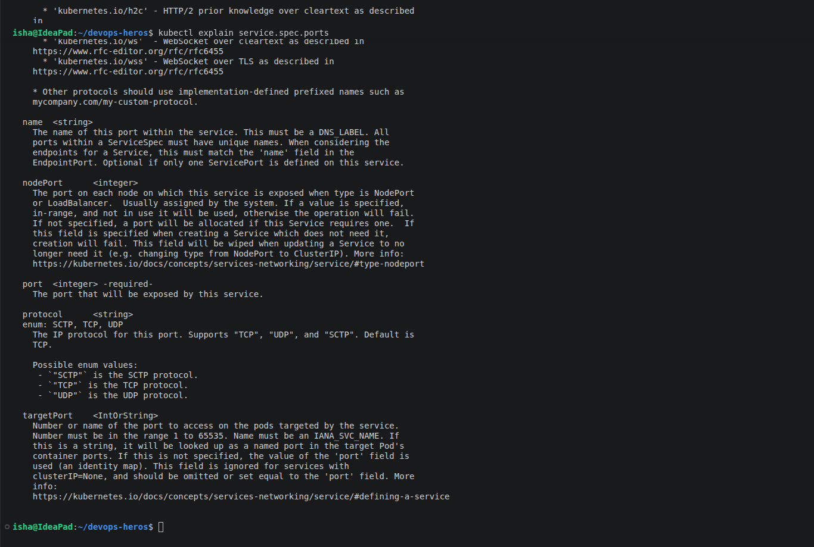

---

### Task 2: Type 1 Service — ClusterIP (Default Internal Networking)

- **Short Description:** Deploy a 3-replica backend (`web-app-clusterip`), create a `ClusterIP` service on port `8080` targeting container port `80`, inspect automatic endpoint binding, and test connectivity from an ephemeral client pod using short names and full FQDN.

- **Commands to Run:**
    
    ```bash
    # 1. Deploy backend app and ClusterIP service
    kubectl apply -f 01-clusterip/app-deployment.yaml
    kubectl apply -f 01-clusterip/service.yaml
    
    # 2. Verify pods, service, and endpoints
    kubectl get pods -l app=web-clusterip -o wide
    kubectl get svc web-service-clusterip
    kubectl get endpoints web-service-clusterip
    
    # 3. Deploy diagnostic client pod
    kubectl apply -f 01-clusterip/client-pod.yaml
    kubectl wait --for=condition=ready pod/curl-client --timeout=60s
    
    # 4. Test internal resolution methods from inside the cluster
    kubectl exec -it curl-client -- curl -s <http://web-service-clusterip:8080> | grep -i "<title>"
    kubectl exec -it curl-client -- curl -s <http://web-service-clusterip.default.svc.cluster.local:8080> | grep -i "<title>"
    ```
    
- **Screenshots**
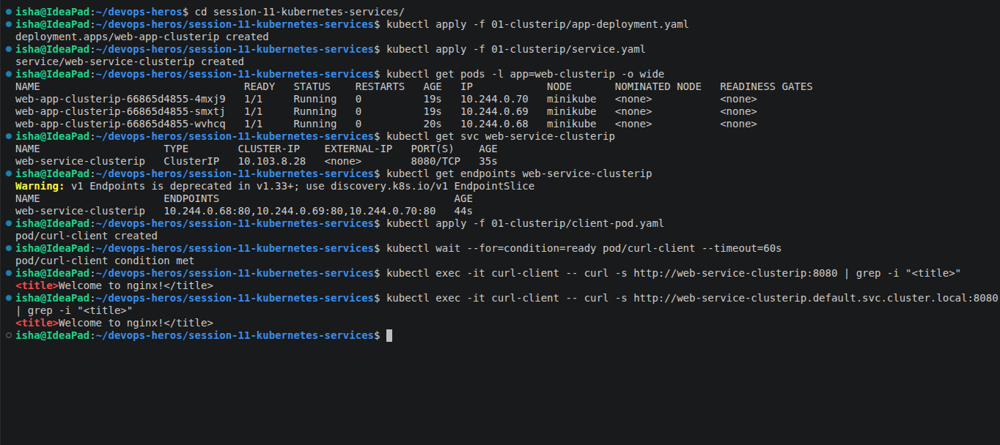
   
---

### Task 3: Type 2 Service — NodePort (Host-Level External Ingress)

- **Short Description:** Deploy a 2-replica Nginx app and expose it externally by opening port `30080` on every cluster node. Verify that hitting any node IP on port `30080` directs traffic to the underlying pods.

- **Commands to Run:**
    
    ```bash
    # 1. Deploy application and NodePort service
    kubectl apply -f 02-nodeport/app-deployment.yaml
    kubectl apply -f 02-nodeport/service.yaml
    
    # 2. Verify the NodePort mapping
    kubectl get svc web-service-nodeport
    
    # 3. Retrieve Minikube IP and verify node port access
    MINIKUBE_IP=$(minikube ip)
    curl -I <http://$>{MINIKUBE_IP}:30080
    
    # 4. Alternatively test via minikube service tunnel (macOS/Docker driver)
    minikube service web-service-nodeport --url
    ```
    
- **Screenshot**
   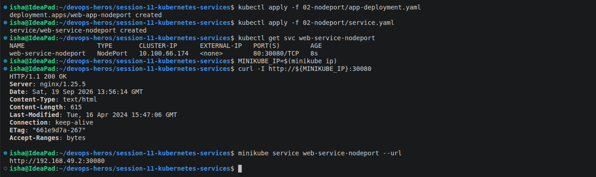

---

### Task 4: Type 3 Service — LoadBalancer (Cloud-Native Ingress Simulation)

- **Short Description:** Deploy a 3-replica workload exposed through `type: LoadBalancer`. Use `minikube tunnel` to simulate a cloud provider assigning an `EXTERNAL-IP`, and confirm that Kubernetes automatically configures internal `NodePort` and `ClusterIP` layers.

- **Commands to Run:**
    
    ```bash
    # 1. Deploy application and LoadBalancer service
    kubectl apply -f 03-loadbalancer/app-deployment.yaml
    kubectl apply -f 03-loadbalancer/service.yaml
    
    # 2. Check service status (will initially show <pending> without tunnel)
    kubectl get svc web-service-loadbalancer
    
    # 3. In a separate terminal, start the Minikube LoadBalancer tunnel
    minikube tunnel
    
    # 4. In primary terminal, observe EXTERNAL-IP populated
    kubectl get svc web-service-loadbalancer
    
    # 5. Access the application directly on standard port 80
    EXTERNAL_IP=$(kubectl get svc web-service-loadbalancer -o jsonpath='{.status.loadBalancer.ingress[0].ip}')
    curl -s <http://$>{EXTERNAL_IP}:80 | grep -i "<title>"
    ```
    
- **Screenshot**
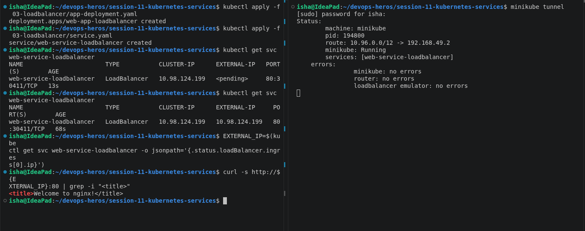

---

### Task 5: Type 4 Service — ExternalName (CoreDNS CNAME Alias Redirection)

- **Short Description:** Create an `ExternalName` service that acts as an internal DNS CNAME alias pointing to an external domain (e.g., `api.github.com`). Verify that no cluster IP or endpoints are created, and confirm CNAME resolution using `nslookup`.

- **Commands to Run:**
    
    ```bash
    # 1. Apply ExternalName service and client pod
    kubectl apply -f 04-externalname/service.yaml
    kubectl apply -f 04-externalname/client-pod.yaml
    kubectl wait --for=condition=ready pod/dns-test-client --timeout=60s
    
    # 2. Inspect the service (Notice CLUSTER-IP is <none>, EXTERNAL-IP is the target domain)
    kubectl get svc external-database-service
    
    # 3. Verify DNS resolution returns canonical name (CNAME)
    kubectl exec -it dns-test-client -- nslookup external-database-service
    
    # 4. Test outbound traffic through the alias
    kubectl exec -it dns-test-client -- curl -s -k <https://external-database-service>
    ```
    
- **Screenshot**


---

### Task 6: Type 5 Service — Headless Service (`clusterIP: None` & Stateful Workloads)

- **Short Description:** Deploy a 3-replica `StatefulSet` with a Headless Service (`clusterIP: None`). Prove that CoreDNS returns individual `A` records for all matching Pod IPs directly rather than a single VIP, and curl an ordinal pod hostname directly.

- **Commands to Run:**
    
    ```bash
    # 1. Apply Headless service and StatefulSet
    kubectl apply -f 05-headless/service.yaml
    kubectl apply -f 05-headless/app-statefulset.yaml
    kubectl apply -f 05-headless/client-pod.yaml
    
    # 2. Wait for stateful pods (web-stateful-0, 1, 2) to become Ready
    kubectl rollout status statefulset/web-stateful --timeout=120s
    kubectl get pods -l app=web-headless -o wide
    
    # 3. Inspect Service (Notice CLUSTER-IP is explicitly None)
    kubectl get svc web-service-headless
    
    # 4. Perform DNS lookup on Headless Service name -> Returns ALL pod IPs
    kubectl exec -it headless-dns-client -- nslookup web-service-headless
    
    # 5. Query an individual Pod directly via its stable FQDN
    kubectl exec -it headless-dns-client -- nslookup web-stateful-0.web-service-headless.default.svc.cluster.local
    kubectl exec -it headless-dns-client -- curl -s <http://web-stateful-0.web-service-headless:80> | grep -i "<title>"
    ```
    
- **Screenshot**
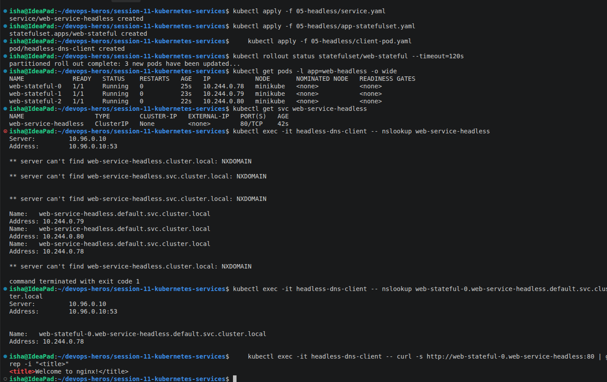
---

### Task 7: Services Without Selectors (Manual Endpoints Mapping)

- **Short Description:** Define a Service without selectors (`empty-endpoints.yaml` pattern) and manually bind it to an external backend IP address using a separate `Endpoints` manifest. Demonstrate how Kubernetes abstracts legacy or external infrastructure.
- **Commands to Run:**
    
    ```bash
    # 1. Create Service without a selector
    cat <<EOF | kubectl apply -f -
    apiVersion: v1
    kind: Service
    metadata:
      name: external-legacy-db
    spec:
      ports:
        - protocol: TCP
          port: 3306
          targetPort: 3306
EOF
    
    # 2. Verify endpoints are initially empty (<none>)
    kubectl get endpoints external-legacy-db
    
    # 3. Manually create matching Endpoints object pointing to external IP
    cat <<EOF | kubectl apply -f -
    apiVersion: v1
    kind: Endpoints
    metadata:
      name: external-legacy-db
    subsets:
      - addresses:
          - ip: 192.168.1.150
        ports:
          - port: 3306
EOF
    
    # 4. Verify endpoints are now successfully attached
    kubectl get endpoints external-legacy-db
    ```
    
- **Screenshot**

---

### Task 8: FQDN & CoreDNS Deep Dive Architecture Analysis

- **Short Description:** Inspect the cluster DNS configuration inside running pods. Break down the anatomy of a Kubernetes FQDN, examine `/etc/resolv.conf`, test search domain completion, and explain why `ndots:5` causes latency in production when making external API calls.
- **Commands to Run:**
    
    ```bash
    # 1. Verify CoreDNS pods are active in kube-system
    kubectl get pods -n kube-system -l k8s-app=kube-dns -o wide
    
    # 2. Inspect /etc/resolv.conf inside any running pod
    kubectl exec -it curl-client -- cat /etc/resolv.conf
    
    # 3. Test DNS search domain expansion
    # Querying 'web-service-clusterip' automatically expands to:
    # 'web-service-clusterip.default.svc.cluster.local'
    kubectl exec -it curl-client -- nslookup web-service-clusterip
    
    # 4. Demonstrate ndots:5 external query latency mechanism
    # Queries to an external domain (e.g., api.stripe.com) will traverse local search paths first
    kubectl exec -it curl-client -- nslookup api.github.com
    ```
    
- **Screenshot**
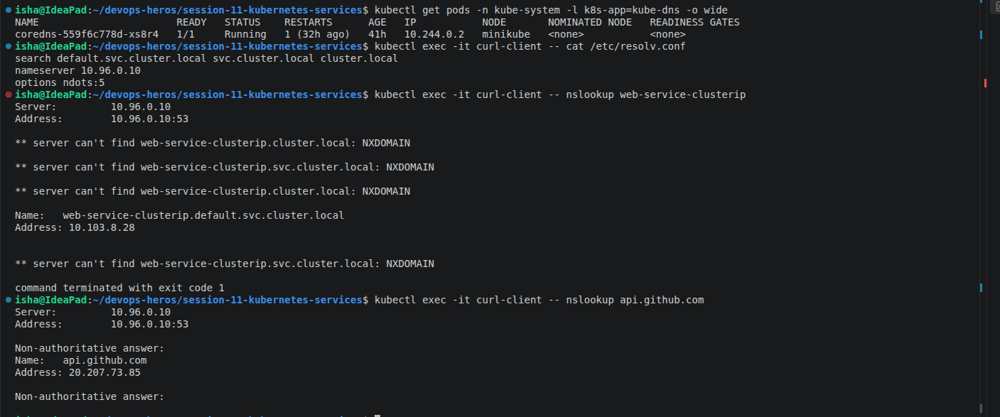
---

### Task 9: Pod Identity & Lifecycle Invariance Drill — Deployment (Stateless) vs. StatefulSet (Stateful)

- **Short Description:** Deploy both a stateless Deployment and an ordinal StatefulSet. Inspect their naming schemes, delete a running pod from each controller using `kubectl delete pod`, and observe that the Deployment spawns an ephemeral pod with a completely new random hash, whereas the StatefulSet strictly resurrects the exact same ordinal index (`web-stateful-0`).
- **Manifest Reference:**
    - Deployment: `session-11-kubernetes-services/01-clusterip/app-deployment.yaml`
    - StatefulSet: `session-11-kubernetes-services/05-headless/app-statefulset.yaml`
    - Service: `session-11-kubernetes-services/05-headless/service.yaml`
- **Commands to Run:**
    
    ```bash
    # 1. Apply both workloads
    kubectl apply -f session-11-kubernetes-services/01-clusterip/app-deployment.yaml
    kubectl apply -f session-11-kubernetes-services/05-headless/service.yaml
    kubectl apply -f session-11-kubernetes-services/05-headless/app-statefulset.yaml
    
    # 2. Wait for pods to become Ready and observe the naming conventions
    kubectl get pods -l app=web-clusterip
    kubectl get pods -l app=web-headless
    
    # 3. Capture the exact pod names before deletion
    DEPLOY_POD=$(kubectl get pods -l app=web-clusterip -o jsonpath='{.items[0].metadata.name}')
    echo "Deleting Stateless Deployment Pod: ${DEPLOY_POD}"
    kubectl delete pod "${DEPLOY_POD}"
    
    # 4. Check the Deployment pods immediately — notice a brand-new random hash is generated!
    kubectl get pods -l app=web-clusterip
    
    # 5. Delete an ordinal StatefulSet pod (web-stateful-0)
    echo "Deleting StatefulSet Pod: web-stateful-0"
    kubectl delete pod web-stateful-0
    
    # 6. Check the StatefulSet pods immediately — notice web-stateful-0 is recreated identically!
    kubectl get pods -l app=web-headless
    ```
    
- **Expected Behavioral Comparison:**
    - **Stateless Pod Deleted:** `web-app-clusterip-6c679b9456-4d9vz` ──► Replaced by: `web-app-clusterip-6c679b9456-x8k2m` *(New random identity)*
    - **Stateful Pod Deleted:** `web-stateful-0` ──► Replaced by: `web-stateful-0` *(Deterministic, invariant identity)*
- **Screenshot**
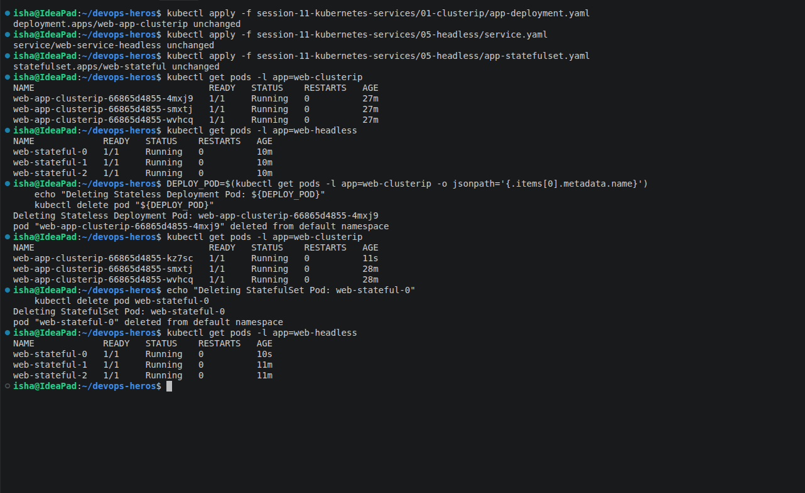

---

### Task 10: Master Architectural Matrix — Deployment vs. StatefulSet vs. DaemonSet

- **Short Description:** Create an engineering reference matrix evaluating the differences between Deployments, StatefulSets, and DaemonSets. Document their scheduling paradigms, storage lifetimes, identity models, network coupling, and failure domains.
- **Manifests Inspected:**
    - `session10-k8s-core-objects/deployment/deployment-v1.yaml`
    - `session10-k8s-core-objects/daemonset/node-agent-ds.yaml`
    - `session10-k8s-core-objects/k8s-core-objects/statefulset.yml`
- **Commands to Run:**
    
    ```bash
    # Inspect resource definitions and schema specifications
    kubectl explain deployment.spec
    kubectl explain statefulset.spec
    kubectl explain daemonset.spec
    ```
    
- **Engineering Matrix to Document in Submission:**

| Architectural Metric | Deployment | StatefulSet | DaemonSet |
| --- | --- | --- | --- |
| **Primary Workload Type** | Stateless microservices, Web APIs | Clustered databases, Distributed queues | Node-level infrastructure agents |
| **Pod Naming Scheme** | Random hash (`<deploy>-<rs-hash>-<random>`) | Deterministic ordinal (`<name>-0, 1, 2`) | Deterministic node hash (`<ds>-<random>`) |
| **Pod Identity Persistence** | Ephemeral (disposable upon death) | Invariant (identity, IP, hostname stick) | Bound to individual worker node |
| **Startup / Shutdown Order** | Non-ordered, parallel | Strictly sequential (`0 -> 1 -> 2`, reversed on termination) | Parallel across all eligible nodes |
| **Storage Mechanism** | Shared volume or ephemeral emptyDir | Dedicated PersistentVolume per ordinal via `volumeClaimTemplates` | HostPath mounts or node-local storage |
| **Associated Service Type** | Standard `ClusterIP` / `NodePort` / `LoadBalancer` | **Headless Service** (`clusterIP: None`) mandatory for discovery | None or local `ClusterIP` |
| **Scaling Behavior** | Scales arbitrarily across healthy nodes | Scales ordinally (adds/removes at the tail) | Scales automatically when nodes join/leave |
| **Production Examples** | Nginx, Python Flask, Node.js API, Go services | Kafka, MongoDB, Cassandra, PostgreSQL, ZooKeeper | Fluentd, Prometheus Node Exporter, Cilium, Falco |

## Architectural Comparison: Deployment vs StatefulSet vs DaemonSet

| Architectural Metric | Deployment | StatefulSet | DaemonSet |
|---|---|---|---|
| **Primary Workload Type** | Stateless microservices, Web APIs | Clustered databases, Distributed queues | Node-level infrastructure agents |
| **Pod Naming Scheme** | Random hash (`<deploy>-<rs-hash>-<random>`) | Deterministic ordinal (`<name>-0`, `<name>-1`, etc.) | Deterministic node hash (`<ds>-<random>`) |
| **Pod Identity Persistence** | Ephemeral and disposable | Persistent identity tied to ordinal | Bound to an individual worker node |
| **Startup / Shutdown Order** | Non-ordered, parallel | Sequential (`0 → 1 → 2`) | Parallel across eligible nodes |
| **Storage Mechanism** | Shared volume or ephemeral `emptyDir` | Dedicated PersistentVolume per ordinal using `volumeClaimTemplates` | HostPath or node-local storage |
| **Associated Service Type** | ClusterIP / NodePort / LoadBalancer | Headless Service (`clusterIP: None`) commonly used for discovery | None or ClusterIP |
| **Scaling Behavior** | Scales across available healthy nodes | Scales ordinally | Automatically follows eligible nodes |
| **Production Examples** | Nginx, Flask, Node.js API, Go services | Kafka, MongoDB, Cassandra, PostgreSQL | Fluentd, Prometheus Node Exporter, Cilium, Falco |

- **Screenshot**
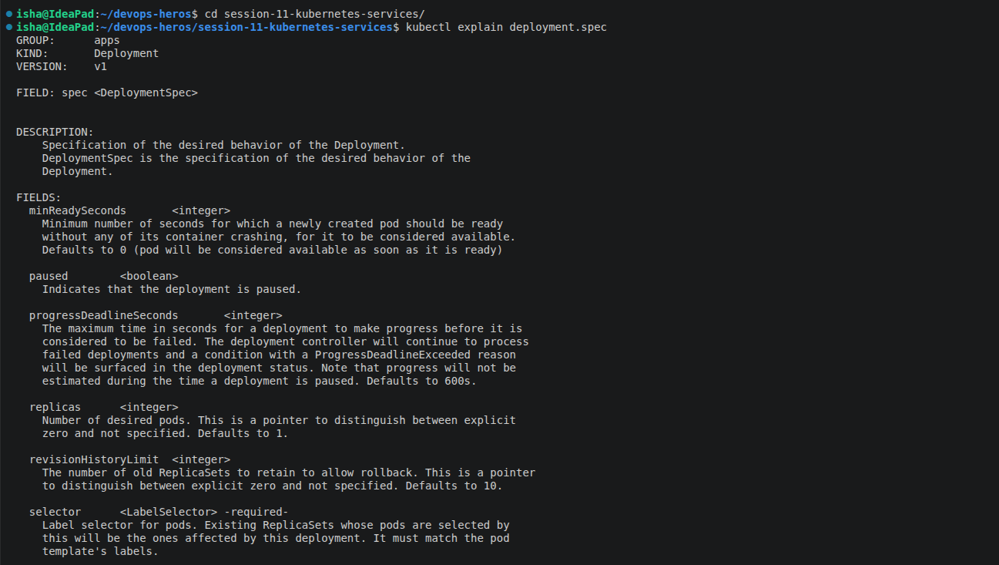
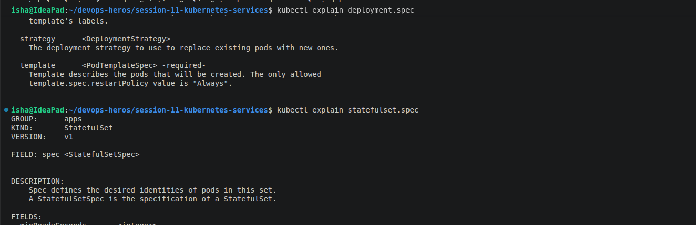
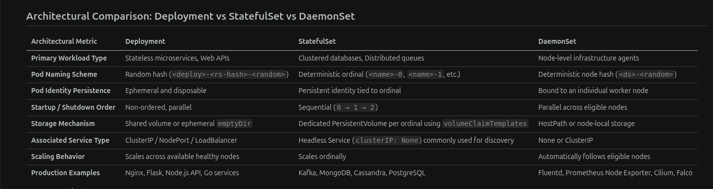
---

### Task 11: Production Cost Optimization & Service Selection Decision Tree

- **Short Description:** Document the Kubernetes Service Decision Tree and conduct a cost-optimization analysis. Detail why provisioning 50 `type: LoadBalancer` services creates an enterprise billing anti-pattern in public clouds (AWS/GCP/Azure) and demonstrate how an Ingress Controller eliminates this overhead.

#### Objective

The goal of this task is to choose the right Kubernetes Service type and avoid creating unnecessary cloud infrastructure. The main example is the difference between exposing every application with its own `LoadBalancer` service and using one external load balancer with an Ingress Controller in front of several internal `ClusterIP` services.

#### The LoadBalancer Cost Anti-Pattern

When a Service is created with `type: LoadBalancer` in a public cloud, the cloud provider normally provisions an external load balancer for it. Using one LoadBalancer service for every application can therefore create a large number of separate billing resources.

For this assignment, I am using **$25 per month per LoadBalancer as an illustrative assumption**. It is not a claim about a real deployed environment. Actual AWS, GCP, and Azure pricing varies by provider, region, load-balancer type, traffic, and additional features.

With 50 separate LoadBalancer services:

```text
50 services x $25 per LoadBalancer = $1,250 per month
```

This is an enterprise billing anti-pattern because the applications may only need different HTTP paths or hostnames. Provisioning 50 separate public entry points for that use case duplicates infrastructure and increases operational overhead.

#### Cost-Optimized Ingress Architecture

For HTTP and HTTPS applications, a better design is to provision one external LoadBalancer and place an Ingress Controller behind it. The application Services remain internal `ClusterIP` services. The Ingress Controller receives the request and routes it to the correct Service using the hostname and/or URL path.

```text
ANTI-PATTERN (Expensive: $25/mo per service):

Microservice A ──► AWS NLB 1 ($25/mo) ──► ClusterIP A
Microservice B ──► AWS NLB 2 ($25/mo) ──► ClusterIP B
Microservice C ──► AWS NLB 3 ($25/mo) ──► ClusterIP C

Total for 50 services = $1,250 / month


BEST PRACTICE (Cost-Optimized: Single Entrypoint):

Public Internet ──► 1 Unified AWS Load Balancer ($25/mo)
                 |
                 v
          [ NGINX Ingress Controller ]
          (Layer 7 Host & Path Routing)
              |       |       |
              v       v       v
           ClusterIP A ClusterIP B ClusterIP C

Total for 50 services = $25 / month
Example savings = $1,225/month
```

Using the assignment's assumption, the cost comparison is:

| Architecture | External LoadBalancers | Monthly calculation | Illustrative monthly cost |
| --- | ---: | ---: | ---: |
| One LoadBalancer per application | 50 | `50 x $25` | `$1,250` |
| One LoadBalancer with Ingress | 1 | `1 x $25` | `$25` |
| Difference | 49 fewer | `$1,250 - $25` | `$1,225` |

The example saving is therefore **$1,225 per month**. This calculation only uses the assignment's simplified LoadBalancer assumption; real cloud bills must be checked against the selected AWS, GCP, or Azure product and usage.

#### Why Ingress Works Well for HTTP/HTTPS

Ingress is useful when several web applications can share one external entry point:

- **Layer 7 routing:** It understands HTTP and HTTPS requests instead of forwarding only at the network level.
- **Host-based routing:** Different hostnames can route to different Services, such as `api.example.com` and `shop.example.com`.
- **Path-based routing:** Different paths can route to different Services, such as `/api` and `/payments`.
- **Shared entry point:** Multiple applications can stay behind internal `ClusterIP` Services while clients use one public address.

This design does not mean every workload should use Ingress. Non-HTTP protocols such as some TCP or UDP workloads may need a direct LoadBalancer. The traffic type and the required exposure should determine the choice.

#### Service Selection Decision Tree

```text
Need to expose service outside cluster?
|
├── NO ──► Need direct pod-to-pod discovery (Kafka/DB)?
|          ├── YES ──► Use HEADLESS SERVICE (clusterIP: None)
|          └── NO  ──► Use CLUSTERIP (Default)
|
└── YES ──► Connecting to an external 3rd-party domain (AWS RDS / Stripe)?
        ├── YES ──► Use EXTERNALNAME
        └── NO  ──► Are you on Public Cloud (AWS/GCP/Azure)?
                 ├── YES (HTTP/HTTPS) ──► Expose 1 INGRESS via LOADBALANCER,
                 |                        apps as internal CLUSTERIP
                 ├── YES (TCP/UDP)    ──► Direct LOADBALANCER
                 └── NO (On-Prem/Dev) ──► NODEPORT
```

#### Service Selection Summary

| Situation | Recommended Service or entry point | Reason |
| --- | --- | --- |
| Internal service discovery with a normal virtual IP | `ClusterIP` | Default choice for services used inside the cluster |
| Direct discovery of individual Pods | Headless Service (`clusterIP: None`) | Returns Pod addresses instead of one Service virtual IP |
| Alias for an external domain | `ExternalName` | Provides an internal DNS name for an external target |
| Public HTTP/HTTPS application in AWS/GCP/Azure | One Ingress through a LoadBalancer | Shares one external entry point and routes at Layer 7 |
| Public TCP/UDP application | Direct `LoadBalancer` | Suitable when HTTP/HTTPS Ingress routing does not apply |
| On-premises or local development exposure | `NodePort` | Exposes the service through a port on the cluster nodes |

- **Screenshot**

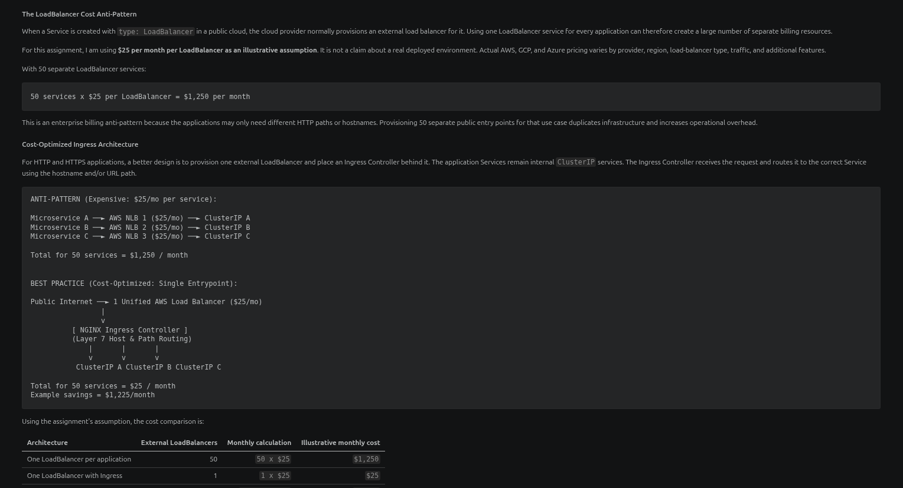
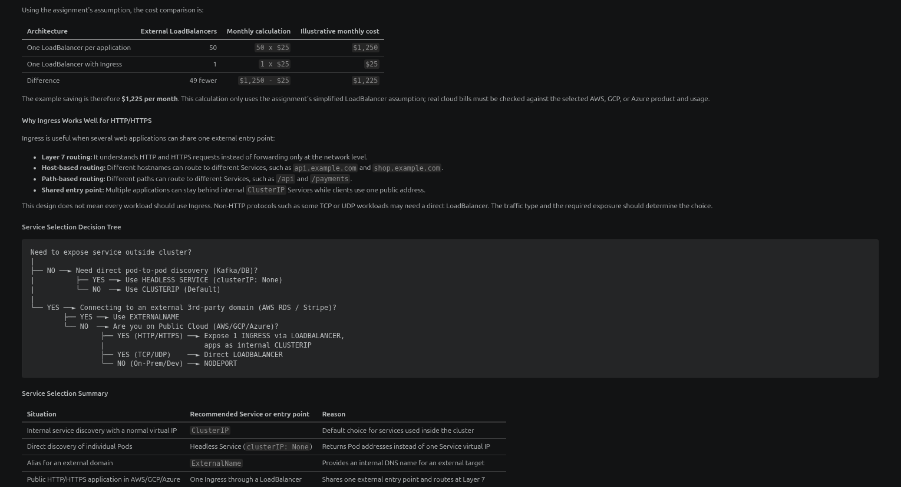

---

### Task 12: Minikube Docker-Driver Port Binding & Tunnel Gotcha Analysis

- **Short Description:** Analyze and document why running `curl http://<Node-IP>:<NodePort>` fails on macOS and Windows when using Minikube with the Docker driver. Execute and verify the two standard operational solutions: the temporary network forwarder (`minikube service <svc> --url`) and the continuous Layer 3 routing daemon (`minikube tunnel`).


### 12.1 Root Cause

In a standard bare-metal Kubernetes cluster, the worker node IP belongs directly to a physical or virtual network interface that is reachable from the surrounding network.

With Minikube using the Docker driver, the Kubernetes node runs inside a Docker container. The Minikube node IP belongs to an internal Docker networking environment rather than directly to the host's physical network interface.

Because of this, direct access using:

```bash
curl http://<NODE-IP>:<NodePort>
```

can behave differently depending on the host operating system and Docker networking configuration.

This is particularly important on macOS and Windows, where the Docker networking layer introduces additional isolation between the host and the Minikube node.

### 12.2 Verify the NodePort Service

First, I verified that the NodePort Service was active:

```bash
kubectl get svc web-service-nodeport
```

Example:

```text
NAME                  TYPE       CLUSTER-IP      EXTERNAL-IP   PORT(S)
web-service-nodeport  NodePort   10.x.x.x        <none>        80:30080/TCP
```

The important part is:

```text
80:30080/TCP
```

which means that port 30080 is exposed as the NodePort.

### 12.3 Test Direct NodePort Access

I obtained the Minikube node IP using:

```bash
minikube ip
```

Then I tested the NodePort directly:

```bash
NODE_IP=$(minikube ip)

echo "Testing direct connection to ${NODE_IP}:30080..."

curl --connect-timeout 2 -s http://${NODE_IP}:30080 || echo "Connection Failed"
```

**Result:**

The result of this test depends on the host OS and Docker networking configuration.

Since this task was performed on Linux, the actual output from the local environment was recorded instead of assuming that the connection would fail.

### 12.4 Workaround 1: `minikube service --url`

Minikube provides a convenient way to access a Service through a locally forwarded URL.

I ran:

```bash
minikube service web-service-nodeport --url
```

Minikube returned a local URL similar to:

```text
http://127.0.0.1:<generated-port>
```

The generated URL can then be tested using:

```bash
curl http://127.0.0.1:<generated-port>
```

For example:

```bash
curl -I http://127.0.0.1:<generated-port>
```

The exact port is generated by Minikube and may be different on different runs.

#### Why This Works

minikube service --url provides a local access path from the host to the Kubernetes Service, avoiding the need to directly route traffic to the internal Minikube node IP.

### 12.5 Workaround 2: `minikube tunnel`

Another solution is to use the Minikube tunnel.

In a separate terminal, I started:

```bash
minikube tunnel
```

The tunnel may require administrator privileges because it modifies the host's networking/routing configuration.

The tunnel terminal should remain running while testing connectivity.

In the primary terminal, the Service can then be checked using:

```bash
kubectl get svc web-service-nodeport
```

and connectivity can be tested with:

```bash
curl -I http://localhost:30080
```

The exact behavior depends on the Service configuration and the networking environment.

#### Why This Works

minikube tunnel provides additional host-to-cluster networking support by creating routes that allow traffic to reach services running inside the Minikube environment.

This makes it useful when normal Docker-driver networking does not provide the required direct connectivity.

### 12.6 Comparison of the Two Solutions

| Method | Purpose | How it works |
| --- | --- | --- |
| `minikube service <service> --url` | Temporary/local access | Creates a local URL that forwards traffic to the Kubernetes Service |
| `minikube tunnel` | Host-to-cluster routing | Creates networking routes that allow the host to reach supported Minikube services |

### 12.7 Conclusion

The Docker driver places the Minikube Kubernetes node inside a Docker networking environment. Because of this additional network layer, accessing a NodePort through the Minikube node IP can behave differently depending on the host operating system.

Two useful operational solutions are:

```bash
minikube service web-service-nodeport --url
minikube tunnel
```

The first provides a convenient local URL for accessing a Service, while the second provides additional routing between the host and the Minikube environment.
#### Screenshot

The screenshot should show the NodePort verification, the direct NodePort test, and the two Minikube workarounds. It should also include the comparison table showing the different purposes of `minikube service --url` and `minikube tunnel`.

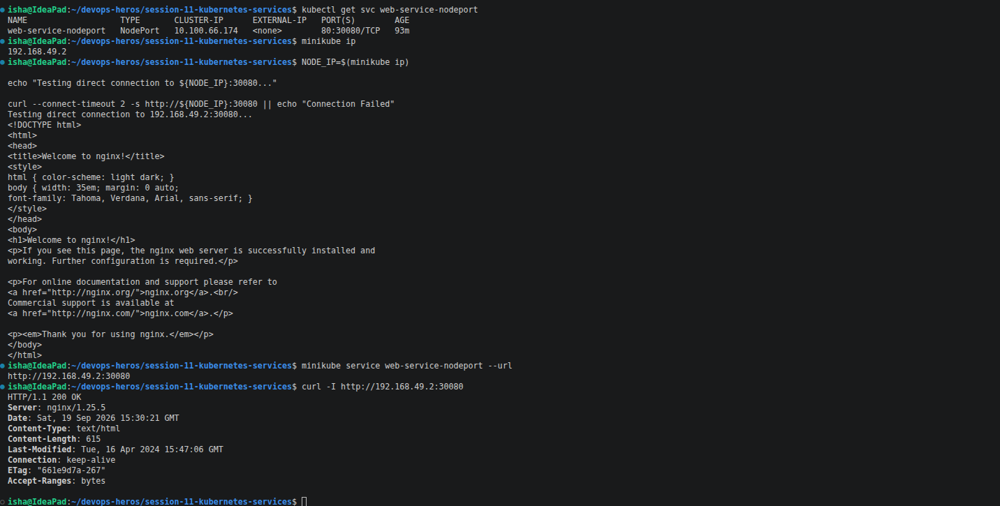
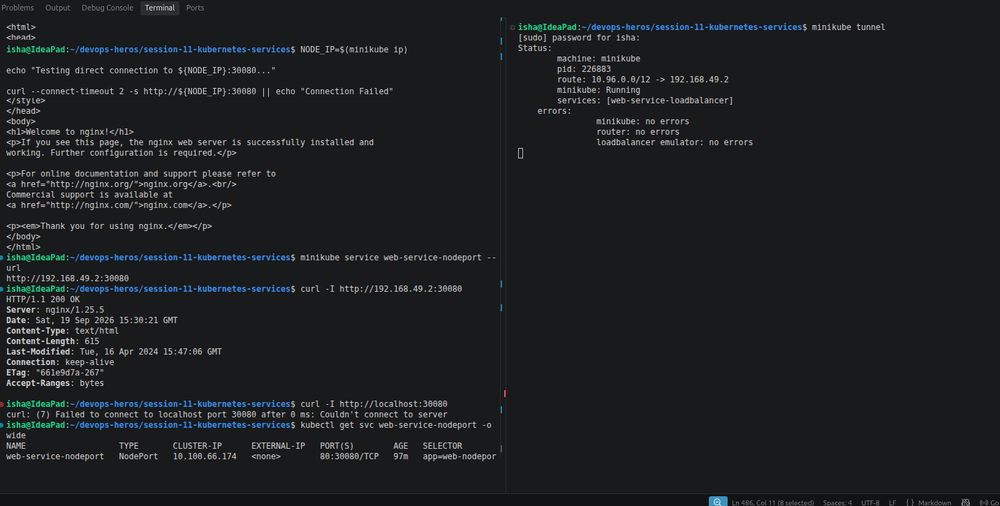

---