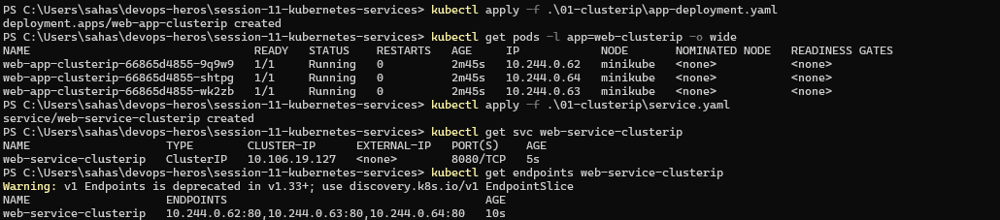
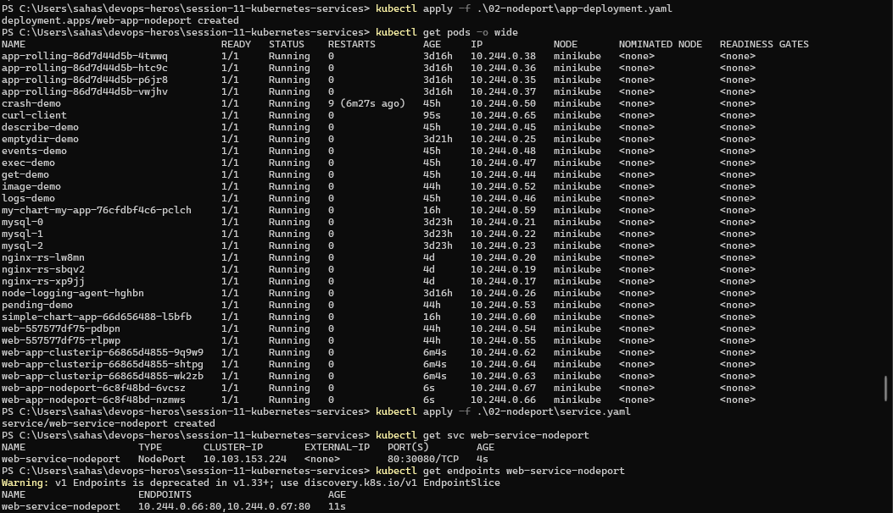
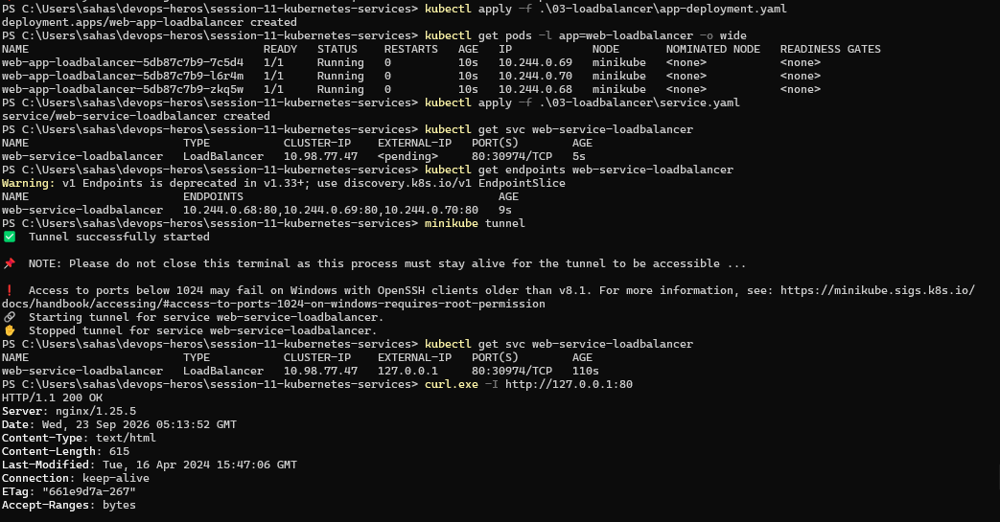
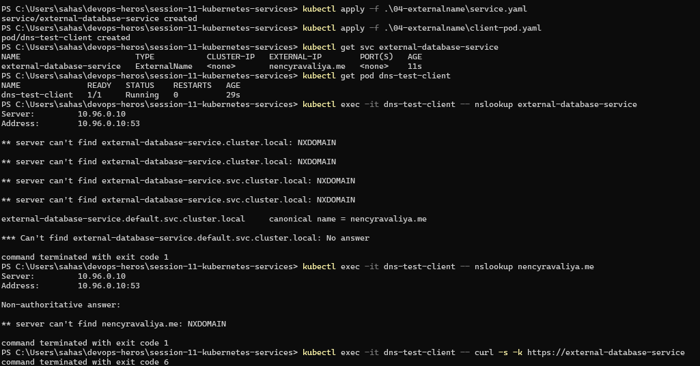
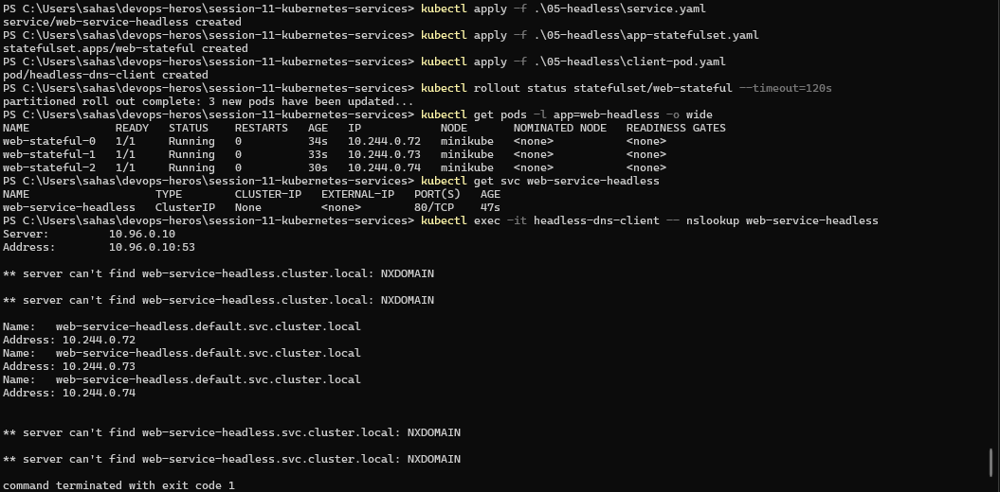
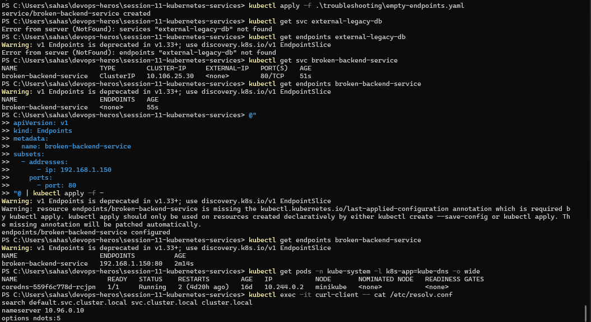
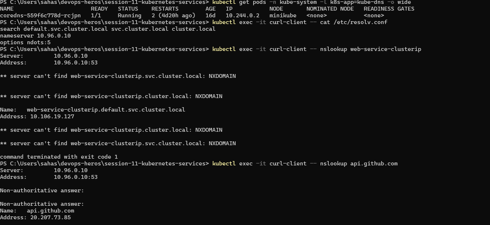
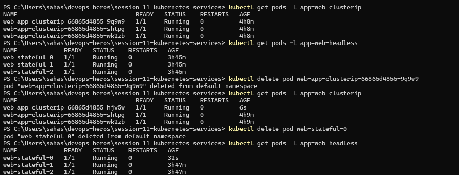
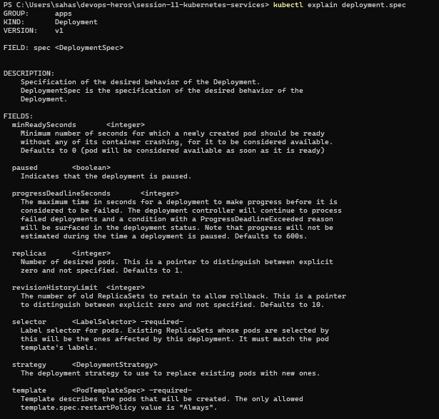
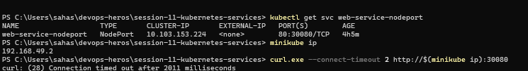

# Session 11 – Kubernetes Services

## Overview

This session focuses on Kubernetes Services and how they provide networking, service discovery, DNS resolution, and external access to applications.

The practical work includes ClusterIP, NodePort, LoadBalancer, ExternalName, Headless Services, Services without selectors, CoreDNS, Pod identity, workload controller comparison, Service selection, and Minikube networking.

## Objectives

- Understand Kubernetes Service networking.
- Understand `containerPort`, `targetPort`, `port`, and `nodePort`.
- Create and test ClusterIP, NodePort, and LoadBalancer Services.
- Understand ExternalName and Headless Services.
- Configure and inspect Services without selectors.
- Understand Kubernetes DNS and FQDN resolution.
- Compare Deployment and StatefulSet Pod identity.
- Compare Deployment, StatefulSet, and DaemonSet.
- Understand Service selection and cost optimization.
- Troubleshoot NodePort access with Minikube Docker driver.

## Environment

- OS: Windows 11
- Shell: PowerShell
- Kubernetes Cluster: Minikube
- kubectl Client Version: v1.34.1
- Kubernetes Server Version: v1.37.0

---

## 1. Kubernetes Port Architecture

### Objective

Understand the difference between:

- `containerPort`
- `targetPort`
- `port`
- `nodePort`

### Commands Used

```powershell
kubectl explain pod.spec.containers.ports.containerPort

kubectl explain service.spec.ports

kubectl get svc web-service-nodeport
```

### Port Definitions

| Port | Description |
|---|---|
| `containerPort` | Port on which the application inside the container listens |
| `targetPort` | Port on the Pod/container where the Service forwards traffic |
| `port` | Port exposed by the Kubernetes Service |
| `nodePort` | High port exposed on the Kubernetes node for external access |

### Traffic Flow

```text
Client
   |
   v
nodePort: 30080
   |
   v
Service port: 80
   |
   v
targetPort: 80
   |
   v
containerPort: 80
   |
   v
Nginx Application
```

### Observation

The NodePort Service used during the practical showed:

```text
NAME                   TYPE       CLUSTER-IP       EXTERNAL-IP   PORT(S)
web-service-nodeport   NodePort   10.103.153.224   <none>        80:30080/TCP
```

### Screenshot


---

## 2. ClusterIP Service

### Objective

Deploy a 3-replica Nginx application and expose it internally using a ClusterIP Service.

### Commands Used

```powershell
kubectl apply -f .\01-clusterip\app-deployment.yaml

kubectl get pods -l app=web-clusterip -o wide

kubectl apply -f .\01-clusterip\service.yaml

kubectl get svc web-service-clusterip

kubectl get endpoints web-service-clusterip
```

### Observation

Three Nginx Pods were created and reached the `Running` state.

The ClusterIP Service was created with:

```text
NAME                    TYPE        CLUSTER-IP      EXTERNAL-IP   PORT(S)
web-service-clusterip   ClusterIP   10.106.19.127   <none>        8080/TCP
```

The Service had three endpoints:

```text
10.244.0.62:80
10.244.0.63:80
10.244.0.64:80
```

### Client Pod

```powershell
kubectl apply -f .\01-clusterip\client-pod.yaml
```

### Service Name Test

```powershell
kubectl exec -it curl-client -- curl -s http://web-service-clusterip:8080
```

The request returned the Nginx Welcome page.

### ClusterIP Test

```powershell
kubectl exec -it curl-client -- curl -s http://10.106.19.127:8080
```

The request returned the Nginx Welcome page.

### FQDN Test

```powershell
kubectl exec -it curl-client -- curl -s http://web-service-clusterip.default.svc.cluster.local:8080
```

The request returned the Nginx Welcome page.

### Observation

ClusterIP connectivity was successfully verified using:

- Service name
- ClusterIP
- Full FQDN

A deprecation warning for the Endpoints API was displayed by the current Kubernetes version, but the Service worked correctly.

### Screenshot



---

### Screenshot

.png)

---

## 3. NodePort Service

### Objective

Expose an Nginx application externally using a NodePort Service.

### Commands Used

```powershell
kubectl apply -f .\02-nodeport\app-deployment.yaml

kubectl get pods -o wide

kubectl apply -f .\02-nodeport\service.yaml

kubectl get svc web-service-nodeport

kubectl get endpoints web-service-nodeport
```

### Observation

Two NodePort application Pods were created successfully.

The Service showed:

```text
NAME                   TYPE       CLUSTER-IP       EXTERNAL-IP   PORT(S)
web-service-nodeport   NodePort   10.103.153.224   <none>        80:30080/TCP
```

The Service was connected to two Pod endpoints:

```text
10.244.0.66:80
10.244.0.67:80
```

### Minikube Service Access

```powershell
minikube service web-service-nodeport --url
```

Minikube generated a temporary localhost URL.

An example URL generated during the practical was:

```text
http://127.0.0.1:62070
```

The Nginx Welcome page was successfully accessed through the generated Minikube URL.

### Screenshot



---

## 4. LoadBalancer Service

### Objective

Deploy a LoadBalancer Service and use `minikube tunnel` to simulate an external load balancer.

### Commands Used

```powershell
kubectl apply -f .\03-loadbalancer\app-deployment.yaml

kubectl get pods -l app=web-loadbalancer -o wide

kubectl apply -f .\03-loadbalancer\service.yaml

kubectl get svc web-service-loadbalancer

kubectl get endpoints web-service-loadbalancer
```

### Observation

Three LoadBalancer application Pods were running successfully.

Initially, the Service showed:

```text
EXTERNAL-IP   <pending>
```

This changed after starting the Minikube tunnel.

### Start Minikube Tunnel

In a separate PowerShell window:

```powershell
minikube tunnel
```

### Verify External IP

```powershell
kubectl get svc web-service-loadbalancer
```

The Service then showed:

```text
NAME                       TYPE           CLUSTER-IP    EXTERNAL-IP   PORT(S)
web-service-loadbalancer   LoadBalancer   10.98.77.47   127.0.0.1     80:30974/TCP
```

### Endpoints

```text
10.244.0.68:80
10.244.0.69:80
10.244.0.70:80
```

### Observation

The `minikube tunnel` process assigned `127.0.0.1` as the external IP for the LoadBalancer Service.

### Screenshot



---

## 5. ExternalName Service

### Objective

Create an ExternalName Service that acts as a DNS alias to an external domain.

### Commands Used

```powershell
kubectl apply -f .\04-externalname\service.yaml

kubectl apply -f .\04-externalname\client-pod.yaml

kubectl get svc external-database-service
```

### Observation

The Service was created as:

```text
NAME                        TYPE           CLUSTER-IP   EXTERNAL-IP        PORT(S)
external-database-service   ExternalName   <none>       nencyravaliya.me   <none>
```

The Service had no ClusterIP.

### DNS Test

```powershell
kubectl exec -it dns-test-client -- nslookup external-database-service
```

The important part of the output was:

```text
external-database-service.default.svc.cluster.local
    canonical name = nencyravaliya.me
```

This confirmed that the Kubernetes DNS name was configured as a CNAME pointing to `nencyravaliya.me`.

A separate direct lookup of `nencyravaliya.me` returned `NXDOMAIN` from the test environment, so the external target itself was not independently resolved.

### Observation

The ExternalName CNAME mapping was successfully demonstrated.

### Screenshot



---

## 6. Headless Service

### Objective

Deploy a StatefulSet with a Headless Service and verify that DNS returns individual Pod IPs rather than a single ClusterIP.

### Commands Used

```powershell
kubectl apply -f .\05-headless\service.yaml

kubectl apply -f .\05-headless\app-statefulset.yaml

kubectl apply -f .\05-headless\client-pod.yaml

kubectl rollout status statefulset/web-stateful --timeout=120s

kubectl get pods -l app=web-headless -o wide

kubectl get svc web-service-headless
```

### Observation

The StatefulSet created three Pods:

```text
web-stateful-0   10.244.0.72
web-stateful-1   10.244.0.73
web-stateful-2   10.244.0.74
```

The Headless Service showed:

```text
NAME                   TYPE        CLUSTER-IP   EXTERNAL-IP   PORT(S)
web-service-headless   ClusterIP   None         <none>        80/TCP
```

The `CLUSTER-IP: None` value confirmed that this was a Headless Service.

### DNS Test

```powershell
kubectl exec -it headless-dns-client -- nslookup web-service-headless
```

DNS returned the individual Pod IPs:

```text
10.244.0.72
10.244.0.73
10.244.0.74
```

### Direct Pod Access

```powershell
kubectl exec -it headless-dns-client -- curl -s http://web-stateful-0.web-service-headless
```

The command returned the Nginx Welcome page.

### Observation

The Headless Service provided direct Pod discovery instead of a single virtual IP.

### Screenshot



---

## 7. Services Without Selectors

### Objective

Create a Service without a selector and manually attach an external endpoint.

### Apply Service

```powershell
kubectl apply -f .\troubleshooting\empty-endpoints.yaml
```

The repository manifest created:

```text
broken-backend-service
```

### Verify Service

```powershell
kubectl get svc broken-backend-service
```

The Service showed:

```text
NAME                     TYPE        CLUSTER-IP     EXTERNAL-IP   PORT(S)
broken-backend-service   ClusterIP   10.106.25.30   <none>        80/TCP
```

### Check Initial Endpoints

```powershell
kubectl get endpoints broken-backend-service
```

Initially:

```text
ENDPOINTS   <none>
```

This happened because the Service did not have a selector.

### Create Manual Endpoint

```powershell
@"
apiVersion: v1
kind: Endpoints
metadata:
  name: broken-backend-service
subsets:
  - addresses:
      - ip: 192.168.1.150
    ports:
      - port: 80
"@ | kubectl apply -f -
```

### Verify Endpoint

```powershell
kubectl get endpoints broken-backend-service
```

The Service then showed:

```text
192.168.1.150:80
```

### Observation

A Service without a selector can be manually connected to an external backend using an Endpoints object.

A deprecation warning for the Endpoints API was displayed by the current Kubernetes version.

### Screenshot



---

## 8. FQDN and CoreDNS

### Objective

Inspect Kubernetes DNS configuration and understand Service-name resolution and FQDNs.

### Check CoreDNS

```powershell
kubectl get pods -n kube-system -l k8s-app=kube-dns -o wide
```

### Observation

The CoreDNS Pod was running:

```text
coredns-559f6c778d-rcjpn   1/1   Running
```

### Inspect DNS Configuration

```powershell
kubectl exec -it curl-client -- cat /etc/resolv.conf
```

The output was:

```text
search default.svc.cluster.local svc.cluster.local cluster.local
nameserver 10.96.0.10
options ndots:5
```

### Explanation

- `nameserver 10.96.0.10` is the Kubernetes DNS Service.
- The `search` domains allow Kubernetes short names to be expanded.
- `ndots:5` controls how DNS queries are processed before attempting the fully qualified name.

### Test Service DNS

```powershell
kubectl exec -it curl-client -- nslookup web-service-clusterip
```

The Service successfully resolved to:

```text
web-service-clusterip.default.svc.cluster.local
Address: 10.106.19.127
```

Additional `NXDOMAIN` responses were produced during the DNS search attempts.

### Test External DNS

```powershell
kubectl exec -it curl-client -- nslookup api.github.com
```

The external domain successfully resolved during the practical.

### Screenshot



---

## 9. Deployment vs StatefulSet Pod Identity

### Objective

Compare the Pod identity behavior of a Deployment and a StatefulSet.

### Deployment Pods

```powershell
kubectl get pods -l app=web-clusterip
```

Initial Pods included:

```text
web-app-clusterip-66865d4855-9q9w9
web-app-clusterip-66865d4855-shtpg
web-app-clusterip-66865d4855-wk2zb
```

### Delete Deployment Pod

```powershell
kubectl delete pod web-app-clusterip-66865d4855-9q9w9
```

### Verify Replacement

```powershell
kubectl get pods -l app=web-clusterip
```

The deleted Pod was replaced with:

```text
web-app-clusterip-66865d4855-hjv5w
```

The replacement received a new Pod name.

### StatefulSet Pods

```powershell
kubectl get pods -l app=web-headless
```

The Pods were:

```text
web-stateful-0
web-stateful-1
web-stateful-2
```

### Delete StatefulSet Pod

```powershell
kubectl delete pod web-stateful-0
```

### Verify Recreation

```powershell
kubectl get pods -l app=web-headless
```

The Pod was recreated with the same name:

```text
web-stateful-0
```

### Observation

The practical demonstrated:

- Deployment Pods receive new generated identities when replaced.
- StatefulSet Pods retain stable ordinal identities.

### Screenshot



---

## 10. Deployment vs StatefulSet vs DaemonSet

### Objective

Compare the architecture and behavior of Deployment, StatefulSet, and DaemonSet controllers.

### Commands Used

```powershell
kubectl explain deployment.spec

kubectl explain statefulset.spec

kubectl explain daemonset.spec
```

### Architectural Comparison

| Architectural Metric | Deployment | StatefulSet | DaemonSet |
|---|---|---|---|
| Primary Workload | Stateless applications | Stateful applications | Node-level agents |
| Pod Naming | Random ReplicaSet-based name | Stable ordinal name | Generated DaemonSet name |
| Pod Identity | Ephemeral | Stable | Associated with node placement |
| Startup | Generally parallel | Ordered by default | Distributed across eligible nodes |
| Storage | Ephemeral/shared storage | Persistent storage supported | Often node-local/host storage |
| Service Pattern | ClusterIP / NodePort / LoadBalancer | Headless Service commonly used | Service optional |
| Scaling | Arbitrary replica count | Ordered ordinal scaling | Changes with eligible nodes |
| Examples | Nginx, Flask, Node.js | Kafka, MongoDB, PostgreSQL | Node Exporter, Fluentd |

### Deployment

Deployments are mainly used for stateless workloads where Pods can be replaced freely.

### StatefulSet

StatefulSets provide stable Pod names and identities and can use persistent storage through `volumeClaimTemplates`.

### DaemonSet

DaemonSets create one Pod on every eligible node according to the scheduling configuration.

### Screenshot



---


.png)

---


## 11. Service Selection and Cost Optimization

### Objective

Understand how to choose the appropriate Kubernetes Service type based on the networking requirement.

### Service Selection Decision Tree

```text
Need to expose the service outside the cluster?
│
├── NO
│   │
│   ├── Need direct Pod-to-Pod discovery?
│   │     ├── YES → HEADLESS SERVICE
│   │     └── NO  → CLUSTERIP
│
└── YES
    │
    ├── Connecting to an external third-party domain?
    │     ├── YES → EXTERNALNAME
    │     └── NO
    │
    ├── Public Cloud?
    │     ├── HTTP/HTTPS → INGRESS + LOADBALANCER
    │     └── TCP/UDP    → LOADBALANCER
    │
    └── Local / On-Prem Development
          └── NODEPORT
```

### Service Comparison

| Service Type | Main Purpose |
|---|---|
| ClusterIP | Internal Service-to-Service communication |
| NodePort | External access through a Node port |
| LoadBalancer | External load-balancer access |
| ExternalName | DNS alias to an external domain |
| Headless | Direct Pod discovery |

### Cost Optimization Concept

Using a separate external LoadBalancer for every application can increase infrastructure cost and operational overhead.

A common architecture is to use one external entry point and route traffic to multiple internal ClusterIP Services.

```text
Internet
   |
   v
LoadBalancer
   |
   v
Ingress Controller
   |
   +----> ClusterIP A
   |
   +----> ClusterIP B
   |
   +----> ClusterIP C
```

This allows multiple applications to share one external entry point.


## 12. Minikube Docker Driver Networking

### Objective

Understand why directly accessing the Minikube Node IP and NodePort may fail when using the Docker driver on Windows, and demonstrate Minikube's service proxy workaround.

### Verify NodePort

```powershell
kubectl get svc web-service-nodeport
```

The Service showed:

```text
NAME                   TYPE       CLUSTER-IP       EXTERNAL-IP   PORT(S)
web-service-nodeport   NodePort   10.103.153.224   <none>        80:30080/TCP
```

### Get Minikube IP

```powershell
minikube ip
```

Output:

```text
192.168.49.2
```

### Direct NodePort Test

```powershell
curl.exe --connect-timeout 2 http://$(minikube ip):30080
```

The connection timed out:

```text
curl: (28) Connection timed out after 2011 milliseconds
```

### Minikube Service Workaround

```powershell
minikube service web-service-nodeport --url
```

Minikube generated a temporary localhost URL.

The URL used for the successful final test was:

```text
http://127.0.0.1:64361
```

The terminal running the command had to remain open because the temporary proxy was maintained by that process.

### Test Generated URL

```powershell
curl.exe -I http://127.0.0.1:64361
```

### Successful Output

```text
HTTP/1.1 200 OK
Server: nginx/1.25.5
Date: Wed, 23 Sep 2026 09:18:53 GMT
Content-Type: text/html
Content-Length: 615
Last-Modified: Tue, 16 Apr 2024 15:47:06 GMT
Connection: keep-alive
ETag: "661e9d7a-267"
Accept-Ranges: bytes
```

### Minikube Tunnel

The LoadBalancer practical also used:

```powershell
minikube tunnel
```

The LoadBalancer Service then received:

```text
EXTERNAL-IP   127.0.0.1
```

### Observation

The practical demonstrated that:

- Direct access through `192.168.49.2:30080` timed out.
- Minikube's local service proxy successfully forwarded traffic to the NodePort.
- The local proxy returned `HTTP/1.1 200 OK`.

### Screenshot



---

## 13. Summary

In this session, I practiced Kubernetes networking, Service discovery, DNS, and workload identity.

I worked with:

- ClusterIP
- NodePort
- LoadBalancer
- ExternalName
- Headless Services
- Services without selectors
- CoreDNS and FQDN
- Deployments
- StatefulSets
- DaemonSets
- Minikube networking

I also observed how Kubernetes automatically connects Services to Pod endpoints, how Headless Services provide direct Pod discovery, and how StatefulSets maintain stable Pod identities.

The Minikube networking practical also demonstrated the difference between direct NodePort access and the local proxy provided by `minikube service`.

---
