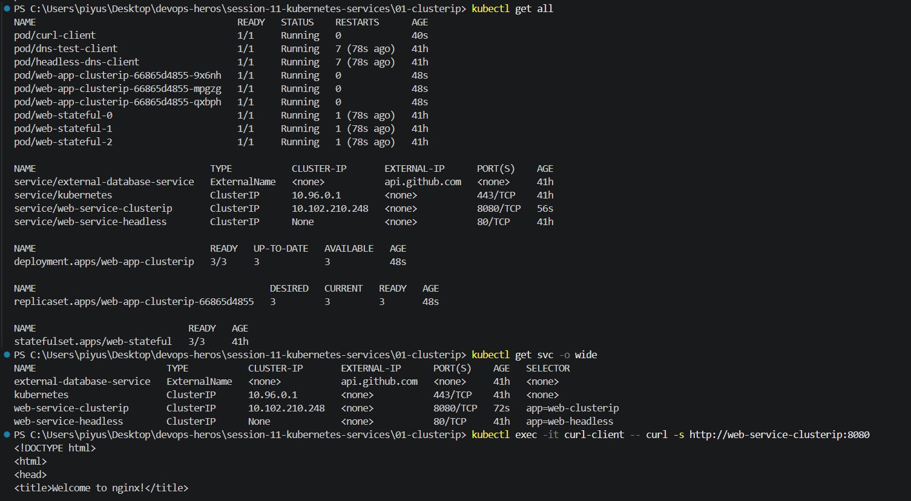
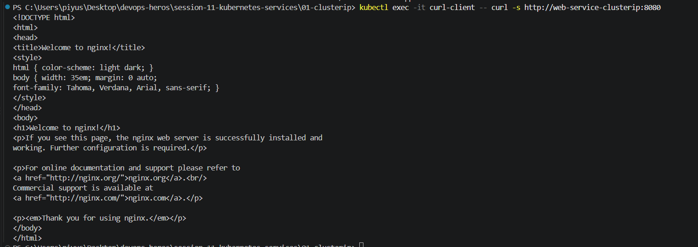
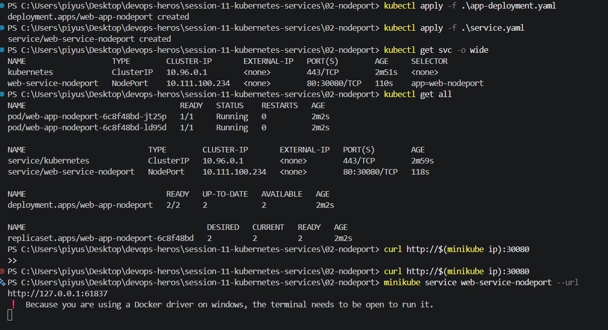
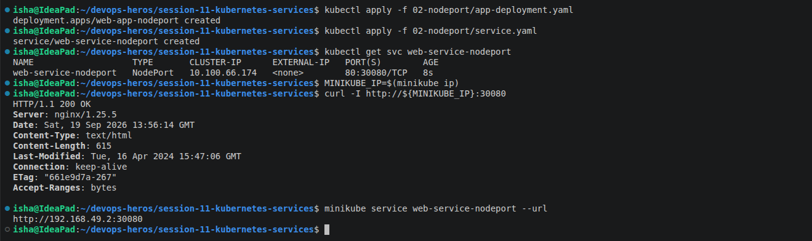
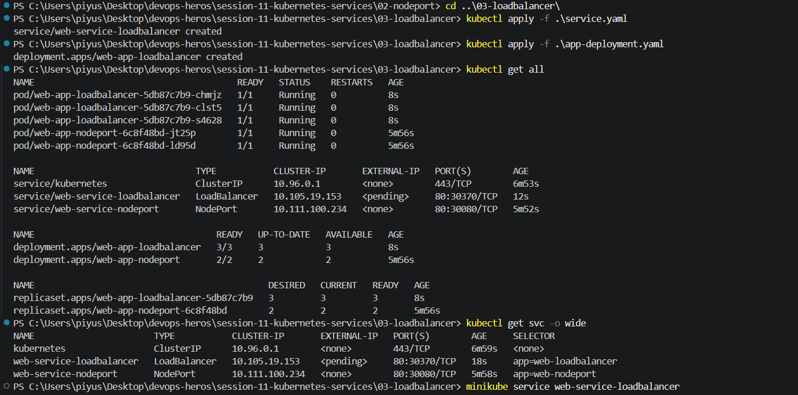
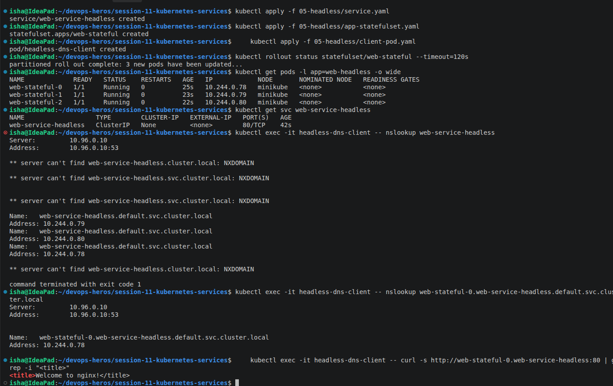
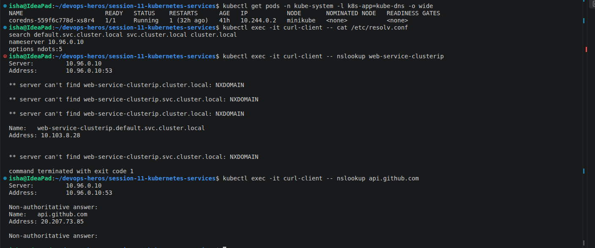
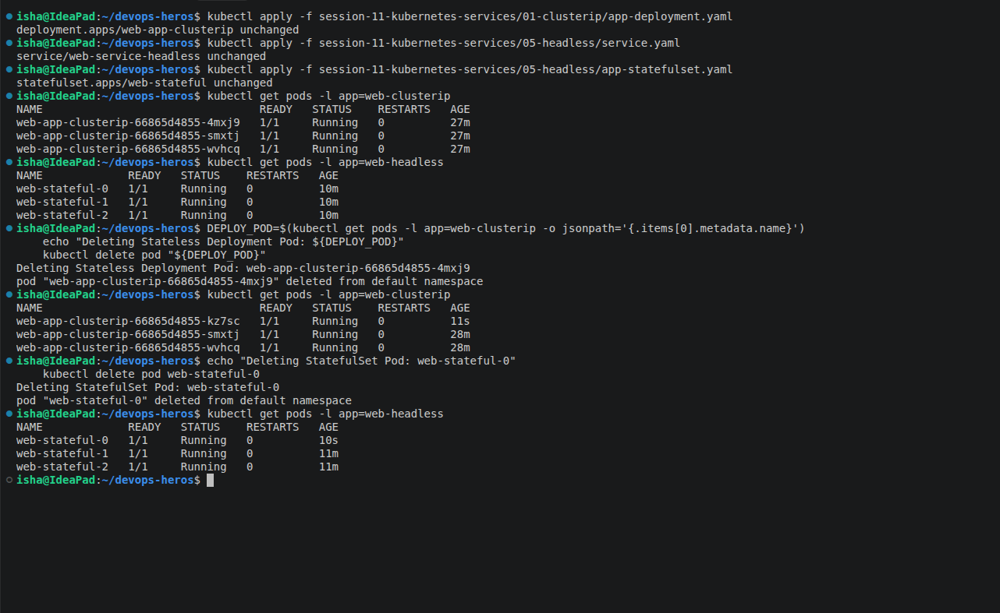
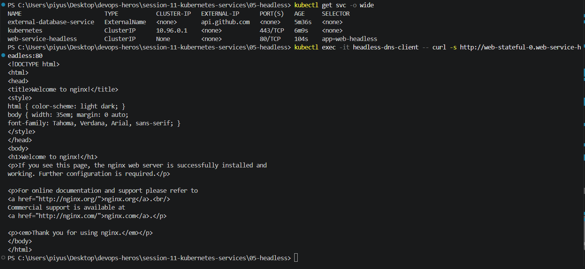
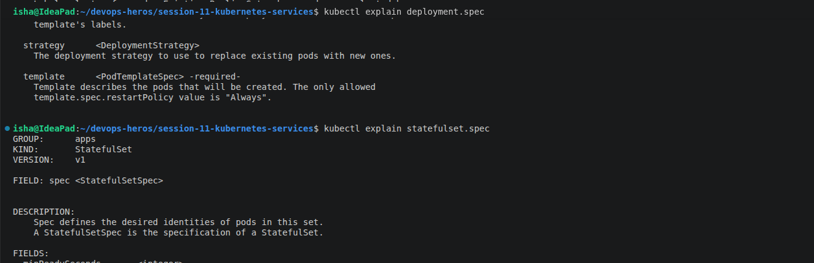

## Clusterip



## Nodeport



## Loadbalancer




## Externalname


## Headless



## All services


# Kubernetes Workloads, Services, FQDN and CoreDNS

This document explains some of the main Kubernetes objects used to run applications, manage Pods, expose applications with Services, and allow components inside a cluster to communicate using DNS.

---

## 1. Deployment vs ReplicaSet

A **Deployment** and a **ReplicaSet** work together, but they are responsible for different things. A ReplicaSet mainly makes sure that the desired number of Pods are running. A Deployment works at a higher level and is used to manage the application, especially when updating versions or rolling back to an older version.

| Feature | Deployment | ReplicaSet |
|---|---|---|
| Purpose | Manages application versions and Pods | Keeps the required number of Pods running |
| Pod management | Manages ReplicaSets, which manage Pods | Directly manages Pods |
| Scaling | Supports scaling | Supports scaling |
| Rolling updates | Supported | Not handled by itself |
| Rollback | Supported | Not normally used for rollback |
| Main use | Managing the application lifecycle | Maintaining Pod replicas |

For example, suppose a ReplicaSet is configured to run 3 replicas. Kubernetes will continuously try to keep 3 Pods available. If one Pod crashes or gets deleted, the ReplicaSet creates a replacement.

A Deployment sits one level above the ReplicaSet. Normally, the Deployment creates a ReplicaSet, and that ReplicaSet creates the Pods. This becomes useful when the application needs to be updated. During a rolling update, the Deployment creates a new ReplicaSet for the new version and gradually replaces the Pods from the old ReplicaSet.

The relationship can be visualized like this:

```text
Deployment
    |
    +---- ReplicaSet
             |
             +---- Pod
             +---- Pod
             +---- Pod
```

A simple way to remember the difference is:

**ReplicaSet = makes sure the required number of Pods are running**

**Deployment = manages ReplicaSets, updates, and rollbacks**

---

# 2. Deployment vs DaemonSet vs StatefulSet

These three are all Kubernetes workload objects, but each one is meant for a different kind of use case.

| Feature | Deployment | DaemonSet | StatefulSet |
|---|---|---|---|
| Main use | Stateless applications | Node-level applications | Stateful applications |
| Pod creation | Creates Pods through ReplicaSets | Creates Pods on nodes | Creates Pods with stable identities |
| Scaling | Based on replica count | Usually based on number of nodes | Based on replica count |
| Pod identity | Pods are generally interchangeable | Pods are generally interchangeable | Each Pod has a stable name |
| Networking | Usually accessed through a Service | Can use a Service | Often uses a headless Service |
| Storage | Usually external/shared storage | Depends on application | Persistent storage per Pod |
| Examples | Web server, REST API | Log collector, monitoring agent | Database, Kafka |

### Deployment

A Deployment is commonly used for normal stateless applications. For example, if an application needs 5 identical web server Pods, a Deployment can create and maintain them. If one Pod goes down, Kubernetes replaces it.

Deployments are also useful when the application is updated because Kubernetes can perform a rolling update instead of replacing every Pod at once. They also make it possible to roll back to an earlier version if something goes wrong.

### DaemonSet

A DaemonSet is mainly used when a particular Pod needs to run on every node, or on a selected set of nodes. When a new node joins the cluster, Kubernetes can automatically create the required Pod there as well.

This is useful for things like log collectors, monitoring agents, and some networking components. For example, if every node needs a logging agent, a DaemonSet can make sure there is one on each node.

```text
Node 1 --> Logging Pod
Node 2 --> Logging Pod
Node 3 --> Logging Pod
```

Because of this, the number of Pods in a DaemonSet normally depends on how many eligible nodes there are, rather than on a manually chosen replica count.

### StatefulSet

A StatefulSet is useful when Pods need stable identities or their own persistent storage. Unlike a Deployment, where Pods are mostly interchangeable, StatefulSet Pods have predictable names.

For example:

```text
database-0
database-1
database-2
```

Each Pod can also have persistent storage associated with it. This makes StatefulSets a good fit for databases and other applications where the identity and data of each Pod matter.

---

# 3. ReplicaSet vs Service

A ReplicaSet and a Service solve two completely different problems.

A **ReplicaSet is responsible for keeping the correct number of Pods running**, while a **Service provides a stable way to reach those Pods over the network**.

| Feature | ReplicaSet | Service |
|---|---|---|
| Main responsibility | Maintain Pod replicas | Provide network access |
| Creates Pods | Yes | No |
| Maintains number of Pods | Yes | No |
| Stable IP/DNS name | No | Yes |
| Sends traffic to Pods | No | Yes |
| Uses labels/selectors | Yes | Yes |

A Service is important because Pod IP addresses are not permanent. A Pod can be deleted and recreated, and the replacement Pod may get a different IP address. If applications depended directly on Pod IPs, communication would easily break.

A Service solves this by providing a stable IP address and DNS name. It uses labels to find the correct Pods and forwards traffic to them.

For example, suppose three Pods have this label:

```yaml
labels:
  app: nginx
```

A Service can select those Pods using:

```yaml
selector:
  app: nginx
```

The traffic flow looks roughly like this:

```text
Client Pod
    |
    v
 Service
    |
    +------> Pod 1
    |
    +------> Pod 2
    |
    +------> Pod 3
```

The Service acts as a stable entry point, while Kubernetes takes care of tracking the Pods behind it.

In simple terms:

**ReplicaSet manages the Pods.**

**Service connects clients to those Pods.**

---

# 4. FQDN in Kubernetes

## What is FQDN?

FQDN stands for **Fully Qualified Domain Name**. It is the complete DNS name used to identify a resource.

In Kubernetes, a Service can have a DNS name such as:

```text
backend.default.svc.cluster.local
```

This gives the complete location of that Service inside the Kubernetes cluster.

The usual Kubernetes Service FQDN format is:

```text
<service-name>.<namespace>.svc.cluster.local
```

For example:

```text
api.production.svc.cluster.local
```

Here:

- `api` is the Service name.
- `production` is the namespace.
- `svc` indicates that this is a Kubernetes Service.
- `cluster.local` is the cluster's DNS domain.

---

## Kubernetes Service DNS

Kubernetes automatically creates DNS records for Services. Because of this, Pods can communicate with Services using names instead of having to know their IP addresses.

For example, suppose there is a Service called:

```text
backend
```

in the `default` namespace. A Pod can reach it using:

```text
backend.default.svc.cluster.local
```

In many situations, the shorter name is enough:

```text
backend
```

when the client Pod is in the same namespace.

---

## Namespace-based DNS

Namespaces are part of the DNS name because different namespaces can have Services with the same name.

For example:

```text
api.default.svc.cluster.local
api.production.svc.cluster.local
```

These are two different Services even though both are named `api`.

The namespace helps Kubernetes identify exactly which Service the request is meant for.

---

## Pod-to-Service Communication

A Pod usually does not need to know the IP addresses of individual backend Pods. Instead, it sends the request to the Service name.

The basic flow is:

```text
Frontend Pod
     |
     | DNS request
     v
   CoreDNS
     |
     | Returns Service IP
     v
   Service
     |
     +------> Backend Pod
     +------> Backend Pod
     +------> Backend Pod
```

The Service then forwards the request to one of the Pods selected by its selector.

For example, this command can be used to check whether the Service DNS name resolves:

```bash
kubectl exec -it <pod-name> -- nslookup backend.default.svc.cluster.local
```

---

# 5. CoreDNS

## What is CoreDNS?

**CoreDNS** is the DNS server normally used by Kubernetes. Its main job is to handle DNS requests inside the cluster.

For example, when a Pod tries to access:

```text
backend.default.svc.cluster.local
```

CoreDNS helps resolve that name to the IP address of the corresponding Kubernetes Service.

Because of this, applications do not have to keep track of changing Pod IP addresses.

---

## Why Kubernetes uses CoreDNS

Kubernetes resources are dynamic. Pods can be created, deleted, restarted, and moved between nodes, so their IP addresses can change.

CoreDNS provides a stable DNS-based way to find Services. Applications can simply use:

```text
backend
```

or:

```text
backend.default.svc.cluster.local
```

instead of depending directly on a Pod IP.

---

## How Service Discovery Works

Suppose there is a Service named `backend`.

When a frontend Pod sends a request to:

```text
backend
```

the Pod performs a DNS lookup. CoreDNS receives that lookup, checks the Kubernetes cluster information, and returns the appropriate Service IP.

The process can be represented as:

```text
Frontend Pod
     |
     | DNS Query
     v
   CoreDNS
     |
     | Finds Service
     v
  Service IP
     |
     v
   Service
     |
     v
 Backend Pods
```

The Service then forwards the request to one of the selected backend Pods.

---

## How DNS Queries are Resolved

When a Pod performs a DNS lookup, its DNS configuration points to the Kubernetes DNS service.

CoreDNS receives the query and checks the cluster information to determine what the requested name represents.

For example:

```text
backend.default.svc.cluster.local
```

is resolved to the ClusterIP of the `backend` Service.

The client can then use that Service IP to communicate with the backend.

---

## CoreDNS Configuration

CoreDNS normally runs inside the `kube-system` namespace.

It can be checked with:

```bash
kubectl get pods -n kube-system
```

The output normally contains Pods with names similar to:

```text
coredns-xxxxx
coredns-yyyyy
```

The CoreDNS configuration is stored in a ConfigMap. It can be viewed using:

```bash
kubectl get configmap coredns -n kube-system -o yaml
```

The configuration contains a `Corefile`, which controls how CoreDNS handles DNS requests.

---

# 6. Troubleshooting Kubernetes DNS

If Service DNS is not working, a good first step is to check whether the CoreDNS Pods are running:

```bash
kubectl get pods -n kube-system
```

If CoreDNS is not working properly, its logs can be checked with:

```bash
kubectl logs -n kube-system -l k8s-app=kube-dns
```

The Kubernetes DNS Service can also be checked:

```bash
kubectl get svc -n kube-system
```

To test DNS from inside a Pod, run:

```bash
kubectl exec -it <pod-name> -- nslookup kubernetes.default
```

Then the application's own Service can be tested:

```bash
kubectl exec -it <pod-name> -- nslookup backend.default.svc.cluster.local
```

It is also useful to check whether the Service actually has backend Pods behind it:

```bash
kubectl get svc
kubectl get endpoints
kubectl get pods --show-labels
```

If a Service exists but has no endpoints, there is a good chance that its selector does not match the labels on the Pods.

For example, the Service might have:

```yaml
selector:
  app: backend
```

while the Pods have:

```yaml
labels:
  app: api
```

In this case, the Service will not find those Pods because the labels do not match.

---

# 7. Overall Kubernetes Communication

The concepts discussed above are connected and usually work together.

A Deployment can manage a ReplicaSet, which keeps the required number of Pods running. A Service gives those Pods a stable network endpoint, and CoreDNS allows other Pods to find the Service using its DNS name.

The complete flow can be thought of like this:

```text
                 Deployment
                     |
                 ReplicaSet
                     |
           +---------+---------+
           |         |         |
         Pod 1     Pod 2     Pod 3
           \         |         /
            \        |        /
                 Service
                    ^
                    |
                  CoreDNS
                    ^
                    |
                Client Pod
```

For example, a frontend Pod can simply send a request to:

```text
http://backend.default.svc.cluster.local
```

CoreDNS resolves the name, the request reaches the `backend` Service, and the Service forwards the request to one of the backend Pods.

This is one of the main reasons Kubernetes can handle changing Pods without forcing applications to keep track of individual Pod IP addresses.

---

# 8. Useful Commands

Here are some commands that are useful when checking these Kubernetes objects:

```bash
kubectl get pods
kubectl get deployments
kubectl get replicasets
kubectl get services
kubectl get daemonsets
kubectl get statefulsets
```

To see more details about a resource:

```bash
kubectl describe deployment <name>
kubectl describe service <name>
kubectl describe pod <name>
```

To check DNS:

```bash
kubectl exec -it <pod-name> -- nslookup kubernetes.default
kubectl exec -it <pod-name> -- nslookup <service-name>
```

To check CoreDNS:

```bash
kubectl get pods -n kube-system
kubectl get configmap coredns -n kube-system -o yaml
kubectl logs -n kube-system -l k8s-app=kube-dns
```

---

# Deliverables

The practical submission for this task should contain something like:

```text
project/
│
├── README.md
│
├── service/
│   ├── service.yaml
│   └── ...
│
├── fqdn/
│   └── README.md
│
└── coredns/
    └── README.md
```

The submission should also include the required Service YAML files, along with screenshots or terminal outputs showing that the Kubernetes objects, Services, and DNS tests are working correctly.

---

# Conclusion

Deployment, ReplicaSet, Service, StatefulSet, DaemonSet, and CoreDNS each have their own role. A Deployment manages application releases, a ReplicaSet keeps the required number of Pods running, a Service provides stable network access, a DaemonSet makes sure Pods run across the required nodes, and a StatefulSet is used when applications need stable identities and storage. CoreDNS ties the networking side together by providing DNS-based Service discovery inside the cluster.

The main idea is that Kubernetes avoids making applications depend directly on individual Pod IP addresses. Instead, Services and DNS provide stable names and access points, while Kubernetes handles the changing Pods in the background.
