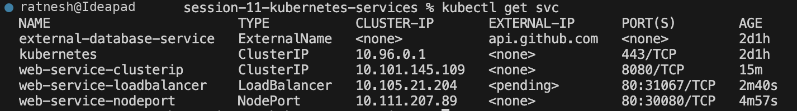

# Session 11 — Kubernetes Services

## Service Types in the Cluster

All four Service types created for this session, listed with `kubectl get svc`:
ClusterIP, NodePort, LoadBalancer and ExternalName.

