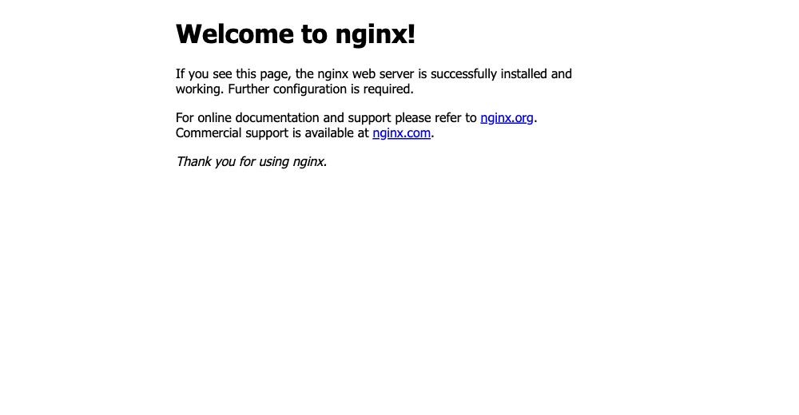

# Session 11 – Kubernetes Networking & Services

**Name:** Kushal Talati  
**Enrollment No:** 24BCS10123  
**Environment:** kind v0.33.0 cluster `kushal-lab` (Kubernetes v1.37.0, 1 control-plane + 2 workers) on Docker Desktop 29.0.1, macOS / Apple Silicon. Same cluster as [session 9](../../session9-k8s/kushal-24bcs10123). kube-proxy runs in `iptables` mode.

All five Service types from the course folders (`01-clusterip` … `05-headless`) were deployed with the professor's manifests **unmodified**. Every command was really run; raw output is in [`logs/`](logs), the exact commands in [`scripts/`](scripts).

```text
kushal-24bcs10123/
├── README.md
├── metallb-pool.yaml                 # the only extra manifest: LoadBalancer IP pool for the kind network
├── scripts/
│   ├── 01-clusterip.sh   02-nodeport.sh   03-loadbalancer.sh
│   ├── 04-externalname.sh   05-headless.sh   06-all-types-side-by-side.sh
│   └── lib.sh
└── logs/                             # one .txt per script
```

| Type | Reachable from | Gets its address from | What I proved |
|---|---|---|---|
| ClusterIP | inside the cluster only | apiserver (`10.96.0.0/12`) | curl from the Mac times out, curl from a pod works; requests spread over 3 pods; the VIP is an iptables DNAT rule |
| NodePort | any node IP : 30000-32767 | apiserver + every node's kube-proxy | all 3 nodes answer on `:30080`, including the control-plane that runs no app pod |
| LoadBalancer | an external IP | **something outside k8s** (cloud LB / MetalLB) | `<pending>` forever until MetalLB was installed, then `172.18.255.200` served traffic |
| ExternalName | inside (as a DNS alias) | CoreDNS CNAME | `nslookup` returns `canonical name = nencyravaliya.me`, no endpoints exist |
| Headless | inside | none (`clusterIP: None`) | DNS returns all 3 pod IPs; `web-stateful-0.web-service-headless` resolves to exactly one pod |

## 1. ClusterIP – the internal phone system

Log: [logs/01-clusterip.txt](logs/01-clusterip.txt)

```bash
kubectl apply -f 01-clusterip/app-deployment.yaml   # 3 x nginx
kubectl apply -f 01-clusterip/service.yaml          # port 8080 -> targetPort 80
kubectl apply -f 01-clusterip/client-pod.yaml       # curlimages/curl, to test from inside
```

```text
$ kubectl get svc web-service-clusterip
NAME                    TYPE        CLUSTER-IP     EXTERNAL-IP   PORT(S)    AGE
web-service-clusterip   ClusterIP   10.96.76.167   <none>        8080/TCP   1s

$ kubectl get endpointslices -l kubernetes.io/service-name=web-service-clusterip
NAME                          ADDRESSTYPE   PORTS   ENDPOINTS                             AGE
web-service-clusterip-v8x24   IPv4          80      10.244.3.56,10.244.1.55,10.244.1.54   1s

$ kubectl exec curl-client -- curl -s http://web-service-clusterip:8080 | grep -o '<title>.*</title>'
<title>Welcome to nginx!</title>

$ kubectl exec curl-client -- nslookup web-service-clusterip | grep -A1 '^Name'
Name:	web-service-clusterip.default.svc.cluster.local
Address: 10.96.76.167

$ kubectl exec curl-client -- cat /etc/resolv.conf
search default.svc.cluster.local svc.cluster.local cluster.local     <- why the short name works
nameserver 10.96.0.10                                                <- CoreDNS
options ndots:5

$ curl -s --max-time 3 http://10.96.76.167:8080 || echo "failed (exit $?)"
curl from the Mac to 10.96.76.167:8080 failed (exit 28) - ClusterIP is internal only
```

Load balancing – I wrote each pod's own name into its `index.html` first, otherwise all three answers look identical:

```text
$ for i in $(seq 1 12); do kubectl exec curl-client -- curl -s http://web-service-clusterip:8080; done | sort | uniq -c
   5 served-by-web-app-clusterip-66865d4855-9xl7n
   6 served-by-web-app-clusterip-66865d4855-dmrfd
   1 served-by-web-app-clusterip-66865d4855-qz5h4          <- random, not strict round-robin
```

Under the hood there is no process listening on `10.96.76.167`. kube-proxy wrote iptables rules on **every node**; the first matches the VIP, the `KUBE-SEP` rules DNAT to one pod IP each with a random probability:

```text
$ docker exec kushal-lab-worker iptables -t nat -S KUBE-SERVICES | grep 10.96.76.167
-A KUBE-SERVICES -d 10.96.76.167/32 -p tcp -m comment --comment "default/web-service-clusterip:http cluster IP" -m tcp --dport 8080 -j KUBE-SVC-TIXQXGX7DUC52XEM

$ docker exec kushal-lab-worker iptables -t nat -S | grep -E 'KUBE-SEP-.* -j DNAT' | grep web-service-clusterip
-A KUBE-SEP-7CZK4ZZCY3MLJDTE ... -j DNAT --to-destination 10.244.1.59:80
-A KUBE-SEP-KSKBX6XG6SREN75Z ... -j DNAT --to-destination 10.244.3.59:80
-A KUBE-SEP-ZGDVDJT6AMFKRVRK ... -j DNAT --to-destination 10.244.1.58:80
```

## 2. NodePort – the same door on every building

Log: [logs/02-nodeport.txt](logs/02-nodeport.txt)

```text
$ kubectl get svc web-service-nodeport
NAME                   TYPE       CLUSTER-IP    EXTERNAL-IP   PORT(S)        AGE
web-service-nodeport   NodePort   10.96.8.112   <none>        80:30080/TCP   0s

$ kubectl get pods -l app=web-nodeport -o wide
NAME                              READY   STATUS    IP            NODE
web-app-nodeport-6c8f48bd-k8sv9   1/1     Running   10.244.3.58   kushal-lab-worker
web-app-nodeport-6c8f48bd-tjhtz   1/1     Running   10.244.1.57   kushal-lab-worker2
```

From the Mac – `localhost:30080` is the control-plane node's port 30080, published by kind (the equivalent of `minikube ip`):

```text
$ curl -sI http://localhost:30080 | head -2
HTTP/1.1 200 OK
Server: nginx/1.25.5
```

Every node answers on 30080, even `kushal-lab-control-plane`, which runs **none** of the app pods – kube-proxy there forwards to a pod on a worker:

```text
kushal-lab-control-plane (172.18.0.2):30080 -> HTTP 200
kushal-lab-worker        (172.18.0.3):30080 -> HTTP 200
kushal-lab-worker2       (172.18.0.4):30080 -> HTTP 200

$ docker exec kushal-lab-control-plane iptables -t nat -S KUBE-NODEPORTS | grep 30080
-A KUBE-NODEPORTS -p tcp -m comment --comment "default/web-service-nodeport:http" -m tcp --dport 30080 -j KUBE-EXT-542ZUKRJYISRKQCS
```

The three ports, which I keep mixing up, side by side: `port=80 targetPort=80 nodePort=30080 clusterIP=10.96.8.112` – `port` is the Service's own port on the ClusterIP, `targetPort` the container's port, `nodePort` the one opened on the nodes. A NodePort Service is a ClusterIP Service plus one extra rule per node.



## 3. LoadBalancer – needs somebody outside Kubernetes

Log: [logs/03-loadbalancer.txt](logs/03-loadbalancer.txt) · Extra manifest: [metallb-pool.yaml](metallb-pool.yaml)

Kubernetes itself never hands out an external IP. On AWS/GCP the cloud-controller-manager does it; on a laptop nothing does, so the professor's manifest sits at `<pending>`:

```text
$ kubectl get svc web-service-loadbalancer
NAME                       TYPE           CLUSTER-IP     EXTERNAL-IP   PORT(S)        AGE
web-service-loadbalancer   LoadBalancer   10.96.10.110   <pending>     80:31422/TCP   5s
                                                                       ^^^^^ a LoadBalancer is a NodePort (31422) plus an external IP
```

`minikube tunnel` is minikube's way around this. On kind the equivalent tool is `cloud-provider-kind`, but on macOS it needs `sudo` to create the port forwards, so I used **MetalLB** instead – the same thing a bare-metal cluster would run. It gets a pool of addresses from the top of the docker `kind` network (`172.18.0.0/16`) and announces them with ARP (layer 2):

```text
$ kubectl apply -f https://raw.githubusercontent.com/metallb/metallb/v0.15.3/config/manifests/metallb-native.yaml
$ kubectl apply -f kushal-24bcs10123/metallb-pool.yaml       # IPAddressPool 172.18.255.200-250 + L2Advertisement

$ kubectl get pods -n metallb-system -o wide
NAME                          READY   STATUS    IP           NODE
controller-6fb545d477-tsnw7   1/1     Running   10.244.3.67  kushal-lab-worker         <- assigns IPs
speaker-6gst2 / -cl5td / -qlzks   1/1 Running  (node IPs)   one per node              <- answers ARP for them

$ kubectl get svc web-service-loadbalancer
NAME                       TYPE           CLUSTER-IP     EXTERNAL-IP      PORT(S)        AGE
web-service-loadbalancer   LoadBalancer   10.96.10.110   172.18.255.200   80:31422/TCP   57s

$ kubectl get events --field-selector involvedObject.name=web-service-loadbalancer -o custom-columns='REASON:.reason,MESSAGE:.message'
REASON         MESSAGE
IPAllocated    Assigned IP ["172.18.255.200"]
nodeAssigned   announcing from node "kushal-lab-worker2" with protocol "layer2"
```

"Outside the cluster" on my Mac is another container on the docker network (the Mac itself cannot route to `172.18.x.x` because Docker Desktop's VM sits in between):

```text
$ docker run --rm --network kind curlimages/curl:8.5.0 -s http://172.18.255.200 | grep -o '<title>.*</title>'
<title>Welcome to nginx!</title>
http://172.18.255.200 -> HTTP 200   (x3)

$ docker run --rm --network kind alpine:3.20 sh -c 'ping -c1 172.18.255.200 >/dev/null; ip neigh show 172.18.255.200'
172.18.255.200 dev eth0 lladdr 4e:2e:c2:26:87:33 REACHABLE          <- the MAC of kushal-lab-worker2, exactly as the event said
```

So the flow is: client → `172.18.255.200` (ARP answered by worker2's speaker) → kube-proxy on worker2 → one of the three pods. In the cloud the only difference is that the "speaker" is the provider's load balancer and the IP is public.

## 4. ExternalName – a CNAME inside cluster DNS

Log: [logs/04-externalname.txt](logs/04-externalname.txt)

```text
$ kubectl get svc external-database-service
NAME                        TYPE           CLUSTER-IP   EXTERNAL-IP        PORT(S)   AGE
external-database-service   ExternalName   <none>       nencyravaliya.me   <none>    0s

$ kubectl exec dns-test-client -- nslookup external-database-service | grep 'canonical name'
external-database-service.default.svc.cluster.local	canonical name = nencyravaliya.me

$ kubectl get endpointslices -l kubernetes.io/service-name=external-database-service
No resources found in default namespace.
$ docker exec kushal-lab-worker iptables -t nat -S | grep -c external-database-service
0                                    <- no VIP, no endpoints, no iptables: CoreDNS is the whole implementation
```

The professor's target `nencyravaliya.me` currently has **no DNS record** (NXDOMAIN from inside the pod and from the Mac), so `curl http://external-database-service` fails with exit 6 – the alias is only as good as its target. To see the full path I created a second one pointing at a real host:

```text
$ kubectl create service externalname external-api --external-name=api.github.com
$ kubectl exec dns-test-client -- nslookup external-api | grep 'canonical name' | head -1
external-api.default.svc.cluster.local	canonical name = api.github.com

$ curl -H 'Host: api.github.com' http://external-api        ->  HTTP 301, connected to 20.207.73.85
$ curl https://external-api                                 ->  exit 60   (certificate is for api.github.com, not for the alias)
$ curl https://api.github.com                               ->  HTTP 200
```

Use case: point `database` at an RDS hostname today and at an in-cluster StatefulSet tomorrow without changing a single app config. Gotcha (seen above): for HTTPS the client still has to use the real hostname, or TLS verification fails.

## 5. Headless – no VIP, just the pod IPs

Log: [logs/05-headless.txt](logs/05-headless.txt)

```text
$ kubectl get svc web-service-headless
NAME                   TYPE        CLUSTER-IP   EXTERNAL-IP   PORT(S)   AGE
web-service-headless   ClusterIP   None         <none>        80/TCP    2s

$ kubectl get pods -l app=web-headless -o wide
web-stateful-0   1/1   Running   10.244.3.77   kushal-lab-worker
web-stateful-1   1/1   Running   10.244.1.74   kushal-lab-worker2
web-stateful-2   1/1   Running   10.244.3.78   kushal-lab-worker

$ kubectl exec headless-dns-client -- nslookup web-service-headless | grep '^Address: 10\.'
Address: 10.244.1.74
Address: 10.244.3.77                 <- three A records = the pod IPs themselves
Address: 10.244.3.78

$ kubectl exec headless-dns-client -- nslookup web-stateful-0.web-service-headless.default.svc.cluster.local
Name:	web-stateful-0.web-service-headless.default.svc.cluster.local
Address: 10.244.3.77                 <- one pod, by name

$ kubectl exec headless-dns-client -- curl -s http://web-stateful-2.web-service-headless:80
hello from web-stateful-2
```

After `kubectl delete pod web-stateful-1` the StatefulSet recreated it with the **same name** and DNS entry but a new IP (`10.244.1.75`). For comparison I put a normal ClusterIP Service on the same pods: `nslookup web-service-normal` returned exactly one address, `10.96.223.52`.

## 6. All five side by side

Log: [logs/06-all-types-side-by-side.txt](logs/06-all-types-side-by-side.txt)

```text
$ kubectl get svc
NAME               TYPE           CLUSTER-IP      EXTERNAL-IP        PORT(S)        AGE
cmp-clusterip      ClusterIP      10.96.209.116   <none>             80/TCP         0s
cmp-nodeport       NodePort       10.96.105.21    <none>             80:32737/TCP   0s
cmp-loadbalancer   LoadBalancer   10.96.44.27     <pending>          80:30701/TCP   0s   <- MetalLB was already removed again
cmp-externalname   ExternalName   <none>          nencyravaliya.me   <none>         0s
cmp-headless       ClusterIP      None            <none>             80/TCP         0s
```

## What I understood

* A Service is **not a process**; it is a set of iptables rules kube-proxy keeps in sync on every node, plus a DNS record from CoreDNS. `kubectl get endpointslices` is the list of pod IPs those rules point at.
* ClusterIP ⊂ NodePort ⊂ LoadBalancer: each type is the previous one plus one more way in. The `EXTERNAL-IP` of a LoadBalancer is filled in by an outside controller, never by Kubernetes itself.
* `port` / `targetPort` / `nodePort` are three different ports; the pod only ever knows about `targetPort`.
* ExternalName and Headless both skip kube-proxy completely and work purely through DNS – one as an alias to the outside, the other to give clients the real pod IPs (StatefulSets, databases, gRPC clients that do their own balancing).
* Short names like `web-service-clusterip` work because of the `search default.svc.cluster.local svc.cluster.local cluster.local` line kubelet writes into every pod's `/etc/resolv.conf`.
