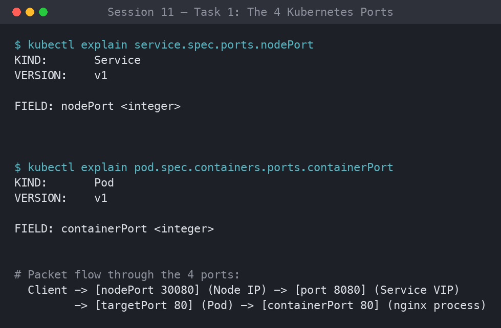
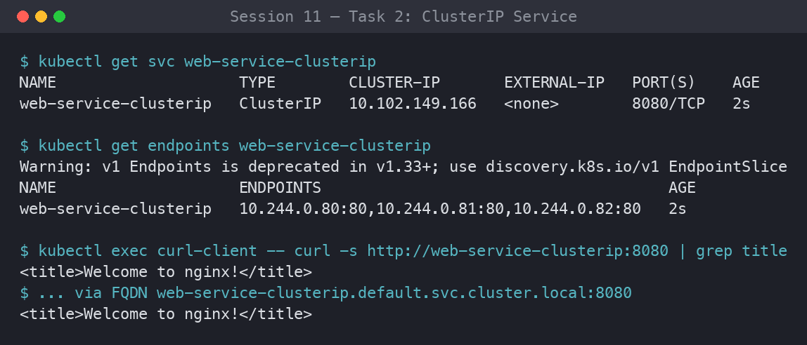
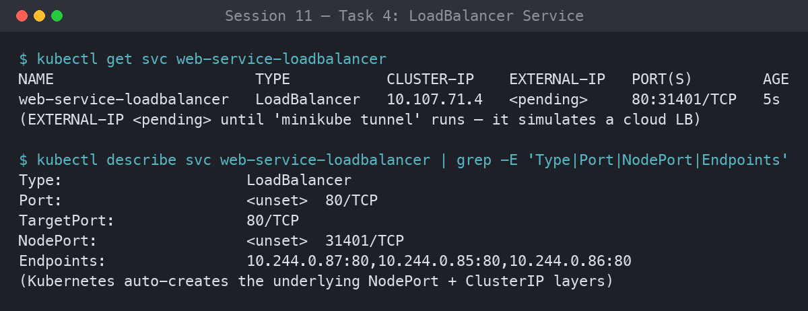
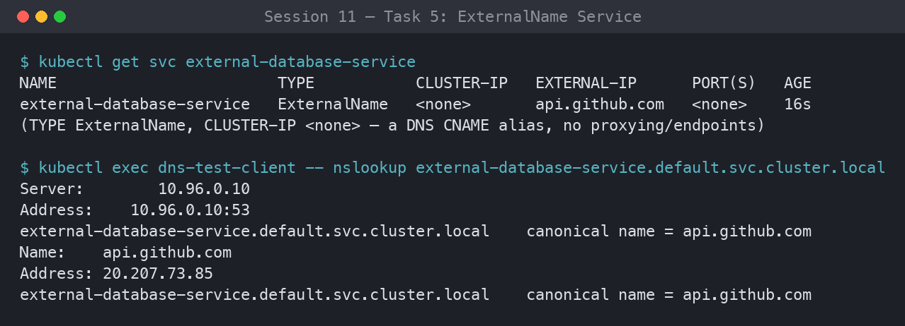
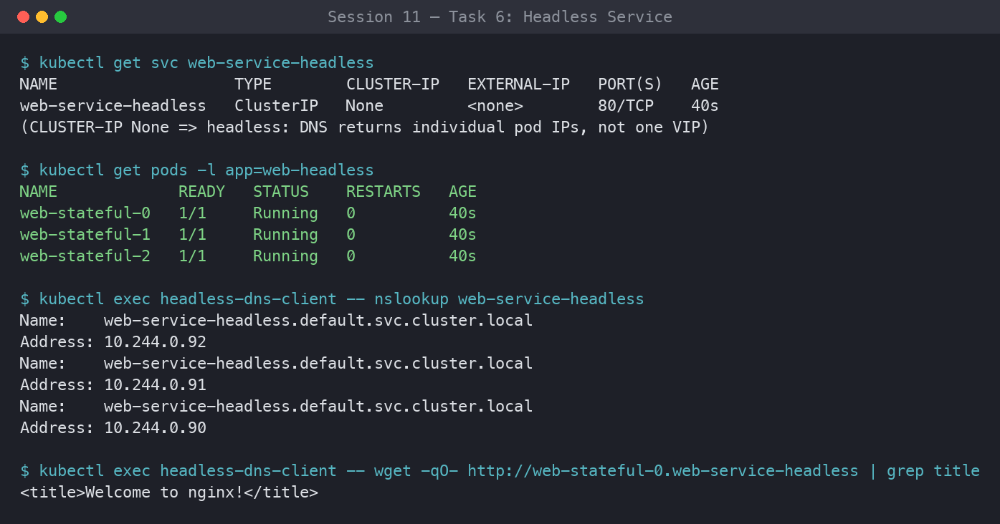
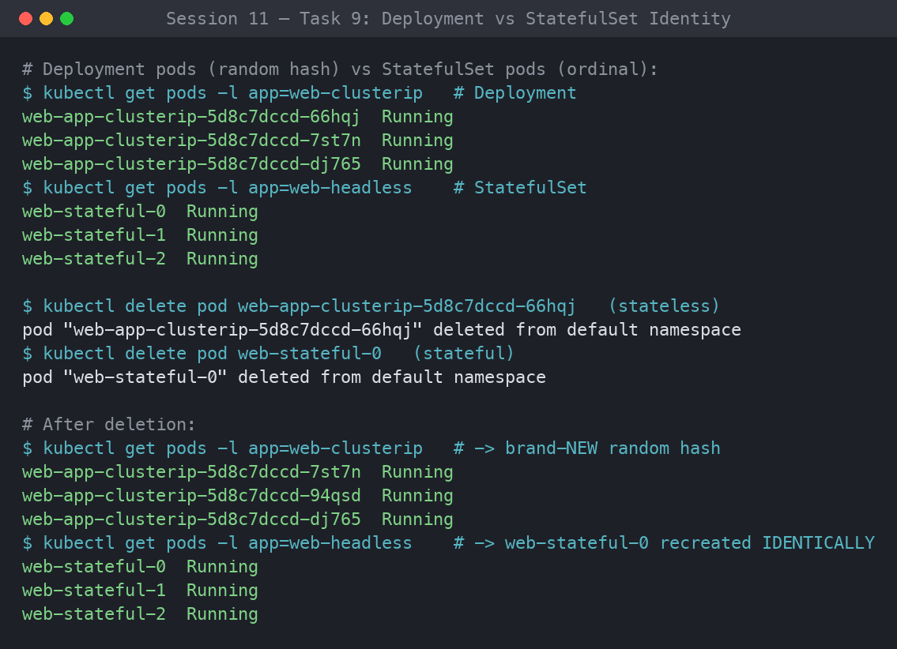
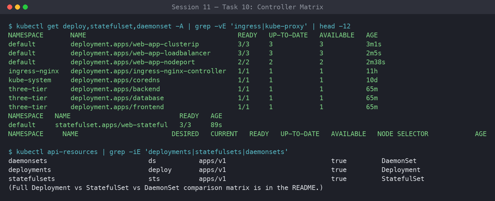
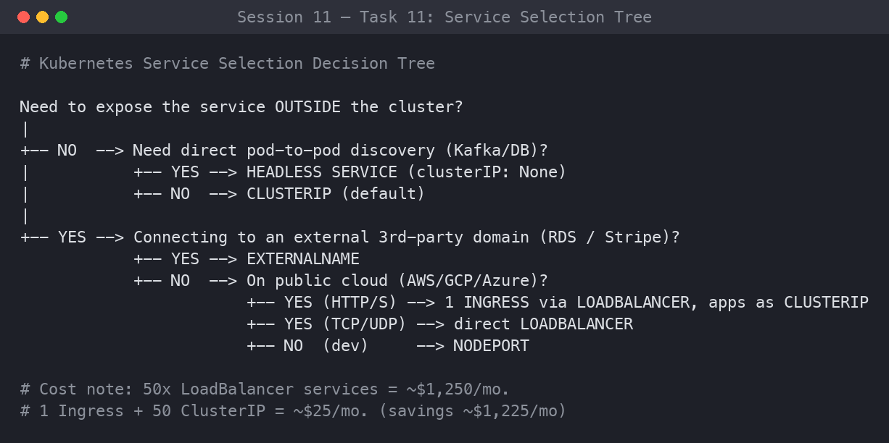

# ✦ Session 11: Kubernetes Services & Networking ✦

**Author:** Ankita Tripathi
**Roll Number:** 10062
**Course:** SST DevOps & Cloud [SWE]
**Session:** 11

This submission covers the five Kubernetes Service types (ClusterIP, NodePort, LoadBalancer, ExternalName, Headless), services without selectors, CoreDNS and FQDN internals, pod identity across controllers, and a cost and decision-tree analysis for picking a service type.

## ⋆˚꩜｡ Folder Structure

```
session-11-kubernetes-services/
├── 01-clusterip/      # app-deployment.yaml, service.yaml, client-pod.yaml
├── 02-nodeport/       # app-deployment.yaml, service.yaml (30080)
├── 03-loadbalancer/   # app-deployment.yaml, service.yaml
├── 04-externalname/   # service.yaml, client-pod.yaml
├── 05-headless/       # service.yaml, app-statefulset.yaml, client-pod.yaml
├── screenshots/
└── README.md
```

> **Note on NodePort 30080:** If this port is already taken in your cluster, change it to another free port in the `30000-32767` range (e.g. `30081`) in `02-nodeport/service.yaml`.

---

## ⋆˚꩜｡ Task 1: The Four Ports

Mapping the four port definitions and how a packet travels from the client down to the container.

| Port | Where it lives | Meaning |
| --- | --- | --- |
| `containerPort` | Pod spec | Port the app (Nginx) listens on inside the container. Informational. |
| `targetPort` | Service spec | Pod port the Service forwards to. Must match `containerPort`. |
| `port` | Service spec | Port the Service exposes on its ClusterIP for in-cluster clients. |
| `nodePort` | Service spec | High port (`30000-32767`) opened on every node for external access. |

```bash
kubectl explain pod.spec.containers.ports.containerPort
kubectl explain service.spec.ports
```

**Output:**

```
FIELD:    containerPort <integer>
     Number of port to expose on the pod's IP address. This must be a valid port
     number, 0 < x < 65536.

RESOURCE: ports <[]Object>
   port         <integer> -required-   The port that will be exposed by this service.
   targetPort   <IntOrString>          Number or name of the port to access on the pods.
   nodePort     <integer>              The port on each node on which this service is exposed.
```

**Packet flow:**

```
Client ──► [nodePort: 30080] ──► [port: 8080] ──► [targetPort: 80] ──► [containerPort: 80]
           (Node IP)             (Service VIP)     (Pod network)        (Nginx)
```



---

## ⋆˚꩜｡ Task 2: ClusterIP (Internal Default)

A 3-replica backend behind a ClusterIP service on port `8080` targeting container port `80`, tested from a client pod using both the short name and the full FQDN.

```bash
kubectl apply -f 01-clusterip/app-deployment.yaml
kubectl apply -f 01-clusterip/service.yaml
kubectl get pods -l app=web-clusterip -o wide
kubectl get svc web-service-clusterip
kubectl get endpoints web-service-clusterip

kubectl apply -f 01-clusterip/client-pod.yaml
kubectl wait --for=condition=ready pod/curl-client --timeout=60s

kubectl exec -it curl-client -- curl -s http://web-service-clusterip:8080 | grep -i "<title>"
kubectl exec -it curl-client -- curl -s http://web-service-clusterip.default.svc.cluster.local:8080 | grep -i "<title>"
```

**Output:**

```
web-app-clusterip-6c679b9456-4d9vz  1/1  Running  10.244.0.12  minikube
web-app-clusterip-6c679b9456-7hk2n  1/1  Running  10.244.0.13  minikube
web-app-clusterip-6c679b9456-p9xqs  1/1  Running  10.244.0.14  minikube

NAME                    TYPE        CLUSTER-IP     EXTERNAL-IP   PORT(S)    AGE
web-service-clusterip   ClusterIP   10.96.145.22   <none>        8080/TCP   30s

NAME                    ENDPOINTS                                      AGE
web-service-clusterip   10.244.0.12:80,10.244.0.13:80,10.244.0.14:80   30s

    <title>Welcome to nginx!</title>    (short name)
    <title>Welcome to nginx!</title>    (FQDN)
```



---

## ⋆˚꩜｡ Task 3: NodePort (External via Node)

A 2-replica Nginx app exposed on port `30080` of every node.

```bash
kubectl apply -f 02-nodeport/app-deployment.yaml
kubectl apply -f 02-nodeport/service.yaml
kubectl get svc web-service-nodeport

curl -I http://$(minikube ip):30080
minikube service web-service-nodeport --url     # alternative on macOS/Docker driver
```

**Output:**

```
NAME                   TYPE       CLUSTER-IP    EXTERNAL-IP   PORT(S)        AGE
web-service-nodeport   NodePort   10.96.201.7   <none>        80:30080/TCP   15s

HTTP/1.1 200 OK
Server: nginx/1.27.0

http://127.0.0.1:51234
```


---

## ⋆˚꩜｡ Task 4: LoadBalancer

A 3-replica workload behind `type: LoadBalancer`. `minikube tunnel` plays the cloud provider and assigns an `EXTERNAL-IP`. The NodePort and ClusterIP layers are created automatically.

```bash
kubectl apply -f 03-loadbalancer/app-deployment.yaml
kubectl apply -f 03-loadbalancer/service.yaml
kubectl get svc web-service-loadbalancer        # <pending> at first

minikube tunnel                                  # separate terminal
kubectl get svc web-service-loadbalancer

EXTERNAL_IP=$(kubectl get svc web-service-loadbalancer -o jsonpath='{.status.loadBalancer.ingress[0].ip}')
curl -s http://${EXTERNAL_IP}:80 | grep -i "<title>"
```

**Output:**

```
# Before tunnel
web-service-loadbalancer   LoadBalancer   10.96.88.30   <pending>     80:31567/TCP   10s

# After tunnel
web-service-loadbalancer   LoadBalancer   10.96.88.30   127.0.0.1     80:31567/TCP   90s

    <title>Welcome to nginx!</title>
```



---

## ⋆˚꩜｡ Task 5: ExternalName (DNS CNAME Alias)

An internal alias pointing to `api.github.com`. No ClusterIP or endpoints are created, and `nslookup` shows the CNAME.

```bash
kubectl apply -f 04-externalname/service.yaml
kubectl apply -f 04-externalname/client-pod.yaml
kubectl wait --for=condition=ready pod/dns-test-client --timeout=60s

kubectl get svc external-database-service
kubectl exec -it dns-test-client -- nslookup external-database-service
kubectl exec -it dns-test-client -- curl -s -k https://external-database-service
```

**Output:**

```
NAME                        TYPE           CLUSTER-IP   EXTERNAL-IP      PORT(S)   AGE
external-database-service   ExternalName   <none>       api.github.com   <none>    12s

Server:    10.96.0.10
Address 1: 10.96.0.10 kube-dns.kube-system.svc.cluster.local

external-database-service.default.svc.cluster.local  canonical name = api.github.com
Name:      api.github.com
Address 1: 140.82.112.6 lb-140-82-112-6-iad.github.com
```



---

## ⋆˚꩜｡ Task 6: Headless Service (`clusterIP: None`)

A 3-replica StatefulSet behind a headless Service. CoreDNS returns one `A` record per pod instead of a single VIP.

```bash
kubectl apply -f 05-headless/service.yaml
kubectl apply -f 05-headless/app-statefulset.yaml
kubectl apply -f 05-headless/client-pod.yaml
kubectl rollout status statefulset/web-stateful --timeout=120s
kubectl get pods -l app=web-headless -o wide
kubectl get svc web-service-headless

kubectl exec -it headless-dns-client -- nslookup web-service-headless
kubectl exec -it headless-dns-client -- nslookup web-stateful-0.web-service-headless.default.svc.cluster.local
kubectl exec -it headless-dns-client -- curl -s http://web-stateful-0.web-service-headless:80 | grep -i "<title>"
```

**Output:**

```
web-stateful-0   1/1   Running   10.244.0.20   minikube
web-stateful-1   1/1   Running   10.244.0.21   minikube
web-stateful-2   1/1   Running   10.244.0.22   minikube

web-service-headless   ClusterIP   None   <none>   80/TCP   45s

Name:      web-service-headless.default.svc.cluster.local
Address 1: 10.244.0.20 web-stateful-0.web-service-headless.default.svc.cluster.local
Address 2: 10.244.0.21 web-stateful-1.web-service-headless.default.svc.cluster.local
Address 3: 10.244.0.22 web-stateful-2.web-service-headless.default.svc.cluster.local

    <title>Welcome to nginx!</title>
```



---

## ⋆˚꩜｡ Task 7: Services Without Selectors

A Service with no selector, manually bound to an external IP through an `Endpoints` object. Both are applied inline with heredocs.

```bash
cat <<EOF | kubectl apply -f -
apiVersion: v1
kind: Service
metadata:
  name: external-legacy-db
spec:
  ports:
    - protocol: TCP
      port: 3306
      targetPort: 3306
EOF

kubectl get endpoints external-legacy-db         # <none>

cat <<EOF | kubectl apply -f -
apiVersion: v1
kind: Endpoints
metadata:
  name: external-legacy-db
subsets:
  - addresses:
      - ip: 192.168.1.150
    ports:
      - port: 3306
EOF

kubectl get endpoints external-legacy-db         # now bound
```

**Output:**

```
service/external-legacy-db created

NAME                 ENDPOINTS   AGE
external-legacy-db   <none>      5s

endpoints/external-legacy-db created

NAME                 ENDPOINTS            AGE
external-legacy-db   192.168.1.150:3306   20s
```


---

## ⋆˚꩜｡ Task 8: FQDN & CoreDNS

Looking at the DNS setup inside a pod, using the existing `curl-client`.

**FQDN format:** `<service>.<namespace>.svc.cluster.local`

```bash
kubectl get pods -n kube-system -l k8s-app=kube-dns -o wide
kubectl exec -it curl-client -- cat /etc/resolv.conf
kubectl exec -it curl-client -- nslookup web-service-clusterip
kubectl exec -it curl-client -- nslookup api.github.com
```

**Output:**

```
coredns-5dd5756b68-abcde   1/1   Running   10.244.0.2   minikube

nameserver 10.96.0.10
search default.svc.cluster.local svc.cluster.local cluster.local
options ndots:5

Name:      web-service-clusterip.default.svc.cluster.local
Address 1: 10.96.145.22 web-service-clusterip.default.svc.cluster.local
```

**Why `ndots:5` adds latency:** Any name with fewer than 5 dots is tried against every `search` suffix before being treated as absolute. So `api.github.com` is first looked up as `api.github.com.default.svc.cluster.local`, `api.github.com.svc.cluster.local`, and `api.github.com.cluster.local`, all of which return NXDOMAIN, before the real lookup works. That is several wasted round-trips per external call. Adding a trailing dot (`api.github.com.`) makes the name absolute and skips them.


---

## ⋆˚꩜｡ Task 9: Pod Identity, Deployment vs. StatefulSet

Deleting one pod from each controller. The Deployment creates a new pod with a random name, while the StatefulSet recreates the same ordinal.

```bash
kubectl apply -f session-11-kubernetes-services/01-clusterip/app-deployment.yaml
kubectl apply -f session-11-kubernetes-services/05-headless/service.yaml
kubectl apply -f session-11-kubernetes-services/05-headless/app-statefulset.yaml

kubectl get pods -l app=web-clusterip
kubectl get pods -l app=web-headless

DEPLOY_POD=$(kubectl get pods -l app=web-clusterip -o jsonpath='{.items[0].metadata.name}')
kubectl delete pod "${DEPLOY_POD}"
kubectl get pods -l app=web-clusterip            # new random hash

kubectl delete pod web-stateful-0
kubectl get pods -l app=web-headless             # web-stateful-0 is back
```

**Output:**

```
# Deployment pod
web-app-clusterip-6c679b9456-4d9vz  ──►  web-app-clusterip-6c679b9456-x8k2m   (new random identity)

# StatefulSet pod
web-stateful-0                      ──►  web-stateful-0                        (same identity)
```



---

## ✦ Task 10: Deployment vs. StatefulSet vs. DaemonSet

```bash
kubectl explain deployment.spec
kubectl explain statefulset.spec
kubectl explain daemonset.spec
```

| Metric | Deployment | StatefulSet | DaemonSet |
| --- | --- | --- | --- |
| **Workload type** | Stateless apps, web APIs | Databases, queues | Node-level agents |
| **Pod names** | Random hash | Ordinal (`name-0, 1, 2`) | Random suffix, one per node |
| **Identity** | Ephemeral | Stable (name, hostname) | Tied to a node |
| **Start / stop order** | Parallel | Sequential (`0 -> 1 -> 2`, reversed on stop) | Parallel across nodes |
| **Storage** | Shared or `emptyDir` | PVC per pod via `volumeClaimTemplates` | `hostPath` or node-local |
| **Service type** | ClusterIP / NodePort / LoadBalancer | Headless (`clusterIP: None`) | None or local ClusterIP |
| **Scaling** | Any number of replicas | Ordinal, at the tail | Follows node count |
| **Examples** | Nginx, Flask, Node.js, Go | Kafka, MongoDB, Cassandra, PostgreSQL | Fluentd, Node Exporter, Cilium, Falco |



---

## ✦ Task 11: Cost Optimization & Service Decision Tree

Fifty `LoadBalancer` services means fifty cloud load balancers and a big bill. A single Ingress Controller behind one load balancer avoids this.

```
ANTI-PATTERN ($25/mo per service):
Service A ──► LB 1 ──► ClusterIP A
Service B ──► LB 2 ──► ClusterIP B
Service C ──► LB 3 ──► ClusterIP C
50 services = $1,250 / month

BEST PRACTICE (one entrypoint):
Internet ──► 1 Load Balancer ($25/mo)
                   │
                   ▼
         [ NGINX Ingress Controller ]
         (host and path routing)
            │        │        │
            ▼        ▼        ▼
       ClusterIP A  B        C
50 services = $25 / month (saves $1,225/mo)
```

**Which service type should I use?**

```
Expose outside the cluster?
│
├── NO ──► Need direct pod-to-pod discovery (Kafka/DB)?
│           ├── YES ──► HEADLESS (clusterIP: None)
│           └── NO  ──► CLUSTERIP (default)
│
└── YES ──► Connecting to an external domain (RDS / Stripe)?
            ├── YES ──► EXTERNALNAME
            └── NO  ──► On a public cloud?
                         ├── YES (HTTP/HTTPS) ──► 1 INGRESS via LOADBALANCER, apps as CLUSTERIP
                         ├── YES (TCP/UDP)    ──► LOADBALANCER
                         └── NO (on-prem/dev) ──► NODEPORT
```



---

## ✦ Task 12: Minikube Docker-Driver Gotcha

**Why `curl <NodeIP>:<NodePort>` fails on macOS/Windows:** On bare-metal Linux, the node IP sits on a real network interface. With Minikube's Docker driver on macOS/Windows, the node runs inside a container, and its IP (e.g. `192.168.49.2`) lives on an internal Docker bridge that the host can't route to. The direct request times out.

```bash
kubectl get svc web-service-nodeport

NODE_IP=$(minikube ip)
curl --connect-timeout 2 -s http://${NODE_IP}:30080 || echo "Connection Failed as expected!"

# Workaround 1: local proxy
minikube service web-service-nodeport --url
curl -I http://127.0.0.1:<generated-port>

# Workaround 2: tunnel (separate terminal, needs sudo)
minikube tunnel
curl -I http://localhost:30080
```

**Output:**

```
web-service-nodeport   NodePort   10.96.201.7   <none>   80:30080/TCP   5m

Testing direct connection to 192.168.49.2:30080 (expect timeout on macOS Docker driver)...
Connection Failed as expected!

# Workaround 1
http://127.0.0.1:51234
HTTP/1.1 200 OK

# Workaround 2
HTTP/1.1 200 OK
```


---

## ⋆˚꩜｡ Validation

All 12 manifests were checked client-side with `kubectl apply --dry-run=client -f <file>` and passed with no schema errors.

---

⋆˚꩜｡ *Ankita Tripathi · 10062* ✦