**Session:** 12 - Kubernetes Ingress, ConfigMaps & Secrets

### Task 1: ConfigMap — Storing Plain-Text Configuration

- **Description:** Create and inspect a ConfigMap to store application configuration.

- **Commands to Run:**
    
    ```bash
    cat app-config.yaml
    kubectl apply -f app-config.yaml
    kubectl get configmap yatri-app-config
    kubectl describe configmap yatri-app-config
    kubectl get configmap yatri-app-config -o jsonpath='{.data.ENVIRONMENT}'
    echo ""
    ```
    
- **Output:**
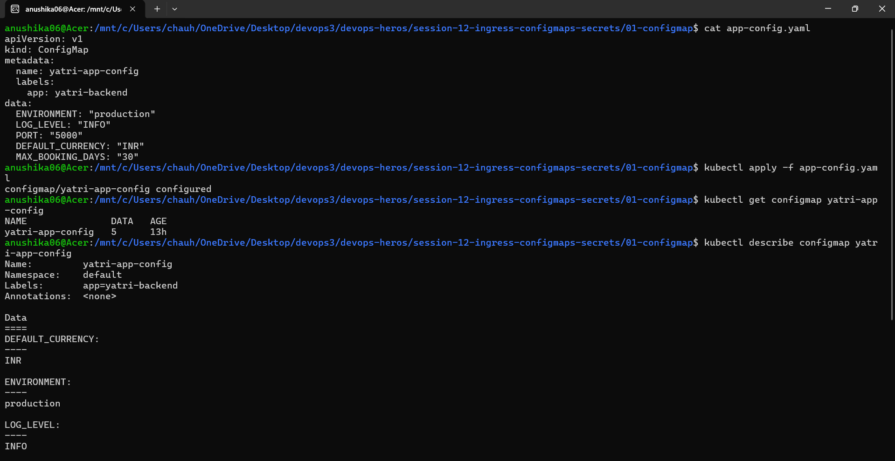
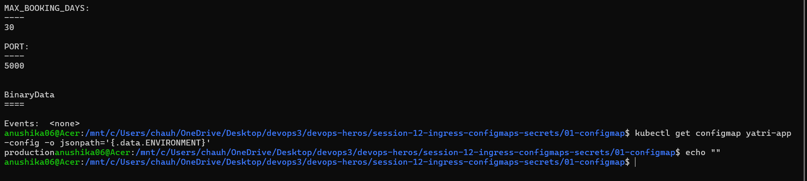

---

### Task 2: Secret — Storing Sensitive Database Credentials

- **Description:** Encode and store sensitive credentials using Kubernetes Secrets, and understand the difference between `echo` and `echo -n`.

- **Commands to Run:**
    
    ```bash
    echo "mypassword" | base64
    echo -n "mypassword" | base64
    cat secret.yaml
    kubectl apply -f db-secret.yaml
    kubectl get secret yatri-db-secret
    kubectl describe secret yatri-db-secret
    kubectl get secret yatri-db-secret -o jsonpath='{.data.POSTGRES_PASSWORD}' | base64 --decode
    echo ""
    ```
    
- **Output:**
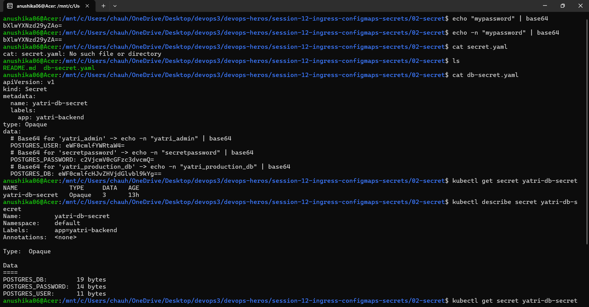
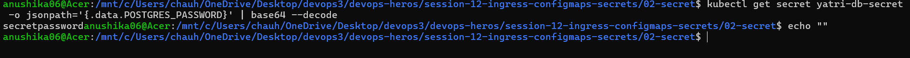

---

### Task 3: Deploy the Backend — Inject ConfigMap + Secret as Environment Variables

- **Description:** Deploy the backend application and inject configuration values from the ConfigMap and Secret as environment variables.

- **Commands to Run:**
    
    ```bash
    cat backend.yaml
    kubectl apply -f backend.yaml
    kubectl get pods -l app=yatri-backend -w
    kubectl exec -it deployment/yatri-backend -- env | grep -E "ENVIRONMENT|LOG_LEVEL|DEFAULT_CURRENCY|POSTGRES"
    ```
    
- **Output:**
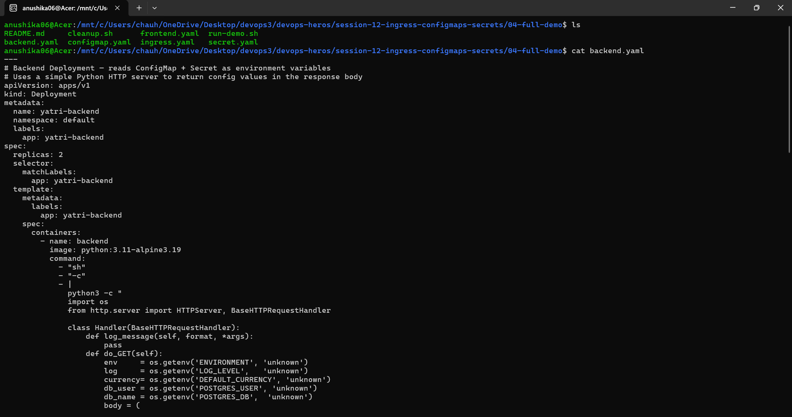
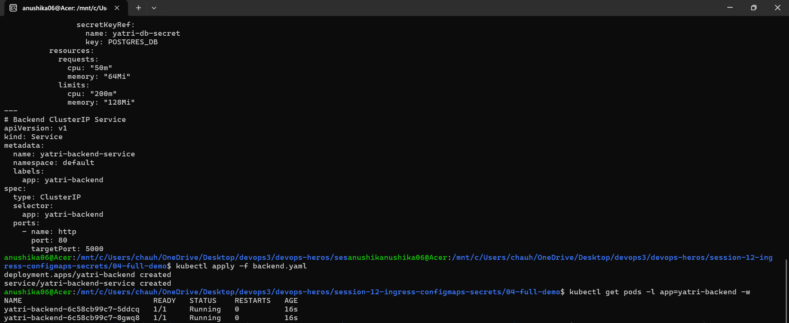
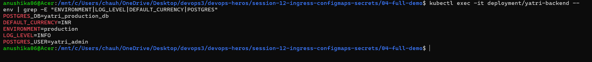
---

### Task 4: Deploy the Frontend

- **Description:** Deploy the frontend application and verify its running status.

- **Commands to Run:**
    
    ```bash
    kubectl apply -f frontend.yaml
    kubectl get pods -l app=yatri-frontend
    kubectl get svc yatri-frontend-service yatri-backend-service
    ```
    
- **Output:**
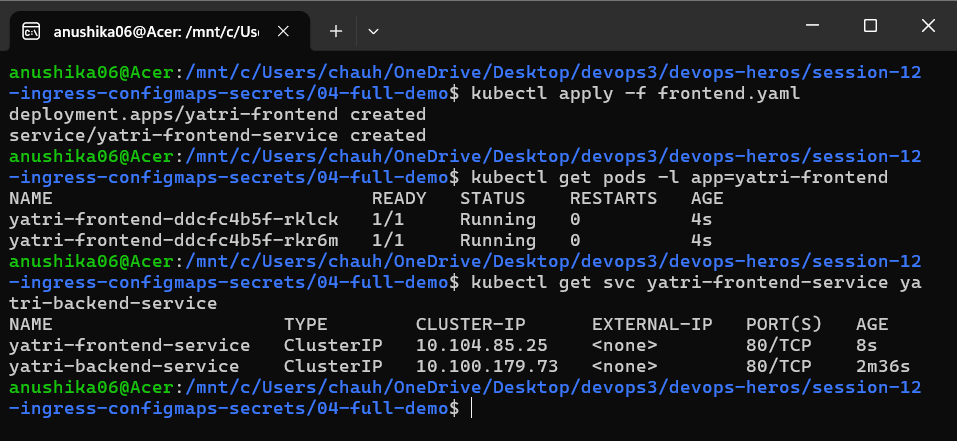

---

### Task 5: Ingress — One Entry Point for Both Services

- **Description:** Enable the NGINX Ingress Controller and configure an Ingress resource to route traffic to both the frontend and backend services based on paths.

- **Commands to Run:**
    
    ```bash
    minikube addons enable ingress
    kubectl get pods -n ingress-nginx
    cat ingress.yaml
    kubectl apply -f ingress.yaml
    kubectl get ingress yatri-ingress
    kubectl describe ingress yatri-ingress
    ```
    
- **Output:**
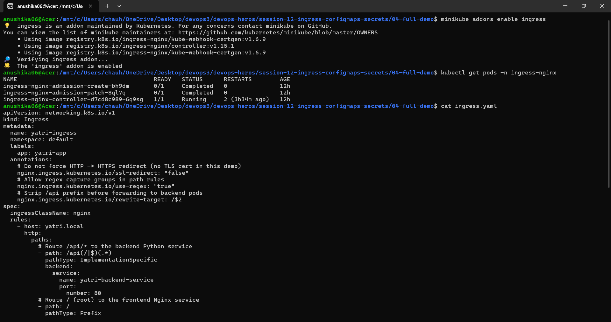
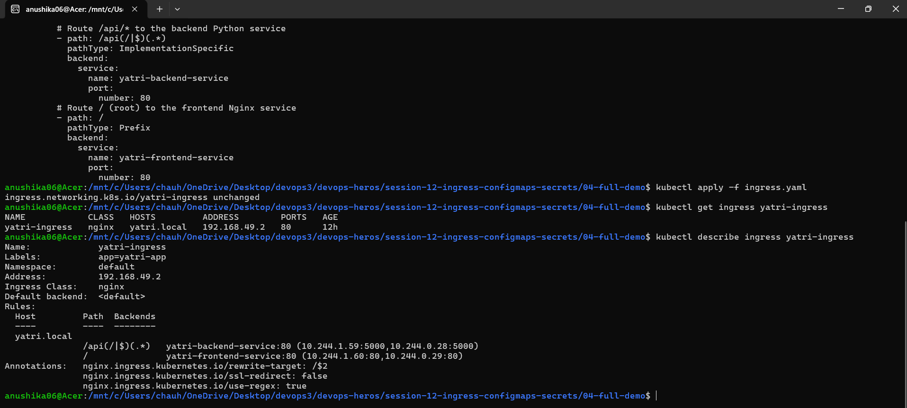

---

### Task 6: Test the Routing on Your Cloud Instance

- **Description:** Verify that the Ingress correctly routes traffic to the root path and API path using a single IP address.

- **Commands to Run:**
    
    ```bash
    INGRESS_IP=$(kubectl get ingress yatri-ingress -o jsonpath='{.status.loadBalancer.ingress[0].ip}')
    echo "Ingress IP: ${INGRESS_IP}"
    INGRESS_IP=$(minikube ip)
    echo "Ingress IP: ${INGRESS_IP}"
    curl -s -H "Host: yatri.local" http://${INGRESS_IP}/ | grep -i "<title>"
    curl -s -H "Host: yatri.local" http://${INGRESS_IP}/api/
    ```
    
- **Output:**
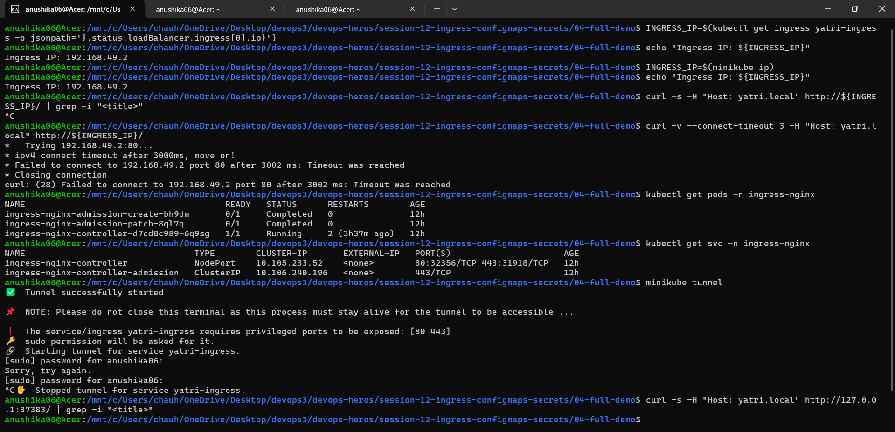
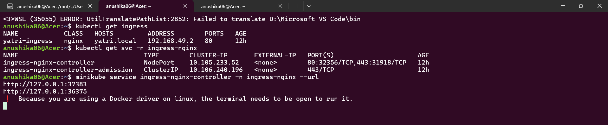
---

### Task 7: See the Full Picture — All Resources at Once

- **Description:** View all created resources for the application including ConfigMaps, Secrets, Pods, Services, and Ingress.

- **Commands to Run:**
    
    ```bash
    kubectl get configmap yatri-app-config
    kubectl get secret    yatri-db-secret
    kubectl get pods -l app=yatri-frontend
    kubectl get pods -l app=yatri-backend
    kubectl get svc yatri-frontend-service yatri-backend-service
    kubectl get ingress yatri-ingress
    ```
    
- **Output:**
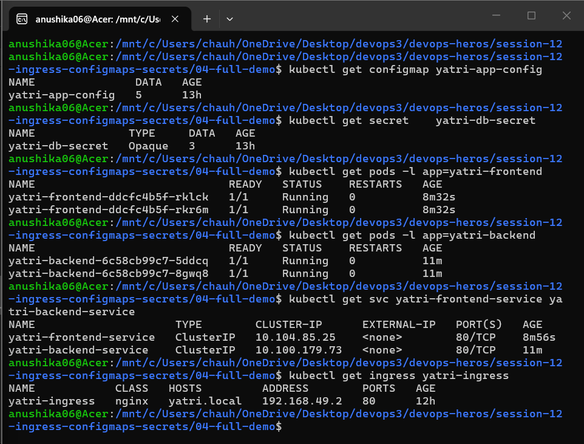

---

### Task 8: The Newline Bug — Live Debugging Drill

- **Description:** Understand the impact of trailing newlines when encoding secrets and learn the correct way to encode using base64.

- **Commands to Run:**
    
    ```bash
    cat ../troubleshooting/secret-base64-gotcha.md
    echo "secretpassword" | base64
    echo "c2VjcmV0cGFzc3dvcmQK" | base64 --decode
    echo -n "secretpassword" | base64
    ```
    
- **Output:**
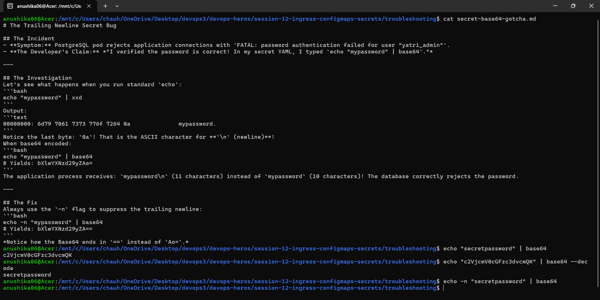

---

### Task 9: What Happens When You Update a ConfigMap?

- **Description:** Learn how to update a ConfigMap and trigger a rolling restart so the running pods pick up the new configuration values.

- **Commands to Run:**
    
    ```bash
    kubectl patch configmap yatri-app-config --type merge -p '{"data":{"ENVIRONMENT":"staging"}}'
    kubectl exec -it deployment/yatri-backend -- env | grep ENVIRONMENT
    kubectl rollout restart deployment/yatri-backend
    kubectl rollout status deployment/yatri-backend
    kubectl exec -it deployment/yatri-backend -- env | grep ENVIRONMENT
    kubectl patch configmap yatri-app-config --type merge -p '{"data":{"ENVIRONMENT":"production"}}'
    kubectl rollout restart deployment/yatri-backend
    ```
    
- **Output:**
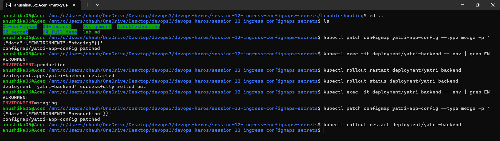
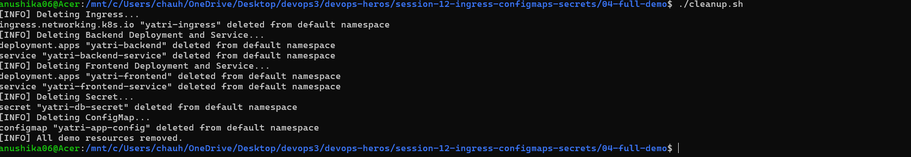
---

### Notes

#### 1. NGINX Ingress Controller
The NGINX Ingress Controller is a specialized load balancer and routing manager for Kubernetes environments. Built around the popular NGINX web server, it serves as the cluster's main entry point for external HTTP/HTTPS traffic. It continuously monitors the cluster for Ingress resources and dynamically updates its NGINX configuration to route traffic to the correct pods, providing features like SSL/TLS termination, URL rewrites, and name-based virtual hosting.

#### 2. Difference Between Ingress and Ingress Controller
- **Ingress (The Rules):** An Ingress is just a Kubernetes API object—a configuration file or blueprint. It defines the routing rules (e.g., "route `/api` to the backend service and `/` to the frontend service"). On its own, an Ingress resource does absolutely nothing.
- **Ingress Controller (The Engine):** The Ingress Controller is the actual running application (like NGINX, Traefik, or HAProxy) that implements those rules. It reads the Ingress blueprints and configures the underlying load balancer to route the traffic accordingly. You must have an Ingress Controller running in your cluster for Ingress rules to work.
