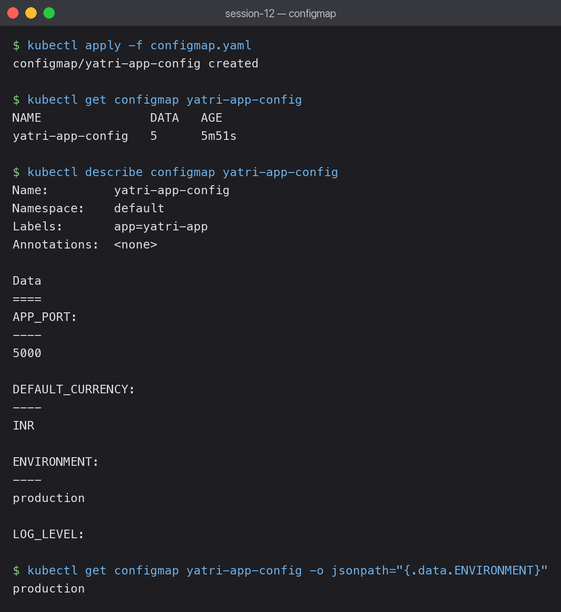

# 01 — ConfigMap

A ConfigMap stores non-sensitive configuration as key-value pairs, separate from the
container image. The same image can then run in dev, staging and production with different
ConfigMaps.



## Applied

```bash
kubectl apply -f configmap.yaml
kubectl get configmap yatri-app-config
```

```text
NAME               DATA   AGE
yatri-app-config   5      0s
```

`DATA 5` confirms all five keys were stored.

## Inspecting the stored keys

```bash
kubectl describe configmap yatri-app-config
```

```text
Name:         yatri-app-config
Namespace:    default
Labels:       app=yatri-app

Data
====
APP_PORT:
----
5000

DEFAULT_CURRENCY:
----
INR

ENVIRONMENT:
----
production

LOG_LEVEL:
----
INFO
```

Unlike a Secret, `describe` prints ConfigMap values in full — there is nothing to hide.
Note the keys come back alphabetically sorted, not in the order written in the YAML.

## Reading one key directly

```bash
kubectl get configmap yatri-app-config -o jsonpath='{.data.ENVIRONMENT}'
```

```text
production
```

`jsonpath` is the clean way to pull a single value out for use in a script, instead of
grepping through `describe` output.

## What I learned

- ConfigMap values must be strings. `APP_PORT: "5000"` needs the quotes — a bare `5000`
  is parsed as an integer and rejected.
- A ConfigMap is namespaced. A pod can only mount one from its own namespace.
- ConfigMaps are not for secrets. They are stored in plain text and anyone with read access
  to the namespace can see every value.
