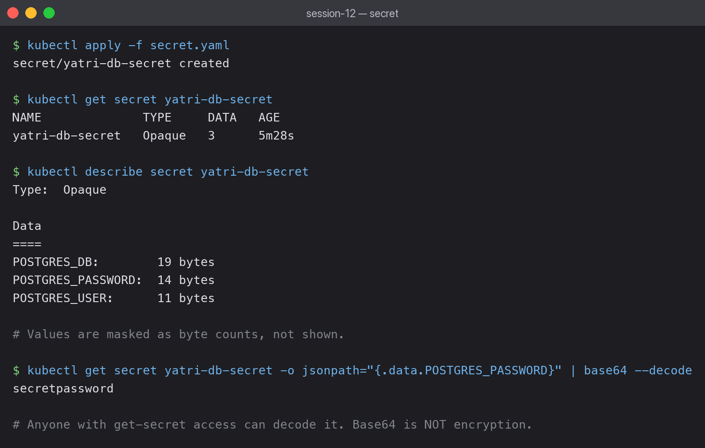
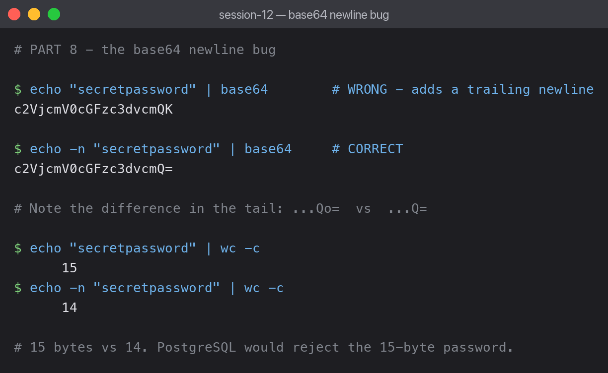

# 02 — Secret

A Secret holds sensitive values. It looks like a ConfigMap, but values are base64-encoded
and masked in command output.



## Applied

```bash
kubectl apply -f secret.yaml
kubectl get secret yatri-db-secret
```

```text
NAME              TYPE     DATA   AGE
yatri-db-secret   Opaque   3      0s
```

`Opaque` is the default type, meaning arbitrary user-defined data. Other types exist for
specific purposes (`kubernetes.io/tls`, `kubernetes.io/dockerconfigjson`).

## Values are masked in describe

```bash
kubectl describe secret yatri-db-secret
```

```text
Type:  Opaque

Data
====
POSTGRES_DB:        19 bytes
POSTGRES_PASSWORD:  14 bytes
POSTGRES_USER:      11 bytes
```

Only byte counts are shown. Someone reading over your shoulder learns nothing.

## But base64 is NOT encryption

```bash
kubectl get secret yatri-db-secret -o jsonpath='{.data.POSTGRES_PASSWORD}' | base64 --decode
```

```text
secretpassword
```

One command reveals the password in cleartext. This is the single most important point of
the session: **a Secret is obfuscated, not encrypted.** Anyone who can run
`kubectl get secret` in the namespace can read every value.

Real protection comes from other mechanisms:

- **RBAC** — restrict who can `get` secrets at all.
- **Encryption at rest** — configure the API server to encrypt Secrets in etcd, otherwise
  they sit there base64-encoded.
- **External stores** — Vault, AWS Secrets Manager or Sealed Secrets for anything serious.

## The base64 newline bug



```bash
echo "secretpassword" | base64        # WRONG
echo -n "secretpassword" | base64     # CORRECT
```

```text
c2VjcmV0cGFzc3dvcmQK
c2VjcmV0cGFzc3dvcmQ=
```

The two outputs differ in the tail: `...Qo=` versus `...Q=`. That `o=` encodes an invisible
`\n` that `echo` appends by default. Byte counts prove it:

```bash
echo "secretpassword" | wc -c      # 15
echo -n "secretpassword" | wc -c   # 14
```

The database receives a 15-character password instead of 14 and rejects the login. The
symptom is an authentication failure that looks nothing like a formatting problem — the
YAML is valid, the Secret exists, the pod starts fine, and the credentials are simply wrong.

**Always use `echo -n` when encoding secret values.** Better still, let kubectl do it:

```bash
kubectl create secret generic yatri-db-secret \
  --from-literal=POSTGRES_PASSWORD=secretpassword
```

This encodes correctly with no manual base64 step, removing the chance of the bug entirely.

## What I learned

- `data` expects base64; `stringData` accepts plaintext and lets Kubernetes encode it.
- Masking in `describe` is a UI convenience, not a security boundary.
- This newline bug is a genuinely good interview answer, because the failure mode is so far
  removed from the cause.
