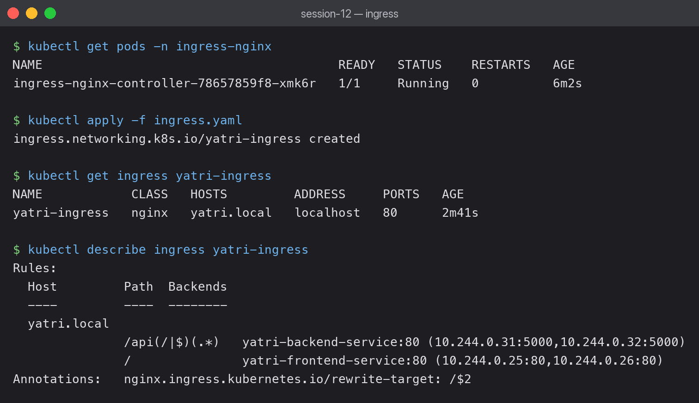
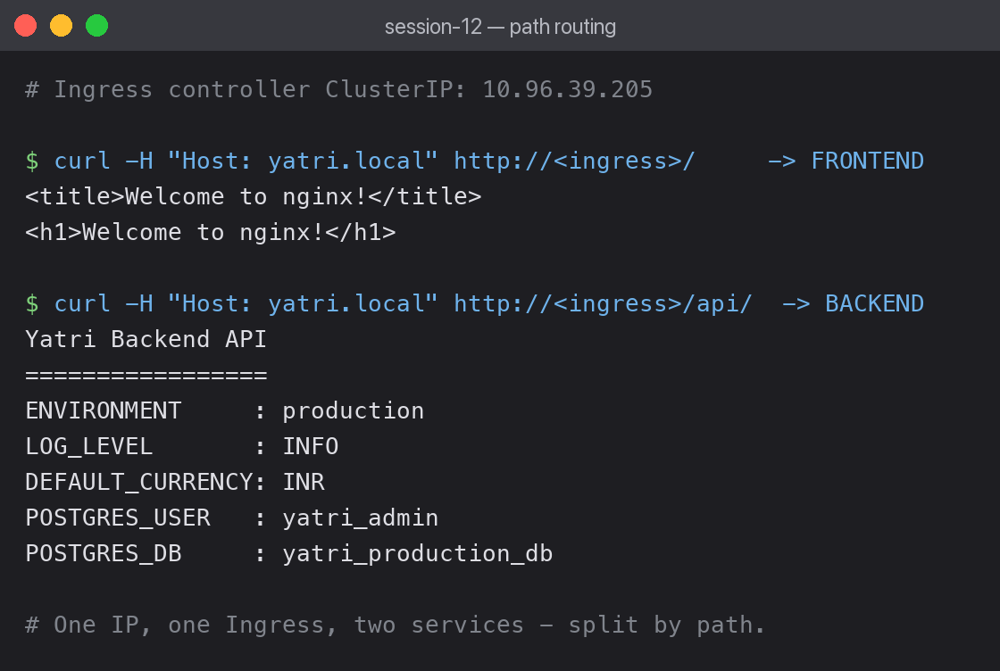

# 03 — Ingress

An Ingress routes external HTTP traffic to multiple Services through **one entry point**,
based on host and path. It needs an Ingress **controller** running in the cluster — the
Ingress object alone does nothing.



## Installing the controller

The lab says `minikube addons enable ingress`, but my cluster is not minikube, so I installed
the NGINX controller directly:

```bash
kubectl apply -f https://raw.githubusercontent.com/kubernetes/ingress-nginx/controller-v1.11.3/deploy/static/provider/kind/deploy.yaml
```

Two problems came up, both worth recording:

**1. The controller pod stayed `Pending`.**

```text
0/1 nodes are available: 1 node(s) didn't match Pod's node affinity/selector.
```

The manifest requires a node labelled `ingress-ready=true`, which my node did not have:

```bash
kubectl get deploy -n ingress-nginx ingress-nginx-controller -o jsonpath='{.spec.template.spec.nodeSelector}'
# {"ingress-ready":"true","kubernetes.io/os":"linux"}
```

Fixed by labelling the node:

```bash
kubectl label node desktop-control-plane ingress-ready=true
```

**2. The admission webhook jobs hit `ImagePullBackOff`** on this arm64 machine. Since the
webhook only validates Ingress YAML and is not needed for routing, I removed it:

```bash
kubectl delete validatingwebhookconfiguration ingress-nginx-admission
kubectl delete job -n ingress-nginx ingress-nginx-admission-create ingress-nginx-admission-patch
```

Controller then came up:

```text
NAME                                        READY   STATUS    RESTARTS   AGE
ingress-nginx-controller-78657859f8-xmk6r   1/1     Running   0          3m
```

## The Ingress object

```bash
kubectl apply -f ingress.yaml
kubectl get ingress yatri-ingress
```

```text
NAME            CLASS   HOSTS         ADDRESS     PORTS   AGE
yatri-ingress   nginx   yatri.local   localhost   80      35s
```

`ADDRESS` was empty for the first ~20 seconds, then filled in. An empty ADDRESS usually means
the controller has not picked up the Ingress yet — or that no controller is running at all.

## The routing rules resolved to real pods

```bash
kubectl describe ingress yatri-ingress
```

```text
Rules:
  Host         Path            Backends
  ----         ----            --------
  yatri.local
               /api(/|$)(.*)   yatri-backend-service:80 (10.244.0.24:5000,10.244.0.23:5000)
               /               yatri-frontend-service:80 (10.244.0.25:80,10.244.0.26:80)
Annotations:   nginx.ingress.kubernetes.io/rewrite-target: /$2
               nginx.ingress.kubernetes.io/ssl-redirect: false
               nginx.ingress.kubernetes.io/use-regex: true
```

Seeing actual pod IPs in the `Backends` column is the confirmation that matters — the Ingress
found the Services and the Services found their pods.

## Both paths work through one IP



```bash
curl -H "Host: yatri.local" http://<ingress-ip>/
```

```text
<title>Welcome to nginx!</title>
```

```bash
curl -H "Host: yatri.local" http://<ingress-ip>/api/
```

```text
Yatri Backend API
=================
ENVIRONMENT     : production
LOG_LEVEL       : INFO
DEFAULT_CURRENCY: INR
POSTGRES_USER   : yatri_admin
POSTGRES_DB     : yatri_production_db
```

Same IP, same port, two different applications — split purely by path.

The `-H "Host: yatri.local"` header is **required**. The Ingress rule is host-based, so a
request without that header does not match any rule and returns 404. In real use this would
be a DNS record; the header is how you test without one.

## How the rewrite works

```yaml
path: /api(/|$)(.*)
nginx.ingress.kubernetes.io/rewrite-target: /$2
```

The regex has two capture groups. `$2` is everything after `/api/`, so a request to
`/api/bookings` reaches the backend as `/bookings`. Without the rewrite the backend would
receive `/api/bookings` and need to know its own public prefix.

## Why Ingress instead of LoadBalancer

In session 11, exposing two services meant two LoadBalancers — two external IPs, two cloud
bills. Ingress does it with one entry point and routes internally, and adds host/path rules,
TLS termination and rewrites that a LoadBalancer cannot do.

## What I learned

- Ingress is a spec; without a controller it is inert configuration.
- `pathType: ImplementationSpecific` is what allows regex paths — `Prefix` would not.
- The backing Services stay `ClusterIP`. Ingress does not require them to be exposed.
