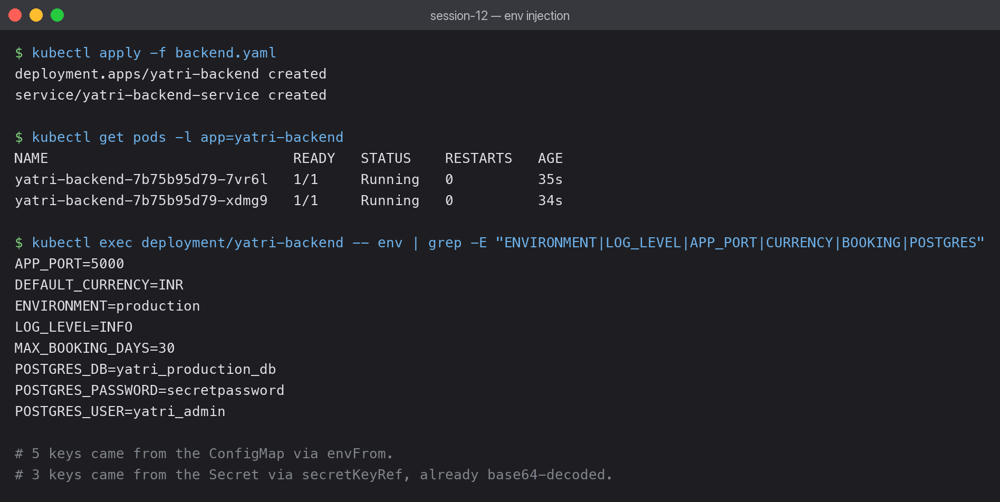
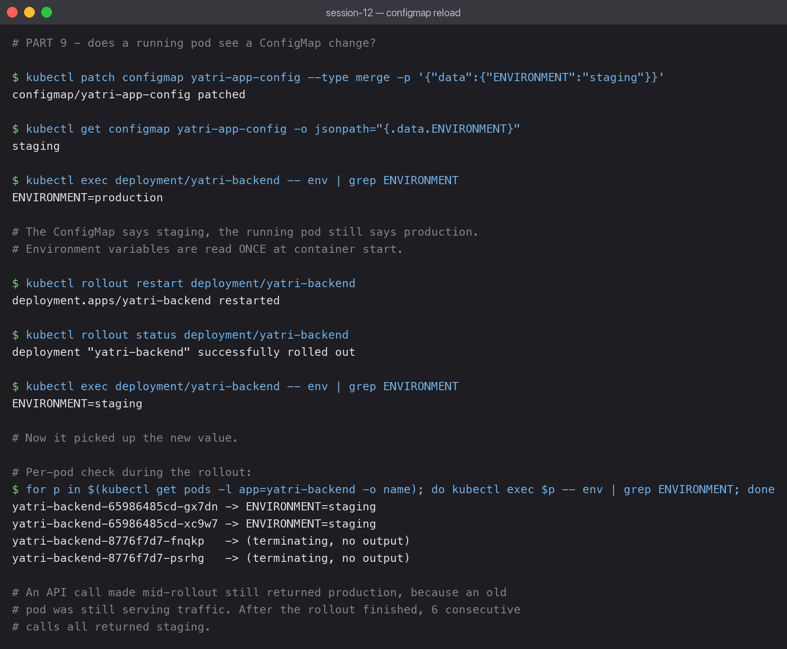

# 04 — Full Demo: ConfigMap + Secret injected into a running app

This ties the session together: a backend Deployment reads plain config from a ConfigMap and
credentials from a Secret, both as ordinary environment variables.

## envFrom vs env — two different injection styles

```yaml
# Pull ALL keys from the ConfigMap at once
envFrom:
  - configMapRef:
      name: yatri-app-config

# Pick INDIVIDUAL keys from the Secret
env:
  - name: POSTGRES_USER
    valueFrom:
      secretKeyRef:
        name: yatri-db-secret
        key: POSTGRES_USER
```

- `envFrom` is bulk — every key in the ConfigMap becomes an env var with the same name.
  Convenient, but you cannot see from the pod spec what will be injected.
- `env` + `secretKeyRef` is explicit — more lines, but the spec documents exactly which
  secret keys this container uses. That is the right trade-off for credentials.

## Proof the injection worked



```bash
kubectl exec deployment/yatri-backend -- env | grep -E "ENVIRONMENT|LOG_LEVEL|APP_PORT|CURRENCY|BOOKING|POSTGRES"
```

```text
APP_PORT=5000
DEFAULT_CURRENCY=INR
ENVIRONMENT=production
LOG_LEVEL=INFO
MAX_BOOKING_DAYS=30
POSTGRES_DB=yatri_production_db
POSTGRES_PASSWORD=secretpassword
POSTGRES_USER=yatri_admin
```

Eight variables: five from the ConfigMap, three from the Secret.

The important detail is that `POSTGRES_PASSWORD=secretpassword` appears **decoded**. The
Secret stores `c2VjcmV0cGFzc3dvcmQ=`, and Kubernetes decodes it during injection. The
application never deals with base64 — it just reads a normal environment variable.

It also shows that a Secret is only as private as the pod: anyone who can `kubectl exec`
into the container can read the password out of the environment.

## ConfigMap changes do NOT reach running pods



```bash
kubectl patch configmap yatri-app-config --type merge -p '{"data":{"ENVIRONMENT":"staging"}}'
kubectl get configmap yatri-app-config -o jsonpath='{.data.ENVIRONMENT}'   # staging
kubectl exec deployment/yatri-backend -- env | grep ENVIRONMENT            # production
```

The ConfigMap says `staging`. The running pod still says `production`.

**Environment variables are read once, when the container starts.** Changing the ConfigMap
afterwards has no effect on a running container — the variables were already baked into the
process environment at startup.

A rolling restart fixes it:

```bash
kubectl rollout restart deployment/yatri-backend
kubectl rollout status deployment/yatri-backend
kubectl exec deployment/yatri-backend -- env | grep ENVIRONMENT   # staging
```

### Something I only noticed by testing mid-rollout

An API call made *during* the rollout still returned `production`, even though
`kubectl exec deployment/...` already reported `staging`. Checking each pod individually
explained it:

```text
yatri-backend-65986485cd-gx7dn -> ENVIRONMENT=staging      (new)
yatri-backend-65986485cd-xc9w7 -> ENVIRONMENT=staging      (new)
yatri-backend-8776f7d7-fnqkp   -> (terminating)
yatri-backend-8776f7d7-psrhg   -> (terminating)
```

An old pod was still serving traffic. `kubectl exec deployment/X` picks just one pod, so it
had shown the new value while the Service was still load balancing across both generations.
After the rollout completed, six consecutive API calls all returned `staging`.

The lesson: during a rolling update both old and new config are live simultaneously. Code
has to tolerate that, and a single spot-check is not proof that a rollout has finished.

## If you need live reload

Mount the ConfigMap as a **volume** instead of using env vars. Mounted files are updated
in place (after a sync delay of up to ~60s), so an application that re-reads its config file
picks up changes without a restart. Env vars can never do this.

## Checklist

- [x] Applied `configmap.yaml`, read a key with `-o jsonpath`
- [x] Applied `secret.yaml`, decoded `POSTGRES_PASSWORD` with `base64 --decode`
- [x] Applied `backend.yaml`, verified all 8 env vars inside the pod
- [x] Applied `frontend.yaml`, confirmed both Services are `ClusterIP`
- [x] Installed the NGINX Ingress Controller, confirmed `Running`
- [x] Applied `ingress.yaml`, confirmed `ADDRESS` appeared
- [x] Tested `/` returns the nginx page via `Host: yatri.local`
- [x] Tested `/api/` returns backend config values
- [x] Demonstrated the `echo` vs `echo -n` newline bug
- [x] Rolling-restarted after a ConfigMap change and confirmed the new value
